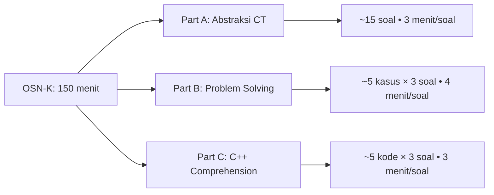

# 🏆 OSN-K Informatika Prep Master

> Repositori latihan intensif persiapan **OSN-K Informatika** dengan fokus pada 3 tipe soal: 
> **Abstraksi CT** • **Problem Solving** • **C++ Comprehension**  
> 📝 Semua soal dapat diselesaikan "di atas kertas" — tidak perlu coding!

## 📊 Format Ujian OSN-K

| Parameter | Detail |
|-----------|--------|
| **Durasi** | 2,5 jam (150 menit) |
| **Jumlah Soal** | 30–50 soal |
| **Tipe Jawaban** | Pilihan Ganda / Isian Singkat / Benar-Salah |
| **Coding Required** | ❌ Tidak perlu menulis program |
| **Metode Solusi** | ✅ "Dihitung di atas kertas" |

## 🧩 Tiga Bagian Soal OSN-K

## 📚 Mulai Belajar

| Part | Fokus | Link Masuk | Progress |
|:---:|--------|-----------|----------|
| 🔹 A | Berpikir Komputasional | [Masuk](./part-a-abstraksi-ct/) | 🟡 Draft |
| 🔹 B | Analisis Studi Kasus | [Masuk](./part-b-problem-solving/) | 🟡 Draft |
| 🔹 C | Dry Run Kode C++ | [Masuk](./part-c-cpp-comprehension/) | 🟡 Draft |

## 🎯 Simulasi Ujian
| Paket | Link | Durasi | Status |
|-------|------|--------|--------|
| Tryout #01 | [Mulai](./simulasi-osnk/paket-01/) | 150 menit | 🟡 Draft |
| Tryout #02 | [Mulai](./simulasi-osnk/paket-02/) | 150 menit | 🔒 Coming Soon |

## ⚡ Strategi Cepat
- [Manajemen Waktu 150 Menit](./strategi-ujian/manajemen-waktu-150menit.md)
- [Tips Part A: Coret yang Tidak Relevan](./strategi-ujian/teknik-mengerjakan-part-a.md)
- [Tips Part B: Tabel Trace Wajib](./strategi-ujian/teknik-mengerjakan-part-b.md)
- [Tips Part C: Dry Run Step-by-Step](./strategi-ujian/teknik-mengerjakan-part-c.md)

## 🤝 Kontribusi
Temu typo, soal kurang jelas, atau ingin tambah materi?  
👉 Baca [CONTRIBUTING.md](./CONTRIBUTING.md) atau langsung **Pull Request**!

---
> ⚠️ **Disclaimer**: Repositori ini dibuat secara independen untuk tujuan pendidikan.  
> Tidak berafiliasi resmi dengan TOKI, Kemendikbud, atau panitia OSN.  
> Selalu verifikasi format soal terbaru di sumber resmi.
