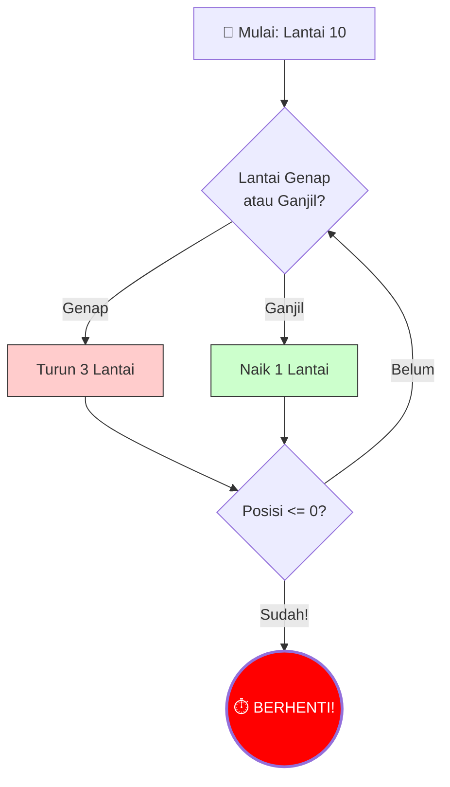

# 1. Simulasi dan *Brute Force* (Sang Pencari Super Ngotot)

Pernahkah kamu kelupaan kombinasi gembok koper atau nomor PIN HP temanmu? Apa yang biasanya kamu lakukan kalau sudah mentok? 

*Yap*, mencoba satu per satu angka dari `000` sampai `999` sampai berhasil terbuka!

Selamat, tanpa disadari, kamu baru saja mengeksekusi algoritma paling legendaris sepanjang sejarah ilmu komputer: algoritma pinggiran jalan yang disebut **Brute Force** ("Kekerasan Murni / Paksaan Kasar")!

Di OSN-K Bagian B, *Brute Force* dan *Simulasi* adalah sahabat karib utamamu. Mari kita kupas tuntas bagaimana algoritma ini bekerja dan bagaimana soal OSN sering kali menuntut kesabaranmu melacaknya di atas kertas.

---

## 🔑 A. Apa Itu Brute Force?

**Brute force adalah sebuah teknik penyelesaian masalah dengan cara mengevaluasi / mencoba SEMUA KEMUNGKINAN yang ada, satu per satu, tanpa menggunakan trik pintar sedikit pun.**

- **Kelebihan utama Brute Force:** Dijamin 100% PASTI menemukan solusi (kalau solusinya memang ada). Karena kamu mengecek semuanya, tidak mungkin ada yang terlewat.
- **Kelemahan terbesar:** Lambat... Super sangat lambat. Kalau kemungkinan kombinasinya ada jutaan, komputermu bisa melongo seharian menghitungnya. (Ini berhubungan dengan konsep Batas Waktu / *Time Limit* yang akan kita bahas di modul akhir).

### Studi Kasus: Detektif Pasangan Bebek 🦆
Misalkan Pak Dengklek punya 5 ekor bebek bernomor dada: `[2, 7, 11, 15, 3]`. 
Pak Dengklek ingin tahu: *"Apakah ada DUA ekor bebek (yang berbeda) yang kalau nomornya dijumlahkan hasilnya pas bernilai `14`?"*

Bagaimana otak seorang programmer *Brute Force* menyelesaikan ini?
Ia akan menggunakan konsep algoritma **Nested Loop** (Perulangan di dalam perulangan / Nyoba pasangin semua orang satu-satu):

1. Bebek Ke-1 (`2`) mengajak gabung Bebek lainnya:
   - `2 + 7 = 9` (Bukan 14, Gagal ❌)
   - `2 + 11 = 13` (Bukan 14, Gagal ❌)
   - `2 + 15 = 17` (Bukan 14, Gagal ❌)
   - `2 + 3 = 5` (Bukan 14, Gagal ❌)
2. Bebek Ke-2 (`7`) mengajak gabung Bebek lainnya (tanpa mundur ajak mundur si 2 lagi):
   - `7 + 11 = 18` (Gagal ❌)
   - `7 + 15 = 22` (Gagal ❌)
   - `7 + 3 = 10` (Gagal ❌)
3. Bebek Ke-3 (`11`) mengajak gabung bebek sisa:
   - `11 + 15 = 26` (Gagal ❌)
   - **`11 + 3 = 14` (COCOK! KETEMU! DITERIMA! ✅)**

Algoritma sang programmer akan berhenti kegirangan dan menjawab: **BENAR**.

Inilah murni yang akan kamu lakukan di ujian OSN-K Part B. Kamu TIDAK diminta membuat aplikasi C++, melainkan disuruh membaca paragraf panjang proses pemilihan kriteria, dan **menggeser penamu di atas kertas untuk menyimulasikan setiap kemungkinan seperti orang bodoh yang super teliti**.

---

## ⚙️ B. Apa Itu Simulasi (Simulation)?

Kata kunci di OSN-K Part B yang paling difavoritkan adalah soal bertipe **Simulasi**.

Dalam soal simulasi, pembuat soal tidak menuntutmu jenius merancang trik rumus logaritma atau graf. Pembuat soal justru memberikanmu sebuah Instruksi Mesin Rinci (Buku Manual) dan berkata: *"Nih, kerjain persis ikuti langkah 1 sampai 10 di cerita ini tanpa membantah. Laporkan hasil jadinya setelah jalan seharian!"*

> **Tugas utamamu di sini adalah Menjadi Compiler Manusia**. Jangan memprotes aturan permainannya, kerjakan saja satu demi satu kelakuannya dengan menuliskan *Tracing* (Jejak Variabel) di secarik kertas buram.

### Contoh Studi Kasus Ringan: Bola Jatuh Tangga
Di dalam bahasa OSN-K, soal simulasi biasanya berbentuk seperti ini:
> *Sebuah bola dijatuhkan dari lantai 10. Setiap detik, jika bola berada di lantai genap, bola akan melorot turun 3 lantai ke bawah. Tapi anehnya jika bola berada jatuh menyentuh di lantai ganjil, bola akan mendadak terbang mantul naik ke atas 1 lantai. Proses ini berhenti mutlak saat bola mencapai lantai 0 atau minus.*
> *Pertanyaan OSN: Setelah berapa detik bola berhenti memantul-mantul?*

**📖 Cara Membaca Diagram Alir Simulasi:**
- Kotak awal (🏀) menunjukkan posisi start bola. Lalu mesin masuk ke **Belah Ketupat B** (Percabangan Pendeteksi Genap/Ganjil).
- Jika Genap → ambil jalur merah (turun 3). Jika Ganjil → ambil jalur hijau (naik 1).
- Setelah bergerak, mesin mengecek **Belah Ketupat E**: "Apakah sudah menyentuh lantai 0 atau minus?" Jika belum, panah memutar balik ke Belah Ketupat B (Loop!). Jika sudah, panah menembus ke Lingkaran Merah (BERHENTI).
- Jumlah putaran yang kamu lacak di kertas = Jawaban detik total di OSN-K.

**Cara Menjadi Compiler Manusia (Simulasi Atas Kertas):**
Jangan panik, buka kertas sisa hitungan, dan buat Tabel "Detik" dan "Posisi Lantai" secara *brute force manual*:

*   **Detik ke-0:** Lokasi `10` (Genap). 
*   **Detik ke-1:** Karena lantai Genap, disuruh turun 3 $\rightarrow$ `10 - 3 = 7`. Dia ada di lantai `7` (Ganjil).
*   **Detik ke-2:** Karena lantai Ganjil, pental naik 1 $\rightarrow$ `7 + 1 = 8`. Dia ada di lantai `8` (Genap).
*   **Detik ke-3:** Karena Genap, terjun bebas 3 $\rightarrow$ `8 - 3 = 5` (Ganjil).
*   **Detik ke-4:** Ganjil, lompat naik $\rightarrow$ `5 + 1 = 6` (Genap).
*   **Detik ke-5:** Genap, anjlok 3 $\rightarrow$ `6 - 3 = 3` (Ganjil).
*   **Detik ke-6:** Ganjil, mantul $\rightarrow$ `3 + 1 = 4` (Genap).
*   **Detik ke-7:** Genap, terjun bebas $\rightarrow$ `4 - 3 = 1` (Ganjil).
*   **Detik ke-8:** Ganjil, mantul akhir hayat $\rightarrow$ `1 + 1 = 2` (Genap).
*   **Detik ke-9:** Genap, terjun bebas meroket $\rightarrow$ `2 - 3 = -1` (Brem! Syarat Berhenti!). Mesin OFF.

Jadi, ketika kertas soal memintamu menjawab "Berapa detik total permainan ini berjalan?". Kamu dengan mantap bisa menyilang opsi **9**! Mudah, kan? Ini murni mengandalkan ketelitianmu mencatat tanpa salah perhitungan receh.

---

## 💡 C. Kapan Kamu Boleh Pakai Brute Force vs. Harus Cari Rumus Pintar (Trik Kapasitas OSN-K)

Ini The Golden Rule (Aturan Emas Rahasia) di Olimpiade Komputer Kertas (OSN-K):
Kamu harus tahu batas *"Capeknya Mencoret Kertas"*.

- Jika pilihan yang mau disimulasikan Brute Force itu **sedikit** (Contoh: Mencari 1 jawaban di antara 10 bola, mensimulasikan gerak kelelawar di 15 kotak jalan): **LAKUKAN SIMULASI MANUAL!** Pakai metode Brute Force. Jawabannya pasti dijamin paling akurat, dan nggak buang waktu *overthinking* merumuskan teori canggih.
- JIKA ternyata rentang angkanya **gila super banyak** (Contoh: Mengulang proses robot 2 Juta Kali, Menjumlahkan deret bilangan sampai nilai Suku ke 40.000): **HARAM** hukumnya bagi tanganmu mencoba simulasi Brute Force di atas kertas! (Ini adalah jebakan pembuat soal agar waktumu habis 2.5 jam cuma buat satu nomor. Di momen inilah kamu HARUS berhenti mencatat dan menggunakan Modul-modul di Part A kemarin untuk menemukan "Pola Pintar"-nya!

---

## ⚔️ Simulasi Tarung: Bedah 300 Soal Simulasi & Brute Force

Siap melatih daya tahan *Compiler Manusia*-mu tanpa salah catat? Hajar 300 bank soal Tracing Simulasi Array dan Vektor ini secara progresif:

1. **[Latihan Soal Part 1 (Soal 1-50)](./01-simulasi-dan-brute-force/01-simulasi-dan-brute-force-soal-part-1.md)**
2. **[Latihan Soal Part 2 (Soal 51-100)](./01-simulasi-dan-brute-force/01-simulasi-dan-brute-force-soal-part-2.md)**
3. **[Latihan Soal Part 3 (Soal 101-150)](./01-simulasi-dan-brute-force/01-simulasi-dan-brute-force-soal-part-3.md)**
4. **[Latihan Soal Part 4 (Soal 151-200)](./01-simulasi-dan-brute-force/01-simulasi-dan-brute-force-soal-part-4.md)**
5. **[Latihan Soal Part 5 (Soal 201-250)](./01-simulasi-dan-brute-force/01-simulasi-dan-brute-force-soal-part-5.md)**
6. **[Latihan Soal Part 6 (Soal 251-300)](./01-simulasi-dan-brute-force/01-simulasi-dan-brute-force-soal-part-6.md)**

---

Selanjutnya, kita akan berpindah ke mentalitas lain. Kadang-kadang, mengecek semua hal pakai Brute Force itu buang waktu (meskipun angkanya kecil). Apakah ada cara untuk *"Hanya mengambil apa yang kelihatan paling rakus saat ini"* biar cepat beres? 

Mari berkenalan dengan **Modul 02: [Algoritma Greedy](./02-algoritma-greedy.md)**!

---
[Kembali ke Indeks Part B](./README.md)

---

### 📝 Latihan Soal Tracing
Sudah paham teorinya? Uji ketajaman matamu di sini:
👉 **[Bank Soal Modul 01: Simulasi & Brute Force (300 Soal)](./01-simulasi-dan-brute-force/README.md)**
