# 2. Algoritma Greedy (Otak Sang Perampok Cerdas tapi Naif)

Kalau *Brute Force* (di modul sebelumnya) adalah tipe detektif sabar yang mengecek seluruh seluk-beluk kemungkinan berjam-jam lamanya...

Maka **Algoritma Greedy (Rakus)** adalah tipe perampok panik yang dikejar anjing polisi: *"Bodo amat sama masa depan! Sikat aja barang paling mahal yang ada persis di depan mata SEKARANG JUGA, masukkan ke karung, lalu kabur!"* 🏃‍♂️💨💸

Di buku teks Ilmu Komputer, Algoritma Greedy didefinisikan sebagai:
`Pendekatan pemecahan masalah dengan selalu memilih Opsi Paling Menguntungkan (Lokal Optimal) SAAT INI, tanpa memikirkan konsekuensi jangka panjangnya.`

Harapannya? Kalau kita selalu serakah di setiap langkah kecil, barangkali total kumulatif hasil di akhir nanti otomatis ikut menjadi yang Paling Mantap Se-dunia (Global Optimal).

---

## 💰 A. Studi Kasus Sukses: Sang Kasir Pintar (Coin Change)

Bayangkan kamu adalah kasir Alfamart di negara Indonesia. Total belanjaan pelanggan `Rp 37.000,-`. Pembeli memberikan uang selembar `Rp 100.000,-`.
Tugasmu adalah memberikan kembalian `Rp 63.000,-` menggunakan PECAHAN MATA UANG YANG PALING MINIMAL JUMLAH LEMBARNYA (Biar dompet pelanggan nggak meledak ketebalan).

**Bagaimana Otak Kasir Serakah (Greedy) bekerja tanpa sadar?**
1. **Target:** Cari lembaran rupiah dengan nominal yang *SE-RAKSASA* mungkin tapi masih muat (kurang dari sama dengan 63k).
2. Lihat laci: Ada `100k, 50k, 20k, 10k, 5k, 2k, 1k`.
3. Kasir yang rakus akan langsung menyabet **Lembar 50k** pertama! (Kenapa nggak ambil 100k? Karena kegedean, nanti nombok).
4. Sisa Kembalian sekarang = `63k - 50k = 13k`.
5. Di sisa `13k`, kasir rakus lagi. Pilih nominal terbesar yang masih di bawah / sama dengan 13k. Dia sabet selembar **10k**.
6. Sisa akhir = `13k - 10k = 3k`.
7. Si Rakus menyabet selembar **2k** (Tersisa `1k`).
8. Dan terakhir si rakus menyabet koin **1k**. Selesai. Lunas! 0.

**Total Lembaran = 4 buah lembar mata uang (50k, 10k, 2k, 1k).**
Ternyata strategi si Kasir Rakus ini jenius! Secara matematika, tidak ada cara lain di muka bumi ini yang bisa memberi kembalian `63k` rupiah dengan mata uang Indonesia yang jumlah lembarannya KURANG dari 4 lembar. Strategi *Greedy* dinobatkan sebagai pahlawan solusi tercepat tanpa mikir njelimet.

---

## 📅 B. Studi Kasus Rakus yang Hakiki: Penjadwalan Rapat Bebek (Activity Selection)

Soal klasik langganan Olimpiade Komputer (termasuk OSN):
> *Pak Dengklek pusing karena ada 5 ketua Genk Bebek yang mengajukan Proposal Rapat Pemuda hari ini di Balai Desa. Tapi Balai Desa cuma ada 1 ruangan!*
> Berikut jadwal permohonan pesanan mereka (Jam Mulai - Jam Selesai):
> - Bebek A: Jam 08.00 - 11.00
> - Bebek B: Jam 09.00 - 10.00
> - Bebek C: Jam 10.00 - 12.00
> - Bebek D: Jam 11.00 - 14.00
> - Bebek E: Jam 13.00 - 15.00
> 
> *Pak Dengklek ingin menerima SEBANYAK MUNGKIN proposal rapat agar dia dicap Kepala Desa rajin. Siapa saja yang proposalnya dia terima? (Ingat, waktu tidak boleh tabrakan/tumpang tindih)*

**Cara Greedy Melibas Soal Ini:**
Apa patokan 'Rakus' yang harus digunakan Pak Dengklek?
1. *Pilih rapat yang Mulainya paling pagi?* (Salah. Kalau Bebek A (08-11), maka Bebek B otomatis ketolak padahal B cuma 1 jam!).
2. *Pilih rapat dengan Durasi paling singkat?* (Juga salah, ini bisa menjebak jika durasi pendek itu menghalangi dua jadwal di kiri kanannya).

Kunci *Hacker Competitive Programming* untuk algoritma Activity Selection adalah:
**TIDAK PEDULI KAPAN MULAINYA, SELALU PILIH RAPAT YANG "JAM KELAR-NYA" PALING CEPAT!** (Biar Balai Desanya cepat kosong lagi).

```mermaid
gantt
    title Jadwal Rapat Bebek (Greedy: Pilih Selesai Tercepat)
    dateFormat HH:mm
    axisFormat %H:%M
    
    section ✅ Diterima
    Bebek B (09-10)   :active, b, 09:00, 10:00
    Bebek C (10-12)   :active, c, 10:00, 12:00
    Bebek E (13-15)   :active, e, 13:00, 15:00
    
    section ❌ Ditolak
    Bebek A (08-11)   :crit, a, 08:00, 11:00
    Bebek D (11-14)   :crit, d, 11:00, 14:00
```

**📖 Cara Membaca Diagram Timeline Greedy:**
- Diagram ini menampilkan **garis waktu horizontal** dari jam 08:00 hingga 15:00. Setiap batang warna mewakili satu proposal rapat bebek.
- **Batang Hijau (Diterima)**: Ini adalah rapat-rapat yang dipilih si Greedy. Perhatikan bahwa bar hijau **TIDAK PERNAH SALING TUMPANG TINDIH** satu sama lain.
- **Batang Merah (Ditolak)**: Rapat-rapat ini ditolak karena waktu mulainya menabrak jadwal rapat yang sudah diterima. Lihat bar Bebek A yang merangsek masuk ke jadwal B, dan bar Bebek D yang menabrak jadwal C.
- **Strategi Greedy**: Selalu pilih bar yang **ujung kanannya (jam selesai) paling pendek/cepat** di antara semua bar yang belum dipilih dan tidak bentrok.

Mari kita terapkan *Sortir Kerakusan Berdasarkan Jam Bubar Cepat*:
- **Pilih Bebek B (09.00 - 10.00)**. Selesai paling awal! Mantap. *+1 Rapat.*
- Coba lirik Bebek A (Kelar jam 11). Gagal, dia mulai jam 8 nabrak ruangan.
- **Pilih Bebek C (10.00 - 12.00)**. Mulai pas jam 10 pas si B bubar. Sah! *+1 Rapat.*
- Cek Bebek D (11.00 - 14.00). Ditolak. Karena dia minta mulai jam 11 pas ruangan masih disewa Bebek C.
- **Pilih Bebek E (13.00 - 15.00)**. Sah! Bisa di-acc. Ruangan kosong sejak jam 12. *+1 Rapat.*

Total **3 Rapat** berhasil disetujui (Rapat B, C, dan E). Pak Dengklek dinobatkan Kepala Desa terhebat pakai taktik Greedy.

---

## 🚫 C. TRAGEDI GREEDY: Kapan Si Rakus Ini Nyungsep Gagal Total?

Ingat petuah ini baik-baik kalau lagi tes OSN-K:
**"Greedy itu cepat dan egois. Saking egoisnya, ia sering buta sama masa depan yang jauh lebih cerah."**

Kapan sifat tamak / egois ini membunuh jawaban yang benar?
Mari kita tengok kasus *Kasir Alfamart (Coin Change)* tadi, namun kali ini kita pindah ke Negara Planet Namec.

Di Planet Namec, pecahan uang kuno mereka sangat aneh, terdiri dari koin nominal: `[1k, 3k, 4k]`.
Suatu hari, ada pelanggan minta uang kembali **6k**. Kasir yang tamak akan langsung beraksi:

**Skenario Si Kasir Greedy (Salah):**
1. Ambisi utama: Sabet koin terbesar yang muat! Sabetan pertama jatuh ke koin **`4k`**. Sisa bayar: `6k - 4k = 2k`.
2. Laci berikutnya: 3k gak muat buat bayar 2k. Akhirnya cuma ambil **`1k`**. Sisa: `1k`.
3. Laci terakhir: Ambil **`1k`** lagi lunas. 
Total Si Kasir Rakus mengeluarkan dompet: **3 Keping Koin** (yakni 4 + 1 + 1). Sangat sombong dan optimis.

**Skenario Si Pemikir Genius Masa Depan (Solusi Sejati):**
Sang manajer toko jenius melihat itu geleng-geleng. *"Kamu ngapain bawa 3 keping berat amat! Lihat tuh, laci kita punya kepingan 3k!"* 
Manajer tidak rakus mencabut pecahan terbesar `4k`. Dia justru ikhlas mengambil pecahan sedang:
- Keping **3k** pertama. Sisa = `3k`.
- Keping **3k** kedua. Lunas 6k.
Total sang manajer hanya menggunakan **2 KEPING KOIN**!!! (Jauh lebih meringankan dompet saku ketimbang hasil 3 Keping kasir Greedy).

**FATAL ERROR!!! ALGORITMA GREEDY TERBUKTI MENEMUKAN JAWABAN YANG SALAH (3 koin, padahal rekor juara aslinya 2 koin).**

Kenapa ini terjadi?
Karena sistem bilangan koin Planet Namec `(1, 3, 4)` tidak mematuhi hukum *Canonical Coin System* seperti kelipatan Rupiah. Si Greedy yang maksa ngambil "potongan kue paling montok duluan" (Keping 4k) ternyata menggerogoti struktur, menyisakan "potongan receh-receh sampah" yang membebani tas di akhir.

**LALU BAGAIMANA CARA KOMPUTER MENYELESAIKAN SOAL PECAHAN PLANET NAMEC INI KALAU GREEDY GAGAL TOTAL?**

Nah... Inilah pintu gerbang menuju bos terakhir ilmu algoritma Olimpiade Informatika! Saat *Greedy* gagal karena tidak memikirkan tabungan masa depan yang optimal, lahirlah Ilmu Siluman tingkat tinggi yang disebut dengan...

**[Modul 04: Dynamic Programming Dasar (Seni Mengingat Masa Lalu) -> Nanti akan kita bahas di bab depan!]** 🤯

---

## ⚔️ Simulasi Tarung: Bedah 300 Soal Algoritma Greedy

Siap melatih insting Rakus-mu dalam menyabet *Jadwal Rapat Balai Desa* (Activity Selection) dan menjebak jebakan *Coin Change Planet Namec*? Hajar 300 soal khusus algoritma tamak ini:

1. **[Latihan Soal Part 1 (Soal 1-50)](./02-algoritma-greedy/02-algoritma-greedy-soal-part-1.md)**
2. **[Latihan Soal Part 2 (Soal 51-100)](./02-algoritma-greedy/02-algoritma-greedy-soal-part-2.md)**
3. **[Latihan Soal Part 3 (Soal 101-150)](./02-algoritma-greedy/02-algoritma-greedy-soal-part-3.md)**
4. **[Latihan Soal Part 4 (Soal 151-200)](./02-algoritma-greedy/02-algoritma-greedy-soal-part-4.md)**
5. **[Latihan Soal Part 5 (Soal 201-250)](./02-algoritma-greedy/02-algoritma-greedy-soal-part-5.md)**
6. **[Latihan Soal Part 6 (Soal 251-300)](./02-algoritma-greedy/02-algoritma-greedy-soal-part-6.md)**

---

Tapi sebelum menyentuh ilmu sihir tingkat tinggi macam Dynamic Programming, mari kita turun takhta sebentar mengulas algoritma paling basic yang sering ditugaskan gurumu: mencetak urutan rangking absen siswa di modul selanjutnya: 

⏩ **[Modul 03: Pencarian dan Pengurutan (Searching & Sorting Manual)](./03-pencarian-dan-pengurutan.md)**

---
[< Modul Part B Sebelumnya: Brute Force](./01-simulasi-dan-brute-force.md)
[< Kembali ke Indeks Part B](./README.md)

---

### 📝 Latihan Soal Tracing
Sudah paham teorinya? Uji ketajaman matamu di sini:
👉 **[Bank Soal Modul 02: Algoritma Greedy (300 Soal)](./02-algoritma-greedy/README.md)**
