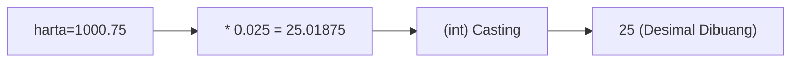
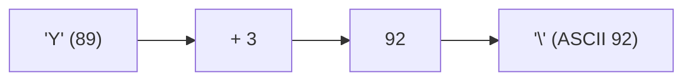
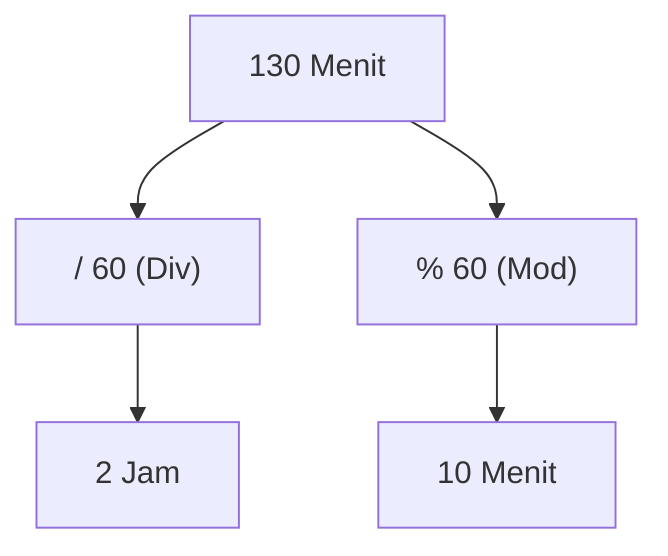
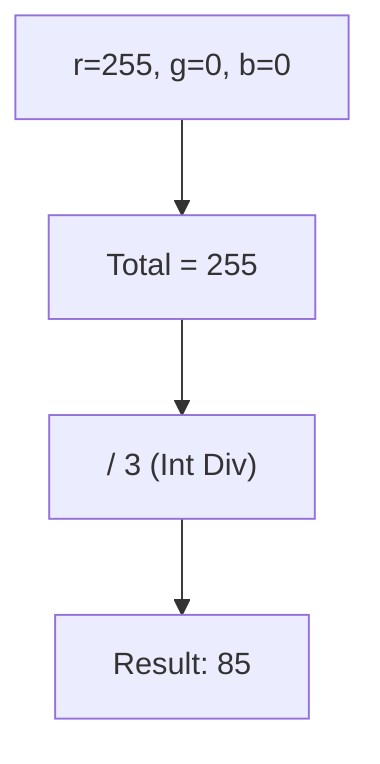
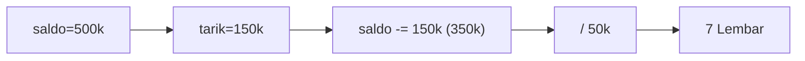
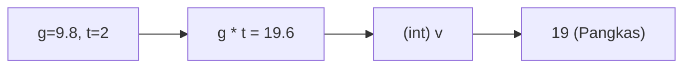
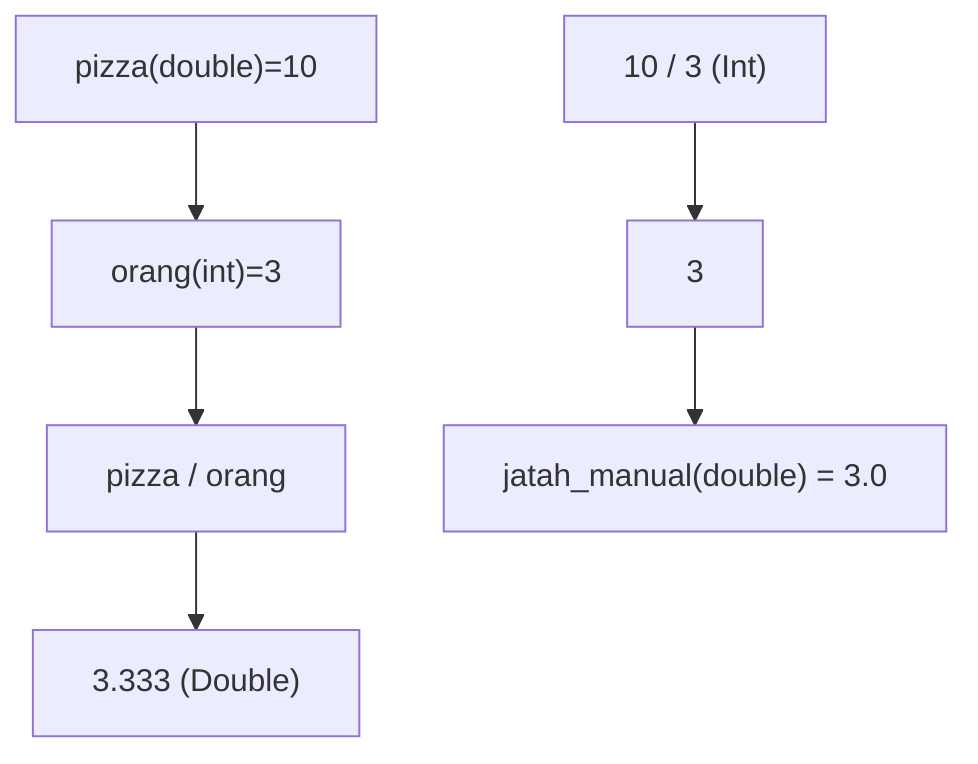
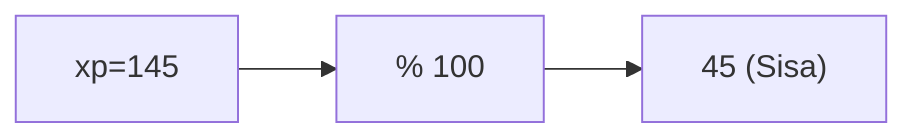
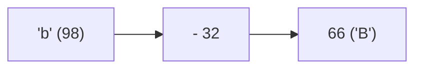
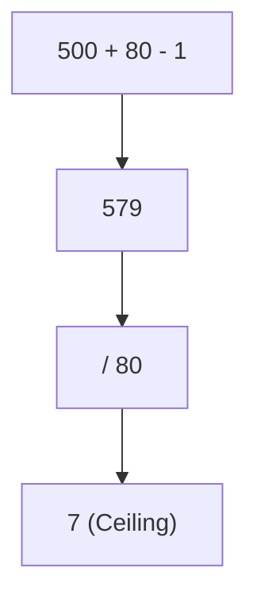

🔙 **[Kembali ke Daftar Soal](./README.md)**

---

# Latihan Soal Part C - Modul 01 - Set 01 (Premium Edition)

---

### Soal 1: Zakat Maal (Jebakan Truncation)
```cpp
// Skenario: Menghitung Zakat 2.5% dari harta
double harta = 1000.75;
int zakat_bulat = (int)(harta * 0.025);
```
**Pertanyaan:**
1. Berapakah nilai akhir dari `zakat_bulat`?
2. Mengapa angka di belakang koma menghilang sepenuhnya?

<details>
<summary><b>Klik untuk Lihat Jawaban & Diagnosis</b></summary>

**Mermaid Flowchart:**


**Jawaban:**
1. **25**
2. Karena hasil perkalian `double` dipaksa masuk ke loker `int` lewat *explicit casting* `(int)`.

**📖 Analisis Mendalam:**
Meskipun hasil aslinya adalah `25.01875`, C++ tidak melakukan pembulatan ke atas (round). Perintah `(int)` adalah perintah "pemangkasan" brutal. Apapun yang ada di belakang koma langsung dipotong.
</details>

---

### Soal 2: Caesar Cipher (Perputaran ASCII)
```cpp
// Skenario: Menggeser huruf 'Y' sebanyak 3 langkah
char huruf = 'Y';
char hasil = huruf + 3;
```
**Pertanyaan:**
1. Karakter apakah yang tersimpan di variabel `hasil`? (Gunakan tabel ASCII mental: X=88, Y=89, Z=90).
2. Apa yang terjadi jika kita menjumlahkan `char` dengan `int`?

<details>
<summary><b>Klik untuk Lihat Jawaban & Diagnosis</b></summary>

**Mermaid Flowchart:**


**Jawaban:**
1. **'\\'** (Backslash) atau karakter dengan kode ASCII **92**.
2. Terjadi **Type Promotion**: `char` naik kasta jadi `int` saat dijumlahkan.

**📖 Analisis Mendalam:**
Banyak siswa mengira C++ akan otomatis kembali ke 'A' (Wrap around). **TIDAK!** Tanpa logika modulo, C++ akan terus menambah angka ASCII-nya. Setelah 'Z' (90), ada '[' (91) dan '\' (92).
</details>

---

### Soal 3: Parkir Mall (Modulo Bertingkat)
```cpp
// Skenario: Konversi 130 menit ke Jam dan Sisa Menit
int total_menit = 130;
int jam = total_menit / 60;
int sisa_menit = total_menit % 60;
```
**Pertanyaan:**
1. Berapakah nilai `jam`?
2. Berapakah nilai `sisa_menit`?

<details>
<summary><b>Klik untuk Lihat Jawaban & Diagnosis</b></summary>

**Mermaid Flowchart:**


**Jawaban:**
1. **2**
2. **10**

**📖 Analisis Mendalam:**
Ini adalah penggunaan standar `/` untuk mencari "berapa kali muat" dan `%` untuk mencari "sisanya". 130 dibagi 60 adalah 2 sisa 10.
</details>

---

### Soal 4: Presisi Warna (Integer Division Artifact)
```cpp
// Skenario: Mengubah RGB ke Grayscale sederhana
int r = 255, g = 0, b = 0;
int gray = (r + g + b) / 3;
```
**Pertanyaan:**
1. Berapakah nilai `gray`?
2. Jika kita meredupkan warna menjadi `r=2, g=0, b=0`, berapakah hasil `gray`?

<details>
<summary><b>Klik untuk Lihat Jawaban & Diagnosis</b></summary>

**Mermaid Flowchart:**


**Jawaban:**
1. **85**
2. **0** (Bukan 0.66!)

**📖 Analisis Mendalam:**
Pada kasus kedua, `(2+0+0) / 3` menghasilkan `2/3`. Karena keduanya `int`, hasilnya adalah `0`. Ini sering menyebabkan "hitam total" pada pengolahan citra jika tidak hati-hati dengan tipe data.
</details>

---

### Soal 5: Saldo ATM (Sisa Saku)
```cpp
// Skenario: Tarik uang 150rb, sisa di bank?
int saldo = 500000;
int tarik = 150000;
saldo -= tarik;
int lembar_50rb = saldo / 50000;
```
**Pertanyaan:**
1. Berapakah nilai `saldo` setelah penarikan?
2. Berapakah nilai `lembar_50rb`?

<details>
<summary><b>Klik untuk Lihat Jawaban & Diagnosis</b></summary>

**Mermaid Flowchart:**


**Jawaban:**
1. **350000**
2. **7**

**📖 Analisis Mendalam:**
Operator `-=` singkatan dari `saldo = saldo - tarik`. Pembagian akhir mencari jumlah lembaran uang 50-ribuan yang bisa didapat dari sisa saldo.
</details>

---

### Soal 6: Fisika: Jatuh Bebas (Casting Effect)
```cpp
// v = g * t, g=9.8, t=2
double g = 9.8;
int t = 2;
int v = g * t;
```
**Pertanyaan:**
1. Berapakah nilai `v`? (Hati-hati, bukan 19.6!)
2. Apa yang terjadi pada desimalnya?

<details>
<summary><b>Klik untuk Lihat Jawaban & Diagnosis</b></summary>

**Mermaid Flowchart:**


**Jawaban:**
1. **19**
2. Dibuang (truncated).

**📖 Analisis Mendalam:**
Hasil perkalian adalah `19.6`. Namun karena variabel `v` bertipe `int`, batin compiler akan membuang `.6` tersebut tanpa ampun.
</details>

---

### Soal 7: Pizza Party (Double vs Int)
```cpp
double pizza = 10;
int orang = 3;
double jatah_cerdas = pizza / orang;
double jatah_manual = 10 / 3;
```
**Pertanyaan:**
1. Berapakah nilai `jatah_cerdas`?
2. Berapakah nilai `jatah_manual`?

<details>
<summary><b>Klik untuk Lihat Jawaban & Diagnosis</b></summary>

**Mermaid Flowchart:**


**Jawaban:**
1. **3.333...**
2. **3.0**

**📖 Analisis Mendalam:**
Pada `jatah_cerdas`, karena `pizza` adalah `double`, maka `orang` ikut dipromosikan jadi `double`. Pada `jatah_manual`, `10 / 3` adalah pembagian antar `int` yang menghasilkan `3`, baru kemudian diubah jadi `3.0` saat masuk ke `double`.
</details>

---

### Soal 8: XP Leveling (Progress Bar)
```cpp
int xp_sekarang = 145;
int batas_level = 100;
int persen_progres = xp_sekarang % batas_level;
```
**Pertanyaan:**
1. Berapakah nilai `persen_progres`?
2. Logic modul ini sering digunakan untuk apa dalam game?

<details>
<summary><b>Klik untuk Lihat Jawaban & Diagnosis</b></summary>

**Mermaid Flowchart:**


**Jawaban:**
1. **45**
2. Mengetahui sisa XP di level sekarang setelah melewati ambang batas level sebelumnya.
</details>

---

### Soal 9: Secret ASCII (Uppercase Trick)
```cpp
char huruf_kecil = 'b'; // ASCII 98
char huruf_besar = huruf_kecil - 32;
```
**Pertanyaan:**
1. Karakter apakah `huruf_besar`?
2. Mengapa angka **32** sangat sakral dalam tabel ASCII?

<details>
<summary><b>Klik untuk Lihat Jawaban & Diagnosis</b></summary>

**Mermaid Flowchart:**


**Jawaban:**
1. **'B'** (ASCII 66)
2. Karena 32 adalah jarak tetap antara versi huruf kecil dan huruf besar di tabel ASCII.
</details>

---

### Soal 10: Kapasitas Lift (Ceiling Logic)
```cpp
int berat_total = 500;
int kapasitas_orang = 80;
int butuh_berapa_kali = (berat_total + kapasitas_orang - 1) / kapasitas_orang;
```
**Pertanyaan:**
1. Berapakah nilai `butuh_berapa_kali`?
2. Rumus di atas adalah trik C++ untuk melakukan apa?

<details>
<summary><b>Klik untuk Lihat Jawaban & Diagnosis</b></summary>

**Mermaid Flowchart:**


**Jawaban:**
1. **7**
2. **Ceiling (Pembulatan ke Atas)** tanpa menggunakan library `<cmath>`.

**📖 Analisis Mendalam:**
Biasa `500/80` adalah 6.25 (butuh 7 kali naik). Rumus `(A + B - 1) / B` adalah trik cepat OSN untuk membulatkan ke atas menggunakan pembagian integer.
</details>
