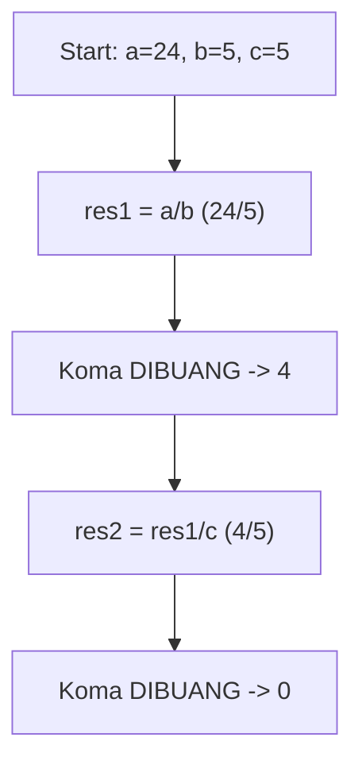
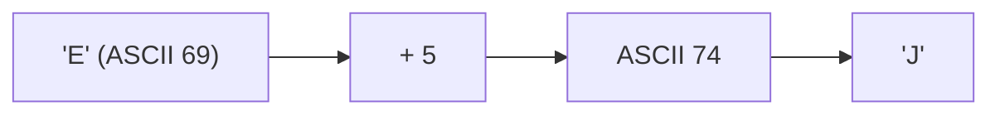
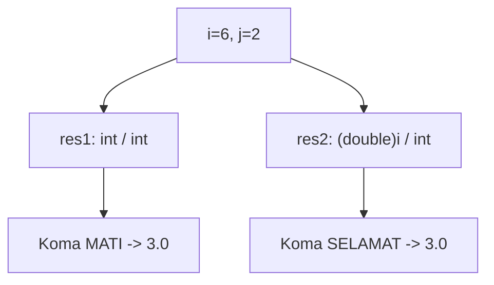
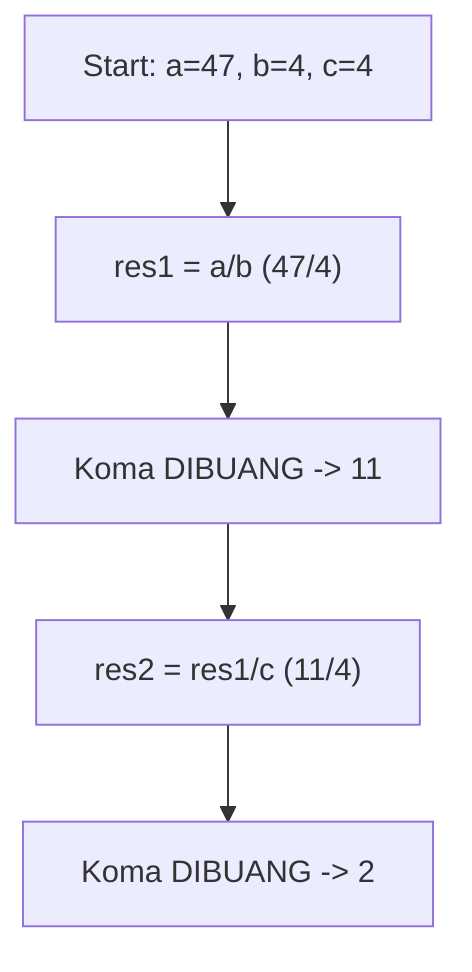
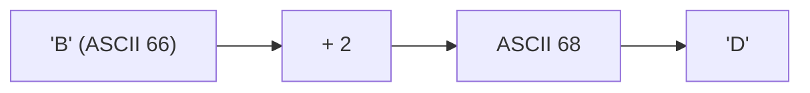
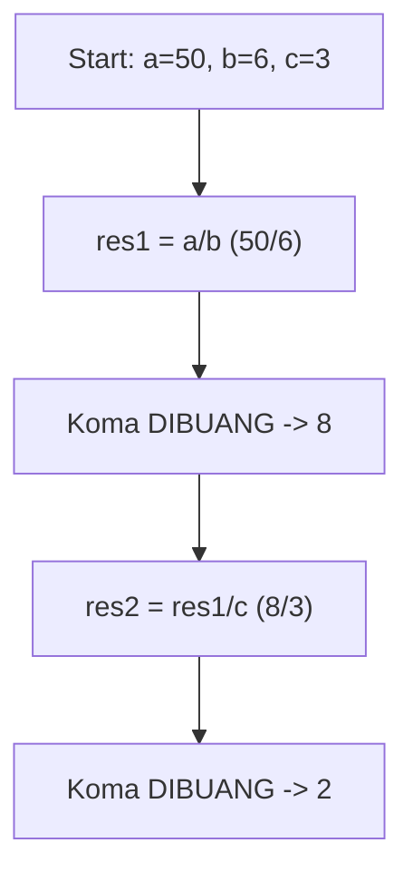
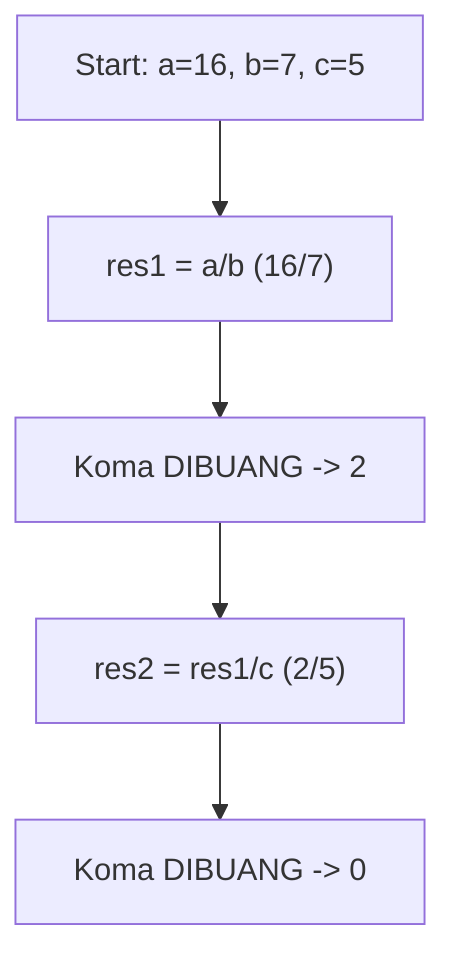
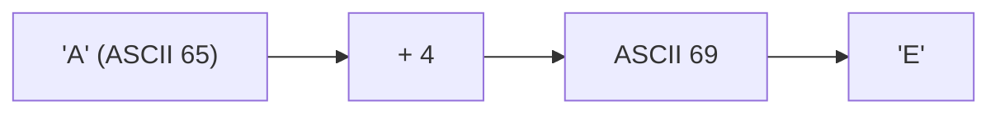
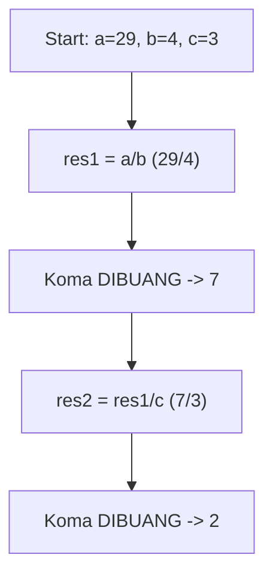

# Latihan Soal Part C - Modul 01 - Set 01

### Soal 1 (Modulo Magic)
```cpp
int x = 44;
int m1 = 2;
int m2 = 5;
int res_x = x % m1;
int res_y = x % m2;
```
**Pertanyaan:**
1. Apakah `x` genap atau ganjil?
2. Berapakah sisa bagi `x % m2`?
3. Apa guna operator `%` dalam OSN-K?

**Jawaban & Diagnosis:**
1. **Genap**
2. **4**
3. **Untuk mencari sisa bagi (sisa kelereng) atau mendeteksi pola perulangan/genap-ganjil.**

**Mermaid Flowchart:**
```mermaid
graph TD
    A[x=44] --> Bx % 2 == 0?
    B -- Ya --> C[Genap]
    B -- Tidak --> D[Ganjil]
    A --> E["x % 5"]
    E --> F["Sisa: 4"]
```

**📖 Cara Membaca Diagram:**
x=44. Cek `x % 2`: 44%2 = 0. Jika 0 genap, jika 1 ganjil. Cek `x % 5`: 44/5 = 8 sisa 4.

---
### Soal 2 (Modulo Magic)
```cpp
int x = 73;
int m1 = 2;
int m2 = 5;
int res_x = x % m1;
int res_y = x % m2;
```
**Pertanyaan:**
1. Apakah `x` genap atau ganjil?
2. Berapakah sisa bagi `x % m2`?
3. Apa guna operator `%` dalam OSN-K?

**Jawaban & Diagnosis:**
1. **Ganjil**
2. **3**
3. **Untuk mencari sisa bagi (sisa kelereng) atau mendeteksi pola perulangan/genap-ganjil.**

**Mermaid Flowchart:**
```mermaid
graph TD
    A[x=73] --> Bx % 2 == 0?
    B -- Ya --> C[Genap]
    B -- Tidak --> D[Ganjil]
    A --> E["x % 5"]
    E --> F["Sisa: 3"]
```

**📖 Cara Membaca Diagram:**
x=73. Cek `x % 2`: 73%2 = 1. Jika 0 genap, jika 1 ganjil. Cek `x % 5`: 73/5 = 14 sisa 3.

---
### Soal 3 (Modulo Magic)
```cpp
int x = 91;
int m1 = 2;
int m2 = 5;
int res_x = x % m1;
int res_y = x % m2;
```
**Pertanyaan:**
1. Apakah `x` genap atau ganjil?
2. Berapakah sisa bagi `x % m2`?
3. Apa guna operator `%` dalam OSN-K?

**Jawaban & Diagnosis:**
1. **Ganjil**
2. **1**
3. **Untuk mencari sisa bagi (sisa kelereng) atau mendeteksi pola perulangan/genap-ganjil.**

**Mermaid Flowchart:**
```mermaid
graph TD
    A[x=91] --> Bx % 2 == 0?
    B -- Ya --> C[Genap]
    B -- Tidak --> D[Ganjil]
    A --> E["x % 5"]
    E --> F["Sisa: 1"]
```

**📖 Cara Membaca Diagram:**
x=91. Cek `x % 2`: 91%2 = 1. Jika 0 genap, jika 1 ganjil. Cek `x % 5`: 91/5 = 18 sisa 1.

---
### Soal 4 (Modulo Magic)
```cpp
int x = 60;
int m1 = 2;
int m2 = 5;
int res_x = x % m1;
int res_y = x % m2;
```
**Pertanyaan:**
1. Apakah `x` genap atau ganjil?
2. Berapakah sisa bagi `x % m2`?
3. Apa guna operator `%` dalam OSN-K?

**Jawaban & Diagnosis:**
1. **Genap**
2. **0**
3. **Untuk mencari sisa bagi (sisa kelereng) atau mendeteksi pola perulangan/genap-ganjil.**

**Mermaid Flowchart:**
```mermaid
graph TD
    A[x=60] --> Bx % 2 == 0?
    B -- Ya --> C[Genap]
    B -- Tidak --> D[Ganjil]
    A --> E["x % 5"]
    E --> F["Sisa: 0"]
```

**📖 Cara Membaca Diagram:**
x=60. Cek `x % 2`: 60%2 = 0. Jika 0 genap, jika 1 ganjil. Cek `x % 5`: 60/5 = 12 sisa 0.

---
### Soal 5 (Modulo Magic)
```cpp
int x = 31;
int m1 = 2;
int m2 = 5;
int res_x = x % m1;
int res_y = x % m2;
```
**Pertanyaan:**
1. Apakah `x` genap atau ganjil?
2. Berapakah sisa bagi `x % m2`?
3. Apa guna operator `%` dalam OSN-K?

**Jawaban & Diagnosis:**
1. **Ganjil**
2. **1**
3. **Untuk mencari sisa bagi (sisa kelereng) atau mendeteksi pola perulangan/genap-ganjil.**

**Mermaid Flowchart:**
```mermaid
graph TD
    A[x=31] --> Bx % 2 == 0?
    B -- Ya --> C[Genap]
    B -- Tidak --> D[Ganjil]
    A --> E["x % 5"]
    E --> F["Sisa: 1"]
```

**📖 Cara Membaca Diagram:**
x=31. Cek `x % 2`: 31%2 = 1. Jika 0 genap, jika 1 ganjil. Cek `x % 5`: 31/5 = 6 sisa 1.

---
### Soal 6 (Integer Division)
```cpp
int a = 24;
int b = 5;
int c = 5;
int res1 = a / b;
int res2 = res1 / c;
```
**Pertanyaan:**
1. Berapakah nilai `res1`?
2. Berapakah nilai `res2`?
3. Mengapa `res1` tidak menghasilkan angka desimal?

**Jawaban & Diagnosis:**
1. **4**
2. **0**
3. **Karena tipe datanya `int`, setiap ada koma di belakangnya langsung dipangkas habis (Integer Division).**

**Mermaid Flowchart:**


**📖 Cara Membaca Diagram:**
Mulai: a=24, b=5, c=5. Di baris `res1 = a / b`, 24/5 = 4.80, tapi karena `int`, koma dibakar jadi 4. Lalu 4/5 = 0.80, dibakar lagi jadi 0.

---
### Soal 7 (ASCII Math)
```cpp
char c = 'E';
int jump = 5;
char result = c + jump;
```
**Pertanyaan:**
1. Berapakah nilai ASCII batin dari 'E'?
2. Karakter apa yang tersimpan dalam variabel `result`?
3. Jika `result` dicetak sebagai `int`, angka berapa yang muncul?

**Jawaban & Diagnosis:**
1. **69**
2. **J**
3. **74**

**Mermaid Flowchart:**


**📖 Cara Membaca Diagram:**
Karakter 'E' punya kode batin ASCII 69. Ditambah 5 langkah menjadi 74. Kode 74 adalah huruf 'J'.

---
### Soal 8 (Casting War)
```cpp
int i = 7;
int j = 2;
double res1 = i / j;
double res2 = (double)i / j;
```
**Pertanyaan:**
1. Berapakah isi `res1`?
2. Berapakah isi `res2`?
3. Kenapa hasil `res1` dan `res2` berbeda padahal rumusnya mirip?

**Jawaban & Diagnosis:**
1. **3.0**
2. **3.5**
3. **Pada `res1`, pembagian terjadi antar `int` sehingga koma dibantai duluan sebelum masuk double. Pada `res2`, `i` dipaksa jadi `double` dulu, sehingga koma selamat.**

**Mermaid Flowchart:**


**📖 Cara Membaca Diagram:**
i=7, j=2. `res1`: 7/2 (int) = 3. Masuk double jadi 3.0. `res2`: (double)7 = 7.0. 7.0/2 = 3.5.

---
### Soal 9 (Casting War)
```cpp
int i = 6;
int j = 2;
double res1 = i / j;
double res2 = (double)i / j;
```
**Pertanyaan:**
1. Berapakah isi `res1`?
2. Berapakah isi `res2`?
3. Kenapa hasil `res1` dan `res2` berbeda padahal rumusnya mirip?

**Jawaban & Diagnosis:**
1. **3.0**
2. **3.0**
3. **Pada `res1`, pembagian terjadi antar `int` sehingga koma dibantai duluan sebelum masuk double. Pada `res2`, `i` dipaksa jadi `double` dulu, sehingga koma selamat.**

**Mermaid Flowchart:**


**📖 Cara Membaca Diagram:**
i=6, j=2. `res1`: 6/2 (int) = 3. Masuk double jadi 3.0. `res2`: (double)6 = 6.0. 6.0/2 = 3.0.

---
### Soal 10 (Integer Division)
```cpp
int a = 47;
int b = 4;
int c = 4;
int res1 = a / b;
int res2 = res1 / c;
```
**Pertanyaan:**
1. Berapakah nilai `res1`?
2. Berapakah nilai `res2`?
3. Mengapa `res1` tidak menghasilkan angka desimal?

**Jawaban & Diagnosis:**
1. **11**
2. **2**
3. **Karena tipe datanya `int`, setiap ada koma di belakangnya langsung dipangkas habis (Integer Division).**

**Mermaid Flowchart:**


**📖 Cara Membaca Diagram:**
Mulai: a=47, b=4, c=4. Di baris `res1 = a / b`, 47/4 = 11.75, tapi karena `int`, koma dibakar jadi 11. Lalu 11/4 = 2.75, dibakar lagi jadi 2.

---
### Soal 11 (Casting War)
```cpp
int i = 6;
int j = 2;
double res1 = i / j;
double res2 = (double)i / j;
```
**Pertanyaan:**
1. Berapakah isi `res1`?
2. Berapakah isi `res2`?
3. Kenapa hasil `res1` dan `res2` berbeda padahal rumusnya mirip?

**Jawaban & Diagnosis:**
1. **3.0**
2. **3.0**
3. **Pada `res1`, pembagian terjadi antar `int` sehingga koma dibantai duluan sebelum masuk double. Pada `res2`, `i` dipaksa jadi `double` dulu, sehingga koma selamat.**

**Mermaid Flowchart:**


**📖 Cara Membaca Diagram:**
i=6, j=2. `res1`: 6/2 (int) = 3. Masuk double jadi 3.0. `res2`: (double)6 = 6.0. 6.0/2 = 3.0.

---
### Soal 12 (Modulo Magic)
```cpp
int x = 43;
int m1 = 2;
int m2 = 5;
int res_x = x % m1;
int res_y = x % m2;
```
**Pertanyaan:**
1. Apakah `x` genap atau ganjil?
2. Berapakah sisa bagi `x % m2`?
3. Apa guna operator `%` dalam OSN-K?

**Jawaban & Diagnosis:**
1. **Ganjil**
2. **3**
3. **Untuk mencari sisa bagi (sisa kelereng) atau mendeteksi pola perulangan/genap-ganjil.**

**Mermaid Flowchart:**
```mermaid
graph TD
    A[x=43] --> Bx % 2 == 0?
    B -- Ya --> C[Genap]
    B -- Tidak --> D[Ganjil]
    A --> E["x % 5"]
    E --> F["Sisa: 3"]
```

**📖 Cara Membaca Diagram:**
x=43. Cek `x % 2`: 43%2 = 1. Jika 0 genap, jika 1 ganjil. Cek `x % 5`: 43/5 = 8 sisa 3.

---
### Soal 13 (Casting War)
```cpp
int i = 8;
int j = 2;
double res1 = i / j;
double res2 = (double)i / j;
```
**Pertanyaan:**
1. Berapakah isi `res1`?
2. Berapakah isi `res2`?
3. Kenapa hasil `res1` dan `res2` berbeda padahal rumusnya mirip?

**Jawaban & Diagnosis:**
1. **4.0**
2. **4.0**
3. **Pada `res1`, pembagian terjadi antar `int` sehingga koma dibantai duluan sebelum masuk double. Pada `res2`, `i` dipaksa jadi `double` dulu, sehingga koma selamat.**

**Mermaid Flowchart:**


**📖 Cara Membaca Diagram:**
i=8, j=2. `res1`: 8/2 (int) = 4. Masuk double jadi 4.0. `res2`: (double)8 = 8.0. 8.0/2 = 4.0.

---
### Soal 14 (ASCII Math)
```cpp
char c = 'B';
int jump = 2;
char result = c + jump;
```
**Pertanyaan:**
1. Berapakah nilai ASCII batin dari 'B'?
2. Karakter apa yang tersimpan dalam variabel `result`?
3. Jika `result` dicetak sebagai `int`, angka berapa yang muncul?

**Jawaban & Diagnosis:**
1. **66**
2. **D**
3. **68**

**Mermaid Flowchart:**


**📖 Cara Membaca Diagram:**
Karakter 'B' punya kode batin ASCII 66. Ditambah 2 langkah menjadi 68. Kode 68 adalah huruf 'D'.

---
### Soal 15 (Integer Division)
```cpp
int a = 50;
int b = 6;
int c = 3;
int res1 = a / b;
int res2 = res1 / c;
```
**Pertanyaan:**
1. Berapakah nilai `res1`?
2. Berapakah nilai `res2`?
3. Mengapa `res1` tidak menghasilkan angka desimal?

**Jawaban & Diagnosis:**
1. **8**
2. **2**
3. **Karena tipe datanya `int`, setiap ada koma di belakangnya langsung dipangkas habis (Integer Division).**

**Mermaid Flowchart:**


**📖 Cara Membaca Diagram:**
Mulai: a=50, b=6, c=3. Di baris `res1 = a / b`, 50/6 = 8.33, tapi karena `int`, koma dibakar jadi 8. Lalu 8/3 = 2.67, dibakar lagi jadi 2.

---
### Soal 16 (Integer Division)
```cpp
int a = 16;
int b = 7;
int c = 5;
int res1 = a / b;
int res2 = res1 / c;
```
**Pertanyaan:**
1. Berapakah nilai `res1`?
2. Berapakah nilai `res2`?
3. Mengapa `res1` tidak menghasilkan angka desimal?

**Jawaban & Diagnosis:**
1. **2**
2. **0**
3. **Karena tipe datanya `int`, setiap ada koma di belakangnya langsung dipangkas habis (Integer Division).**

**Mermaid Flowchart:**


**📖 Cara Membaca Diagram:**
Mulai: a=16, b=7, c=5. Di baris `res1 = a / b`, 16/7 = 2.29, tapi karena `int`, koma dibakar jadi 2. Lalu 2/5 = 0.40, dibakar lagi jadi 0.

---
### Soal 17 (ASCII Math)
```cpp
char c = 'A';
int jump = 4;
char result = c + jump;
```
**Pertanyaan:**
1. Berapakah nilai ASCII batin dari 'A'?
2. Karakter apa yang tersimpan dalam variabel `result`?
3. Jika `result` dicetak sebagai `int`, angka berapa yang muncul?

**Jawaban & Diagnosis:**
1. **65**
2. **E**
3. **69**

**Mermaid Flowchart:**


**📖 Cara Membaca Diagram:**
Karakter 'A' punya kode batin ASCII 65. Ditambah 4 langkah menjadi 69. Kode 69 adalah huruf 'E'.

---
### Soal 18 (Modulo Magic)
```cpp
int x = 70;
int m1 = 2;
int m2 = 5;
int res_x = x % m1;
int res_y = x % m2;
```
**Pertanyaan:**
1. Apakah `x` genap atau ganjil?
2. Berapakah sisa bagi `x % m2`?
3. Apa guna operator `%` dalam OSN-K?

**Jawaban & Diagnosis:**
1. **Genap**
2. **0**
3. **Untuk mencari sisa bagi (sisa kelereng) atau mendeteksi pola perulangan/genap-ganjil.**

**Mermaid Flowchart:**
```mermaid
graph TD
    A[x=70] --> Bx % 2 == 0?
    B -- Ya --> C[Genap]
    B -- Tidak --> D[Ganjil]
    A --> E["x % 5"]
    E --> F["Sisa: 0"]
```

**📖 Cara Membaca Diagram:**
x=70. Cek `x % 2`: 70%2 = 0. Jika 0 genap, jika 1 ganjil. Cek `x % 5`: 70/5 = 14 sisa 0.

---
### Soal 19 (Casting War)
```cpp
int i = 7;
int j = 2;
double res1 = i / j;
double res2 = (double)i / j;
```
**Pertanyaan:**
1. Berapakah isi `res1`?
2. Berapakah isi `res2`?
3. Kenapa hasil `res1` dan `res2` berbeda padahal rumusnya mirip?

**Jawaban & Diagnosis:**
1. **3.0**
2. **3.5**
3. **Pada `res1`, pembagian terjadi antar `int` sehingga koma dibantai duluan sebelum masuk double. Pada `res2`, `i` dipaksa jadi `double` dulu, sehingga koma selamat.**

**Mermaid Flowchart:**


**📖 Cara Membaca Diagram:**
i=7, j=2. `res1`: 7/2 (int) = 3. Masuk double jadi 3.0. `res2`: (double)7 = 7.0. 7.0/2 = 3.5.

---
### Soal 20 (Integer Division)
```cpp
int a = 29;
int b = 4;
int c = 3;
int res1 = a / b;
int res2 = res1 / c;
```
**Pertanyaan:**
1. Berapakah nilai `res1`?
2. Berapakah nilai `res2`?
3. Mengapa `res1` tidak menghasilkan angka desimal?

**Jawaban & Diagnosis:**
1. **7**
2. **2**
3. **Karena tipe datanya `int`, setiap ada koma di belakangnya langsung dipangkas habis (Integer Division).**

**Mermaid Flowchart:**


**📖 Cara Membaca Diagram:**
Mulai: a=29, b=4, c=3. Di baris `res1 = a / b`, 29/4 = 7.25, tapi karena `int`, koma dibakar jadi 7. Lalu 7/3 = 2.33, dibakar lagi jadi 2.

---
### Soal 21 (Integer Division)
```cpp
int a = 16;
int b = 6;
int c = 6;
int res1 = a / b;
int res2 = res1 / c;
```
**Pertanyaan:**
1. Berapakah nilai `res1`?
2. Berapakah nilai `res2`?
3. Mengapa `res1` tidak menghasilkan angka desimal?

**Jawaban & Diagnosis:**
1. **2**
2. **0**
3. **Karena tipe datanya `int`, setiap ada koma di belakangnya langsung dipangkas habis (Integer Division).**

**Mermaid Flowchart:**
```mermaid
graph TD
    A[Start: a=16, b=6, c=6] --> B["res1 = a/b (16/6)"]
    B --> C["Koma DIBUANG -> 2"]
    C --> D["res2 = res1/c (2/6)"]
    D --> E["Koma DIBUANG -> 0"]
```

**📖 Cara Membaca Diagram:**
Mulai: a=16, b=6, c=6. Di baris `res1 = a / b`, 16/6 = 2.67, tapi karena `int`, koma dibakar jadi 2. Lalu 2/6 = 0.33, dibakar lagi jadi 0.

---
### Soal 22 (Integer Division)
```cpp
int a = 13;
int b = 7;
int c = 7;
int res1 = a / b;
int res2 = res1 / c;
```
**Pertanyaan:**
1. Berapakah nilai `res1`?
2. Berapakah nilai `res2`?
3. Mengapa `res1` tidak menghasilkan angka desimal?

**Jawaban & Diagnosis:**
1. **1**
2. **0**
3. **Karena tipe datanya `int`, setiap ada koma di belakangnya langsung dipangkas habis (Integer Division).**

**Mermaid Flowchart:**
```mermaid
graph TD
    A[Start: a=13, b=7, c=7] --> B["res1 = a/b (13/7)"]
    B --> C["Koma DIBUANG -> 1"]
    C --> D["res2 = res1/c (1/7)"]
    D --> E["Koma DIBUANG -> 0"]
```

**📖 Cara Membaca Diagram:**
Mulai: a=13, b=7, c=7. Di baris `res1 = a / b`, 13/7 = 1.86, tapi karena `int`, koma dibakar jadi 1. Lalu 1/7 = 0.14, dibakar lagi jadi 0.

---
### Soal 23 (Integer Division)
```cpp
int a = 44;
int b = 5;
int c = 5;
int res1 = a / b;
int res2 = res1 / c;
```
**Pertanyaan:**
1. Berapakah nilai `res1`?
2. Berapakah nilai `res2`?
3. Mengapa `res1` tidak menghasilkan angka desimal?

**Jawaban & Diagnosis:**
1. **8**
2. **1**
3. **Karena tipe datanya `int`, setiap ada koma di belakangnya langsung dipangkas habis (Integer Division).**

**Mermaid Flowchart:**
```mermaid
graph TD
    A[Start: a=44, b=5, c=5] --> B["res1 = a/b (44/5)"]
    B --> C["Koma DIBUANG -> 8"]
    C --> D["res2 = res1/c (8/5)"]
    D --> E["Koma DIBUANG -> 1"]
```

**📖 Cara Membaca Diagram:**
Mulai: a=44, b=5, c=5. Di baris `res1 = a / b`, 44/5 = 8.80, tapi karena `int`, koma dibakar jadi 8. Lalu 8/5 = 1.60, dibakar lagi jadi 1.

---
### Soal 24 (ASCII Math)
```cpp
char c = 'B';
int jump = 5;
char result = c + jump;
```
**Pertanyaan:**
1. Berapakah nilai ASCII batin dari 'B'?
2. Karakter apa yang tersimpan dalam variabel `result`?
3. Jika `result` dicetak sebagai `int`, angka berapa yang muncul?

**Jawaban & Diagnosis:**
1. **66**
2. **G**
3. **71**

**Mermaid Flowchart:**
```mermaid
graph LR
    A["'B' (ASCII 66)"] --> B["+ 5"]
    B --> C["ASCII 71"]
    C --> D["'G'"]
```

**📖 Cara Membaca Diagram:**
Karakter 'B' punya kode batin ASCII 66. Ditambah 5 langkah menjadi 71. Kode 71 adalah huruf 'G'.

---
### Soal 25 (Integer Division)
```cpp
int a = 30;
int b = 4;
int c = 3;
int res1 = a / b;
int res2 = res1 / c;
```
**Pertanyaan:**
1. Berapakah nilai `res1`?
2. Berapakah nilai `res2`?
3. Mengapa `res1` tidak menghasilkan angka desimal?

**Jawaban & Diagnosis:**
1. **7**
2. **2**
3. **Karena tipe datanya `int`, setiap ada koma di belakangnya langsung dipangkas habis (Integer Division).**

**Mermaid Flowchart:**
```mermaid
graph TD
    A[Start: a=30, b=4, c=3] --> B["res1 = a/b (30/4)"]
    B --> C["Koma DIBUANG -> 7"]
    C --> D["res2 = res1/c (7/3)"]
    D --> E["Koma DIBUANG -> 2"]
```

**📖 Cara Membaca Diagram:**
Mulai: a=30, b=4, c=3. Di baris `res1 = a / b`, 30/4 = 7.50, tapi karena `int`, koma dibakar jadi 7. Lalu 7/3 = 2.33, dibakar lagi jadi 2.

---
