🔙 **[Kembali ke Daftar Soal](./README.md)**

---

# Latihan Soal Part C - Modul 01 - Set 01

### Soal 1
```cpp
double val = 42.19;
int res = (int)val;
```
**Pertanyaan:**
1. Berapakah hasil akhirnya?
2. Mengapa demikian?

**Jawaban & Diagnosis:**
1. **42**
2. Lihat Tracing.

**Mermaid Flowchart:**
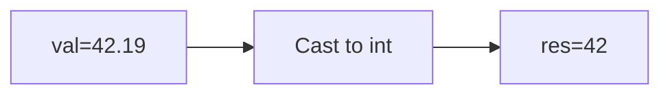

**📖 Penjelasan:**
**Langkah Tracing:**
1. val=42.19.
2. Desimal dihilangkan.
3. Hasil: 42.

---
### Soal 2
```cpp
int n = 46;
int m = 2;
int res = n % m;
```
**Pertanyaan:**
1. Berapakah hasil akhirnya?
2. Mengapa demikian?

**Jawaban & Diagnosis:**
1. **0**
2. Lihat Tracing.

**Mermaid Flowchart:**
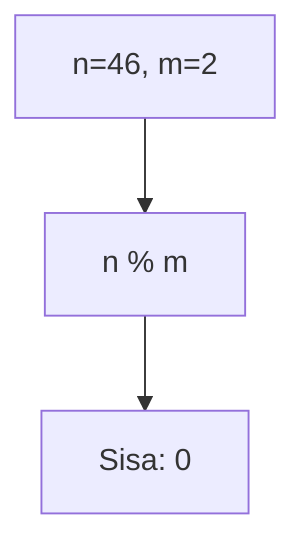

**📖 Penjelasan:**
**Langkah Tracing:**
1. n=46, m=2.
2. 46 dibagi 2 sisa 0.
3. Hasil: 0.

---
### Soal 3
```cpp
char ch = 'X';
ch = ch + (-1);
```
**Pertanyaan:**
1. Berapakah hasil akhirnya?
2. Mengapa demikian?

**Jawaban & Diagnosis:**
1. **W**
2. Lihat Tracing.

**Mermaid Flowchart:**
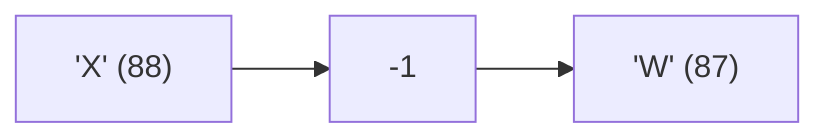

**📖 Penjelasan:**
**Langkah Tracing:**
1. ch='X' (ASCII 88).
2. 88 + (-1) = 87.
3. Hasil: 'W'.

---
### Soal 4
```cpp
char ch = 'm';
ch = ch + (-1);
```
**Pertanyaan:**
1. Berapakah hasil akhirnya?
2. Mengapa demikian?

**Jawaban & Diagnosis:**
1. **l**
2. Lihat Tracing.

**Mermaid Flowchart:**
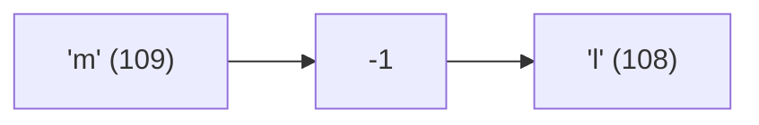

**📖 Penjelasan:**
**Langkah Tracing:**
1. ch='m' (ASCII 109).
2. 109 + (-1) = 108.
3. Hasil: 'l'.

---
### Soal 5
```cpp
int n = 24;
int m = 10;
int res = n % m;
```
**Pertanyaan:**
1. Berapakah hasil akhirnya?
2. Mengapa demikian?

**Jawaban & Diagnosis:**
1. **4**
2. Lihat Tracing.

**Mermaid Flowchart:**


**📖 Penjelasan:**
**Langkah Tracing:**
1. n=24, m=10.
2. 24 dibagi 10 sisa 4.
3. Hasil: 4.

---
### Soal 6
```cpp
int n = 39, y = 7;
int res = n / y;
```
**Pertanyaan:**
1. Berapakah hasil akhirnya?
2. Mengapa demikian?

**Jawaban & Diagnosis:**
1. **5**
2. Lihat Tracing.

**Mermaid Flowchart:**
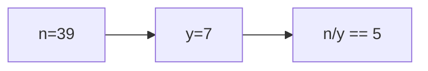

**📖 Penjelasan:**
**Langkah Tracing:**
1. n=39, y=7.
2. 39/7 = 5.57. Karena `int`, desimal dibuang.
3. Hasil: 5.

---
### Soal 7
```cpp
double val = 95.41;
int res = (int)val;
```
**Pertanyaan:**
1. Berapakah hasil akhirnya?
2. Mengapa demikian?

**Jawaban & Diagnosis:**
1. **95**
2. Lihat Tracing.

**Mermaid Flowchart:**
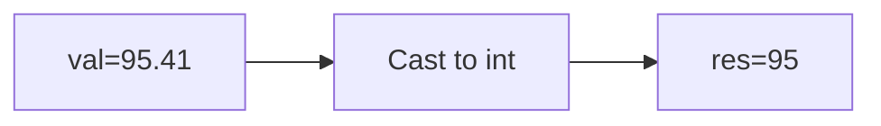

**📖 Penjelasan:**
**Langkah Tracing:**
1. val=95.41.
2. Desimal dihilangkan.
3. Hasil: 95.

---
### Soal 8
```cpp
int n = 75, m = 9;
int res = n / m;
```
**Pertanyaan:**
1. Berapakah hasil akhirnya?
2. Mengapa demikian?

**Jawaban & Diagnosis:**
1. **8**
2. Lihat Tracing.

**Mermaid Flowchart:**
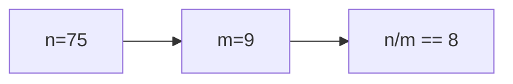

**📖 Penjelasan:**
**Langkah Tracing:**
1. n=75, m=9.
2. 75/9 = 8.33. Karena `int`, desimal dibuang.
3. Hasil: 8.

---
### Soal 9
```cpp
int n = 69, b = 2;
int res = n / b;
```
**Pertanyaan:**
1. Berapakah hasil akhirnya?
2. Mengapa demikian?

**Jawaban & Diagnosis:**
1. **34**
2. Lihat Tracing.

**Mermaid Flowchart:**
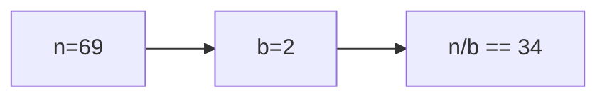

**📖 Penjelasan:**
**Langkah Tracing:**
1. n=69, b=2.
2. 69/2 = 34.50. Karena `int`, desimal dibuang.
3. Hasil: 34.

---
### Soal 10
```cpp
double val = 59.19;
int res = (int)val;
```
**Pertanyaan:**
1. Berapakah hasil akhirnya?
2. Mengapa demikian?

**Jawaban & Diagnosis:**
1. **59**
2. Lihat Tracing.

**Mermaid Flowchart:**
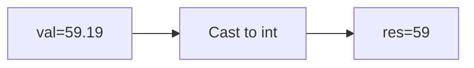

**📖 Penjelasan:**
**Langkah Tracing:**
1. val=59.19.
2. Desimal dihilangkan.
3. Hasil: 59.

---
### Soal 11
```cpp
char ch = 'X';
ch = ch + (-1);
```
**Pertanyaan:**
1. Berapakah hasil akhirnya?
2. Mengapa demikian?

**Jawaban & Diagnosis:**
1. **W**
2. Lihat Tracing.

**Mermaid Flowchart:**


**📖 Penjelasan:**
**Langkah Tracing:**
1. ch='X' (ASCII 88).
2. 88 + (-1) = 87.
3. Hasil: 'W'.

---
### Soal 12
```cpp
double val = 53.74;
int res = (int)val;
```
**Pertanyaan:**
1. Berapakah hasil akhirnya?
2. Mengapa demikian?

**Jawaban & Diagnosis:**
1. **53**
2. Lihat Tracing.

**Mermaid Flowchart:**


**📖 Penjelasan:**
**Langkah Tracing:**
1. val=53.74.
2. Desimal dihilangkan.
3. Hasil: 53.

---
### Soal 13
```cpp
int n = 50;
int m = 10;
int res = n % m;
```
**Pertanyaan:**
1. Berapakah hasil akhirnya?
2. Mengapa demikian?

**Jawaban & Diagnosis:**
1. **0**
2. Lihat Tracing.

**Mermaid Flowchart:**
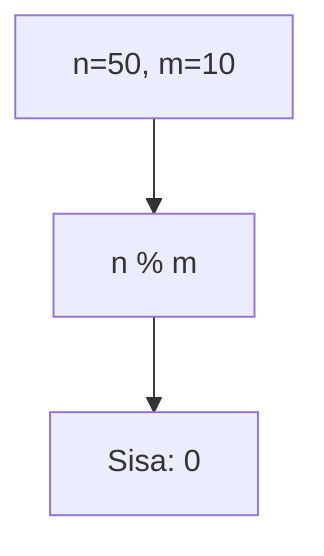

**📖 Penjelasan:**
**Langkah Tracing:**
1. n=50, m=10.
2. 50 dibagi 10 sisa 0.
3. Hasil: 0.

---
### Soal 14
```cpp
int a = 91, m = 8;
int res = a / m;
```
**Pertanyaan:**
1. Berapakah hasil akhirnya?
2. Mengapa demikian?

**Jawaban & Diagnosis:**
1. **11**
2. Lihat Tracing.

**Mermaid Flowchart:**
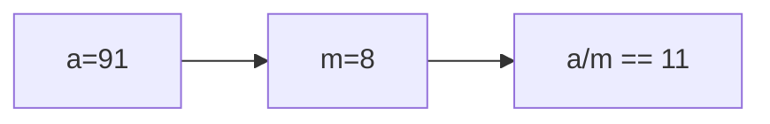

**📖 Penjelasan:**
**Langkah Tracing:**
1. a=91, m=8.
2. 91/8 = 11.38. Karena `int`, desimal dibuang.
3. Hasil: 11.

---
### Soal 15
```cpp
double val = 13.52;
int res = (int)val;
```
**Pertanyaan:**
1. Berapakah hasil akhirnya?
2. Mengapa demikian?

**Jawaban & Diagnosis:**
1. **13**
2. Lihat Tracing.

**Mermaid Flowchart:**
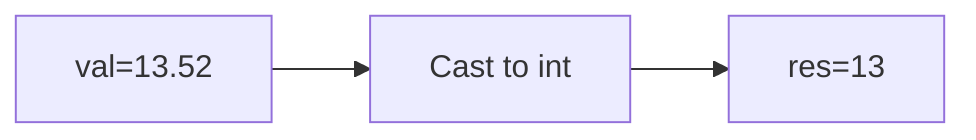

**📖 Penjelasan:**
**Langkah Tracing:**
1. val=13.52.
2. Desimal dihilangkan.
3. Hasil: 13.

---
### Soal 16
```cpp
int n = 32;
int m = 5;
int res = n % m;
```
**Pertanyaan:**
1. Berapakah hasil akhirnya?
2. Mengapa demikian?

**Jawaban & Diagnosis:**
1. **2**
2. Lihat Tracing.

**Mermaid Flowchart:**
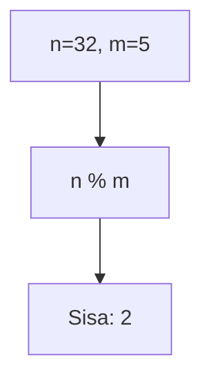

**📖 Penjelasan:**
**Langkah Tracing:**
1. n=32, m=5.
2. 32 dibagi 5 sisa 2.
3. Hasil: 2.

---
### Soal 17
```cpp
double val = 77.53;
int res = (int)val;
```
**Pertanyaan:**
1. Berapakah hasil akhirnya?
2. Mengapa demikian?

**Jawaban & Diagnosis:**
1. **77**
2. Lihat Tracing.

**Mermaid Flowchart:**
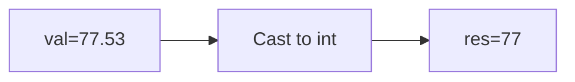

**📖 Penjelasan:**
**Langkah Tracing:**
1. val=77.53.
2. Desimal dihilangkan.
3. Hasil: 77.

---
### Soal 18
```cpp
int n = 22;
int m = 10;
int res = n % m;
```
**Pertanyaan:**
1. Berapakah hasil akhirnya?
2. Mengapa demikian?

**Jawaban & Diagnosis:**
1. **2**
2. Lihat Tracing.

**Mermaid Flowchart:**
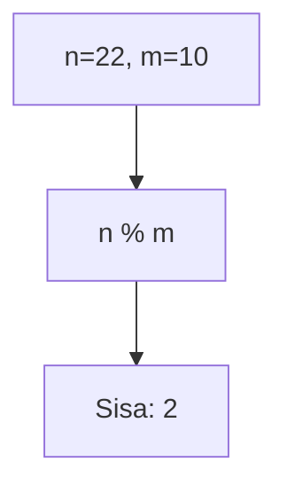

**📖 Penjelasan:**
**Langkah Tracing:**
1. n=22, m=10.
2. 22 dibagi 10 sisa 2.
3. Hasil: 2.

---
### Soal 19
```cpp
int a = 99, b = 5;
int res = a / b;
```
**Pertanyaan:**
1. Berapakah hasil akhirnya?
2. Mengapa demikian?

**Jawaban & Diagnosis:**
1. **19**
2. Lihat Tracing.

**Mermaid Flowchart:**
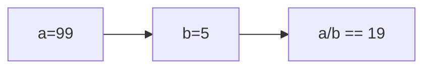

**📖 Penjelasan:**
**Langkah Tracing:**
1. a=99, b=5.
2. 99/5 = 19.80. Karena `int`, desimal dibuang.
3. Hasil: 19.

---
### Soal 20
```cpp
int a = 78, b = 2;
int res = a / b;
```
**Pertanyaan:**
1. Berapakah hasil akhirnya?
2. Mengapa demikian?

**Jawaban & Diagnosis:**
1. **39**
2. Lihat Tracing.

**Mermaid Flowchart:**
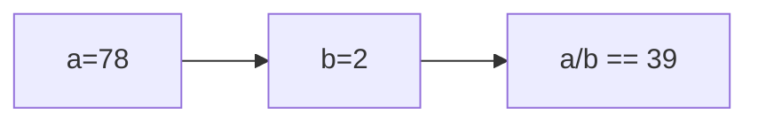

**📖 Penjelasan:**
**Langkah Tracing:**
1. a=78, b=2.
2. 78/2 = 39.00. Karena `int`, desimal dibuang.
3. Hasil: 39.

---
### Soal 21
```cpp
double val = 63.01;
int res = (int)val;
```
**Pertanyaan:**
1. Berapakah hasil akhirnya?
2. Mengapa demikian?

**Jawaban & Diagnosis:**
1. **63**
2. Lihat Tracing.

**Mermaid Flowchart:**
```mermaid
graph LR
A["val=63.01"] --> B["Cast to int"]
B --> C["res=63"]
```

**📖 Penjelasan:**
**Langkah Tracing:**
1. val=63.01.
2. Desimal dihilangkan.
3. Hasil: 63.

---
### Soal 22
```cpp
char ch = 'm';
ch = ch + (4);
```
**Pertanyaan:**
1. Berapakah hasil akhirnya?
2. Mengapa demikian?

**Jawaban & Diagnosis:**
1. **q**
2. Lihat Tracing.

**Mermaid Flowchart:**
```mermaid
graph LR
A["'m' (109)"] --> B["4"]
B --> C["'q' (113)"]
```

**📖 Penjelasan:**
**Langkah Tracing:**
1. ch='m' (ASCII 109).
2. 109 + (4) = 113.
3. Hasil: 'q'.

---
### Soal 23
```cpp
int n = 30;
int m = 2;
int res = n % m;
```
**Pertanyaan:**
1. Berapakah hasil akhirnya?
2. Mengapa demikian?

**Jawaban & Diagnosis:**
1. **0**
2. Lihat Tracing.

**Mermaid Flowchart:**
```mermaid
graph TD
A["n=30, m=2"] --> B["n % m"]
B --> C["Sisa: 0"]
```

**📖 Penjelasan:**
**Langkah Tracing:**
1. n=30, m=2.
2. 30 dibagi 2 sisa 0.
3. Hasil: 0.

---
### Soal 24
```cpp
int n = 37, b = 9;
int res = n / b;
```
**Pertanyaan:**
1. Berapakah hasil akhirnya?
2. Mengapa demikian?

**Jawaban & Diagnosis:**
1. **4**
2. Lihat Tracing.

**Mermaid Flowchart:**
```mermaid
graph LR
A["n=37"] --> B["b=9"]
B --> C["n/b == 4"]
```

**📖 Penjelasan:**
**Langkah Tracing:**
1. n=37, b=9.
2. 37/9 = 4.11. Karena `int`, desimal dibuang.
3. Hasil: 4.

---
### Soal 25
```cpp
int x = 61, m = 3;
int res = x / m;
```
**Pertanyaan:**
1. Berapakah hasil akhirnya?
2. Mengapa demikian?

**Jawaban & Diagnosis:**
1. **20**
2. Lihat Tracing.

**Mermaid Flowchart:**
```mermaid
graph LR
A["x=61"] --> B["m=3"]
B --> C["x/m == 20"]
```

**📖 Penjelasan:**
**Langkah Tracing:**
1. x=61, m=3.
2. 61/3 = 20.33. Karena `int`, desimal dibuang.
3. Hasil: 20.

---
