🔙 **[Kembali ke Daftar Soal](./README.md)**

---

# Latihan Soal Part C - Modul 01 - Set 01

### Soal 1
```cpp
double saldo_bank = 28.98;
int uang_kertas = (int)saldo_bank;
```
**Pertanyaan:**
1. Berapakah hasil akhirnya?
2. Deskripsikan langkah robot compiler saat memproses kode ini!

**Jawaban & Diagnosis:**
1. **28**
2. Baca bagian 'Analisis Mendalam' di bawah.

**Mermaid Flowchart:**


**📖 Penjelasan Komprehensif:**
**Analisis Mendalam (Compiler Manusia):**
1. **Gelas ke Laci**: `saldo_bank` adalah `double` (angka berkoma).
2. **Type Casting**: Perintah `(int)` secara paksa mengubahnya menjadi bilangan bulat.
3. **Efek**: Bagian desimal `28.98` menderita pelenyapan.
4. **Hasil Akhir**: `uang_kertas` berisi **28**.

---
### Soal 2
```cpp
int stok_buku = 44;
int rak = 3;
int sisa_buku = stok_buku % rak;
```
**Pertanyaan:**
1. Berapakah hasil akhirnya?
2. Deskripsikan langkah robot compiler saat memproses kode ini!

**Jawaban & Diagnosis:**
1. **2**
2. Baca bagian 'Analisis Mendalam' di bawah.

**Mermaid Flowchart:**


**📖 Penjelasan Komprehensif:**
**Analisis Mendalam (Compiler Manusia):**
1. **Konteks**: Menyusun 44 buku ke 3 rak secara merata.
2. **Mekanisme Modulo**: Operator `%` bukan menghitung hasil bagi, tapi sisa yang tidak muat masuk rak.
3. **Perhitungan**: 44 dibagi 3 sisa **2**.
4. **Hasil Akhir**: `sisa_buku` adalah **2**.

---
### Soal 3
```cpp
int stok_buku = 78;
int rak = 3;
int sisa_buku = stok_buku % rak;
```
**Pertanyaan:**
1. Berapakah hasil akhirnya?
2. Deskripsikan langkah robot compiler saat memproses kode ini!

**Jawaban & Diagnosis:**
1. **0**
2. Baca bagian 'Analisis Mendalam' di bawah.

**Mermaid Flowchart:**
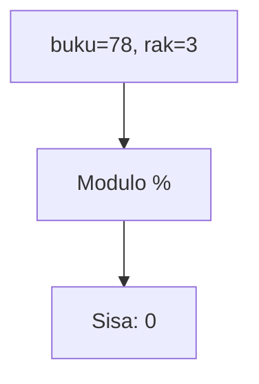

**📖 Penjelasan Komprehensif:**
**Analisis Mendalam (Compiler Manusia):**
1. **Konteks**: Menyusun 78 buku ke 3 rak secara merata.
2. **Mekanisme Modulo**: Operator `%` bukan menghitung hasil bagi, tapi sisa yang tidak muat masuk rak.
3. **Perhitungan**: 78 dibagi 3 sisa **0**.
4. **Hasil Akhir**: `sisa_buku` adalah **0**.

---
### Soal 4
```cpp
char huruf_awal = 'm';
char kode_rahasia = huruf_awal + 4;
```
**Pertanyaan:**
1. Berapakah hasil akhirnya?
2. Deskripsikan langkah robot compiler saat memproses kode ini!

**Jawaban & Diagnosis:**
1. **q**
2. Baca bagian 'Analisis Mendalam' di bawah.

**Mermaid Flowchart:**
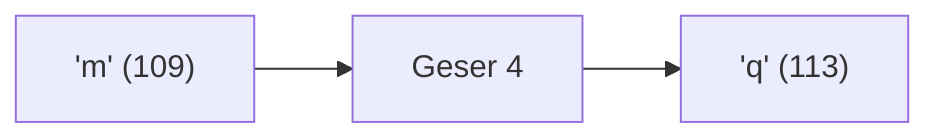

**📖 Penjelasan Komprehensif:**
**Analisis Mendalam (Compiler Manusia):**
1. **Batin Karakter**: Huruf 'm' memiliki nilai ASCII **109**.
2. **Operasi Geser**: Menambah huruf dengan angka akan menggeser posisinya di tabel ASCII: 109 + 4 = 113.
3. **Identitas Baru**: Angka 113 adalah identitas untuk huruf **'q'**.
4. **Hasil Akhir**: `kode_rahasia` berisi **'q'**.

---
### Soal 5
```cpp
int roti = 82;
int anak = 5;
int dapet_tiap_anak = roti / anak;
```
**Pertanyaan:**
1. Berapakah hasil akhirnya?
2. Deskripsikan langkah robot compiler saat memproses kode ini!

**Jawaban & Diagnosis:**
1. **16**
2. Baca bagian 'Analisis Mendalam' di bawah.

**Mermaid Flowchart:**
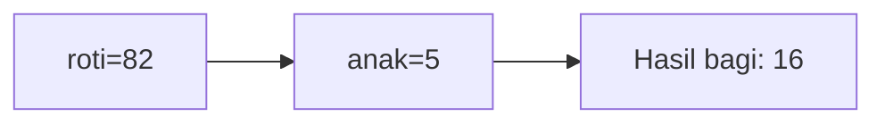

**📖 Penjelasan Komprehensif:**
**Analisis Mendalam (Compiler Manusia):**
1. **Inisialisasi**: Pak Dengklek punya `roti` sebanyak 82 dan ingin dibagi ke 5 `anak`.
2. **Operasi Pembagian**: Rumus `roti / anak` dijalankan. Secara matematis hasilnya 16.40.
3. **Hukum Tipe Data**: Karena hasilnya disimpan ke loker `int`, C++ membuang sisa 2 biji dan hanya mengambil bagian bulatnya.
4. **Hasil Akhir**: `dapet_tiap_anak` bernilai **16**.

---
### Soal 6
```cpp
double saldo_bank = 41.07;
int uang_kertas = (int)saldo_bank;
```
**Pertanyaan:**
1. Berapakah hasil akhirnya?
2. Deskripsikan langkah robot compiler saat memproses kode ini!

**Jawaban & Diagnosis:**
1. **41**
2. Baca bagian 'Analisis Mendalam' di bawah.

**Mermaid Flowchart:**
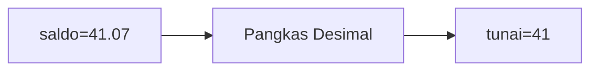

**📖 Penjelasan Komprehensif:**
**Analisis Mendalam (Compiler Manusia):**
1. **Gelas ke Laci**: `saldo_bank` adalah `double` (angka berkoma).
2. **Type Casting**: Perintah `(int)` secara paksa mengubahnya menjadi bilangan bulat.
3. **Efek**: Bagian desimal `41.07` menderita pelenyapan.
4. **Hasil Akhir**: `uang_kertas` berisi **41**.

---
### Soal 7
```cpp
int stok_buku = 80;
int rak = 4;
int sisa_buku = stok_buku % rak;
```
**Pertanyaan:**
1. Berapakah hasil akhirnya?
2. Deskripsikan langkah robot compiler saat memproses kode ini!

**Jawaban & Diagnosis:**
1. **0**
2. Baca bagian 'Analisis Mendalam' di bawah.

**Mermaid Flowchart:**


**📖 Penjelasan Komprehensif:**
**Analisis Mendalam (Compiler Manusia):**
1. **Konteks**: Menyusun 80 buku ke 4 rak secara merata.
2. **Mekanisme Modulo**: Operator `%` bukan menghitung hasil bagi, tapi sisa yang tidak muat masuk rak.
3. **Perhitungan**: 80 dibagi 4 sisa **0**.
4. **Hasil Akhir**: `sisa_buku` adalah **0**.

---
### Soal 8
```cpp
double saldo_bank = 46.00;
int uang_kertas = (int)saldo_bank;
```
**Pertanyaan:**
1. Berapakah hasil akhirnya?
2. Deskripsikan langkah robot compiler saat memproses kode ini!

**Jawaban & Diagnosis:**
1. **45**
2. Baca bagian 'Analisis Mendalam' di bawah.

**Mermaid Flowchart:**
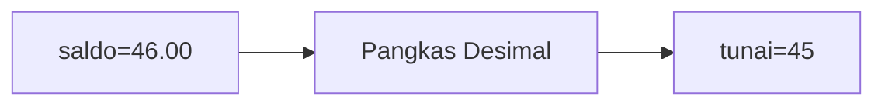

**📖 Penjelasan Komprehensif:**
**Analisis Mendalam (Compiler Manusia):**
1. **Gelas ke Laci**: `saldo_bank` adalah `double` (angka berkoma).
2. **Type Casting**: Perintah `(int)` secara paksa mengubahnya menjadi bilangan bulat.
3. **Efek**: Bagian desimal `46.00` menderita pelenyapan.
4. **Hasil Akhir**: `uang_kertas` berisi **45**.

---
### Soal 9
```cpp
int stok_buku = 39;
int rak = 4;
int sisa_buku = stok_buku % rak;
```
**Pertanyaan:**
1. Berapakah hasil akhirnya?
2. Deskripsikan langkah robot compiler saat memproses kode ini!

**Jawaban & Diagnosis:**
1. **3**
2. Baca bagian 'Analisis Mendalam' di bawah.

**Mermaid Flowchart:**
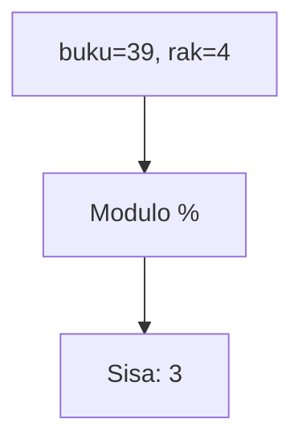

**📖 Penjelasan Komprehensif:**
**Analisis Mendalam (Compiler Manusia):**
1. **Konteks**: Menyusun 39 buku ke 4 rak secara merata.
2. **Mekanisme Modulo**: Operator `%` bukan menghitung hasil bagi, tapi sisa yang tidak muat masuk rak.
3. **Perhitungan**: 39 dibagi 4 sisa **3**.
4. **Hasil Akhir**: `sisa_buku` adalah **3**.

---
### Soal 10
```cpp
int stok_buku = 66;
int rak = 4;
int sisa_buku = stok_buku % rak;
```
**Pertanyaan:**
1. Berapakah hasil akhirnya?
2. Deskripsikan langkah robot compiler saat memproses kode ini!

**Jawaban & Diagnosis:**
1. **2**
2. Baca bagian 'Analisis Mendalam' di bawah.

**Mermaid Flowchart:**


**📖 Penjelasan Komprehensif:**
**Analisis Mendalam (Compiler Manusia):**
1. **Konteks**: Menyusun 66 buku ke 4 rak secara merata.
2. **Mekanisme Modulo**: Operator `%` bukan menghitung hasil bagi, tapi sisa yang tidak muat masuk rak.
3. **Perhitungan**: 66 dibagi 4 sisa **2**.
4. **Hasil Akhir**: `sisa_buku` adalah **2**.

---
### Soal 11
```cpp
int roti = 87;
int anak = 3;
int dapet_tiap_anak = roti / anak;
```
**Pertanyaan:**
1. Berapakah hasil akhirnya?
2. Deskripsikan langkah robot compiler saat memproses kode ini!

**Jawaban & Diagnosis:**
1. **29**
2. Baca bagian 'Analisis Mendalam' di bawah.

**Mermaid Flowchart:**
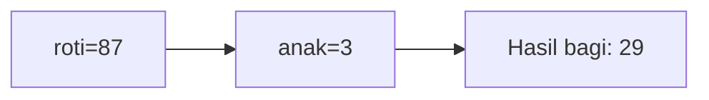

**📖 Penjelasan Komprehensif:**
**Analisis Mendalam (Compiler Manusia):**
1. **Inisialisasi**: Pak Dengklek punya `roti` sebanyak 87 dan ingin dibagi ke 3 `anak`.
2. **Operasi Pembagian**: Rumus `roti / anak` dijalankan. Secara matematis hasilnya 29.00.
3. **Hukum Tipe Data**: Karena hasilnya disimpan ke loker `int`, C++ membuang sisa 0 biji dan hanya mengambil bagian bulatnya.
4. **Hasil Akhir**: `dapet_tiap_anak` bernilai **29**.

---
### Soal 12
```cpp
double saldo_bank = 26.70;
int uang_kertas = (int)saldo_bank;
```
**Pertanyaan:**
1. Berapakah hasil akhirnya?
2. Deskripsikan langkah robot compiler saat memproses kode ini!

**Jawaban & Diagnosis:**
1. **26**
2. Baca bagian 'Analisis Mendalam' di bawah.

**Mermaid Flowchart:**
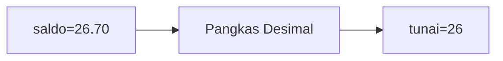

**📖 Penjelasan Komprehensif:**
**Analisis Mendalam (Compiler Manusia):**
1. **Gelas ke Laci**: `saldo_bank` adalah `double` (angka berkoma).
2. **Type Casting**: Perintah `(int)` secara paksa mengubahnya menjadi bilangan bulat.
3. **Efek**: Bagian desimal `26.70` menderita pelenyapan.
4. **Hasil Akhir**: `uang_kertas` berisi **26**.

---
### Soal 13
```cpp
int kelereng = 91;
int anak = 2;
int dapet_tiap_anak = kelereng / anak;
```
**Pertanyaan:**
1. Berapakah hasil akhirnya?
2. Deskripsikan langkah robot compiler saat memproses kode ini!

**Jawaban & Diagnosis:**
1. **45**
2. Baca bagian 'Analisis Mendalam' di bawah.

**Mermaid Flowchart:**
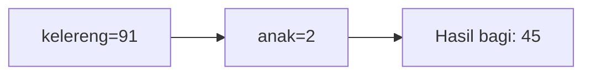

**📖 Penjelasan Komprehensif:**
**Analisis Mendalam (Compiler Manusia):**
1. **Inisialisasi**: Pak Dengklek punya `kelereng` sebanyak 91 dan ingin dibagi ke 2 `anak`.
2. **Operasi Pembagian**: Rumus `kelereng / anak` dijalankan. Secara matematis hasilnya 45.50.
3. **Hukum Tipe Data**: Karena hasilnya disimpan ke loker `int`, C++ membuang sisa 1 biji dan hanya mengambil bagian bulatnya.
4. **Hasil Akhir**: `dapet_tiap_anak` bernilai **45**.

---
### Soal 14
```cpp
double saldo_bank = 22.71;
int uang_kertas = (int)saldo_bank;
```
**Pertanyaan:**
1. Berapakah hasil akhirnya?
2. Deskripsikan langkah robot compiler saat memproses kode ini!

**Jawaban & Diagnosis:**
1. **22**
2. Baca bagian 'Analisis Mendalam' di bawah.

**Mermaid Flowchart:**
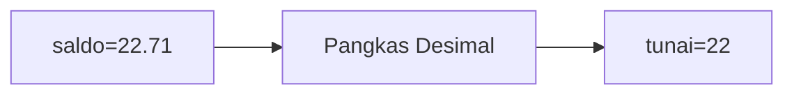

**📖 Penjelasan Komprehensif:**
**Analisis Mendalam (Compiler Manusia):**
1. **Gelas ke Laci**: `saldo_bank` adalah `double` (angka berkoma).
2. **Type Casting**: Perintah `(int)` secara paksa mengubahnya menjadi bilangan bulat.
3. **Efek**: Bagian desimal `22.71` menderita pelenyapan.
4. **Hasil Akhir**: `uang_kertas` berisi **22**.

---
### Soal 15
```cpp
int kelereng = 86;
int anak = 5;
int dapet_tiap_anak = kelereng / anak;
```
**Pertanyaan:**
1. Berapakah hasil akhirnya?
2. Deskripsikan langkah robot compiler saat memproses kode ini!

**Jawaban & Diagnosis:**
1. **17**
2. Baca bagian 'Analisis Mendalam' di bawah.

**Mermaid Flowchart:**
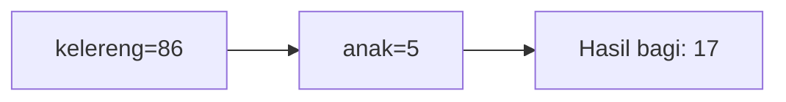

**📖 Penjelasan Komprehensif:**
**Analisis Mendalam (Compiler Manusia):**
1. **Inisialisasi**: Pak Dengklek punya `kelereng` sebanyak 86 dan ingin dibagi ke 5 `anak`.
2. **Operasi Pembagian**: Rumus `kelereng / anak` dijalankan. Secara matematis hasilnya 17.20.
3. **Hukum Tipe Data**: Karena hasilnya disimpan ke loker `int`, C++ membuang sisa 1 biji dan hanya mengambil bagian bulatnya.
4. **Hasil Akhir**: `dapet_tiap_anak` bernilai **17**.

---
### Soal 16
```cpp
double saldo_bank = 50.08;
int uang_kertas = (int)saldo_bank;
```
**Pertanyaan:**
1. Berapakah hasil akhirnya?
2. Deskripsikan langkah robot compiler saat memproses kode ini!

**Jawaban & Diagnosis:**
1. **50**
2. Baca bagian 'Analisis Mendalam' di bawah.

**Mermaid Flowchart:**
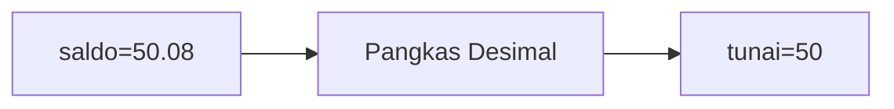

**📖 Penjelasan Komprehensif:**
**Analisis Mendalam (Compiler Manusia):**
1. **Gelas ke Laci**: `saldo_bank` adalah `double` (angka berkoma).
2. **Type Casting**: Perintah `(int)` secara paksa mengubahnya menjadi bilangan bulat.
3. **Efek**: Bagian desimal `50.08` menderita pelenyapan.
4. **Hasil Akhir**: `uang_kertas` berisi **50**.

---
### Soal 17
```cpp
char huruf_awal = 'B';
char kode_rahasia = huruf_awal + 2;
```
**Pertanyaan:**
1. Berapakah hasil akhirnya?
2. Deskripsikan langkah robot compiler saat memproses kode ini!

**Jawaban & Diagnosis:**
1. **D**
2. Baca bagian 'Analisis Mendalam' di bawah.

**Mermaid Flowchart:**
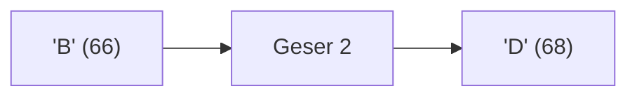

**📖 Penjelasan Komprehensif:**
**Analisis Mendalam (Compiler Manusia):**
1. **Batin Karakter**: Huruf 'B' memiliki nilai ASCII **66**.
2. **Operasi Geser**: Menambah huruf dengan angka akan menggeser posisinya di tabel ASCII: 66 + 2 = 68.
3. **Identitas Baru**: Angka 68 adalah identitas untuk huruf **'D'**.
4. **Hasil Akhir**: `kode_rahasia` berisi **'D'**.

---
### Soal 18
```cpp
int stok_buku = 77;
int rak = 4;
int sisa_buku = stok_buku % rak;
```
**Pertanyaan:**
1. Berapakah hasil akhirnya?
2. Deskripsikan langkah robot compiler saat memproses kode ini!

**Jawaban & Diagnosis:**
1. **1**
2. Baca bagian 'Analisis Mendalam' di bawah.

**Mermaid Flowchart:**
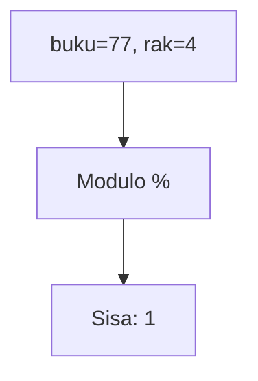

**📖 Penjelasan Komprehensif:**
**Analisis Mendalam (Compiler Manusia):**
1. **Konteks**: Menyusun 77 buku ke 4 rak secara merata.
2. **Mekanisme Modulo**: Operator `%` bukan menghitung hasil bagi, tapi sisa yang tidak muat masuk rak.
3. **Perhitungan**: 77 dibagi 4 sisa **1**.
4. **Hasil Akhir**: `sisa_buku` adalah **1**.

---
### Soal 19
```cpp
int stok_buku = 62;
int rak = 7;
int sisa_buku = stok_buku % rak;
```
**Pertanyaan:**
1. Berapakah hasil akhirnya?
2. Deskripsikan langkah robot compiler saat memproses kode ini!

**Jawaban & Diagnosis:**
1. **6**
2. Baca bagian 'Analisis Mendalam' di bawah.

**Mermaid Flowchart:**
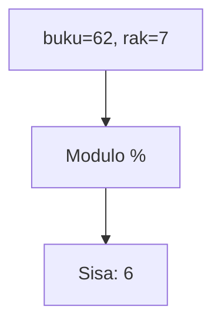

**📖 Penjelasan Komprehensif:**
**Analisis Mendalam (Compiler Manusia):**
1. **Konteks**: Menyusun 62 buku ke 7 rak secara merata.
2. **Mekanisme Modulo**: Operator `%` bukan menghitung hasil bagi, tapi sisa yang tidak muat masuk rak.
3. **Perhitungan**: 62 dibagi 7 sisa **6**.
4. **Hasil Akhir**: `sisa_buku` adalah **6**.

---
### Soal 20
```cpp
int stok_buku = 32;
int rak = 3;
int sisa_buku = stok_buku % rak;
```
**Pertanyaan:**
1. Berapakah hasil akhirnya?
2. Deskripsikan langkah robot compiler saat memproses kode ini!

**Jawaban & Diagnosis:**
1. **2**
2. Baca bagian 'Analisis Mendalam' di bawah.

**Mermaid Flowchart:**


**📖 Penjelasan Komprehensif:**
**Analisis Mendalam (Compiler Manusia):**
1. **Konteks**: Menyusun 32 buku ke 3 rak secara merata.
2. **Mekanisme Modulo**: Operator `%` bukan menghitung hasil bagi, tapi sisa yang tidak muat masuk rak.
3. **Perhitungan**: 32 dibagi 3 sisa **2**.
4. **Hasil Akhir**: `sisa_buku` adalah **2**.

---
### Soal 21
```cpp
int permen = 80;
int anak = 8;
int dapet_tiap_anak = permen / anak;
```
**Pertanyaan:**
1. Berapakah hasil akhirnya?
2. Deskripsikan langkah robot compiler saat memproses kode ini!

**Jawaban & Diagnosis:**
1. **10**
2. Baca bagian 'Analisis Mendalam' di bawah.

**Mermaid Flowchart:**
```mermaid
graph LR
A["permen=80"] --> B["anak=8"]
B --> C["Hasil bagi: 10"]
```

**📖 Penjelasan Komprehensif:**
**Analisis Mendalam (Compiler Manusia):**
1. **Inisialisasi**: Pak Dengklek punya `permen` sebanyak 80 dan ingin dibagi ke 8 `anak`.
2. **Operasi Pembagian**: Rumus `permen / anak` dijalankan. Secara matematis hasilnya 10.00.
3. **Hukum Tipe Data**: Karena hasilnya disimpan ke loker `int`, C++ membuang sisa 0 biji dan hanya mengambil bagian bulatnya.
4. **Hasil Akhir**: `dapet_tiap_anak` bernilai **10**.

---
### Soal 22
```cpp
int kelereng = 100;
int anak = 3;
int dapet_tiap_anak = kelereng / anak;
```
**Pertanyaan:**
1. Berapakah hasil akhirnya?
2. Deskripsikan langkah robot compiler saat memproses kode ini!

**Jawaban & Diagnosis:**
1. **33**
2. Baca bagian 'Analisis Mendalam' di bawah.

**Mermaid Flowchart:**
```mermaid
graph LR
A["kelereng=100"] --> B["anak=3"]
B --> C["Hasil bagi: 33"]
```

**📖 Penjelasan Komprehensif:**
**Analisis Mendalam (Compiler Manusia):**
1. **Inisialisasi**: Pak Dengklek punya `kelereng` sebanyak 100 dan ingin dibagi ke 3 `anak`.
2. **Operasi Pembagian**: Rumus `kelereng / anak` dijalankan. Secara matematis hasilnya 33.33.
3. **Hukum Tipe Data**: Karena hasilnya disimpan ke loker `int`, C++ membuang sisa 1 biji dan hanya mengambil bagian bulatnya.
4. **Hasil Akhir**: `dapet_tiap_anak` bernilai **33**.

---
### Soal 23
```cpp
int stok_buku = 49;
int rak = 7;
int sisa_buku = stok_buku % rak;
```
**Pertanyaan:**
1. Berapakah hasil akhirnya?
2. Deskripsikan langkah robot compiler saat memproses kode ini!

**Jawaban & Diagnosis:**
1. **0**
2. Baca bagian 'Analisis Mendalam' di bawah.

**Mermaid Flowchart:**
```mermaid
graph TD
A["buku=49, rak=7"] --> B["Modulo %"]
B --> C["Sisa: 0"]
```

**📖 Penjelasan Komprehensif:**
**Analisis Mendalam (Compiler Manusia):**
1. **Konteks**: Menyusun 49 buku ke 7 rak secara merata.
2. **Mekanisme Modulo**: Operator `%` bukan menghitung hasil bagi, tapi sisa yang tidak muat masuk rak.
3. **Perhitungan**: 49 dibagi 7 sisa **0**.
4. **Hasil Akhir**: `sisa_buku` adalah **0**.

---
### Soal 24
```cpp
int kelereng = 62;
int anak = 4;
int dapet_tiap_anak = kelereng / anak;
```
**Pertanyaan:**
1. Berapakah hasil akhirnya?
2. Deskripsikan langkah robot compiler saat memproses kode ini!

**Jawaban & Diagnosis:**
1. **15**
2. Baca bagian 'Analisis Mendalam' di bawah.

**Mermaid Flowchart:**
```mermaid
graph LR
A["kelereng=62"] --> B["anak=4"]
B --> C["Hasil bagi: 15"]
```

**📖 Penjelasan Komprehensif:**
**Analisis Mendalam (Compiler Manusia):**
1. **Inisialisasi**: Pak Dengklek punya `kelereng` sebanyak 62 dan ingin dibagi ke 4 `anak`.
2. **Operasi Pembagian**: Rumus `kelereng / anak` dijalankan. Secara matematis hasilnya 15.50.
3. **Hukum Tipe Data**: Karena hasilnya disimpan ke loker `int`, C++ membuang sisa 2 biji dan hanya mengambil bagian bulatnya.
4. **Hasil Akhir**: `dapet_tiap_anak` bernilai **15**.

---
### Soal 25
```cpp
double saldo_bank = 22.61;
int uang_kertas = (int)saldo_bank;
```
**Pertanyaan:**
1. Berapakah hasil akhirnya?
2. Deskripsikan langkah robot compiler saat memproses kode ini!

**Jawaban & Diagnosis:**
1. **22**
2. Baca bagian 'Analisis Mendalam' di bawah.

**Mermaid Flowchart:**
```mermaid
graph LR
A["saldo=22.61"] --> B["Pangkas Desimal"]
B --> C["tunai=22"]
```

**📖 Penjelasan Komprehensif:**
**Analisis Mendalam (Compiler Manusia):**
1. **Gelas ke Laci**: `saldo_bank` adalah `double` (angka berkoma).
2. **Type Casting**: Perintah `(int)` secara paksa mengubahnya menjadi bilangan bulat.
3. **Efek**: Bagian desimal `22.61` menderita pelenyapan.
4. **Hasil Akhir**: `uang_kertas` berisi **22**.

---
