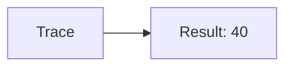
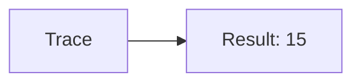
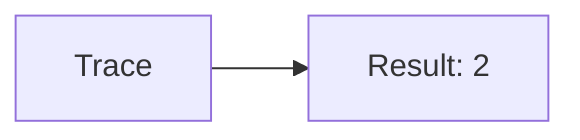
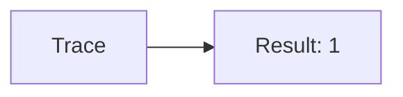
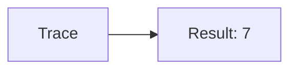
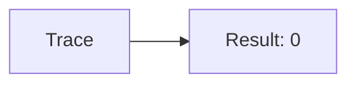
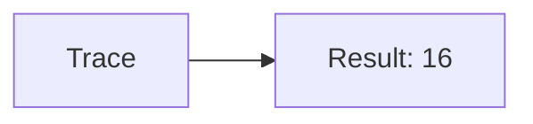

🔙 **[Kembali ke Daftar Soal](./README.md)**

---

# Latihan Soal Part C - Modul 01 - Set 01

### Soal 1
```cpp
// Permen: Pembagian
int permen = 71, bagi = 8;
int hasil = permen / bagi;
```
**Pertanyaan:**
1. Berapakah hasil akhirnya?
2. Deskripsikan alur pikir 'Compiler Manusia' untuk soal ini!

**Jawaban & Diagnosis:**
1. **8**
2. Membagi 71 Permen ke 8 bagian. Hasil bulat: 8.

**Mermaid Flowchart:**


---
### Soal 2
```cpp
// Tiket: Modulo
int tiket = 13, bagi = 7;
int sisa = tiket % bagi;
```
**Pertanyaan:**
1. Berapakah hasil akhirnya?
2. Deskripsikan alur pikir 'Compiler Manusia' untuk soal ini!

**Jawaban & Diagnosis:**
1. **6**
2. 13 Tiket dibagi 7 sisa 6.

**Mermaid Flowchart:**


---
### Soal 3
```cpp
// Buku: Casting
double val = 40.61;
int res = (int)val;
```
**Pertanyaan:**
1. Berapakah hasil akhirnya?
2. Deskripsikan alur pikir 'Compiler Manusia' untuk soal ini!

**Jawaban & Diagnosis:**
1. **40**
2. Mengubah 40.61 jadi integer (pangkas koma) jadi 40.

**Mermaid Flowchart:**


---
### Soal 4
```cpp
// Kelereng: Pembagian
int kelereng = 46, bagi = 3;
int hasil = kelereng / bagi;
```
**Pertanyaan:**
1. Berapakah hasil akhirnya?
2. Deskripsikan alur pikir 'Compiler Manusia' untuk soal ini!

**Jawaban & Diagnosis:**
1. **15**
2. Membagi 46 Kelereng ke 3 bagian. Hasil bulat: 15.

**Mermaid Flowchart:**


---
### Soal 5
```cpp
// Botol: Modulo
int botol = 86, bagi = 6;
int sisa = botol % bagi;
```
**Pertanyaan:**
1. Berapakah hasil akhirnya?
2. Deskripsikan alur pikir 'Compiler Manusia' untuk soal ini!

**Jawaban & Diagnosis:**
1. **2**
2. 86 Botol dibagi 6 sisa 2.

**Mermaid Flowchart:**


---
### Soal 6
```cpp
// Baju: Casting
double val = 40.31;
int res = (int)val;
```
**Pertanyaan:**
1. Berapakah hasil akhirnya?
2. Deskripsikan alur pikir 'Compiler Manusia' untuk soal ini!

**Jawaban & Diagnosis:**
1. **40**
2. Mengubah 40.31 jadi integer (pangkas koma) jadi 40.

**Mermaid Flowchart:**


---
### Soal 7
```cpp
// Sepatu: Pembagian
int sepatu = 90, bagi = 3;
int hasil = sepatu / bagi;
```
**Pertanyaan:**
1. Berapakah hasil akhirnya?
2. Deskripsikan alur pikir 'Compiler Manusia' untuk soal ini!

**Jawaban & Diagnosis:**
1. **30**
2. Membagi 90 Sepatu ke 3 bagian. Hasil bulat: 30.

**Mermaid Flowchart:**


---
### Soal 8
```cpp
// Tas: Modulo
int tas = 46, bagi = 3;
int sisa = tas % bagi;
```
**Pertanyaan:**
1. Berapakah hasil akhirnya?
2. Deskripsikan alur pikir 'Compiler Manusia' untuk soal ini!

**Jawaban & Diagnosis:**
1. **1**
2. 46 Tas dibagi 3 sisa 1.

**Mermaid Flowchart:**


---
### Soal 9
```cpp
// Piring: Casting
double val = 75.31;
int res = (int)val;
```
**Pertanyaan:**
1. Berapakah hasil akhirnya?
2. Deskripsikan alur pikir 'Compiler Manusia' untuk soal ini!

**Jawaban & Diagnosis:**
1. **75**
2. Mengubah 75.31 jadi integer (pangkas koma) jadi 75.

**Mermaid Flowchart:**


---
### Soal 10
```cpp
// Gelas: Pembagian
int gelas = 21, bagi = 3;
int hasil = gelas / bagi;
```
**Pertanyaan:**
1. Berapakah hasil akhirnya?
2. Deskripsikan alur pikir 'Compiler Manusia' untuk soal ini!

**Jawaban & Diagnosis:**
1. **7**
2. Membagi 21 Gelas ke 3 bagian. Hasil bulat: 7.

**Mermaid Flowchart:**


---
### Soal 11
```cpp
// Kursi: Modulo
int kursi = 75, bagi = 3;
int sisa = kursi % bagi;
```
**Pertanyaan:**
1. Berapakah hasil akhirnya?
2. Deskripsikan alur pikir 'Compiler Manusia' untuk soal ini!

**Jawaban & Diagnosis:**
1. **0**
2. 75 Kursi dibagi 3 sisa 0.

**Mermaid Flowchart:**


---
### Soal 12
```cpp
// Meja: Casting
double val = 16.41;
int res = (int)val;
```
**Pertanyaan:**
1. Berapakah hasil akhirnya?
2. Deskripsikan alur pikir 'Compiler Manusia' untuk soal ini!

**Jawaban & Diagnosis:**
1. **16**
2. Mengubah 16.41 jadi integer (pangkas koma) jadi 16.

**Mermaid Flowchart:**


---
### Soal 13
```cpp
// Lampu: Pembagian
int lampu = 45, bagi = 6;
int hasil = lampu / bagi;
```
**Pertanyaan:**
1. Berapakah hasil akhirnya?
2. Deskripsikan alur pikir 'Compiler Manusia' untuk soal ini!

**Jawaban & Diagnosis:**
1. **7**
2. Membagi 45 Lampu ke 6 bagian. Hasil bulat: 7.

**Mermaid Flowchart:**


---
### Soal 14
```cpp
// Kipas: Modulo
int kipas = 41, bagi = 3;
int sisa = kipas % bagi;
```
**Pertanyaan:**
1. Berapakah hasil akhirnya?
2. Deskripsikan alur pikir 'Compiler Manusia' untuk soal ini!

**Jawaban & Diagnosis:**
1. **2**
2. 41 Kipas dibagi 3 sisa 2.

**Mermaid Flowchart:**


---
### Soal 15
```cpp
// AC: Casting
double val = 83.21;
int res = (int)val;
```
**Pertanyaan:**
1. Berapakah hasil akhirnya?
2. Deskripsikan alur pikir 'Compiler Manusia' untuk soal ini!

**Jawaban & Diagnosis:**
1. **83**
2. Mengubah 83.21 jadi integer (pangkas koma) jadi 83.

**Mermaid Flowchart:**


---
### Soal 16
```cpp
// TV: Pembagian
int tv = 15, bagi = 6;
int hasil = tv / bagi;
```
**Pertanyaan:**
1. Berapakah hasil akhirnya?
2. Deskripsikan alur pikir 'Compiler Manusia' untuk soal ini!

**Jawaban & Diagnosis:**
1. **2**
2. Membagi 15 TV ke 6 bagian. Hasil bulat: 2.

**Mermaid Flowchart:**


---
### Soal 17
```cpp
// Kabel: Modulo
int kabel = 40, bagi = 5;
int sisa = kabel % bagi;
```
**Pertanyaan:**
1. Berapakah hasil akhirnya?
2. Deskripsikan alur pikir 'Compiler Manusia' untuk soal ini!

**Jawaban & Diagnosis:**
1. **0**
2. 40 Kabel dibagi 5 sisa 0.

**Mermaid Flowchart:**


---
### Soal 18
```cpp
// Pulpen: Casting
double val = 85.81;
int res = (int)val;
```
**Pertanyaan:**
1. Berapakah hasil akhirnya?
2. Deskripsikan alur pikir 'Compiler Manusia' untuk soal ini!

**Jawaban & Diagnosis:**
1. **85**
2. Mengubah 85.81 jadi integer (pangkas koma) jadi 85.

**Mermaid Flowchart:**


---
### Soal 19
```cpp
// Pensil: Pembagian
int pensil = 76, bagi = 5;
int hasil = pensil / bagi;
```
**Pertanyaan:**
1. Berapakah hasil akhirnya?
2. Deskripsikan alur pikir 'Compiler Manusia' untuk soal ini!

**Jawaban & Diagnosis:**
1. **15**
2. Membagi 76 Pensil ke 5 bagian. Hasil bulat: 15.

**Mermaid Flowchart:**


---
### Soal 20
```cpp
// Penghapus: Modulo
int penghapus = 50, bagi = 4;
int sisa = penghapus % bagi;
```
**Pertanyaan:**
1. Berapakah hasil akhirnya?
2. Deskripsikan alur pikir 'Compiler Manusia' untuk soal ini!

**Jawaban & Diagnosis:**
1. **2**
2. 50 Penghapus dibagi 4 sisa 2.

**Mermaid Flowchart:**


---
### Soal 21
```cpp
// Penggaris: Casting
double val = 62.31;
int res = (int)val;
```
**Pertanyaan:**
1. Berapakah hasil akhirnya?
2. Deskripsikan alur pikir 'Compiler Manusia' untuk soal ini!

**Jawaban & Diagnosis:**
1. **62**
2. Mengubah 62.31 jadi integer (pangkas koma) jadi 62.

**Mermaid Flowchart:**
```mermaid
graph LR
A[Trace] --> B[Result: 62]
```

---
### Soal 22
```cpp
// Kotak: Pembagian
int kotak = 73, bagi = 4;
int hasil = kotak / bagi;
```
**Pertanyaan:**
1. Berapakah hasil akhirnya?
2. Deskripsikan alur pikir 'Compiler Manusia' untuk soal ini!

**Jawaban & Diagnosis:**
1. **18**
2. Membagi 73 Kotak ke 4 bagian. Hasil bulat: 18.

**Mermaid Flowchart:**
```mermaid
graph LR
A[Trace] --> B[Result: 18]
```

---
### Soal 23
```cpp
// Dompet: Modulo
int dompet = 71, bagi = 6;
int sisa = dompet % bagi;
```
**Pertanyaan:**
1. Berapakah hasil akhirnya?
2. Deskripsikan alur pikir 'Compiler Manusia' untuk soal ini!

**Jawaban & Diagnosis:**
1. **5**
2. 71 Dompet dibagi 6 sisa 5.

**Mermaid Flowchart:**
```mermaid
graph LR
A[Trace] --> B[Result: 5]
```

---
### Soal 24
```cpp
// Kunci: Casting
double val = 95.41;
int res = (int)val;
```
**Pertanyaan:**
1. Berapakah hasil akhirnya?
2. Deskripsikan alur pikir 'Compiler Manusia' untuk soal ini!

**Jawaban & Diagnosis:**
1. **95**
2. Mengubah 95.41 jadi integer (pangkas koma) jadi 95.

**Mermaid Flowchart:**
```mermaid
graph LR
A[Trace] --> B[Result: 95]
```

---
### Soal 25
```cpp
// Hp: Pembagian
int hp = 83, bagi = 5;
int hasil = hp / bagi;
```
**Pertanyaan:**
1. Berapakah hasil akhirnya?
2. Deskripsikan alur pikir 'Compiler Manusia' untuk soal ini!

**Jawaban & Diagnosis:**
1. **16**
2. Membagi 83 Hp ke 5 bagian. Hasil bulat: 16.

**Mermaid Flowchart:**
```mermaid
graph LR
A[Trace] --> B[Result: 16]
```

---
