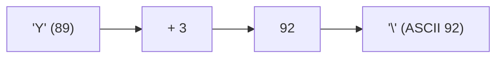
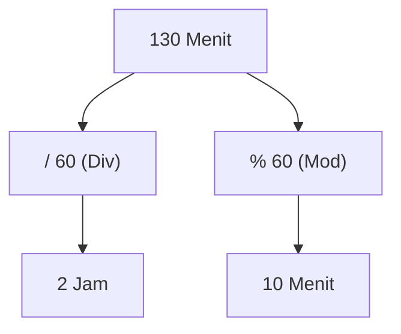
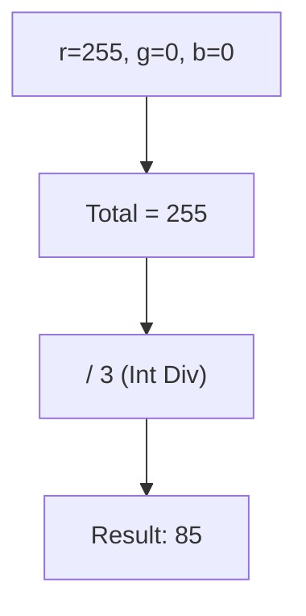
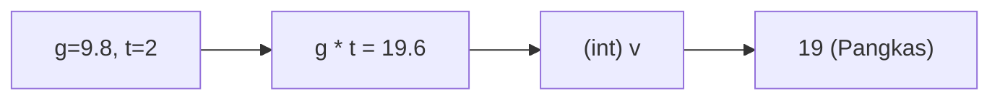
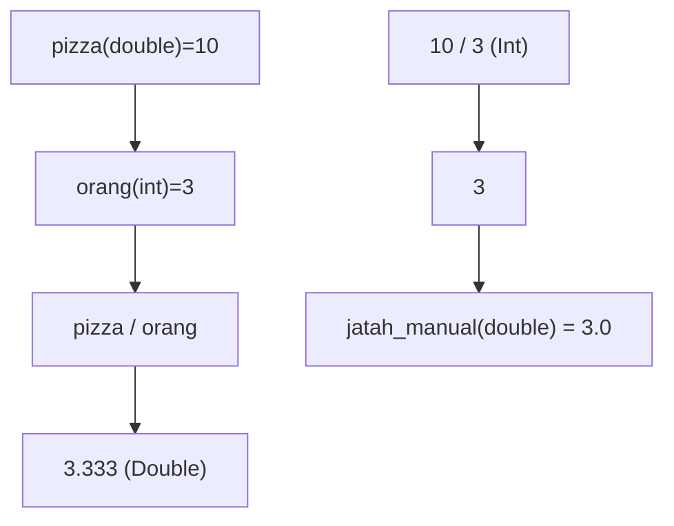
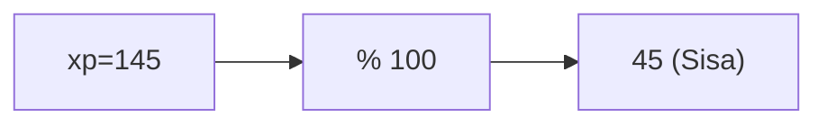
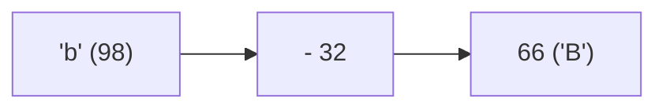
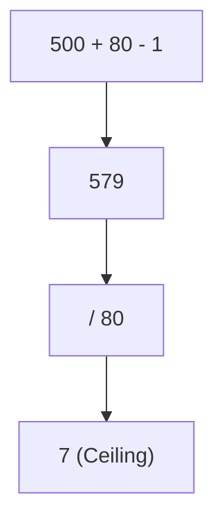

🔙 **[Kembali ke Daftar Soal](./README.md)**

---

# Latihan Soal Part C - Modul 01 - Set 01 (Premium Edition)

---

### Soal 1: Zakat Maal (Jebakan Truncation)
```cpp
// Skenario: Menghitung Zakat 2.5% dari harta
double harta = 1000.75;
int zakat_bulat = (int)(harta * 0.025);
```
**Pertanyaan:**
1. Berapakah nilai akhir dari `zakat_bulat`?
2. Mengapa angka di belakang koma menghilang sepenuhnya?

<details>
<summary><b>Klik untuk Lihat Jawaban & Diagnosis</b></summary>

**Mermaid Flowchart:**


**Jawaban:**
1. **25**
2. Karena hasil perkalian `double` dipaksa masuk ke loker `int` lewat *explicit casting* `(int)`.

**📖 Analisis Mendalam (Step-by-Step):**
1. Operasi matematika berjalan normal pada bilangan `double`: `1000.75 * 0.025` menghasilkan `25.01875`.
2. Kemudian compiler melihat ada perintah *explicit casting* yaitu `(int)`. Ini ibarat mencetak paksa bilangan desimal ke dalam cetakan bilangan bulat.
3. Saat *casting* dari `double` ke `int` terjadi dalam C++, sifat natural bahasanya adalah **Truncation towards zero** (memangkas ke arah nol). Artinya, C++ **TIDAK** menerapkan pembulatan matematis biasa (seperti lazimnya pecahan `.5` dibulatkan ke atas).
4. Tidak peduli walau angkanya `25.9999`, jika di-cast ke `int`, hasilnya akan dimutilasi seketika menjadi `25`. Inilah jebakan klasik soal OSN-K ketika banyak variabel desimal dipaksa masuk ke wadah variabel `int`.
</details>

---

### Soal 2: Caesar Cipher (Perputaran ASCII)
```cpp
// Skenario: Menggeser huruf 'Y' sebanyak 3 langkah
char huruf = 'Y';
char hasil = huruf + 3;
```
**Pertanyaan:**
1. Karakter apakah yang tersimpan di variabel `hasil`? (Gunakan tabel ASCII mental: X=88, Y=89, Z=90).
2. Apa yang terjadi jika kita menjumlahkan `char` dengan `int`?

<details>
<summary><b>Klik untuk Lihat Jawaban & Diagnosis</b></summary>

**Mermaid Flowchart:**


**Jawaban:**
1. **'\\'** (Backslash) atau karakter dengan kode ASCII **92**.
2. Terjadi **Type Promotion**: `char` naik kasta jadi `int` saat dijumlahkan.

**📖 Analisis Mendalam (Step-by-Step):**
1. Dalam C++, karakter tunggal bertipe `char` disimpan dalam bentuk angka biner yang merujuk pada **Tabel ASCII** (tipe data numerik terkecil, 1 byte).
2. Kode ASCII untuk `'Y'` huruf kapital adalah `89`.
3. Pada saat perintah `huruf + 3` dieksekusi, nilai `89` ditambah `3` sehingga menghasilkan `92`. Pada tahap komputasi ini, logika aritematikal nilai `char` "naik pangkat" sementara menjadi tipe `int` (fenomena yang disebut *Integer Promotion*).
4. Karena hasilnya ditempatkan kembali ke dalam wadah bertipe `char hasil`, maka angka `92` tersebut diubah wujud representasinya kembali mengikuti aturan tabel ASCII, yaitu menjadi simbol garis miring terbalik (backslash `\`).
5. Perangkap umum perserta pemula adalah mengira bahwa `'Y' + 3` otomatis berputar (*wrap around*) melewati Z dan ter-reset bergulir menjadi `'B'`. Sistem **TIDAK** mengenali abjad sebagai siklus alfabetis tertutup (melingkar) kecuali jika kita merancangnya secara manual dengan bantuan operasi matematika modulo `%`.
</details>

---

### Soal 3: Parkir Mall (Modulo Bertingkat)
```cpp
// Skenario: Konversi 130 menit ke Jam dan Sisa Menit
int total_menit = 130;
int jam = total_menit / 60;
int sisa_menit = total_menit % 60;
```
**Pertanyaan:**
1. Berapakah nilai `jam`?
2. Berapakah nilai `sisa_menit`?

<details>
<summary><b>Klik untuk Lihat Jawaban & Diagnosis</b></summary>

**Mermaid Flowchart:**


**Jawaban:**
1. **2**
2. **10**

**📖 Analisis Mendalam (Step-by-Step):**
1. Jika dua buah bilangan integer dibagi bersilang (menggunakan operator `/`), C++ akan langsung mengeksekusi kalkulasi **Integer Division** (Pembagian Bulat) yang kaku, yakni tindakan mengabstraksi pecahan dan menolak bentuk desimal.
2. Saat menghitung `130 / 60`, rasio matematikanya setara `2.166...`, namun bagian serpihan pecahan `.166...` ditendang dibuang sepenuhnya menyisakan kepingan kokoh bulat **`2`**. Ini sangat selaras merepresentasikan arti "berapa jam mutlak penuh" yang sanggup diwadahkan dalam slot 130 menit tersebut.
3. Di sisi baliknya, operator `%` (modulo) dirancang spesifik mendikte sisa absolut eksresi pembagian integer. Formula baliknya menjadi: `Nilai = (Pembagi × Hasil) + Sisa`.
4. Kita ketahui `120` adalah batasan interval kelipatan terbesar mutlak miliknya `60` di ambang batas nilai tuntas `130`. Kalkulasi konkrit `130 - 120 = 10`. Terdapat limpahan muatan `10` menit tak penuh yang disita untuk diekstrak menjadi `sisa_menit`. Di jagat kompetisi OSN-K, modulo sakti dipuja sebagai amunisi utama memecah siklus deret ganjil-genap dan konversi penanggalan kronometriktik waktu!
</details>

---

### Soal 4: Presisi Warna (Integer Division Artifact)
```cpp
// Skenario: Mengubah RGB ke Grayscale sederhana
int r = 255, g = 0, b = 0;
int gray = (r + g + b) / 3;
```
**Pertanyaan:**
1. Berapakah nilai `gray`?
2. Jika kita meredupkan warna menjadi `r=2, g=0, b=0`, berapakah hasil `gray`?

<details>
<summary><b>Klik untuk Lihat Jawaban & Diagnosis</b></summary>

**Mermaid Flowchart:**


**Jawaban:**
1. **85**
2. **0** (Bukan 0.66!)

**📖 Analisis Mendalam (Step-by-Step):**
1. Pada iterasi konversi normal RGB (kasus parameter 1), operasi penjumlahan dibungkus utuh dalam kurung penyeimbang hierarki urutan `(r+g+b) = (255+0+0) = 255`. Langkah lanjutannya, operasi perataan `255 / 3 = 85`. Integer bertemu integer, menghasilkan nilai integer padat bundar mantul tepat 85 tanpa desimal yang dibuang.
2. Di skenario modifikasi warna pudar suram (kasus bayang 2), kita memasok racikan `r=2, g=0, b=0`. Angka kumulatif mutlaknya `2 + 0 + 0 = 2`.
3. Sampai di persimpangan kalkulasi vital, program dengan tulus pasrah menjalankan rutinas paten **Integer Division**: `2 / 3`. Mengingat pihak margin pembilang target nominal `(2)` kalah kecil dari margin kriteria sang pembagi resolusi absolut `(3)`, algoritma gagal menggapai pijakan tangga bulat `1` dan enggan menggambar pecahan ilusif (`0.666...`).
4. Seketika juga rakitan kompilator C++ memotong penggal angka nol dan pecahan, melempar nilai mutlak kosong murni **`0`**. Warna dipastikan menjadi redup segelap jurang.
5. Sifat presipitasi penghancur pecahan di zona integer inilah yang lazim ditempatkan juri pembuat OSN-K untuk memotong skor peserta yang salah bersandar pada imajinasi presisi rasio irasional.
</details>

---

### Soal 5: Saldo ATM (Sisa Saku)
```cpp
// Skenario: Tarik uang 150rb, sisa di bank?
int saldo = 500000;
int tarik = 150000;
saldo -= tarik;
int lembar_50rb = saldo / 50000;
```
**Pertanyaan:**
1. Berapakah nilai `saldo` setelah penarikan?
2. Berapakah nilai `lembar_50rb`?

<details>
<summary><b>Klik untuk Lihat Jawaban & Diagnosis</b></summary>

**Mermaid Flowchart:**


**Jawaban:**
1. **350000**
2. **7**

**📖 Analisis Mendalam (Step-by-Step):**
1. C++ diperindah dengan ketersediaan opsi formulasi kependekan operasi (sering dijuluki *compound assignment operators*), deretannya meliputi `+=`, `-=`, `*=`, hingga `/=`.
2. Ekspresi reduktif `saldo -= tarik` diinterpretasikan mesin dengan akurasi 100% sama dengan format repetitif konservatif `saldo = saldo - tarik`.
3. Selisih deviasi margin saldo simpanan setelah prosedur penarikan disepakati dengan hasil tuntas `500000 - 150000 = 350000`. Kotak nominal `saldo` dirubah dan ditampar mutasi modifikasi *real-time* dengan sisa aktual terkini di memori bank.
4. Lini final konversi bundel gepokan mengaktivasi rutinitas perataan pecahan `saldo / 50000`. Cekatan `350000 / 50000` setara utuh `7`.
5. Oleh alasan nilai kebetulan ini bersandar selaras bundel genap (tanpa rembes pecahan uang recehan yang membias/modulo sisa `0`), angka integral tertampung brilian masuk dalam parameter kuantifikasi keping integer. Kepiawaian mata menganalisa lintasan sintaks pengubah nilai aktual seperti `-=` ialah syarat fundamental untuk menyelamatkan nyawa pada babak eksekusi iterasi rekursi tebal panjang di fase OSN-K bab berikutnya.
</details>

---

### Soal 6: Fisika: Jatuh Bebas (Casting Effect)
```cpp
// v = g * t, g=9.8, t=2
double g = 9.8;
int t = 2;
int v = g * t;
```
**Pertanyaan:**
1. Berapakah nilai `v`? (Hati-hati, bukan 19.6!)
2. Apa yang terjadi pada desimalnya?

<details>
<summary><b>Klik untuk Lihat Jawaban & Diagnosis</b></summary>

**Mermaid Flowchart:**


**Jawaban:**
1. **19**
2. Dibuang (truncated).

**📖 Analisis Mendalam (Step-by-Step):**
1. Protagonis tipe data pecahan `g` dikukuhkan tipe `double` berangka sakral `9.8`. Sementara teman pengali konstan durasi `t` adalah variabel solid tipe kaku `int` yang berisi angka tunggal bundar `2`.
2. Ketika sintaks hibrida terajut `g * t`, ranah presisi longgar `double` bertabrakan keras dengan kasta utuh `int`. Tumbukan hierarki otomatis memicu trigger kompensator kompilator: porsi `t` terangkat harkat takrif jembatan transisi kasta menjadi pecahan imitasi (`2.0`), demi mensetarakan ekuasi medan laga perkalian di habitat presisi yang mulia (*Implicit Type Conversion*).
3. Buah dari toleransi paksa tersebut, hasil margin perkalian `9.8 * 2.0 = 19.6` sukses diabadikan damai dalam buaian *floating point logic* yang utuh tidak terpelintir potong sejengkal jua.
4. Tapi ingat ada **Jebakan Petaka Pemotretan Destinasi**: C++ menuntut mahakarya berangka pecah cantik tersebut ditusuk dikemas menjejal kandang target kurungan bernama variabel tipe dasar mutlak `int v`. Nahas. Di sekon dramatis assignment penugasan inilah C++ menjalankan eksekusi vonis pancung (*truncation*); serabut digit rasional `.6` dirobek dibasmi buang tanpa ampun—ia ditolak bulat-bulat, nihil kompromi permohonan metode *round-to-nearest* matematis normal awam.
5. Jejak inkarnasi inisialisasi tak seimbang paksa `int v = 19.6` tercitra memuntahkan figur solid permanen **19**. Peringatan nyalak di arena simulasi algoritme berdarah OSN-K: jangan mudah luluh takluk terpesona keindahan ilusi kalkulator fiktifmu sebelum kau menyelidik jeli konstruksi identitas peti mati pengurung akhir (*Assignment Type*) sang rentetan perantara.
</details>

---

### Soal 7: Pizza Party (Double vs Int)
```cpp
double pizza = 10;
int orang = 3;
double jatah_cerdas = pizza / orang;
double jatah_manual = 10 / 3;
```
**Pertanyaan:**
1. Berapakah nilai `jatah_cerdas`?
2. Berapakah nilai `jatah_manual`?

<details>
<summary><b>Klik untuk Lihat Jawaban & Diagnosis</b></summary>

**Mermaid Flowchart:**


**Jawaban:**
1. **3.333...**
2. **3.0**

**📖 Analisis Mendalam (Step-by-Step):**
1. Hukum besi compiler C++ menetapkan regulasi komputasional: tata krama resolusi kalkulatif (presisi atau pemenggalan integer) hanya ditakar langsung seketika pada relasi interaksi antarkomponen bersinggungan di seberang operator—**bukan** tunduk mencium parameter destinasi tempat tampungan wadah penerima menanti hasil akhirnya.
2. Saat menengok barisan eksekusi sintaks peruntukan `jatah_cerdas = pizza / orang;`, kita pantang lupa deklarasi variabel sang `pizza` diramu murni mengukuhkan cetak biru kasta `double`. Bila persimpangan jalan C++ menghadapkan eksistensi bilangan bangsawan pecahan membelah rasio dengan rakyat jelata `int` bundar mulus, derajat dominasi hirarki tinggi seketika ter-upgrade: komputasi dikanalisasi di arena lapang presisi *Floating-point Division*, menghasilan deviasi riil berantai `3.3333333...` yang damai.
3. Di lain titik spektrum kontradiktif evaluasi tertulis pada parameter sintaks `jatah_manual = 10 / 3;`, keping numerik 10 dan 3 terlahir sebagai serabut serpihan purba (literal konstan telanjang) berderajat kaku standard interger `int`. Konstelasi integer versus integer niscaya meledakkan gerak radikal biner **Integer Division** kuno nan pelit. Bilangan bulat padat (`10`) diremas bagi bulat utuh padat absolut (`3`) meneteskan produk kristal solid tak terbendung **`3`**. Remahan rasional debu sisa irasional (alias keping porsi 1/3-nya) terbasmi nihil di rongga kegelapan dimensi hilang.
4. Momen ironik paling pedih baru menetas ketika C++ meyeret mayat balok bulat kaku tegar **3** ini masuk persemayaman terakhir bernama ranjang loker memori variabel `double` sang pemilik presisi semu yang sombong. Tentu tabiat mesin menghikiti tipe data penampungnya dengan ramah tamah memoles bedak kosmetik topeng berformat `3.0`. Malangnya, bulu sayap nilai presisi aslinya terpotong di gerbang pertama, sebelum memori `double` menampungnya. Kekosongan distorsi rasio ini tak pelak mensponsori kehancuran fatal struktur algoritme dinamis rentan kesalahan pada babak final kaliber pilar turnamen komputasi nasional!
</details>

---

### Soal 8: XP Leveling (Progress Bar)
```cpp
int xp_sekarang = 145;
int batas_level = 100;
int persen_progres = xp_sekarang % batas_level;
```
**Pertanyaan:**
1. Berapakah nilai `persen_progres`?
2. Logic modul ini sering digunakan untuk apa dalam game?

<details>
<summary><b>Klik untuk Lihat Jawaban & Diagnosis</b></summary>

**Mermaid Flowchart:**


**Jawaban:**
1. **45**
2. Mengetahui sisa XP murni di tingkatan level posisi saat ini setelah membersihkan lintasan putaran level akumulatif genap penuh di masa lampaunya (Implementasi arsitektur perputaran rotasi *Wrap-around Mechanism*).

**📖 Analisis Mendalam (Step-by-Step):**
1. Karakter khusus pengoperasi pembagi sisa Modulo `%` adalah figur vital sentral reaktor dari aneka komputasi dinamika sirkulasi roda mesin pemutar tak terhingga. Modulo mengizinkan besaran rekap tak ternilai diracik dipotong simetris hingga merepresentasi indikator sebaran residual *Real-Time* memantau kemajuan.
2. Simulasi skenario berbunyi: deposit kumulasi metrik pengalaman karakter sang ksatria seumur hidupnya (dari kepingan terkecil mula ia dikonsepsi) setara **145** poin sakral. Undang-undang limit hierarki kenaikan promosi menstipulasikan penalti stagnansi pada interval periodik konstan blok padat nominal mutlak **100** tumpukan.
3. Sejenak mengintip rasio integral `145 / 100` memformulasikan pondasi level dasar kepangkatan mutlak terpendam; pengguna sah menyandang trofi "Level 1" (lantaran 100 dapat dihisap masuk persis 1 bongkahan bundar di dalam wadah rongga perut 145).
4. Selanjutnya tarian eksekusi utama sintaks `%` modifikatif yang gemilang pada rentetan operasi aritmatika `145 % 100`. Relik logika modulo mengurai rasio residu, secara harafiah menjagal potong seluruh kapasitas genap berwujud proksi batas pelimpahan utuh kelipatan `100` raksasa dan menyisir pelan tunggakan butiran pecahan sisanya tak terlunta-lunta, mengekstrak residu antrean debu sisa solid berangka **`45`**.
5. Logika praktikal penerjemahan angka magis `45` membius elemen di radar *Front-end Graphic User Interface*: sistem mengadopsinya laksana sisa ukur pengisi jarum panel spedometer di bar navigasi yang menjembatani jenjang pencapaian antara Level 1 menuju pelataran gapura transisi ambang kemajuan visual menyentuh Level 2. Logika cemerlang *Cyclical Rotators* mempesona seperti modulo nyaris dijamin tumpah ruah mewarnai lembaran pelik komplikasi soal studi kasus perlintasan OSN-K!
</details>

---

### Soal 9: Secret ASCII (Uppercase Trick)
```cpp
char huruf_kecil = 'b'; // ASCII 98
char huruf_besar = huruf_kecil - 32;
```
**Pertanyaan:**
1. Karakter apakah `huruf_besar`?
2. Mengapa angka **32** sangat sakral dalam tabel ASCII?

<details>
<summary><b>Klik untuk Lihat Jawaban & Diagnosis</b></summary>

**Mermaid Flowchart:**


**Jawaban:**
1. **'B'** (ASCII 66)
2. Karena interval 32 adalah jarak pakem perpindahan numerik matematis yang presisi tak tergoyahkan dan konstan simetris antara susunan urutan klaster abjad versi kecil dibanding format cetak huruf besar paralelnya dalam deret fondasi standar basis pemetaan bahasa permesinan Tabel ASCII.

**📖 Analisis Mendalam (Step-by-Step):**
1. Serapan linguistik aksara tekstual di alam komputasi dikurung ditranslasikan pada deretan kode sinyal numerik hierarki biner ASCII (dimana mesin buta mengenali perwakilan satu simbol tunggal). Serentetan panji bendera klaster huruf kapital berwibawa `A` bermula dari titik tapal batas angka statis sakral di node `65` (bergulir meruntut presisi alfanumerik lurus hingga klimaks `Z` bertengger mutlak bernominal `90`). Di lain benua memori klaster saudaranya si huruf bersahaja versi kecil `a` memulai siklus embrio terpisahnya di ranah rel indeks urutan `97` (terus bertumbuh hingga tuntas di pelataran limit titik `122`).
2. Secara mengagumkan, pencetus peta konversi tersebut menanam celah simetrisitas gap sinkron perlintasan paralel yang konsisten terkunci mutlak di jenjang selisih selot slot `32` pijakan tapak langkah pemisah antara dua "cerminan identik" varian jenis wajah aksara. Coba intip kalkulasinya: `a (97) - A (65) = 32`. Mengabsen `b (98) - B (66) = 32`. Kerapian repetisi tanpa cacat!
3. Membedah manuver trik sakti manipulatif pilar komputasional C++ untuk kontestasi manual rakitan Olimpiade, resep ajaib mentransformasikan teks tulisan kata kecil yang malu-malu menjadi ledakan teriakan Kapital membahana cukup direduksi dengan menendang selisih substrak pengurangannya presisi menembus dimensi turun di kurva ` - 32`. Sebaliknya, penambahan beban batu darmaga `+ 32` ke aksara kapital congkak mutlak memukulnya mundur surut menyusup terjun mendarat menjelma varian bentuk versi merendah (*lowercase*).
4. Pengetahuan kodrat hukum alam ini merupakan senjata esensial paling fundamental di barisan soal *Competitive String Obfuscation* yang mampat berputar menggiling konversi enkripsi manipulatif tanpa bantuan librari kawan eksternal bawaan pabrik kompilator sekelas `#include <cctype>` dan utilitas gampangan instruksi parameter parameter `toupper()` pemanja kaum santai!
</details>

---

### Soal 10: Kapasitas Lift (Ceiling Logic)
```cpp
int berat_total = 500;
int kapasitas_orang = 80;
int butuh_berapa_kali = (berat_total + kapasitas_orang - 1) / kapasitas_orang;
```
**Pertanyaan:**
1. Berapakah nilai `butuh_berapa_kali`?
2. Rumus di atas adalah trik C++ untuk melakukan apa?

<details>
<summary><b>Klik untuk Lihat Jawaban & Diagnosis</b></summary>

**Mermaid Flowchart:**


**Jawaban:**
1. **7**
2. **Ceiling (Pembulatan ke Atas)** tanpa menggunakan library `<cmath>`.

**📖 Analisis Mendalam (Step-by-Step):**
1. Realita dimensi fana komputasi memotret simulasi ganjil: jika tumpukan muatan serombongan beban kolosal `500 kg` dikirim via transportasi kargo bermuatan limit kapasitas sempit bernapas serba pelit seukuran takar `80 kg`, komputasi kalkulator awam biasa otomatis mensortir kalkulasinya berformat logistik riil eksak `500 / 80` sama dan persis meledak jadi rentetan repetitif rasional ganjil `6.25`. Sayang beribu sayang, akal sehat mengkritisi mustahil meluncurkan "seperempat lintasan (0.25) irama trayek perjalanan" wahana logistik! Kewajiban niscaya memaksa kita membuang kalkulasi perbatasan ke pusaran atas awan atap awang (*ceiling mathematical round*) -> dipatenkan memborong ludes komplit tuntutan perjalanan tak terpangkas sebanyak **7 etape rotasi lintasan armada logistik penuh gairah** guna mengeruk ampas remah gram yang belum diangkut.
2. Di teritorial suci ajang pertarungan sengit OSN-K, terharamkan secara absolut memanggil fungsi eksternal kosmetik import pelengkap manja seperti `<cmath>` yang dibekali utilitas gampangan pesulap jalan pintas sekelas menu pembulat ke atas instan `ceil()`. Oleh karena itu peramu arsitek jenius kompilasi membocorkan perpaduan trik rahasia rekayasa ramuan pemanipulasi divisi kalkulasi integer beringas.
3. Rumus keramat silang aljabar ini lazim disebut: `(Komulatif Target Penumpang + (Tawaran Slot Kapasitas Angkut Sang Pembagi - 1)) / Slot Kapasitas Angkut Sang Pembagi`.
4. Mari membedah rahim anatominya untuk pembuktian pembungkaman keraguan. Kalkulator maya merekap resep internal ruas atap penyebut ekuasi: `500 + 80 - 1 = 579`.
5. Melangkah maju evaluasikan pembagian sadis divisi integral pemangkas sakti buta bilangan desimal: `579 / 80` yang notabenenya memicu pantulan realitis koma ilusif pecahan `7.2375`. Namun, pertemuan dua elemen keras solid padat utuh `(int / int)` serta-merta mengeksekusi sifat absolut kebiasaan tirani pemenggalan rasionalitasnya mencukur buta lenyap serabut nilai ekor recehan tak berguna di selokan `0.2375`. Entitas compiler kaku tanpa empati dengan cerdik memuntahkan produk final tak tersentuh sisa mutlak yakni bongkahan bulat berlian cemerlang **7**. Sempurna, genap, jenius, praktis, mengangkasa dan sungguh mutlak terhindar seratus persen dari limbah komoditi perusak memori: desimal rasional tak berguna!
</details>
