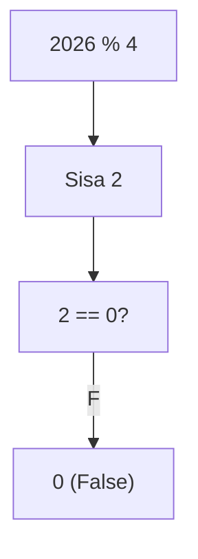
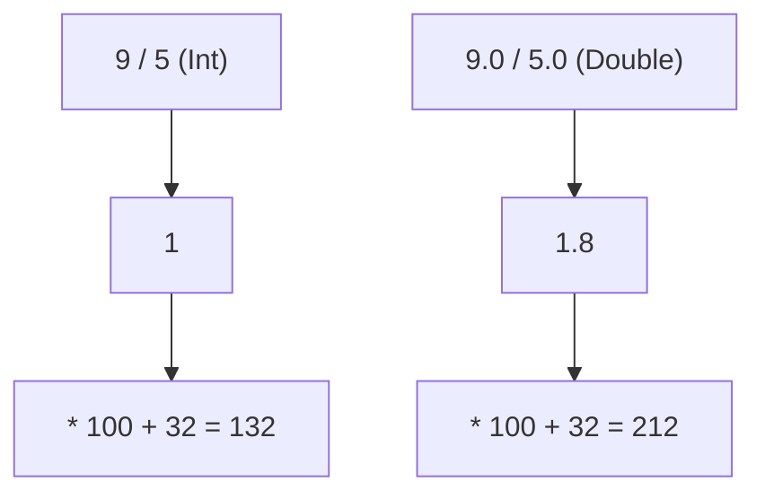
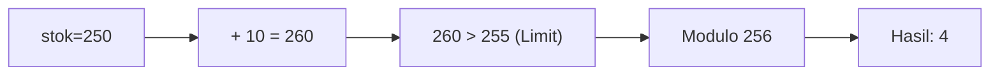
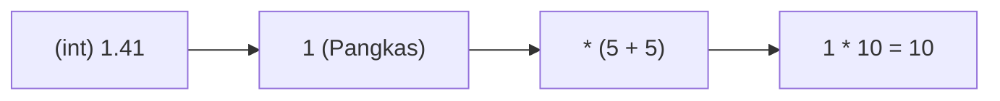
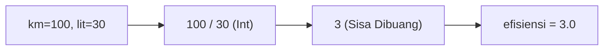
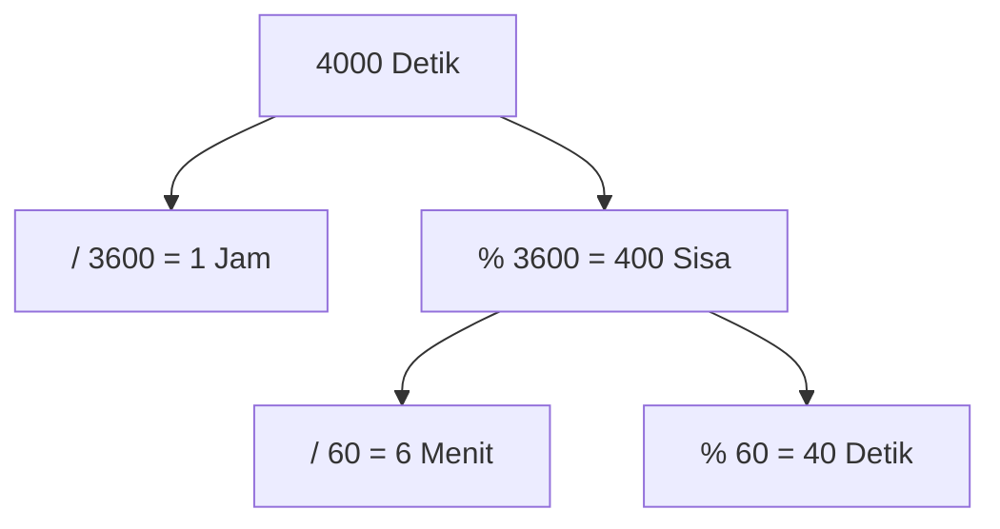
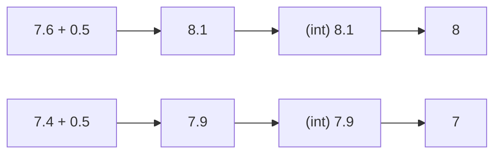
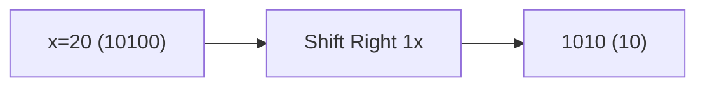

🔙 **[Kembali ke Daftar Soal](./README.md)**

---

# Latihan Soal Part C - Modul 01 - Set 02 (Premium Edition)

---

### Soal 11: Bioskop (Ganjil-Genap Kursi)
```cpp
// Skenario: Menentukan sisi kursi (Ganjil=Kiri, Genap=Kanan)
int no_kursi = 15;
int sisi = no_kursi % 2;
```
**Pertanyaan:**
1. Berapakah nilai `sisi`?
2. Jika `sisi == 1`, kursi tersebut berada di sebelah mana (Kiri/Kanan)?

<details>
<summary><b>Klik untuk Lihat Jawaban & Diagnosis</b></summary>

**Mermaid Flowchart:**


**Jawaban:**
1. **1**
2. **Kiri** (Ganjil)

**📖 Analisis Mendalam:**
Modulo 2 adalah detektor genap/ganjil paling efisien. Apapun angka ganjil di-modulo 2 pasti hasilnya 1. Genap pasti 0.
</details>

---

### Soal 12: Tahun Kabisat (Boolean Math)
```cpp
// Skenario: Cek kabisat sederhana (hanya kelipatan 4)
int tahun = 2026;
int cek = (tahun % 4 == 0);
```
**Pertanyaan:**
1. Berapakah nilai `cek`?
2. Mengapa hasilnya berupa angka (0 atau 1) padahal perbandingannya `bool`?

<details>
<summary><b>Klik untuk Lihat Jawaban & Diagnosis</b></summary>

**Mermaid Flowchart:**


**Jawaban:**
1. **0**
2. Karena di C++, `bool` yang disimpan ke `int` otomatis dikonversi: `false` jadi 0, `true` jadi 1.

**📖 Analisis Mendalam:**
2026 dibagi 4 sisa 2. Maka `2026 % 4 == 0` adalah `false`. False disimpan di `int cek` menjadi **0**.
</details>

---

### Soal 13: Baterai UI (Block Mapping)
```cpp
// Skenario: Mengubah 1-100% menjadi 1-5 blok visual
int bat = 48;
int blok = (bat / 20) + 1;
```
**Pertanyaan:**
1. Berapakah nilai `blok`?
2. Jika baterai tinggal **10%**, berapa blok yang muncul?

<details>
<summary><b>Klik untuk Lihat Jawaban & Diagnosis</b></summary>

**Mermaid Flowchart:**


**Jawaban:**
1. **3**
2. **1**

**📖 Analisis Mendalam:**
`48 / 20` adalah 2. Ditambah 1 menjadi 3. Ini adalah cara memetakan rentang angka besar ke rentang angka kecil untuk kebutuhan UI.
</details>

---

### Soal 14: Konversi Suhu (Floating Order)
```cpp
double cel = 100;
double fahr_A = (9 / 5) * cel + 32;
double fahr_B = (9.0 / 5.0) * cel + 32;
```
**Pertanyaan:**
1. Berapakah nilai `fahr_A`?
2. Berapakah nilai `fahr_B`? (Hati-hati, hasilnya sangat berbeda!)

<details>
<summary><b>Klik untuk Lihat Jawaban & Diagnosis</b></summary>

**Mermaid Flowchart:**


**Jawaban:**
1. **132.0**
2. **212.0**

**📖 Analisis Mendalam:**
Pada `fahr_A`, C++ menghitung `9 / 5` sebagai integer, hasilnya **1**. Maka `1 * 100 + 32 = 132`. 
Pada `fahr_B`, C++ menghitung `9.0 / 5.0` sebagai double, hasilnya **1.8**. Maka `1.8 * 100 + 32 = 212`.
</details>

---

### Soal 15: Overflow Sembako (Unsigned Char)
```cpp
// Range unsigned char: 0 s/d 255
unsigned char stok = 250;
stok = stok + 10;
```
**Pertanyaan:**
1. Berapakah nilai `stok` sekarang? (Bukan 260!)
2. Apa istilah teknis untuk kejadian ini?

<details>
<summary><b>Klik untuk Lihat Jawaban & Diagnosis</b></summary>

**Mermaid Flowchart:**


**Jawaban:**
1. **4**
2. **Overflow** (Meluap kembali ke nol).

**📖 Analisis Mendalam:**
`unsigned char` hanya menampung sampai 255. Saat disuruh menjadi 260, dia akan "berputar": `255 -> 0 -> 1 -> 2 -> 3 -> 4`.
</details>

---

### Soal 16: Jarak Koordinat (Sqrt to Int)
```cpp
// Menghitung jarak horizontal-vertikal
int dx = 5, dy = 5;
int jarak = (int)1.41 * (dx + dy); 
```
**Pertanyaan:**
1. Berapakah nilai `jarak`?
2. Mengapa `(int)1.41` di depan sangat berbahaya bagi akurasi?

<details>
<summary><b>Klik untuk Lihat Jawaban & Diagnosis</b></summary>

**Mermaid Flowchart:**


**Jawaban:**
1. **10**
2. Karena `(int)1.41` dievaluasi **DULUAN** menjadi **1**.

**📖 Analisis Mendalam:**
`(int)1.41` diproses secepat kilat menjadi `1`. Rumus menjadi `1 * (10) = 10`. Padahal seharusnya `1.41 * 10 = 14`. Urutan *casting* sangat krusial!
</details>

---

### Soal 17: Bensin Irit (Integer Division)
```cpp
int km = 100;
int liter = 30;
double efisiensi = km / liter;
```
**Pertanyaan:**
1. Berapakah nilai `efisiensi`?
2. Bagaimana cara memperbaikinya agar muncul angka desimal?

<details>
<summary><b>Klik untuk Lihat Jawaban & Diagnosis</b></summary>

**Mermaid Flowchart:**


**Jawaban:**
1. **3.0** (Desimal hilang sebelum masuk ke double)
2. Ubah salah satu angka menjadi double, misal: `(double)km / liter`.

**📖 Analisis Mendalam:**
`100 / 30` di proses di ranah `int`, hasilnya 3. Meskipun ditampung di `double`, dia sudah terlanjur jadi 3 utuh.
</details>

---

### Soal 18: Jam Digital (Modulo 3600)
```cpp
int total_detik = 4000;
int jam = total_detik / 3600;
int sisa = total_detik % 3600;
int menit = sisa / 60;
int detik = sisa % 60;
```
**Pertanyaan:**
1. Berapakah nilai `jam`, `menit`, and `detik`?
2. Tunjukkan formatnya dalam HH:MM:SS!

<details>
<summary><b>Klik untuk Lihat Jawaban & Diagnosis</b></summary>

**Mermaid Flowchart:**


**Jawaban:**
1. **1 jam, 6 menit, 40 detik**
2. **01:06:40**

**📖 Analisis Mendalam:**
Urutan pembagian dan modulo ini adalah cara standar memecah satuan waktu mundur dari yang paling besar.
</details>

---

### Soal 19: Pembulatan Manual (Round Trick)
```cpp
double nilai = 7.6;
int nilai_rapor = (int)(nilai + 0.5);
```
**Pertanyaan:**
1. Berapakah nilai `nilai_rapor`?
2. Jika nilainya adalah **7.4**, berapakah hasil rapornya?

<details>
<summary><b>Klik untuk Lihat Jawaban & Diagnosis</b></summary>

**Mermaid Flowchart:**


**Jawaban:**
1. **8**
2. **7**

**📖 Analisis Mendalam:**
Ini adalah trik legendaris untuk melakukan pembulatan Matematika (Round) tanpa library. Dengan menambah 0.5, angka .5 ke atas akan naik ke angka berikutnya saat dipangkas oleh `(int)`.
</details>

---

### Soal 20: Bitwise-Math (Div vs Shift)
```cpp
int x = 20;
int hasil_A = x / 2;
int hasil_B = x >> 1;
```
**Pertanyaan:**
1. Apakah `hasil_A` sama dengan `hasil_B`?
2. Apa arti simbol `>> 1` dalam bahasa biner?

<details>
<summary><b>Klik untuk Lihat Jawaban & Diagnosis</b></summary>

**Mermaid Flowchart:**


**Jawaban:**
1. **Ya, sama-sama 10.**
2. **Shift Right 1x** (Geser biner ke kanan sekali, setara membagi 2).

**📖 Analisis Mendalam:**
Di tingkat hardware, geser bit jauh lebih cepat daripada operasi pembagian. Untuk bilangan positif, `/2` dan `>>1` identik.
</details>
