🔙 **[Kembali ke Daftar Soal](./README.md)**

---

# Latihan Soal Part C - Modul 01 - Set 02

### Soal 26
```cpp
double val = 91.44;
int res = (int)val;
```
**Pertanyaan:**
1. Berapakah hasil akhirnya?
2. Mengapa demikian?

**Jawaban & Diagnosis:**
1. **91**
2. Lihat Tracing.

**Mermaid Flowchart:**
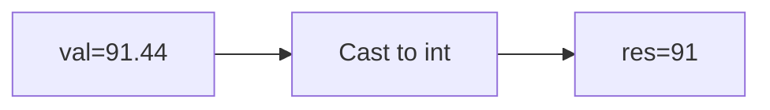

**📖 Penjelasan:**
**Langkah Tracing:**
1. val=91.44.
2. Desimal dihilangkan.
3. Hasil: 91.

---
### Soal 27
```cpp
double val = 18.98;
int res = (int)val;
```
**Pertanyaan:**
1. Berapakah hasil akhirnya?
2. Mengapa demikian?

**Jawaban & Diagnosis:**
1. **18**
2. Lihat Tracing.

**Mermaid Flowchart:**
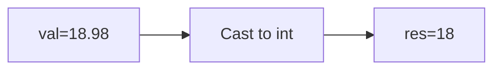

**📖 Penjelasan:**
**Langkah Tracing:**
1. val=18.98.
2. Desimal dihilangkan.
3. Hasil: 18.

---
### Soal 28
```cpp
int n = 27;
int m = 3;
int res = n % m;
```
**Pertanyaan:**
1. Berapakah hasil akhirnya?
2. Mengapa demikian?

**Jawaban & Diagnosis:**
1. **0**
2. Lihat Tracing.

**Mermaid Flowchart:**
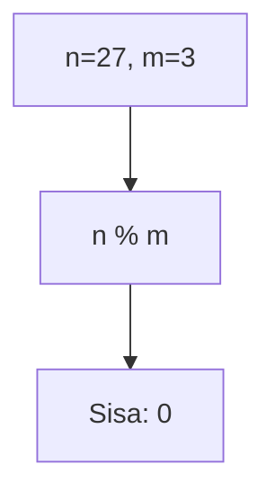

**📖 Penjelasan:**
**Langkah Tracing:**
1. n=27, m=3.
2. 27 dibagi 3 sisa 0.
3. Hasil: 0.

---
### Soal 29
```cpp
double val = 51.22;
int res = (int)val;
```
**Pertanyaan:**
1. Berapakah hasil akhirnya?
2. Mengapa demikian?

**Jawaban & Diagnosis:**
1. **51**
2. Lihat Tracing.

**Mermaid Flowchart:**
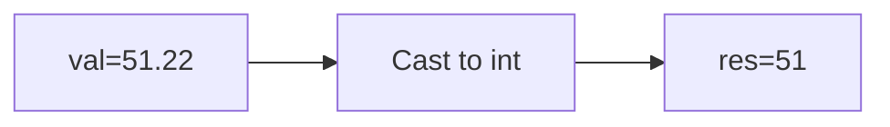

**📖 Penjelasan:**
**Langkah Tracing:**
1. val=51.22.
2. Desimal dihilangkan.
3. Hasil: 51.

---
### Soal 30
```cpp
double val = 86.22;
int res = (int)val;
```
**Pertanyaan:**
1. Berapakah hasil akhirnya?
2. Mengapa demikian?

**Jawaban & Diagnosis:**
1. **86**
2. Lihat Tracing.

**Mermaid Flowchart:**
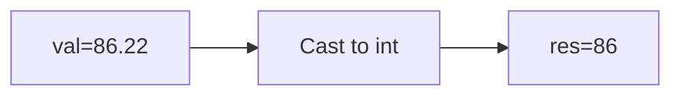

**📖 Penjelasan:**
**Langkah Tracing:**
1. val=86.22.
2. Desimal dihilangkan.
3. Hasil: 86.

---
### Soal 31
```cpp
int n = 95, y = 8;
int res = n / y;
```
**Pertanyaan:**
1. Berapakah hasil akhirnya?
2. Mengapa demikian?

**Jawaban & Diagnosis:**
1. **11**
2. Lihat Tracing.

**Mermaid Flowchart:**
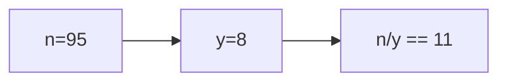

**📖 Penjelasan:**
**Langkah Tracing:**
1. n=95, y=8.
2. 95/8 = 11.88. Karena `int`, desimal dibuang.
3. Hasil: 11.

---
### Soal 32
```cpp
int n = 21;
int m = 5;
int res = n % m;
```
**Pertanyaan:**
1. Berapakah hasil akhirnya?
2. Mengapa demikian?

**Jawaban & Diagnosis:**
1. **1**
2. Lihat Tracing.

**Mermaid Flowchart:**
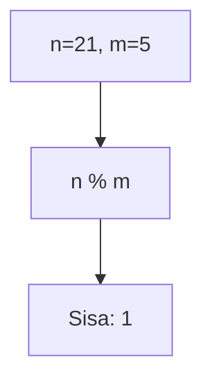

**📖 Penjelasan:**
**Langkah Tracing:**
1. n=21, m=5.
2. 21 dibagi 5 sisa 1.
3. Hasil: 1.

---
### Soal 33
```cpp
int a = 95, m = 4;
int res = a / m;
```
**Pertanyaan:**
1. Berapakah hasil akhirnya?
2. Mengapa demikian?

**Jawaban & Diagnosis:**
1. **23**
2. Lihat Tracing.

**Mermaid Flowchart:**
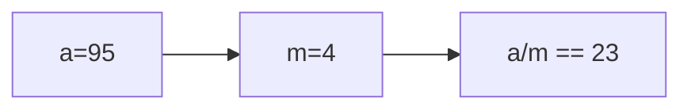

**📖 Penjelasan:**
**Langkah Tracing:**
1. a=95, m=4.
2. 95/4 = 23.75. Karena `int`, desimal dibuang.
3. Hasil: 23.

---
### Soal 34
```cpp
double val = 90.26;
int res = (int)val;
```
**Pertanyaan:**
1. Berapakah hasil akhirnya?
2. Mengapa demikian?

**Jawaban & Diagnosis:**
1. **90**
2. Lihat Tracing.

**Mermaid Flowchart:**


**📖 Penjelasan:**
**Langkah Tracing:**
1. val=90.26.
2. Desimal dihilangkan.
3. Hasil: 90.

---
### Soal 35
```cpp
double val = 36.97;
int res = (int)val;
```
**Pertanyaan:**
1. Berapakah hasil akhirnya?
2. Mengapa demikian?

**Jawaban & Diagnosis:**
1. **36**
2. Lihat Tracing.

**Mermaid Flowchart:**
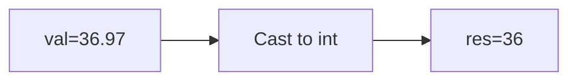

**📖 Penjelasan:**
**Langkah Tracing:**
1. val=36.97.
2. Desimal dihilangkan.
3. Hasil: 36.

---
### Soal 36
```cpp
int n = 42;
int m = 2;
int res = n % m;
```
**Pertanyaan:**
1. Berapakah hasil akhirnya?
2. Mengapa demikian?

**Jawaban & Diagnosis:**
1. **0**
2. Lihat Tracing.

**Mermaid Flowchart:**
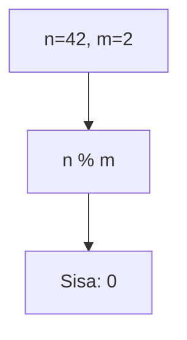

**📖 Penjelasan:**
**Langkah Tracing:**
1. n=42, m=2.
2. 42 dibagi 2 sisa 0.
3. Hasil: 0.

---
### Soal 37
```cpp
int n = 13;
int m = 2;
int res = n % m;
```
**Pertanyaan:**
1. Berapakah hasil akhirnya?
2. Mengapa demikian?

**Jawaban & Diagnosis:**
1. **1**
2. Lihat Tracing.

**Mermaid Flowchart:**
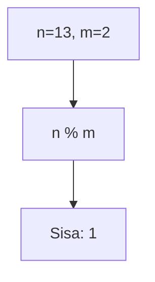

**📖 Penjelasan:**
**Langkah Tracing:**
1. n=13, m=2.
2. 13 dibagi 2 sisa 1.
3. Hasil: 1.

---
### Soal 38
```cpp
double val = 83.55;
int res = (int)val;
```
**Pertanyaan:**
1. Berapakah hasil akhirnya?
2. Mengapa demikian?

**Jawaban & Diagnosis:**
1. **83**
2. Lihat Tracing.

**Mermaid Flowchart:**
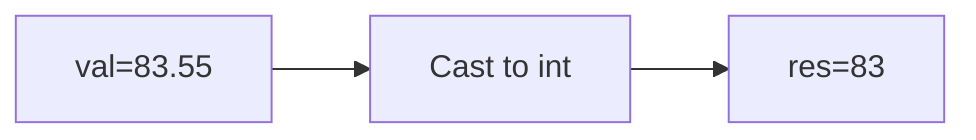

**📖 Penjelasan:**
**Langkah Tracing:**
1. val=83.55.
2. Desimal dihilangkan.
3. Hasil: 83.

---
### Soal 39
```cpp
char ch = 'a';
ch = ch + (1);
```
**Pertanyaan:**
1. Berapakah hasil akhirnya?
2. Mengapa demikian?

**Jawaban & Diagnosis:**
1. **b**
2. Lihat Tracing.

**Mermaid Flowchart:**
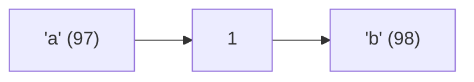

**📖 Penjelasan:**
**Langkah Tracing:**
1. ch='a' (ASCII 97).
2. 97 + (1) = 98.
3. Hasil: 'b'.

---
### Soal 40
```cpp
double val = 22.73;
int res = (int)val;
```
**Pertanyaan:**
1. Berapakah hasil akhirnya?
2. Mengapa demikian?

**Jawaban & Diagnosis:**
1. **22**
2. Lihat Tracing.

**Mermaid Flowchart:**
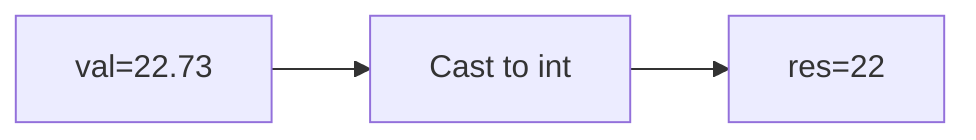

**📖 Penjelasan:**
**Langkah Tracing:**
1. val=22.73.
2. Desimal dihilangkan.
3. Hasil: 22.

---
### Soal 41
```cpp
double val = 53.61;
int res = (int)val;
```
**Pertanyaan:**
1. Berapakah hasil akhirnya?
2. Mengapa demikian?

**Jawaban & Diagnosis:**
1. **53**
2. Lihat Tracing.

**Mermaid Flowchart:**
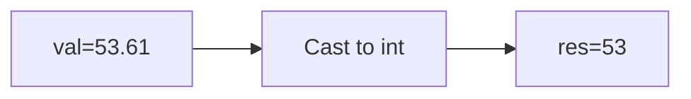

**📖 Penjelasan:**
**Langkah Tracing:**
1. val=53.61.
2. Desimal dihilangkan.
3. Hasil: 53.

---
### Soal 42
```cpp
int x = 60, y = 6;
int res = x / y;
```
**Pertanyaan:**
1. Berapakah hasil akhirnya?
2. Mengapa demikian?

**Jawaban & Diagnosis:**
1. **10**
2. Lihat Tracing.

**Mermaid Flowchart:**
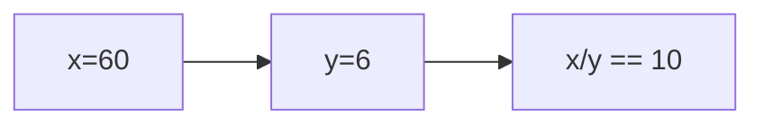

**📖 Penjelasan:**
**Langkah Tracing:**
1. x=60, y=6.
2. 60/6 = 10.00. Karena `int`, desimal dibuang.
3. Hasil: 10.

---
### Soal 43
```cpp
int n = 47;
int m = 2;
int res = n % m;
```
**Pertanyaan:**
1. Berapakah hasil akhirnya?
2. Mengapa demikian?

**Jawaban & Diagnosis:**
1. **1**
2. Lihat Tracing.

**Mermaid Flowchart:**


**📖 Penjelasan:**
**Langkah Tracing:**
1. n=47, m=2.
2. 47 dibagi 2 sisa 1.
3. Hasil: 1.

---
### Soal 44
```cpp
double val = 11.07;
int res = (int)val;
```
**Pertanyaan:**
1. Berapakah hasil akhirnya?
2. Mengapa demikian?

**Jawaban & Diagnosis:**
1. **11**
2. Lihat Tracing.

**Mermaid Flowchart:**
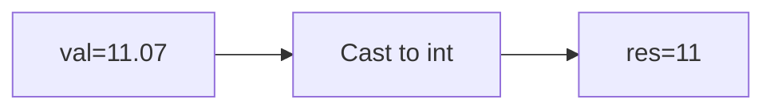

**📖 Penjelasan:**
**Langkah Tracing:**
1. val=11.07.
2. Desimal dihilangkan.
3. Hasil: 11.

---
### Soal 45
```cpp
double val = 17.48;
int res = (int)val;
```
**Pertanyaan:**
1. Berapakah hasil akhirnya?
2. Mengapa demikian?

**Jawaban & Diagnosis:**
1. **17**
2. Lihat Tracing.

**Mermaid Flowchart:**
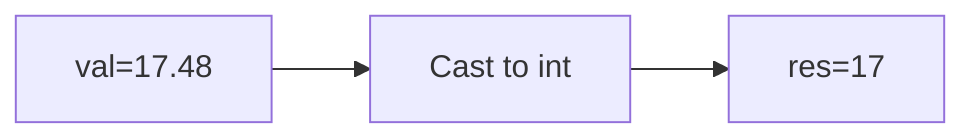

**📖 Penjelasan:**
**Langkah Tracing:**
1. val=17.48.
2. Desimal dihilangkan.
3. Hasil: 17.

---
### Soal 46
```cpp
int n = 48, b = 9;
int res = n / b;
```
**Pertanyaan:**
1. Berapakah hasil akhirnya?
2. Mengapa demikian?

**Jawaban & Diagnosis:**
1. **5**
2. Lihat Tracing.

**Mermaid Flowchart:**
```mermaid
graph LR
A["n=48"] --> B["b=9"]
B --> C["n/b == 5"]
```

**📖 Penjelasan:**
**Langkah Tracing:**
1. n=48, b=9.
2. 48/9 = 5.33. Karena `int`, desimal dibuang.
3. Hasil: 5.

---
### Soal 47
```cpp
double val = 77.59;
int res = (int)val;
```
**Pertanyaan:**
1. Berapakah hasil akhirnya?
2. Mengapa demikian?

**Jawaban & Diagnosis:**
1. **77**
2. Lihat Tracing.

**Mermaid Flowchart:**
```mermaid
graph LR
A["val=77.59"] --> B["Cast to int"]
B --> C["res=77"]
```

**📖 Penjelasan:**
**Langkah Tracing:**
1. val=77.59.
2. Desimal dihilangkan.
3. Hasil: 77.

---
### Soal 48
```cpp
double val = 63.53;
int res = (int)val;
```
**Pertanyaan:**
1. Berapakah hasil akhirnya?
2. Mengapa demikian?

**Jawaban & Diagnosis:**
1. **63**
2. Lihat Tracing.

**Mermaid Flowchart:**
```mermaid
graph LR
A["val=63.53"] --> B["Cast to int"]
B --> C["res=63"]
```

**📖 Penjelasan:**
**Langkah Tracing:**
1. val=63.53.
2. Desimal dihilangkan.
3. Hasil: 63.

---
### Soal 49
```cpp
int n = 11;
int m = 3;
int res = n % m;
```
**Pertanyaan:**
1. Berapakah hasil akhirnya?
2. Mengapa demikian?

**Jawaban & Diagnosis:**
1. **2**
2. Lihat Tracing.

**Mermaid Flowchart:**
```mermaid
graph TD
A["n=11, m=3"] --> B["n % m"]
B --> C["Sisa: 2"]
```

**📖 Penjelasan:**
**Langkah Tracing:**
1. n=11, m=3.
2. 11 dibagi 3 sisa 2.
3. Hasil: 2.

---
### Soal 50
```cpp
int a = 52, m = 2;
int res = a / m;
```
**Pertanyaan:**
1. Berapakah hasil akhirnya?
2. Mengapa demikian?

**Jawaban & Diagnosis:**
1. **26**
2. Lihat Tracing.

**Mermaid Flowchart:**
```mermaid
graph LR
A["a=52"] --> B["m=2"]
B --> C["a/m == 26"]
```

**📖 Penjelasan:**
**Langkah Tracing:**
1. a=52, m=2.
2. 52/2 = 26.00. Karena `int`, desimal dibuang.
3. Hasil: 26.

---
