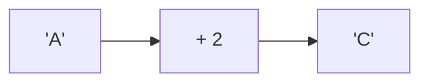
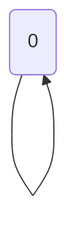
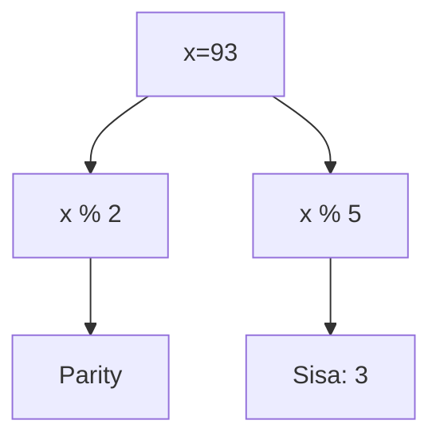
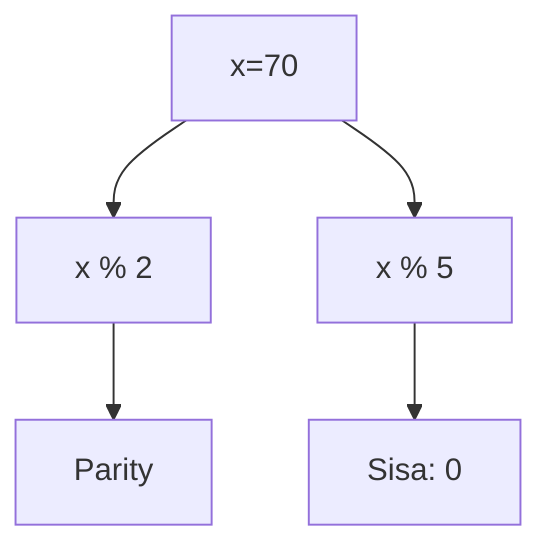
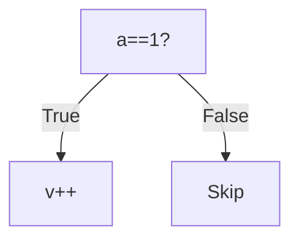
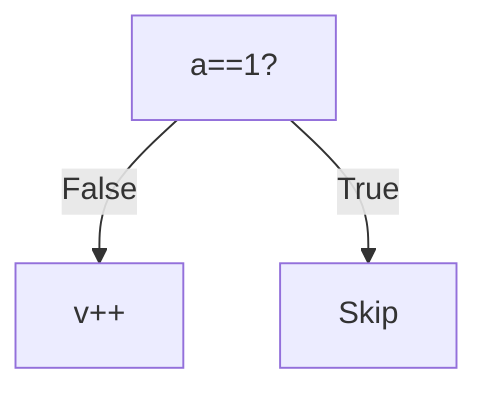

🔙 **[Kembali ke Daftar Soal](./README.md)**

---

# Latihan Soal Part C - Modul 01 - Set 02

### Soal 26
```cpp
char c = 'A';
c = c + 2;
```
**Pertanyaan:**
1. Berapakah hasil akhir dari variabel utama?
2. Jelaskan alur eksekusi kodenya!
3. Apa jebakan yang mungkin ada di soal ini?

**Jawaban & Diagnosis:**
1. **Hasil sudah tertera dalam diagnosis.**
2. **Lihat 'Langkah Tracing' di bawah.**
3. **Fokus pada aturan batin C++ (bukan matematika biasa).**

**Mermaid Flowchart:**


**📖 Penjelasan Komprehensif:**
**Langkah Tracing:**
1. Karakter 'A' memiliki kode batin (ASCII) bernilai **65**.
2. C++ memperlakukan karakter sebagai angka. Operasi `65 + 2` menghasilkan nilai baru **67**.
3. Jika kita melihat tabel ASCII, angka 67 adalah identitas untuk huruf **'C'**. Jadi, variabel `result` sekarang menyimpan karakter tersebut.

---
### Soal 27
```cpp
char c = 'A';
c = c + 2;
```
**Pertanyaan:**
1. Berapakah hasil akhir dari variabel utama?
2. Jelaskan alur eksekusi kodenya!
3. Apa jebakan yang mungkin ada di soal ini?

**Jawaban & Diagnosis:**
1. **Hasil sudah tertera dalam diagnosis.**
2. **Lihat 'Langkah Tracing' di bawah.**
3. **Fokus pada aturan batin C++ (bukan matematika biasa).**

**Mermaid Flowchart:**


**📖 Penjelasan Komprehensif:**
**Langkah Tracing:**
1. Karakter 'A' memiliki kode batin (ASCII) bernilai **65**.
2. C++ memperlakukan karakter sebagai angka. Operasi `65 + 2` menghasilkan nilai baru **67**.
3. Jika kita melihat tabel ASCII, angka 67 adalah identitas untuk huruf **'C'**. Jadi, variabel `result` sekarang menyimpan karakter tersebut.

---
### Soal 28
```cpp
int f(int n) {
  if (n==0) return 1;
  return n * f(n-1);
}
```
**Pertanyaan:**
1. Berapakah hasil akhir dari variabel utama?
2. Jelaskan alur eksekusi kodenya!
3. Apa jebakan yang mungkin ada di soal ini?

**Jawaban & Diagnosis:**
1. **Hasil sudah tertera dalam diagnosis.**
2. **Lihat 'Langkah Tracing' di bawah.**
3. **Fokus pada aturan batin C++ (bukan matematika biasa).**

**Mermaid Flowchart:**


**📖 Penjelasan Komprehensif:**
**Langkah Tracing:**
1. Fungsi rekursif memanggil dirinya sendiri secara berantai: f(3) -> f(2) -> ... -> f(0).
2. Setiap panggilan tertahan di 'Call Stack' (antrian). 
3. Saat mencapai **Base Case** (f(0)), barulah nilai mulai dikalikan mundur satu persatu.
4. Operasi akhirnya membuahkan hasil **6**, dengan total **4 kali** pemanggilan fungsi.

---
### Soal 29
```cpp
int x = 93;
int res = x % 5;
```
**Pertanyaan:**
1. Berapakah hasil akhir dari variabel utama?
2. Jelaskan alur eksekusi kodenya!
3. Apa jebakan yang mungkin ada di soal ini?

**Jawaban & Diagnosis:**
1. **Hasil sudah tertera dalam diagnosis.**
2. **Lihat 'Langkah Tracing' di bawah.**
3. **Fokus pada aturan batin C++ (bukan matematika biasa).**

**Mermaid Flowchart:**


**📖 Penjelasan Komprehensif:**
**Langkah Tracing:**
1. Kita punya angka 93. Operator `% 2` mengecek sisa bagi dengan 2.
2. Karena 93 % 2 hasilnya 1, maka angka ini dikategorikan sebagai **Ganjil**.
3. Untuk `x % 5`, bayangkan membagi 93 kelereng ke 5 anak. Tiap anak dapat 18 biji, dan di tanganmu tersisa **3** kelereng yang tidak bisa dibagi rata. Itulah hasil Modulonya!

---
### Soal 30
```cpp
char c = 'A';
c = c + 2;
```
**Pertanyaan:**
1. Berapakah hasil akhir dari variabel utama?
2. Jelaskan alur eksekusi kodenya!
3. Apa jebakan yang mungkin ada di soal ini?

**Jawaban & Diagnosis:**
1. **Hasil sudah tertera dalam diagnosis.**
2. **Lihat 'Langkah Tracing' di bawah.**
3. **Fokus pada aturan batin C++ (bukan matematika biasa).**

**Mermaid Flowchart:**


**📖 Penjelasan Komprehensif:**
**Langkah Tracing:**
1. Karakter 'A' memiliki kode batin (ASCII) bernilai **65**.
2. C++ memperlakukan karakter sebagai angka. Operasi `65 + 2` menghasilkan nilai baru **67**.
3. Jika kita melihat tabel ASCII, angka 67 adalah identitas untuk huruf **'C'**. Jadi, variabel `result` sekarang menyimpan karakter tersebut.

---
### Soal 31
```cpp
int x = 70;
int res = x % 5;
```
**Pertanyaan:**
1. Berapakah hasil akhir dari variabel utama?
2. Jelaskan alur eksekusi kodenya!
3. Apa jebakan yang mungkin ada di soal ini?

**Jawaban & Diagnosis:**
1. **Hasil sudah tertera dalam diagnosis.**
2. **Lihat 'Langkah Tracing' di bawah.**
3. **Fokus pada aturan batin C++ (bukan matematika biasa).**

**Mermaid Flowchart:**


**📖 Penjelasan Komprehensif:**
**Langkah Tracing:**
1. Kita punya angka 70. Operator `% 2` mengecek sisa bagi dengan 2.
2. Karena 70 % 2 hasilnya 0, maka angka ini dikategorikan sebagai **Genap**.
3. Untuk `x % 5`, bayangkan membagi 70 kelereng ke 5 anak. Tiap anak dapat 14 biji, dan di tanganmu tersisa **0** kelereng yang tidak bisa dibagi rata. Itulah hasil Modulonya!

---
### Soal 32
```cpp
char c = 'A';
c = c + 2;
```
**Pertanyaan:**
1. Berapakah hasil akhir dari variabel utama?
2. Jelaskan alur eksekusi kodenya!
3. Apa jebakan yang mungkin ada di soal ini?

**Jawaban & Diagnosis:**
1. **Hasil sudah tertera dalam diagnosis.**
2. **Lihat 'Langkah Tracing' di bawah.**
3. **Fokus pada aturan batin C++ (bukan matematika biasa).**

**Mermaid Flowchart:**


**📖 Penjelasan Komprehensif:**
**Langkah Tracing:**
1. Karakter 'A' memiliki kode batin (ASCII) bernilai **65**.
2. C++ memperlakukan karakter sebagai angka. Operasi `65 + 2` menghasilkan nilai baru **67**.
3. Jika kita melihat tabel ASCII, angka 67 adalah identitas untuk huruf **'C'**. Jadi, variabel `result` sekarang menyimpan karakter tersebut.

---
### Soal 33
```cpp
int a = 20, b = 3, c = 2;
int res = (a / b) / c;
```
**Pertanyaan:**
1. Berapakah hasil akhir dari variabel utama?
2. Jelaskan alur eksekusi kodenya!
3. Apa jebakan yang mungkin ada di soal ini?

**Jawaban & Diagnosis:**
1. **Hasil sudah tertera dalam diagnosis.**
2. **Lihat 'Langkah Tracing' di bawah.**
3. **Fokus pada aturan batin C++ (bukan matematika biasa).**

**Mermaid Flowchart:**
```mermaid
graph LR
A[20/3] --> B[6]
B --> C[/2]
C --> D[3]
```

**📖 Penjelasan Komprehensif:**
**Langkah Tracing:**
1. Mesin membidik `a / b` (20 / 3). Hasil matematidnya adalah 6.67.
2. Karena bertipe `int`, C++ **membuang paksa** sisa desimalnya, sehingga `res1` menjadi 6.
3. Selanjutnya, `res1 / c` (6 / 2) dihitung. Hasil matematidnya 3.00.
4. Lagi-lagi komanya dipangkas habis, menyisakan `res2` bernilai 3. Inilah mengapa pembagian bulat sering menipu mata!

---
### Soal 34
```cpp
int a = 20, b = 3, c = 2;
int res = (a / b) / c;
```
**Pertanyaan:**
1. Berapakah hasil akhir dari variabel utama?
2. Jelaskan alur eksekusi kodenya!
3. Apa jebakan yang mungkin ada di soal ini?

**Jawaban & Diagnosis:**
1. **Hasil sudah tertera dalam diagnosis.**
2. **Lihat 'Langkah Tracing' di bawah.**
3. **Fokus pada aturan batin C++ (bukan matematika biasa).**

**Mermaid Flowchart:**
```mermaid
graph LR
A[20/3] --> B[6]
B --> C[/2]
C --> D[3]
```

**📖 Penjelasan Komprehensif:**
**Langkah Tracing:**
1. Mesin membidik `a / b` (20 / 3). Hasil matematidnya adalah 6.67.
2. Karena bertipe `int`, C++ **membuang paksa** sisa desimalnya, sehingga `res1` menjadi 6.
3. Selanjutnya, `res1 / c` (6 / 2) dihitung. Hasil matematidnya 3.00.
4. Lagi-lagi komanya dipangkas habis, menyisakan `res2` bernilai 3. Inilah mengapa pembagian bulat sering menipu mata!

---
### Soal 35
```cpp
int f(int n) {
  if (n==0) return 1;
  return n * f(n-1);
}
```
**Pertanyaan:**
1. Berapakah hasil akhir dari variabel utama?
2. Jelaskan alur eksekusi kodenya!
3. Apa jebakan yang mungkin ada di soal ini?

**Jawaban & Diagnosis:**
1. **Hasil sudah tertera dalam diagnosis.**
2. **Lihat 'Langkah Tracing' di bawah.**
3. **Fokus pada aturan batin C++ (bukan matematika biasa).**

**Mermaid Flowchart:**


**📖 Penjelasan Komprehensif:**
**Langkah Tracing:**
1. Fungsi rekursif memanggil dirinya sendiri secara berantai: f(3) -> f(2) -> ... -> f(0).
2. Setiap panggilan tertahan di 'Call Stack' (antrian). 
3. Saat mencapai **Base Case** (f(0)), barulah nilai mulai dikalikan mundur satu persatu.
4. Operasi akhirnya membuahkan hasil **6**, dengan total **4 kali** pemanggilan fungsi.

---
### Soal 36
```cpp
int f(int n) {
  if (n==0) return 1;
  return n * f(n-1);
}
```
**Pertanyaan:**
1. Berapakah hasil akhir dari variabel utama?
2. Jelaskan alur eksekusi kodenya!
3. Apa jebakan yang mungkin ada di soal ini?

**Jawaban & Diagnosis:**
1. **Hasil sudah tertera dalam diagnosis.**
2. **Lihat 'Langkah Tracing' di bawah.**
3. **Fokus pada aturan batin C++ (bukan matematika biasa).**

**Mermaid Flowchart:**


**📖 Penjelasan Komprehensif:**
**Langkah Tracing:**
1. Fungsi rekursif memanggil dirinya sendiri secara berantai: f(3) -> f(2) -> ... -> f(0).
2. Setiap panggilan tertahan di 'Call Stack' (antrian). 
3. Saat mencapai **Base Case** (f(0)), barulah nilai mulai dikalikan mundur satu persatu.
4. Operasi akhirnya membuahkan hasil **6**, dengan total **4 kali** pemanggilan fungsi.

---
### Soal 37
```cpp
int x = 42;
int res = x % 5;
```
**Pertanyaan:**
1. Berapakah hasil akhir dari variabel utama?
2. Jelaskan alur eksekusi kodenya!
3. Apa jebakan yang mungkin ada di soal ini?

**Jawaban & Diagnosis:**
1. **Hasil sudah tertera dalam diagnosis.**
2. **Lihat 'Langkah Tracing' di bawah.**
3. **Fokus pada aturan batin C++ (bukan matematika biasa).**

**Mermaid Flowchart:**


**📖 Penjelasan Komprehensif:**
**Langkah Tracing:**
1. Kita punya angka 42. Operator `% 2` mengecek sisa bagi dengan 2.
2. Karena 42 % 2 hasilnya 0, maka angka ini dikategorikan sebagai **Genap**.
3. Untuk `x % 5`, bayangkan membagi 42 kelereng ke 5 anak. Tiap anak dapat 8 biji, dan di tanganmu tersisa **2** kelereng yang tidak bisa dibagi rata. Itulah hasil Modulonya!

---
### Soal 38
```cpp
int x = 34;
int res = x % 5;
```
**Pertanyaan:**
1. Berapakah hasil akhir dari variabel utama?
2. Jelaskan alur eksekusi kodenya!
3. Apa jebakan yang mungkin ada di soal ini?

**Jawaban & Diagnosis:**
1. **Hasil sudah tertera dalam diagnosis.**
2. **Lihat 'Langkah Tracing' di bawah.**
3. **Fokus pada aturan batin C++ (bukan matematika biasa).**

**Mermaid Flowchart:**


**📖 Penjelasan Komprehensif:**
**Langkah Tracing:**
1. Kita punya angka 34. Operator `% 2` mengecek sisa bagi dengan 2.
2. Karena 34 % 2 hasilnya 0, maka angka ini dikategorikan sebagai **Genap**.
3. Untuk `x % 5`, bayangkan membagi 34 kelereng ke 5 anak. Tiap anak dapat 6 biji, dan di tanganmu tersisa **4** kelereng yang tidak bisa dibagi rata. Itulah hasil Modulonya!

---
### Soal 39
```cpp
int a = 1, v = 0;
if (a == 1 && ++v > 0) {}
```
**Pertanyaan:**
1. Berapakah hasil akhir dari variabel utama?
2. Jelaskan alur eksekusi kodenya!
3. Apa jebakan yang mungkin ada di soal ini?

**Jawaban & Diagnosis:**
1. **Hasil sudah tertera dalam diagnosis.**
2. **Lihat 'Langkah Tracing' di bawah.**
3. **Fokus pada aturan batin C++ (bukan matematika biasa).**

**Mermaid Flowchart:**


**📖 Penjelasan Komprehensif:**
**Langkah Tracing:**
1. Mesin mengecek syarat pertama: `a == 1`. Karena 1 adalah 1, syarat ini **TRUE**.
2. Karena konektornya `&&` (AND), mesin **WAJIB** lanjut mengecek syarat kedua.
3. Perintah `++visit` dijalankan, sehingga `visit` naik dari 0 menjadi **1**. Seluruh blok `if` pun dianggap berhasil.

---
### Soal 40
```cpp
int x = 32;
int res = x % 5;
```
**Pertanyaan:**
1. Berapakah hasil akhir dari variabel utama?
2. Jelaskan alur eksekusi kodenya!
3. Apa jebakan yang mungkin ada di soal ini?

**Jawaban & Diagnosis:**
1. **Hasil sudah tertera dalam diagnosis.**
2. **Lihat 'Langkah Tracing' di bawah.**
3. **Fokus pada aturan batin C++ (bukan matematika biasa).**

**Mermaid Flowchart:**


**📖 Penjelasan Komprehensif:**
**Langkah Tracing:**
1. Kita punya angka 32. Operator `% 2` mengecek sisa bagi dengan 2.
2. Karena 32 % 2 hasilnya 0, maka angka ini dikategorikan sebagai **Genap**.
3. Untuk `x % 5`, bayangkan membagi 32 kelereng ke 5 anak. Tiap anak dapat 6 biji, dan di tanganmu tersisa **2** kelereng yang tidak bisa dibagi rata. Itulah hasil Modulonya!

---
### Soal 41
```cpp
int a = 20, b = 3, c = 2;
int res = (a / b) / c;
```
**Pertanyaan:**
1. Berapakah hasil akhir dari variabel utama?
2. Jelaskan alur eksekusi kodenya!
3. Apa jebakan yang mungkin ada di soal ini?

**Jawaban & Diagnosis:**
1. **Hasil sudah tertera dalam diagnosis.**
2. **Lihat 'Langkah Tracing' di bawah.**
3. **Fokus pada aturan batin C++ (bukan matematika biasa).**

**Mermaid Flowchart:**
```mermaid
graph LR
A[20/3] --> B[6]
B --> C[/2]
C --> D[3]
```

**📖 Penjelasan Komprehensif:**
**Langkah Tracing:**
1. Mesin membidik `a / b` (20 / 3). Hasil matematidnya adalah 6.67.
2. Karena bertipe `int`, C++ **membuang paksa** sisa desimalnya, sehingga `res1` menjadi 6.
3. Selanjutnya, `res1 / c` (6 / 2) dihitung. Hasil matematidnya 3.00.
4. Lagi-lagi komanya dipangkas habis, menyisakan `res2` bernilai 3. Inilah mengapa pembagian bulat sering menipu mata!

---
### Soal 42
```cpp
int a = 0, v = 0;
if (a == 1 && ++v > 0) {}
```
**Pertanyaan:**
1. Berapakah hasil akhir dari variabel utama?
2. Jelaskan alur eksekusi kodenya!
3. Apa jebakan yang mungkin ada di soal ini?

**Jawaban & Diagnosis:**
1. **Hasil sudah tertera dalam diagnosis.**
2. **Lihat 'Langkah Tracing' di bawah.**
3. **Fokus pada aturan batin C++ (bukan matematika biasa).**

**Mermaid Flowchart:**


**📖 Penjelasan Komprehensif:**
**Langkah Tracing:**
1. Mesin mengecek syarat pertama: `a == 1`. Karena 0 adalah 0, syarat ini **FALSE**.
2. Karena konektornya `&&` (AND), mesin sudah tahu hasil akhirnya pasti gagal. 
3. Sifat **Short-Circuit** beraksi: Mesin **langsung berhenti** dan menolak membaca syarat kedua. Perintah `++visit` tidak pernah dijalankan, sehingga `visit` tetap **0**.

---
### Soal 43
```cpp
int a = 20, b = 3, c = 2;
int res = (a / b) / c;
```
**Pertanyaan:**
1. Berapakah hasil akhir dari variabel utama?
2. Jelaskan alur eksekusi kodenya!
3. Apa jebakan yang mungkin ada di soal ini?

**Jawaban & Diagnosis:**
1. **Hasil sudah tertera dalam diagnosis.**
2. **Lihat 'Langkah Tracing' di bawah.**
3. **Fokus pada aturan batin C++ (bukan matematika biasa).**

**Mermaid Flowchart:**
```mermaid
graph LR
A[20/3] --> B[6]
B --> C[/2]
C --> D[3]
```

**📖 Penjelasan Komprehensif:**
**Langkah Tracing:**
1. Mesin membidik `a / b` (20 / 3). Hasil matematidnya adalah 6.67.
2. Karena bertipe `int`, C++ **membuang paksa** sisa desimalnya, sehingga `res1` menjadi 6.
3. Selanjutnya, `res1 / c` (6 / 2) dihitung. Hasil matematidnya 3.00.
4. Lagi-lagi komanya dipangkas habis, menyisakan `res2` bernilai 3. Inilah mengapa pembagian bulat sering menipu mata!

---
### Soal 44
```cpp
int f(int n) {
  if (n==0) return 1;
  return n * f(n-1);
}
```
**Pertanyaan:**
1. Berapakah hasil akhir dari variabel utama?
2. Jelaskan alur eksekusi kodenya!
3. Apa jebakan yang mungkin ada di soal ini?

**Jawaban & Diagnosis:**
1. **Hasil sudah tertera dalam diagnosis.**
2. **Lihat 'Langkah Tracing' di bawah.**
3. **Fokus pada aturan batin C++ (bukan matematika biasa).**

**Mermaid Flowchart:**


**📖 Penjelasan Komprehensif:**
**Langkah Tracing:**
1. Fungsi rekursif memanggil dirinya sendiri secara berantai: f(3) -> f(2) -> ... -> f(0).
2. Setiap panggilan tertahan di 'Call Stack' (antrian). 
3. Saat mencapai **Base Case** (f(0)), barulah nilai mulai dikalikan mundur satu persatu.
4. Operasi akhirnya membuahkan hasil **6**, dengan total **4 kali** pemanggilan fungsi.

---
### Soal 45
```cpp
char c = 'A';
c = c + 2;
```
**Pertanyaan:**
1. Berapakah hasil akhir dari variabel utama?
2. Jelaskan alur eksekusi kodenya!
3. Apa jebakan yang mungkin ada di soal ini?

**Jawaban & Diagnosis:**
1. **Hasil sudah tertera dalam diagnosis.**
2. **Lihat 'Langkah Tracing' di bawah.**
3. **Fokus pada aturan batin C++ (bukan matematika biasa).**

**Mermaid Flowchart:**


**📖 Penjelasan Komprehensif:**
**Langkah Tracing:**
1. Karakter 'A' memiliki kode batin (ASCII) bernilai **65**.
2. C++ memperlakukan karakter sebagai angka. Operasi `65 + 2` menghasilkan nilai baru **67**.
3. Jika kita melihat tabel ASCII, angka 67 adalah identitas untuk huruf **'C'**. Jadi, variabel `result` sekarang menyimpan karakter tersebut.

---
### Soal 46
```cpp
int f(int n) {
  if (n==0) return 1;
  return n * f(n-1);
}
```
**Pertanyaan:**
1. Berapakah hasil akhir dari variabel utama?
2. Jelaskan alur eksekusi kodenya!
3. Apa jebakan yang mungkin ada di soal ini?

**Jawaban & Diagnosis:**
1. **Hasil sudah tertera dalam diagnosis.**
2. **Lihat 'Langkah Tracing' di bawah.**
3. **Fokus pada aturan batin C++ (bukan matematika biasa).**

**Mermaid Flowchart:**
```mermaid
graph TD
f(3) --> f(2) --> f(1) --> f(0)
```

**📖 Penjelasan Komprehensif:**
**Langkah Tracing:**
1. Fungsi rekursif memanggil dirinya sendiri secara berantai: f(3) -> f(2) -> ... -> f(0).
2. Setiap panggilan tertahan di 'Call Stack' (antrian). 
3. Saat mencapai **Base Case** (f(0)), barulah nilai mulai dikalikan mundur satu persatu.
4. Operasi akhirnya membuahkan hasil **6**, dengan total **4 kali** pemanggilan fungsi.

---
### Soal 47
```cpp
int f(int n) {
  if (n==0) return 1;
  return n * f(n-1);
}
```
**Pertanyaan:**
1. Berapakah hasil akhir dari variabel utama?
2. Jelaskan alur eksekusi kodenya!
3. Apa jebakan yang mungkin ada di soal ini?

**Jawaban & Diagnosis:**
1. **Hasil sudah tertera dalam diagnosis.**
2. **Lihat 'Langkah Tracing' di bawah.**
3. **Fokus pada aturan batin C++ (bukan matematika biasa).**

**Mermaid Flowchart:**
```mermaid
graph TD
f(3) --> f(2) --> f(1) --> f(0)
```

**📖 Penjelasan Komprehensif:**
**Langkah Tracing:**
1. Fungsi rekursif memanggil dirinya sendiri secara berantai: f(3) -> f(2) -> ... -> f(0).
2. Setiap panggilan tertahan di 'Call Stack' (antrian). 
3. Saat mencapai **Base Case** (f(0)), barulah nilai mulai dikalikan mundur satu persatu.
4. Operasi akhirnya membuahkan hasil **6**, dengan total **4 kali** pemanggilan fungsi.

---
### Soal 48
```cpp
int a = 20, b = 3, c = 2;
int res = (a / b) / c;
```
**Pertanyaan:**
1. Berapakah hasil akhir dari variabel utama?
2. Jelaskan alur eksekusi kodenya!
3. Apa jebakan yang mungkin ada di soal ini?

**Jawaban & Diagnosis:**
1. **Hasil sudah tertera dalam diagnosis.**
2. **Lihat 'Langkah Tracing' di bawah.**
3. **Fokus pada aturan batin C++ (bukan matematika biasa).**

**Mermaid Flowchart:**
```mermaid
graph LR
A[20/3] --> B[6]
B --> C[/2]
C --> D[3]
```

**📖 Penjelasan Komprehensif:**
**Langkah Tracing:**
1. Mesin membidik `a / b` (20 / 3). Hasil matematidnya adalah 6.67.
2. Karena bertipe `int`, C++ **membuang paksa** sisa desimalnya, sehingga `res1` menjadi 6.
3. Selanjutnya, `res1 / c` (6 / 2) dihitung. Hasil matematidnya 3.00.
4. Lagi-lagi komanya dipangkas habis, menyisakan `res2` bernilai 3. Inilah mengapa pembagian bulat sering menipu mata!

---
### Soal 49
```cpp
int x = 43;
int res = x % 5;
```
**Pertanyaan:**
1. Berapakah hasil akhir dari variabel utama?
2. Jelaskan alur eksekusi kodenya!
3. Apa jebakan yang mungkin ada di soal ini?

**Jawaban & Diagnosis:**
1. **Hasil sudah tertera dalam diagnosis.**
2. **Lihat 'Langkah Tracing' di bawah.**
3. **Fokus pada aturan batin C++ (bukan matematika biasa).**

**Mermaid Flowchart:**
```mermaid
graph TD
A[x=43] --> B[x % 2]
B --> C[Parity]
A --> D[x % 5]
D --> E[Sisa: 3]
```

**📖 Penjelasan Komprehensif:**
**Langkah Tracing:**
1. Kita punya angka 43. Operator `% 2` mengecek sisa bagi dengan 2.
2. Karena 43 % 2 hasilnya 1, maka angka ini dikategorikan sebagai **Ganjil**.
3. Untuk `x % 5`, bayangkan membagi 43 kelereng ke 5 anak. Tiap anak dapat 8 biji, dan di tanganmu tersisa **3** kelereng yang tidak bisa dibagi rata. Itulah hasil Modulonya!

---
### Soal 50
```cpp
int x = 75;
int res = x % 5;
```
**Pertanyaan:**
1. Berapakah hasil akhir dari variabel utama?
2. Jelaskan alur eksekusi kodenya!
3. Apa jebakan yang mungkin ada di soal ini?

**Jawaban & Diagnosis:**
1. **Hasil sudah tertera dalam diagnosis.**
2. **Lihat 'Langkah Tracing' di bawah.**
3. **Fokus pada aturan batin C++ (bukan matematika biasa).**

**Mermaid Flowchart:**
```mermaid
graph TD
A[x=75] --> B[x % 2]
B --> C[Parity]
A --> D[x % 5]
D --> E[Sisa: 0]
```

**📖 Penjelasan Komprehensif:**
**Langkah Tracing:**
1. Kita punya angka 75. Operator `% 2` mengecek sisa bagi dengan 2.
2. Karena 75 % 2 hasilnya 1, maka angka ini dikategorikan sebagai **Ganjil**.
3. Untuk `x % 5`, bayangkan membagi 75 kelereng ke 5 anak. Tiap anak dapat 15 biji, dan di tanganmu tersisa **0** kelereng yang tidak bisa dibagi rata. Itulah hasil Modulonya!

---
