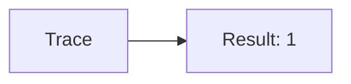
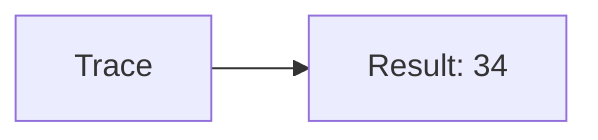
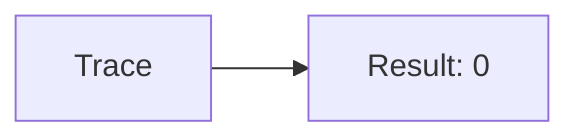
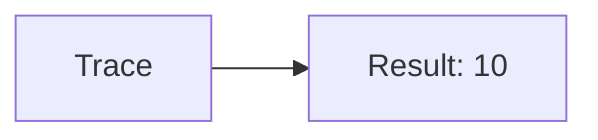
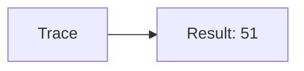
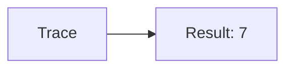
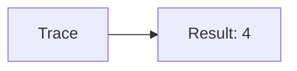
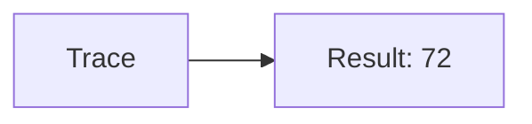

🔙 **[Kembali ke Daftar Soal](./README.md)**

---

# Latihan Soal Part C - Modul 01 - Set 02

### Soal 26
```cpp
// Laptop: Modulo
int laptop = 19, bagi = 3;
int sisa = laptop % bagi;
```
**Pertanyaan:**
1. Berapakah hasil akhirnya?
2. Deskripsikan alur pikir 'Compiler Manusia' untuk soal ini!

**Jawaban & Diagnosis:**
1. **1**
2. 19 Laptop dibagi 3 sisa 1.

**Mermaid Flowchart:**


---
### Soal 27
```cpp
// Mouse: Casting
double val = 34.51;
int res = (int)val;
```
**Pertanyaan:**
1. Berapakah hasil akhirnya?
2. Deskripsikan alur pikir 'Compiler Manusia' untuk soal ini!

**Jawaban & Diagnosis:**
1. **34**
2. Mengubah 34.51 jadi integer (pangkas koma) jadi 34.

**Mermaid Flowchart:**


---
### Soal 28
```cpp
// Keyboard: Pembagian
int keyboard = 10, bagi = 7;
int hasil = keyboard / bagi;
```
**Pertanyaan:**
1. Berapakah hasil akhirnya?
2. Deskripsikan alur pikir 'Compiler Manusia' untuk soal ini!

**Jawaban & Diagnosis:**
1. **1**
2. Membagi 10 Keyboard ke 7 bagian. Hasil bulat: 1.

**Mermaid Flowchart:**


---
### Soal 29
```cpp
// Monitor: Modulo
int monitor = 22, bagi = 2;
int sisa = monitor % bagi;
```
**Pertanyaan:**
1. Berapakah hasil akhirnya?
2. Deskripsikan alur pikir 'Compiler Manusia' untuk soal ini!

**Jawaban & Diagnosis:**
1. **0**
2. 22 Monitor dibagi 2 sisa 0.

**Mermaid Flowchart:**


---
### Soal 30
```cpp
// Kabel: Casting
double val = 76.81;
int res = (int)val;
```
**Pertanyaan:**
1. Berapakah hasil akhirnya?
2. Deskripsikan alur pikir 'Compiler Manusia' untuk soal ini!

**Jawaban & Diagnosis:**
1. **76**
2. Mengubah 76.81 jadi integer (pangkas koma) jadi 76.

**Mermaid Flowchart:**


---
### Soal 31
```cpp
// Steker: Pembagian
int steker = 84, bagi = 7;
int hasil = steker / bagi;
```
**Pertanyaan:**
1. Berapakah hasil akhirnya?
2. Deskripsikan alur pikir 'Compiler Manusia' untuk soal ini!

**Jawaban & Diagnosis:**
1. **12**
2. Membagi 84 Steker ke 7 bagian. Hasil bulat: 12.

**Mermaid Flowchart:**


---
### Soal 32
```cpp
// Saklar: Modulo
int saklar = 33, bagi = 8;
int sisa = saklar % bagi;
```
**Pertanyaan:**
1. Berapakah hasil akhirnya?
2. Deskripsikan alur pikir 'Compiler Manusia' untuk soal ini!

**Jawaban & Diagnosis:**
1. **1**
2. 33 Saklar dibagi 8 sisa 1.

**Mermaid Flowchart:**


---
### Soal 33
```cpp
// Baterai: Casting
double val = 67.21;
int res = (int)val;
```
**Pertanyaan:**
1. Berapakah hasil akhirnya?
2. Deskripsikan alur pikir 'Compiler Manusia' untuk soal ini!

**Jawaban & Diagnosis:**
1. **67**
2. Mengubah 67.21 jadi integer (pangkas koma) jadi 67.

**Mermaid Flowchart:**


---
### Soal 34
```cpp
// Jam: Pembagian
int jam = 64, bagi = 6;
int hasil = jam / bagi;
```
**Pertanyaan:**
1. Berapakah hasil akhirnya?
2. Deskripsikan alur pikir 'Compiler Manusia' untuk soal ini!

**Jawaban & Diagnosis:**
1. **10**
2. Membagi 64 Jam ke 6 bagian. Hasil bulat: 10.

**Mermaid Flowchart:**


---
### Soal 35
```cpp
// Kalender: Modulo
int kalender = 27, bagi = 3;
int sisa = kalender % bagi;
```
**Pertanyaan:**
1. Berapakah hasil akhirnya?
2. Deskripsikan alur pikir 'Compiler Manusia' untuk soal ini!

**Jawaban & Diagnosis:**
1. **0**
2. 27 Kalender dibagi 3 sisa 0.

**Mermaid Flowchart:**


---
### Soal 36
```cpp
// Kaca: Casting
double val = 87.71;
int res = (int)val;
```
**Pertanyaan:**
1. Berapakah hasil akhirnya?
2. Deskripsikan alur pikir 'Compiler Manusia' untuk soal ini!

**Jawaban & Diagnosis:**
1. **87**
2. Mengubah 87.71 jadi integer (pangkas koma) jadi 87.

**Mermaid Flowchart:**


---
### Soal 37
```cpp
// Pintu: Pembagian
int pintu = 61, bagi = 7;
int hasil = pintu / bagi;
```
**Pertanyaan:**
1. Berapakah hasil akhirnya?
2. Deskripsikan alur pikir 'Compiler Manusia' untuk soal ini!

**Jawaban & Diagnosis:**
1. **8**
2. Membagi 61 Pintu ke 7 bagian. Hasil bulat: 8.

**Mermaid Flowchart:**


---
### Soal 38
```cpp
// Jendela: Modulo
int jendela = 19, bagi = 2;
int sisa = jendela % bagi;
```
**Pertanyaan:**
1. Berapakah hasil akhirnya?
2. Deskripsikan alur pikir 'Compiler Manusia' untuk soal ini!

**Jawaban & Diagnosis:**
1. **1**
2. 19 Jendela dibagi 2 sisa 1.

**Mermaid Flowchart:**


---
### Soal 39
```cpp
// Lantai: Casting
double val = 51.51;
int res = (int)val;
```
**Pertanyaan:**
1. Berapakah hasil akhirnya?
2. Deskripsikan alur pikir 'Compiler Manusia' untuk soal ini!

**Jawaban & Diagnosis:**
1. **51**
2. Mengubah 51.51 jadi integer (pangkas koma) jadi 51.

**Mermaid Flowchart:**


---
### Soal 40
```cpp
// Atap: Pembagian
int atap = 62, bagi = 8;
int hasil = atap / bagi;
```
**Pertanyaan:**
1. Berapakah hasil akhirnya?
2. Deskripsikan alur pikir 'Compiler Manusia' untuk soal ini!

**Jawaban & Diagnosis:**
1. **7**
2. Membagi 62 Atap ke 8 bagian. Hasil bulat: 7.

**Mermaid Flowchart:**


---
### Soal 41
```cpp
// Dinding: Modulo
int dinding = 60, bagi = 7;
int sisa = dinding % bagi;
```
**Pertanyaan:**
1. Berapakah hasil akhirnya?
2. Deskripsikan alur pikir 'Compiler Manusia' untuk soal ini!

**Jawaban & Diagnosis:**
1. **4**
2. 60 Dinding dibagi 7 sisa 4.

**Mermaid Flowchart:**


---
### Soal 42
```cpp
// Pagar: Casting
double val = 72.21;
int res = (int)val;
```
**Pertanyaan:**
1. Berapakah hasil akhirnya?
2. Deskripsikan alur pikir 'Compiler Manusia' untuk soal ini!

**Jawaban & Diagnosis:**
1. **72**
2. Mengubah 72.21 jadi integer (pangkas koma) jadi 72.

**Mermaid Flowchart:**


---
### Soal 43
```cpp
// Kebun: Pembagian
int kebun = 36, bagi = 8;
int hasil = kebun / bagi;
```
**Pertanyaan:**
1. Berapakah hasil akhirnya?
2. Deskripsikan alur pikir 'Compiler Manusia' untuk soal ini!

**Jawaban & Diagnosis:**
1. **4**
2. Membagi 36 Kebun ke 8 bagian. Hasil bulat: 4.

**Mermaid Flowchart:**


---
### Soal 44
```cpp
// Pohon: Modulo
int pohon = 84, bagi = 6;
int sisa = pohon % bagi;
```
**Pertanyaan:**
1. Berapakah hasil akhirnya?
2. Deskripsikan alur pikir 'Compiler Manusia' untuk soal ini!

**Jawaban & Diagnosis:**
1. **0**
2. 84 Pohon dibagi 6 sisa 0.

**Mermaid Flowchart:**


---
### Soal 45
```cpp
// Daun: Casting
double val = 72.51;
int res = (int)val;
```
**Pertanyaan:**
1. Berapakah hasil akhirnya?
2. Deskripsikan alur pikir 'Compiler Manusia' untuk soal ini!

**Jawaban & Diagnosis:**
1. **72**
2. Mengubah 72.51 jadi integer (pangkas koma) jadi 72.

**Mermaid Flowchart:**


---
### Soal 46
```cpp
// Bunga: Pembagian
int bunga = 88, bagi = 5;
int hasil = bunga / bagi;
```
**Pertanyaan:**
1. Berapakah hasil akhirnya?
2. Deskripsikan alur pikir 'Compiler Manusia' untuk soal ini!

**Jawaban & Diagnosis:**
1. **17**
2. Membagi 88 Bunga ke 5 bagian. Hasil bulat: 17.

**Mermaid Flowchart:**
```mermaid
graph LR
A[Trace] --> B[Result: 17]
```

---
### Soal 47
```cpp
// Akar: Modulo
int akar = 97, bagi = 3;
int sisa = akar % bagi;
```
**Pertanyaan:**
1. Berapakah hasil akhirnya?
2. Deskripsikan alur pikir 'Compiler Manusia' untuk soal ini!

**Jawaban & Diagnosis:**
1. **1**
2. 97 Akar dibagi 3 sisa 1.

**Mermaid Flowchart:**
```mermaid
graph LR
A[Trace] --> B[Result: 1]
```

---
### Soal 48
```cpp
// Tanah: Casting
double val = 60.31;
int res = (int)val;
```
**Pertanyaan:**
1. Berapakah hasil akhirnya?
2. Deskripsikan alur pikir 'Compiler Manusia' untuk soal ini!

**Jawaban & Diagnosis:**
1. **60**
2. Mengubah 60.31 jadi integer (pangkas koma) jadi 60.

**Mermaid Flowchart:**
```mermaid
graph LR
A[Trace] --> B[Result: 60]
```

---
### Soal 49
```cpp
// Pasir: Pembagian
int pasir = 25, bagi = 6;
int hasil = pasir / bagi;
```
**Pertanyaan:**
1. Berapakah hasil akhirnya?
2. Deskripsikan alur pikir 'Compiler Manusia' untuk soal ini!

**Jawaban & Diagnosis:**
1. **4**
2. Membagi 25 Pasir ke 6 bagian. Hasil bulat: 4.

**Mermaid Flowchart:**
```mermaid
graph LR
A[Trace] --> B[Result: 4]
```

---
### Soal 50
```cpp
// Batu: Modulo
int batu = 76, bagi = 3;
int sisa = batu % bagi;
```
**Pertanyaan:**
1. Berapakah hasil akhirnya?
2. Deskripsikan alur pikir 'Compiler Manusia' untuk soal ini!

**Jawaban & Diagnosis:**
1. **1**
2. 76 Batu dibagi 3 sisa 1.

**Mermaid Flowchart:**
```mermaid
graph LR
A[Trace] --> B[Result: 1]
```

---
