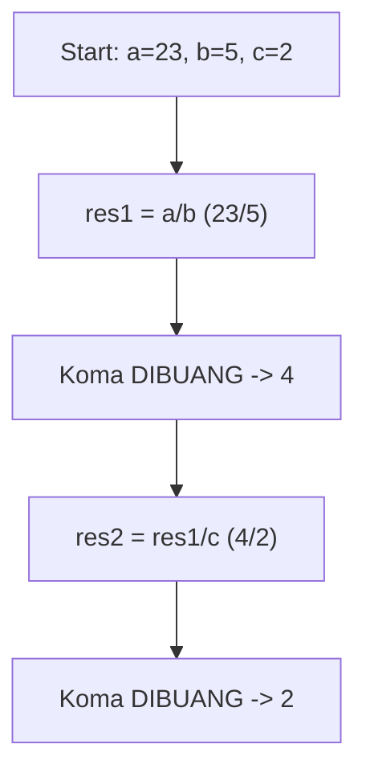
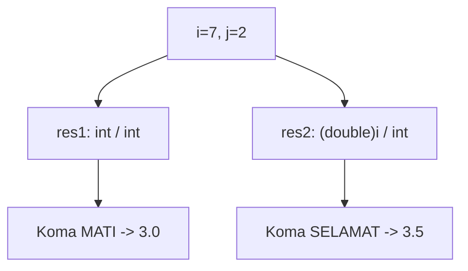
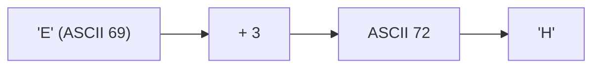
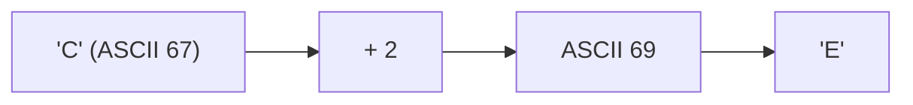
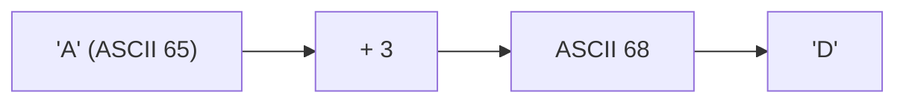
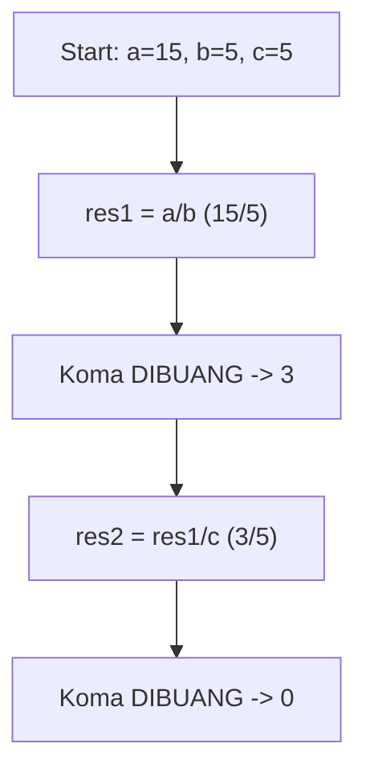
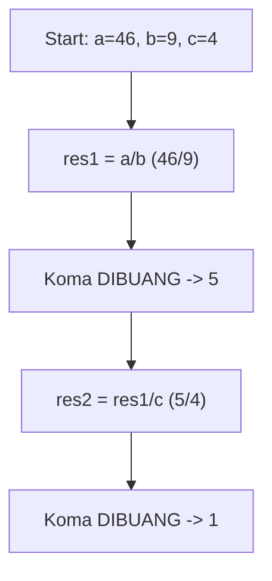
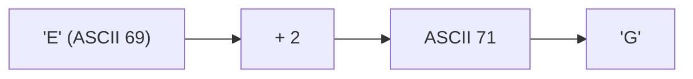

# Latihan Soal Part C - Modul 01 - Set 02

### Soal 26 (Integer Division)
```cpp
int a = 23;
int b = 5;
int c = 2;
int res1 = a / b;
int res2 = res1 / c;
```
**Pertanyaan:**
1. Berapakah nilai `res1`?
2. Berapakah nilai `res2`?
3. Mengapa `res1` tidak menghasilkan angka desimal?

**Jawaban & Diagnosis:**
1. **4**
2. **2**
3. **Karena tipe datanya `int`, setiap ada koma di belakangnya langsung dipangkas habis (Integer Division).**

**Mermaid Flowchart:**


**📖 Cara Membaca Diagram:**
Mulai: a=23, b=5, c=2. Di baris `res1 = a / b`, 23/5 = 4.60, tapi karena `int`, koma dibakar jadi 4. Lalu 4/2 = 2.00, dibakar lagi jadi 2.

---
### Soal 27 (Casting War)
```cpp
int i = 7;
int j = 2;
double res1 = i / j;
double res2 = (double)i / j;
```
**Pertanyaan:**
1. Berapakah isi `res1`?
2. Berapakah isi `res2`?
3. Kenapa hasil `res1` dan `res2` berbeda padahal rumusnya mirip?

**Jawaban & Diagnosis:**
1. **3.0**
2. **3.5**
3. **Pada `res1`, pembagian terjadi antar `int` sehingga koma dibantai duluan sebelum masuk double. Pada `res2`, `i` dipaksa jadi `double` dulu, sehingga koma selamat.**

**Mermaid Flowchart:**


**📖 Cara Membaca Diagram:**
i=7, j=2. `res1`: 7/2 (int) = 3. Masuk double jadi 3.0. `res2`: (double)7 = 7.0. 7.0/2 = 3.5.

---
### Soal 28 (Integer Division)
```cpp
int a = 37;
int b = 6;
int c = 5;
int res1 = a / b;
int res2 = res1 / c;
```
**Pertanyaan:**
1. Berapakah nilai `res1`?
2. Berapakah nilai `res2`?
3. Mengapa `res1` tidak menghasilkan angka desimal?

**Jawaban & Diagnosis:**
1. **6**
2. **1**
3. **Karena tipe datanya `int`, setiap ada koma di belakangnya langsung dipangkas habis (Integer Division).**

**Mermaid Flowchart:**


**📖 Cara Membaca Diagram:**
Mulai: a=37, b=6, c=5. Di baris `res1 = a / b`, 37/6 = 6.17, tapi karena `int`, koma dibakar jadi 6. Lalu 6/5 = 1.20, dibakar lagi jadi 1.

---
### Soal 29 (ASCII Math)
```cpp
char c = 'E';
int jump = 3;
char result = c + jump;
```
**Pertanyaan:**
1. Berapakah nilai ASCII batin dari 'E'?
2. Karakter apa yang tersimpan dalam variabel `result`?
3. Jika `result` dicetak sebagai `int`, angka berapa yang muncul?

**Jawaban & Diagnosis:**
1. **69**
2. **H**
3. **72**

**Mermaid Flowchart:**


**📖 Cara Membaca Diagram:**
Karakter 'E' punya kode batin ASCII 69. Ditambah 3 langkah menjadi 72. Kode 72 adalah huruf 'H'.

---
### Soal 30 (ASCII Math)
```cpp
char c = 'B';
int jump = 2;
char result = c + jump;
```
**Pertanyaan:**
1. Berapakah nilai ASCII batin dari 'B'?
2. Karakter apa yang tersimpan dalam variabel `result`?
3. Jika `result` dicetak sebagai `int`, angka berapa yang muncul?

**Jawaban & Diagnosis:**
1. **66**
2. **D**
3. **68**

**Mermaid Flowchart:**


**📖 Cara Membaca Diagram:**
Karakter 'B' punya kode batin ASCII 66. Ditambah 2 langkah menjadi 68. Kode 68 adalah huruf 'D'.

---
### Soal 31 (ASCII Math)
```cpp
char c = 'C';
int jump = 2;
char result = c + jump;
```
**Pertanyaan:**
1. Berapakah nilai ASCII batin dari 'C'?
2. Karakter apa yang tersimpan dalam variabel `result`?
3. Jika `result` dicetak sebagai `int`, angka berapa yang muncul?

**Jawaban & Diagnosis:**
1. **67**
2. **E**
3. **69**

**Mermaid Flowchart:**


**📖 Cara Membaca Diagram:**
Karakter 'C' punya kode batin ASCII 67. Ditambah 2 langkah menjadi 69. Kode 69 adalah huruf 'E'.

---
### Soal 32 (Modulo Magic)
```cpp
int x = 58;
int m1 = 2;
int m2 = 5;
int res_x = x % m1;
int res_y = x % m2;
```
**Pertanyaan:**
1. Apakah `x` genap atau ganjil?
2. Berapakah sisa bagi `x % m2`?
3. Apa guna operator `%` dalam OSN-K?

**Jawaban & Diagnosis:**
1. **Genap**
2. **3**
3. **Untuk mencari sisa bagi (sisa kelereng) atau mendeteksi pola perulangan/genap-ganjil.**

**Mermaid Flowchart:**
```mermaid
graph TD
    A[x=58] --> Bx % 2 == 0?
    B -- Ya --> C[Genap]
    B -- Tidak --> D[Ganjil]
    A --> E["x % 5"]
    E --> F["Sisa: 3"]
```

**📖 Cara Membaca Diagram:**
x=58. Cek `x % 2`: 58%2 = 0. Jika 0 genap, jika 1 ganjil. Cek `x % 5`: 58/5 = 11 sisa 3.

---
### Soal 33 (Casting War)
```cpp
int i = 5;
int j = 2;
double res1 = i / j;
double res2 = (double)i / j;
```
**Pertanyaan:**
1. Berapakah isi `res1`?
2. Berapakah isi `res2`?
3. Kenapa hasil `res1` dan `res2` berbeda padahal rumusnya mirip?

**Jawaban & Diagnosis:**
1. **2.0**
2. **2.5**
3. **Pada `res1`, pembagian terjadi antar `int` sehingga koma dibantai duluan sebelum masuk double. Pada `res2`, `i` dipaksa jadi `double` dulu, sehingga koma selamat.**

**Mermaid Flowchart:**


**📖 Cara Membaca Diagram:**
i=5, j=2. `res1`: 5/2 (int) = 2. Masuk double jadi 2.0. `res2`: (double)5 = 5.0. 5.0/2 = 2.5.

---
### Soal 34 (Modulo Magic)
```cpp
int x = 42;
int m1 = 2;
int m2 = 5;
int res_x = x % m1;
int res_y = x % m2;
```
**Pertanyaan:**
1. Apakah `x` genap atau ganjil?
2. Berapakah sisa bagi `x % m2`?
3. Apa guna operator `%` dalam OSN-K?

**Jawaban & Diagnosis:**
1. **Genap**
2. **2**
3. **Untuk mencari sisa bagi (sisa kelereng) atau mendeteksi pola perulangan/genap-ganjil.**

**Mermaid Flowchart:**
```mermaid
graph TD
    A[x=42] --> Bx % 2 == 0?
    B -- Ya --> C[Genap]
    B -- Tidak --> D[Ganjil]
    A --> E["x % 5"]
    E --> F["Sisa: 2"]
```

**📖 Cara Membaca Diagram:**
x=42. Cek `x % 2`: 42%2 = 0. Jika 0 genap, jika 1 ganjil. Cek `x % 5`: 42/5 = 8 sisa 2.

---
### Soal 35 (Modulo Magic)
```cpp
int x = 63;
int m1 = 2;
int m2 = 5;
int res_x = x % m1;
int res_y = x % m2;
```
**Pertanyaan:**
1. Apakah `x` genap atau ganjil?
2. Berapakah sisa bagi `x % m2`?
3. Apa guna operator `%` dalam OSN-K?

**Jawaban & Diagnosis:**
1. **Ganjil**
2. **3**
3. **Untuk mencari sisa bagi (sisa kelereng) atau mendeteksi pola perulangan/genap-ganjil.**

**Mermaid Flowchart:**
```mermaid
graph TD
    A[x=63] --> Bx % 2 == 0?
    B -- Ya --> C[Genap]
    B -- Tidak --> D[Ganjil]
    A --> E["x % 5"]
    E --> F["Sisa: 3"]
```

**📖 Cara Membaca Diagram:**
x=63. Cek `x % 2`: 63%2 = 1. Jika 0 genap, jika 1 ganjil. Cek `x % 5`: 63/5 = 12 sisa 3.

---
### Soal 36 (ASCII Math)
```cpp
char c = 'A';
int jump = 3;
char result = c + jump;
```
**Pertanyaan:**
1. Berapakah nilai ASCII batin dari 'A'?
2. Karakter apa yang tersimpan dalam variabel `result`?
3. Jika `result` dicetak sebagai `int`, angka berapa yang muncul?

**Jawaban & Diagnosis:**
1. **65**
2. **D**
3. **68**

**Mermaid Flowchart:**


**📖 Cara Membaca Diagram:**
Karakter 'A' punya kode batin ASCII 65. Ditambah 3 langkah menjadi 68. Kode 68 adalah huruf 'D'.

---
### Soal 37 (Casting War)
```cpp
int i = 5;
int j = 2;
double res1 = i / j;
double res2 = (double)i / j;
```
**Pertanyaan:**
1. Berapakah isi `res1`?
2. Berapakah isi `res2`?
3. Kenapa hasil `res1` dan `res2` berbeda padahal rumusnya mirip?

**Jawaban & Diagnosis:**
1. **2.0**
2. **2.5**
3. **Pada `res1`, pembagian terjadi antar `int` sehingga koma dibantai duluan sebelum masuk double. Pada `res2`, `i` dipaksa jadi `double` dulu, sehingga koma selamat.**

**Mermaid Flowchart:**


**📖 Cara Membaca Diagram:**
i=5, j=2. `res1`: 5/2 (int) = 2. Masuk double jadi 2.0. `res2`: (double)5 = 5.0. 5.0/2 = 2.5.

---
### Soal 38 (Casting War)
```cpp
int i = 7;
int j = 2;
double res1 = i / j;
double res2 = (double)i / j;
```
**Pertanyaan:**
1. Berapakah isi `res1`?
2. Berapakah isi `res2`?
3. Kenapa hasil `res1` dan `res2` berbeda padahal rumusnya mirip?

**Jawaban & Diagnosis:**
1. **3.0**
2. **3.5**
3. **Pada `res1`, pembagian terjadi antar `int` sehingga koma dibantai duluan sebelum masuk double. Pada `res2`, `i` dipaksa jadi `double` dulu, sehingga koma selamat.**

**Mermaid Flowchart:**


**📖 Cara Membaca Diagram:**
i=7, j=2. `res1`: 7/2 (int) = 3. Masuk double jadi 3.0. `res2`: (double)7 = 7.0. 7.0/2 = 3.5.

---
### Soal 39 (Integer Division)
```cpp
int a = 15;
int b = 5;
int c = 5;
int res1 = a / b;
int res2 = res1 / c;
```
**Pertanyaan:**
1. Berapakah nilai `res1`?
2. Berapakah nilai `res2`?
3. Mengapa `res1` tidak menghasilkan angka desimal?

**Jawaban & Diagnosis:**
1. **3**
2. **0**
3. **Karena tipe datanya `int`, setiap ada koma di belakangnya langsung dipangkas habis (Integer Division).**

**Mermaid Flowchart:**


**📖 Cara Membaca Diagram:**
Mulai: a=15, b=5, c=5. Di baris `res1 = a / b`, 15/5 = 3.00, tapi karena `int`, koma dibakar jadi 3. Lalu 3/5 = 0.60, dibakar lagi jadi 0.

---
### Soal 40 (Casting War)
```cpp
int i = 8;
int j = 2;
double res1 = i / j;
double res2 = (double)i / j;
```
**Pertanyaan:**
1. Berapakah isi `res1`?
2. Berapakah isi `res2`?
3. Kenapa hasil `res1` dan `res2` berbeda padahal rumusnya mirip?

**Jawaban & Diagnosis:**
1. **4.0**
2. **4.0**
3. **Pada `res1`, pembagian terjadi antar `int` sehingga koma dibantai duluan sebelum masuk double. Pada `res2`, `i` dipaksa jadi `double` dulu, sehingga koma selamat.**

**Mermaid Flowchart:**


**📖 Cara Membaca Diagram:**
i=8, j=2. `res1`: 8/2 (int) = 4. Masuk double jadi 4.0. `res2`: (double)8 = 8.0. 8.0/2 = 4.0.

---
### Soal 41 (Modulo Magic)
```cpp
int x = 36;
int m1 = 2;
int m2 = 5;
int res_x = x % m1;
int res_y = x % m2;
```
**Pertanyaan:**
1. Apakah `x` genap atau ganjil?
2. Berapakah sisa bagi `x % m2`?
3. Apa guna operator `%` dalam OSN-K?

**Jawaban & Diagnosis:**
1. **Genap**
2. **1**
3. **Untuk mencari sisa bagi (sisa kelereng) atau mendeteksi pola perulangan/genap-ganjil.**

**Mermaid Flowchart:**
```mermaid
graph TD
    A[x=36] --> Bx % 2 == 0?
    B -- Ya --> C[Genap]
    B -- Tidak --> D[Ganjil]
    A --> E["x % 5"]
    E --> F["Sisa: 1"]
```

**📖 Cara Membaca Diagram:**
x=36. Cek `x % 2`: 36%2 = 0. Jika 0 genap, jika 1 ganjil. Cek `x % 5`: 36/5 = 7 sisa 1.

---
### Soal 42 (Integer Division)
```cpp
int a = 46;
int b = 9;
int c = 4;
int res1 = a / b;
int res2 = res1 / c;
```
**Pertanyaan:**
1. Berapakah nilai `res1`?
2. Berapakah nilai `res2`?
3. Mengapa `res1` tidak menghasilkan angka desimal?

**Jawaban & Diagnosis:**
1. **5**
2. **1**
3. **Karena tipe datanya `int`, setiap ada koma di belakangnya langsung dipangkas habis (Integer Division).**

**Mermaid Flowchart:**


**📖 Cara Membaca Diagram:**
Mulai: a=46, b=9, c=4. Di baris `res1 = a / b`, 46/9 = 5.11, tapi karena `int`, koma dibakar jadi 5. Lalu 5/4 = 1.25, dibakar lagi jadi 1.

---
### Soal 43 (ASCII Math)
```cpp
char c = 'E';
int jump = 2;
char result = c + jump;
```
**Pertanyaan:**
1. Berapakah nilai ASCII batin dari 'E'?
2. Karakter apa yang tersimpan dalam variabel `result`?
3. Jika `result` dicetak sebagai `int`, angka berapa yang muncul?

**Jawaban & Diagnosis:**
1. **69**
2. **G**
3. **71**

**Mermaid Flowchart:**


**📖 Cara Membaca Diagram:**
Karakter 'E' punya kode batin ASCII 69. Ditambah 2 langkah menjadi 71. Kode 71 adalah huruf 'G'.

---
### Soal 44 (Modulo Magic)
```cpp
int x = 24;
int m1 = 2;
int m2 = 5;
int res_x = x % m1;
int res_y = x % m2;
```
**Pertanyaan:**
1. Apakah `x` genap atau ganjil?
2. Berapakah sisa bagi `x % m2`?
3. Apa guna operator `%` dalam OSN-K?

**Jawaban & Diagnosis:**
1. **Genap**
2. **4**
3. **Untuk mencari sisa bagi (sisa kelereng) atau mendeteksi pola perulangan/genap-ganjil.**

**Mermaid Flowchart:**
```mermaid
graph TD
    A[x=24] --> Bx % 2 == 0?
    B -- Ya --> C[Genap]
    B -- Tidak --> D[Ganjil]
    A --> E["x % 5"]
    E --> F["Sisa: 4"]
```

**📖 Cara Membaca Diagram:**
x=24. Cek `x % 2`: 24%2 = 0. Jika 0 genap, jika 1 ganjil. Cek `x % 5`: 24/5 = 4 sisa 4.

---
### Soal 45 (Modulo Magic)
```cpp
int x = 92;
int m1 = 2;
int m2 = 5;
int res_x = x % m1;
int res_y = x % m2;
```
**Pertanyaan:**
1. Apakah `x` genap atau ganjil?
2. Berapakah sisa bagi `x % m2`?
3. Apa guna operator `%` dalam OSN-K?

**Jawaban & Diagnosis:**
1. **Genap**
2. **2**
3. **Untuk mencari sisa bagi (sisa kelereng) atau mendeteksi pola perulangan/genap-ganjil.**

**Mermaid Flowchart:**
```mermaid
graph TD
    A[x=92] --> Bx % 2 == 0?
    B -- Ya --> C[Genap]
    B -- Tidak --> D[Ganjil]
    A --> E["x % 5"]
    E --> F["Sisa: 2"]
```

**📖 Cara Membaca Diagram:**
x=92. Cek `x % 2`: 92%2 = 0. Jika 0 genap, jika 1 ganjil. Cek `x % 5`: 92/5 = 18 sisa 2.

---
### Soal 46 (Casting War)
```cpp
int i = 9;
int j = 2;
double res1 = i / j;
double res2 = (double)i / j;
```
**Pertanyaan:**
1. Berapakah isi `res1`?
2. Berapakah isi `res2`?
3. Kenapa hasil `res1` dan `res2` berbeda padahal rumusnya mirip?

**Jawaban & Diagnosis:**
1. **4.0**
2. **4.5**
3. **Pada `res1`, pembagian terjadi antar `int` sehingga koma dibantai duluan sebelum masuk double. Pada `res2`, `i` dipaksa jadi `double` dulu, sehingga koma selamat.**

**Mermaid Flowchart:**
```mermaid
graph TD
    A["i=9, j=2"] --> B["res1: int / int"]
    B --> C["Koma MATI -> 4.0"]
    A --> D["res2: (double)i / int"]
    D --> E["Koma SELAMAT -> 4.5"]
```

**📖 Cara Membaca Diagram:**
i=9, j=2. `res1`: 9/2 (int) = 4. Masuk double jadi 4.0. `res2`: (double)9 = 9.0. 9.0/2 = 4.5.

---
### Soal 47 (Integer Division)
```cpp
int a = 21;
int b = 5;
int c = 5;
int res1 = a / b;
int res2 = res1 / c;
```
**Pertanyaan:**
1. Berapakah nilai `res1`?
2. Berapakah nilai `res2`?
3. Mengapa `res1` tidak menghasilkan angka desimal?

**Jawaban & Diagnosis:**
1. **4**
2. **0**
3. **Karena tipe datanya `int`, setiap ada koma di belakangnya langsung dipangkas habis (Integer Division).**

**Mermaid Flowchart:**
```mermaid
graph TD
    A[Start: a=21, b=5, c=5] --> B["res1 = a/b (21/5)"]
    B --> C["Koma DIBUANG -> 4"]
    C --> D["res2 = res1/c (4/5)"]
    D --> E["Koma DIBUANG -> 0"]
```

**📖 Cara Membaca Diagram:**
Mulai: a=21, b=5, c=5. Di baris `res1 = a / b`, 21/5 = 4.20, tapi karena `int`, koma dibakar jadi 4. Lalu 4/5 = 0.80, dibakar lagi jadi 0.

---
### Soal 48 (Modulo Magic)
```cpp
int x = 63;
int m1 = 2;
int m2 = 5;
int res_x = x % m1;
int res_y = x % m2;
```
**Pertanyaan:**
1. Apakah `x` genap atau ganjil?
2. Berapakah sisa bagi `x % m2`?
3. Apa guna operator `%` dalam OSN-K?

**Jawaban & Diagnosis:**
1. **Ganjil**
2. **3**
3. **Untuk mencari sisa bagi (sisa kelereng) atau mendeteksi pola perulangan/genap-ganjil.**

**Mermaid Flowchart:**
```mermaid
graph TD
    A[x=63] --> Bx % 2 == 0?
    B -- Ya --> C[Genap]
    B -- Tidak --> D[Ganjil]
    A --> E["x % 5"]
    E --> F["Sisa: 3"]
```

**📖 Cara Membaca Diagram:**
x=63. Cek `x % 2`: 63%2 = 1. Jika 0 genap, jika 1 ganjil. Cek `x % 5`: 63/5 = 12 sisa 3.

---
### Soal 49 (Integer Division)
```cpp
int a = 39;
int b = 4;
int c = 3;
int res1 = a / b;
int res2 = res1 / c;
```
**Pertanyaan:**
1. Berapakah nilai `res1`?
2. Berapakah nilai `res2`?
3. Mengapa `res1` tidak menghasilkan angka desimal?

**Jawaban & Diagnosis:**
1. **9**
2. **3**
3. **Karena tipe datanya `int`, setiap ada koma di belakangnya langsung dipangkas habis (Integer Division).**

**Mermaid Flowchart:**
```mermaid
graph TD
    A[Start: a=39, b=4, c=3] --> B["res1 = a/b (39/4)"]
    B --> C["Koma DIBUANG -> 9"]
    C --> D["res2 = res1/c (9/3)"]
    D --> E["Koma DIBUANG -> 3"]
```

**📖 Cara Membaca Diagram:**
Mulai: a=39, b=4, c=3. Di baris `res1 = a / b`, 39/4 = 9.75, tapi karena `int`, koma dibakar jadi 9. Lalu 9/3 = 3.00, dibakar lagi jadi 3.

---
### Soal 50 (Casting War)
```cpp
int i = 7;
int j = 2;
double res1 = i / j;
double res2 = (double)i / j;
```
**Pertanyaan:**
1. Berapakah isi `res1`?
2. Berapakah isi `res2`?
3. Kenapa hasil `res1` dan `res2` berbeda padahal rumusnya mirip?

**Jawaban & Diagnosis:**
1. **3.0**
2. **3.5**
3. **Pada `res1`, pembagian terjadi antar `int` sehingga koma dibantai duluan sebelum masuk double. Pada `res2`, `i` dipaksa jadi `double` dulu, sehingga koma selamat.**

**Mermaid Flowchart:**
```mermaid
graph TD
    A["i=7, j=2"] --> B["res1: int / int"]
    B --> C["Koma MATI -> 3.0"]
    A --> D["res2: (double)i / int"]
    D --> E["Koma SELAMAT -> 3.5"]
```

**📖 Cara Membaca Diagram:**
i=7, j=2. `res1`: 7/2 (int) = 3. Masuk double jadi 3.0. `res2`: (double)7 = 7.0. 7.0/2 = 3.5.

---
