🔙 **[Kembali ke Daftar Soal](./README.md)**

---

# Latihan Soal Part C - Modul 01 - Set 02

### Soal 26
```cpp
int roti = 47;
int anak = 9;
int dapet_tiap_anak = roti / anak;
```
**Pertanyaan:**
1. Berapakah hasil akhirnya?
2. Deskripsikan langkah robot compiler saat memproses kode ini!

**Jawaban & Diagnosis:**
1. **5**
2. Baca bagian 'Analisis Mendalam' di bawah.

**Mermaid Flowchart:**
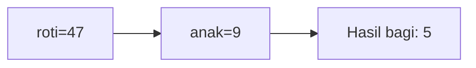

**📖 Penjelasan Komprehensif:**
**Analisis Mendalam (Compiler Manusia):**
1. **Inisialisasi**: Pak Dengklek punya `roti` sebanyak 47 dan ingin dibagi ke 9 `anak`.
2. **Operasi Pembagian**: Rumus `roti / anak` dijalankan. Secara matematis hasilnya 5.22.
3. **Hukum Tipe Data**: Karena hasilnya disimpan ke loker `int`, C++ membuang sisa 2 biji dan hanya mengambil bagian bulatnya.
4. **Hasil Akhir**: `dapet_tiap_anak` bernilai **5**.

---
### Soal 27
```cpp
char huruf_awal = 'a';
char kode_rahasia = huruf_awal + 4;
```
**Pertanyaan:**
1. Berapakah hasil akhirnya?
2. Deskripsikan langkah robot compiler saat memproses kode ini!

**Jawaban & Diagnosis:**
1. **e**
2. Baca bagian 'Analisis Mendalam' di bawah.

**Mermaid Flowchart:**
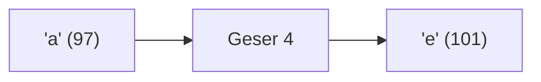

**📖 Penjelasan Komprehensif:**
**Analisis Mendalam (Compiler Manusia):**
1. **Batin Karakter**: Huruf 'a' memiliki nilai ASCII **97**.
2. **Operasi Geser**: Menambah huruf dengan angka akan menggeser posisinya di tabel ASCII: 97 + 4 = 101.
3. **Identitas Baru**: Angka 101 adalah identitas untuk huruf **'e'**.
4. **Hasil Akhir**: `kode_rahasia` berisi **'e'**.

---
### Soal 28
```cpp
int stok_buku = 52;
int rak = 7;
int sisa_buku = stok_buku % rak;
```
**Pertanyaan:**
1. Berapakah hasil akhirnya?
2. Deskripsikan langkah robot compiler saat memproses kode ini!

**Jawaban & Diagnosis:**
1. **3**
2. Baca bagian 'Analisis Mendalam' di bawah.

**Mermaid Flowchart:**
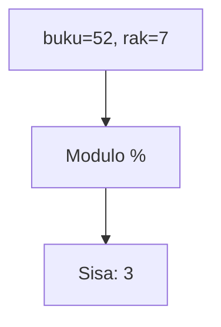

**📖 Penjelasan Komprehensif:**
**Analisis Mendalam (Compiler Manusia):**
1. **Konteks**: Menyusun 52 buku ke 7 rak secara merata.
2. **Mekanisme Modulo**: Operator `%` bukan menghitung hasil bagi, tapi sisa yang tidak muat masuk rak.
3. **Perhitungan**: 52 dibagi 7 sisa **3**.
4. **Hasil Akhir**: `sisa_buku` adalah **3**.

---
### Soal 29
```cpp
double saldo_bank = 48.15;
int uang_kertas = (int)saldo_bank;
```
**Pertanyaan:**
1. Berapakah hasil akhirnya?
2. Deskripsikan langkah robot compiler saat memproses kode ini!

**Jawaban & Diagnosis:**
1. **48**
2. Baca bagian 'Analisis Mendalam' di bawah.

**Mermaid Flowchart:**
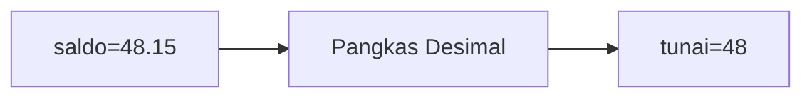

**📖 Penjelasan Komprehensif:**
**Analisis Mendalam (Compiler Manusia):**
1. **Gelas ke Laci**: `saldo_bank` adalah `double` (angka berkoma).
2. **Type Casting**: Perintah `(int)` secara paksa mengubahnya menjadi bilangan bulat.
3. **Efek**: Bagian desimal `48.15` menderita pelenyapan.
4. **Hasil Akhir**: `uang_kertas` berisi **48**.

---
### Soal 30
```cpp
int stok_buku = 77;
int rak = 7;
int sisa_buku = stok_buku % rak;
```
**Pertanyaan:**
1. Berapakah hasil akhirnya?
2. Deskripsikan langkah robot compiler saat memproses kode ini!

**Jawaban & Diagnosis:**
1. **0**
2. Baca bagian 'Analisis Mendalam' di bawah.

**Mermaid Flowchart:**
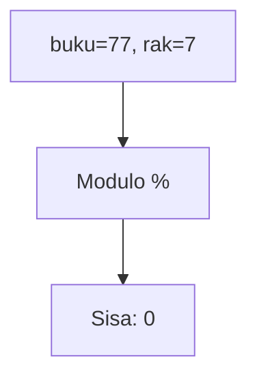

**📖 Penjelasan Komprehensif:**
**Analisis Mendalam (Compiler Manusia):**
1. **Konteks**: Menyusun 77 buku ke 7 rak secara merata.
2. **Mekanisme Modulo**: Operator `%` bukan menghitung hasil bagi, tapi sisa yang tidak muat masuk rak.
3. **Perhitungan**: 77 dibagi 7 sisa **0**.
4. **Hasil Akhir**: `sisa_buku` adalah **0**.

---
### Soal 31
```cpp
int stok_buku = 68;
int rak = 4;
int sisa_buku = stok_buku % rak;
```
**Pertanyaan:**
1. Berapakah hasil akhirnya?
2. Deskripsikan langkah robot compiler saat memproses kode ini!

**Jawaban & Diagnosis:**
1. **0**
2. Baca bagian 'Analisis Mendalam' di bawah.

**Mermaid Flowchart:**
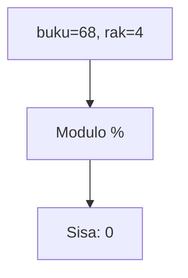

**📖 Penjelasan Komprehensif:**
**Analisis Mendalam (Compiler Manusia):**
1. **Konteks**: Menyusun 68 buku ke 4 rak secara merata.
2. **Mekanisme Modulo**: Operator `%` bukan menghitung hasil bagi, tapi sisa yang tidak muat masuk rak.
3. **Perhitungan**: 68 dibagi 4 sisa **0**.
4. **Hasil Akhir**: `sisa_buku` adalah **0**.

---
### Soal 32
```cpp
int permen = 35;
int anak = 4;
int dapet_tiap_anak = permen / anak;
```
**Pertanyaan:**
1. Berapakah hasil akhirnya?
2. Deskripsikan langkah robot compiler saat memproses kode ini!

**Jawaban & Diagnosis:**
1. **8**
2. Baca bagian 'Analisis Mendalam' di bawah.

**Mermaid Flowchart:**
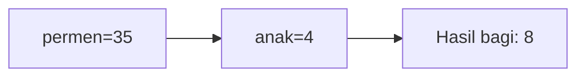

**📖 Penjelasan Komprehensif:**
**Analisis Mendalam (Compiler Manusia):**
1. **Inisialisasi**: Pak Dengklek punya `permen` sebanyak 35 dan ingin dibagi ke 4 `anak`.
2. **Operasi Pembagian**: Rumus `permen / anak` dijalankan. Secara matematis hasilnya 8.75.
3. **Hukum Tipe Data**: Karena hasilnya disimpan ke loker `int`, C++ membuang sisa 3 biji dan hanya mengambil bagian bulatnya.
4. **Hasil Akhir**: `dapet_tiap_anak` bernilai **8**.

---
### Soal 33
```cpp
char huruf_awal = 'B';
char kode_rahasia = huruf_awal + 2;
```
**Pertanyaan:**
1. Berapakah hasil akhirnya?
2. Deskripsikan langkah robot compiler saat memproses kode ini!

**Jawaban & Diagnosis:**
1. **D**
2. Baca bagian 'Analisis Mendalam' di bawah.

**Mermaid Flowchart:**
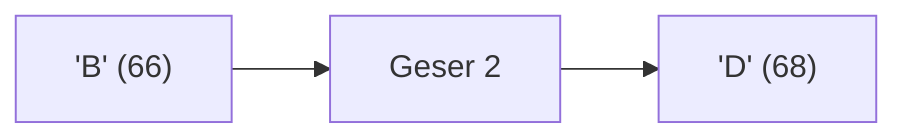

**📖 Penjelasan Komprehensif:**
**Analisis Mendalam (Compiler Manusia):**
1. **Batin Karakter**: Huruf 'B' memiliki nilai ASCII **66**.
2. **Operasi Geser**: Menambah huruf dengan angka akan menggeser posisinya di tabel ASCII: 66 + 2 = 68.
3. **Identitas Baru**: Angka 68 adalah identitas untuk huruf **'D'**.
4. **Hasil Akhir**: `kode_rahasia` berisi **'D'**.

---
### Soal 34
```cpp
double saldo_bank = 20.65;
int uang_kertas = (int)saldo_bank;
```
**Pertanyaan:**
1. Berapakah hasil akhirnya?
2. Deskripsikan langkah robot compiler saat memproses kode ini!

**Jawaban & Diagnosis:**
1. **20**
2. Baca bagian 'Analisis Mendalam' di bawah.

**Mermaid Flowchart:**
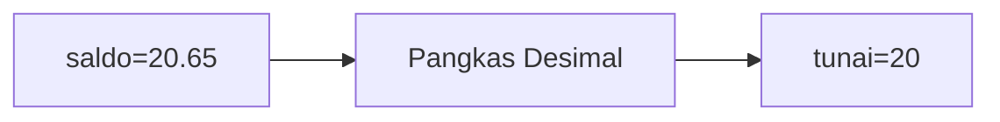

**📖 Penjelasan Komprehensif:**
**Analisis Mendalam (Compiler Manusia):**
1. **Gelas ke Laci**: `saldo_bank` adalah `double` (angka berkoma).
2. **Type Casting**: Perintah `(int)` secara paksa mengubahnya menjadi bilangan bulat.
3. **Efek**: Bagian desimal `20.65` menderita pelenyapan.
4. **Hasil Akhir**: `uang_kertas` berisi **20**.

---
### Soal 35
```cpp
int stok_buku = 65;
int rak = 4;
int sisa_buku = stok_buku % rak;
```
**Pertanyaan:**
1. Berapakah hasil akhirnya?
2. Deskripsikan langkah robot compiler saat memproses kode ini!

**Jawaban & Diagnosis:**
1. **1**
2. Baca bagian 'Analisis Mendalam' di bawah.

**Mermaid Flowchart:**


**📖 Penjelasan Komprehensif:**
**Analisis Mendalam (Compiler Manusia):**
1. **Konteks**: Menyusun 65 buku ke 4 rak secara merata.
2. **Mekanisme Modulo**: Operator `%` bukan menghitung hasil bagi, tapi sisa yang tidak muat masuk rak.
3. **Perhitungan**: 65 dibagi 4 sisa **1**.
4. **Hasil Akhir**: `sisa_buku` adalah **1**.

---
### Soal 36
```cpp
double saldo_bank = 43.75;
int uang_kertas = (int)saldo_bank;
```
**Pertanyaan:**
1. Berapakah hasil akhirnya?
2. Deskripsikan langkah robot compiler saat memproses kode ini!

**Jawaban & Diagnosis:**
1. **43**
2. Baca bagian 'Analisis Mendalam' di bawah.

**Mermaid Flowchart:**


**📖 Penjelasan Komprehensif:**
**Analisis Mendalam (Compiler Manusia):**
1. **Gelas ke Laci**: `saldo_bank` adalah `double` (angka berkoma).
2. **Type Casting**: Perintah `(int)` secara paksa mengubahnya menjadi bilangan bulat.
3. **Efek**: Bagian desimal `43.75` menderita pelenyapan.
4. **Hasil Akhir**: `uang_kertas` berisi **43**.

---
### Soal 37
```cpp
char huruf_awal = 'A';
char kode_rahasia = huruf_awal + 3;
```
**Pertanyaan:**
1. Berapakah hasil akhirnya?
2. Deskripsikan langkah robot compiler saat memproses kode ini!

**Jawaban & Diagnosis:**
1. **D**
2. Baca bagian 'Analisis Mendalam' di bawah.

**Mermaid Flowchart:**
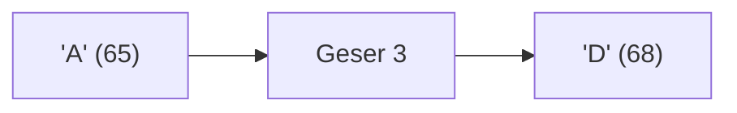

**📖 Penjelasan Komprehensif:**
**Analisis Mendalam (Compiler Manusia):**
1. **Batin Karakter**: Huruf 'A' memiliki nilai ASCII **65**.
2. **Operasi Geser**: Menambah huruf dengan angka akan menggeser posisinya di tabel ASCII: 65 + 3 = 68.
3. **Identitas Baru**: Angka 68 adalah identitas untuk huruf **'D'**.
4. **Hasil Akhir**: `kode_rahasia` berisi **'D'**.

---
### Soal 38
```cpp
int stok_buku = 73;
int rak = 3;
int sisa_buku = stok_buku % rak;
```
**Pertanyaan:**
1. Berapakah hasil akhirnya?
2. Deskripsikan langkah robot compiler saat memproses kode ini!

**Jawaban & Diagnosis:**
1. **1**
2. Baca bagian 'Analisis Mendalam' di bawah.

**Mermaid Flowchart:**
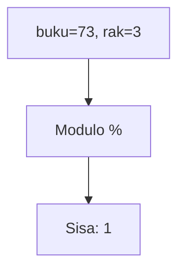

**📖 Penjelasan Komprehensif:**
**Analisis Mendalam (Compiler Manusia):**
1. **Konteks**: Menyusun 73 buku ke 3 rak secara merata.
2. **Mekanisme Modulo**: Operator `%` bukan menghitung hasil bagi, tapi sisa yang tidak muat masuk rak.
3. **Perhitungan**: 73 dibagi 3 sisa **1**.
4. **Hasil Akhir**: `sisa_buku` adalah **1**.

---
### Soal 39
```cpp
char huruf_awal = 'A';
char kode_rahasia = huruf_awal + 1;
```
**Pertanyaan:**
1. Berapakah hasil akhirnya?
2. Deskripsikan langkah robot compiler saat memproses kode ini!

**Jawaban & Diagnosis:**
1. **B**
2. Baca bagian 'Analisis Mendalam' di bawah.

**Mermaid Flowchart:**
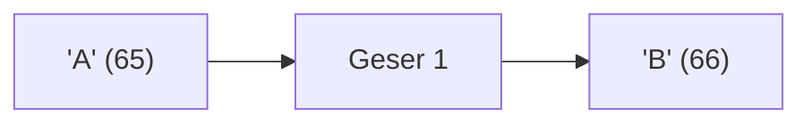

**📖 Penjelasan Komprehensif:**
**Analisis Mendalam (Compiler Manusia):**
1. **Batin Karakter**: Huruf 'A' memiliki nilai ASCII **65**.
2. **Operasi Geser**: Menambah huruf dengan angka akan menggeser posisinya di tabel ASCII: 65 + 1 = 66.
3. **Identitas Baru**: Angka 66 adalah identitas untuk huruf **'B'**.
4. **Hasil Akhir**: `kode_rahasia` berisi **'B'**.

---
### Soal 40
```cpp
char huruf_awal = 'B';
char kode_rahasia = huruf_awal + 4;
```
**Pertanyaan:**
1. Berapakah hasil akhirnya?
2. Deskripsikan langkah robot compiler saat memproses kode ini!

**Jawaban & Diagnosis:**
1. **F**
2. Baca bagian 'Analisis Mendalam' di bawah.

**Mermaid Flowchart:**
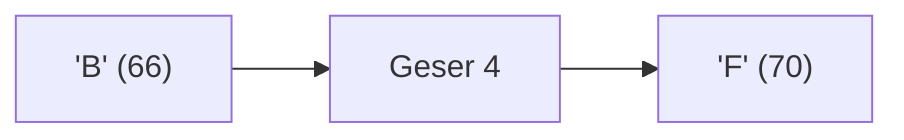

**📖 Penjelasan Komprehensif:**
**Analisis Mendalam (Compiler Manusia):**
1. **Batin Karakter**: Huruf 'B' memiliki nilai ASCII **66**.
2. **Operasi Geser**: Menambah huruf dengan angka akan menggeser posisinya di tabel ASCII: 66 + 4 = 70.
3. **Identitas Baru**: Angka 70 adalah identitas untuk huruf **'F'**.
4. **Hasil Akhir**: `kode_rahasia` berisi **'F'**.

---
### Soal 41
```cpp
double saldo_bank = 27.42;
int uang_kertas = (int)saldo_bank;
```
**Pertanyaan:**
1. Berapakah hasil akhirnya?
2. Deskripsikan langkah robot compiler saat memproses kode ini!

**Jawaban & Diagnosis:**
1. **27**
2. Baca bagian 'Analisis Mendalam' di bawah.

**Mermaid Flowchart:**
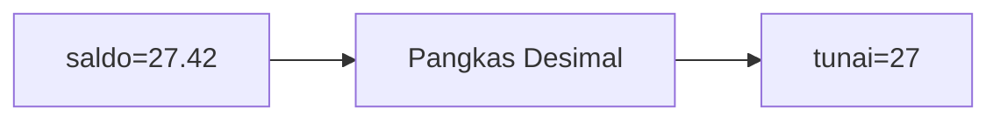

**📖 Penjelasan Komprehensif:**
**Analisis Mendalam (Compiler Manusia):**
1. **Gelas ke Laci**: `saldo_bank` adalah `double` (angka berkoma).
2. **Type Casting**: Perintah `(int)` secara paksa mengubahnya menjadi bilangan bulat.
3. **Efek**: Bagian desimal `27.42` menderita pelenyapan.
4. **Hasil Akhir**: `uang_kertas` berisi **27**.

---
### Soal 42
```cpp
double saldo_bank = 29.16;
int uang_kertas = (int)saldo_bank;
```
**Pertanyaan:**
1. Berapakah hasil akhirnya?
2. Deskripsikan langkah robot compiler saat memproses kode ini!

**Jawaban & Diagnosis:**
1. **29**
2. Baca bagian 'Analisis Mendalam' di bawah.

**Mermaid Flowchart:**
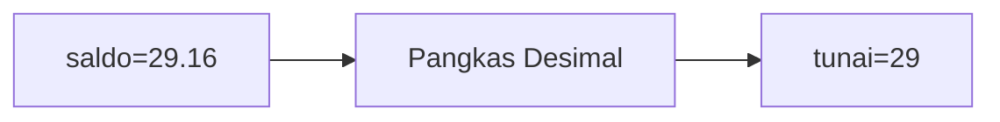

**📖 Penjelasan Komprehensif:**
**Analisis Mendalam (Compiler Manusia):**
1. **Gelas ke Laci**: `saldo_bank` adalah `double` (angka berkoma).
2. **Type Casting**: Perintah `(int)` secara paksa mengubahnya menjadi bilangan bulat.
3. **Efek**: Bagian desimal `29.16` menderita pelenyapan.
4. **Hasil Akhir**: `uang_kertas` berisi **29**.

---
### Soal 43
```cpp
char huruf_awal = 'a';
char kode_rahasia = huruf_awal + 1;
```
**Pertanyaan:**
1. Berapakah hasil akhirnya?
2. Deskripsikan langkah robot compiler saat memproses kode ini!

**Jawaban & Diagnosis:**
1. **b**
2. Baca bagian 'Analisis Mendalam' di bawah.

**Mermaid Flowchart:**
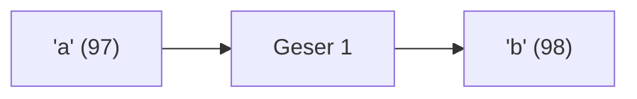

**📖 Penjelasan Komprehensif:**
**Analisis Mendalam (Compiler Manusia):**
1. **Batin Karakter**: Huruf 'a' memiliki nilai ASCII **97**.
2. **Operasi Geser**: Menambah huruf dengan angka akan menggeser posisinya di tabel ASCII: 97 + 1 = 98.
3. **Identitas Baru**: Angka 98 adalah identitas untuk huruf **'b'**.
4. **Hasil Akhir**: `kode_rahasia` berisi **'b'**.

---
### Soal 44
```cpp
int stok_buku = 32;
int rak = 4;
int sisa_buku = stok_buku % rak;
```
**Pertanyaan:**
1. Berapakah hasil akhirnya?
2. Deskripsikan langkah robot compiler saat memproses kode ini!

**Jawaban & Diagnosis:**
1. **0**
2. Baca bagian 'Analisis Mendalam' di bawah.

**Mermaid Flowchart:**
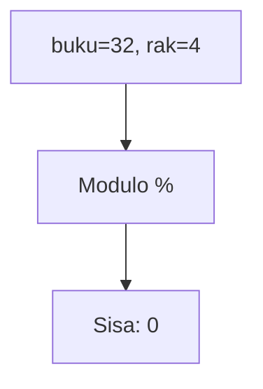

**📖 Penjelasan Komprehensif:**
**Analisis Mendalam (Compiler Manusia):**
1. **Konteks**: Menyusun 32 buku ke 4 rak secara merata.
2. **Mekanisme Modulo**: Operator `%` bukan menghitung hasil bagi, tapi sisa yang tidak muat masuk rak.
3. **Perhitungan**: 32 dibagi 4 sisa **0**.
4. **Hasil Akhir**: `sisa_buku` adalah **0**.

---
### Soal 45
```cpp
double saldo_bank = 42.79;
int uang_kertas = (int)saldo_bank;
```
**Pertanyaan:**
1. Berapakah hasil akhirnya?
2. Deskripsikan langkah robot compiler saat memproses kode ini!

**Jawaban & Diagnosis:**
1. **42**
2. Baca bagian 'Analisis Mendalam' di bawah.

**Mermaid Flowchart:**
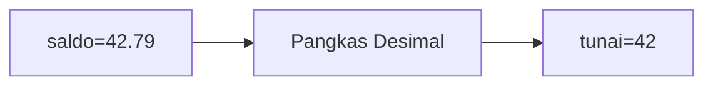

**📖 Penjelasan Komprehensif:**
**Analisis Mendalam (Compiler Manusia):**
1. **Gelas ke Laci**: `saldo_bank` adalah `double` (angka berkoma).
2. **Type Casting**: Perintah `(int)` secara paksa mengubahnya menjadi bilangan bulat.
3. **Efek**: Bagian desimal `42.79` menderita pelenyapan.
4. **Hasil Akhir**: `uang_kertas` berisi **42**.

---
### Soal 46
```cpp
int stok_buku = 49;
int rak = 7;
int sisa_buku = stok_buku % rak;
```
**Pertanyaan:**
1. Berapakah hasil akhirnya?
2. Deskripsikan langkah robot compiler saat memproses kode ini!

**Jawaban & Diagnosis:**
1. **0**
2. Baca bagian 'Analisis Mendalam' di bawah.

**Mermaid Flowchart:**
```mermaid
graph TD
A["buku=49, rak=7"] --> B["Modulo %"]
B --> C["Sisa: 0"]
```

**📖 Penjelasan Komprehensif:**
**Analisis Mendalam (Compiler Manusia):**
1. **Konteks**: Menyusun 49 buku ke 7 rak secara merata.
2. **Mekanisme Modulo**: Operator `%` bukan menghitung hasil bagi, tapi sisa yang tidak muat masuk rak.
3. **Perhitungan**: 49 dibagi 7 sisa **0**.
4. **Hasil Akhir**: `sisa_buku` adalah **0**.

---
### Soal 47
```cpp
int stok_buku = 71;
int rak = 7;
int sisa_buku = stok_buku % rak;
```
**Pertanyaan:**
1. Berapakah hasil akhirnya?
2. Deskripsikan langkah robot compiler saat memproses kode ini!

**Jawaban & Diagnosis:**
1. **1**
2. Baca bagian 'Analisis Mendalam' di bawah.

**Mermaid Flowchart:**
```mermaid
graph TD
A["buku=71, rak=7"] --> B["Modulo %"]
B --> C["Sisa: 1"]
```

**📖 Penjelasan Komprehensif:**
**Analisis Mendalam (Compiler Manusia):**
1. **Konteks**: Menyusun 71 buku ke 7 rak secara merata.
2. **Mekanisme Modulo**: Operator `%` bukan menghitung hasil bagi, tapi sisa yang tidak muat masuk rak.
3. **Perhitungan**: 71 dibagi 7 sisa **1**.
4. **Hasil Akhir**: `sisa_buku` adalah **1**.

---
### Soal 48
```cpp
char huruf_awal = 'A';
char kode_rahasia = huruf_awal + 3;
```
**Pertanyaan:**
1. Berapakah hasil akhirnya?
2. Deskripsikan langkah robot compiler saat memproses kode ini!

**Jawaban & Diagnosis:**
1. **D**
2. Baca bagian 'Analisis Mendalam' di bawah.

**Mermaid Flowchart:**
```mermaid
graph LR
A["'A' (65)"] --> B["Geser 3"]
B --> C["'D' (68)"]
```

**📖 Penjelasan Komprehensif:**
**Analisis Mendalam (Compiler Manusia):**
1. **Batin Karakter**: Huruf 'A' memiliki nilai ASCII **65**.
2. **Operasi Geser**: Menambah huruf dengan angka akan menggeser posisinya di tabel ASCII: 65 + 3 = 68.
3. **Identitas Baru**: Angka 68 adalah identitas untuk huruf **'D'**.
4. **Hasil Akhir**: `kode_rahasia` berisi **'D'**.

---
### Soal 49
```cpp
int stok_buku = 78;
int rak = 7;
int sisa_buku = stok_buku % rak;
```
**Pertanyaan:**
1. Berapakah hasil akhirnya?
2. Deskripsikan langkah robot compiler saat memproses kode ini!

**Jawaban & Diagnosis:**
1. **1**
2. Baca bagian 'Analisis Mendalam' di bawah.

**Mermaid Flowchart:**
```mermaid
graph TD
A["buku=78, rak=7"] --> B["Modulo %"]
B --> C["Sisa: 1"]
```

**📖 Penjelasan Komprehensif:**
**Analisis Mendalam (Compiler Manusia):**
1. **Konteks**: Menyusun 78 buku ke 7 rak secara merata.
2. **Mekanisme Modulo**: Operator `%` bukan menghitung hasil bagi, tapi sisa yang tidak muat masuk rak.
3. **Perhitungan**: 78 dibagi 7 sisa **1**.
4. **Hasil Akhir**: `sisa_buku` adalah **1**.

---
### Soal 50
```cpp
int stok_buku = 54;
int rak = 4;
int sisa_buku = stok_buku % rak;
```
**Pertanyaan:**
1. Berapakah hasil akhirnya?
2. Deskripsikan langkah robot compiler saat memproses kode ini!

**Jawaban & Diagnosis:**
1. **2**
2. Baca bagian 'Analisis Mendalam' di bawah.

**Mermaid Flowchart:**
```mermaid
graph TD
A["buku=54, rak=4"] --> B["Modulo %"]
B --> C["Sisa: 2"]
```

**📖 Penjelasan Komprehensif:**
**Analisis Mendalam (Compiler Manusia):**
1. **Konteks**: Menyusun 54 buku ke 4 rak secara merata.
2. **Mekanisme Modulo**: Operator `%` bukan menghitung hasil bagi, tapi sisa yang tidak muat masuk rak.
3. **Perhitungan**: 54 dibagi 4 sisa **2**.
4. **Hasil Akhir**: `sisa_buku` adalah **2**.

---
