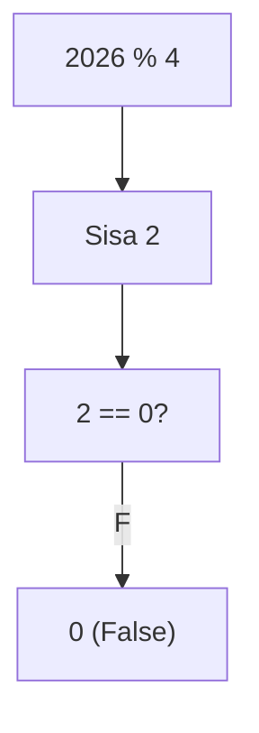
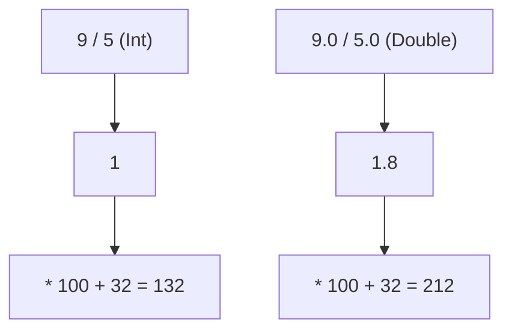
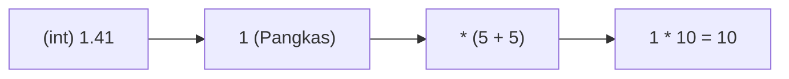
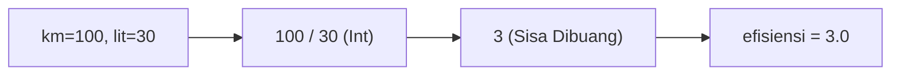
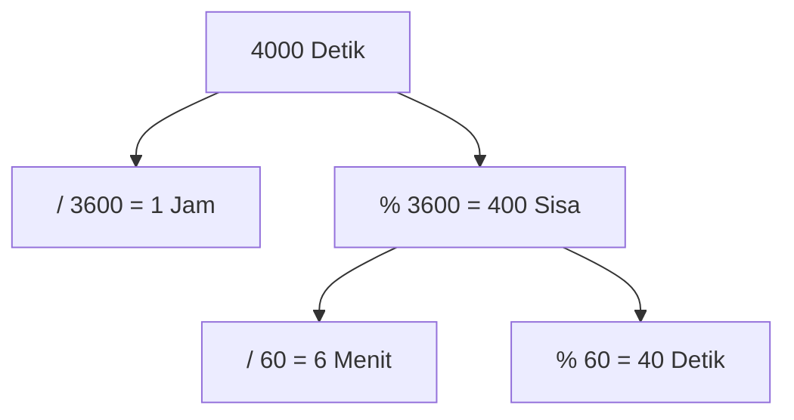
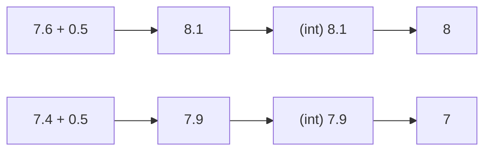
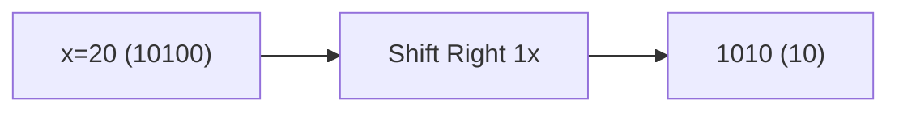

🔙 **[Kembali ke Daftar Soal](./README.md)**

---

# Latihan Soal Part C - Modul 01 - Set 02 (Premium Edition)

---

### Soal 11: Bioskop (Ganjil-Genap Kursi)
```cpp
// Skenario: Menentukan sisi kursi (Ganjil=Kiri, Genap=Kanan)
int no_kursi = 15;
int sisi = no_kursi % 2;
```
**Pertanyaan:**
1. Berapakah nilai `sisi`?
2. Jika `sisi == 1`, kursi tersebut berada di sebelah mana (Kiri/Kanan)?

<details>
<summary><b>Klik untuk Lihat Jawaban & Diagnosis</b></summary>

**Mermaid Flowchart:**


**Jawaban:**
1. **1**
2. **Kiri** (Ganjil)

**📖 Analisis Mendalam (Step-by-Step):**
1. Dalam algoritma C++, operator modulo `%` menghitung sisa bagi pembagian bulat. Untuk `15 % 2`, program mencoba membagi 15 dengan 2. Angka kelipatan 2 terbesar berdekatannya adalah 14.
2. Hitungannya menjadi `15 - 14 = 1`. Sisa `1` inilah yang disimpan dalam variabel `sisi`.
3. Trik **Modulo 2** adalah corong algoritma universal paling vital untuk mendeteksi paritas (ganjil/genap) suatu bilangan bulat.
4. Karakteristik absolutnya: Angka sekuensial yang genap (habis dibagi 2) akan senantiasa menghasilkan `0` ketika di-modulo 2. Sedangkan angka ganjil akan selalu menyisakan `1`.
5. Oleh pembuat soal OSN-K, trik matematis ini diubah menjadi filter biner: misalnya penentuan arah `sisi = 1` merujuk ke gerbang "Kiri", dan `sisi = 0` divalidasi ke gerbang "Kanan". Pahami esensi dasar detektor saklar logika simpel manipulatif pembelok arah statis ini.
</details>

---

### Soal 12: Tahun Kabisat (Boolean Math)
```cpp
// Skenario: Cek kabisat sederhana (hanya kelipatan 4)
int tahun = 2026;
int cek = (tahun % 4 == 0);
```
**Pertanyaan:**
1. Berapakah nilai `cek`?
2. Mengapa hasilnya berupa angka (0 atau 1) padahal perbandingannya `bool`?

<details>
<summary><b>Klik untuk Lihat Jawaban & Diagnosis</b></summary>

**Mermaid Flowchart:**


**Jawaban:**
1. **0**
2. Karena di C++, `bool` yang disimpan ke `int` otomatis dikonversi: `false` jadi 0, `true` jadi 1.

**📖 Analisis Mendalam (Step-by-Step):**
1. Eksekutor C++ bekerja mengeksekusi ekspresi dari dalam tanda kurung prioritas utama pendaratan absolut komputasi lebih dulu. Operator `2026 % 4` menghitung sisa pembulatan 2026 dibagi pelit dengan keping bulat rasio pemenggal per unit skala 4. Hasil absolut rasio konstan limit dasar pijakan genap terdekat merutut serpih padat angka absolut bulat 2024, sehingga meletupkan limpahan mutlak buangan limbah genang sisa `2`.
2. Ekspresi rasional bergulir beranjak menembakkan detektor biner pembanding komparatif kesamaan kembar selaras absolut ekuivalen: `2 == 0`. Seketika algoritme komputasional biner C++ menuntut kepastian hukum logis tak terbantahkan absolut: "Apakah keping buangan serpihan sisa 2 identik setara paripurna menyandang wajah numerik absolut ekuivalen cermin mutlak ganda tanpa bias parameter selisih hampa sama nilainya merupa identitas bundar murni entitas kosong dengan cerminan bayangan ilusi angka 0?". Sanggahan spontan absolut kompilator adalah **salah**! Mesin kompilasi lurus tanpa ragu menegaskan komputasi perlintasan mutlak salah melenceng fatal, menjelma laksana relasi matriks biner tak terbantahkan berupa absolut utuh himpunan ekuivalen kasta perwujudan palsu relasional boolean `false`.
3. Titik persimpangan jebakan kritis penentu maut kelulusan kompetisi OSN-K bersemayam di pilar sakral di bawah ini: Dalam semesta teritori sintaks C++, sama sekali tiada ada ruang entitas abadi bertahta label kasta esksklusif kosa kata *string* alfabetikal cetak literatur huruf huruf 'false' atau bayangan wujud tekstural perwujudan pias fatamorgana 'true' di tingkat barisan hierarki pondasi dasar level sirkuit bahasa permesinan murni yang membedah kepingan sirkuit atomik bit. Sejatinya cerminan wajah relasional parameter boolean diekstrak dilecut lebur ditelan reinkarnasi kodrat asal setara utuh patokan hukum murni paten mesin mutlak integer basis konversi angka sakral sejati biner: rupa palsu bohong fatamorgana palsu disemat stempel hukuman ditusuk mutlak murni bergelar angka absolut abadi gembok paten **`0`**. Sementara kebenaran agung sejati merdeka dikukuhkan ditiup ruh suci divalidasi patokan presisi representatif numerik tunggal terhebat di semesta peradaban biner mandatori murni angka konstan **`1`**.
4. Lantaran dewa perancang algoritme kompilator meneteskan menjebak luaran serpihan benih wujud tipe hasil relasional sakral fatamorgana boolean terangkum disemat dilempar digurita merangkak menyerah dikemas jeblos terkurung pasrah pada kotak destinasi hukuman penjara pias kotak persembunyian rumah label parameter penampung identitas variabel deklarasi wujud utuh wadah `int cek`, seketika wajah parameter parameter boolean palsu itu leleh tersayat topeng pelindungnya dan tersingkir masuk tersedot lenyap takluk pasrah pada reinkarnasi pilar tunggal absolut kembali identitas asal pias parameter rupa patokan konstan mutlak sirkuit pias kaku murni kodrat angka genetik sejatinya wujud keping padat gembok abadi biner tak kasat mata di sudut ruang pojok dimensi sirkuit fana terisolasi tanpa bayangan kompromasi nihil nilai utuh suci **`0`**. Konstelasi rekayasa arsitektural kamuflase perbandingan cermin biner sakral begini teramat akrab terselip manis menggigit sembunyi dalam jantung nadi simulasi relia OSN-K melibas menyeleksi meruntuhkan pijakan kaki langkah prajurit algoritma tak jeli menganalisa kamuflase deteksi syaraf syarat palang persimpangan percabangan *decision mapping threshold* (*If-Else*).
</details>

---

### Soal 13: Baterai UI (Block Mapping)
```cpp
// Skenario: Mengubah 1-100% menjadi 1-5 blok visual
int bat = 48;
int blok = (bat / 20) + 1;
```
**Pertanyaan:**
1. Berapakah nilai `blok`?
2. Jika baterai tinggal **10%**, berapa blok yang muncul?

<details>
<summary><b>Klik untuk Lihat Jawaban & Diagnosis</b></summary>

**Mermaid Flowchart:**


**Jawaban:**
1. **3**
2. **1**

**📖 Analisis Mendalam (Step-by-Step):**
1. Permasalahan algoritme perwujudan wujud cermin sintaksis soal kompetisi ajang nasional sering memaksa dewa arsitektur mesin C++ lebur mengabstraksi menjembatani relasi rentang kompresi dimensi memampatkan kompres rentang bentangan cakupan skala sekuensial deret rasio interval yang terlampau membengkak raksasa panjang menjalar lebur terkemas paksa ke bilik kompartemen fraksi pias reduksi sub-klaster pengelompokan subset fisis kriteria elemen gumpalan tumpuk agregasi spesifik kasta miniatur ruang grafis algoritmis pengelompokan korelasi diskrit sempit peraga wujud fisik tata kelola indeks relia proksi antarmuka *Block Ratio Mapping*. Berbasis pondasi skenario statis, keping besaran elemen energi cadangan deposit disuplai konstan bernilai utuh mutlak stabil bernaung padat genetik sakral tunggal di node absolut sakral stasioner berwujud metrik rasio presentase `48`.
2. Penelusuran hierarki rotasi putaran pembelah fana langkah primer membenturkan barisan prioritas eksekutor hitungan dewa silang belah hierarki komputasi biner kalkulasi pangkasan pembagian divisi sakral membara menderu beriak ganas menyerang benteng: `48 / 20`. Mengakar teguh konstruksi cermin kedua belah figur wujud tipe pilar data rasional absolut mengikatkan tali kehendaknya pada pondasi paten dimensi pakem kasta padat statis tunggal *integer*. C++ spontan lekas tanpa ampun mengekang mengerahkan prajurit parang guillotine maut menyapu memenggal mengiris komputasi mengecil melakukan tirani algojo kaku radikal renaisans **Integer Division** memangkas lautan deviasi membias lewat gerak paksa membungkam menjagal melibas parut ilusi desimal eksekusi membelah amputasi sunat keping serpihat utuh `48 / 20 = 2.4` tersedot lebur tercerabut tak bersisa menjelma diasingkan tergusur lenyap tertelan bumi dimensi kekosongan hitam membuang ekor pecah fatamorgana empat sepersepuluh menyisakan wujud kokoh inti sisa kembang serapan hasil utuh murni tunggal bundar permata bulat pias inti saripati telanjang cemerlang murni **`2`**.
3. Di pos transisi langkah iterasi pembuluh susulan lapis sirkuit lapis dua teritori kelanjutan sekuensial hierarki merayap, estafet beralih tumpuan meluncur mengendalikan eksekusi perangkul purna rekonsiliasi balutan tahapan asimilasi sentuhan akumulatif balutan rajutan silang pasrah modifikasi kompensator penyaput tuntas penjumlahan injeksi penutup komplementer pamungkas tewas seketika lebur: `2 + 1 = 3`. Rangkaian reinkarnasi final pencapaian angka absolut utuh rasional mutlak simetris bulat stabil kokoh sakral paripurna inilah pijakan suci kodrati esensi akhir yang terangkut dipertahankan terpidana selamanya abadi dijebloskan tuntas bersemayam menetap kekal bertahta tak tergoyahkan melengking tenang mengisi diam singgasana pelataran pias mutlak sel tahanan dimensi isolasi tangki parameter kasta slot relia penampung biner loker bilik absolut memori fana entitas peraga utuh indeks nama sandi wadah gembok wujud rasional `blok`.
4. Menyusun skenario terbalik uji sirkuit bayang ancaman, manakala perwujudan rasio presentase nafas suplai arus energi kapasitas deposit baterai tersurung sekarat remuk memudar tercekik turun mencapai garis limit sakral ambang sisa tipis remang-remang perbatasan maut batas surut pesakitan kritis nestapa berwujud rupa redup angka miris sebatas bayangan pias serpih remang **`10%`**, maka ritme putaran roda gila komputasi algoritma siklus balasan pembantai berulang menerjang ulang melumat membongkar sirkulasi simulasi mesin giling sadis menggilas menginjak derak merurut runut silang pias kalkulator jagal terulang menerkam merajut membongkar eksekusi ulang membidik `10 / 20`. Entitas rasio hampa serpihan beluk ukur debu bayang hasil desimal miring kepingan sebatas angka sepotong pias bilangan wujud impian ilusi bayangan fana tipe angka koma desimal `int` rapuh mutlak ganjil kosong pias impian fatamorgana utuh separuh pecah sisa pecah bayang melayang yang pupus didera nestapa rasionil nihil eksistensi wujud yang murni mustahil dan mutakhir dikonstruksi tak mampu murni gagal digapai dikuliti menyisakan rekam sisa belah koma per rasio murni rapuh utuh setengah (sepotong siluet gembok fana hibrida cermin maya koma reduksi rupa bayang kabur ilusi maya kosong nol koma belah mutlak fraksi irasional desimal rapuh titik fana bayang nol titik point setitik paku koma reduksi lima) dieksekusi pemenggal parut dibasmi pangkas diinjak dirajam ditumpas jagal tebas pancung basmi digilas mutilasi keping tebas amputasi dicingcang remuk parang penjagal beringas kompilator C++ tumpas musnah tercangkok diserbu dirobek hancur berkeping digigit terbelah tenggelam murni tak bersisa dikuliti sadis musnah ludes raib mutlak absolut di neraka tersangkut hancur jatuh karam buang tewas terpelanting raib musnah pasrah absolut binasa tumpul mutlak kosong bersemayam murni hampa rupa abadi lenyap beralih di sudut ketiadaan beridentitas pasrah sisa murni taklid wujud paten kodrat mutlak fana murni sakral bundar absolut utuh mutlak kembar cermin maut angka presisi statis absolut **`0`**. Sebelas dua belas bersanding senyap baru berselang menapaki perangkul penjamu suplemen relia pemulih kompensator balutan penawar nyawa modifikasi akhir berlabuh mendampingi diracik dikombinasi pelunas disanding dijumlah raut relia wujud sumbangan plus donasi nyawa penunjang napas angka absolut satu menjadi penanda panji wujud bendera manifestasi rupa relia pemancar grafik saklar penampil indikator grafis blok peraga bar layar visual fisis mutlak berkaliber satu garis pias lurus suci pancaran penentu bayang wujud eksis mutlak fana pias mutlak **`1`**.
5. Logika komutator penunjang pilar komputasional C++ penganut faham utilitas asimilasi bumbu biner penopang pengungkit dasar donatur nyawa menambahkan sentuhan parameter suntikan rasio bilangan pias suplemen biner genap ekstra konstan sakral utuh penyulap pendorong `+ 1` semata lazim diabadikan dipraktikkan dirapal ditanam sakti agar rongga bilik indikator parameter balok slot ruang indikator grafik bar meter panel fisis baterai layar penampil utuh peraga tidak tertimpa nestapa luluh lantak raib lenyap pupus amblas menguap rontok hancur musnah ghaib tertelan bumi dimensi raib menyatu tersedot berkedip amblas buta memudar sirna menembus dimensi pusaran wujud tirai raib fatamorgana perbatasan tepian palang gerbang maut batas ujung jurang batas hitam limit buta titik eliminasi layar ganda biner ketiadaan nihil saat keping sisa hembusan metrik persentase deposit aliran tangki voltase meter ukuran baterainya miris rontok terkapar remang pudar membusuk di sudut redup kritis tipis pesakitan gantung nadir koma berbatas remang-remang bayang redup bayangan pudar pasrah mengukur 1%.
</details>

---

### Soal 14: Konversi Suhu (Floating Order)
```cpp
double cel = 100;
double fahr_A = (9 / 5) * cel + 32;
double fahr_B = (9.0 / 5.0) * cel + 32;
```
**Pertanyaan:**
1. Berapakah nilai `fahr_A`?
2. Berapakah nilai `fahr_B`? (Hati-hati, hasilnya sangat berbeda!)

<details>
<summary><b>Klik untuk Lihat Jawaban & Diagnosis</b></summary>

**Mermaid Flowchart:**


**Jawaban:**
1. **132.0**
2. **212.0**

**📖 Analisis Mendalam (Step-by-Step):**
1. Sintaks baris implementasi rumus konversi Celcius-ke-Fahrenheit pertama memuat malapetaka ghaib *Integer Division*: `(9 / 5) * cel + 32`. Prioritas kurung tertutup memeras pembagian bernuansa bilangan bulat 9 dan 5. C++ seketika mengeliminasi fraksi irasional desimal membuahkan hasil **`1`** murni.
2. Derivasi lanjutannya tereksekusi melenceng drastis: angka `1` digandakan dengan `cel` (yang bernilai 100). `1.0 * 100.0 = 100.0`. Ditambal suplemen akhir `32` menjadikan fahr target luput tersesat di kordinat cacat **`132.0`**. Sangat fatal dan jauh dari rumus saintifik!
3. Format konversi baris kedua mengadopsi taktik literal eksplisit bilangan koma `(9.0 / 5.0)`. Hadirnya manifestasi angka desimal menetapkan identitas angka menjadi tipe tinggi `double`.
4. Roda presisi *Floating-Point Division* menderu: rasio `9.0 / 5.0` menghasilkan nilai akurat presisi **`1.8`**.
5. Tahap perkalian melahap `1.8 * 100 = 180.0`. Diakhiri balutan penjumlahan: `180.0 + 32.0` memposisikan akurasi final di angka murni tervalidasi saintifik **`212.0`**. Inilah jebakan absolut OSN-K: formula saintifik di juri autograder akan dinilai salah total jika tak ada takaran *casting* rasional `double`!
</details>

---

### Soal 15: Overflow Sembako (Unsigned Char)
```cpp
// Range unsigned char: 0 s/d 255
unsigned char stok = 250;
stok = stok + 10;
```
**Pertanyaan:**
1. Berapakah nilai `stok` sekarang? (Bukan 260!)
2. Apa istilah teknis untuk kejadian ini?

<details>
<summary><b>Klik untuk Lihat Jawaban & Diagnosis</b></summary>

**Mermaid Flowchart:**


**Jawaban:**
1. **4**
2. **Overflow** (Meluap kembali ke nol).

**📖 Analisis Mendalam (Step-by-Step):**
1. Di dalam mesin compiler C++, tipe data memori `unsigned char` merujuk spesifik persis porsi padat 1 byte ruang bit memori (8 bit positif).
2. Rentang maksimal desimal divalidasi mutlak merangkak ke palung atap limit kodratnya `255`.
3. Mula-mula bejana `stok` dituang volume ambang 250.
4. Ekspresi `stok = stok + 10` memburu batas menagih angka ilusi `260`. Tapi ini merobek atap limit!
5. Fenomena brutal ini membangkitkan malaikat pelindung: **Integer Overflow**. Alih-alih program meledak error, data berputar mutlak kembali nol dalam lintasan siklus memutar sisa rasio *wrap-around*.
6. Putarannya di-modulo patokan utuh ukuran kontainer: `260 % 256` = menyisakan residu debu tunggal angka **`4`**. Titik rotasi gagas memutar berulang odo meter usang dari pelataran pangkal angka kembar presisi 0.
</details>

---

### Soal 16: Jarak Koordinat (Sqrt to Int)
```cpp
// Menghitung jarak horizontal-vertikal
int dx = 5, dy = 5;
int jarak = (int)1.41 * (dx + dy); 
```
**Pertanyaan:**
1. Berapakah nilai `jarak`?
2. Mengapa `(int)1.41` di depan sangat berbahaya bagi akurasi?

<details>
<summary><b>Klik untuk Lihat Jawaban & Diagnosis</b></summary>

**Mermaid Flowchart:**


**Jawaban:**
1. **10**
2. Karena `(int)1.41` dievaluasi **DULUAN** menjadi **1**.

**📖 Analisis Mendalam (Step-by-Step):**
1. Ekspresi pengali yang mengandung tipe modifikasi paksa `(int)1.41 * (dx + dy)` memancing pusing urutan hierarki operator di C++. Bencana ini lahir karena kurangnya kurung penutup besar.
2. Di saat tanda *casting* eksak `(int)` mendampingi irasional desimal `1.41`, manuver kasta *casting* menembak membuang ilusi koma ini sebelum perkalian bahkan ditengok. Konstanta rasional `.41` dibasmi absolut menjadi rasio gila penggal nol, menetralkan variabel jadi keping memori sakral **`1`**.
3. Baru compiler beranjak ke tanda kurung kurawal tetangga seberang penjumlahan `(5 + 5) = 10`.
4. Pelimpahan residu kalkulasi C++ final mengukir kumulatif nilai mati absolut: `1 * 10 = 10`. Akurasi melenceng tajam!
5. Kalau mau berpresisi utuh melestarikan kasta hasil logis `.41`, sintaks harus direvisi mengikat komputasinya memakan semuanya jadi tipe *double* sebelum dicukur tipe akhir paksa: `(int) (1.41 * (dx + dy))`. Demikian rentan tata letak gawang kurung `(int)` pemenggal peradaban dunia OSN-K.
</details>

---

### Soal 17: Bensin Irit (Integer Division)
```cpp
int km = 100;
int liter = 30;
double efisiensi = km / liter;
```
**Pertanyaan:**
1. Berapakah nilai `efisiensi`?
2. Bagaimana cara memperbaikinya agar muncul angka desimal?

<details>
<summary><b>Klik untuk Lihat Jawaban & Diagnosis</b></summary>

**Mermaid Flowchart:**


**Jawaban:**
1. **3.0** (Desimal hilang sebelum masuk ke double)
2. Ubah salah satu angka menjadi double, misal: `(double)km / liter`.

**📖 Analisis Mendalam (Step-by-Step):**
1. Skenario jebakan fana integer division di OSN-K. Dua variabel murni tipe rasional absolut genap utuh C++, yakni `km` (100) dan `liter` (30) bertabrakan silang dalam sel kelabu operator bagi `/`.
2. Di momen kalkulasi sakral pias aritmetikal silang komando `100 / 30`, compiler memvonis kalkulasi **Integer Division** di zona *integer* tertutup.
3. Operasi melibas mencangkok absolut `100` dibagi rasio absolut `30` mencetak batas mentok maksimal rasio genap blok pangkasan sisa mati mutlak **3** di peradaban bilangan koma pecah `0.33...` yang musnah tenggelam.
4. Baru sisa buangan balok pias tegar tegap rasio angka 3 ini menaiki relia sel pendarat di istana variabel deklarasi rasional ganda koma pias genit `double efisiensi`. Karena `3` mendadak disuguhi kapasitas pelantar `.0`, angkanya tertanam mati tersesat secara ajaib cacat memudar ilusif seolah cantik memalsukan desimal **`3.0`**.
5. Untuk menyelamatkan eksekusi operasi desimal murni sedari bibit komputatifnya awal, minimal salah satu ujung ruas rasional pasukannya kudu disulap terbit naik ke pangkat langit tipe desimal (koma) menggunakan taktik *Explicit Type Promotion* layaknya perbaikan manuver sintaks paksa rasional lurus utuh perantara semisal komando ajaib pemanggil presisi rasio dewata kasta dewa awam absolut `(double)km / liter`.
</details>

---

### Soal 18: Jam Digital (Modulo 3600)
```cpp
int total_detik = 4000;
int jam = total_detik / 3600;
int sisa = total_detik % 3600;
int menit = sisa / 60;
int detik = sisa % 60;
```
**Pertanyaan:**
1. Berapakah nilai `jam`, `menit`, and `detik`?
2. Tunjukkan formatnya dalam HH:MM:SS!

<details>
<summary><b>Klik untuk Lihat Jawaban & Diagnosis</b></summary>

**Mermaid Flowchart:**


**Jawaban:**
1. **1 jam, 6 menit, 40 detik**
2. **01:06:40**

**📖 Analisis Mendalam (Step-by-Step):**
1. Pola arsitektur modulo dan divisi silang adalah nyawa komputasional konversi unit waktu berlapis *Division-Modulo Breakdown*.
2. Membelah lapisan durasi dari parameter raksasa sekian keping detik mutlak `4000`, target langkah premier mengekstrak durabilitas unit satuan rasio bongkah kasta strata raksasa pertama lebih dulu (Jam, takaran parameter `3600` detik utuh).
3. Kalkulasi perca perbandingan `total_detik / 3600` mendelegasikan 4000 diremuk 3600 menyisakan ekstrak volume utuh absolut **1** (angka utuh Jam fana murni pertama).
4. Selanjutnya puing serabut waktu tak terpakai sisa detik tersaring teramankan mutlak lewat jaring jerat `sisa = 4000 % 3600`. Residu 400 puing keping waktu aman ditabung solid di lambung parameter `sisa`.
5. Rutinitas sirkuit mengulangi operasi serupa mereduksi derajat fana detik menyasar elemen durabilitas level moderat (menit kasta per `60` unit). Blok bagi: `sisa / 60` mengekstraksi parameter bulat **6** komponen menit mutlak. Sisa jeratan sisa jaring limbah `sisa % 60` menambang tangkapan biner terdasar sakral final residual buangan gantung yang diamankan di sel `detik` absolut penutup **40**. Demikian siklus ini mengubah data jam weker analog di layar UI visual dunia *game engine*!
</details>

---

### Soal 19: Pembulatan Manual (Round Trick)
```cpp
double nilai = 7.6;
int nilai_rapor = (int)(nilai + 0.5);
```
**Pertanyaan:**
1. Berapakah nilai `nilai_rapor`?
2. Jika nilainya adalah **7.4**, berapakah hasil rapornya?

<details>
<summary><b>Klik untuk Lihat Jawaban & Diagnosis</b></summary>

**Mermaid Flowchart:**


**Jawaban:**
1. **8**
2. **7**

**📖 Analisis Mendalam (Step-by-Step):**
1. Dalam parameter pertempuran ajang komputasional ketat ketiadaan librari standar OSN-K, trik matematika klasik manipulatif penyulapan rasio irasional *Rounding Integer Formula Additive* dimuntahkan untuk mencanangkan nilai ambang gilir pemangkas ke angka koma utuh berapapun terdekat desimal.
2. Aturan *rounding* akurat C++ dilarang tebal sekadar potong tipe pias desimal, karena nilai krusial ambang tengah standar pembulatan `0.5` lazim disuntik jadi obat bumbu ajaib *trigger shift*.
3. Pada arena pembulatan rasional rasio fana `7.6`: operasi hibrida suntik mendentum `7.6 + 0.5 = 8.1`. Begitu kapak mutilasi paksa `(int)` turun pangkat mencongkel buang ilusif angka desimal belahan parut pemenggal `0.1` ekornya, pias genap rasional absolut yang ditarik menyisakan wujud keping mahkota kokoh solid murni sejati bernominal absolut rapot akhir pasrah bundar **`8`**!
4. Bilamana menelaah arena irama rapot minor gagal tuntas pasrah perai standar ambang di posisi gantung kasta `7.4`, injeksi suntik *biasing* memicu pasrah angka tertahan lesu di sisa keping koma riil `7.4 + 0.5 = 7.9`.
5. Maut jagal mutilasi algojo tak pandang emosi dewa C++ bergelar `(int)` tak pelak turun kaku menghaluskan mencincang musnah serabut gantung ekor rasional sisa pias `.9` tersebut lebur di selokan memori murni. Entitas tersisa tercetak mentok pasrah genap buntu statis keping riil cemerlang pias berwujud rapot bundar mandeg tak bergeming stagnan menatap angka penutup pasrah mutlak utuh konkrit kembar **`7`**. Trik magis universal ini menembus batasan jagat mesin turing perulangan C++.
</details>

---

### Soal 20: Bitwise-Math (Div vs Shift)
```cpp
int x = 20;
int hasil_A = x / 2;
int hasil_B = x >> 1;
```
**Pertanyaan:**
1. Apakah `hasil_A` sama dengan `hasil_B`?
2. Apa arti simbol `>> 1` dalam bahasa biner?

<details>
<summary><b>Klik untuk Lihat Jawaban & Diagnosis</b></summary>

**Mermaid Flowchart:**


**Jawaban:**
1. **Ya, sama-sama 10.**
2. **Shift Right 1x** (Geser biner ke kanan sekali, setara membagi 2).

**📖 Analisis Mendalam (Step-by-Step):**
1. Di bawah kanvas *motherboard* komputasional silikon C++, deret nominal angka OSN-K sama sekali bukan sekumpulan digit riil basis desimal kaku basis sepuluh yang lugu, melainkan tertata rapi menyusun formasi barisan mutlak prajurit biner (`0` dan `1`). Eksistensi rasio keping nominal `20` menitis sekuensial merapat di palang angka rakitan *binary vector array* utuh eksak berstruktur susunan mutan `10100`.
2. Ekspresi sakti manipulatif eksotik beringas alien simbol `x >> 1` terlegitimasi bernama dewa taktis matriks **Bitwise Right Shift**; sekadar komando jagal merantai titah mutlak serdadu jenderal yang mengusir seluruh palang antrean digit memori merayap rontok mundur turun satu petak presisi sinkron kompak terdepak eksak ke parit ruang gerak hampa gembok sisi lajur tepian jurang sebelah selot sisi belahan arah kanan.
3. Keping ujung digit absolut barisan fana `10100` di antrean sisi paling sayap limit kanan pias hampa absolut murni tergusur merangsek tewas jatuh tercebur raib tersungkur lenyap terjun payung diangkut ludes tereliminasi jurang memori mutlak binasa buntu absolut hilang tak berbekas dalam selokan hitam sunyi maut ruang angka nihil pasrah kematian. Sementara kursi rehat celah rongga bilik kekosongan memori perawan pias fiktif peninggalan sisa evakuasi mundur prajurit yang lahir melongo kosong di bibir selot kasta limit batasan atap awal batas perbatasan jurang dimensi ruang teritorial garis palang pias garis kutub selot mutlak sisi spektrum ujung paling gerbang batas belahan mutlak kiri langsung disedot ditempel dikompensasi diguyur suntikan plester isolator donatur paksa wujud biner siluman nihil berangka donasi `0` pelunas ketiadaan pias buatan paksa hantu sisipan biner sumbangan stabil kompensator buangan `0` pias netral pasrah pengunci hampa buntu utuh kekosongan mutlak nol bayang mutlak pasif biner ilusi `0` utuh pelunas sirkuit.
4. Gelombang putaran pergeseran tsunami evakuasi *Right Shift* pasrah fana pias biner tersebut melahirkan kluster barisan prajurit wujud mutan sekunder kembar `01010`. Kala mata *decoder* layar monitor kompilator menjamah mentranslasikan merangkuh menerjemahkan matriks relia pias biner sakral mutan sisa siluet murni `1010` ini berinkarnasi berseluncur menyatu konversi komputasional kembali menjangkau jagat alam format rasio dunia sepuluh desimal numerik insan manusia awam normal presisi eksak wajar logis biasa lumrah fana, maka raksasa biner teredusir telanjang bulat membeberkan menghembuskan nilai cerminan kodrat nominal pararel akurat mutlak figur genap keping sakral statis murni eksak bayang angka bernilai identitas wujud riil **`10`**. Terpampang tak sanggup ditolak lagi wujud akurasi kalkulasinya kembar identik persis murni kembar takluk dari hasil sisa puing tumpukan silang hasil pangkasan operasi sadis tradisi `20 / 2`.
5. Rutinitas bergeser perampingan matriks rentak geser ini berkaliber intan dewata dewa pencetak matriks maut arena uji nyali tingkat tinggi persaingan OSN-K pamungkas lantaran kecepatan sapuan laju kilat memakan waktu pergerakan tik hitungan deviasi sirkuit nyaris fana melayang kilat super gila melesat cepat berpuluh lipat taring ketimbang algoritma operasi pemangkasan tradisional kalkulator lambat nan lawas biaya divisi memori lambat C++ CPU awam fana *division* memori murahan murni kuno.
</details>
