🔙 **[Kembali ke Daftar Soal](./README.md)**

---

# Latihan Soal Part C - Modul 01 - Set 03

### Soal 51
```cpp
double saldo_bank = 42.10;
int uang_kertas = (int)saldo_bank;
```
**Pertanyaan:**
1. Berapakah hasil akhirnya?
2. Deskripsikan langkah robot compiler saat memproses kode ini!

**Jawaban & Diagnosis:**
1. **42**
2. Baca bagian 'Analisis Mendalam' di bawah.

**Mermaid Flowchart:**
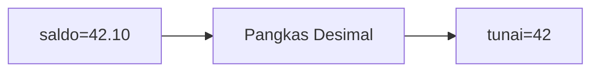

**📖 Penjelasan Komprehensif:**
**Analisis Mendalam (Compiler Manusia):**
1. **Gelas ke Laci**: `saldo_bank` adalah `double` (angka berkoma).
2. **Type Casting**: Perintah `(int)` secara paksa mengubahnya menjadi bilangan bulat.
3. **Efek**: Bagian desimal `42.10` menderita pelenyapan.
4. **Hasil Akhir**: `uang_kertas` berisi **42**.

---
### Soal 52
```cpp
int kelereng = 73;
int anak = 6;
int dapet_tiap_anak = kelereng / anak;
```
**Pertanyaan:**
1. Berapakah hasil akhirnya?
2. Deskripsikan langkah robot compiler saat memproses kode ini!

**Jawaban & Diagnosis:**
1. **12**
2. Baca bagian 'Analisis Mendalam' di bawah.

**Mermaid Flowchart:**
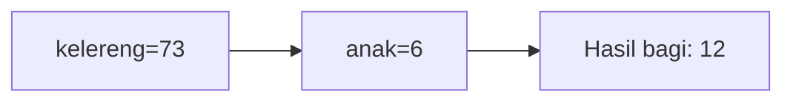

**📖 Penjelasan Komprehensif:**
**Analisis Mendalam (Compiler Manusia):**
1. **Inisialisasi**: Pak Dengklek punya `kelereng` sebanyak 73 dan ingin dibagi ke 6 `anak`.
2. **Operasi Pembagian**: Rumus `kelereng / anak` dijalankan. Secara matematis hasilnya 12.17.
3. **Hukum Tipe Data**: Karena hasilnya disimpan ke loker `int`, C++ membuang sisa 1 biji dan hanya mengambil bagian bulatnya.
4. **Hasil Akhir**: `dapet_tiap_anak` bernilai **12**.

---
### Soal 53
```cpp
int roti = 57;
int anak = 7;
int dapet_tiap_anak = roti / anak;
```
**Pertanyaan:**
1. Berapakah hasil akhirnya?
2. Deskripsikan langkah robot compiler saat memproses kode ini!

**Jawaban & Diagnosis:**
1. **8**
2. Baca bagian 'Analisis Mendalam' di bawah.

**Mermaid Flowchart:**
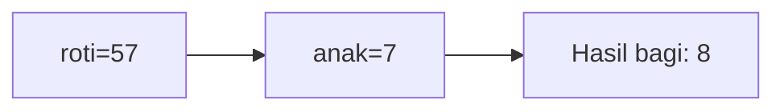

**📖 Penjelasan Komprehensif:**
**Analisis Mendalam (Compiler Manusia):**
1. **Inisialisasi**: Pak Dengklek punya `roti` sebanyak 57 dan ingin dibagi ke 7 `anak`.
2. **Operasi Pembagian**: Rumus `roti / anak` dijalankan. Secara matematis hasilnya 8.14.
3. **Hukum Tipe Data**: Karena hasilnya disimpan ke loker `int`, C++ membuang sisa 1 biji dan hanya mengambil bagian bulatnya.
4. **Hasil Akhir**: `dapet_tiap_anak` bernilai **8**.

---
### Soal 54
```cpp
double saldo_bank = 34.38;
int uang_kertas = (int)saldo_bank;
```
**Pertanyaan:**
1. Berapakah hasil akhirnya?
2. Deskripsikan langkah robot compiler saat memproses kode ini!

**Jawaban & Diagnosis:**
1. **34**
2. Baca bagian 'Analisis Mendalam' di bawah.

**Mermaid Flowchart:**
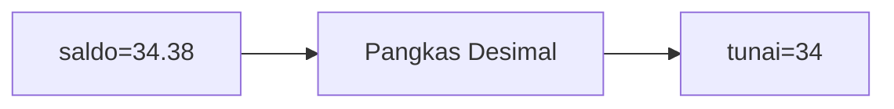

**📖 Penjelasan Komprehensif:**
**Analisis Mendalam (Compiler Manusia):**
1. **Gelas ke Laci**: `saldo_bank` adalah `double` (angka berkoma).
2. **Type Casting**: Perintah `(int)` secara paksa mengubahnya menjadi bilangan bulat.
3. **Efek**: Bagian desimal `34.38` menderita pelenyapan.
4. **Hasil Akhir**: `uang_kertas` berisi **34**.

---
### Soal 55
```cpp
char huruf_awal = 'X';
char kode_rahasia = huruf_awal + 3;
```
**Pertanyaan:**
1. Berapakah hasil akhirnya?
2. Deskripsikan langkah robot compiler saat memproses kode ini!

**Jawaban & Diagnosis:**
1. **[**
2. Baca bagian 'Analisis Mendalam' di bawah.

**Mermaid Flowchart:**
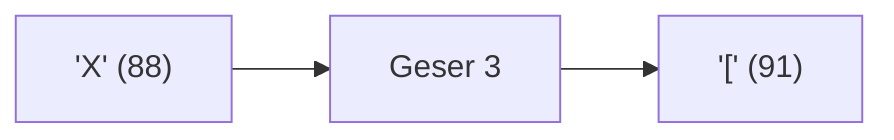

**📖 Penjelasan Komprehensif:**
**Analisis Mendalam (Compiler Manusia):**
1. **Batin Karakter**: Huruf 'X' memiliki nilai ASCII **88**.
2. **Operasi Geser**: Menambah huruf dengan angka akan menggeser posisinya di tabel ASCII: 88 + 3 = 91.
3. **Identitas Baru**: Angka 91 adalah identitas untuk huruf **'['**.
4. **Hasil Akhir**: `kode_rahasia` berisi **'['**.

---
### Soal 56
```cpp
double saldo_bank = 49.77;
int uang_kertas = (int)saldo_bank;
```
**Pertanyaan:**
1. Berapakah hasil akhirnya?
2. Deskripsikan langkah robot compiler saat memproses kode ini!

**Jawaban & Diagnosis:**
1. **49**
2. Baca bagian 'Analisis Mendalam' di bawah.

**Mermaid Flowchart:**
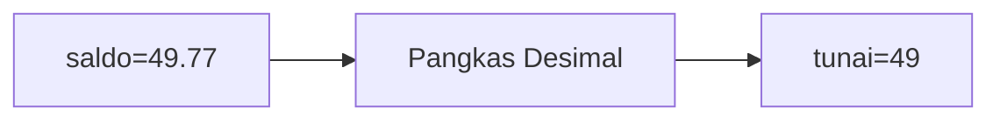

**📖 Penjelasan Komprehensif:**
**Analisis Mendalam (Compiler Manusia):**
1. **Gelas ke Laci**: `saldo_bank` adalah `double` (angka berkoma).
2. **Type Casting**: Perintah `(int)` secara paksa mengubahnya menjadi bilangan bulat.
3. **Efek**: Bagian desimal `49.77` menderita pelenyapan.
4. **Hasil Akhir**: `uang_kertas` berisi **49**.

---
### Soal 57
```cpp
int stok_buku = 48;
int rak = 4;
int sisa_buku = stok_buku % rak;
```
**Pertanyaan:**
1. Berapakah hasil akhirnya?
2. Deskripsikan langkah robot compiler saat memproses kode ini!

**Jawaban & Diagnosis:**
1. **0**
2. Baca bagian 'Analisis Mendalam' di bawah.

**Mermaid Flowchart:**
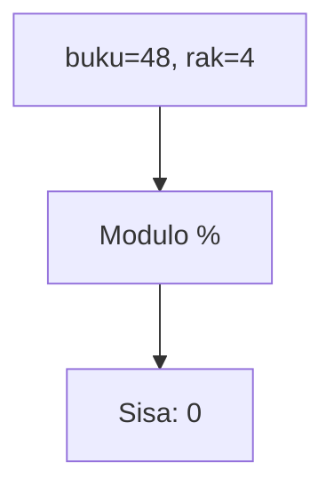

**📖 Penjelasan Komprehensif:**
**Analisis Mendalam (Compiler Manusia):**
1. **Konteks**: Menyusun 48 buku ke 4 rak secara merata.
2. **Mekanisme Modulo**: Operator `%` bukan menghitung hasil bagi, tapi sisa yang tidak muat masuk rak.
3. **Perhitungan**: 48 dibagi 4 sisa **0**.
4. **Hasil Akhir**: `sisa_buku` adalah **0**.

---
### Soal 58
```cpp
double saldo_bank = 22.38;
int uang_kertas = (int)saldo_bank;
```
**Pertanyaan:**
1. Berapakah hasil akhirnya?
2. Deskripsikan langkah robot compiler saat memproses kode ini!

**Jawaban & Diagnosis:**
1. **22**
2. Baca bagian 'Analisis Mendalam' di bawah.

**Mermaid Flowchart:**
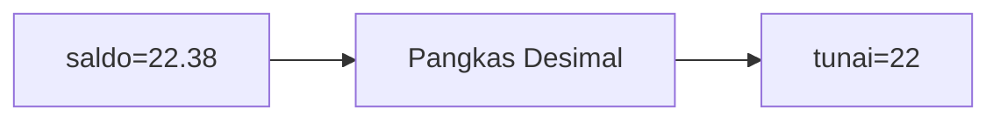

**📖 Penjelasan Komprehensif:**
**Analisis Mendalam (Compiler Manusia):**
1. **Gelas ke Laci**: `saldo_bank` adalah `double` (angka berkoma).
2. **Type Casting**: Perintah `(int)` secara paksa mengubahnya menjadi bilangan bulat.
3. **Efek**: Bagian desimal `22.38` menderita pelenyapan.
4. **Hasil Akhir**: `uang_kertas` berisi **22**.

---
### Soal 59
```cpp
char huruf_awal = 'B';
char kode_rahasia = huruf_awal + 3;
```
**Pertanyaan:**
1. Berapakah hasil akhirnya?
2. Deskripsikan langkah robot compiler saat memproses kode ini!

**Jawaban & Diagnosis:**
1. **E**
2. Baca bagian 'Analisis Mendalam' di bawah.

**Mermaid Flowchart:**
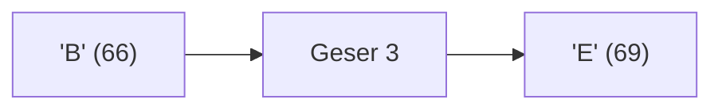

**📖 Penjelasan Komprehensif:**
**Analisis Mendalam (Compiler Manusia):**
1. **Batin Karakter**: Huruf 'B' memiliki nilai ASCII **66**.
2. **Operasi Geser**: Menambah huruf dengan angka akan menggeser posisinya di tabel ASCII: 66 + 3 = 69.
3. **Identitas Baru**: Angka 69 adalah identitas untuk huruf **'E'**.
4. **Hasil Akhir**: `kode_rahasia` berisi **'E'**.

---
### Soal 60
```cpp
int roti = 65;
int anak = 6;
int dapet_tiap_anak = roti / anak;
```
**Pertanyaan:**
1. Berapakah hasil akhirnya?
2. Deskripsikan langkah robot compiler saat memproses kode ini!

**Jawaban & Diagnosis:**
1. **10**
2. Baca bagian 'Analisis Mendalam' di bawah.

**Mermaid Flowchart:**
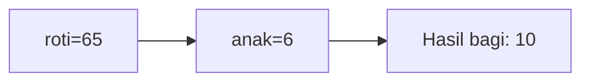

**📖 Penjelasan Komprehensif:**
**Analisis Mendalam (Compiler Manusia):**
1. **Inisialisasi**: Pak Dengklek punya `roti` sebanyak 65 dan ingin dibagi ke 6 `anak`.
2. **Operasi Pembagian**: Rumus `roti / anak` dijalankan. Secara matematis hasilnya 10.83.
3. **Hukum Tipe Data**: Karena hasilnya disimpan ke loker `int`, C++ membuang sisa 5 biji dan hanya mengambil bagian bulatnya.
4. **Hasil Akhir**: `dapet_tiap_anak` bernilai **10**.

---
### Soal 61
```cpp
int stok_buku = 72;
int rak = 7;
int sisa_buku = stok_buku % rak;
```
**Pertanyaan:**
1. Berapakah hasil akhirnya?
2. Deskripsikan langkah robot compiler saat memproses kode ini!

**Jawaban & Diagnosis:**
1. **2**
2. Baca bagian 'Analisis Mendalam' di bawah.

**Mermaid Flowchart:**


**📖 Penjelasan Komprehensif:**
**Analisis Mendalam (Compiler Manusia):**
1. **Konteks**: Menyusun 72 buku ke 7 rak secara merata.
2. **Mekanisme Modulo**: Operator `%` bukan menghitung hasil bagi, tapi sisa yang tidak muat masuk rak.
3. **Perhitungan**: 72 dibagi 7 sisa **2**.
4. **Hasil Akhir**: `sisa_buku` adalah **2**.

---
### Soal 62
```cpp
int stok_buku = 80;
int rak = 7;
int sisa_buku = stok_buku % rak;
```
**Pertanyaan:**
1. Berapakah hasil akhirnya?
2. Deskripsikan langkah robot compiler saat memproses kode ini!

**Jawaban & Diagnosis:**
1. **3**
2. Baca bagian 'Analisis Mendalam' di bawah.

**Mermaid Flowchart:**
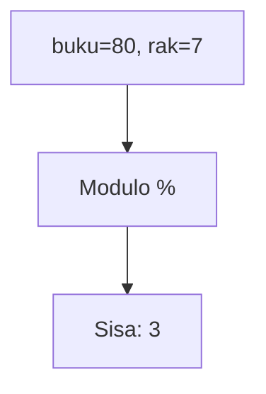

**📖 Penjelasan Komprehensif:**
**Analisis Mendalam (Compiler Manusia):**
1. **Konteks**: Menyusun 80 buku ke 7 rak secara merata.
2. **Mekanisme Modulo**: Operator `%` bukan menghitung hasil bagi, tapi sisa yang tidak muat masuk rak.
3. **Perhitungan**: 80 dibagi 7 sisa **3**.
4. **Hasil Akhir**: `sisa_buku` adalah **3**.

---
### Soal 63
```cpp
char huruf_awal = 'm';
char kode_rahasia = huruf_awal + 4;
```
**Pertanyaan:**
1. Berapakah hasil akhirnya?
2. Deskripsikan langkah robot compiler saat memproses kode ini!

**Jawaban & Diagnosis:**
1. **q**
2. Baca bagian 'Analisis Mendalam' di bawah.

**Mermaid Flowchart:**
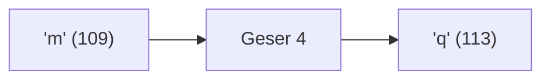

**📖 Penjelasan Komprehensif:**
**Analisis Mendalam (Compiler Manusia):**
1. **Batin Karakter**: Huruf 'm' memiliki nilai ASCII **109**.
2. **Operasi Geser**: Menambah huruf dengan angka akan menggeser posisinya di tabel ASCII: 109 + 4 = 113.
3. **Identitas Baru**: Angka 113 adalah identitas untuk huruf **'q'**.
4. **Hasil Akhir**: `kode_rahasia` berisi **'q'**.

---
### Soal 64
```cpp
int stok_buku = 56;
int rak = 4;
int sisa_buku = stok_buku % rak;
```
**Pertanyaan:**
1. Berapakah hasil akhirnya?
2. Deskripsikan langkah robot compiler saat memproses kode ini!

**Jawaban & Diagnosis:**
1. **0**
2. Baca bagian 'Analisis Mendalam' di bawah.

**Mermaid Flowchart:**


**📖 Penjelasan Komprehensif:**
**Analisis Mendalam (Compiler Manusia):**
1. **Konteks**: Menyusun 56 buku ke 4 rak secara merata.
2. **Mekanisme Modulo**: Operator `%` bukan menghitung hasil bagi, tapi sisa yang tidak muat masuk rak.
3. **Perhitungan**: 56 dibagi 4 sisa **0**.
4. **Hasil Akhir**: `sisa_buku` adalah **0**.

---
### Soal 65
```cpp
double saldo_bank = 15.63;
int uang_kertas = (int)saldo_bank;
```
**Pertanyaan:**
1. Berapakah hasil akhirnya?
2. Deskripsikan langkah robot compiler saat memproses kode ini!

**Jawaban & Diagnosis:**
1. **15**
2. Baca bagian 'Analisis Mendalam' di bawah.

**Mermaid Flowchart:**
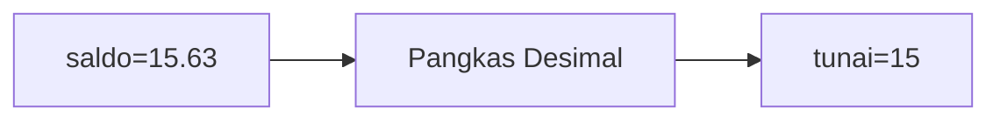

**📖 Penjelasan Komprehensif:**
**Analisis Mendalam (Compiler Manusia):**
1. **Gelas ke Laci**: `saldo_bank` adalah `double` (angka berkoma).
2. **Type Casting**: Perintah `(int)` secara paksa mengubahnya menjadi bilangan bulat.
3. **Efek**: Bagian desimal `15.63` menderita pelenyapan.
4. **Hasil Akhir**: `uang_kertas` berisi **15**.

---
### Soal 66
```cpp
int stok_buku = 30;
int rak = 7;
int sisa_buku = stok_buku % rak;
```
**Pertanyaan:**
1. Berapakah hasil akhirnya?
2. Deskripsikan langkah robot compiler saat memproses kode ini!

**Jawaban & Diagnosis:**
1. **2**
2. Baca bagian 'Analisis Mendalam' di bawah.

**Mermaid Flowchart:**
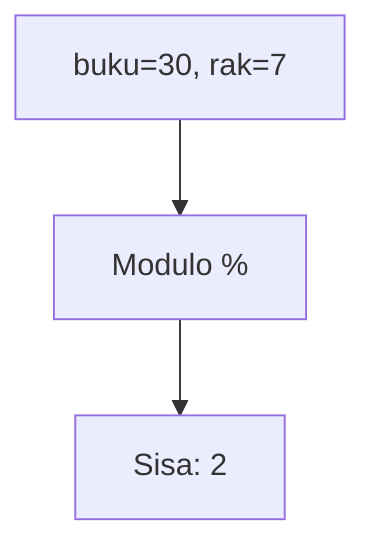

**📖 Penjelasan Komprehensif:**
**Analisis Mendalam (Compiler Manusia):**
1. **Konteks**: Menyusun 30 buku ke 7 rak secara merata.
2. **Mekanisme Modulo**: Operator `%` bukan menghitung hasil bagi, tapi sisa yang tidak muat masuk rak.
3. **Perhitungan**: 30 dibagi 7 sisa **2**.
4. **Hasil Akhir**: `sisa_buku` adalah **2**.

---
### Soal 67
```cpp
char huruf_awal = 'm';
char kode_rahasia = huruf_awal + 2;
```
**Pertanyaan:**
1. Berapakah hasil akhirnya?
2. Deskripsikan langkah robot compiler saat memproses kode ini!

**Jawaban & Diagnosis:**
1. **o**
2. Baca bagian 'Analisis Mendalam' di bawah.

**Mermaid Flowchart:**
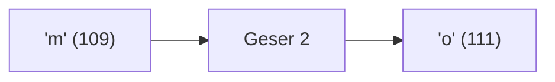

**📖 Penjelasan Komprehensif:**
**Analisis Mendalam (Compiler Manusia):**
1. **Batin Karakter**: Huruf 'm' memiliki nilai ASCII **109**.
2. **Operasi Geser**: Menambah huruf dengan angka akan menggeser posisinya di tabel ASCII: 109 + 2 = 111.
3. **Identitas Baru**: Angka 111 adalah identitas untuk huruf **'o'**.
4. **Hasil Akhir**: `kode_rahasia` berisi **'o'**.

---
### Soal 68
```cpp
double saldo_bank = 48.53;
int uang_kertas = (int)saldo_bank;
```
**Pertanyaan:**
1. Berapakah hasil akhirnya?
2. Deskripsikan langkah robot compiler saat memproses kode ini!

**Jawaban & Diagnosis:**
1. **48**
2. Baca bagian 'Analisis Mendalam' di bawah.

**Mermaid Flowchart:**


**📖 Penjelasan Komprehensif:**
**Analisis Mendalam (Compiler Manusia):**
1. **Gelas ke Laci**: `saldo_bank` adalah `double` (angka berkoma).
2. **Type Casting**: Perintah `(int)` secara paksa mengubahnya menjadi bilangan bulat.
3. **Efek**: Bagian desimal `48.53` menderita pelenyapan.
4. **Hasil Akhir**: `uang_kertas` berisi **48**.

---
### Soal 69
```cpp
char huruf_awal = 'm';
char kode_rahasia = huruf_awal + 4;
```
**Pertanyaan:**
1. Berapakah hasil akhirnya?
2. Deskripsikan langkah robot compiler saat memproses kode ini!

**Jawaban & Diagnosis:**
1. **q**
2. Baca bagian 'Analisis Mendalam' di bawah.

**Mermaid Flowchart:**


**📖 Penjelasan Komprehensif:**
**Analisis Mendalam (Compiler Manusia):**
1. **Batin Karakter**: Huruf 'm' memiliki nilai ASCII **109**.
2. **Operasi Geser**: Menambah huruf dengan angka akan menggeser posisinya di tabel ASCII: 109 + 4 = 113.
3. **Identitas Baru**: Angka 113 adalah identitas untuk huruf **'q'**.
4. **Hasil Akhir**: `kode_rahasia` berisi **'q'**.

---
### Soal 70
```cpp
double saldo_bank = 35.34;
int uang_kertas = (int)saldo_bank;
```
**Pertanyaan:**
1. Berapakah hasil akhirnya?
2. Deskripsikan langkah robot compiler saat memproses kode ini!

**Jawaban & Diagnosis:**
1. **35**
2. Baca bagian 'Analisis Mendalam' di bawah.

**Mermaid Flowchart:**
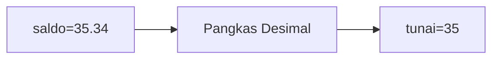

**📖 Penjelasan Komprehensif:**
**Analisis Mendalam (Compiler Manusia):**
1. **Gelas ke Laci**: `saldo_bank` adalah `double` (angka berkoma).
2. **Type Casting**: Perintah `(int)` secara paksa mengubahnya menjadi bilangan bulat.
3. **Efek**: Bagian desimal `35.34` menderita pelenyapan.
4. **Hasil Akhir**: `uang_kertas` berisi **35**.

---
### Soal 71
```cpp
char huruf_awal = 'B';
char kode_rahasia = huruf_awal + 1;
```
**Pertanyaan:**
1. Berapakah hasil akhirnya?
2. Deskripsikan langkah robot compiler saat memproses kode ini!

**Jawaban & Diagnosis:**
1. **C**
2. Baca bagian 'Analisis Mendalam' di bawah.

**Mermaid Flowchart:**
```mermaid
graph LR
A["'B' (66)"] --> B["Geser 1"]
B --> C["'C' (67)"]
```

**📖 Penjelasan Komprehensif:**
**Analisis Mendalam (Compiler Manusia):**
1. **Batin Karakter**: Huruf 'B' memiliki nilai ASCII **66**.
2. **Operasi Geser**: Menambah huruf dengan angka akan menggeser posisinya di tabel ASCII: 66 + 1 = 67.
3. **Identitas Baru**: Angka 67 adalah identitas untuk huruf **'C'**.
4. **Hasil Akhir**: `kode_rahasia` berisi **'C'**.

---
### Soal 72
```cpp
int kelereng = 29;
int anak = 2;
int dapet_tiap_anak = kelereng / anak;
```
**Pertanyaan:**
1. Berapakah hasil akhirnya?
2. Deskripsikan langkah robot compiler saat memproses kode ini!

**Jawaban & Diagnosis:**
1. **14**
2. Baca bagian 'Analisis Mendalam' di bawah.

**Mermaid Flowchart:**
```mermaid
graph LR
A["kelereng=29"] --> B["anak=2"]
B --> C["Hasil bagi: 14"]
```

**📖 Penjelasan Komprehensif:**
**Analisis Mendalam (Compiler Manusia):**
1. **Inisialisasi**: Pak Dengklek punya `kelereng` sebanyak 29 dan ingin dibagi ke 2 `anak`.
2. **Operasi Pembagian**: Rumus `kelereng / anak` dijalankan. Secara matematis hasilnya 14.50.
3. **Hukum Tipe Data**: Karena hasilnya disimpan ke loker `int`, C++ membuang sisa 1 biji dan hanya mengambil bagian bulatnya.
4. **Hasil Akhir**: `dapet_tiap_anak` bernilai **14**.

---
### Soal 73
```cpp
int kelereng = 58;
int anak = 7;
int dapet_tiap_anak = kelereng / anak;
```
**Pertanyaan:**
1. Berapakah hasil akhirnya?
2. Deskripsikan langkah robot compiler saat memproses kode ini!

**Jawaban & Diagnosis:**
1. **8**
2. Baca bagian 'Analisis Mendalam' di bawah.

**Mermaid Flowchart:**
```mermaid
graph LR
A["kelereng=58"] --> B["anak=7"]
B --> C["Hasil bagi: 8"]
```

**📖 Penjelasan Komprehensif:**
**Analisis Mendalam (Compiler Manusia):**
1. **Inisialisasi**: Pak Dengklek punya `kelereng` sebanyak 58 dan ingin dibagi ke 7 `anak`.
2. **Operasi Pembagian**: Rumus `kelereng / anak` dijalankan. Secara matematis hasilnya 8.29.
3. **Hukum Tipe Data**: Karena hasilnya disimpan ke loker `int`, C++ membuang sisa 2 biji dan hanya mengambil bagian bulatnya.
4. **Hasil Akhir**: `dapet_tiap_anak` bernilai **8**.

---
### Soal 74
```cpp
char huruf_awal = 'B';
char kode_rahasia = huruf_awal + 1;
```
**Pertanyaan:**
1. Berapakah hasil akhirnya?
2. Deskripsikan langkah robot compiler saat memproses kode ini!

**Jawaban & Diagnosis:**
1. **C**
2. Baca bagian 'Analisis Mendalam' di bawah.

**Mermaid Flowchart:**
```mermaid
graph LR
A["'B' (66)"] --> B["Geser 1"]
B --> C["'C' (67)"]
```

**📖 Penjelasan Komprehensif:**
**Analisis Mendalam (Compiler Manusia):**
1. **Batin Karakter**: Huruf 'B' memiliki nilai ASCII **66**.
2. **Operasi Geser**: Menambah huruf dengan angka akan menggeser posisinya di tabel ASCII: 66 + 1 = 67.
3. **Identitas Baru**: Angka 67 adalah identitas untuk huruf **'C'**.
4. **Hasil Akhir**: `kode_rahasia` berisi **'C'**.

---
### Soal 75
```cpp
double saldo_bank = 29.61;
int uang_kertas = (int)saldo_bank;
```
**Pertanyaan:**
1. Berapakah hasil akhirnya?
2. Deskripsikan langkah robot compiler saat memproses kode ini!

**Jawaban & Diagnosis:**
1. **29**
2. Baca bagian 'Analisis Mendalam' di bawah.

**Mermaid Flowchart:**
```mermaid
graph LR
A["saldo=29.61"] --> B["Pangkas Desimal"]
B --> C["tunai=29"]
```

**📖 Penjelasan Komprehensif:**
**Analisis Mendalam (Compiler Manusia):**
1. **Gelas ke Laci**: `saldo_bank` adalah `double` (angka berkoma).
2. **Type Casting**: Perintah `(int)` secara paksa mengubahnya menjadi bilangan bulat.
3. **Efek**: Bagian desimal `29.61` menderita pelenyapan.
4. **Hasil Akhir**: `uang_kertas` berisi **29**.

---
