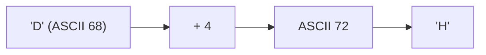
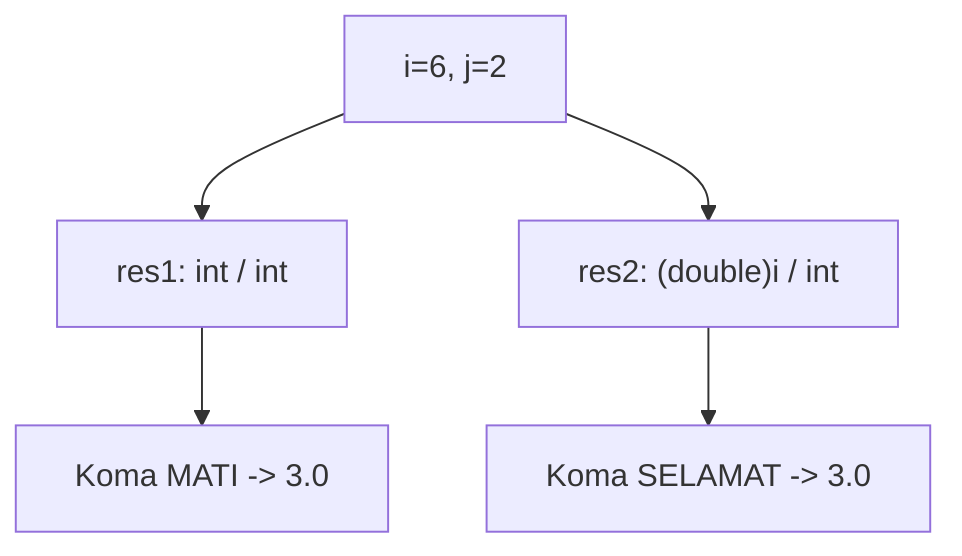
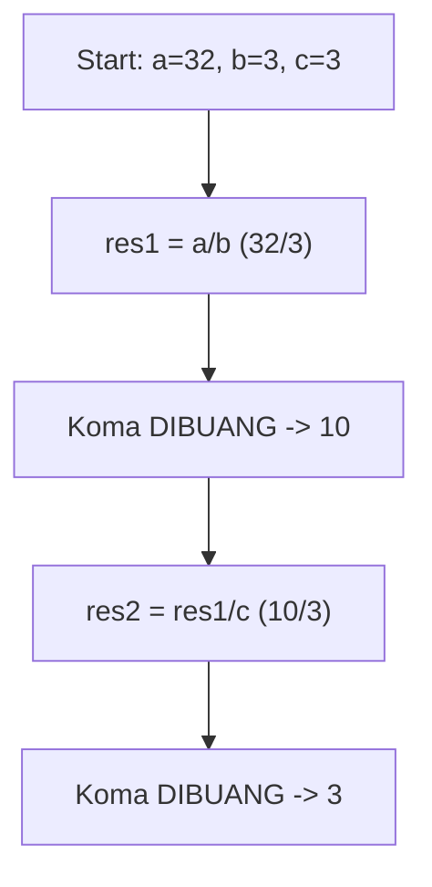
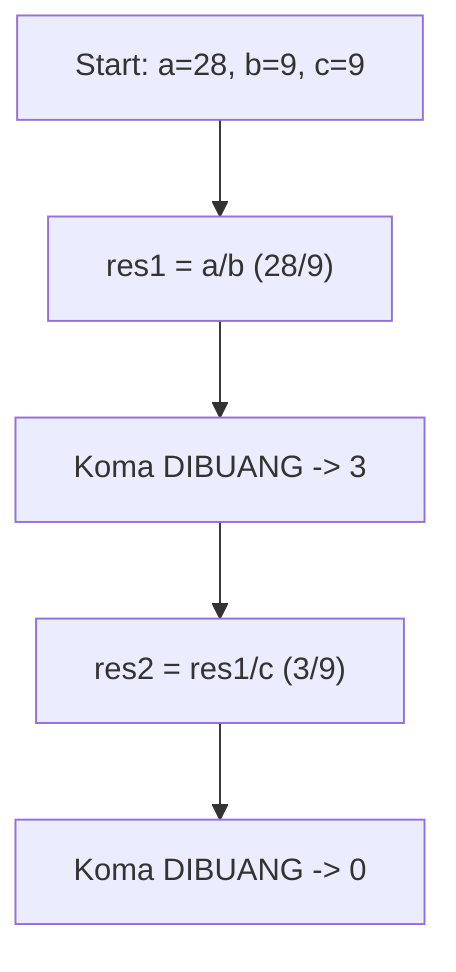
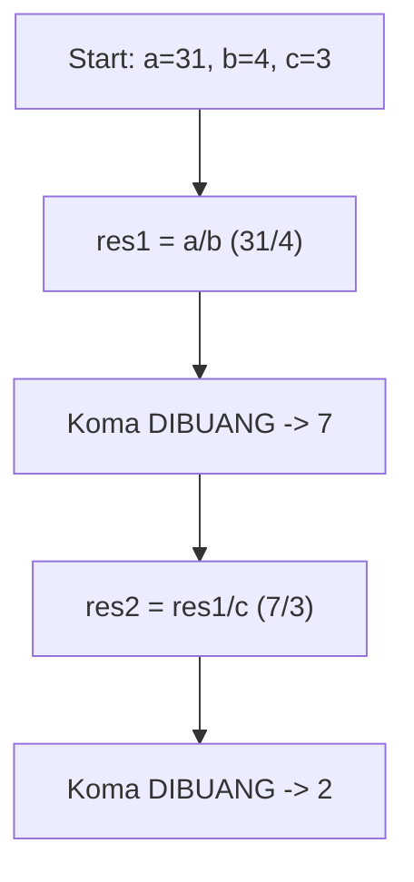
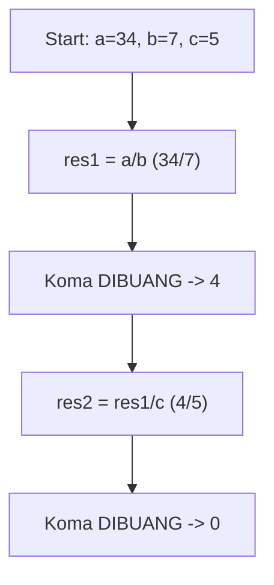
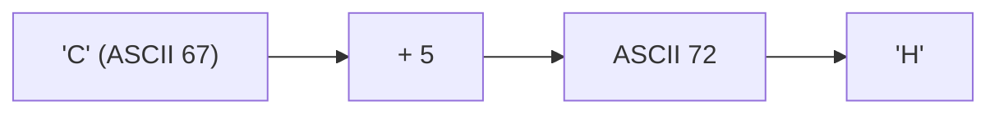
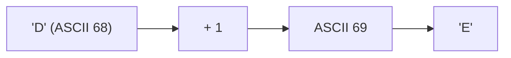
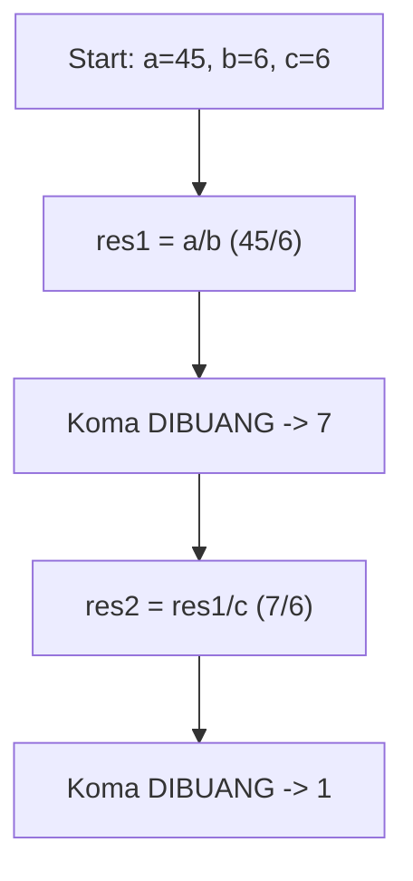
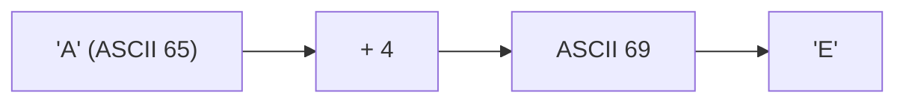

# Latihan Soal Part C - Modul 01 - Set 03

### Soal 51 (Modulo Magic)
```cpp
int x = 58;
int m1 = 2;
int m2 = 5;
int res_x = x % m1;
int res_y = x % m2;
```
**Pertanyaan:**
1. Apakah `x` genap atau ganjil?
2. Berapakah sisa bagi `x % m2`?
3. Apa guna operator `%` dalam OSN-K?

**Jawaban & Diagnosis:**
1. **Genap**
2. **3**
3. **Untuk mencari sisa bagi (sisa kelereng) atau mendeteksi pola perulangan/genap-ganjil.**

**Mermaid Flowchart:**
```mermaid
graph TD
    A[x=58] --> Bx % 2 == 0?
    B -- Ya --> C[Genap]
    B -- Tidak --> D[Ganjil]
    A --> E["x % 5"]
    E --> F["Sisa: 3"]
```

**📖 Cara Membaca Diagram:**
x=58. Cek `x % 2`: 58%2 = 0. Jika 0 genap, jika 1 ganjil. Cek `x % 5`: 58/5 = 11 sisa 3.

---
### Soal 52 (ASCII Math)
```cpp
char c = 'D';
int jump = 4;
char result = c + jump;
```
**Pertanyaan:**
1. Berapakah nilai ASCII batin dari 'D'?
2. Karakter apa yang tersimpan dalam variabel `result`?
3. Jika `result` dicetak sebagai `int`, angka berapa yang muncul?

**Jawaban & Diagnosis:**
1. **68**
2. **H**
3. **72**

**Mermaid Flowchart:**


**📖 Cara Membaca Diagram:**
Karakter 'D' punya kode batin ASCII 68. Ditambah 4 langkah menjadi 72. Kode 72 adalah huruf 'H'.

---
### Soal 53 (Casting War)
```cpp
int i = 6;
int j = 2;
double res1 = i / j;
double res2 = (double)i / j;
```
**Pertanyaan:**
1. Berapakah isi `res1`?
2. Berapakah isi `res2`?
3. Kenapa hasil `res1` dan `res2` berbeda padahal rumusnya mirip?

**Jawaban & Diagnosis:**
1. **3.0**
2. **3.0**
3. **Pada `res1`, pembagian terjadi antar `int` sehingga koma dibantai duluan sebelum masuk double. Pada `res2`, `i` dipaksa jadi `double` dulu, sehingga koma selamat.**

**Mermaid Flowchart:**


**📖 Cara Membaca Diagram:**
i=6, j=2. `res1`: 6/2 (int) = 3. Masuk double jadi 3.0. `res2`: (double)6 = 6.0. 6.0/2 = 3.0.

---
### Soal 54 (Modulo Magic)
```cpp
int x = 90;
int m1 = 2;
int m2 = 5;
int res_x = x % m1;
int res_y = x % m2;
```
**Pertanyaan:**
1. Apakah `x` genap atau ganjil?
2. Berapakah sisa bagi `x % m2`?
3. Apa guna operator `%` dalam OSN-K?

**Jawaban & Diagnosis:**
1. **Genap**
2. **0**
3. **Untuk mencari sisa bagi (sisa kelereng) atau mendeteksi pola perulangan/genap-ganjil.**

**Mermaid Flowchart:**
```mermaid
graph TD
    A[x=90] --> Bx % 2 == 0?
    B -- Ya --> C[Genap]
    B -- Tidak --> D[Ganjil]
    A --> E["x % 5"]
    E --> F["Sisa: 0"]
```

**📖 Cara Membaca Diagram:**
x=90. Cek `x % 2`: 90%2 = 0. Jika 0 genap, jika 1 ganjil. Cek `x % 5`: 90/5 = 18 sisa 0.

---
### Soal 55 (Integer Division)
```cpp
int a = 32;
int b = 3;
int c = 3;
int res1 = a / b;
int res2 = res1 / c;
```
**Pertanyaan:**
1. Berapakah nilai `res1`?
2. Berapakah nilai `res2`?
3. Mengapa `res1` tidak menghasilkan angka desimal?

**Jawaban & Diagnosis:**
1. **10**
2. **3**
3. **Karena tipe datanya `int`, setiap ada koma di belakangnya langsung dipangkas habis (Integer Division).**

**Mermaid Flowchart:**


**📖 Cara Membaca Diagram:**
Mulai: a=32, b=3, c=3. Di baris `res1 = a / b`, 32/3 = 10.67, tapi karena `int`, koma dibakar jadi 10. Lalu 10/3 = 3.33, dibakar lagi jadi 3.

---
### Soal 56 (Integer Division)
```cpp
int a = 28;
int b = 9;
int c = 9;
int res1 = a / b;
int res2 = res1 / c;
```
**Pertanyaan:**
1. Berapakah nilai `res1`?
2. Berapakah nilai `res2`?
3. Mengapa `res1` tidak menghasilkan angka desimal?

**Jawaban & Diagnosis:**
1. **3**
2. **0**
3. **Karena tipe datanya `int`, setiap ada koma di belakangnya langsung dipangkas habis (Integer Division).**

**Mermaid Flowchart:**


**📖 Cara Membaca Diagram:**
Mulai: a=28, b=9, c=9. Di baris `res1 = a / b`, 28/9 = 3.11, tapi karena `int`, koma dibakar jadi 3. Lalu 3/9 = 0.33, dibakar lagi jadi 0.

---
### Soal 57 (Casting War)
```cpp
int i = 9;
int j = 2;
double res1 = i / j;
double res2 = (double)i / j;
```
**Pertanyaan:**
1. Berapakah isi `res1`?
2. Berapakah isi `res2`?
3. Kenapa hasil `res1` dan `res2` berbeda padahal rumusnya mirip?

**Jawaban & Diagnosis:**
1. **4.0**
2. **4.5**
3. **Pada `res1`, pembagian terjadi antar `int` sehingga koma dibantai duluan sebelum masuk double. Pada `res2`, `i` dipaksa jadi `double` dulu, sehingga koma selamat.**

**Mermaid Flowchart:**


**📖 Cara Membaca Diagram:**
i=9, j=2. `res1`: 9/2 (int) = 4. Masuk double jadi 4.0. `res2`: (double)9 = 9.0. 9.0/2 = 4.5.

---
### Soal 58 (Integer Division)
```cpp
int a = 31;
int b = 4;
int c = 3;
int res1 = a / b;
int res2 = res1 / c;
```
**Pertanyaan:**
1. Berapakah nilai `res1`?
2. Berapakah nilai `res2`?
3. Mengapa `res1` tidak menghasilkan angka desimal?

**Jawaban & Diagnosis:**
1. **7**
2. **2**
3. **Karena tipe datanya `int`, setiap ada koma di belakangnya langsung dipangkas habis (Integer Division).**

**Mermaid Flowchart:**


**📖 Cara Membaca Diagram:**
Mulai: a=31, b=4, c=3. Di baris `res1 = a / b`, 31/4 = 7.75, tapi karena `int`, koma dibakar jadi 7. Lalu 7/3 = 2.33, dibakar lagi jadi 2.

---
### Soal 59 (Integer Division)
```cpp
int a = 34;
int b = 7;
int c = 5;
int res1 = a / b;
int res2 = res1 / c;
```
**Pertanyaan:**
1. Berapakah nilai `res1`?
2. Berapakah nilai `res2`?
3. Mengapa `res1` tidak menghasilkan angka desimal?

**Jawaban & Diagnosis:**
1. **4**
2. **0**
3. **Karena tipe datanya `int`, setiap ada koma di belakangnya langsung dipangkas habis (Integer Division).**

**Mermaid Flowchart:**


**📖 Cara Membaca Diagram:**
Mulai: a=34, b=7, c=5. Di baris `res1 = a / b`, 34/7 = 4.86, tapi karena `int`, koma dibakar jadi 4. Lalu 4/5 = 0.80, dibakar lagi jadi 0.

---
### Soal 60 (Casting War)
```cpp
int i = 5;
int j = 2;
double res1 = i / j;
double res2 = (double)i / j;
```
**Pertanyaan:**
1. Berapakah isi `res1`?
2. Berapakah isi `res2`?
3. Kenapa hasil `res1` dan `res2` berbeda padahal rumusnya mirip?

**Jawaban & Diagnosis:**
1. **2.0**
2. **2.5**
3. **Pada `res1`, pembagian terjadi antar `int` sehingga koma dibantai duluan sebelum masuk double. Pada `res2`, `i` dipaksa jadi `double` dulu, sehingga koma selamat.**

**Mermaid Flowchart:**


**📖 Cara Membaca Diagram:**
i=5, j=2. `res1`: 5/2 (int) = 2. Masuk double jadi 2.0. `res2`: (double)5 = 5.0. 5.0/2 = 2.5.

---
### Soal 61 (ASCII Math)
```cpp
char c = 'C';
int jump = 5;
char result = c + jump;
```
**Pertanyaan:**
1. Berapakah nilai ASCII batin dari 'C'?
2. Karakter apa yang tersimpan dalam variabel `result`?
3. Jika `result` dicetak sebagai `int`, angka berapa yang muncul?

**Jawaban & Diagnosis:**
1. **67**
2. **H**
3. **72**

**Mermaid Flowchart:**


**📖 Cara Membaca Diagram:**
Karakter 'C' punya kode batin ASCII 67. Ditambah 5 langkah menjadi 72. Kode 72 adalah huruf 'H'.

---
### Soal 62 (ASCII Math)
```cpp
char c = 'D';
int jump = 1;
char result = c + jump;
```
**Pertanyaan:**
1. Berapakah nilai ASCII batin dari 'D'?
2. Karakter apa yang tersimpan dalam variabel `result`?
3. Jika `result` dicetak sebagai `int`, angka berapa yang muncul?

**Jawaban & Diagnosis:**
1. **68**
2. **E**
3. **69**

**Mermaid Flowchart:**


**📖 Cara Membaca Diagram:**
Karakter 'D' punya kode batin ASCII 68. Ditambah 1 langkah menjadi 69. Kode 69 adalah huruf 'E'.

---
### Soal 63 (Modulo Magic)
```cpp
int x = 45;
int m1 = 2;
int m2 = 5;
int res_x = x % m1;
int res_y = x % m2;
```
**Pertanyaan:**
1. Apakah `x` genap atau ganjil?
2. Berapakah sisa bagi `x % m2`?
3. Apa guna operator `%` dalam OSN-K?

**Jawaban & Diagnosis:**
1. **Ganjil**
2. **0**
3. **Untuk mencari sisa bagi (sisa kelereng) atau mendeteksi pola perulangan/genap-ganjil.**

**Mermaid Flowchart:**
```mermaid
graph TD
    A[x=45] --> Bx % 2 == 0?
    B -- Ya --> C[Genap]
    B -- Tidak --> D[Ganjil]
    A --> E["x % 5"]
    E --> F["Sisa: 0"]
```

**📖 Cara Membaca Diagram:**
x=45. Cek `x % 2`: 45%2 = 1. Jika 0 genap, jika 1 ganjil. Cek `x % 5`: 45/5 = 9 sisa 0.

---
### Soal 64 (Modulo Magic)
```cpp
int x = 54;
int m1 = 2;
int m2 = 5;
int res_x = x % m1;
int res_y = x % m2;
```
**Pertanyaan:**
1. Apakah `x` genap atau ganjil?
2. Berapakah sisa bagi `x % m2`?
3. Apa guna operator `%` dalam OSN-K?

**Jawaban & Diagnosis:**
1. **Genap**
2. **4**
3. **Untuk mencari sisa bagi (sisa kelereng) atau mendeteksi pola perulangan/genap-ganjil.**

**Mermaid Flowchart:**
```mermaid
graph TD
    A[x=54] --> Bx % 2 == 0?
    B -- Ya --> C[Genap]
    B -- Tidak --> D[Ganjil]
    A --> E["x % 5"]
    E --> F["Sisa: 4"]
```

**📖 Cara Membaca Diagram:**
x=54. Cek `x % 2`: 54%2 = 0. Jika 0 genap, jika 1 ganjil. Cek `x % 5`: 54/5 = 10 sisa 4.

---
### Soal 65 (Integer Division)
```cpp
int a = 45;
int b = 6;
int c = 6;
int res1 = a / b;
int res2 = res1 / c;
```
**Pertanyaan:**
1. Berapakah nilai `res1`?
2. Berapakah nilai `res2`?
3. Mengapa `res1` tidak menghasilkan angka desimal?

**Jawaban & Diagnosis:**
1. **7**
2. **1**
3. **Karena tipe datanya `int`, setiap ada koma di belakangnya langsung dipangkas habis (Integer Division).**

**Mermaid Flowchart:**


**📖 Cara Membaca Diagram:**
Mulai: a=45, b=6, c=6. Di baris `res1 = a / b`, 45/6 = 7.50, tapi karena `int`, koma dibakar jadi 7. Lalu 7/6 = 1.17, dibakar lagi jadi 1.

---
### Soal 66 (ASCII Math)
```cpp
char c = 'A';
int jump = 4;
char result = c + jump;
```
**Pertanyaan:**
1. Berapakah nilai ASCII batin dari 'A'?
2. Karakter apa yang tersimpan dalam variabel `result`?
3. Jika `result` dicetak sebagai `int`, angka berapa yang muncul?

**Jawaban & Diagnosis:**
1. **65**
2. **E**
3. **69**

**Mermaid Flowchart:**


**📖 Cara Membaca Diagram:**
Karakter 'A' punya kode batin ASCII 65. Ditambah 4 langkah menjadi 69. Kode 69 adalah huruf 'E'.

---
### Soal 67 (Casting War)
```cpp
int i = 7;
int j = 2;
double res1 = i / j;
double res2 = (double)i / j;
```
**Pertanyaan:**
1. Berapakah isi `res1`?
2. Berapakah isi `res2`?
3. Kenapa hasil `res1` dan `res2` berbeda padahal rumusnya mirip?

**Jawaban & Diagnosis:**
1. **3.0**
2. **3.5**
3. **Pada `res1`, pembagian terjadi antar `int` sehingga koma dibantai duluan sebelum masuk double. Pada `res2`, `i` dipaksa jadi `double` dulu, sehingga koma selamat.**

**Mermaid Flowchart:**


**📖 Cara Membaca Diagram:**
i=7, j=2. `res1`: 7/2 (int) = 3. Masuk double jadi 3.0. `res2`: (double)7 = 7.0. 7.0/2 = 3.5.

---
### Soal 68 (Modulo Magic)
```cpp
int x = 84;
int m1 = 2;
int m2 = 5;
int res_x = x % m1;
int res_y = x % m2;
```
**Pertanyaan:**
1. Apakah `x` genap atau ganjil?
2. Berapakah sisa bagi `x % m2`?
3. Apa guna operator `%` dalam OSN-K?

**Jawaban & Diagnosis:**
1. **Genap**
2. **4**
3. **Untuk mencari sisa bagi (sisa kelereng) atau mendeteksi pola perulangan/genap-ganjil.**

**Mermaid Flowchart:**
```mermaid
graph TD
    A[x=84] --> Bx % 2 == 0?
    B -- Ya --> C[Genap]
    B -- Tidak --> D[Ganjil]
    A --> E["x % 5"]
    E --> F["Sisa: 4"]
```

**📖 Cara Membaca Diagram:**
x=84. Cek `x % 2`: 84%2 = 0. Jika 0 genap, jika 1 ganjil. Cek `x % 5`: 84/5 = 16 sisa 4.

---
### Soal 69 (Integer Division)
```cpp
int a = 42;
int b = 4;
int c = 2;
int res1 = a / b;
int res2 = res1 / c;
```
**Pertanyaan:**
1. Berapakah nilai `res1`?
2. Berapakah nilai `res2`?
3. Mengapa `res1` tidak menghasilkan angka desimal?

**Jawaban & Diagnosis:**
1. **10**
2. **5**
3. **Karena tipe datanya `int`, setiap ada koma di belakangnya langsung dipangkas habis (Integer Division).**

**Mermaid Flowchart:**


**📖 Cara Membaca Diagram:**
Mulai: a=42, b=4, c=2. Di baris `res1 = a / b`, 42/4 = 10.50, tapi karena `int`, koma dibakar jadi 10. Lalu 10/2 = 5.00, dibakar lagi jadi 5.

---
### Soal 70 (Modulo Magic)
```cpp
int x = 23;
int m1 = 2;
int m2 = 5;
int res_x = x % m1;
int res_y = x % m2;
```
**Pertanyaan:**
1. Apakah `x` genap atau ganjil?
2. Berapakah sisa bagi `x % m2`?
3. Apa guna operator `%` dalam OSN-K?

**Jawaban & Diagnosis:**
1. **Ganjil**
2. **3**
3. **Untuk mencari sisa bagi (sisa kelereng) atau mendeteksi pola perulangan/genap-ganjil.**

**Mermaid Flowchart:**
```mermaid
graph TD
    A[x=23] --> Bx % 2 == 0?
    B -- Ya --> C[Genap]
    B -- Tidak --> D[Ganjil]
    A --> E["x % 5"]
    E --> F["Sisa: 3"]
```

**📖 Cara Membaca Diagram:**
x=23. Cek `x % 2`: 23%2 = 1. Jika 0 genap, jika 1 ganjil. Cek `x % 5`: 23/5 = 4 sisa 3.

---
### Soal 71 (Integer Division)
```cpp
int a = 41;
int b = 7;
int c = 5;
int res1 = a / b;
int res2 = res1 / c;
```
**Pertanyaan:**
1. Berapakah nilai `res1`?
2. Berapakah nilai `res2`?
3. Mengapa `res1` tidak menghasilkan angka desimal?

**Jawaban & Diagnosis:**
1. **5**
2. **1**
3. **Karena tipe datanya `int`, setiap ada koma di belakangnya langsung dipangkas habis (Integer Division).**

**Mermaid Flowchart:**
```mermaid
graph TD
    A[Start: a=41, b=7, c=5] --> B["res1 = a/b (41/7)"]
    B --> C["Koma DIBUANG -> 5"]
    C --> D["res2 = res1/c (5/5)"]
    D --> E["Koma DIBUANG -> 1"]
```

**📖 Cara Membaca Diagram:**
Mulai: a=41, b=7, c=5. Di baris `res1 = a / b`, 41/7 = 5.86, tapi karena `int`, koma dibakar jadi 5. Lalu 5/5 = 1.00, dibakar lagi jadi 1.

---
### Soal 72 (ASCII Math)
```cpp
char c = 'D';
int jump = 1;
char result = c + jump;
```
**Pertanyaan:**
1. Berapakah nilai ASCII batin dari 'D'?
2. Karakter apa yang tersimpan dalam variabel `result`?
3. Jika `result` dicetak sebagai `int`, angka berapa yang muncul?

**Jawaban & Diagnosis:**
1. **68**
2. **E**
3. **69**

**Mermaid Flowchart:**
```mermaid
graph LR
    A["'D' (ASCII 68)"] --> B["+ 1"]
    B --> C["ASCII 69"]
    C --> D["'E'"]
```

**📖 Cara Membaca Diagram:**
Karakter 'D' punya kode batin ASCII 68. Ditambah 1 langkah menjadi 69. Kode 69 adalah huruf 'E'.

---
### Soal 73 (ASCII Math)
```cpp
char c = 'D';
int jump = 4;
char result = c + jump;
```
**Pertanyaan:**
1. Berapakah nilai ASCII batin dari 'D'?
2. Karakter apa yang tersimpan dalam variabel `result`?
3. Jika `result` dicetak sebagai `int`, angka berapa yang muncul?

**Jawaban & Diagnosis:**
1. **68**
2. **H**
3. **72**

**Mermaid Flowchart:**
```mermaid
graph LR
    A["'D' (ASCII 68)"] --> B["+ 4"]
    B --> C["ASCII 72"]
    C --> D["'H'"]
```

**📖 Cara Membaca Diagram:**
Karakter 'D' punya kode batin ASCII 68. Ditambah 4 langkah menjadi 72. Kode 72 adalah huruf 'H'.

---
### Soal 74 (Modulo Magic)
```cpp
int x = 96;
int m1 = 2;
int m2 = 5;
int res_x = x % m1;
int res_y = x % m2;
```
**Pertanyaan:**
1. Apakah `x` genap atau ganjil?
2. Berapakah sisa bagi `x % m2`?
3. Apa guna operator `%` dalam OSN-K?

**Jawaban & Diagnosis:**
1. **Genap**
2. **1**
3. **Untuk mencari sisa bagi (sisa kelereng) atau mendeteksi pola perulangan/genap-ganjil.**

**Mermaid Flowchart:**
```mermaid
graph TD
    A[x=96] --> Bx % 2 == 0?
    B -- Ya --> C[Genap]
    B -- Tidak --> D[Ganjil]
    A --> E["x % 5"]
    E --> F["Sisa: 1"]
```

**📖 Cara Membaca Diagram:**
x=96. Cek `x % 2`: 96%2 = 0. Jika 0 genap, jika 1 ganjil. Cek `x % 5`: 96/5 = 19 sisa 1.

---
### Soal 75 (ASCII Math)
```cpp
char c = 'E';
int jump = 3;
char result = c + jump;
```
**Pertanyaan:**
1. Berapakah nilai ASCII batin dari 'E'?
2. Karakter apa yang tersimpan dalam variabel `result`?
3. Jika `result` dicetak sebagai `int`, angka berapa yang muncul?

**Jawaban & Diagnosis:**
1. **69**
2. **H**
3. **72**

**Mermaid Flowchart:**
```mermaid
graph LR
    A["'E' (ASCII 69)"] --> B["+ 3"]
    B --> C["ASCII 72"]
    C --> D["'H'"]
```

**📖 Cara Membaca Diagram:**
Karakter 'E' punya kode batin ASCII 69. Ditambah 3 langkah menjadi 72. Kode 72 adalah huruf 'H'.

---
