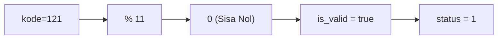
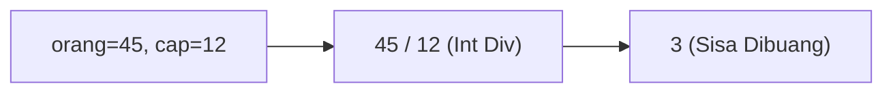
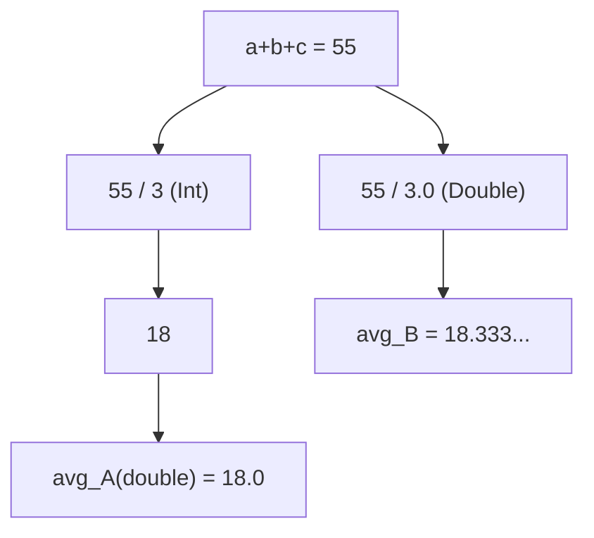
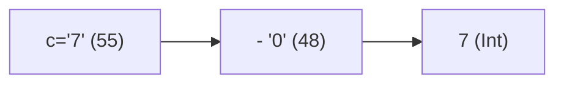
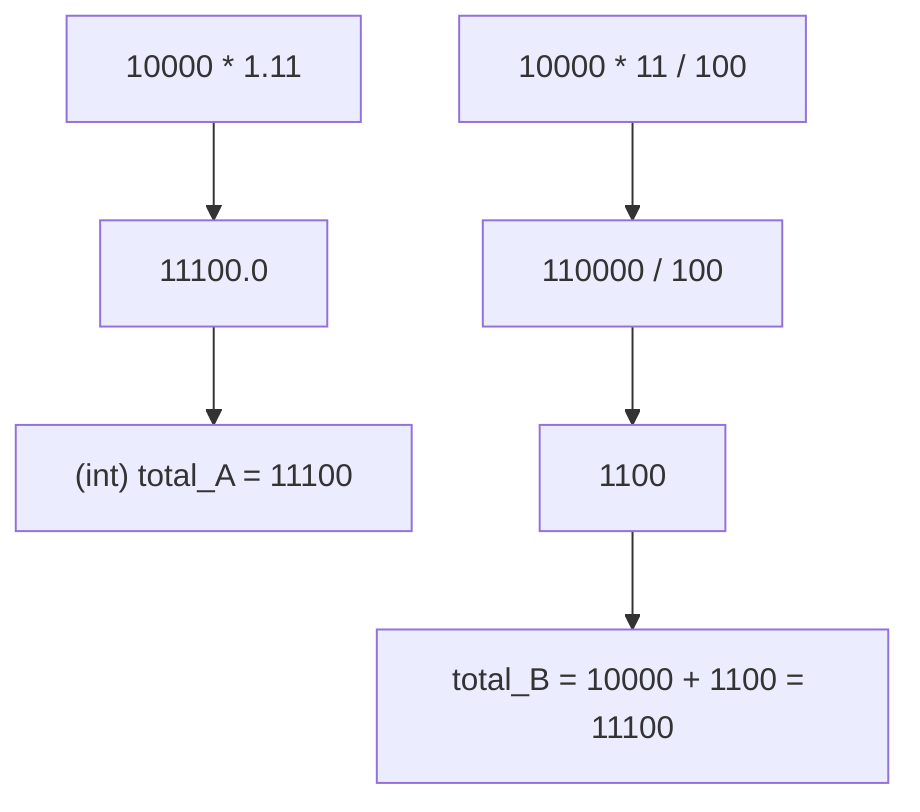
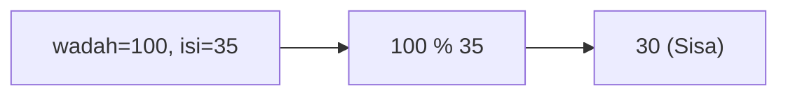
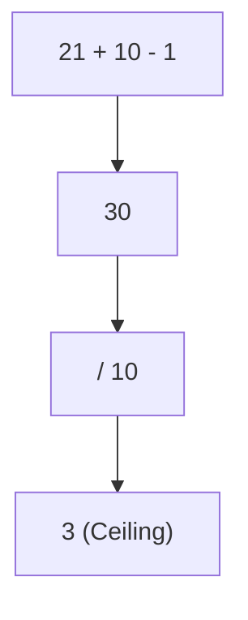
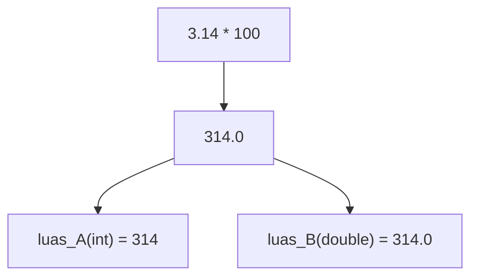
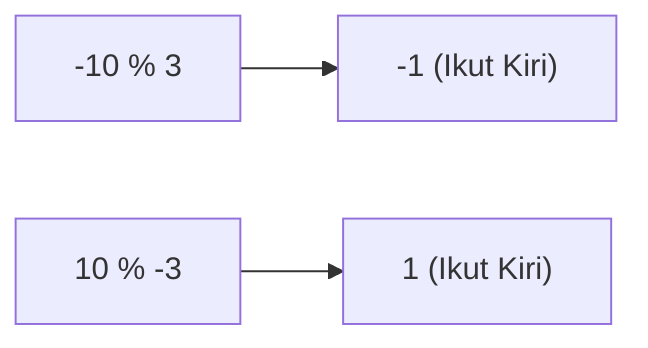

🔙 **[Kembali ke Daftar Soal](./README.md)**

---

# Latihan Soal Part C - Modul 01 - Set 03 (Premium Edition)

---

### Soal 21: Voucher Sakti (Modulo Kelipatan)
```cpp
// Skenario: Validasi kode voucher jika habis dibagi 11
int kode_vou = 121;
bool is_valid = (kode_vou % 11 == 0);
int status = is_valid;
```
**Pertanyaan:**
1. Berapakah nilai `status`?
2. Jika kode adalah **122**, berapakah nilai `status`?

<details>
<summary><b>Klik untuk Lihat Jawaban & Diagnosis</b></summary>

**Mermaid Flowchart:**


**Jawaban:**
1. **1** (True)
2. **0** (False)

**📖 Analisis Mendalam:**
Sama seperti deteksi genap-ganjil, Modulo digunakan untuk mengecek kelipatan angka tertentu. Jika sisa bagi 0, maka ia kelipatan angka tersebut.
</details>

---

### Soal 22: Sewa Bus (Is it enough?)
```cpp
// Skenario: 45 orang ingin naik bus kapasitas 12
int orang = 45;
int bus_cap = 12;
int bus_perlu = orang / bus_cap;
```
**Pertanyaan:**
1. Berapakah nilai `bus_perlu`?
2. Apakah `bus_perlu` cukup menampung semua orang? Mengapa?

<details>
<summary><b>Klik untuk Lihat Jawaban & Diagnosis</b></summary>

**Mermaid Flowchart:**


**Jawaban:**
1. **3**
2. **Belum cukup.** (Tampung 36 orang, sisa 9 orang terlantar).

**📖 Analisis Mendalam:**
Inilah bahaya pembagian `int`. Di dunia nyata kita butuh 4 bus, tapi di C++, `45 / 12` adalah 3. Dibutuhkan trik `+1` atau pembulatan ke atas.
</details>

---

### Soal 23: Rata-Rata (The .0 Power)
```cpp
int a=10, b=20, c=25;
double avg_A = (a + b + c) / 3;
double avg_B = (a + b + c) / 3.0;
```
**Pertanyaan:**
1. Berapakah nilai `avg_A`?
2. Berapakah nilai `avg_B`?

<details>
<summary><b>Klik untuk Lihat Jawaban & Diagnosis</b></summary>

**Mermaid Flowchart:**


**Jawaban:**
1. **18.0**
2. **18.333...**

**📖 Analisis Mendalam:**
Di `avg_A`, `55 / 3` menghasilkan `18` (int), baru kemudian jadi `18.0`. Di `avg_B`, `55 / 3.0` menghasilkan `18.333` (double).
</details>

---

### Soal 24: Rahasia Karakter Angka (Digit to Int)
```cpp
// Mengubah karakter '7' menjadi angka 7 utuh
char c = '7'; // ASCII 55
int n = c - '0'; // '0' ASCII 48
```
**Pertanyaan:**
1. Berapakah nilai `n`?
2. Apa yang terjadi jika kita hitung `c + 1`?

<details>
<summary><b>Klik untuk Lihat Jawaban & Diagnosis</b></summary>

**Mermaid Flowchart:**


**Jawaban:**
1. **7**
2. **56** (Atau karakter '8')

**📖 Analisis Mendalam:**
Trik `karakter - '0'` adalah cara standar di OSN-K untuk menarik nilai numerik asli dari sebuah karakter.
</details>

---

### Soal 25: Simbol Matematika (ASCII Symbol)
```cpp
// ASCII '!' = 33, ASCII '\"' = 34
char s = '!';
char s_baru = s + 1;
```
**Pertanyaan:**
1. Simbol apakah yang tersimpan di `s_baru`?
2. Berapakah nilai numerik dari `s_baru`?

<details>
<summary><b>Klik untuk Lihat Jawaban & Diagnosis</b></summary>

**Mermaid Flowchart:**
```mermaid
graph LR
A["'!' (33)"] --> B["+ 1"]
B --> C["34 ('\"')"]
```

**Jawaban:**
1. **'"'** (Petik dua)
2. **34**

**📖 Analisis Mendalam:**
Tabel ASCII tidak hanya berisi huruf, tapi juga simbol-simbol yang berdekatan yang bisa dimanipulasi dengan angka.
</details>

---

### Soal 26: Pajak PPN (VAT 11%)
```cpp
int harga = 10000;
int total_A = harga * 1.11;
int total_B = harga + (harga * 11 / 100);
```
**Pertanyaan:**
1. Berapakah nilai `total_A`?
2. Berapakah nilai `total_B`? 

<details>
<summary><b>Klik untuk Lihat Jawaban & Diagnosis</b></summary>

**Mermaid Flowchart:**


**Jawaban:**
1. **11100**
2. **11100**

**📖 Analisis Mendalam:**
Keduanya menghasilkan nilai yang sama karena `10000 * 0.11` adalah angka bulat. Namun waspadalah jika harganya ganjil, `total_B` mungkin kehilangan angka kecil di pembagian `/ 100`.
</details>

---

### Soal 27: Campurkan Kopi (Space Leftover)
```cpp
// Skenario: Wadah 100L diisi 35L kopi bertahap
int wadah = 100;
int isi = 35;
int sisa_ruang = wadah % isi;
```
**Pertanyaan:**
1. Berapakah nilai `sisa_ruang`?
2. Berapa kali "pengisian 35L" bisa dilakukan sampai wadah meluap?

<details>
<summary><b>Klik untuk Lihat Jawaban & Diagnosis</b></summary>

**Mermaid Flowchart:**


**Jawaban:**
1. **30** (Sisa ruang setelah 2x isi)
2. **2 kali** (Total 70L, isi ke-3 butuh 105L -> Meluap).

**📖 Analisis Mendalam:**
Modulo di sini mencari kapasitas sisa setelah pengisian kelipatan tertentu.
</details>

---

### Soal 28: Pagination (Tombol Next)
```cpp
// Halaman: (total + size - 1) / size
int total_data = 21;
int data_per_hal = 10;
int hal_sekarang = (total_data + data_per_hal - 1) / data_per_hal;
```
**Pertanyaan:**
1. Berapakah nilai `hal_sekarang`?
2. Mengapa rumusnya harus ditambah `data_per_hal - 1`?

<details>
<summary><b>Klik untuk Lihat Jawaban & Diagnosis</b></summary>

**Mermaid Flowchart:**


**Jawaban:**
1. **3**
2. Untuk memaksa pembagian integer melakukan **pembulatan ke atas**.

**📖 Analisis Mendalam:**
Data 21 dibagi 10 aslinya 2.1, tapi kita butuh 3 halaman. Rumus ini (21+10-1)/10 = 30/10 = 3. Trik wajib OSN! 
</details>

---

### Soal 29: Luas Bundaran (Loss of PI)
```cpp
int r = 10;
int luas_A = 3.14 * r * r;
double luas_B = 3.14 * (r * r);
```
**Pertanyaan:**
1. Berapakah nilai `luas_A`?
2. Berapakah nilai `luas_B`?

<details>
<summary><b>Klik untuk Lihat Jawaban & Diagnosis</b></summary>

**Mermaid Flowchart:**


**Jawaban:**
1. **314**
2. **314.0**

**📖 Analisis Mendalam:**
Meskipun hasilnya sama (314), `luas_A` menyimpannya sebagai `int` (kehilangan fleksibilitas koma di kemudian hari), sedangkan `luas_B` menyimpannya dengan presisi `double`.
</details>

---

### Soal 30: Modulo Negatif (C++ Rule)
```cpp
// Aturan: Tanda % ikut angka kiri!
int x = -10 % 3;
int y = 10 % -3;
```
**Pertanyaan:**
1. Berapakah nilai `x`?
2. Berapakah nilai `y`? (Ini sangat menjebak!)

<details>
<summary><b>Klik untuk Lihat Jawaban & Diagnosis</b></summary>

**Mermaid Flowchart:**


**Jawaban:**
1. **-1**
2. **1**

**📖 Analisis Mendalam:**
Di C++, operator `%` bukan operasi Matematika murni. C++ akan mengikuti tanda operan kiri (dividend). `-10 % 3` negatif, `10 % -3` positif. Ingat ini baik-baik! 
</details>
