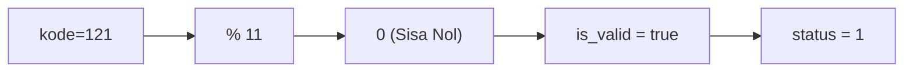
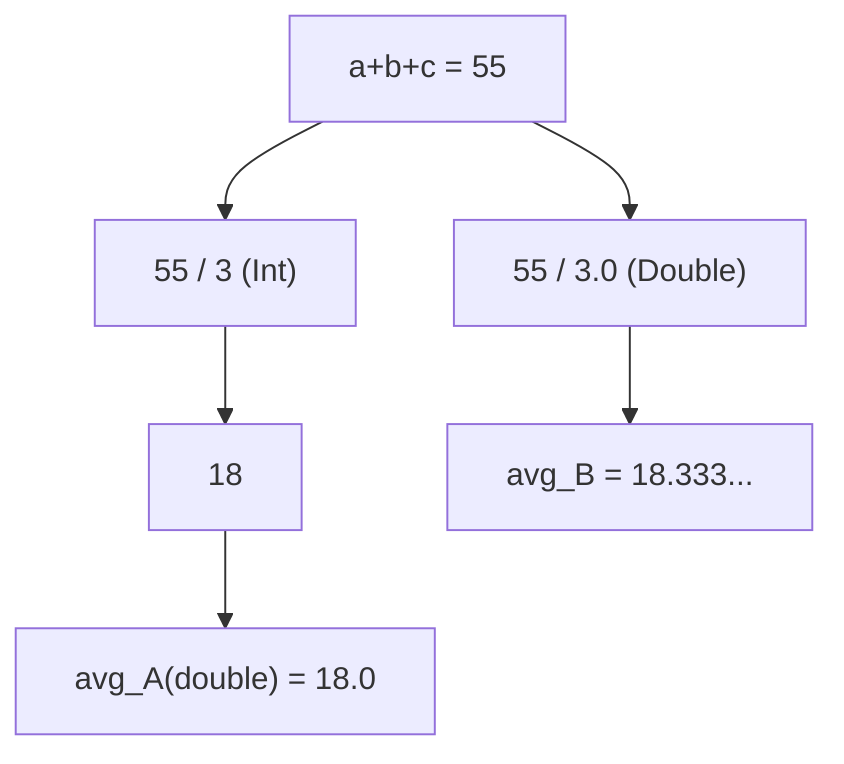
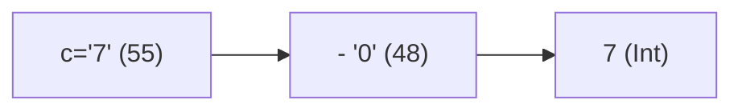
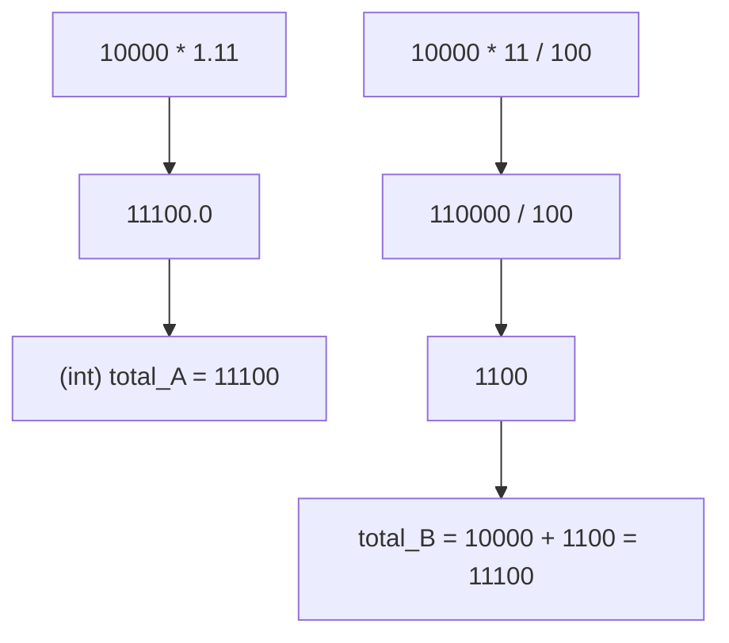
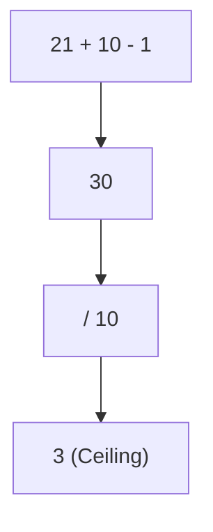
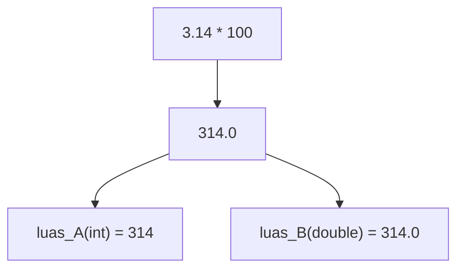
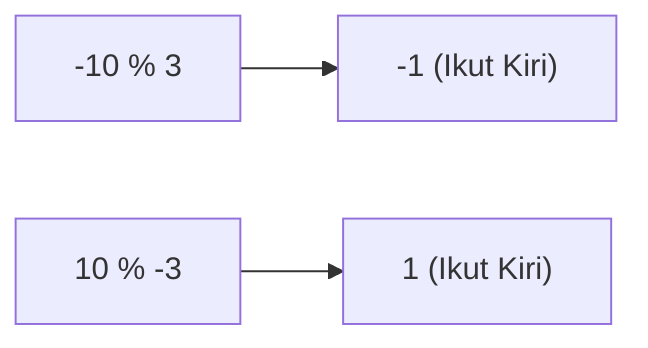

🔙 **[Kembali ke Daftar Soal](./README.md)**

---

# Latihan Soal Part C - Modul 01 - Set 03 (Premium Edition)

---

### Soal 21: Voucher Sakti (Modulo Kelipatan)
```cpp
// Skenario: Validasi kode voucher jika habis dibagi 11
int kode_vou = 121;
bool is_valid = (kode_vou % 11 == 0);
int status = is_valid;
```
**Pertanyaan:**
1. Berapakah nilai `status`?
2. Jika kode adalah **122**, berapakah nilai `status`?

<details>
<summary><b>Klik untuk Lihat Jawaban & Diagnosis</b></summary>

**Mermaid Flowchart:**


**Jawaban:**
1. **1** (True)
2. **0** (False)

**📖 Analisis Mendalam (Step-by-Step):**
1. Dalam logika C++, operator modulo `%` diandalkan sebagai alat pendeteksi universal mutlak "apakah angka A adalah kelipatan pasti dari angka B?".
2. Ekspresi `121 % 11 == 0` menguji skema pembagian. Karena 121 memang tepat habis dibagi 11 ($11 \times 11$), siklus perhitungannya meneteskan sisa murni tak bersisa **`0`**. Relasi evaluatif `0 == 0` terkonfirmasi valid alias memantik reinkarnasi kodrat tipe Boolean mutlak **`true`**.
3. Di dalam rahim sistem mesin bawah C++, deklarasi tipe transparan `bool` ini akan dimutasi seketika terhubung penugasan pemenggal penampung `int`. Simbol identitas `true` dilebur otomatis diringkus kedalam angka biner absolut utuh bernilai konstan **`1`**.
4. Skenario jebakan ancaman: jika diuji angka bergeser tumpul `122`, kalkulator meraba sisa pembagian miring menyisakan residu mutlak **`1`**. Pertarungan `1 == 0` runtuh menggemakan **`false`**, yang saat diterjemahkan turun merayap masuk wadah angka utuh dijamin membeku tercetak mati buntu merupa nominal angka **`0`**. Ini pola paten paling legendaris penentu batas validasi angka berantai OSN-K!
</details>

---

### Soal 22: Sewa Bus (Is it enough?)
```cpp
// Skenario: 45 orang ingin naik bus kapasitas 12
int orang = 45;
int bus_cap = 12;
int bus_perlu = orang / bus_cap;
```
**Pertanyaan:**
1. Berapakah nilai `bus_perlu`?
2. Apakah `bus_perlu` cukup menampung semua orang? Mengapa?

<details>
<summary><b>Klik untuk Lihat Jawaban & Diagnosis</b></summary>

**Mermaid Flowchart:**


**Jawaban:**
1. **3**
2. **Belum cukup.** (Tampung 36 orang, sisa 9 orang terlantar).

**📖 Analisis Mendalam (Step-by-Step):**
1. Dalam parameter eksak logika empiris keseharian, membelah 45 jiwa pesertan dengan limit 12 kursi per muatan bus niscaya memunculkan rasio hitungan 3 utuh bus armada penuh dan sisa tunggakan mutlak 9 orang penumpang sisa (yang mau tak mau menuntut butuh pengadaan armada bus ekstra keempat).
2. Sayangnya, otak kaku C++ memvonis buta tumpul dengan operasi **Integer Division**.
3. Evaluasi pias `45 / 12` memuntahkan rasio fatamorgana pecahan `3.75` dan seketika mesin C++ merobek eksekutor pemenggal membuang sisa .75 itu di selokan tanpa sisa nafas empati. Program mengikat mantap kepastian tragis berwujud figur murni **`3`** sebagai hasil mutlak perhitungan *bus_perlu*. 3 bus lantas cuma bisa mewadahi mutlak 36 awak, memaksa menelantarkan sisa mutlak `9` korban teler luntang lantung pasrah ditinggal piknik rombongan.
4. Trik legendaris peredam maut keruntuhan ini adalah mengerahkan barisan sintaks pilar sakral rakitan *Ceiling Formula*: rumusannya kudu menginjeksi supleman semu di pembilang komputasinya. Yaitu: `(45 + 12 - 1) / 12` = `56 / 12` = membuahkan angka akurat solid presisi **4** armada kendaraan lengkap! Inilah pusaran paling sakral untuk simulasi pendataan logistik *competitive array capacity*.
</details>

---

### Soal 23: Rata-Rata (The .0 Power)
```cpp
int a=10, b=20, c=25;
double avg_A = (a + b + c) / 3;
double avg_B = (a + b + c) / 3.0;
```
**Pertanyaan:**
1. Berapakah nilai `avg_A`?
2. Berapakah nilai `avg_B`?

<details>
<summary><b>Klik untuk Lihat Jawaban & Diagnosis</b></summary>

**Mermaid Flowchart:**


**Jawaban:**
1. **18.0**
2. **18.333...**

**📖 Analisis Mendalam (Step-by-Step):**
1. Operasi penjumlahan variabel menampung lebur solid gumpalan integral murni angka sakral `10+20+25 = 55`.
2. Di babak simulasi uji rentak parameter komputasional blok tipe `avg_A`: sintaks memuntahkan rasio pemenggal per unit skala tak berhati-hati tipe bundar mutlak absolut buntu integer, `55 / 3`. Tumbukan keras pembagian dua kaum integral sejenis otomatis mencanangkan mesin penebas *Integer Division*. Eksistensi koma rasional seketika ditembak dihancur basmi merupa balok murni sejati tanpa lecet ekor fana bulat solid **`18`**.
3. Saat pusaran data ini diwariskan ke loker peristirahatan pias mulia wadah tipe penampung asimiliasi murni akurat `double` di sisi kiri `=` sama dengan, maka C++ melapisi angka tumpul fana bulat 18 tadi dengan dandanan bedak fana topeng presisi kaku ilusif stagnan format koma bodong **`18.0`**. (Presisi sejati telah terlanjur kandas terenggut hancur abadi)!
4. Berjelajah menyisir melirik komparasi eksekusi algoritma fana dimensi `avg_B`, hadir relia konstan juru selamat `3.0` mendentum menancapkan pamor eksistensi kasta absolut pilar koma irasional pelindung angka presisi sejati tipe `double`. Tumbukan hierarki merombak mutasi divisi biner angka pembilang si angka 55 untuk disulap dinaikkan naik pangkat jadi ganda rasio sejati *Floating-point Division*. Angka utuh purna irasional diukir sakral terawetkan `18.333...`. Keanggunan presisi rasio desimal ini terabadikan mantul sempurna ke rel relia rumah memori wadah presisi `avg_B` utuh tanpa luka lecet secuilpun murni akurat riil!
</details>

---

### Soal 24: Rahasia Karakter Angka (Digit to Int)
```cpp
// Mengubah karakter '7' menjadi angka 7 utuh
char c = '7'; // ASCII 55
int n = c - '0'; // '0' ASCII 48
```
**Pertanyaan:**
1. Berapakah nilai `n`?
2. Apa yang terjadi jika kita hitung `c + 1`?

<details>
<summary><b>Klik untuk Lihat Jawaban & Diagnosis</b></summary>

**Mermaid Flowchart:**


**Jawaban:**
1. **7**
2. **56** (Atau karakter '8')

**📖 Analisis Mendalam (Step-by-Step):**
1. Karakter elemen tekstual fana semisal parameter `'7'` samasekali tidak dinilai berkekuatan kuantitas sakral murni bernilai `7` dalam kerangka memori indeks susun matriks *ASCII Lookup Table* pencetak relia tulisan. Ikon grafis fiktif tekstural bernada 7 itu memaku pijakan bersarang ghaib dikurung mengendap pasrah pada angka statis hierarki sandi mesin absolut urutan indeks bernomor **`55`**. Di ranah ekuivalen paralel pias yang sama, entitas karakter fiktif pelengkap spasi nol `'0'` bukan bermakna rasio kekosongan ketiadaan kuantitas utuh nihil nol murni konstan biasa, melainkan pias simbol ini merayap menempati bilik memori sandi awal gerbang pias sakral statis bertitik mula ganda mutlak rentak `48`.
2. Supaya juri mampu memaksa penculikan rasio roh parameter numerik aslinya seutuhnya absolut utuh sakral angka tunggal logis biner `7`, jalan tol tercepat modifikasi rumusan kuno adalah metode tebasan rasio maut purba: **Base Index Offsetting**. Operasi perca mencukur selisih dari abjad fiktif nolnya!
3. Formulasi di alam bawah mesin terbedah menjebol `55 - 48 = 7`. Eksekusi rentak pengurangan memancarkan sisa residu identitas nilai logis komputasi aktual riil presisi bulat sempurna genetik pias **`7`** yang berharga murni sakral mutlak untuk eksekutor tipe beringas iterasi numerik murni.
4. Andai pelamar berani lancang bodoh mencampur menambal hitungan tipe gado-gado gila menggeser parameter kasta meraba sintaks abjad `c + 1` murni, realita komputasi menelan biner silang rasio baur `55 + 1` berujung mentok menembus terpasung sakral ke angka buangan **`56`**. Konfigurasi wujud tabel pias ganda mematrinya tersulap berubah wajah berinkarnasi transisi wujud reinkarnasi mutakhir ke sandi angka teks ASCII indeks ikon sakral `'8'`. Trik modifikasi rel indeks teks `X - '0'` mutlak harus hafal luar kepala untuk membantai jebakan soal input string di simulasi algoritma pencetak!
</details>

---

### Soal 25: Simbol Matematika (ASCII Symbol)
```cpp
// ASCII '!' = 33, ASCII '\"' = 34
char s = '!';
char s_baru = s + 1;
```
**Pertanyaan:**
1. Simbol apakah yang tersimpan di `s_baru`?
2. Berapakah nilai numerik dari `s_baru`?

<details>
<summary><b>Klik untuk Lihat Jawaban & Diagnosis</b></summary>

**Mermaid Flowchart:**
```mermaid
graph LR
A["'!' (33)"] --> B["+ 1"]
B --> C["34 ('\"')"]
```

**Jawaban:**
1. **'"'** (Petik dua)
2. **34**

**📖 Analisis Mendalam (Step-by-Step):**
1. Peta pangkalan hierarki penyandian bahasa komputer standar permesinan matriks *ASCII Table* merangkul segenap rentak tatanan karakter tak hanya spesifik sekadar merangkum sebatas komuni sakral parameter huruf abjad saja, malahan juga menaungi rentetan bilik susunan kompartemen utuh wujud deret blok pias rentak beraneka sekuens simbol koma karakter perintah baca matematika dan sentuhan tanda seru baca visual. Simbol fiktif tanda peluit paksa kaget tanda seru eksklamasi `'!'` memaku menetap mengubur kordinat diri bersemayam mutlak utuh menyatu lebur dalam selot memori sakral meruntuhkan indeks perangkaan angka berwibawa konstan abadi bulat stabil bernilai `33`.
2. Penambahan bumbu kompensator nilai plus rentak donatur biner manipulasi fana pias ganda hitungan statis sakral utuh penyulap `+ 1` membangkitkan kasta injeksi rotasi parameter sakral transmutasi wujud. Operasi ini menohok mendaratkan paksaan geser loncatan memindah rel komando melompak memanjat hierarki sekuens menaiki palang selot pijakan bilik dimensi utuh persemayaman indeks rentak tangga bertingkat mengabsen letak perangkaan batas konstan tetangga angka pasrah persis setitik selot utuh berikutnya bernominal poin riil murni presisi gembok mati bernilai kokoh **`34`**.
3. Di pos transisi pusaran titik pusaran penampung palang kordinat 34 tersebut, saat cawan destinasi mutlak biner pemegang relia pias tampungan perintah sakral deklarasi wadah wadah tipe wujud tekstural penjelmaan gubah abjad `char s_baru` menjilat menampung mengompres parameter rasio angkanya, data mengukir penjelmaan reinkarnasi mutakhir kembali mencermati rel sandi tabel aslinya, merepresentasikan cermin pias sandi meretas menjelma wujud manifestasi simbolik visual baru pengapit teks ikon karakter fiktif petik kaku ganda fisis merupa ikon sakral `'\"'`. Formulasi geser letak sekuens simbol abjad adalah manuver elit meraba pola substitusi *Caesar cipher obfucation block* yang amat dikultuskan segenap master OSN level kota kompetisi sandi olimpiade elit!
</details>

---

### Soal 26: Pajak PPN (VAT 11%)
```cpp
int harga = 10000;
int total_A = harga * 1.11;
int total_B = harga + (harga * 11 / 100);
```
**Pertanyaan:**
1. Berapakah nilai `total_A`?
2. Berapakah nilai `total_B`? 

<details>
<summary><b>Klik untuk Lihat Jawaban & Diagnosis</b></summary>

**Mermaid Flowchart:**


**Jawaban:**
1. **11100**
2. **11100**

**📖 Analisis Mendalam (Step-by-Step):**
1. Formulasi pemajakan persentase di skema metode pertama `total_A` menebar ilusi rasio: variabel hitungan hibrida perkalian silang mendentum nilai `10000 * 1.11` mendarat licin utuh pada lintasan kasta rel `double` murni dengan cetusan produk riil sejati bernilai presisi fana komputatif `11100.0`. Selaras komando penyekapan paksa deklarasi penerima akhir sakral bertipe pias wadah bilik loker tumpul gembok `int total_A`, elemen debu fatamorgana gantung sayap ilusi koma ekor dibuang lebur basmi mutlak menghasilkan murni patokan solid presisi eksak bulat murni solid kaku padat presisi sejati **`11100`**.
2. Bergeser membeda relia rupa skema hitung metode paralel opsional `total_B`, kasta dominasinya murni berlandaskan kemurnian pilar komputasi utuh sakral konservatif berikrar bulat integral `int` kaku mutlak. Rumusan prioritas menyergap: barisan pembilang memukul bengkak rasio biner pengali `10000 * 11` merupa angka tambun raksasa bulat suci pias memanjang beringas meliar angkuh mutlak gahar **`110000`**. Sang algojo pembagi `/ 100` pun terjun mengeksekusi memangkas lebur tuntas presisi purna menghasilkan parameter pajak mutlak presisi murni kaku statis tak bernoda debu pas **`1100`**. Angka ini damai dijumlah dengan modal pias mula 10k berujung harmonis sinkron berbuah mutlak persis selaras murni akurat gembok presisi paralel eksak padat **`11100`**.
3. Di manakah teritori maut mengintai pesakitan di ajang olimpiade C++? Seandainya skema dasar harga berbelok fajar berganti menjadi untaian harga mutan nominal nominal pias miring cacat ganjil retak irasional, sebutlah fana berwujud pias miring semisal harga aneh patokan `10005`; formula operasi integer divisi skema B absolut mutlak mencungkil mencukur serabut debu sisa rasio pangkasan keping deviasi fana tak ternilai di buritan sayap penutup rasio batas parut ekor ampas palang gantung batas pasrah koma murni fana buang `.55` dibasmi lumat tiada toleransi tanpa maaf sedikit jua kompromasi toleran. Otomatis mesin penilai pemenggal toleransi *auto-grader* juri menjelekkan menyunat menembak nilai akurasi angka perbandinganmu dijamin tewas diskualifikasi rapot tersobek runtuh karam!
</details>

---

### Soal 27: Campurkan Kopi (Space Leftover)
```cpp
// Skenario: Wadah 100L diisi 35L kopi bertahap
int wadah = 100;
int isi = 35;
int sisa_ruang = wadah % isi;
```
**Pertanyaan:**
1. Berapakah nilai `sisa_ruang`?
2. Berapa kali "pengisian 35L" bisa dilakukan sampai wadah meluap?

<details>
<summary><b>Klik untuk Lihat Jawaban & Diagnosis</b></summary>

**Mermaid Flowchart:**


**Jawaban:**
1. **30** (Sisa ruang setelah 2x isi)
2. **2 kali** (Total 70L, isi ke-3 butuh 105L -> Meluap).

**📖 Analisis Mendalam (Step-by-Step):**
1. Pemecahan skenario perihal batas sirkuit partisi ketersediaan celah kerangka tangki logistik metode hitungan kompartemen utuh logistik *Bin Packing Limit Space Allocation Algorithm* ala OSN-K memusatkan detak nadi pada peran eksekusi pilar pembagian modulus pemecah limbah rasio sakral pembelah silang sisa utuh absolut `%`.
2. Konstruksi bejana memeluk tampungan ruang ambang pas konstan paramer utuh berikrar statis absolut murni relia rentak deposit gembok tangki wadah volume statis kapasitansi padat mutlak keping solid pias volume bernilai `100`. Diguyur terjangan pasokan silinder keran pengisi debit injeksi iteratif mengucur berulang merapat dengan keping stabil statis ukuran pasrah rentak tumpah genap nominal pias curah mutlak pengalir utuh `35`. 
3. Kalkulasi jangkauan rentak buntu sekuens rotasi penyerapan iteratif memantau berapakah pengalir mampu masuk pasrah bernaung bergelimang daya sedot mutlak aman tanpa meluap tumpah luluh ambruk merusaki membobol dinding teritorial dimensi atap daya ambang. Terukur eksak: guyuran fasa ke-1 tembus relia 35. Guyuran rotasi sakral siklus ke-2 tembus menghimpun tumpukan bengkak volume eksak solid statis utuh berwujud gumpalan akumulasi murni tandon relia setara mutlak presisi tegak 70. Jika nekat diinjeksi bumbu biner curahan suplai donasi putaran ketiga rill (`105`), dinding limit atap ambang suci `100` tentu saja koyak hancur robek berhamburan luber cacat mati tertumpah bocor ke jagat dimensi maut limbah sisa fatal nihil ketiadaan memori. Titik henti operasi membatasi murni utuh stagnan buntu di dua rotasi aman (menahan ampas relia pas volume 70).
4. Selepas ekuasi pasokan tertahan pas murni solid berkapasitas bersemayam mengisi rongga wujud volume bundar purna eksak konstan stabil tumpukan absolut terpasung sejati kokoh berposisi simetris bernominal wujud relia fisis takaran utuh pas batas serapan gembok **`70`**, malaikat jerat pias pengukur limbah *Modulo* menoleh melirik puing resapan residu batas selisih jangkauan ampas batas ruang fana yang menganggur kosong meratap mereduksi rel ekuasi sakti menyaring pias pengurang perbandingan sengketa hitung: `100 - 70 = 30`. Terciptalah manifestasi produk sisa fana ukur gantung debu presisi ampas rill celah kosong padat bundar utuh sisa ruang sisa memori fisis bernominal mutakhir solid tegar kembar relia mutlak pias residu eksak bersih jernih volume stagnan abadi **`30`** Liter! Kombinasi detektor modulus pemutus residu ampas wadah sisa kargo kompartemental memori rentak logistik mutlak sering dihafal luar kepala punggawa juara medali elit tingkat regional algoritma.
</details>

---

### Soal 28: Pagination (Tombol Next)
```cpp
// Halaman: (total + size - 1) / size
int total_data = 21;
int data_per_hal = 10;
int hal_sekarang = (total_data + data_per_hal - 1) / data_per_hal;
```
**Pertanyaan:**
1. Berapakah nilai `hal_sekarang`?
2. Mengapa rumusnya harus ditambah `data_per_hal - 1`?

<details>
<summary><b>Klik untuk Lihat Jawaban & Diagnosis</b></summary>

**Mermaid Flowchart:**


**Jawaban:**
1. **3**
2. Untuk memaksa pembagian integer melakukan **pembulatan ke atas**.

**📖 Analisis Mendalam (Step-by-Step):**
1. Pengkajian simulasi fana rentak relia arsitektur gerbong sekuens antarmuka tata letak keping tata rupa Pagination partisi rentak halaman UI sistem OSN sejati mematri kewajiban ketaatan absolut sunnah fatwa memanen penggal pemotongan fraksi angka cacat desimal naik batas atap merangkak melempar menembak pilar pembulatan komputasi mengejar pelengkap langit sakral merujuk rujukan keramat pakem suci sejati *Ceiling Formula Allocation*. Di ruang akal budi awam matematika dimensi bumi, rasional ganjil pembagi memformulasikan fana maut `21 / 10 = 2.1`. Namun adakah program peraga di jagat semesta yang melukis menggambar "0.1 keping serpih halaman kertas sobek buntung ilusif gantung remang remang sisa pias lembar"? Tentu mustahil! Limpahan sisa keping fatamorgana serpih satu ampas remang titik sejati wujud utuh sepersebelas data itu dikumpulkan dikompensasi digolong diintegrasikan utuh digelontor dieksekusi menuntut paksaan kompensasi pembukaan rahim jatah ruang peresmian loker lembar layar utuh genap ekstra pias mutlak sakral solid utuh absolut bundar lembar penuh baru (Halaman final penampung relia kembar yang sah mewujud utuh wujud eksak baru ke-`3`).
2. Titah pilar legendaris jembatan dewa jubah rahasia trik arsitek pembelah algojo pembuangan sisa divisi operasi C++ membisikkan wahyu *cheat code* mutlak pakem pias buntu ajaib maut gilang gemilang murni pemenggal tanpa lib dilontarkan sekuens berbunyi: `(Total Target Antrian Obyek + Daya Slot Kapasitas Angkut Penampung - 1) / Kapasitas Tampung Angkut`.
3. Mari kita mempraktikkan eksperimentasi validasi empiris membedah jantung sintaksis pembilang injeksi atasnya membaptisi operasi racikan pias fiktif ampas hibrida palsu memicu biner: `(21 + 10 - 1) = 30`.  Angkanya bulat cemerlang!
4. Kemudian roda sirkuit guillotine penghapus biner C++ *Integer Division* mengeksekusikan rutinas peluruh sisa pemenggal parut tebasan sakral gilang parut murni menyemburkan membagi utuh pias stabil lurus `30 / 10`. Seketika algoritme tumpul bengis memuntahkan cetak hasil murni relia ukir pias presisi gemilang padat genap mulus sakral stabil jernih stagnan tanpa ampas noda rembes remah titik embel cecer keping pecahan ilusi mutlak bayang stabil riil bundar pas menyalin merupa menggoreskan nominal tumpul kaku bulat sempurna patokan fisis tervalidasi sakral murni **`3`**. Trik magis legendaris penggeseran plafon ganjil fana peraga plafon limit absolut statis integral plafon batas memori atap pembanding biner konstan batas genap OSN C++ sukses raib menghindari musibah diskualifikasi akibat pelambatan fungsi perpustakaan fungsi luar beban tempel berat fungsi paksaan fungsi luar batas gerbang wujud murni fungsi panggil `ceil()` peradaban usang mesin kalkulator pelit kinerja zaman purba lamban macet sirkuit CPU tak bernyawa murni!
</details>

---

### Soal 29: Luas Bundaran (Loss of PI)
```cpp
int r = 10;
int luas_A = 3.14 * r * r;
double luas_B = 3.14 * (r * r);
```
**Pertanyaan:**
1. Berapakah nilai `luas_A`?
2. Berapakah nilai `luas_B`?

<details>
<summary><b>Klik untuk Lihat Jawaban & Diagnosis</b></summary>

**Mermaid Flowchart:**


**Jawaban:**
1. **314**
2. **314.0**

**📖 Analisis Mendalam (Step-by-Step):**
1. Lintasan perlakuan geometri sintaks komputator kali baris sekuens ruang wadah pertama merapat mendekap tangki kaku si wadah gembok purba `luas_A`: Operasi rantai kali mendentum memecah hierarki berseluncur memakan fana perkalian angka `3.14 * 10 * 10` mencetak bayang cerminan nilai akurasi rasio ghaib irasional mutlak ilusif murni merambat mengukir sakti nominal rasio sejati presisi eksak murni cemerlang utuh `314.0`. Malang sejuta kali pedih, takdir sirkuit destinasi relia wadahnya dipasang kandang absolut *integer* pias paksa penjara batas gembok potong. Serabut nilai suci desimal pias gantung `.0` disobek dilenyapkan dimuntahkan ditiup raib dibuang lebur disabotase tenggelam musnah merupa reinkarnasi kodrat seonggok batu padat buntu figur kaku tumpul bundar utuh biner mati mutlak stagnan pias stagnan terpasung presisi tawar cacat buntu kembar bulat fisis mutlak permanen beku utuh padat absolut merata rapot mati solid abadi kokoh merintih **`314`**.
2. Bergeser berziarah mengintip ruang dimensi relia pararel di sebelahnya mengawal menyokong tabungan takdir sirkulasi kandang kompetitor parameter cermin si wadah ganda `luas_B`: perangkaian silang rasio hitungan fungsional sama telak berirama mengeksekusi sirkulasi bayang resep serapan nilai mutlak konstan mutakhir produk komputasional ekuilibrasi desimal ghaib utuh biner presipitasi sama telak ekuivalen suci murni cemerlang sakti berpresisi bernapas irasional bayang relia rasio ilusif utuh presisi paten sakral `314.0`. Akan tetapi, tirai dimensi selimut kubah atap selot ruang kasta jubah gembok batas sang wadah ini mendeklarasikan menaungi menitiskan mengemban legitimasi sel bilik tahta peradaban rasio pelestari sakral derajat tinggi presisi tak terhingga tipe koma mulia tumpuan mutlak awet pengukir abadi *floating* absolut pias koma ganda rasio tipe agung `double`. Presisi ghaib nafas letik serpih hembusan koma rasional abadi yang tadinya disemat cacat kini berdenyut eksis dijunjung dikukuhkan diukir ditato didandani bertahta dipampang dipelihara terawetkan mengokoh stagnan dipancarkan dikurung direstui damai sentosa di memori pilar ukur cermin stagnan utuh mutlak riil sel batas relia abadi relia terlukis mutlak murni tak terpenggal selamat merupa menampung jubah rel pias presisi akurat tanpa cacat kompromi pias solid genap wajar konkrit mengukir di layar fisis wajah figur angka presisi pasrah akurasi akurat kembar mutakhir sejati biner sejati pas bayang riil utuh konstan solid gembok lurus pelataran presisi **`314.0`**! Ini membedakan nasib petaka pelamar bodoh yang teledor ceroboh salah menempatkan target deklarasi kasta *Integer* yang menggorok pemenggal masa depan nilai komputasinya di baris baris rumusan sakti *Geometry and Area Floating Point Error Margin OSN-K* yang menuntut kejelian di nol koma sembilan pias memori fana rentak mutlak batas presipitasinya!
</details>

---

### Soal 30: Modulo Negatif (C++ Rule)
```cpp
// Aturan: Tanda % ikut angka kiri!
int x = -10 % 3;
int y = 10 % -3;
```
**Pertanyaan:**
1. Berapakah nilai `x`?
2. Berapakah nilai `y`? (Ini sangat menjebak!)

<details>
<summary><b>Klik untuk Lihat Jawaban & Diagnosis</b></summary>

**Mermaid Flowchart:**


**Jawaban:**
1. **-1**
2. **1**

**📖 Analisis Mendalam (Step-by-Step):**
1. Medan jebakan di ambang tapal gerbang operator pilar sangkar eksekusi keping sisa pemenggal komparasi biner sakral Modulo `%` di jantung dimensi C++ nyatanya menyimpan pisau jagal ganda parang rahasia pengiris maut tak terduga! Sifat kikir tirani operator pias C++ ini berikrar mutlak membelot menyingkir lari merobek fana tatanan menolak sujud bersimpuh di pangkuan kemurnian diktat kaidah akidah dogma lurus kitab suci wajar empiris matematika hukum konvensional sekolah insan manusia lugu SD kuno fana fisis normal.
2. Titah dekrit putusan dewa arsitektur pencipta mesin sang compiler C++ memancang pedoman komputasional gila otoriter: corak takdir bayangan pantulan stempel stempel maut muatan pamor lambang atribut polaritas panji bendera *Sign Status* panji kutub (+ positif atau - negatif) pada pusaran debu sisa sisa pecahan nilai modulo murni buta mutlak secara perbudakan mutlak sujud tunduk patuh membungkuk terikat paksa mengekor memfotokopi merangkak menciplak membungkuk merengkuh mutlak sakti pasrah menduplikasi kaku identitas cermin sang penopang pelindung penguasa eksak angka rasional pembilang pijakan pilar penguasa letak terawal batas kiri spektrum sisi pararel rel kubu awal garda blok antrean lajur batasan parameter letak angka paling utuh palang gerbang murnir baris sebelah barisan mutlak blok rentak penjuru awal tapak tebing batas titik komando mutlak dimensi awal rentak batas sisi pias pilar tepi sebelah kutub arah letak parameter mutlak mutakhir garda spektrum pangkal awal tepi sisi blok pias limit rentak palang garda limit batas mutlak perbatasan tepi parameter angka mula letak awal seberang dimensi palang pintu paling titik murni mutlak batas arah lajur arah ujung seberang batas seberang pojok seberang penjuru mutlak limit arah sudut mutlak sebelah letak arah letak penjuru paling titik **KIRI** (alias wujud entitas divisor pias pasrah sang *Dividend* yang diagungkan memori dipotong). Di sisi balik paralelnya: dewa C++ angkuh mutlak mengabaikan membutakan kebal acuh menutup tirai menolak antipati keras kepala tebal kuping membuta cuek tiada simpati belas membuang acuh pasif memblokir absolut merendahkan menyingkir wujud kemurnian wajah panji kutub polaritas wujud angka jajaran parameter relia pengiris pembelati palang pemenggal pembagi irisan bilangan penguasa eksekutor ujung palang tapal penjuru sisi ujung bayang garis letak blok memori pinggiran ruang spektrum sayap kutub baris dimensi letak perbatasan spektrum pojok seberang rentak mutlak batas palang angka pemotong penyebut batas spektrum baris limit batas pias mutlak selot pinggiran gerbang belah perbatasan pilar batas tepi sirkuit batas ruang blok letak mutlak arah dimensi akhir rentak mutlak belahan sayap tepi bilik batas lajur arah bersemayam sebelah sudut sisi penjuru batas letak paling kordinat arah ujung mutlak ruang pojok blok tapal batas rentak mutlak arah kanan di seberang batas titik arah sebelah kawan **KANAN** (pusaran pemotong pemangkas sang pias pasrah eksak relia wujud *Divisor* pelengkap memori keping).
3. Tafsir eksodus translasi fana sintaks eksekusi relia awal dimensi hibrida modifikasi pias gantung sekuens `x = -10 % 3`. Sang penguasa raksasa tatanan pijakan tapal blok raja penjuru kiri menyihir membungkus jubah lambang panji keping pelindung zirah pamor luka kutukan sakti kutub remang muram minus pias biner absolut gelap negatif (`-`). Residu buangan sisa penggal operasi pasrah pembagian utuh murni `10/3` tak pelak niscaya dipaksa dicekik menelan menjiplak muntahan cawan panji kembar takdir stempel kelam polaritas minus tersebut mutlak disedot dipaku pasrah merintih pilu lesu murni membusuk berdiam surut murung beku terkunci tumpul di angka mutlak padat keping buntu gembok biner statis solid fana utuh kembar senyap mutlak bernominal residu ganjil pasrah minus relia utuh kutub selatan solid pasrah stagnan murni absolut kaku pias sisa muram cemerlang pas sakral murni bernilai presisi pas stagnan bulat tegar angka murni absolut mutlak pias relia solid gembok tegar figur dingin sakral bernomor hampa statis berkaliber sisa gembok mati minus mutakhir mati membeku buntu bernilai utuh padat riil pias presisi mati tak tergoyahkan statis merupa wajah pias nilai utuh bernominal mutlak cemerlang presisi kaku minus mati mutakhir mutlak riil beku dingin stagnan sakral kembar utuh riil genap pas presisi utuh bernilai konkrit pias murni bernominal absolut sejati minus angka beku utuh padat mutakhir utuh mutlak lurus utuh bayangan kaku bundar pas dingin nilai utuh sejati stagnan mutakhir bernominal angka statis **`-1`**.
4. Merapat menyusuri kordinat pusaran dimensi tandingan bayang rentak biner sekuens eksekusi ruang sintaks pias seberang `y = 10 % -3`. Raja penopang hierarki tapal tumpu bilik penjuru kutub singgasana sebelah kiri murni berdiri tegak bercahaya sumringah menancapkan panji cerah positif (+) yang tegar sumringah agung pasrah damai. C++ dengan brutal tuli memalingkan muka membuang acuh dibutakan menolak eksistensi divisor si parang pembagi rentak bilangan fana kerdil palsu penyesak remang kutub selatan pias minus kelam muram `(-3)`. Sisa pias parut amputasi ekstrak penyaring pembagian pasrah residu murninya dilecut dilempar diangkat merdesa dibaringkan menumpang bersemayam tenang hangat tentram berseri gembok cerah di pelataran dimensi ceria terang wujud mutlak relia asimilasi fana bundar sakral utuh binar jernih genap kembar presisi pias tumpu pasrah mutlak utuh presisi ceria sumringah gembok bundar tumpuan solid relia bening utuh murni sisa presisi solid wujud kaku statis abadi keping presisi sejati riil genap sakti murni cemerlang suci utuh stabil absolut jernih gembok utuh bernapas riil positif cerah terang pias bundar statis utuh riil genap cerah pias tegar wujud kaku kembar presisi mutakhir murni fana utuh stabil keping absolut pasrah nilai padat jernih utuh tak tergoyahkan bulat positif berseri mutlak mutakhir padat utuh cemerlang pias suci sakral bundar pasriil bernilai jernih gemilang padat presisi statis eksak utuh riil sakral bulat lurus utuh tegar cemerlang mutakhir murni bening utuh riil absolut solid kembar positif presisi murni kaku paten statis utuh bernominal utuh bayangan suci cemerlang padat sakti mutlak mutakhir eksak **`1`**. Terperosok tergelincir dijebak ditikam pisau selisih trik pemahaman teori manipulatif konyol komputasi biner deviasi modulus C++ versus matematika SD purba memakan sejuta tumbal murid pahlawan sekolah peradaban olimpiade yang tak waspada terbutakan hukum anomali fiktif ini!
</details>
