🔙 **[Kembali ke Daftar Soal](./README.md)**

---

# Latihan Soal Part C - Modul 01 - Set 03

### Soal 51
```cpp
int n = 98, y = 5;
int res = n / y;
```
**Pertanyaan:**
1. Berapakah hasil akhirnya?
2. Mengapa demikian?

**Jawaban & Diagnosis:**
1. **19**
2. Lihat Tracing.

**Mermaid Flowchart:**
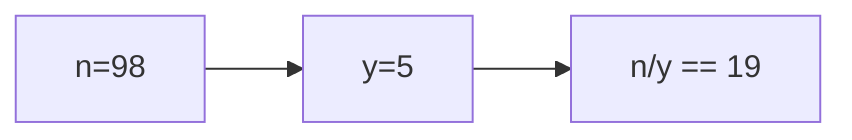

**📖 Penjelasan:**
**Langkah Tracing:**
1. n=98, y=5.
2. 98/5 = 19.60. Karena `int`, desimal dibuang.
3. Hasil: 19.

---
### Soal 52
```cpp
int n = 39;
int m = 5;
int res = n % m;
```
**Pertanyaan:**
1. Berapakah hasil akhirnya?
2. Mengapa demikian?

**Jawaban & Diagnosis:**
1. **4**
2. Lihat Tracing.

**Mermaid Flowchart:**
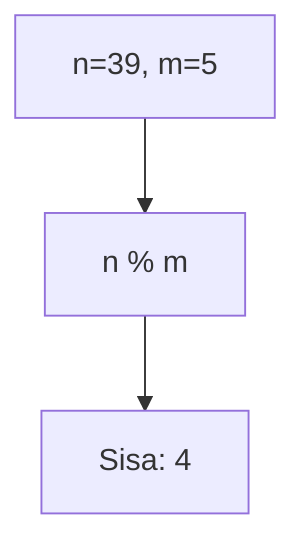

**📖 Penjelasan:**
**Langkah Tracing:**
1. n=39, m=5.
2. 39 dibagi 5 sisa 4.
3. Hasil: 4.

---
### Soal 53
```cpp
char ch = 'X';
ch = ch + (-2);
```
**Pertanyaan:**
1. Berapakah hasil akhirnya?
2. Mengapa demikian?

**Jawaban & Diagnosis:**
1. **V**
2. Lihat Tracing.

**Mermaid Flowchart:**
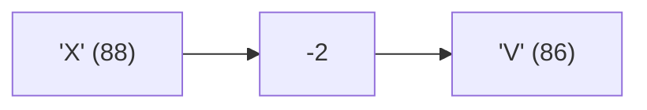

**📖 Penjelasan:**
**Langkah Tracing:**
1. ch='X' (ASCII 88).
2. 88 + (-2) = 86.
3. Hasil: 'V'.

---
### Soal 54
```cpp
double val = 78.40;
int res = (int)val;
```
**Pertanyaan:**
1. Berapakah hasil akhirnya?
2. Mengapa demikian?

**Jawaban & Diagnosis:**
1. **78**
2. Lihat Tracing.

**Mermaid Flowchart:**
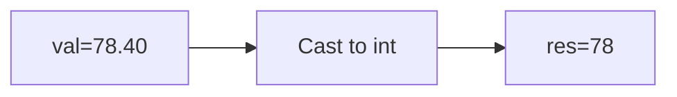

**📖 Penjelasan:**
**Langkah Tracing:**
1. val=78.40.
2. Desimal dihilangkan.
3. Hasil: 78.

---
### Soal 55
```cpp
char ch = 'a';
ch = ch + (-3);
```
**Pertanyaan:**
1. Berapakah hasil akhirnya?
2. Mengapa demikian?

**Jawaban & Diagnosis:**
1. **^**
2. Lihat Tracing.

**Mermaid Flowchart:**
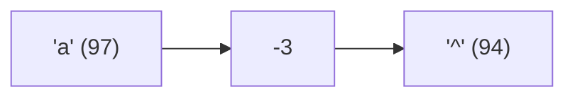

**📖 Penjelasan:**
**Langkah Tracing:**
1. ch='a' (ASCII 97).
2. 97 + (-3) = 94.
3. Hasil: '^'.

---
### Soal 56
```cpp
int n = 45;
int m = 5;
int res = n % m;
```
**Pertanyaan:**
1. Berapakah hasil akhirnya?
2. Mengapa demikian?

**Jawaban & Diagnosis:**
1. **0**
2. Lihat Tracing.

**Mermaid Flowchart:**
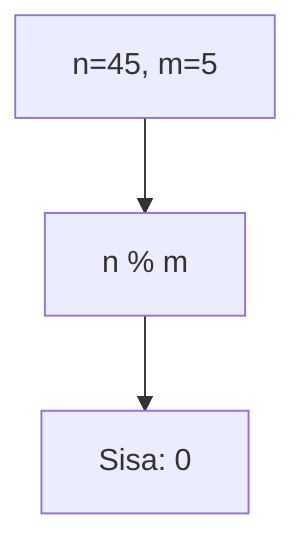

**📖 Penjelasan:**
**Langkah Tracing:**
1. n=45, m=5.
2. 45 dibagi 5 sisa 0.
3. Hasil: 0.

---
### Soal 57
```cpp
int a = 62, y = 5;
int res = a / y;
```
**Pertanyaan:**
1. Berapakah hasil akhirnya?
2. Mengapa demikian?

**Jawaban & Diagnosis:**
1. **12**
2. Lihat Tracing.

**Mermaid Flowchart:**
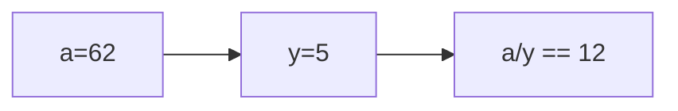

**📖 Penjelasan:**
**Langkah Tracing:**
1. a=62, y=5.
2. 62/5 = 12.40. Karena `int`, desimal dibuang.
3. Hasil: 12.

---
### Soal 58
```cpp
int a = 43, m = 5;
int res = a / m;
```
**Pertanyaan:**
1. Berapakah hasil akhirnya?
2. Mengapa demikian?

**Jawaban & Diagnosis:**
1. **8**
2. Lihat Tracing.

**Mermaid Flowchart:**
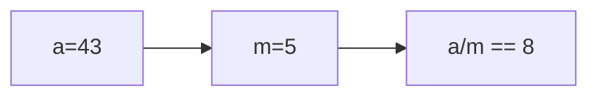

**📖 Penjelasan:**
**Langkah Tracing:**
1. a=43, m=5.
2. 43/5 = 8.60. Karena `int`, desimal dibuang.
3. Hasil: 8.

---
### Soal 59
```cpp
int n = 17;
int m = 10;
int res = n % m;
```
**Pertanyaan:**
1. Berapakah hasil akhirnya?
2. Mengapa demikian?

**Jawaban & Diagnosis:**
1. **7**
2. Lihat Tracing.

**Mermaid Flowchart:**
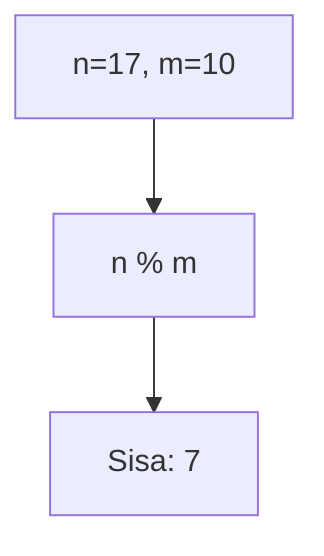

**📖 Penjelasan:**
**Langkah Tracing:**
1. n=17, m=10.
2. 17 dibagi 10 sisa 7.
3. Hasil: 7.

---
### Soal 60
```cpp
int n = 17;
int m = 5;
int res = n % m;
```
**Pertanyaan:**
1. Berapakah hasil akhirnya?
2. Mengapa demikian?

**Jawaban & Diagnosis:**
1. **2**
2. Lihat Tracing.

**Mermaid Flowchart:**
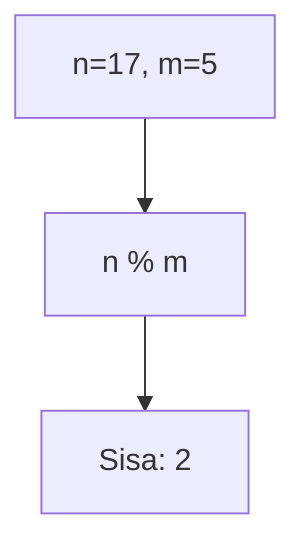

**📖 Penjelasan:**
**Langkah Tracing:**
1. n=17, m=5.
2. 17 dibagi 5 sisa 2.
3. Hasil: 2.

---
### Soal 61
```cpp
char ch = 'a';
ch = ch + (5);
```
**Pertanyaan:**
1. Berapakah hasil akhirnya?
2. Mengapa demikian?

**Jawaban & Diagnosis:**
1. **f**
2. Lihat Tracing.

**Mermaid Flowchart:**
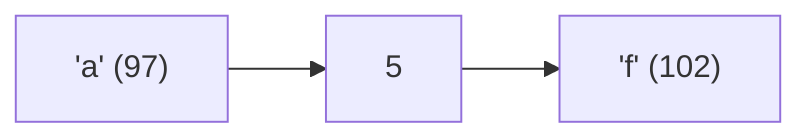

**📖 Penjelasan:**
**Langkah Tracing:**
1. ch='a' (ASCII 97).
2. 97 + (5) = 102.
3. Hasil: 'f'.

---
### Soal 62
```cpp
double val = 73.06;
int res = (int)val;
```
**Pertanyaan:**
1. Berapakah hasil akhirnya?
2. Mengapa demikian?

**Jawaban & Diagnosis:**
1. **73**
2. Lihat Tracing.

**Mermaid Flowchart:**
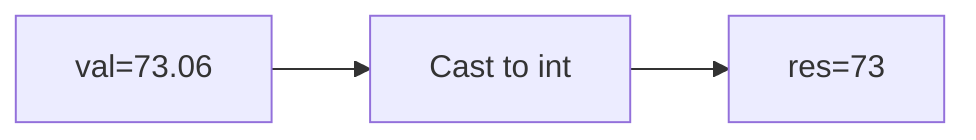

**📖 Penjelasan:**
**Langkah Tracing:**
1. val=73.06.
2. Desimal dihilangkan.
3. Hasil: 73.

---
### Soal 63
```cpp
int n = 12;
int m = 10;
int res = n % m;
```
**Pertanyaan:**
1. Berapakah hasil akhirnya?
2. Mengapa demikian?

**Jawaban & Diagnosis:**
1. **2**
2. Lihat Tracing.

**Mermaid Flowchart:**
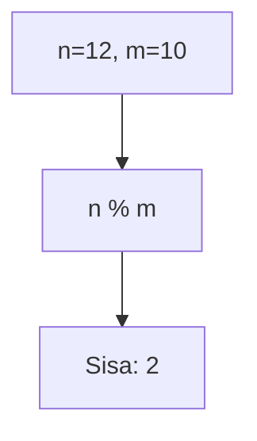

**📖 Penjelasan:**
**Langkah Tracing:**
1. n=12, m=10.
2. 12 dibagi 10 sisa 2.
3. Hasil: 2.

---
### Soal 64
```cpp
int n = 92, b = 2;
int res = n / b;
```
**Pertanyaan:**
1. Berapakah hasil akhirnya?
2. Mengapa demikian?

**Jawaban & Diagnosis:**
1. **46**
2. Lihat Tracing.

**Mermaid Flowchart:**
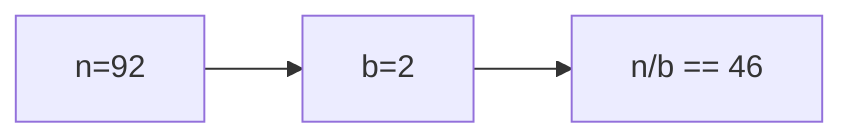

**📖 Penjelasan:**
**Langkah Tracing:**
1. n=92, b=2.
2. 92/2 = 46.00. Karena `int`, desimal dibuang.
3. Hasil: 46.

---
### Soal 65
```cpp
int x = 42, m = 9;
int res = x / m;
```
**Pertanyaan:**
1. Berapakah hasil akhirnya?
2. Mengapa demikian?

**Jawaban & Diagnosis:**
1. **4**
2. Lihat Tracing.

**Mermaid Flowchart:**
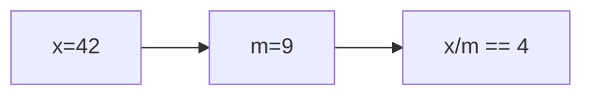

**📖 Penjelasan:**
**Langkah Tracing:**
1. x=42, m=9.
2. 42/9 = 4.67. Karena `int`, desimal dibuang.
3. Hasil: 4.

---
### Soal 66
```cpp
double val = 28.63;
int res = (int)val;
```
**Pertanyaan:**
1. Berapakah hasil akhirnya?
2. Mengapa demikian?

**Jawaban & Diagnosis:**
1. **28**
2. Lihat Tracing.

**Mermaid Flowchart:**
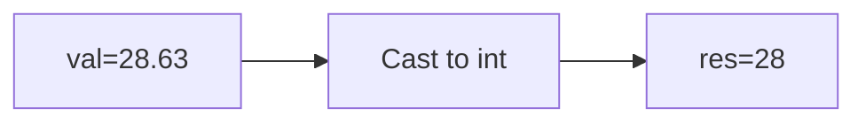

**📖 Penjelasan:**
**Langkah Tracing:**
1. val=28.63.
2. Desimal dihilangkan.
3. Hasil: 28.

---
### Soal 67
```cpp
int a = 88, y = 3;
int res = a / y;
```
**Pertanyaan:**
1. Berapakah hasil akhirnya?
2. Mengapa demikian?

**Jawaban & Diagnosis:**
1. **29**
2. Lihat Tracing.

**Mermaid Flowchart:**
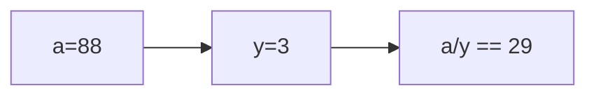

**📖 Penjelasan:**
**Langkah Tracing:**
1. a=88, y=3.
2. 88/3 = 29.33. Karena `int`, desimal dibuang.
3. Hasil: 29.

---
### Soal 68
```cpp
int n = 65, b = 5;
int res = n / b;
```
**Pertanyaan:**
1. Berapakah hasil akhirnya?
2. Mengapa demikian?

**Jawaban & Diagnosis:**
1. **13**
2. Lihat Tracing.

**Mermaid Flowchart:**
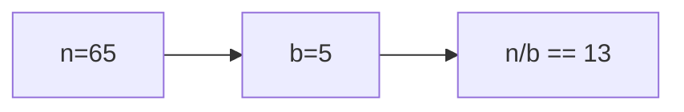

**📖 Penjelasan:**
**Langkah Tracing:**
1. n=65, b=5.
2. 65/5 = 13.00. Karena `int`, desimal dibuang.
3. Hasil: 13.

---
### Soal 69
```cpp
double val = 69.64;
int res = (int)val;
```
**Pertanyaan:**
1. Berapakah hasil akhirnya?
2. Mengapa demikian?

**Jawaban & Diagnosis:**
1. **69**
2. Lihat Tracing.

**Mermaid Flowchart:**
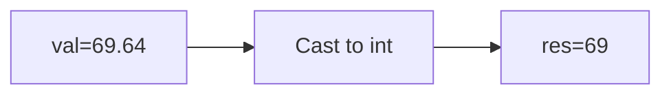

**📖 Penjelasan:**
**Langkah Tracing:**
1. val=69.64.
2. Desimal dihilangkan.
3. Hasil: 69.

---
### Soal 70
```cpp
char ch = 'P';
ch = ch + (3);
```
**Pertanyaan:**
1. Berapakah hasil akhirnya?
2. Mengapa demikian?

**Jawaban & Diagnosis:**
1. **S**
2. Lihat Tracing.

**Mermaid Flowchart:**
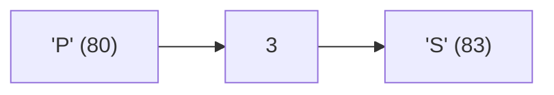

**📖 Penjelasan:**
**Langkah Tracing:**
1. ch='P' (ASCII 80).
2. 80 + (3) = 83.
3. Hasil: 'S'.

---
### Soal 71
```cpp
double val = 38.31;
int res = (int)val;
```
**Pertanyaan:**
1. Berapakah hasil akhirnya?
2. Mengapa demikian?

**Jawaban & Diagnosis:**
1. **38**
2. Lihat Tracing.

**Mermaid Flowchart:**
```mermaid
graph LR
A["val=38.31"] --> B["Cast to int"]
B --> C["res=38"]
```

**📖 Penjelasan:**
**Langkah Tracing:**
1. val=38.31.
2. Desimal dihilangkan.
3. Hasil: 38.

---
### Soal 72
```cpp
double val = 57.46;
int res = (int)val;
```
**Pertanyaan:**
1. Berapakah hasil akhirnya?
2. Mengapa demikian?

**Jawaban & Diagnosis:**
1. **57**
2. Lihat Tracing.

**Mermaid Flowchart:**
```mermaid
graph LR
A["val=57.46"] --> B["Cast to int"]
B --> C["res=57"]
```

**📖 Penjelasan:**
**Langkah Tracing:**
1. val=57.46.
2. Desimal dihilangkan.
3. Hasil: 57.

---
### Soal 73
```cpp
char ch = 'A';
ch = ch + (4);
```
**Pertanyaan:**
1. Berapakah hasil akhirnya?
2. Mengapa demikian?

**Jawaban & Diagnosis:**
1. **E**
2. Lihat Tracing.

**Mermaid Flowchart:**
```mermaid
graph LR
A["'A' (65)"] --> B["4"]
B --> C["'E' (69)"]
```

**📖 Penjelasan:**
**Langkah Tracing:**
1. ch='A' (ASCII 65).
2. 65 + (4) = 69.
3. Hasil: 'E'.

---
### Soal 74
```cpp
char ch = 'a';
ch = ch + (-2);
```
**Pertanyaan:**
1. Berapakah hasil akhirnya?
2. Mengapa demikian?

**Jawaban & Diagnosis:**
1. **_**
2. Lihat Tracing.

**Mermaid Flowchart:**
```mermaid
graph LR
A["'a' (97)"] --> B["-2"]
B --> C["'_' (95)"]
```

**📖 Penjelasan:**
**Langkah Tracing:**
1. ch='a' (ASCII 97).
2. 97 + (-2) = 95.
3. Hasil: '_'.

---
### Soal 75
```cpp
double val = 79.42;
int res = (int)val;
```
**Pertanyaan:**
1. Berapakah hasil akhirnya?
2. Mengapa demikian?

**Jawaban & Diagnosis:**
1. **79**
2. Lihat Tracing.

**Mermaid Flowchart:**
```mermaid
graph LR
A["val=79.42"] --> B["Cast to int"]
B --> C["res=79"]
```

**📖 Penjelasan:**
**Langkah Tracing:**
1. val=79.42.
2. Desimal dihilangkan.
3. Hasil: 79.

---
