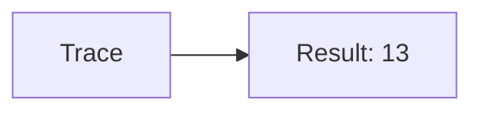
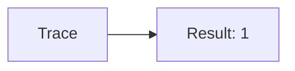
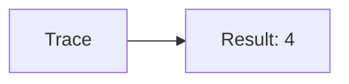
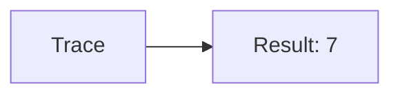
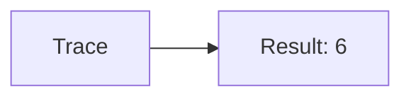
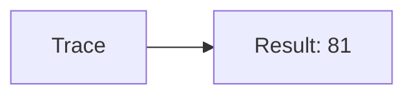
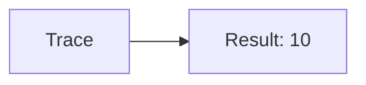

🔙 **[Kembali ke Daftar Soal](./README.md)**

---

# Latihan Soal Part C - Modul 01 - Set 03

### Soal 51
```cpp
// Semen: Casting
double val = 16.71;
int res = (int)val;
```
**Pertanyaan:**
1. Berapakah hasil akhirnya?
2. Deskripsikan alur pikir 'Compiler Manusia' untuk soal ini!

**Jawaban & Diagnosis:**
1. **16**
2. Mengubah 16.71 jadi integer (pangkas koma) jadi 16.

**Mermaid Flowchart:**


---
### Soal 52
```cpp
// Besi: Pembagian
int besi = 79, bagi = 6;
int hasil = besi / bagi;
```
**Pertanyaan:**
1. Berapakah hasil akhirnya?
2. Deskripsikan alur pikir 'Compiler Manusia' untuk soal ini!

**Jawaban & Diagnosis:**
1. **13**
2. Membagi 79 Besi ke 6 bagian. Hasil bulat: 13.

**Mermaid Flowchart:**


---
### Soal 53
```cpp
// Kayu: Modulo
int kayu = 22, bagi = 7;
int sisa = kayu % bagi;
```
**Pertanyaan:**
1. Berapakah hasil akhirnya?
2. Deskripsikan alur pikir 'Compiler Manusia' untuk soal ini!

**Jawaban & Diagnosis:**
1. **1**
2. 22 Kayu dibagi 7 sisa 1.

**Mermaid Flowchart:**


---
### Soal 54
```cpp
// Paku: Casting
double val = 12.21;
int res = (int)val;
```
**Pertanyaan:**
1. Berapakah hasil akhirnya?
2. Deskripsikan alur pikir 'Compiler Manusia' untuk soal ini!

**Jawaban & Diagnosis:**
1. **12**
2. Mengubah 12.21 jadi integer (pangkas koma) jadi 12.

**Mermaid Flowchart:**


---
### Soal 55
```cpp
// Cat: Pembagian
int cat = 32, bagi = 7;
int hasil = cat / bagi;
```
**Pertanyaan:**
1. Berapakah hasil akhirnya?
2. Deskripsikan alur pikir 'Compiler Manusia' untuk soal ini!

**Jawaban & Diagnosis:**
1. **4**
2. Membagi 32 Cat ke 7 bagian. Hasil bulat: 4.

**Mermaid Flowchart:**


---
### Soal 56
```cpp
// Kuas: Modulo
int kuas = 39, bagi = 8;
int sisa = kuas % bagi;
```
**Pertanyaan:**
1. Berapakah hasil akhirnya?
2. Deskripsikan alur pikir 'Compiler Manusia' untuk soal ini!

**Jawaban & Diagnosis:**
1. **7**
2. 39 Kuas dibagi 8 sisa 7.

**Mermaid Flowchart:**


---
### Soal 57
```cpp
// Tang: Casting
double val = 24.61;
int res = (int)val;
```
**Pertanyaan:**
1. Berapakah hasil akhirnya?
2. Deskripsikan alur pikir 'Compiler Manusia' untuk soal ini!

**Jawaban & Diagnosis:**
1. **24**
2. Mengubah 24.61 jadi integer (pangkas koma) jadi 24.

**Mermaid Flowchart:**


---
### Soal 58
```cpp
// Obeng: Pembagian
int obeng = 42, bagi = 6;
int hasil = obeng / bagi;
```
**Pertanyaan:**
1. Berapakah hasil akhirnya?
2. Deskripsikan alur pikir 'Compiler Manusia' untuk soal ini!

**Jawaban & Diagnosis:**
1. **7**
2. Membagi 42 Obeng ke 6 bagian. Hasil bulat: 7.

**Mermaid Flowchart:**


---
### Soal 59
```cpp
// Palu: Modulo
int palu = 54, bagi = 8;
int sisa = palu % bagi;
```
**Pertanyaan:**
1. Berapakah hasil akhirnya?
2. Deskripsikan alur pikir 'Compiler Manusia' untuk soal ini!

**Jawaban & Diagnosis:**
1. **6**
2. 54 Palu dibagi 8 sisa 6.

**Mermaid Flowchart:**


---
### Soal 60
```cpp
// Gergaji: Casting
double val = 81.51;
int res = (int)val;
```
**Pertanyaan:**
1. Berapakah hasil akhirnya?
2. Deskripsikan alur pikir 'Compiler Manusia' untuk soal ini!

**Jawaban & Diagnosis:**
1. **81**
2. Mengubah 81.51 jadi integer (pangkas koma) jadi 81.

**Mermaid Flowchart:**


---
### Soal 61
```cpp
// Bor: Pembagian
int bor = 55, bagi = 3;
int hasil = bor / bagi;
```
**Pertanyaan:**
1. Berapakah hasil akhirnya?
2. Deskripsikan alur pikir 'Compiler Manusia' untuk soal ini!

**Jawaban & Diagnosis:**
1. **18**
2. Membagi 55 Bor ke 3 bagian. Hasil bulat: 18.

**Mermaid Flowchart:**


---
### Soal 62
```cpp
// Baut: Modulo
int baut = 51, bagi = 5;
int sisa = baut % bagi;
```
**Pertanyaan:**
1. Berapakah hasil akhirnya?
2. Deskripsikan alur pikir 'Compiler Manusia' untuk soal ini!

**Jawaban & Diagnosis:**
1. **1**
2. 51 Baut dibagi 5 sisa 1.

**Mermaid Flowchart:**


---
### Soal 63
```cpp
// Sekrup: Casting
double val = 10.51;
int res = (int)val;
```
**Pertanyaan:**
1. Berapakah hasil akhirnya?
2. Deskripsikan alur pikir 'Compiler Manusia' untuk soal ini!

**Jawaban & Diagnosis:**
1. **10**
2. Mengubah 10.51 jadi integer (pangkas koma) jadi 10.

**Mermaid Flowchart:**


---
### Soal 64
```cpp
// KunciInggris: Pembagian
int kunciinggris = 66, bagi = 3;
int hasil = kunciinggris / bagi;
```
**Pertanyaan:**
1. Berapakah hasil akhirnya?
2. Deskripsikan alur pikir 'Compiler Manusia' untuk soal ini!

**Jawaban & Diagnosis:**
1. **22**
2. Membagi 66 KunciInggris ke 3 bagian. Hasil bulat: 22.

**Mermaid Flowchart:**


---
### Soal 65
```cpp
// Gembok: Modulo
int gembok = 13, bagi = 2;
int sisa = gembok % bagi;
```
**Pertanyaan:**
1. Berapakah hasil akhirnya?
2. Deskripsikan alur pikir 'Compiler Manusia' untuk soal ini!

**Jawaban & Diagnosis:**
1. **1**
2. 13 Gembok dibagi 2 sisa 1.

**Mermaid Flowchart:**


---
### Soal 66
```cpp
// Rantai: Casting
double val = 37.51;
int res = (int)val;
```
**Pertanyaan:**
1. Berapakah hasil akhirnya?
2. Deskripsikan alur pikir 'Compiler Manusia' untuk soal ini!

**Jawaban & Diagnosis:**
1. **37**
2. Mengubah 37.51 jadi integer (pangkas koma) jadi 37.

**Mermaid Flowchart:**


---
### Soal 67
```cpp
// Tali: Pembagian
int tali = 24, bagi = 6;
int hasil = tali / bagi;
```
**Pertanyaan:**
1. Berapakah hasil akhirnya?
2. Deskripsikan alur pikir 'Compiler Manusia' untuk soal ini!

**Jawaban & Diagnosis:**
1. **4**
2. Membagi 24 Tali ke 6 bagian. Hasil bulat: 4.

**Mermaid Flowchart:**


---
### Soal 68
```cpp
// Karet: Modulo
int karet = 35, bagi = 2;
int sisa = karet % bagi;
```
**Pertanyaan:**
1. Berapakah hasil akhirnya?
2. Deskripsikan alur pikir 'Compiler Manusia' untuk soal ini!

**Jawaban & Diagnosis:**
1. **1**
2. 35 Karet dibagi 2 sisa 1.

**Mermaid Flowchart:**


---
### Soal 69
```cpp
// Plastik: Casting
double val = 28.21;
int res = (int)val;
```
**Pertanyaan:**
1. Berapakah hasil akhirnya?
2. Deskripsikan alur pikir 'Compiler Manusia' untuk soal ini!

**Jawaban & Diagnosis:**
1. **28**
2. Mengubah 28.21 jadi integer (pangkas koma) jadi 28.

**Mermaid Flowchart:**


---
### Soal 70
```cpp
// Kertas: Pembagian
int kertas = 84, bagi = 7;
int hasil = kertas / bagi;
```
**Pertanyaan:**
1. Berapakah hasil akhirnya?
2. Deskripsikan alur pikir 'Compiler Manusia' untuk soal ini!

**Jawaban & Diagnosis:**
1. **12**
2. Membagi 84 Kertas ke 7 bagian. Hasil bulat: 12.

**Mermaid Flowchart:**


---
### Soal 71
```cpp
// Kardus: Modulo
int kardus = 67, bagi = 4;
int sisa = kardus % bagi;
```
**Pertanyaan:**
1. Berapakah hasil akhirnya?
2. Deskripsikan alur pikir 'Compiler Manusia' untuk soal ini!

**Jawaban & Diagnosis:**
1. **3**
2. 67 Kardus dibagi 4 sisa 3.

**Mermaid Flowchart:**
```mermaid
graph LR
A[Trace] --> B[Result: 3]
```

---
### Soal 72
```cpp
// Plastik: Casting
double val = 23.21;
int res = (int)val;
```
**Pertanyaan:**
1. Berapakah hasil akhirnya?
2. Deskripsikan alur pikir 'Compiler Manusia' untuk soal ini!

**Jawaban & Diagnosis:**
1. **23**
2. Mengubah 23.21 jadi integer (pangkas koma) jadi 23.

**Mermaid Flowchart:**
```mermaid
graph LR
A[Trace] --> B[Result: 23]
```

---
### Soal 73
```cpp
// Kaca: Pembagian
int kaca = 45, bagi = 2;
int hasil = kaca / bagi;
```
**Pertanyaan:**
1. Berapakah hasil akhirnya?
2. Deskripsikan alur pikir 'Compiler Manusia' untuk soal ini!

**Jawaban & Diagnosis:**
1. **22**
2. Membagi 45 Kaca ke 2 bagian. Hasil bulat: 22.

**Mermaid Flowchart:**
```mermaid
graph LR
A[Trace] --> B[Result: 22]
```

---
### Soal 74
```cpp
// Logam: Modulo
int logam = 24, bagi = 3;
int sisa = logam % bagi;
```
**Pertanyaan:**
1. Berapakah hasil akhirnya?
2. Deskripsikan alur pikir 'Compiler Manusia' untuk soal ini!

**Jawaban & Diagnosis:**
1. **0**
2. 24 Logam dibagi 3 sisa 0.

**Mermaid Flowchart:**
```mermaid
graph LR
A[Trace] --> B[Result: 0]
```

---
### Soal 75
```cpp
// Kain: Casting
double val = 53.71;
int res = (int)val;
```
**Pertanyaan:**
1. Berapakah hasil akhirnya?
2. Deskripsikan alur pikir 'Compiler Manusia' untuk soal ini!

**Jawaban & Diagnosis:**
1. **53**
2. Mengubah 53.71 jadi integer (pangkas koma) jadi 53.

**Mermaid Flowchart:**
```mermaid
graph LR
A[Trace] --> B[Result: 53]
```

---
