🔙 **[Kembali ke Daftar Soal](./README.md)**

---

# Latihan Soal Part C - Modul 01 - Set 04

### Soal 76
```cpp
int stok_buku = 46;
int rak = 4;
int sisa_buku = stok_buku % rak;
```
**Pertanyaan:**
1. Berapakah hasil akhirnya?
2. Deskripsikan langkah robot compiler saat memproses kode ini!

**Jawaban & Diagnosis:**
1. **2**
2. Baca bagian 'Analisis Mendalam' di bawah.

**Mermaid Flowchart:**
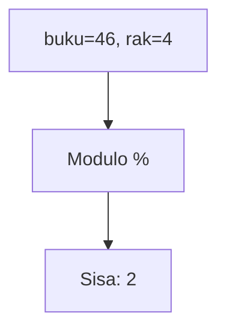

**📖 Penjelasan Komprehensif:**
**Analisis Mendalam (Compiler Manusia):**
1. **Konteks**: Menyusun 46 buku ke 4 rak secara merata.
2. **Mekanisme Modulo**: Operator `%` bukan menghitung hasil bagi, tapi sisa yang tidak muat masuk rak.
3. **Perhitungan**: 46 dibagi 4 sisa **2**.
4. **Hasil Akhir**: `sisa_buku` adalah **2**.

---
### Soal 77
```cpp
char huruf_awal = 'B';
char kode_rahasia = huruf_awal + 2;
```
**Pertanyaan:**
1. Berapakah hasil akhirnya?
2. Deskripsikan langkah robot compiler saat memproses kode ini!

**Jawaban & Diagnosis:**
1. **D**
2. Baca bagian 'Analisis Mendalam' di bawah.

**Mermaid Flowchart:**
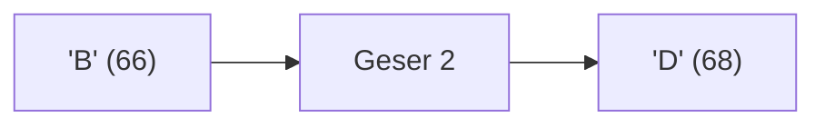

**📖 Penjelasan Komprehensif:**
**Analisis Mendalam (Compiler Manusia):**
1. **Batin Karakter**: Huruf 'B' memiliki nilai ASCII **66**.
2. **Operasi Geser**: Menambah huruf dengan angka akan menggeser posisinya di tabel ASCII: 66 + 2 = 68.
3. **Identitas Baru**: Angka 68 adalah identitas untuk huruf **'D'**.
4. **Hasil Akhir**: `kode_rahasia` berisi **'D'**.

---
### Soal 78
```cpp
double saldo_bank = 46.22;
int uang_kertas = (int)saldo_bank;
```
**Pertanyaan:**
1. Berapakah hasil akhirnya?
2. Deskripsikan langkah robot compiler saat memproses kode ini!

**Jawaban & Diagnosis:**
1. **46**
2. Baca bagian 'Analisis Mendalam' di bawah.

**Mermaid Flowchart:**
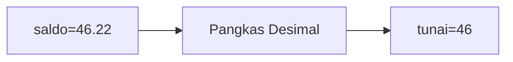

**📖 Penjelasan Komprehensif:**
**Analisis Mendalam (Compiler Manusia):**
1. **Gelas ke Laci**: `saldo_bank` adalah `double` (angka berkoma).
2. **Type Casting**: Perintah `(int)` secara paksa mengubahnya menjadi bilangan bulat.
3. **Efek**: Bagian desimal `46.22` menderita pelenyapan.
4. **Hasil Akhir**: `uang_kertas` berisi **46**.

---
### Soal 79
```cpp
double saldo_bank = 30.30;
int uang_kertas = (int)saldo_bank;
```
**Pertanyaan:**
1. Berapakah hasil akhirnya?
2. Deskripsikan langkah robot compiler saat memproses kode ini!

**Jawaban & Diagnosis:**
1. **30**
2. Baca bagian 'Analisis Mendalam' di bawah.

**Mermaid Flowchart:**
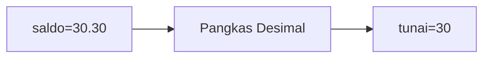

**📖 Penjelasan Komprehensif:**
**Analisis Mendalam (Compiler Manusia):**
1. **Gelas ke Laci**: `saldo_bank` adalah `double` (angka berkoma).
2. **Type Casting**: Perintah `(int)` secara paksa mengubahnya menjadi bilangan bulat.
3. **Efek**: Bagian desimal `30.30` menderita pelenyapan.
4. **Hasil Akhir**: `uang_kertas` berisi **30**.

---
### Soal 80
```cpp
int stok_buku = 53;
int rak = 4;
int sisa_buku = stok_buku % rak;
```
**Pertanyaan:**
1. Berapakah hasil akhirnya?
2. Deskripsikan langkah robot compiler saat memproses kode ini!

**Jawaban & Diagnosis:**
1. **1**
2. Baca bagian 'Analisis Mendalam' di bawah.

**Mermaid Flowchart:**


**📖 Penjelasan Komprehensif:**
**Analisis Mendalam (Compiler Manusia):**
1. **Konteks**: Menyusun 53 buku ke 4 rak secara merata.
2. **Mekanisme Modulo**: Operator `%` bukan menghitung hasil bagi, tapi sisa yang tidak muat masuk rak.
3. **Perhitungan**: 53 dibagi 4 sisa **1**.
4. **Hasil Akhir**: `sisa_buku` adalah **1**.

---
### Soal 81
```cpp
int stok_buku = 47;
int rak = 4;
int sisa_buku = stok_buku % rak;
```
**Pertanyaan:**
1. Berapakah hasil akhirnya?
2. Deskripsikan langkah robot compiler saat memproses kode ini!

**Jawaban & Diagnosis:**
1. **3**
2. Baca bagian 'Analisis Mendalam' di bawah.

**Mermaid Flowchart:**
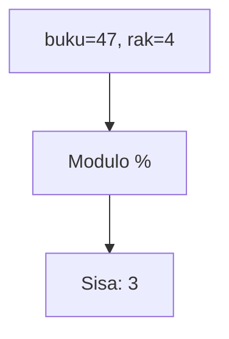

**📖 Penjelasan Komprehensif:**
**Analisis Mendalam (Compiler Manusia):**
1. **Konteks**: Menyusun 47 buku ke 4 rak secara merata.
2. **Mekanisme Modulo**: Operator `%` bukan menghitung hasil bagi, tapi sisa yang tidak muat masuk rak.
3. **Perhitungan**: 47 dibagi 4 sisa **3**.
4. **Hasil Akhir**: `sisa_buku` adalah **3**.

---
### Soal 82
```cpp
double saldo_bank = 22.00;
int uang_kertas = (int)saldo_bank;
```
**Pertanyaan:**
1. Berapakah hasil akhirnya?
2. Deskripsikan langkah robot compiler saat memproses kode ini!

**Jawaban & Diagnosis:**
1. **22**
2. Baca bagian 'Analisis Mendalam' di bawah.

**Mermaid Flowchart:**
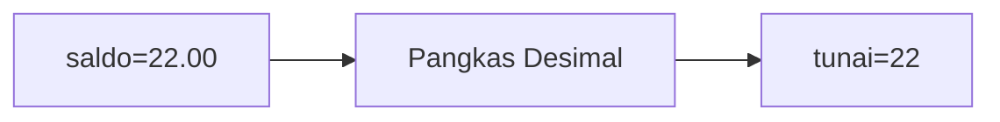

**📖 Penjelasan Komprehensif:**
**Analisis Mendalam (Compiler Manusia):**
1. **Gelas ke Laci**: `saldo_bank` adalah `double` (angka berkoma).
2. **Type Casting**: Perintah `(int)` secara paksa mengubahnya menjadi bilangan bulat.
3. **Efek**: Bagian desimal `22.00` menderita pelenyapan.
4. **Hasil Akhir**: `uang_kertas` berisi **22**.

---
### Soal 83
```cpp
double saldo_bank = 35.78;
int uang_kertas = (int)saldo_bank;
```
**Pertanyaan:**
1. Berapakah hasil akhirnya?
2. Deskripsikan langkah robot compiler saat memproses kode ini!

**Jawaban & Diagnosis:**
1. **35**
2. Baca bagian 'Analisis Mendalam' di bawah.

**Mermaid Flowchart:**
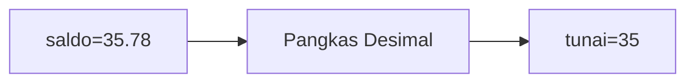

**📖 Penjelasan Komprehensif:**
**Analisis Mendalam (Compiler Manusia):**
1. **Gelas ke Laci**: `saldo_bank` adalah `double` (angka berkoma).
2. **Type Casting**: Perintah `(int)` secara paksa mengubahnya menjadi bilangan bulat.
3. **Efek**: Bagian desimal `35.78` menderita pelenyapan.
4. **Hasil Akhir**: `uang_kertas` berisi **35**.

---
### Soal 84
```cpp
double saldo_bank = 39.04;
int uang_kertas = (int)saldo_bank;
```
**Pertanyaan:**
1. Berapakah hasil akhirnya?
2. Deskripsikan langkah robot compiler saat memproses kode ini!

**Jawaban & Diagnosis:**
1. **39**
2. Baca bagian 'Analisis Mendalam' di bawah.

**Mermaid Flowchart:**
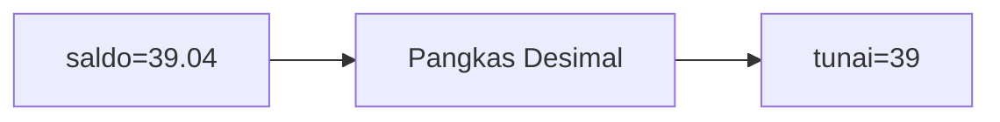

**📖 Penjelasan Komprehensif:**
**Analisis Mendalam (Compiler Manusia):**
1. **Gelas ke Laci**: `saldo_bank` adalah `double` (angka berkoma).
2. **Type Casting**: Perintah `(int)` secara paksa mengubahnya menjadi bilangan bulat.
3. **Efek**: Bagian desimal `39.04` menderita pelenyapan.
4. **Hasil Akhir**: `uang_kertas` berisi **39**.

---
### Soal 85
```cpp
int roti = 50;
int anak = 9;
int dapet_tiap_anak = roti / anak;
```
**Pertanyaan:**
1. Berapakah hasil akhirnya?
2. Deskripsikan langkah robot compiler saat memproses kode ini!

**Jawaban & Diagnosis:**
1. **5**
2. Baca bagian 'Analisis Mendalam' di bawah.

**Mermaid Flowchart:**
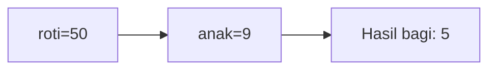

**📖 Penjelasan Komprehensif:**
**Analisis Mendalam (Compiler Manusia):**
1. **Inisialisasi**: Pak Dengklek punya `roti` sebanyak 50 dan ingin dibagi ke 9 `anak`.
2. **Operasi Pembagian**: Rumus `roti / anak` dijalankan. Secara matematis hasilnya 5.56.
3. **Hukum Tipe Data**: Karena hasilnya disimpan ke loker `int`, C++ membuang sisa 5 biji dan hanya mengambil bagian bulatnya.
4. **Hasil Akhir**: `dapet_tiap_anak` bernilai **5**.

---
### Soal 86
```cpp
int permen = 62;
int anak = 9;
int dapet_tiap_anak = permen / anak;
```
**Pertanyaan:**
1. Berapakah hasil akhirnya?
2. Deskripsikan langkah robot compiler saat memproses kode ini!

**Jawaban & Diagnosis:**
1. **6**
2. Baca bagian 'Analisis Mendalam' di bawah.

**Mermaid Flowchart:**
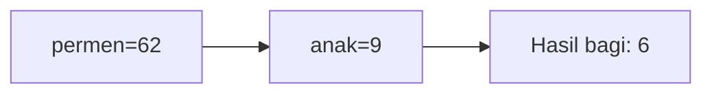

**📖 Penjelasan Komprehensif:**
**Analisis Mendalam (Compiler Manusia):**
1. **Inisialisasi**: Pak Dengklek punya `permen` sebanyak 62 dan ingin dibagi ke 9 `anak`.
2. **Operasi Pembagian**: Rumus `permen / anak` dijalankan. Secara matematis hasilnya 6.89.
3. **Hukum Tipe Data**: Karena hasilnya disimpan ke loker `int`, C++ membuang sisa 8 biji dan hanya mengambil bagian bulatnya.
4. **Hasil Akhir**: `dapet_tiap_anak` bernilai **6**.

---
### Soal 87
```cpp
int kelereng = 20;
int anak = 6;
int dapet_tiap_anak = kelereng / anak;
```
**Pertanyaan:**
1. Berapakah hasil akhirnya?
2. Deskripsikan langkah robot compiler saat memproses kode ini!

**Jawaban & Diagnosis:**
1. **3**
2. Baca bagian 'Analisis Mendalam' di bawah.

**Mermaid Flowchart:**
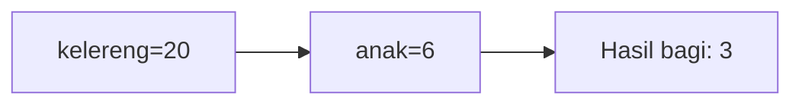

**📖 Penjelasan Komprehensif:**
**Analisis Mendalam (Compiler Manusia):**
1. **Inisialisasi**: Pak Dengklek punya `kelereng` sebanyak 20 dan ingin dibagi ke 6 `anak`.
2. **Operasi Pembagian**: Rumus `kelereng / anak` dijalankan. Secara matematis hasilnya 3.33.
3. **Hukum Tipe Data**: Karena hasilnya disimpan ke loker `int`, C++ membuang sisa 2 biji dan hanya mengambil bagian bulatnya.
4. **Hasil Akhir**: `dapet_tiap_anak` bernilai **3**.

---
### Soal 88
```cpp
int roti = 60;
int anak = 8;
int dapet_tiap_anak = roti / anak;
```
**Pertanyaan:**
1. Berapakah hasil akhirnya?
2. Deskripsikan langkah robot compiler saat memproses kode ini!

**Jawaban & Diagnosis:**
1. **7**
2. Baca bagian 'Analisis Mendalam' di bawah.

**Mermaid Flowchart:**
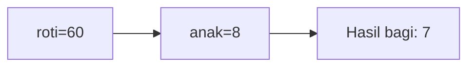

**📖 Penjelasan Komprehensif:**
**Analisis Mendalam (Compiler Manusia):**
1. **Inisialisasi**: Pak Dengklek punya `roti` sebanyak 60 dan ingin dibagi ke 8 `anak`.
2. **Operasi Pembagian**: Rumus `roti / anak` dijalankan. Secara matematis hasilnya 7.50.
3. **Hukum Tipe Data**: Karena hasilnya disimpan ke loker `int`, C++ membuang sisa 4 biji dan hanya mengambil bagian bulatnya.
4. **Hasil Akhir**: `dapet_tiap_anak` bernilai **7**.

---
### Soal 89
```cpp
char huruf_awal = 'B';
char kode_rahasia = huruf_awal + 2;
```
**Pertanyaan:**
1. Berapakah hasil akhirnya?
2. Deskripsikan langkah robot compiler saat memproses kode ini!

**Jawaban & Diagnosis:**
1. **D**
2. Baca bagian 'Analisis Mendalam' di bawah.

**Mermaid Flowchart:**


**📖 Penjelasan Komprehensif:**
**Analisis Mendalam (Compiler Manusia):**
1. **Batin Karakter**: Huruf 'B' memiliki nilai ASCII **66**.
2. **Operasi Geser**: Menambah huruf dengan angka akan menggeser posisinya di tabel ASCII: 66 + 2 = 68.
3. **Identitas Baru**: Angka 68 adalah identitas untuk huruf **'D'**.
4. **Hasil Akhir**: `kode_rahasia` berisi **'D'**.

---
### Soal 90
```cpp
int kelereng = 24;
int anak = 2;
int dapet_tiap_anak = kelereng / anak;
```
**Pertanyaan:**
1. Berapakah hasil akhirnya?
2. Deskripsikan langkah robot compiler saat memproses kode ini!

**Jawaban & Diagnosis:**
1. **12**
2. Baca bagian 'Analisis Mendalam' di bawah.

**Mermaid Flowchart:**
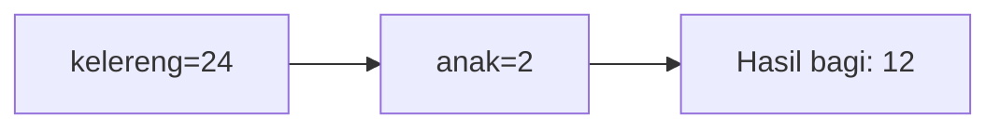

**📖 Penjelasan Komprehensif:**
**Analisis Mendalam (Compiler Manusia):**
1. **Inisialisasi**: Pak Dengklek punya `kelereng` sebanyak 24 dan ingin dibagi ke 2 `anak`.
2. **Operasi Pembagian**: Rumus `kelereng / anak` dijalankan. Secara matematis hasilnya 12.00.
3. **Hukum Tipe Data**: Karena hasilnya disimpan ke loker `int`, C++ membuang sisa 0 biji dan hanya mengambil bagian bulatnya.
4. **Hasil Akhir**: `dapet_tiap_anak` bernilai **12**.

---
### Soal 91
```cpp
char huruf_awal = 'a';
char kode_rahasia = huruf_awal + 2;
```
**Pertanyaan:**
1. Berapakah hasil akhirnya?
2. Deskripsikan langkah robot compiler saat memproses kode ini!

**Jawaban & Diagnosis:**
1. **c**
2. Baca bagian 'Analisis Mendalam' di bawah.

**Mermaid Flowchart:**
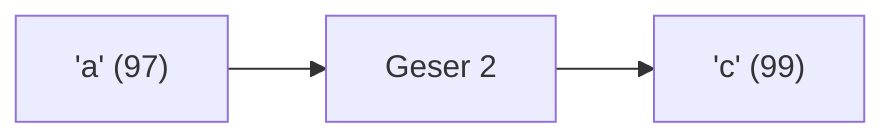

**📖 Penjelasan Komprehensif:**
**Analisis Mendalam (Compiler Manusia):**
1. **Batin Karakter**: Huruf 'a' memiliki nilai ASCII **97**.
2. **Operasi Geser**: Menambah huruf dengan angka akan menggeser posisinya di tabel ASCII: 97 + 2 = 99.
3. **Identitas Baru**: Angka 99 adalah identitas untuk huruf **'c'**.
4. **Hasil Akhir**: `kode_rahasia` berisi **'c'**.

---
### Soal 92
```cpp
char huruf_awal = 'B';
char kode_rahasia = huruf_awal + 4;
```
**Pertanyaan:**
1. Berapakah hasil akhirnya?
2. Deskripsikan langkah robot compiler saat memproses kode ini!

**Jawaban & Diagnosis:**
1. **F**
2. Baca bagian 'Analisis Mendalam' di bawah.

**Mermaid Flowchart:**
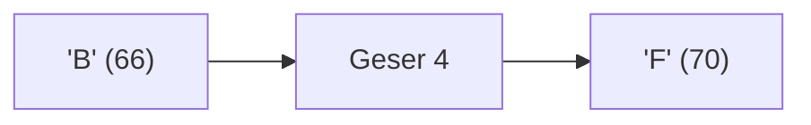

**📖 Penjelasan Komprehensif:**
**Analisis Mendalam (Compiler Manusia):**
1. **Batin Karakter**: Huruf 'B' memiliki nilai ASCII **66**.
2. **Operasi Geser**: Menambah huruf dengan angka akan menggeser posisinya di tabel ASCII: 66 + 4 = 70.
3. **Identitas Baru**: Angka 70 adalah identitas untuk huruf **'F'**.
4. **Hasil Akhir**: `kode_rahasia` berisi **'F'**.

---
### Soal 93
```cpp
int roti = 73;
int anak = 5;
int dapet_tiap_anak = roti / anak;
```
**Pertanyaan:**
1. Berapakah hasil akhirnya?
2. Deskripsikan langkah robot compiler saat memproses kode ini!

**Jawaban & Diagnosis:**
1. **14**
2. Baca bagian 'Analisis Mendalam' di bawah.

**Mermaid Flowchart:**
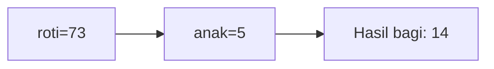

**📖 Penjelasan Komprehensif:**
**Analisis Mendalam (Compiler Manusia):**
1. **Inisialisasi**: Pak Dengklek punya `roti` sebanyak 73 dan ingin dibagi ke 5 `anak`.
2. **Operasi Pembagian**: Rumus `roti / anak` dijalankan. Secara matematis hasilnya 14.60.
3. **Hukum Tipe Data**: Karena hasilnya disimpan ke loker `int`, C++ membuang sisa 3 biji dan hanya mengambil bagian bulatnya.
4. **Hasil Akhir**: `dapet_tiap_anak` bernilai **14**.

---
### Soal 94
```cpp
int stok_buku = 37;
int rak = 4;
int sisa_buku = stok_buku % rak;
```
**Pertanyaan:**
1. Berapakah hasil akhirnya?
2. Deskripsikan langkah robot compiler saat memproses kode ini!

**Jawaban & Diagnosis:**
1. **1**
2. Baca bagian 'Analisis Mendalam' di bawah.

**Mermaid Flowchart:**


**📖 Penjelasan Komprehensif:**
**Analisis Mendalam (Compiler Manusia):**
1. **Konteks**: Menyusun 37 buku ke 4 rak secara merata.
2. **Mekanisme Modulo**: Operator `%` bukan menghitung hasil bagi, tapi sisa yang tidak muat masuk rak.
3. **Perhitungan**: 37 dibagi 4 sisa **1**.
4. **Hasil Akhir**: `sisa_buku` adalah **1**.

---
### Soal 95
```cpp
int stok_buku = 47;
int rak = 4;
int sisa_buku = stok_buku % rak;
```
**Pertanyaan:**
1. Berapakah hasil akhirnya?
2. Deskripsikan langkah robot compiler saat memproses kode ini!

**Jawaban & Diagnosis:**
1. **3**
2. Baca bagian 'Analisis Mendalam' di bawah.

**Mermaid Flowchart:**


**📖 Penjelasan Komprehensif:**
**Analisis Mendalam (Compiler Manusia):**
1. **Konteks**: Menyusun 47 buku ke 4 rak secara merata.
2. **Mekanisme Modulo**: Operator `%` bukan menghitung hasil bagi, tapi sisa yang tidak muat masuk rak.
3. **Perhitungan**: 47 dibagi 4 sisa **3**.
4. **Hasil Akhir**: `sisa_buku` adalah **3**.

---
### Soal 96
```cpp
char huruf_awal = 'A';
char kode_rahasia = huruf_awal + 2;
```
**Pertanyaan:**
1. Berapakah hasil akhirnya?
2. Deskripsikan langkah robot compiler saat memproses kode ini!

**Jawaban & Diagnosis:**
1. **C**
2. Baca bagian 'Analisis Mendalam' di bawah.

**Mermaid Flowchart:**
```mermaid
graph LR
A["'A' (65)"] --> B["Geser 2"]
B --> C["'C' (67)"]
```

**📖 Penjelasan Komprehensif:**
**Analisis Mendalam (Compiler Manusia):**
1. **Batin Karakter**: Huruf 'A' memiliki nilai ASCII **65**.
2. **Operasi Geser**: Menambah huruf dengan angka akan menggeser posisinya di tabel ASCII: 65 + 2 = 67.
3. **Identitas Baru**: Angka 67 adalah identitas untuk huruf **'C'**.
4. **Hasil Akhir**: `kode_rahasia` berisi **'C'**.

---
### Soal 97
```cpp
int stok_buku = 74;
int rak = 4;
int sisa_buku = stok_buku % rak;
```
**Pertanyaan:**
1. Berapakah hasil akhirnya?
2. Deskripsikan langkah robot compiler saat memproses kode ini!

**Jawaban & Diagnosis:**
1. **2**
2. Baca bagian 'Analisis Mendalam' di bawah.

**Mermaid Flowchart:**
```mermaid
graph TD
A["buku=74, rak=4"] --> B["Modulo %"]
B --> C["Sisa: 2"]
```

**📖 Penjelasan Komprehensif:**
**Analisis Mendalam (Compiler Manusia):**
1. **Konteks**: Menyusun 74 buku ke 4 rak secara merata.
2. **Mekanisme Modulo**: Operator `%` bukan menghitung hasil bagi, tapi sisa yang tidak muat masuk rak.
3. **Perhitungan**: 74 dibagi 4 sisa **2**.
4. **Hasil Akhir**: `sisa_buku` adalah **2**.

---
### Soal 98
```cpp
int roti = 34;
int anak = 4;
int dapet_tiap_anak = roti / anak;
```
**Pertanyaan:**
1. Berapakah hasil akhirnya?
2. Deskripsikan langkah robot compiler saat memproses kode ini!

**Jawaban & Diagnosis:**
1. **8**
2. Baca bagian 'Analisis Mendalam' di bawah.

**Mermaid Flowchart:**
```mermaid
graph LR
A["roti=34"] --> B["anak=4"]
B --> C["Hasil bagi: 8"]
```

**📖 Penjelasan Komprehensif:**
**Analisis Mendalam (Compiler Manusia):**
1. **Inisialisasi**: Pak Dengklek punya `roti` sebanyak 34 dan ingin dibagi ke 4 `anak`.
2. **Operasi Pembagian**: Rumus `roti / anak` dijalankan. Secara matematis hasilnya 8.50.
3. **Hukum Tipe Data**: Karena hasilnya disimpan ke loker `int`, C++ membuang sisa 2 biji dan hanya mengambil bagian bulatnya.
4. **Hasil Akhir**: `dapet_tiap_anak` bernilai **8**.

---
### Soal 99
```cpp
int stok_buku = 39;
int rak = 7;
int sisa_buku = stok_buku % rak;
```
**Pertanyaan:**
1. Berapakah hasil akhirnya?
2. Deskripsikan langkah robot compiler saat memproses kode ini!

**Jawaban & Diagnosis:**
1. **4**
2. Baca bagian 'Analisis Mendalam' di bawah.

**Mermaid Flowchart:**
```mermaid
graph TD
A["buku=39, rak=7"] --> B["Modulo %"]
B --> C["Sisa: 4"]
```

**📖 Penjelasan Komprehensif:**
**Analisis Mendalam (Compiler Manusia):**
1. **Konteks**: Menyusun 39 buku ke 7 rak secara merata.
2. **Mekanisme Modulo**: Operator `%` bukan menghitung hasil bagi, tapi sisa yang tidak muat masuk rak.
3. **Perhitungan**: 39 dibagi 7 sisa **4**.
4. **Hasil Akhir**: `sisa_buku` adalah **4**.

---
### Soal 100
```cpp
int permen = 85;
int anak = 8;
int dapet_tiap_anak = permen / anak;
```
**Pertanyaan:**
1. Berapakah hasil akhirnya?
2. Deskripsikan langkah robot compiler saat memproses kode ini!

**Jawaban & Diagnosis:**
1. **10**
2. Baca bagian 'Analisis Mendalam' di bawah.

**Mermaid Flowchart:**
```mermaid
graph LR
A["permen=85"] --> B["anak=8"]
B --> C["Hasil bagi: 10"]
```

**📖 Penjelasan Komprehensif:**
**Analisis Mendalam (Compiler Manusia):**
1. **Inisialisasi**: Pak Dengklek punya `permen` sebanyak 85 dan ingin dibagi ke 8 `anak`.
2. **Operasi Pembagian**: Rumus `permen / anak` dijalankan. Secara matematis hasilnya 10.62.
3. **Hukum Tipe Data**: Karena hasilnya disimpan ke loker `int`, C++ membuang sisa 5 biji dan hanya mengambil bagian bulatnya.
4. **Hasil Akhir**: `dapet_tiap_anak` bernilai **10**.

---
