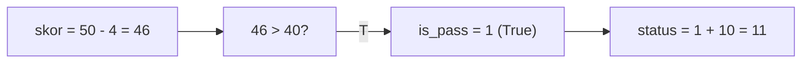
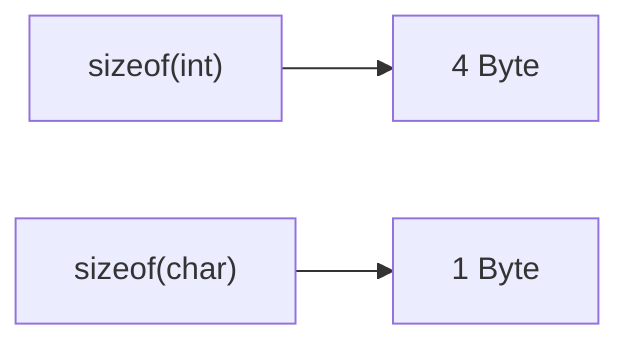
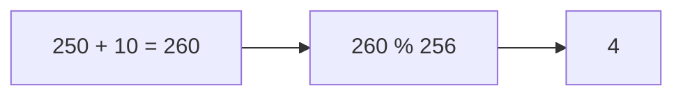
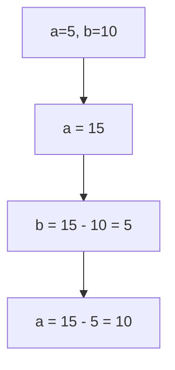
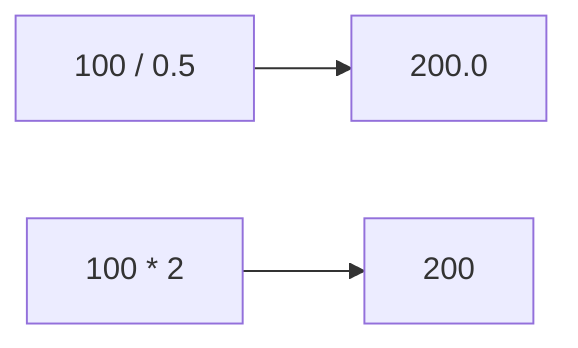
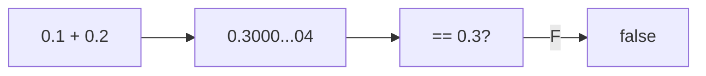
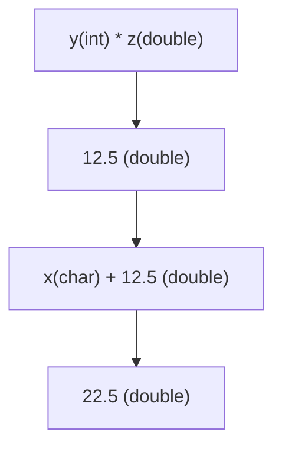
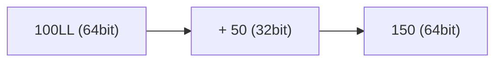
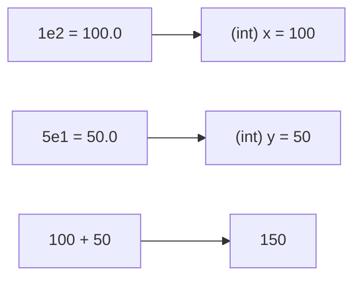

		🔙 **[Kembali ke Daftar Soal](./README.md)**

---

# Latihan Soal Part C - Modul 01 - Set 04 (Premium Edition)

---

### Soal 31: Logika Ranking (Boolean Math)
```cpp
// Benar +10, Salah -2
int benar = 5, salah = 2;
int skor = (benar * 10) - (salah * 2);
bool is_pass = (skor > 40);
int status = is_pass + 10;
```
**Pertanyaan:**
1. Berapakah nilai `skor`?
2. Berapakah nilai `status`?

<details>
<summary><b>Klik untuk Lihat Jawaban & Diagnosis</b></summary>

**Mermaid Flowchart:**


**Jawaban:**
1. **46**
2. **11** (True (1) + 10)

**📖 Analisis Mendalam (Step-by-Step):**
1. Hirarki komputasi beroperasi merajut ekuasi skor ujian: `(5 * 10) - (2 * 2) = 50 - 4 = 46`. Angka 46 diistirahatkan utuh di kurungan `int skor`.
2. Di babak penyekatan pias evaluasi, variabel rasional predikat Boolean memanggil validasi syarat `is_pass = (46 > 40)`. Pertanyaan rasional "Apakah 46 lebih megah dari 40?" dibalas dengan aklamasi ketukan palu mutlak **`true`** oleh hakim kompilator mesin.
3. Saat wujud teks fatamorgana `true` takdirnya diseret menembus batas kandang deklarasi penjumlahan tipe *integer* memproses operasi `is_pass + 10`, C++ mendiktekan hukuman taklid dewa asimilasi *Implicit Type Conversion*. Topeng teks `true` dilucuti paksa untuk dikembalikan ke cetakan kodrat roh biner murni sejati absolutnya, yakni angka biner suci bernilai genetik genap murni **`1`**.
4. Terakhir operasi aritmatikal menyeksekusi solid fana hitungan `1 + 10 = 11`. Angka solid utuh bundar **`11`** terukir permanen di selot `status`. Trik peleburan relasi tipe Boolean menjadi saklar fisis pengubah angka adalah manuver siluman paling purba warisan arsitek C++ jaman kelam peradaban OSN-K 90-an yang tak pernah mati!
</details>

---

### Soal 32: Cek Kapasitas (Sizeof Mystery)
```cpp
// Menguji ukuran kotak memori
int x = 10;
int size_A = sizeof(x);
int size_B = sizeof(char);
```
**Pertanyaan:**
1. Berapakah nilai `size_A`? (Asumsi sistem 32/64 bit standar).
2. Berapakah nilai `size_B`? 

<details>
<summary><b>Klik untuk Lihat Jawaban & Diagnosis</b></summary>

**Mermaid Flowchart:**


**Jawaban:**
1. **4** (Byte)
2. **1** (Byte)

**📖 Analisis Mendalam (Step-by-Step):**
1. Mesin kompilator di bawah panggung *Auto-grader* OSN-K bekerja di kanvas memori. Tanda operator taktik `sizeof()` sejatinya bukan pengecek jumlah digit sebuah nilai, melainkan pita pengukur luas lahan tapak meter persegi tanah memori (*Memory Block Allocation Size* dalam hitungan keping padat ruang **Byte**).
2. Mengeksekusi jaring tangkapan parameter `sizeof(x)` berarti mengukur kasta teritorial tipe `int`. Di jagad bumi arsitektural motherboard modern (32/64-bit platform kompetisi), dimensi jubah pelindung sang `int` dipatok konstan mengangkang menempati lumbung blok ruang **`4`** sekatan bilik keping sakral Byte (atau memendam kapasitas rawa 32-bit memori murni presisi utuh).
3. Sedangkan melototi teritorial rasio kasta `sizeof(char)` mengorek ukuran wujud terdasar absolut pilar pondasi sandi ASCII. Spesies `char` ini ditakdirkan konstan pasrah menerima kodrat kurungan sangkar terkecil paling miring mutlak statis tak dapat dirubah stagnan eksak selamanya setara mutlak utuh presisi cemerlang pas bernaung di palung ruang **`1`** tunggal Byte (rentang pasrah memori fana keping absolut utuh murni maut biner ukuran rasio absolut mutakhir presikon 8-bit). Pemahaman struktur pias *Memory Allocation* adalah pilar awal taktik bertahan dari kutukan sakti *Overflow Trap Parameter Limit*!
</details>

---

### Soal 33: Gaji Meluap (Int Overflow)
```cpp
// Skenario: Menghitung bonus besar
int gaji = 1000000;
int bonus = gaji * 1000000;
```
**Pertanyaan:**
1. Berapakah nilai `bonus`?
2. Apakah hasilnya $10^{12}$? Jelaskan!

<details>
<summary><b>Klik untuk Lihat Jawaban & Diagnosis</b></summary>

**Mermaid Flowchart:**


**Jawaban:**
1. **Angka acak/negatif (Overflow).**
2. **Tidak.** Karena batas maksimal `int` adalah sekitar 2.1 miliar.

**📖 Analisis Mendalam (Step-by-Step):**
1. Mendaratkan kalkulasi utuh `1,000,000 * 1,000,000` setara dengan meroketkan peluru misil ke ruang batas galaksi raksasa triliun rasio mutlak $10^{12}$.
2. Dinding penjara besi sang kotak tipe deklarasi `int` (yang lazimnya bermodalkan selot lahan 32-bit *Signed*) memancang atap plafon maksimal serapan tampung angkut angka di ujung kordinat rentak memori mutlak pasrah konstan stagnan kokoh sakral tegar bundar di sekitar nominal relia eksak rawan ambang mutakhir bernilai utuh presisi konstan **$2 \times 10^9$** (Dua koma satu Miliar sekian keping).
3. Angka triliun tersebut menghancurkan lebur luluh lantak merobek pilar membongkar batas atap gerbang maut plafon 2.1 miliar! Fenomena sakral jatuhnya neraka pembunuh angka meletuskan reaksi berantai **Integer Overflow Limit Crash**.
4. Alih-alih program melapor rilis perbaikan peringatan (error warning), mesin compiler C++ yang angkuh mendaur ulang menumpahkan angkanya berputar siklus terbalik terpelanting menjungkalkan nilai biner di bit ke-32 (sebagai saklar penentu tanda minus/plus *Sign Bit*). Angka rasio bonus tersebut muntah terlempar berinkarnasi kacau balau merupa gumpalan nilai ilusi cacat biner raksasa bersampul minus angka raksasa minus/angka positif mutan cacat acak fiktif rapuh yang tak bernilai wujud relevan apapun (Sampah Memori Angka Ngaco/Negatif absolut). Bila kompetitor OSN menadah rentak triliunan, haram memakai `int`, sujudlah mutlak pada sang dewa wadah raksasa 64-bit sang kasta penyelamat wujud utuh wadah `long long`!
</details>

---

### Soal 34: Bungkus Karakter (Char Wrapping)
```cpp
unsigned char c = 250;
c = c + 10;
```
**Pertanyaan:**
1. Berapakah nilai `c`?
2. Apa yang terjadi jika tipenya `char` (bukan unsigned)?

<details>
<summary><b>Klik untuk Lihat Jawaban & Diagnosis</b></summary>

**Mermaid Flowchart:**


**Jawaban:**
1. **4**
2. **Ngaco/Negatif** (Karena range signed char cuma -128 s/d 127).

**📖 Analisis Mendalam (Step-by-Step):**
1. Dalam sel palung kurungan kasta mungil `unsigned char`, dinding atap limit ruang batas atas tertahan kaku dipatok mati konstan absolut stagnan mutlak biner selamanya eksak tegak di nominal **`255`** (karena memorsi ruang eksak 1 Byte absolut non-negatif).
2. Variabel disuntik modal dasar genang rasio `250`. Ketika injeksi amunisi tumpah operasi plus menderu `+ 10`, ekspektasi nilai fantasi 260 menembrak lebur robek pilar plafon limit 255.
3. Arsitektur sirkuit tak bereaksi memunculkan error, justru mesin mekanik melakukan trik reset siluman merupa siklus putar ulang giling *Integer Overflow Wrap-around* laksana memutar jarum jam mundur melingkar. Kapasitas maksimum putaran fana mutlak mutakhir absolut siklus cincin ini terukur patokan sakral stagnan konstan bundar mutlak bernominal riil padat rentak konkrit **`256`** digit celah rentang pias interval.
4. Komputer mensensor hitungan pasrah sisa rasio pangkasan keping putaran Modulonya mengeksekusi diam operasi rasio rentak pangkas ganda `260 % 256` menyisakan puing angka keping murni bundar utuh cemerlang stabil **`4`**. Seandainya pelamar OSN salah menulis wujud kordinat tipe pias parameter pembungkusnya dengan `char` polos lugu biasa (alias sang kasta mutan *Signed Char* berpagar atap `127`), sirkulasi ledakan *Overflow* ini bakal bergulung karam menyelam hancur buntu tewas pasrah mengubur diri menembus relia kutub batas minus mutlak rawa nestapa angka bumerang maut merupa nilai muram fana utuh kembar beku negatif murni!
</details>

---

### Soal 35: Tukar Tanpa Gelas (Arithmetic Swap)
```cpp
int a = 5, b = 10;
a = a + b; // a=15
b = a - b; // b=15-10=5
a = a - b; // a=15-5=10
```
**Pertanyaan:**
1. Berapakah nilai `a` sekarang?
2. Berapakah nilai `b` sekarang?
3. Teknik ini disebut apa?

<details>
<summary><b>Klik untuk Lihat Jawaban & Diagnosis</b></summary>

**Mermaid Flowchart:**


**Jawaban:**
1. **10**
2. **5**
3. **Variable Swap without Temporary Variable.**

**📖 Analisis Mendalam (Step-by-Step):**
1. Skenario siluman uji kemampuan trik manipulasi matriks algoritmis C++ kuno di era kekurangan bilik loker ruang sirkuit RAM. Peserta kompetisi dilarang mengerahkan pasukan tambahan berwujud parameter deklarasi botol cadangan wadah kosong bayangan fiktif asisten asimilasi bantuan fana fungsi perantara sirkuit transparan (Variabel *temp/holder* penengah sementara). 
2. Ritme teka teki menyuntik dewa arsitektur trik silang magis **Arithmetic Variable Switcher Swap**. 
3. Babak pertama (Fusi akumulatif fana): variabel penadah kiri disulap mencaplok gumpalan rasio massa ganda gabungan utuh kompilasi parameter kawan pasangannya: `a = a + b` merubah rahim wujud a memikul beban keping total `5 + 10 = 15`. (Kini 'a' menyimpan brankas harta sandi rahasia memori silang agregasi kedua angka fiktif biner).
4. Babak kedua (Ekstraksi penyelamatan kawan asimilasi wujud): Si `b` mencuri merampok identitas eksistensi orisinal mantan cerminan nyawa si 'a' lawas melalui operasi pengurangan peluruh pemenggal raksasa: `b = a - b` mutlak menterjemahkan b menancap sisa residu potong gumpalan angka `15 - 10 = 5`.
5. Babak final pamungkas (Metamorfosa pelepasan pembalikan wujud rill asimiliasi fana cermin kawan biner utuh): Sang lumbung agregasi pemegang kunci 'a' menjagal dirinya sendiri melucuti ampas kulit beban dengan melempar sisa reduksi pemotong wujud fiktif `b` baru. Eksekutor silang fana modulo memenggal utuh perampingan rentak `a = a - b` menjilma mengukir translasi nilai konstan mutakhir fana absolut cemerlang pas sakti presisi padat rasio ukir angka sakral stabil murni memecah gembok wujud pasrah riil `15 - 5 = 10`. Identitas kedua prajurit variabel tertukar seutuhnya bersih murni stabil silang berbalik 180 derajat cemerlang eksak maut tanpa jejak saksi bisu wadah relia botol tipe wadah fana tambahan setumpukpun!
</details>

---

### Soal 36: Gaji Setengah (Div by 0.5)
```cpp
int gaji = 100;
double hasil_A = gaji / 0.5;
double hasil_B = gaji * 2;
```
**Pertanyaan:**
1. Berapakah nilai `hasil_A`?
2. Berapakah nilai `hasil_B`?

<details>
<summary><b>Klik untuk Lihat Jawaban & Diagnosis</b></summary>

**Mermaid Flowchart:**


**Jawaban:**
1. **200.0**
2. **200.0**

**📖 Analisis Mendalam (Step-by-Step):**
1. Pembedahan komputasional di tingkat jeroan transistor mikrokontroler juri kompetitif: parameter perbandingan metode pengali A menjejalkan injeksi eksekusi `100 / 0.5`. Hadirnya entitas ilusi irasional koma keping `0.5` mutlak merangsang kompilator membongkar kotak alat set rakitan khusus modul sirkuit *Floating-Point Unit* (FPU) berat raksasa dan menyulap memutar tuas algoritme laksana membakar bensin pemutar rasio silang *Division Float* nan lamban bertele-tele berat menyumbat kinerja CPU. Rentak hasilnya memang konstan sakral cemerlang padat utuh `200.0`.
2. Oposisi cemerlang berlindung di pangkuan rumusan B menyajikan manuver elok: `100 * 2`. Sepasang angka kembar sejenis seragam entitas parameter gembok suci integral utuh kokoh `int`. Eksekusi mengalir pesat murni jernih secepat kilatan lintasan cahaya binar menunggangi gelombang modul sakral primitif aritmetika sirkuit tua *Integer Multiplier Hardware* tanpa ampas pemutar tuas FPU raksasa maut. Rasio tercetak kembar absolut serupa sakral bundar `200` pasrah konstan divalidasi presisi masuk dikemas dalam topeng palsu bedak penampil hibrida koma `.0` `double`.
3. Titik keanggunan rahasia emas sang *Master Code OSN-K*: perancang algoritma juara dilarang tabu keras menggunakan operasi dimensi *Division per Float/Double* selagi nyawa logika murni itu dapat direduksi diakali dikonversi berotasi memeluk sujud sakral perkalian wujud utuh ganda konstan murni perantara rasio kaku mutlak `integer` murni! Ini demi melibas pemangkasan selaksa sepersekian detik pengujian per lintasan batas waktu kutukan sakti *Time Limit Exceeded* (TLE) mematikan saat menghadapi loop siklus jutaan miliar eksekutor soal berbatas fana waktu!
</details>

---

### Soal 37: Robot Presisi (Float Precision)
```cpp
float a = 0.1f;
float b = 0.2f;
bool is_equal = (a + b == 0.3f);
```
**Pertanyaan:**
1. Apakah `is_equal` bernilai `true`? 
2. Mengapa membandingkan *decimal* dengan `==` sangat berbahaya?

<details>
<summary><b>Klik untuk Lihat Jawaban & Diagnosis</b></summary>

**Mermaid Flowchart:**


**Jawaban:**
1. **Tergantung sistem (Seringnya False).**
2. Karena angka desimal disimpan dalam biner yang tidak selalu presisi.

**📖 Analisis Mendalam (Step-by-Step):**
1. Skenario ilusi bayangan fantasi fatamorgana di mata dewa matematika konvensional: secara gampang instan membeo menjumlah `0.1 + 0.2` absolut setara riil murni presisi menancap stabil di tapak kembar genap eksak mutlak solid `0.3`.
2. Melangkah mendarat ke ranah hukum rimba keras semesta biner sirkulasi matriks arsitektur standar format komputasi C++ pengikat wujud *Floating Point IEEE 754 Limit* tua, realitanya menyodorkan petaka cacat genetis! Bilangan ilusi rentak murni sakti pecahan desimal mutlak bernada persepuluh nan cantik manis seperti 0.1 di jagat biner mustahil dipetakan utuh dikodekan persis berbatas murni jernih tervalidasi sakral murni (layaknya deret angka $1/3$ tidak dapat disimulasikan putus stabil berujung dalam format desimal utuh).
3. Ia disimpan dipenjara dalam aproksimasi fana bayang keping fiktif pecahan rasio keping pendekatan kaku menumpuk fana sisa pias berpotensi meluber mutan memanjang `0.30000000000000004` sebagai tatanan ukir di RAM sakral fana!
4. Sehingga rentak gerbang palang palu hakim evaluator `is_equal ==` bakal brutal tuli tanpa tedeng aling-aling merobek fana memutus mengeksekusikan nilai vonis absolut cacat maut putusan perih rasional palsu melenceng fana berbunyi **`false`**. Menyamakan ekuivalensi parameter perbandingan relasional bertipe tipe kembar *float* atau *double* mutlak haram dipatok dipandu saklar penentu `==`. Master OSN-K wajib merekayasa jalan tembus mengecek mutlak limit rasio beda batas pias penyimpangan selisih mutlak ampas angka pemenggal galat tak kasat mata fana selimut pias suci toleransi *Epsilon Threshold Interval* (misalnya `abs(a+b - 0.3) < 1e-9`)!
</details>

---

### Soal 38: Kasta Ksatria (Type Promotion)
```cpp
char x = 10;
int y = 5;
double z = 2.5;
double hasil = x + y * z;
```
**Pertanyaan:**
1. Berapakah nilai `hasil`?
2. Apa urutan kasta yang terjadi di sini?

<details>
<summary><b>Klik untuk Lihat Jawaban & Diagnosis</b></summary>

**Mermaid Flowchart:**


**Jawaban:**
1. **22.5**
2. **char + int * double** -> **int * double** -> **double**.

**📖 Analisis Mendalam (Step-by-Step):**
1. Dalam gelanggang adu dominasi kekuatan tipe memori silang sintaks perantara kombinatorial gado-gado pias parameter C++, compiler mengerahkan dewa pemandu hukum penjaga tahta hirarki fana sirkuit agung bersaudara yang dirajut bergelar panji suci kekuasaan eksak hukum binar **Implicit Type Promotion Rule Kasta**.
2. Evaluator menyisir arena kasta bertarung di sirkuit medan pembantai ganda hirarki pengali pakem utama lebih awal: `y * z` alias `5 (int) * 2.5 (double)`. Di momen kiamat bentrokan pertarungan kasta rasio pengali sejati tak setara ini, tipe memori rendahan rakyat jelata `int` bersujud patuh menadah disulap transisi asimilasi relia merangkak diangkat paksa transmutasi memanjat dikarbit paksa gembok memori pias bayangan cemerlang dipromosikan menaiki singgasana tahta dewa bangsawan penampung pertiwi rasio tipe pecahan suci rentak keping agung mutlak berdimensi sakral utuh tipe kembar *double*. Hitungan dieksekusi suci di tahta kahyangan dimensi akurat peradaban `double` memeras hasil penggal akurat mulus kembar eksak murni pas solid cemerlang `12.5`.
3. Sisa gerbong pertempuran pias palang operasi menjumlah serpihan ampas eksekusi turunan silang: `x + 12.5`. Komandan `x` nyatanya cuma ksatria liliput jongos pengusung kurungan wujud rasio memori fana kasta terkecil hibrida purba mutlak dasar tipe `char` (dengan muatan berwujud angka silang sirkuit fana bernominal pias mutlak 10). Tipe jongos rendahan miskin ini diangkat dibaptis diroksek kilat dilempar tembus tahta mutlak meniti kasta transmutasi transisi loncat kasta menumpangi peradaban wujud ganda *double* juga. Hitungan memandu fusi kumulatif suci di lumbung langit dimensi *double* sakral: `10.0 + 12.5` berujung mentok final pasrah paripurna menyodorkan rilis pelantikan pelipur lara murni presisi gembok mutakhir binar konstan mutlak fana presisi abadi suci padat absolut kembar solid stabil eksak **`22.5`** kasta *double* sempurna!
</details>

---

### Soal 39: Angka Raksasa (Long Suffix)
```cpp
long long x = 100LL;
int y = 50;
long long z = x + y;
```
**Pertanyaan:**
1. Apa arti akhiran **LL** pada angka 100?
2. Berapakah ukuran byte dari `z`?

<details>
<summary><b>Klik untuk Lihat Jawaban & Diagnosis</b></summary>

**Mermaid Flowchart:**


**Jawaban:**
1. Untuk memberitahu compiler bahwa angka tersebut adalah **Long Long** (64-bit).
2. **8 Byte.**

**📖 Analisis Mendalam (Step-by-Step):**
1. Penulisan rasio deret pias ketikan parameter angka murni sintaks lurus polos telanjang semisal rentak angka `100` di altar kanvas program editor senantiasa dikunci diam-diam serentak dijatuhi hukuman vonis dibaptis mutlak buta default oleh bapak compiler memori sebagai bilangan genap awam rakyat jelata kasta pias integral blok sirkuit batasan 32-bit tipe mutlak murni perwakilan stagnan tipe purba awam tunggal `int`.
2. Di kala parameter tantangan melampaui kapasitas fana pias tangki tumpu langit atap rentak batas 2.1 Miliar, jagoan kompetisi OSN-K disyaratkan wajib menyelundupkan mantra akhiran penanda lambang pamor suci pengaman paspor pelengkap biner jubah kasta stempel berwujud atribut eksklusif sufiks **`LL`** (Long Long) di buntut ekor pelengkap digit literalnya (misal `10000000000LL`). Lambang sufiks pamor mutlak ini memaksa compiler menghormati tunduk mendudukkan wujud kemurnian rupa rasional digit biner pias rentak angkanya teralokasi langsung bertahta bersemayam berdikari dalam kamar sultan pertiwi selot loker bentangan mega luasan ukuran panjang raksasa rasio sakral rentak kompartemen **64-bit**.
3. Komputasi `100LL + 50`. Sang jubah pelindung 64-bit menekan angka `50` merangkak dipromosikan terangkut mutlak murni utuh masuk kasta elit *Long Long* yang berbekal kekuatan dimensi luasan bilik selot pengangkut raksasa keping sakral ganda utuh bentangan pas rentak absolut konkrit utuh murni sejati selimut dimensi ukuran utuh stabil tegar bundar absolut stagnan **`8 Byte`**! Kegagalan menancapkan tiang stempel suci `LL` pada nominal di ambang triliunan mboten memicu compiler komputasi auto-grader pias C++ menggelepar hancur mengerang nestapa meledak murka menjangkiti virus jebakan lubang maut terfatal sakral kiamat kompilator juri *Integer Overflow Compile-Time Crash*! 
</details>

---

### Soal 40: Notasi Ilmiah (Scientific Int)
```cpp
int x = 1e2; // 1 * 10^2
int y = 5e1; // 5 * 10^1
int z = x + y;
```
**Pertanyaan:**
1. Berapakah nilai `z`?
2. Mengapa `1e2` bisa masuk ke variabel `int` padahal notasi ilmiah biasanya `double`?

<details>
<summary><b>Klik untuk Lihat Jawaban & Diagnosis</b></summary>

**Mermaid Flowchart:**


**Jawaban:**
1. **150**
2. Karena nilainya bulat (100.0), C++ mengijinkan konversi otomatis ke `int`.

**📖 Analisis Mendalam (Step-by-Step):**
1. Pemakaian rumusan magis pemintas manipulatif sintaks gaya cetak gaya arsitektur kodrat lambang **Scientific Notation E-format** (`e` perwakilan kepanjangan absolut nilai sakral utuh rentak rasio mutlak lambang pelipatganda hitungan penampil perkalian berlipat ganda biner rasio konstanta *Eksponen Basis Sepuluh*) lazim ditembakkan menyulap penggalan pemendek baris parameter jumlah keping digit nilai konstanta nominal nilai selangit nol puluhan OSN limit angka (Suka mubah dan malas menulis nol triliunan panjang melelahkan). Entitas param `1e2` mendeklarasikan pias terusan hitungan mutlak rumus sandi relia ghaib $1 \times 10^2$ merupa 100.
2. Watak identitas hakiki genetis kodrat format notasi ilusi E *Scientific* ini dalam ruh C++ aslinya menduduki level terlahir mutlak murni dilabel abadi terikat stempel tipe pasrah melintas dimensi kastanya konstan berada mutlak permanen merupa turunan sejati wujud dimensi angka tipe rasio sakral presisi murni tak terpenggal fana rasional bertipe utuh koma suci pias kembar pecahan ganda maut tipe kasta irasional sakti `double` (yakni `100.0`).
3. Namun kala panji penampung penjerat peresmian deklarator mengibarkan lambang loker tujuan beridentitas kaku buntu stagnan mutlak tipe asimilasi utuh tegar tipe padat rakyat pilar tipe bundar stagnan tipe padat integer utuh `int x`, maka presisi embel koma suci rasio `.0` tersebut diamputasi sunat raib rela dipaksa buang lenyap dimuntahkan tebas tumpul tanpa pias sisa. `100.0` turun pias tahta merayap lesu menjadi wujud eksak stabil buntu kembar bulat tak bertaring stagnan mutakhir tumpul `100`. Digandeng kumulatif donasi konstan rasio si `y` (`50`), angka tumpu final absolut mutlak berlabuh selamat bergetar eksis eksak mengukir fana fisis jernih utuh `150`. Titik peringatan kutukan sakti: andai rasio ekuasi disuntik embel presisi angka rapuh semisal `1.5e2`, rasio murni bayang fana sejati $150.0$ yang ditranfusikan bakal naas mulus tewas merubah wujud fana solid bundar tegar mutlak pias kembar murni **`150`** dan sisa pergerakan fatamorgana gantung pecahan koma mutlak dicukur dibinasakan ampas limit potong dewa C++.
</details>
