🔙 **[Kembali ke Daftar Soal](./README.md)**

---

# Latihan Soal Part C - Modul 01 - Set 04

### Soal 76
```cpp
int a = 98, y = 5;
int res = a / y;
```
**Pertanyaan:**
1. Berapakah hasil akhirnya?
2. Mengapa demikian?

**Jawaban & Diagnosis:**
1. **19**
2. Lihat Tracing.

**Mermaid Flowchart:**
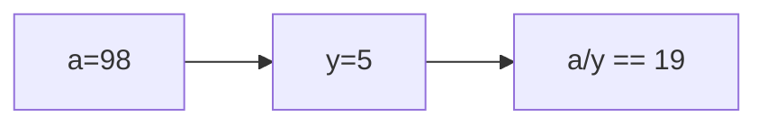

**📖 Penjelasan:**
**Langkah Tracing:**
1. a=98, y=5.
2. 98/5 = 19.60. Karena `int`, desimal dibuang.
3. Hasil: 19.

---
### Soal 77
```cpp
double val = 98.68;
int res = (int)val;
```
**Pertanyaan:**
1. Berapakah hasil akhirnya?
2. Mengapa demikian?

**Jawaban & Diagnosis:**
1. **98**
2. Lihat Tracing.

**Mermaid Flowchart:**
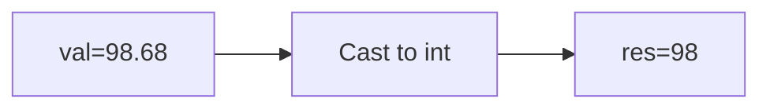

**📖 Penjelasan:**
**Langkah Tracing:**
1. val=98.68.
2. Desimal dihilangkan.
3. Hasil: 98.

---
### Soal 78
```cpp
double val = 65.54;
int res = (int)val;
```
**Pertanyaan:**
1. Berapakah hasil akhirnya?
2. Mengapa demikian?

**Jawaban & Diagnosis:**
1. **65**
2. Lihat Tracing.

**Mermaid Flowchart:**


**📖 Penjelasan:**
**Langkah Tracing:**
1. val=65.54.
2. Desimal dihilangkan.
3. Hasil: 65.

---
### Soal 79
```cpp
double val = 81.84;
int res = (int)val;
```
**Pertanyaan:**
1. Berapakah hasil akhirnya?
2. Mengapa demikian?

**Jawaban & Diagnosis:**
1. **81**
2. Lihat Tracing.

**Mermaid Flowchart:**
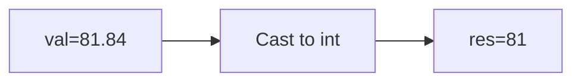

**📖 Penjelasan:**
**Langkah Tracing:**
1. val=81.84.
2. Desimal dihilangkan.
3. Hasil: 81.

---
### Soal 80
```cpp
double val = 57.77;
int res = (int)val;
```
**Pertanyaan:**
1. Berapakah hasil akhirnya?
2. Mengapa demikian?

**Jawaban & Diagnosis:**
1. **57**
2. Lihat Tracing.

**Mermaid Flowchart:**
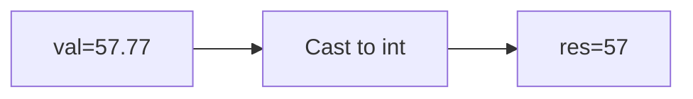

**📖 Penjelasan:**
**Langkah Tracing:**
1. val=57.77.
2. Desimal dihilangkan.
3. Hasil: 57.

---
### Soal 81
```cpp
char ch = 'A';
ch = ch + (1);
```
**Pertanyaan:**
1. Berapakah hasil akhirnya?
2. Mengapa demikian?

**Jawaban & Diagnosis:**
1. **B**
2. Lihat Tracing.

**Mermaid Flowchart:**
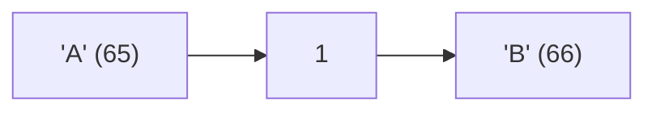

**📖 Penjelasan:**
**Langkah Tracing:**
1. ch='A' (ASCII 65).
2. 65 + (1) = 66.
3. Hasil: 'B'.

---
### Soal 82
```cpp
char ch = 'a';
ch = ch + (2);
```
**Pertanyaan:**
1. Berapakah hasil akhirnya?
2. Mengapa demikian?

**Jawaban & Diagnosis:**
1. **c**
2. Lihat Tracing.

**Mermaid Flowchart:**
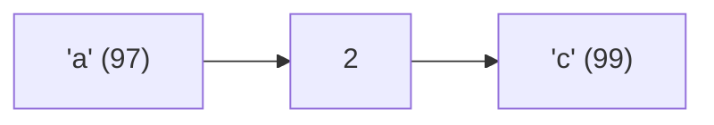

**📖 Penjelasan:**
**Langkah Tracing:**
1. ch='a' (ASCII 97).
2. 97 + (2) = 99.
3. Hasil: 'c'.

---
### Soal 83
```cpp
double val = 42.63;
int res = (int)val;
```
**Pertanyaan:**
1. Berapakah hasil akhirnya?
2. Mengapa demikian?

**Jawaban & Diagnosis:**
1. **42**
2. Lihat Tracing.

**Mermaid Flowchart:**
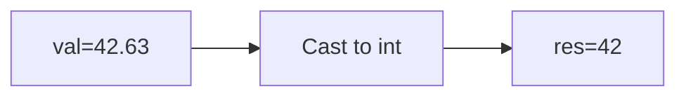

**📖 Penjelasan:**
**Langkah Tracing:**
1. val=42.63.
2. Desimal dihilangkan.
3. Hasil: 42.

---
### Soal 84
```cpp
int n = 91, b = 6;
int res = n / b;
```
**Pertanyaan:**
1. Berapakah hasil akhirnya?
2. Mengapa demikian?

**Jawaban & Diagnosis:**
1. **15**
2. Lihat Tracing.

**Mermaid Flowchart:**
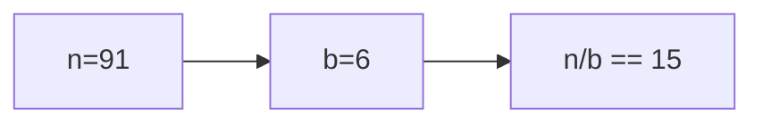

**📖 Penjelasan:**
**Langkah Tracing:**
1. n=91, b=6.
2. 91/6 = 15.17. Karena `int`, desimal dibuang.
3. Hasil: 15.

---
### Soal 85
```cpp
char ch = 'X';
ch = ch + (1);
```
**Pertanyaan:**
1. Berapakah hasil akhirnya?
2. Mengapa demikian?

**Jawaban & Diagnosis:**
1. **Y**
2. Lihat Tracing.

**Mermaid Flowchart:**
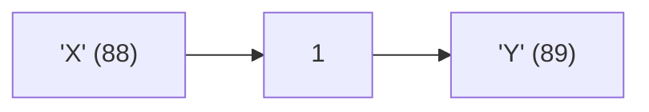

**📖 Penjelasan:**
**Langkah Tracing:**
1. ch='X' (ASCII 88).
2. 88 + (1) = 89.
3. Hasil: 'Y'.

---
### Soal 86
```cpp
int n = 22;
int m = 3;
int res = n % m;
```
**Pertanyaan:**
1. Berapakah hasil akhirnya?
2. Mengapa demikian?

**Jawaban & Diagnosis:**
1. **1**
2. Lihat Tracing.

**Mermaid Flowchart:**
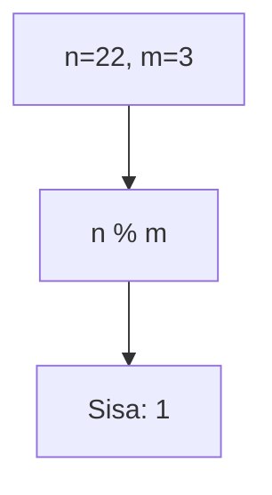

**📖 Penjelasan:**
**Langkah Tracing:**
1. n=22, m=3.
2. 22 dibagi 3 sisa 1.
3. Hasil: 1.

---
### Soal 87
```cpp
double val = 62.96;
int res = (int)val;
```
**Pertanyaan:**
1. Berapakah hasil akhirnya?
2. Mengapa demikian?

**Jawaban & Diagnosis:**
1. **62**
2. Lihat Tracing.

**Mermaid Flowchart:**
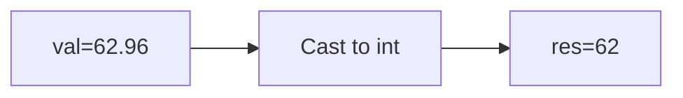

**📖 Penjelasan:**
**Langkah Tracing:**
1. val=62.96.
2. Desimal dihilangkan.
3. Hasil: 62.

---
### Soal 88
```cpp
double val = 80.52;
int res = (int)val;
```
**Pertanyaan:**
1. Berapakah hasil akhirnya?
2. Mengapa demikian?

**Jawaban & Diagnosis:**
1. **80**
2. Lihat Tracing.

**Mermaid Flowchart:**


**📖 Penjelasan:**
**Langkah Tracing:**
1. val=80.52.
2. Desimal dihilangkan.
3. Hasil: 80.

---
### Soal 89
```cpp
double val = 18.64;
int res = (int)val;
```
**Pertanyaan:**
1. Berapakah hasil akhirnya?
2. Mengapa demikian?

**Jawaban & Diagnosis:**
1. **18**
2. Lihat Tracing.

**Mermaid Flowchart:**
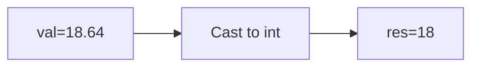

**📖 Penjelasan:**
**Langkah Tracing:**
1. val=18.64.
2. Desimal dihilangkan.
3. Hasil: 18.

---
### Soal 90
```cpp
int a = 26, m = 9;
int res = a / m;
```
**Pertanyaan:**
1. Berapakah hasil akhirnya?
2. Mengapa demikian?

**Jawaban & Diagnosis:**
1. **2**
2. Lihat Tracing.

**Mermaid Flowchart:**
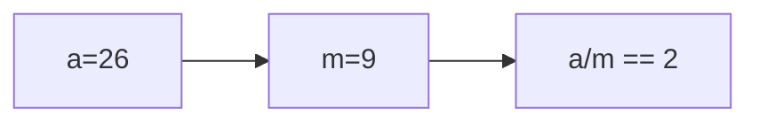

**📖 Penjelasan:**
**Langkah Tracing:**
1. a=26, m=9.
2. 26/9 = 2.89. Karena `int`, desimal dibuang.
3. Hasil: 2.

---
### Soal 91
```cpp
int x = 33, y = 7;
int res = x / y;
```
**Pertanyaan:**
1. Berapakah hasil akhirnya?
2. Mengapa demikian?

**Jawaban & Diagnosis:**
1. **4**
2. Lihat Tracing.

**Mermaid Flowchart:**
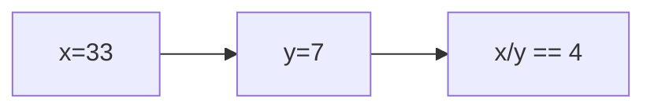

**📖 Penjelasan:**
**Langkah Tracing:**
1. x=33, y=7.
2. 33/7 = 4.71. Karena `int`, desimal dibuang.
3. Hasil: 4.

---
### Soal 92
```cpp
double val = 47.53;
int res = (int)val;
```
**Pertanyaan:**
1. Berapakah hasil akhirnya?
2. Mengapa demikian?

**Jawaban & Diagnosis:**
1. **47**
2. Lihat Tracing.

**Mermaid Flowchart:**
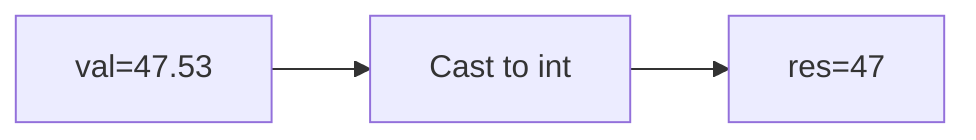

**📖 Penjelasan:**
**Langkah Tracing:**
1. val=47.53.
2. Desimal dihilangkan.
3. Hasil: 47.

---
### Soal 93
```cpp
int a = 43, m = 2;
int res = a / m;
```
**Pertanyaan:**
1. Berapakah hasil akhirnya?
2. Mengapa demikian?

**Jawaban & Diagnosis:**
1. **21**
2. Lihat Tracing.

**Mermaid Flowchart:**
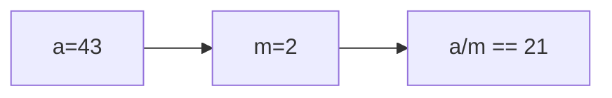

**📖 Penjelasan:**
**Langkah Tracing:**
1. a=43, m=2.
2. 43/2 = 21.50. Karena `int`, desimal dibuang.
3. Hasil: 21.

---
### Soal 94
```cpp
double val = 86.04;
int res = (int)val;
```
**Pertanyaan:**
1. Berapakah hasil akhirnya?
2. Mengapa demikian?

**Jawaban & Diagnosis:**
1. **86**
2. Lihat Tracing.

**Mermaid Flowchart:**


**📖 Penjelasan:**
**Langkah Tracing:**
1. val=86.04.
2. Desimal dihilangkan.
3. Hasil: 86.

---
### Soal 95
```cpp
int n = 8;
int m = 2;
int res = n % m;
```
**Pertanyaan:**
1. Berapakah hasil akhirnya?
2. Mengapa demikian?

**Jawaban & Diagnosis:**
1. **0**
2. Lihat Tracing.

**Mermaid Flowchart:**
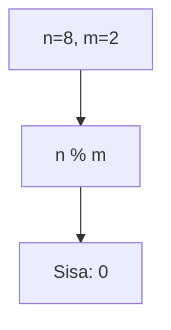

**📖 Penjelasan:**
**Langkah Tracing:**
1. n=8, m=2.
2. 8 dibagi 2 sisa 0.
3. Hasil: 0.

---
### Soal 96
```cpp
int n = 16;
int m = 5;
int res = n % m;
```
**Pertanyaan:**
1. Berapakah hasil akhirnya?
2. Mengapa demikian?

**Jawaban & Diagnosis:**
1. **1**
2. Lihat Tracing.

**Mermaid Flowchart:**
```mermaid
graph TD
A["n=16, m=5"] --> B["n % m"]
B --> C["Sisa: 1"]
```

**📖 Penjelasan:**
**Langkah Tracing:**
1. n=16, m=5.
2. 16 dibagi 5 sisa 1.
3. Hasil: 1.

---
### Soal 97
```cpp
char ch = 'A';
ch = ch + (-3);
```
**Pertanyaan:**
1. Berapakah hasil akhirnya?
2. Mengapa demikian?

**Jawaban & Diagnosis:**
1. **>**
2. Lihat Tracing.

**Mermaid Flowchart:**
```mermaid
graph LR
A["'A' (65)"] --> B["-3"]
B --> C["'>' (62)"]
```

**📖 Penjelasan:**
**Langkah Tracing:**
1. ch='A' (ASCII 65).
2. 65 + (-3) = 62.
3. Hasil: '>'.

---
### Soal 98
```cpp
int n = 5;
int m = 2;
int res = n % m;
```
**Pertanyaan:**
1. Berapakah hasil akhirnya?
2. Mengapa demikian?

**Jawaban & Diagnosis:**
1. **1**
2. Lihat Tracing.

**Mermaid Flowchart:**
```mermaid
graph TD
A["n=5, m=2"] --> B["n % m"]
B --> C["Sisa: 1"]
```

**📖 Penjelasan:**
**Langkah Tracing:**
1. n=5, m=2.
2. 5 dibagi 2 sisa 1.
3. Hasil: 1.

---
### Soal 99
```cpp
int n = 9;
int m = 3;
int res = n % m;
```
**Pertanyaan:**
1. Berapakah hasil akhirnya?
2. Mengapa demikian?

**Jawaban & Diagnosis:**
1. **0**
2. Lihat Tracing.

**Mermaid Flowchart:**
```mermaid
graph TD
A["n=9, m=3"] --> B["n % m"]
B --> C["Sisa: 0"]
```

**📖 Penjelasan:**
**Langkah Tracing:**
1. n=9, m=3.
2. 9 dibagi 3 sisa 0.
3. Hasil: 0.

---
### Soal 100
```cpp
char ch = 'a';
ch = ch + (-3);
```
**Pertanyaan:**
1. Berapakah hasil akhirnya?
2. Mengapa demikian?

**Jawaban & Diagnosis:**
1. **^**
2. Lihat Tracing.

**Mermaid Flowchart:**
```mermaid
graph LR
A["'a' (97)"] --> B["-3"]
B --> C["'^' (94)"]
```

**📖 Penjelasan:**
**Langkah Tracing:**
1. ch='a' (ASCII 97).
2. 97 + (-3) = 94.
3. Hasil: '^'.

---
