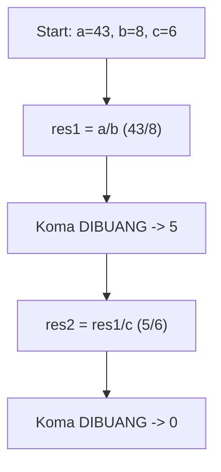
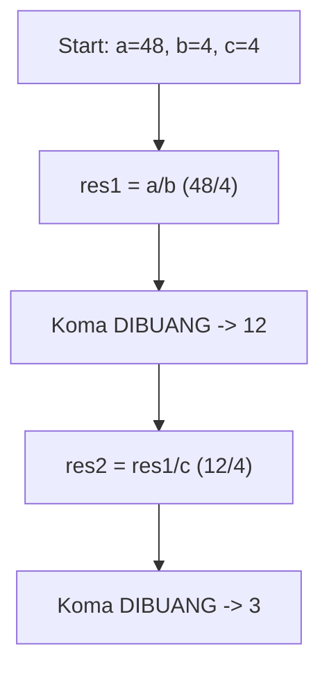
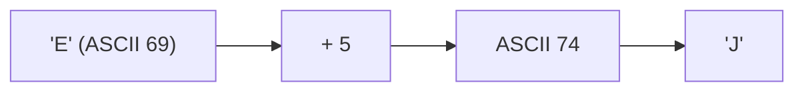
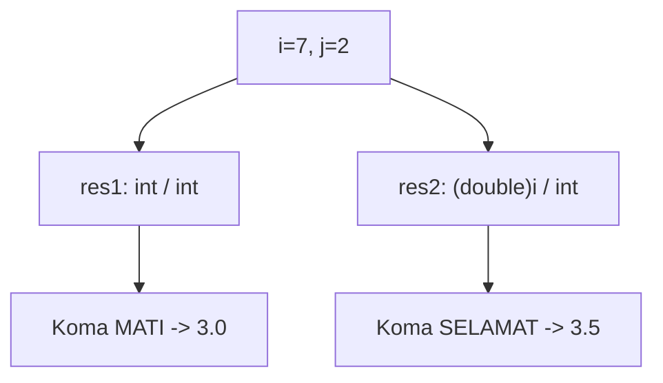
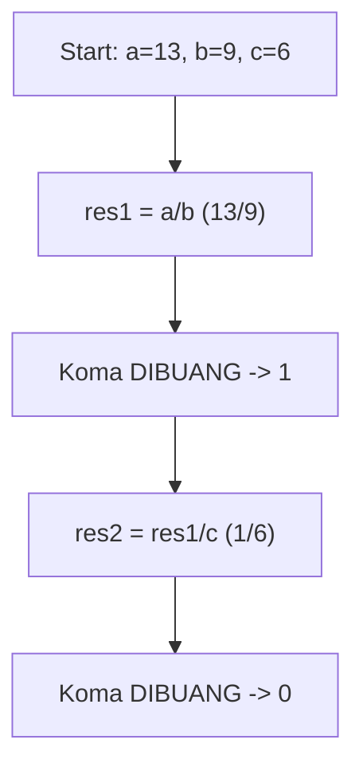
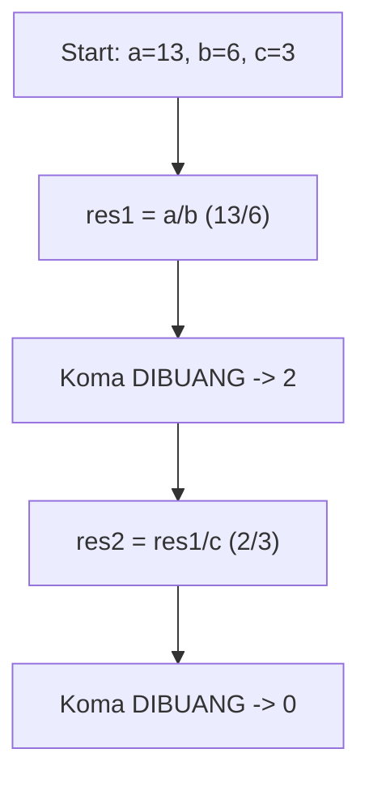
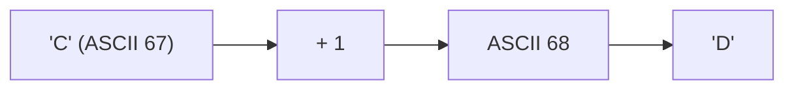
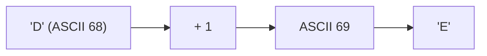

🔙 **[Kembali ke Daftar Soal](./README.md)**

---

# Latihan Soal Part C - Modul 01 - Set 04

### Soal 76 (Casting War)
```cpp
int i = 9;
int j = 2;
double res1 = i / j;
double res2 = (double)i / j;
```
**Pertanyaan:**
1. Berapakah isi `res1`?
2. Berapakah isi `res2`?
3. Kenapa hasil `res1` dan `res2` berbeda padahal rumusnya mirip?

**Jawaban & Diagnosis:**
1. **4.0**
2. **4.5**
3. **Pada `res1`, pembagian terjadi antar `int` sehingga koma dibantai duluan sebelum masuk double. Pada `res2`, `i` dipaksa jadi `double` dulu, sehingga koma selamat.**

**Mermaid Flowchart:**


**📖 Cara Membaca Diagram:**
i=9, j=2. `res1`: 9/2 (int) = 4. Masuk double jadi 4.0. `res2`: (double)9 = 9.0. 9.0/2 = 4.5.

---
### Soal 77 (Modulo Magic)
```cpp
int x = 53;
int m1 = 2;
int m2 = 5;
int res_x = x % m1;
int res_y = x % m2;
```
**Pertanyaan:**
1. Apakah `x` genap atau ganjil?
2. Berapakah sisa bagi `x % m2`?
3. Apa guna operator `%` dalam OSN-K?

**Jawaban & Diagnosis:**
1. **Ganjil**
2. **3**
3. **Untuk mencari sisa bagi (sisa kelereng) atau mendeteksi pola perulangan/genap-ganjil.**

**Mermaid Flowchart:**
```mermaid
graph TD
    A[x=53] --> Bx % 2 == 0?
    B -- Ya --> C[Genap]
    B -- Tidak --> D[Ganjil]
    A --> E["x % 5"]
    E --> F["Sisa: 3"]
```

**📖 Cara Membaca Diagram:**
x=53. Cek `x % 2`: 53%2 = 1. Jika 0 genap, jika 1 ganjil. Cek `x % 5`: 53/5 = 10 sisa 3.

---
### Soal 78 (Integer Division)
```cpp
int a = 43;
int b = 8;
int c = 6;
int res1 = a / b;
int res2 = res1 / c;
```
**Pertanyaan:**
1. Berapakah nilai `res1`?
2. Berapakah nilai `res2`?
3. Mengapa `res1` tidak menghasilkan angka desimal?

**Jawaban & Diagnosis:**
1. **5**
2. **0**
3. **Karena tipe datanya `int`, setiap ada koma di belakangnya langsung dipangkas habis (Integer Division).**

**Mermaid Flowchart:**


**📖 Cara Membaca Diagram:**
Mulai: a=43, b=8, c=6. Di baris `res1 = a / b`, 43/8 = 5.38, tapi karena `int`, koma dibakar jadi 5. Lalu 5/6 = 0.83, dibakar lagi jadi 0.

---
### Soal 79 (Integer Division)
```cpp
int a = 45;
int b = 4;
int c = 2;
int res1 = a / b;
int res2 = res1 / c;
```
**Pertanyaan:**
1. Berapakah nilai `res1`?
2. Berapakah nilai `res2`?
3. Mengapa `res1` tidak menghasilkan angka desimal?

**Jawaban & Diagnosis:**
1. **11**
2. **5**
3. **Karena tipe datanya `int`, setiap ada koma di belakangnya langsung dipangkas habis (Integer Division).**

**Mermaid Flowchart:**


**📖 Cara Membaca Diagram:**
Mulai: a=45, b=4, c=2. Di baris `res1 = a / b`, 45/4 = 11.25, tapi karena `int`, koma dibakar jadi 11. Lalu 11/2 = 5.50, dibakar lagi jadi 5.

---
### Soal 80 (Casting War)
```cpp
int i = 9;
int j = 2;
double res1 = i / j;
double res2 = (double)i / j;
```
**Pertanyaan:**
1. Berapakah isi `res1`?
2. Berapakah isi `res2`?
3. Kenapa hasil `res1` dan `res2` berbeda padahal rumusnya mirip?

**Jawaban & Diagnosis:**
1. **4.0**
2. **4.5**
3. **Pada `res1`, pembagian terjadi antar `int` sehingga koma dibantai duluan sebelum masuk double. Pada `res2`, `i` dipaksa jadi `double` dulu, sehingga koma selamat.**

**Mermaid Flowchart:**


**📖 Cara Membaca Diagram:**
i=9, j=2. `res1`: 9/2 (int) = 4. Masuk double jadi 4.0. `res2`: (double)9 = 9.0. 9.0/2 = 4.5.

---
### Soal 81 (Integer Division)
```cpp
int a = 48;
int b = 4;
int c = 4;
int res1 = a / b;
int res2 = res1 / c;
```
**Pertanyaan:**
1. Berapakah nilai `res1`?
2. Berapakah nilai `res2`?
3. Mengapa `res1` tidak menghasilkan angka desimal?

**Jawaban & Diagnosis:**
1. **12**
2. **3**
3. **Karena tipe datanya `int`, setiap ada koma di belakangnya langsung dipangkas habis (Integer Division).**

**Mermaid Flowchart:**


**📖 Cara Membaca Diagram:**
Mulai: a=48, b=4, c=4. Di baris `res1 = a / b`, 48/4 = 12.00, tapi karena `int`, koma dibakar jadi 12. Lalu 12/4 = 3.00, dibakar lagi jadi 3.

---
### Soal 82 (ASCII Math)
```cpp
char c = 'E';
int jump = 5;
char result = c + jump;
```
**Pertanyaan:**
1. Berapakah nilai ASCII batin dari 'E'?
2. Karakter apa yang tersimpan dalam variabel `result`?
3. Jika `result` dicetak sebagai `int`, angka berapa yang muncul?

**Jawaban & Diagnosis:**
1. **69**
2. **J**
3. **74**

**Mermaid Flowchart:**


**📖 Cara Membaca Diagram:**
Karakter 'E' punya kode batin ASCII 69. Ditambah 5 langkah menjadi 74. Kode 74 adalah huruf 'J'.

---
### Soal 83 (Casting War)
```cpp
int i = 7;
int j = 2;
double res1 = i / j;
double res2 = (double)i / j;
```
**Pertanyaan:**
1. Berapakah isi `res1`?
2. Berapakah isi `res2`?
3. Kenapa hasil `res1` dan `res2` berbeda padahal rumusnya mirip?

**Jawaban & Diagnosis:**
1. **3.0**
2. **3.5**
3. **Pada `res1`, pembagian terjadi antar `int` sehingga koma dibantai duluan sebelum masuk double. Pada `res2`, `i` dipaksa jadi `double` dulu, sehingga koma selamat.**

**Mermaid Flowchart:**


**📖 Cara Membaca Diagram:**
i=7, j=2. `res1`: 7/2 (int) = 3. Masuk double jadi 3.0. `res2`: (double)7 = 7.0. 7.0/2 = 3.5.

---
### Soal 84 (Integer Division)
```cpp
int a = 13;
int b = 9;
int c = 6;
int res1 = a / b;
int res2 = res1 / c;
```
**Pertanyaan:**
1. Berapakah nilai `res1`?
2. Berapakah nilai `res2`?
3. Mengapa `res1` tidak menghasilkan angka desimal?

**Jawaban & Diagnosis:**
1. **1**
2. **0**
3. **Karena tipe datanya `int`, setiap ada koma di belakangnya langsung dipangkas habis (Integer Division).**

**Mermaid Flowchart:**


**📖 Cara Membaca Diagram:**
Mulai: a=13, b=9, c=6. Di baris `res1 = a / b`, 13/9 = 1.44, tapi karena `int`, koma dibakar jadi 1. Lalu 1/6 = 0.17, dibakar lagi jadi 0.

---
### Soal 85 (Modulo Magic)
```cpp
int x = 41;
int m1 = 2;
int m2 = 5;
int res_x = x % m1;
int res_y = x % m2;
```
**Pertanyaan:**
1. Apakah `x` genap atau ganjil?
2. Berapakah sisa bagi `x % m2`?
3. Apa guna operator `%` dalam OSN-K?

**Jawaban & Diagnosis:**
1. **Ganjil**
2. **1**
3. **Untuk mencari sisa bagi (sisa kelereng) atau mendeteksi pola perulangan/genap-ganjil.**

**Mermaid Flowchart:**
```mermaid
graph TD
    A[x=41] --> Bx % 2 == 0?
    B -- Ya --> C[Genap]
    B -- Tidak --> D[Ganjil]
    A --> E["x % 5"]
    E --> F["Sisa: 1"]
```

**📖 Cara Membaca Diagram:**
x=41. Cek `x % 2`: 41%2 = 1. Jika 0 genap, jika 1 ganjil. Cek `x % 5`: 41/5 = 8 sisa 1.

---
### Soal 86 (Integer Division)
```cpp
int a = 13;
int b = 6;
int c = 3;
int res1 = a / b;
int res2 = res1 / c;
```
**Pertanyaan:**
1. Berapakah nilai `res1`?
2. Berapakah nilai `res2`?
3. Mengapa `res1` tidak menghasilkan angka desimal?

**Jawaban & Diagnosis:**
1. **2**
2. **0**
3. **Karena tipe datanya `int`, setiap ada koma di belakangnya langsung dipangkas habis (Integer Division).**

**Mermaid Flowchart:**


**📖 Cara Membaca Diagram:**
Mulai: a=13, b=6, c=3. Di baris `res1 = a / b`, 13/6 = 2.17, tapi karena `int`, koma dibakar jadi 2. Lalu 2/3 = 0.67, dibakar lagi jadi 0.

---
### Soal 87 (Casting War)
```cpp
int i = 10;
int j = 2;
double res1 = i / j;
double res2 = (double)i / j;
```
**Pertanyaan:**
1. Berapakah isi `res1`?
2. Berapakah isi `res2`?
3. Kenapa hasil `res1` dan `res2` berbeda padahal rumusnya mirip?

**Jawaban & Diagnosis:**
1. **5.0**
2. **5.0**
3. **Pada `res1`, pembagian terjadi antar `int` sehingga koma dibantai duluan sebelum masuk double. Pada `res2`, `i` dipaksa jadi `double` dulu, sehingga koma selamat.**

**Mermaid Flowchart:**


**📖 Cara Membaca Diagram:**
i=10, j=2. `res1`: 10/2 (int) = 5. Masuk double jadi 5.0. `res2`: (double)10 = 10.0. 10.0/2 = 5.0.

---
### Soal 88 (Casting War)
```cpp
int i = 10;
int j = 2;
double res1 = i / j;
double res2 = (double)i / j;
```
**Pertanyaan:**
1. Berapakah isi `res1`?
2. Berapakah isi `res2`?
3. Kenapa hasil `res1` dan `res2` berbeda padahal rumusnya mirip?

**Jawaban & Diagnosis:**
1. **5.0**
2. **5.0**
3. **Pada `res1`, pembagian terjadi antar `int` sehingga koma dibantai duluan sebelum masuk double. Pada `res2`, `i` dipaksa jadi `double` dulu, sehingga koma selamat.**

**Mermaid Flowchart:**


**📖 Cara Membaca Diagram:**
i=10, j=2. `res1`: 10/2 (int) = 5. Masuk double jadi 5.0. `res2`: (double)10 = 10.0. 10.0/2 = 5.0.

---
### Soal 89 (Modulo Magic)
```cpp
int x = 87;
int m1 = 2;
int m2 = 5;
int res_x = x % m1;
int res_y = x % m2;
```
**Pertanyaan:**
1. Apakah `x` genap atau ganjil?
2. Berapakah sisa bagi `x % m2`?
3. Apa guna operator `%` dalam OSN-K?

**Jawaban & Diagnosis:**
1. **Ganjil**
2. **2**
3. **Untuk mencari sisa bagi (sisa kelereng) atau mendeteksi pola perulangan/genap-ganjil.**

**Mermaid Flowchart:**
```mermaid
graph TD
    A[x=87] --> Bx % 2 == 0?
    B -- Ya --> C[Genap]
    B -- Tidak --> D[Ganjil]
    A --> E["x % 5"]
    E --> F["Sisa: 2"]
```

**📖 Cara Membaca Diagram:**
x=87. Cek `x % 2`: 87%2 = 1. Jika 0 genap, jika 1 ganjil. Cek `x % 5`: 87/5 = 17 sisa 2.

---
### Soal 90 (Casting War)
```cpp
int i = 10;
int j = 2;
double res1 = i / j;
double res2 = (double)i / j;
```
**Pertanyaan:**
1. Berapakah isi `res1`?
2. Berapakah isi `res2`?
3. Kenapa hasil `res1` dan `res2` berbeda padahal rumusnya mirip?

**Jawaban & Diagnosis:**
1. **5.0**
2. **5.0**
3. **Pada `res1`, pembagian terjadi antar `int` sehingga koma dibantai duluan sebelum masuk double. Pada `res2`, `i` dipaksa jadi `double` dulu, sehingga koma selamat.**

**Mermaid Flowchart:**


**📖 Cara Membaca Diagram:**
i=10, j=2. `res1`: 10/2 (int) = 5. Masuk double jadi 5.0. `res2`: (double)10 = 10.0. 10.0/2 = 5.0.

---
### Soal 91 (ASCII Math)
```cpp
char c = 'C';
int jump = 1;
char result = c + jump;
```
**Pertanyaan:**
1. Berapakah nilai ASCII batin dari 'C'?
2. Karakter apa yang tersimpan dalam variabel `result`?
3. Jika `result` dicetak sebagai `int`, angka berapa yang muncul?

**Jawaban & Diagnosis:**
1. **67**
2. **D**
3. **68**

**Mermaid Flowchart:**


**📖 Cara Membaca Diagram:**
Karakter 'C' punya kode batin ASCII 67. Ditambah 1 langkah menjadi 68. Kode 68 adalah huruf 'D'.

---
### Soal 92 (ASCII Math)
```cpp
char c = 'D';
int jump = 1;
char result = c + jump;
```
**Pertanyaan:**
1. Berapakah nilai ASCII batin dari 'D'?
2. Karakter apa yang tersimpan dalam variabel `result`?
3. Jika `result` dicetak sebagai `int`, angka berapa yang muncul?

**Jawaban & Diagnosis:**
1. **68**
2. **E**
3. **69**

**Mermaid Flowchart:**


**📖 Cara Membaca Diagram:**
Karakter 'D' punya kode batin ASCII 68. Ditambah 1 langkah menjadi 69. Kode 69 adalah huruf 'E'.

---
### Soal 93 (Modulo Magic)
```cpp
int x = 20;
int m1 = 2;
int m2 = 5;
int res_x = x % m1;
int res_y = x % m2;
```
**Pertanyaan:**
1. Apakah `x` genap atau ganjil?
2. Berapakah sisa bagi `x % m2`?
3. Apa guna operator `%` dalam OSN-K?

**Jawaban & Diagnosis:**
1. **Genap**
2. **0**
3. **Untuk mencari sisa bagi (sisa kelereng) atau mendeteksi pola perulangan/genap-ganjil.**

**Mermaid Flowchart:**
```mermaid
graph TD
    A[x=20] --> Bx % 2 == 0?
    B -- Ya --> C[Genap]
    B -- Tidak --> D[Ganjil]
    A --> E["x % 5"]
    E --> F["Sisa: 0"]
```

**📖 Cara Membaca Diagram:**
x=20. Cek `x % 2`: 20%2 = 0. Jika 0 genap, jika 1 ganjil. Cek `x % 5`: 20/5 = 4 sisa 0.

---
### Soal 94 (Casting War)
```cpp
int i = 7;
int j = 2;
double res1 = i / j;
double res2 = (double)i / j;
```
**Pertanyaan:**
1. Berapakah isi `res1`?
2. Berapakah isi `res2`?
3. Kenapa hasil `res1` dan `res2` berbeda padahal rumusnya mirip?

**Jawaban & Diagnosis:**
1. **3.0**
2. **3.5**
3. **Pada `res1`, pembagian terjadi antar `int` sehingga koma dibantai duluan sebelum masuk double. Pada `res2`, `i` dipaksa jadi `double` dulu, sehingga koma selamat.**

**Mermaid Flowchart:**


**📖 Cara Membaca Diagram:**
i=7, j=2. `res1`: 7/2 (int) = 3. Masuk double jadi 3.0. `res2`: (double)7 = 7.0. 7.0/2 = 3.5.

---
### Soal 95 (Modulo Magic)
```cpp
int x = 34;
int m1 = 2;
int m2 = 5;
int res_x = x % m1;
int res_y = x % m2;
```
**Pertanyaan:**
1. Apakah `x` genap atau ganjil?
2. Berapakah sisa bagi `x % m2`?
3. Apa guna operator `%` dalam OSN-K?

**Jawaban & Diagnosis:**
1. **Genap**
2. **4**
3. **Untuk mencari sisa bagi (sisa kelereng) atau mendeteksi pola perulangan/genap-ganjil.**

**Mermaid Flowchart:**
```mermaid
graph TD
    A[x=34] --> Bx % 2 == 0?
    B -- Ya --> C[Genap]
    B -- Tidak --> D[Ganjil]
    A --> E["x % 5"]
    E --> F["Sisa: 4"]
```

**📖 Cara Membaca Diagram:**
x=34. Cek `x % 2`: 34%2 = 0. Jika 0 genap, jika 1 ganjil. Cek `x % 5`: 34/5 = 6 sisa 4.

---
### Soal 96 (Casting War)
```cpp
int i = 5;
int j = 2;
double res1 = i / j;
double res2 = (double)i / j;
```
**Pertanyaan:**
1. Berapakah isi `res1`?
2. Berapakah isi `res2`?
3. Kenapa hasil `res1` dan `res2` berbeda padahal rumusnya mirip?

**Jawaban & Diagnosis:**
1. **2.0**
2. **2.5**
3. **Pada `res1`, pembagian terjadi antar `int` sehingga koma dibantai duluan sebelum masuk double. Pada `res2`, `i` dipaksa jadi `double` dulu, sehingga koma selamat.**

**Mermaid Flowchart:**
```mermaid
graph TD
    A["i=5, j=2"] --> B["res1: int / int"]
    B --> C["Koma MATI -> 2.0"]
    A --> D["res2: (double)i / int"]
    D --> E["Koma SELAMAT -> 2.5"]
```

**📖 Cara Membaca Diagram:**
i=5, j=2. `res1`: 5/2 (int) = 2. Masuk double jadi 2.0. `res2`: (double)5 = 5.0. 5.0/2 = 2.5.

---
### Soal 97 (Modulo Magic)
```cpp
int x = 44;
int m1 = 2;
int m2 = 5;
int res_x = x % m1;
int res_y = x % m2;
```
**Pertanyaan:**
1. Apakah `x` genap atau ganjil?
2. Berapakah sisa bagi `x % m2`?
3. Apa guna operator `%` dalam OSN-K?

**Jawaban & Diagnosis:**
1. **Genap**
2. **4**
3. **Untuk mencari sisa bagi (sisa kelereng) atau mendeteksi pola perulangan/genap-ganjil.**

**Mermaid Flowchart:**
```mermaid
graph TD
    A[x=44] --> Bx % 2 == 0?
    B -- Ya --> C[Genap]
    B -- Tidak --> D[Ganjil]
    A --> E["x % 5"]
    E --> F["Sisa: 4"]
```

**📖 Cara Membaca Diagram:**
x=44. Cek `x % 2`: 44%2 = 0. Jika 0 genap, jika 1 ganjil. Cek `x % 5`: 44/5 = 8 sisa 4.

---
### Soal 98 (Modulo Magic)
```cpp
int x = 86;
int m1 = 2;
int m2 = 5;
int res_x = x % m1;
int res_y = x % m2;
```
**Pertanyaan:**
1. Apakah `x` genap atau ganjil?
2. Berapakah sisa bagi `x % m2`?
3. Apa guna operator `%` dalam OSN-K?

**Jawaban & Diagnosis:**
1. **Genap**
2. **1**
3. **Untuk mencari sisa bagi (sisa kelereng) atau mendeteksi pola perulangan/genap-ganjil.**

**Mermaid Flowchart:**
```mermaid
graph TD
    A[x=86] --> Bx % 2 == 0?
    B -- Ya --> C[Genap]
    B -- Tidak --> D[Ganjil]
    A --> E["x % 5"]
    E --> F["Sisa: 1"]
```

**📖 Cara Membaca Diagram:**
x=86. Cek `x % 2`: 86%2 = 0. Jika 0 genap, jika 1 ganjil. Cek `x % 5`: 86/5 = 17 sisa 1.

---
### Soal 99 (ASCII Math)
```cpp
char c = 'D';
int jump = 5;
char result = c + jump;
```
**Pertanyaan:**
1. Berapakah nilai ASCII batin dari 'D'?
2. Karakter apa yang tersimpan dalam variabel `result`?
3. Jika `result` dicetak sebagai `int`, angka berapa yang muncul?

**Jawaban & Diagnosis:**
1. **68**
2. **I**
3. **73**

**Mermaid Flowchart:**
```mermaid
graph LR
    A["'D' (ASCII 68)"] --> B["+ 5"]
    B --> C["ASCII 73"]
    C --> D["'I'"]
```

**📖 Cara Membaca Diagram:**
Karakter 'D' punya kode batin ASCII 68. Ditambah 5 langkah menjadi 73. Kode 73 adalah huruf 'I'.

---
### Soal 100 (Modulo Magic)
```cpp
int x = 66;
int m1 = 2;
int m2 = 5;
int res_x = x % m1;
int res_y = x % m2;
```
**Pertanyaan:**
1. Apakah `x` genap atau ganjil?
2. Berapakah sisa bagi `x % m2`?
3. Apa guna operator `%` dalam OSN-K?

**Jawaban & Diagnosis:**
1. **Genap**
2. **1**
3. **Untuk mencari sisa bagi (sisa kelereng) atau mendeteksi pola perulangan/genap-ganjil.**

**Mermaid Flowchart:**
```mermaid
graph TD
    A[x=66] --> Bx % 2 == 0?
    B -- Ya --> C[Genap]
    B -- Tidak --> D[Ganjil]
    A --> E["x % 5"]
    E --> F["Sisa: 1"]
```

**📖 Cara Membaca Diagram:**
x=66. Cek `x % 2`: 66%2 = 0. Jika 0 genap, jika 1 ganjil. Cek `x % 5`: 66/5 = 13 sisa 1.

---
