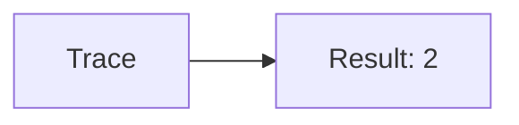
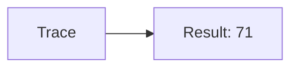
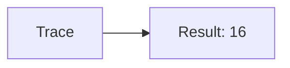
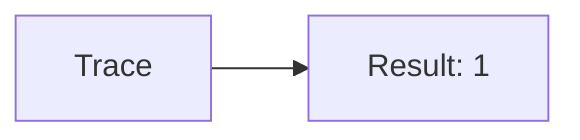
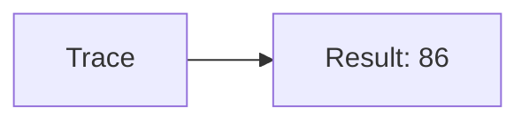
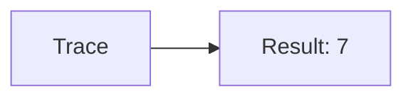
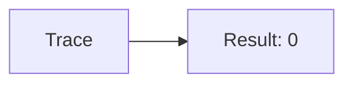
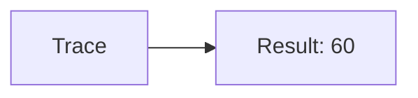
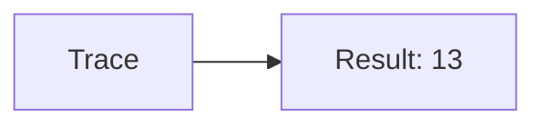

🔙 **[Kembali ke Daftar Soal](./README.md)**

---

# Latihan Soal Part C - Modul 01 - Set 04

### Soal 76
```cpp
// Benang: Pembagian
int benang = 54, bagi = 8;
int hasil = benang / bagi;
```
**Pertanyaan:**
1. Berapakah hasil akhirnya?
2. Deskripsikan alur pikir 'Compiler Manusia' untuk soal ini!

**Jawaban & Diagnosis:**
1. **6**
2. Membagi 54 Benang ke 8 bagian. Hasil bulat: 6.

**Mermaid Flowchart:**


---
### Soal 77
```cpp
// Jarum: Modulo
int jarum = 38, bagi = 4;
int sisa = jarum % bagi;
```
**Pertanyaan:**
1. Berapakah hasil akhirnya?
2. Deskripsikan alur pikir 'Compiler Manusia' untuk soal ini!

**Jawaban & Diagnosis:**
1. **2**
2. 38 Jarum dibagi 4 sisa 2.

**Mermaid Flowchart:**


---
### Soal 78
```cpp
// Gunting: Casting
double val = 71.81;
int res = (int)val;
```
**Pertanyaan:**
1. Berapakah hasil akhirnya?
2. Deskripsikan alur pikir 'Compiler Manusia' untuk soal ini!

**Jawaban & Diagnosis:**
1. **71**
2. Mengubah 71.81 jadi integer (pangkas koma) jadi 71.

**Mermaid Flowchart:**


---
### Soal 79
```cpp
// Lem: Pembagian
int lem = 19, bagi = 3;
int hasil = lem / bagi;
```
**Pertanyaan:**
1. Berapakah hasil akhirnya?
2. Deskripsikan alur pikir 'Compiler Manusia' untuk soal ini!

**Jawaban & Diagnosis:**
1. **6**
2. Membagi 19 Lem ke 3 bagian. Hasil bulat: 6.

**Mermaid Flowchart:**


---
### Soal 80
```cpp
// Isolasi: Modulo
int isolasi = 77, bagi = 8;
int sisa = isolasi % bagi;
```
**Pertanyaan:**
1. Berapakah hasil akhirnya?
2. Deskripsikan alur pikir 'Compiler Manusia' untuk soal ini!

**Jawaban & Diagnosis:**
1. **5**
2. 77 Isolasi dibagi 8 sisa 5.

**Mermaid Flowchart:**


---
### Soal 81
```cpp
// Lakban: Casting
double val = 57.81;
int res = (int)val;
```
**Pertanyaan:**
1. Berapakah hasil akhirnya?
2. Deskripsikan alur pikir 'Compiler Manusia' untuk soal ini!

**Jawaban & Diagnosis:**
1. **57**
2. Mengubah 57.81 jadi integer (pangkas koma) jadi 57.

**Mermaid Flowchart:**


---
### Soal 82
```cpp
// Tipex: Pembagian
int tipex = 81, bagi = 5;
int hasil = tipex / bagi;
```
**Pertanyaan:**
1. Berapakah hasil akhirnya?
2. Deskripsikan alur pikir 'Compiler Manusia' untuk soal ini!

**Jawaban & Diagnosis:**
1. **16**
2. Membagi 81 Tipex ke 5 bagian. Hasil bulat: 16.

**Mermaid Flowchart:**


---
### Soal 83
```cpp
// Stabilo: Modulo
int stabilo = 87, bagi = 2;
int sisa = stabilo % bagi;
```
**Pertanyaan:**
1. Berapakah hasil akhirnya?
2. Deskripsikan alur pikir 'Compiler Manusia' untuk soal ini!

**Jawaban & Diagnosis:**
1. **1**
2. 87 Stabilo dibagi 2 sisa 1.

**Mermaid Flowchart:**


---
### Soal 84
```cpp
// Spidol: Casting
double val = 86.51;
int res = (int)val;
```
**Pertanyaan:**
1. Berapakah hasil akhirnya?
2. Deskripsikan alur pikir 'Compiler Manusia' untuk soal ini!

**Jawaban & Diagnosis:**
1. **86**
2. Mengubah 86.51 jadi integer (pangkas koma) jadi 86.

**Mermaid Flowchart:**


---
### Soal 85
```cpp
// Crayon: Pembagian
int crayon = 93, bagi = 6;
int hasil = crayon / bagi;
```
**Pertanyaan:**
1. Berapakah hasil akhirnya?
2. Deskripsikan alur pikir 'Compiler Manusia' untuk soal ini!

**Jawaban & Diagnosis:**
1. **15**
2. Membagi 93 Crayon ke 6 bagian. Hasil bulat: 15.

**Mermaid Flowchart:**


---
### Soal 86
```cpp
// CatAir: Modulo
int catair = 79, bagi = 2;
int sisa = catair % bagi;
```
**Pertanyaan:**
1. Berapakah hasil akhirnya?
2. Deskripsikan alur pikir 'Compiler Manusia' untuk soal ini!

**Jawaban & Diagnosis:**
1. **1**
2. 79 CatAir dibagi 2 sisa 1.

**Mermaid Flowchart:**


---
### Soal 87
```cpp
// Kuas: Casting
double val = 16.61;
int res = (int)val;
```
**Pertanyaan:**
1. Berapakah hasil akhirnya?
2. Deskripsikan alur pikir 'Compiler Manusia' untuk soal ini!

**Jawaban & Diagnosis:**
1. **16**
2. Mengubah 16.61 jadi integer (pangkas koma) jadi 16.

**Mermaid Flowchart:**


---
### Soal 88
```cpp
// Kanvas: Pembagian
int kanvas = 54, bagi = 7;
int hasil = kanvas / bagi;
```
**Pertanyaan:**
1. Berapakah hasil akhirnya?
2. Deskripsikan alur pikir 'Compiler Manusia' untuk soal ini!

**Jawaban & Diagnosis:**
1. **7**
2. Membagi 54 Kanvas ke 7 bagian. Hasil bulat: 7.

**Mermaid Flowchart:**


---
### Soal 89
```cpp
// Palet: Modulo
int palet = 15, bagi = 3;
int sisa = palet % bagi;
```
**Pertanyaan:**
1. Berapakah hasil akhirnya?
2. Deskripsikan alur pikir 'Compiler Manusia' untuk soal ini!

**Jawaban & Diagnosis:**
1. **0**
2. 15 Palet dibagi 3 sisa 0.

**Mermaid Flowchart:**


---
### Soal 90
```cpp
// Easel: Casting
double val = 18.71;
int res = (int)val;
```
**Pertanyaan:**
1. Berapakah hasil akhirnya?
2. Deskripsikan alur pikir 'Compiler Manusia' untuk soal ini!

**Jawaban & Diagnosis:**
1. **18**
2. Mengubah 18.71 jadi integer (pangkas koma) jadi 18.

**Mermaid Flowchart:**


---
### Soal 91
```cpp
// Patung: Pembagian
int patung = 59, bagi = 7;
int hasil = patung / bagi;
```
**Pertanyaan:**
1. Berapakah hasil akhirnya?
2. Deskripsikan alur pikir 'Compiler Manusia' untuk soal ini!

**Jawaban & Diagnosis:**
1. **8**
2. Membagi 59 Patung ke 7 bagian. Hasil bulat: 8.

**Mermaid Flowchart:**


---
### Soal 92
```cpp
// Ukiran: Modulo
int ukiran = 21, bagi = 2;
int sisa = ukiran % bagi;
```
**Pertanyaan:**
1. Berapakah hasil akhirnya?
2. Deskripsikan alur pikir 'Compiler Manusia' untuk soal ini!

**Jawaban & Diagnosis:**
1. **1**
2. 21 Ukiran dibagi 2 sisa 1.

**Mermaid Flowchart:**


---
### Soal 93
```cpp
// Lukisan: Casting
double val = 60.81;
int res = (int)val;
```
**Pertanyaan:**
1. Berapakah hasil akhirnya?
2. Deskripsikan alur pikir 'Compiler Manusia' untuk soal ini!

**Jawaban & Diagnosis:**
1. **60**
2. Mengubah 60.81 jadi integer (pangkas koma) jadi 60.

**Mermaid Flowchart:**


---
### Soal 94
```cpp
// Foto: Pembagian
int foto = 65, bagi = 5;
int hasil = foto / bagi;
```
**Pertanyaan:**
1. Berapakah hasil akhirnya?
2. Deskripsikan alur pikir 'Compiler Manusia' untuk soal ini!

**Jawaban & Diagnosis:**
1. **13**
2. Membagi 65 Foto ke 5 bagian. Hasil bulat: 13.

**Mermaid Flowchart:**


---
### Soal 95
```cpp
// Bingkai: Modulo
int bingkai = 11, bagi = 2;
int sisa = bingkai % bagi;
```
**Pertanyaan:**
1. Berapakah hasil akhirnya?
2. Deskripsikan alur pikir 'Compiler Manusia' untuk soal ini!

**Jawaban & Diagnosis:**
1. **1**
2. 11 Bingkai dibagi 2 sisa 1.

**Mermaid Flowchart:**


---
### Soal 96
```cpp
// Album: Casting
double val = 74.71;
int res = (int)val;
```
**Pertanyaan:**
1. Berapakah hasil akhirnya?
2. Deskripsikan alur pikir 'Compiler Manusia' untuk soal ini!

**Jawaban & Diagnosis:**
1. **74**
2. Mengubah 74.71 jadi integer (pangkas koma) jadi 74.

**Mermaid Flowchart:**
```mermaid
graph LR
A[Trace] --> B[Result: 74]
```

---
### Soal 97
```cpp
// Kaset: Pembagian
int kaset = 45, bagi = 6;
int hasil = kaset / bagi;
```
**Pertanyaan:**
1. Berapakah hasil akhirnya?
2. Deskripsikan alur pikir 'Compiler Manusia' untuk soal ini!

**Jawaban & Diagnosis:**
1. **7**
2. Membagi 45 Kaset ke 6 bagian. Hasil bulat: 7.

**Mermaid Flowchart:**
```mermaid
graph LR
A[Trace] --> B[Result: 7]
```

---
### Soal 98
```cpp
// CD: Modulo
int cd = 81, bagi = 7;
int sisa = cd % bagi;
```
**Pertanyaan:**
1. Berapakah hasil akhirnya?
2. Deskripsikan alur pikir 'Compiler Manusia' untuk soal ini!

**Jawaban & Diagnosis:**
1. **4**
2. 81 CD dibagi 7 sisa 4.

**Mermaid Flowchart:**
```mermaid
graph LR
A[Trace] --> B[Result: 4]
```

---
### Soal 99
```cpp
// DVD: Casting
double val = 59.21;
int res = (int)val;
```
**Pertanyaan:**
1. Berapakah hasil akhirnya?
2. Deskripsikan alur pikir 'Compiler Manusia' untuk soal ini!

**Jawaban & Diagnosis:**
1. **59**
2. Mengubah 59.21 jadi integer (pangkas koma) jadi 59.

**Mermaid Flowchart:**
```mermaid
graph LR
A[Trace] --> B[Result: 59]
```

---
### Soal 100
```cpp
// VCD: Pembagian
int vcd = 82, bagi = 4;
int hasil = vcd / bagi;
```
**Pertanyaan:**
1. Berapakah hasil akhirnya?
2. Deskripsikan alur pikir 'Compiler Manusia' untuk soal ini!

**Jawaban & Diagnosis:**
1. **20**
2. Membagi 82 VCD ke 4 bagian. Hasil bulat: 20.

**Mermaid Flowchart:**
```mermaid
graph LR
A[Trace] --> B[Result: 20]
```

---
