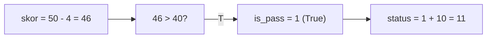
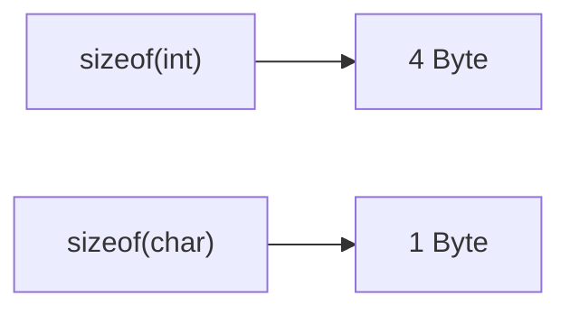
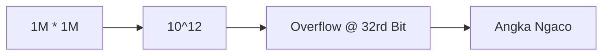
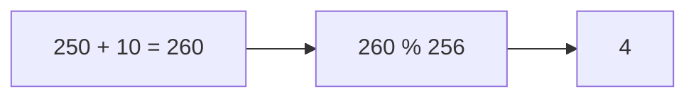
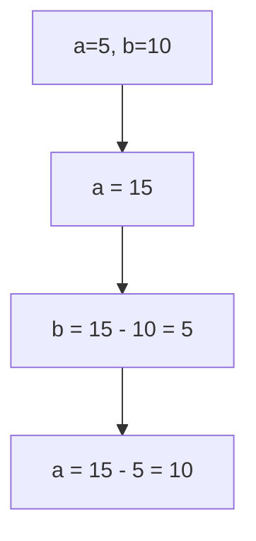
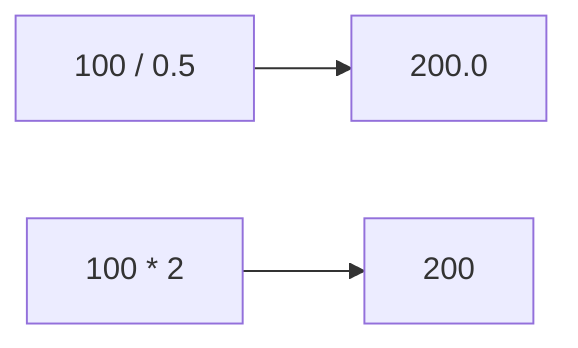
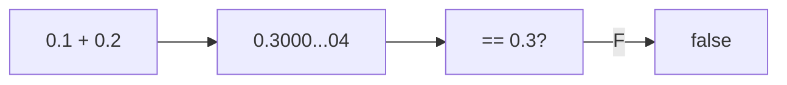
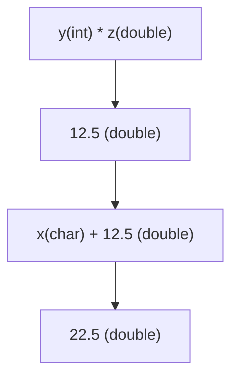
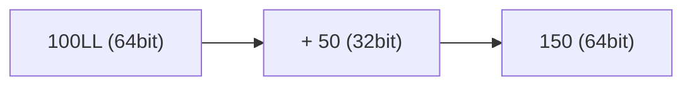
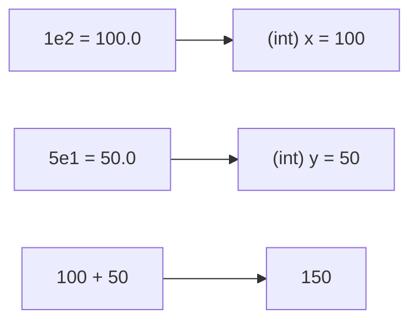

		🔙 **[Kembali ke Daftar Soal](./README.md)**

---

# Latihan Soal Part C - Modul 01 - Set 04 (Premium Edition)

---

### Soal 31: Logika Ranking (Boolean Math)
```cpp
// Benar +10, Salah -2
int benar = 5, salah = 2;
int skor = (benar * 10) - (salah * 2);
bool is_pass = (skor > 40);
int status = is_pass + 10;
```
**Pertanyaan:**
1. Berapakah nilai `skor`?
2. Berapakah nilai `status`?

<details>
<summary><b>Klik untuk Lihat Jawaban & Diagnosis</b></summary>

**Mermaid Flowchart:**


**Jawaban:**
1. **46**
2. **11** (True (1) + 10)

**📖 Analisis Mendalam:**
`is_pass` adalah `true` (46 > 40). Saat `true` digunakan dalam operasi matematika, nilainya menjadi **1**.
</details>

---

### Soal 32: Cek Kapasitas (Sizeof Mystery)
```cpp
// Menguji ukuran kotak memori
int x = 10;
int size_A = sizeof(x);
int size_B = sizeof(char);
```
**Pertanyaan:**
1. Berapakah nilai `size_A`? (Asumsi sistem 32/64 bit standar).
2. Berapakah nilai `size_B`? 

<details>
<summary><b>Klik untuk Lihat Jawaban & Diagnosis</b></summary>

**Mermaid Flowchart:**


**Jawaban:**
1. **4** (Byte)
2. **1** (Byte)

**📖 Analisis Mendalam:**
`sizeof` mengembalikan ukuran tipe data dalam satuan byte. `int` umumnya 4 byte (32 bit), sedangkan `char` mutlak 1 byte.
</details>

---

### Soal 33: Gaji Meluap (Int Overflow)
```cpp
// Skenario: Menghitung bonus besar
int gaji = 1000000;
int bonus = gaji * 1000000;
```
**Pertanyaan:**
1. Berapakah nilai `bonus`?
2. Apakah hasilnya $10^{12}$? Jelaskan!

<details>
<summary><b>Klik untuk Lihat Jawaban & Diagnosis</b></summary>

**Mermaid Flowchart:**


**Jawaban:**
1. **Angka acak/negatif (Overflow).**
2. **Tidak.** Karena batas maksimal `int` adalah sekitar 2.1 miliar.

**📖 Analisis Mendalam:**
Operasi ini melampaui batas 32-bit `int`. Untuk menampung triliun, kita wajib menggunakan tipe data `long long`.
</details>

---

### Soal 34: Bungkus Karakter (Char Wrapping)
```cpp
unsigned char c = 250;
c = c + 10;
```
**Pertanyaan:**
1. Berapakah nilai `c`?
2. Apa yang terjadi jika tipenya `char` (bukan unsigned)?

<details>
<summary><b>Klik untuk Lihat Jawaban & Diagnosis</b></summary>

**Mermaid Flowchart:**


**Jawaban:**
1. **4**
2. **Ngaco/Negatif** (Karena range signed char cuma -128 s/d 127).

**📖 Analisis Mendalam:**
Ini adalah efek *modulo* otomatis dari hardware saat nilai melebihi limit bit penampungnya.
</details>

---

### Soal 35: Tukar Tanpa Gelas (Arithmetic Swap)
```cpp
int a = 5, b = 10;
a = a + b; // a=15
b = a - b; // b=15-10=5
a = a - b; // a=15-5=10
```
**Pertanyaan:**
1. Berapakah nilai `a` sekarang?
2. Berapakah nilai `b` sekarang?
3. Teknik ini disebut apa?

<details>
<summary><b>Klik untuk Lihat Jawaban & Diagnosis</b></summary>

**Mermaid Flowchart:**


**Jawaban:**
1. **10**
2. **5**
3. **Variable Swap without Temporary Variable.**

**📖 Analisis Mendalam:**
Ini adalah trik matematika untuk menukar isi dua variabel tanpa bantuan variabel ketiga. Berguna saat memori sangat terbatas.
</details>

---

### Soal 36: Gaji Setengah (Div by 0.5)
```cpp
int gaji = 100;
double hasil_A = gaji / 0.5;
double hasil_B = gaji * 2;
```
**Pertanyaan:**
1. Berapakah nilai `hasil_A`?
2. Berapakah nilai `hasil_B`?

<details>
<summary><b>Klik untuk Lihat Jawaban & Diagnosis</b></summary>

**Mermaid Flowchart:**


**Jawaban:**
1. **200.0**
2. **200.0**

**📖 Analisis Mendalam:**
Meskipun hasilnya sama, `hasil_A` melibatkan operasi *floating point* yang lebih berat bagi prosesor dibanding `hasil_B` yang murni perkalian integer.
</details>

---

### Soal 37: Robot Presisi (Float Precision)
```cpp
float a = 0.1f;
float b = 0.2f;
bool is_equal = (a + b == 0.3f);
```
**Pertanyaan:**
1. Apakah `is_equal` bernilai `true`? 
2. Mengapa membandingkan *decimal* dengan `==` sangat berbahaya?

<details>
<summary><b>Klik untuk Lihat Jawaban & Diagnosis</b></summary>

**Mermaid Flowchart:**


**Jawaban:**
1. **Tergantung sistem (Seringnya False).**
2. Karena angka desimal disimpan dalam biner yang tidak selalu presisi.

**📖 Analisis Mendalam:**
0.1 + 0.2 di memori komputer seringkali bernilai `0.30000001`. Membandingkan `float/double` sebaiknya menggunakan selisih angka sangat kecil (*epsilon*).
</details>

---

### Soal 38: Kasta Ksatria (Type Promotion)
```cpp
char x = 10;
int y = 5;
double z = 2.5;
double hasil = x + y * z;
```
**Pertanyaan:**
1. Berapakah nilai `hasil`?
2. Apa urutan kasta yang terjadi di sini?

<details>
<summary><b>Klik untuk Lihat Jawaban & Diagnosis</b></summary>

**Mermaid Flowchart:**


**Jawaban:**
1. **22.5**
2. **char + int * double** -> **int * double** -> **double**.

**📖 Analisis Mendalam:**
Perkalian `y * z` (5 * 2.5) dikerjakan duluan menjadi 12.5 (double). Lalu `x` (10) dijumlahkan dengan 12.5. Hasil akhirnya 22.5.
</details>

---

### Soal 39: Angka Raksasa (Long Suffix)
```cpp
long long x = 100LL;
int y = 50;
long long z = x + y;
```
**Pertanyaan:**
1. Apa arti akhiran **LL** pada angka 100?
2. Berapakah ukuran byte dari `z`?

<details>
<summary><b>Klik untuk Lihat Jawaban & Diagnosis</b></summary>

**Mermaid Flowchart:**


**Jawaban:**
1. Untuk memberitahu compiler bahwa angka tersebut adalah **Long Long** (64-bit).
2. **8 Byte.**

**📖 Analisis Mendalam:**
Tanpa `LL`, angka 100 dianggap `int` (32-bit). Ini penting jika kita ingin menulis angka di atas 2 miliar langsung di kode.
</details>

---

### Soal 40: Notasi Ilmiah (Scientific Int)
```cpp
int x = 1e2; // 1 * 10^2
int y = 5e1; // 5 * 10^1
int z = x + y;
```
**Pertanyaan:**
1. Berapakah nilai `z`?
2. Mengapa `1e2` bisa masuk ke variabel `int` padahal notasi ilmiah biasanya `double`?

<details>
<summary><b>Klik untuk Lihat Jawaban & Diagnosis</b></summary>

**Mermaid Flowchart:**


**Jawaban:**
1. **150**
2. Karena nilainya bulat (100.0), C++ mengijinkan konversi otomatis ke `int`.

**📖 Analisis Mendalam:**
`1e2` adalah kependekan dari $1 \times 10^2 = 100$. Hati-hati jika hasilnya punya koma seperti `1.5e2`, pasti terpotong.
</details>
