🔙 **[Kembali ke Daftar Soal](./README.md)**

---

# Latihan Soal Part C - Modul 01 - Set 05

### Soal 101
```cpp
int stok_buku = 52;
int rak = 7;
int sisa_buku = stok_buku % rak;
```
**Pertanyaan:**
1. Berapakah hasil akhirnya?
2. Deskripsikan langkah robot compiler saat memproses kode ini!

**Jawaban & Diagnosis:**
1. **3**
2. Baca bagian 'Analisis Mendalam' di bawah.

**Mermaid Flowchart:**
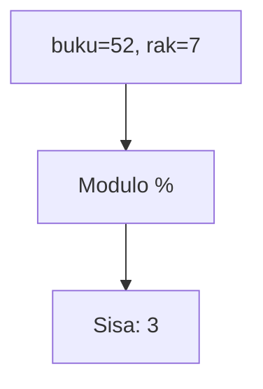

**📖 Penjelasan Komprehensif:**
**Analisis Mendalam (Compiler Manusia):**
1. **Konteks**: Menyusun 52 buku ke 7 rak secara merata.
2. **Mekanisme Modulo**: Operator `%` bukan menghitung hasil bagi, tapi sisa yang tidak muat masuk rak.
3. **Perhitungan**: 52 dibagi 7 sisa **3**.
4. **Hasil Akhir**: `sisa_buku` adalah **3**.

---
### Soal 102
```cpp
int stok_buku = 69;
int rak = 7;
int sisa_buku = stok_buku % rak;
```
**Pertanyaan:**
1. Berapakah hasil akhirnya?
2. Deskripsikan langkah robot compiler saat memproses kode ini!

**Jawaban & Diagnosis:**
1. **6**
2. Baca bagian 'Analisis Mendalam' di bawah.

**Mermaid Flowchart:**
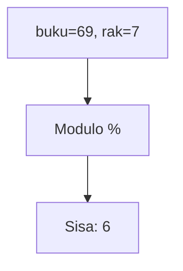

**📖 Penjelasan Komprehensif:**
**Analisis Mendalam (Compiler Manusia):**
1. **Konteks**: Menyusun 69 buku ke 7 rak secara merata.
2. **Mekanisme Modulo**: Operator `%` bukan menghitung hasil bagi, tapi sisa yang tidak muat masuk rak.
3. **Perhitungan**: 69 dibagi 7 sisa **6**.
4. **Hasil Akhir**: `sisa_buku` adalah **6**.

---
### Soal 103
```cpp
int stok_buku = 51;
int rak = 3;
int sisa_buku = stok_buku % rak;
```
**Pertanyaan:**
1. Berapakah hasil akhirnya?
2. Deskripsikan langkah robot compiler saat memproses kode ini!

**Jawaban & Diagnosis:**
1. **0**
2. Baca bagian 'Analisis Mendalam' di bawah.

**Mermaid Flowchart:**
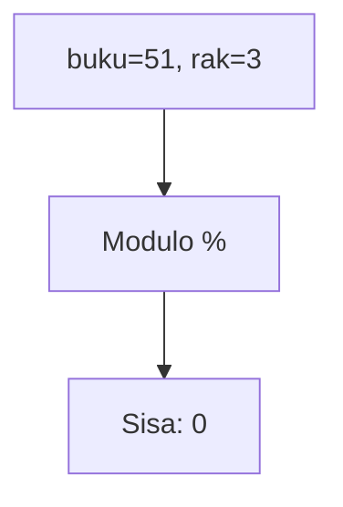

**📖 Penjelasan Komprehensif:**
**Analisis Mendalam (Compiler Manusia):**
1. **Konteks**: Menyusun 51 buku ke 3 rak secara merata.
2. **Mekanisme Modulo**: Operator `%` bukan menghitung hasil bagi, tapi sisa yang tidak muat masuk rak.
3. **Perhitungan**: 51 dibagi 3 sisa **0**.
4. **Hasil Akhir**: `sisa_buku` adalah **0**.

---
### Soal 104
```cpp
char huruf_awal = 'm';
char kode_rahasia = huruf_awal + 4;
```
**Pertanyaan:**
1. Berapakah hasil akhirnya?
2. Deskripsikan langkah robot compiler saat memproses kode ini!

**Jawaban & Diagnosis:**
1. **q**
2. Baca bagian 'Analisis Mendalam' di bawah.

**Mermaid Flowchart:**
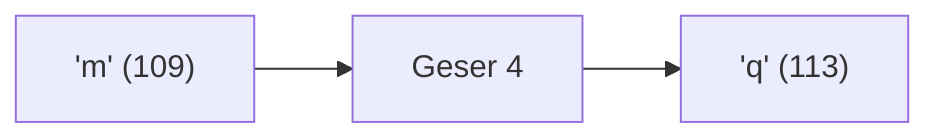

**📖 Penjelasan Komprehensif:**
**Analisis Mendalam (Compiler Manusia):**
1. **Batin Karakter**: Huruf 'm' memiliki nilai ASCII **109**.
2. **Operasi Geser**: Menambah huruf dengan angka akan menggeser posisinya di tabel ASCII: 109 + 4 = 113.
3. **Identitas Baru**: Angka 113 adalah identitas untuk huruf **'q'**.
4. **Hasil Akhir**: `kode_rahasia` berisi **'q'**.

---
### Soal 105
```cpp
int stok_buku = 49;
int rak = 3;
int sisa_buku = stok_buku % rak;
```
**Pertanyaan:**
1. Berapakah hasil akhirnya?
2. Deskripsikan langkah robot compiler saat memproses kode ini!

**Jawaban & Diagnosis:**
1. **1**
2. Baca bagian 'Analisis Mendalam' di bawah.

**Mermaid Flowchart:**
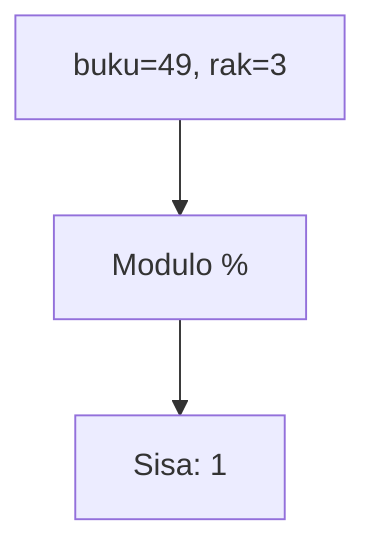

**📖 Penjelasan Komprehensif:**
**Analisis Mendalam (Compiler Manusia):**
1. **Konteks**: Menyusun 49 buku ke 3 rak secara merata.
2. **Mekanisme Modulo**: Operator `%` bukan menghitung hasil bagi, tapi sisa yang tidak muat masuk rak.
3. **Perhitungan**: 49 dibagi 3 sisa **1**.
4. **Hasil Akhir**: `sisa_buku` adalah **1**.

---
### Soal 106
```cpp
int permen = 83;
int anak = 2;
int dapet_tiap_anak = permen / anak;
```
**Pertanyaan:**
1. Berapakah hasil akhirnya?
2. Deskripsikan langkah robot compiler saat memproses kode ini!

**Jawaban & Diagnosis:**
1. **41**
2. Baca bagian 'Analisis Mendalam' di bawah.

**Mermaid Flowchart:**
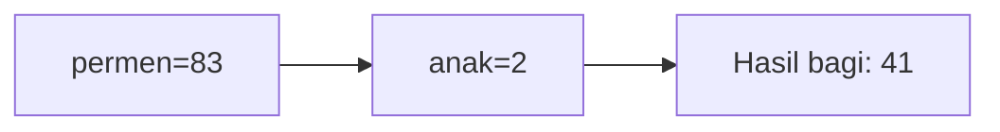

**📖 Penjelasan Komprehensif:**
**Analisis Mendalam (Compiler Manusia):**
1. **Inisialisasi**: Pak Dengklek punya `permen` sebanyak 83 dan ingin dibagi ke 2 `anak`.
2. **Operasi Pembagian**: Rumus `permen / anak` dijalankan. Secara matematis hasilnya 41.50.
3. **Hukum Tipe Data**: Karena hasilnya disimpan ke loker `int`, C++ membuang sisa 1 biji dan hanya mengambil bagian bulatnya.
4. **Hasil Akhir**: `dapet_tiap_anak` bernilai **41**.

---
### Soal 107
```cpp
int stok_buku = 54;
int rak = 7;
int sisa_buku = stok_buku % rak;
```
**Pertanyaan:**
1. Berapakah hasil akhirnya?
2. Deskripsikan langkah robot compiler saat memproses kode ini!

**Jawaban & Diagnosis:**
1. **5**
2. Baca bagian 'Analisis Mendalam' di bawah.

**Mermaid Flowchart:**


**📖 Penjelasan Komprehensif:**
**Analisis Mendalam (Compiler Manusia):**
1. **Konteks**: Menyusun 54 buku ke 7 rak secara merata.
2. **Mekanisme Modulo**: Operator `%` bukan menghitung hasil bagi, tapi sisa yang tidak muat masuk rak.
3. **Perhitungan**: 54 dibagi 7 sisa **5**.
4. **Hasil Akhir**: `sisa_buku` adalah **5**.

---
### Soal 108
```cpp
int permen = 92;
int anak = 9;
int dapet_tiap_anak = permen / anak;
```
**Pertanyaan:**
1. Berapakah hasil akhirnya?
2. Deskripsikan langkah robot compiler saat memproses kode ini!

**Jawaban & Diagnosis:**
1. **10**
2. Baca bagian 'Analisis Mendalam' di bawah.

**Mermaid Flowchart:**
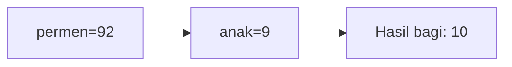

**📖 Penjelasan Komprehensif:**
**Analisis Mendalam (Compiler Manusia):**
1. **Inisialisasi**: Pak Dengklek punya `permen` sebanyak 92 dan ingin dibagi ke 9 `anak`.
2. **Operasi Pembagian**: Rumus `permen / anak` dijalankan. Secara matematis hasilnya 10.22.
3. **Hukum Tipe Data**: Karena hasilnya disimpan ke loker `int`, C++ membuang sisa 2 biji dan hanya mengambil bagian bulatnya.
4. **Hasil Akhir**: `dapet_tiap_anak` bernilai **10**.

---
### Soal 109
```cpp
int permen = 41;
int anak = 9;
int dapet_tiap_anak = permen / anak;
```
**Pertanyaan:**
1. Berapakah hasil akhirnya?
2. Deskripsikan langkah robot compiler saat memproses kode ini!

**Jawaban & Diagnosis:**
1. **4**
2. Baca bagian 'Analisis Mendalam' di bawah.

**Mermaid Flowchart:**
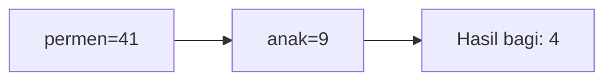

**📖 Penjelasan Komprehensif:**
**Analisis Mendalam (Compiler Manusia):**
1. **Inisialisasi**: Pak Dengklek punya `permen` sebanyak 41 dan ingin dibagi ke 9 `anak`.
2. **Operasi Pembagian**: Rumus `permen / anak` dijalankan. Secara matematis hasilnya 4.56.
3. **Hukum Tipe Data**: Karena hasilnya disimpan ke loker `int`, C++ membuang sisa 5 biji dan hanya mengambil bagian bulatnya.
4. **Hasil Akhir**: `dapet_tiap_anak` bernilai **4**.

---
### Soal 110
```cpp
char huruf_awal = 'P';
char kode_rahasia = huruf_awal + 3;
```
**Pertanyaan:**
1. Berapakah hasil akhirnya?
2. Deskripsikan langkah robot compiler saat memproses kode ini!

**Jawaban & Diagnosis:**
1. **S**
2. Baca bagian 'Analisis Mendalam' di bawah.

**Mermaid Flowchart:**
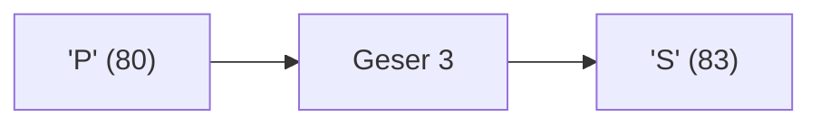

**📖 Penjelasan Komprehensif:**
**Analisis Mendalam (Compiler Manusia):**
1. **Batin Karakter**: Huruf 'P' memiliki nilai ASCII **80**.
2. **Operasi Geser**: Menambah huruf dengan angka akan menggeser posisinya di tabel ASCII: 80 + 3 = 83.
3. **Identitas Baru**: Angka 83 adalah identitas untuk huruf **'S'**.
4. **Hasil Akhir**: `kode_rahasia` berisi **'S'**.

---
### Soal 111
```cpp
int roti = 70;
int anak = 2;
int dapet_tiap_anak = roti / anak;
```
**Pertanyaan:**
1. Berapakah hasil akhirnya?
2. Deskripsikan langkah robot compiler saat memproses kode ini!

**Jawaban & Diagnosis:**
1. **35**
2. Baca bagian 'Analisis Mendalam' di bawah.

**Mermaid Flowchart:**
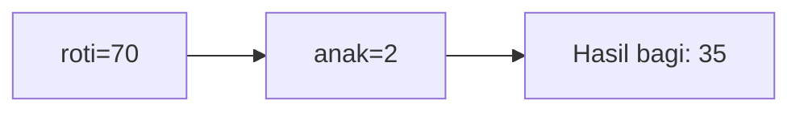

**📖 Penjelasan Komprehensif:**
**Analisis Mendalam (Compiler Manusia):**
1. **Inisialisasi**: Pak Dengklek punya `roti` sebanyak 70 dan ingin dibagi ke 2 `anak`.
2. **Operasi Pembagian**: Rumus `roti / anak` dijalankan. Secara matematis hasilnya 35.00.
3. **Hukum Tipe Data**: Karena hasilnya disimpan ke loker `int`, C++ membuang sisa 0 biji dan hanya mengambil bagian bulatnya.
4. **Hasil Akhir**: `dapet_tiap_anak` bernilai **35**.

---
### Soal 112
```cpp
char huruf_awal = 'B';
char kode_rahasia = huruf_awal + 2;
```
**Pertanyaan:**
1. Berapakah hasil akhirnya?
2. Deskripsikan langkah robot compiler saat memproses kode ini!

**Jawaban & Diagnosis:**
1. **D**
2. Baca bagian 'Analisis Mendalam' di bawah.

**Mermaid Flowchart:**
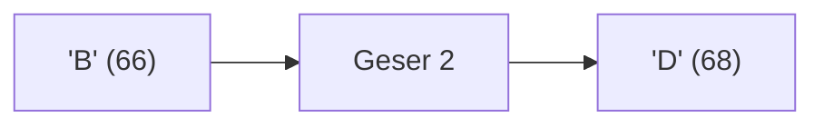

**📖 Penjelasan Komprehensif:**
**Analisis Mendalam (Compiler Manusia):**
1. **Batin Karakter**: Huruf 'B' memiliki nilai ASCII **66**.
2. **Operasi Geser**: Menambah huruf dengan angka akan menggeser posisinya di tabel ASCII: 66 + 2 = 68.
3. **Identitas Baru**: Angka 68 adalah identitas untuk huruf **'D'**.
4. **Hasil Akhir**: `kode_rahasia` berisi **'D'**.

---
### Soal 113
```cpp
int kelereng = 91;
int anak = 6;
int dapet_tiap_anak = kelereng / anak;
```
**Pertanyaan:**
1. Berapakah hasil akhirnya?
2. Deskripsikan langkah robot compiler saat memproses kode ini!

**Jawaban & Diagnosis:**
1. **15**
2. Baca bagian 'Analisis Mendalam' di bawah.

**Mermaid Flowchart:**
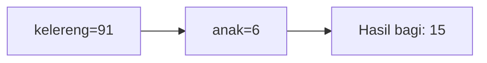

**📖 Penjelasan Komprehensif:**
**Analisis Mendalam (Compiler Manusia):**
1. **Inisialisasi**: Pak Dengklek punya `kelereng` sebanyak 91 dan ingin dibagi ke 6 `anak`.
2. **Operasi Pembagian**: Rumus `kelereng / anak` dijalankan. Secara matematis hasilnya 15.17.
3. **Hukum Tipe Data**: Karena hasilnya disimpan ke loker `int`, C++ membuang sisa 1 biji dan hanya mengambil bagian bulatnya.
4. **Hasil Akhir**: `dapet_tiap_anak` bernilai **15**.

---
### Soal 114
```cpp
char huruf_awal = 'A';
char kode_rahasia = huruf_awal + 4;
```
**Pertanyaan:**
1. Berapakah hasil akhirnya?
2. Deskripsikan langkah robot compiler saat memproses kode ini!

**Jawaban & Diagnosis:**
1. **E**
2. Baca bagian 'Analisis Mendalam' di bawah.

**Mermaid Flowchart:**
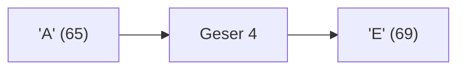

**📖 Penjelasan Komprehensif:**
**Analisis Mendalam (Compiler Manusia):**
1. **Batin Karakter**: Huruf 'A' memiliki nilai ASCII **65**.
2. **Operasi Geser**: Menambah huruf dengan angka akan menggeser posisinya di tabel ASCII: 65 + 4 = 69.
3. **Identitas Baru**: Angka 69 adalah identitas untuk huruf **'E'**.
4. **Hasil Akhir**: `kode_rahasia` berisi **'E'**.

---
### Soal 115
```cpp
double saldo_bank = 43.88;
int uang_kertas = (int)saldo_bank;
```
**Pertanyaan:**
1. Berapakah hasil akhirnya?
2. Deskripsikan langkah robot compiler saat memproses kode ini!

**Jawaban & Diagnosis:**
1. **43**
2. Baca bagian 'Analisis Mendalam' di bawah.

**Mermaid Flowchart:**
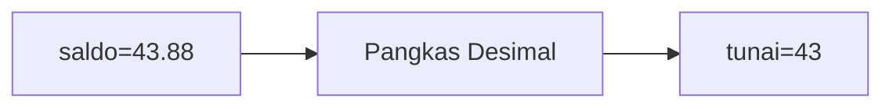

**📖 Penjelasan Komprehensif:**
**Analisis Mendalam (Compiler Manusia):**
1. **Gelas ke Laci**: `saldo_bank` adalah `double` (angka berkoma).
2. **Type Casting**: Perintah `(int)` secara paksa mengubahnya menjadi bilangan bulat.
3. **Efek**: Bagian desimal `43.88` menderita pelenyapan.
4. **Hasil Akhir**: `uang_kertas` berisi **43**.

---
### Soal 116
```cpp
int kelereng = 40;
int anak = 7;
int dapet_tiap_anak = kelereng / anak;
```
**Pertanyaan:**
1. Berapakah hasil akhirnya?
2. Deskripsikan langkah robot compiler saat memproses kode ini!

**Jawaban & Diagnosis:**
1. **5**
2. Baca bagian 'Analisis Mendalam' di bawah.

**Mermaid Flowchart:**
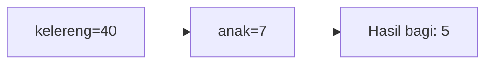

**📖 Penjelasan Komprehensif:**
**Analisis Mendalam (Compiler Manusia):**
1. **Inisialisasi**: Pak Dengklek punya `kelereng` sebanyak 40 dan ingin dibagi ke 7 `anak`.
2. **Operasi Pembagian**: Rumus `kelereng / anak` dijalankan. Secara matematis hasilnya 5.71.
3. **Hukum Tipe Data**: Karena hasilnya disimpan ke loker `int`, C++ membuang sisa 5 biji dan hanya mengambil bagian bulatnya.
4. **Hasil Akhir**: `dapet_tiap_anak` bernilai **5**.

---
### Soal 117
```cpp
char huruf_awal = 'm';
char kode_rahasia = huruf_awal + 3;
```
**Pertanyaan:**
1. Berapakah hasil akhirnya?
2. Deskripsikan langkah robot compiler saat memproses kode ini!

**Jawaban & Diagnosis:**
1. **p**
2. Baca bagian 'Analisis Mendalam' di bawah.

**Mermaid Flowchart:**
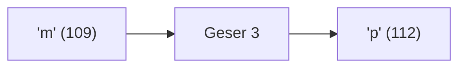

**📖 Penjelasan Komprehensif:**
**Analisis Mendalam (Compiler Manusia):**
1. **Batin Karakter**: Huruf 'm' memiliki nilai ASCII **109**.
2. **Operasi Geser**: Menambah huruf dengan angka akan menggeser posisinya di tabel ASCII: 109 + 3 = 112.
3. **Identitas Baru**: Angka 112 adalah identitas untuk huruf **'p'**.
4. **Hasil Akhir**: `kode_rahasia` berisi **'p'**.

---
### Soal 118
```cpp
int kelereng = 54;
int anak = 5;
int dapet_tiap_anak = kelereng / anak;
```
**Pertanyaan:**
1. Berapakah hasil akhirnya?
2. Deskripsikan langkah robot compiler saat memproses kode ini!

**Jawaban & Diagnosis:**
1. **10**
2. Baca bagian 'Analisis Mendalam' di bawah.

**Mermaid Flowchart:**
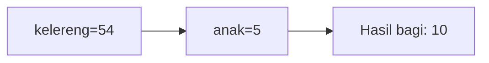

**📖 Penjelasan Komprehensif:**
**Analisis Mendalam (Compiler Manusia):**
1. **Inisialisasi**: Pak Dengklek punya `kelereng` sebanyak 54 dan ingin dibagi ke 5 `anak`.
2. **Operasi Pembagian**: Rumus `kelereng / anak` dijalankan. Secara matematis hasilnya 10.80.
3. **Hukum Tipe Data**: Karena hasilnya disimpan ke loker `int`, C++ membuang sisa 4 biji dan hanya mengambil bagian bulatnya.
4. **Hasil Akhir**: `dapet_tiap_anak` bernilai **10**.

---
### Soal 119
```cpp
int stok_buku = 74;
int rak = 7;
int sisa_buku = stok_buku % rak;
```
**Pertanyaan:**
1. Berapakah hasil akhirnya?
2. Deskripsikan langkah robot compiler saat memproses kode ini!

**Jawaban & Diagnosis:**
1. **4**
2. Baca bagian 'Analisis Mendalam' di bawah.

**Mermaid Flowchart:**
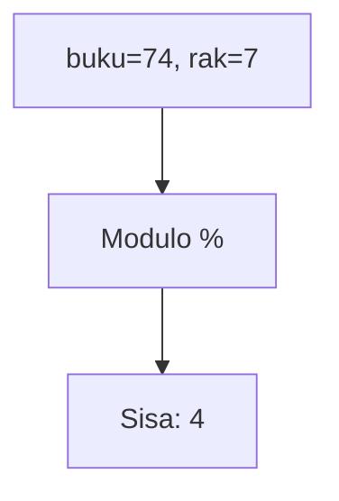

**📖 Penjelasan Komprehensif:**
**Analisis Mendalam (Compiler Manusia):**
1. **Konteks**: Menyusun 74 buku ke 7 rak secara merata.
2. **Mekanisme Modulo**: Operator `%` bukan menghitung hasil bagi, tapi sisa yang tidak muat masuk rak.
3. **Perhitungan**: 74 dibagi 7 sisa **4**.
4. **Hasil Akhir**: `sisa_buku` adalah **4**.

---
### Soal 120
```cpp
int kelereng = 71;
int anak = 8;
int dapet_tiap_anak = kelereng / anak;
```
**Pertanyaan:**
1. Berapakah hasil akhirnya?
2. Deskripsikan langkah robot compiler saat memproses kode ini!

**Jawaban & Diagnosis:**
1. **8**
2. Baca bagian 'Analisis Mendalam' di bawah.

**Mermaid Flowchart:**
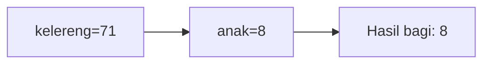

**📖 Penjelasan Komprehensif:**
**Analisis Mendalam (Compiler Manusia):**
1. **Inisialisasi**: Pak Dengklek punya `kelereng` sebanyak 71 dan ingin dibagi ke 8 `anak`.
2. **Operasi Pembagian**: Rumus `kelereng / anak` dijalankan. Secara matematis hasilnya 8.88.
3. **Hukum Tipe Data**: Karena hasilnya disimpan ke loker `int`, C++ membuang sisa 7 biji dan hanya mengambil bagian bulatnya.
4. **Hasil Akhir**: `dapet_tiap_anak` bernilai **8**.

---
### Soal 121
```cpp
int stok_buku = 41;
int rak = 7;
int sisa_buku = stok_buku % rak;
```
**Pertanyaan:**
1. Berapakah hasil akhirnya?
2. Deskripsikan langkah robot compiler saat memproses kode ini!

**Jawaban & Diagnosis:**
1. **6**
2. Baca bagian 'Analisis Mendalam' di bawah.

**Mermaid Flowchart:**
```mermaid
graph TD
A["buku=41, rak=7"] --> B["Modulo %"]
B --> C["Sisa: 6"]
```

**📖 Penjelasan Komprehensif:**
**Analisis Mendalam (Compiler Manusia):**
1. **Konteks**: Menyusun 41 buku ke 7 rak secara merata.
2. **Mekanisme Modulo**: Operator `%` bukan menghitung hasil bagi, tapi sisa yang tidak muat masuk rak.
3. **Perhitungan**: 41 dibagi 7 sisa **6**.
4. **Hasil Akhir**: `sisa_buku` adalah **6**.

---
### Soal 122
```cpp
double saldo_bank = 50.60;
int uang_kertas = (int)saldo_bank;
```
**Pertanyaan:**
1. Berapakah hasil akhirnya?
2. Deskripsikan langkah robot compiler saat memproses kode ini!

**Jawaban & Diagnosis:**
1. **50**
2. Baca bagian 'Analisis Mendalam' di bawah.

**Mermaid Flowchart:**
```mermaid
graph LR
A["saldo=50.60"] --> B["Pangkas Desimal"]
B --> C["tunai=50"]
```

**📖 Penjelasan Komprehensif:**
**Analisis Mendalam (Compiler Manusia):**
1. **Gelas ke Laci**: `saldo_bank` adalah `double` (angka berkoma).
2. **Type Casting**: Perintah `(int)` secara paksa mengubahnya menjadi bilangan bulat.
3. **Efek**: Bagian desimal `50.60` menderita pelenyapan.
4. **Hasil Akhir**: `uang_kertas` berisi **50**.

---
### Soal 123
```cpp
int stok_buku = 45;
int rak = 7;
int sisa_buku = stok_buku % rak;
```
**Pertanyaan:**
1. Berapakah hasil akhirnya?
2. Deskripsikan langkah robot compiler saat memproses kode ini!

**Jawaban & Diagnosis:**
1. **3**
2. Baca bagian 'Analisis Mendalam' di bawah.

**Mermaid Flowchart:**
```mermaid
graph TD
A["buku=45, rak=7"] --> B["Modulo %"]
B --> C["Sisa: 3"]
```

**📖 Penjelasan Komprehensif:**
**Analisis Mendalam (Compiler Manusia):**
1. **Konteks**: Menyusun 45 buku ke 7 rak secara merata.
2. **Mekanisme Modulo**: Operator `%` bukan menghitung hasil bagi, tapi sisa yang tidak muat masuk rak.
3. **Perhitungan**: 45 dibagi 7 sisa **3**.
4. **Hasil Akhir**: `sisa_buku` adalah **3**.

---
### Soal 124
```cpp
char huruf_awal = 'B';
char kode_rahasia = huruf_awal + 1;
```
**Pertanyaan:**
1. Berapakah hasil akhirnya?
2. Deskripsikan langkah robot compiler saat memproses kode ini!

**Jawaban & Diagnosis:**
1. **C**
2. Baca bagian 'Analisis Mendalam' di bawah.

**Mermaid Flowchart:**
```mermaid
graph LR
A["'B' (66)"] --> B["Geser 1"]
B --> C["'C' (67)"]
```

**📖 Penjelasan Komprehensif:**
**Analisis Mendalam (Compiler Manusia):**
1. **Batin Karakter**: Huruf 'B' memiliki nilai ASCII **66**.
2. **Operasi Geser**: Menambah huruf dengan angka akan menggeser posisinya di tabel ASCII: 66 + 1 = 67.
3. **Identitas Baru**: Angka 67 adalah identitas untuk huruf **'C'**.
4. **Hasil Akhir**: `kode_rahasia` berisi **'C'**.

---
### Soal 125
```cpp
double saldo_bank = 15.65;
int uang_kertas = (int)saldo_bank;
```
**Pertanyaan:**
1. Berapakah hasil akhirnya?
2. Deskripsikan langkah robot compiler saat memproses kode ini!

**Jawaban & Diagnosis:**
1. **15**
2. Baca bagian 'Analisis Mendalam' di bawah.

**Mermaid Flowchart:**
```mermaid
graph LR
A["saldo=15.65"] --> B["Pangkas Desimal"]
B --> C["tunai=15"]
```

**📖 Penjelasan Komprehensif:**
**Analisis Mendalam (Compiler Manusia):**
1. **Gelas ke Laci**: `saldo_bank` adalah `double` (angka berkoma).
2. **Type Casting**: Perintah `(int)` secara paksa mengubahnya menjadi bilangan bulat.
3. **Efek**: Bagian desimal `15.65` menderita pelenyapan.
4. **Hasil Akhir**: `uang_kertas` berisi **15**.

---
