🔙 **[Kembali ke Daftar Soal](./README.md)**

---

# Latihan Soal Part C - Modul 01 - Set 05

### Soal 101
```cpp
char ch = 'X';
ch = ch + (-2);
```
**Pertanyaan:**
1. Berapakah hasil akhirnya?
2. Mengapa demikian?

**Jawaban & Diagnosis:**
1. **V**
2. Lihat Tracing.

**Mermaid Flowchart:**
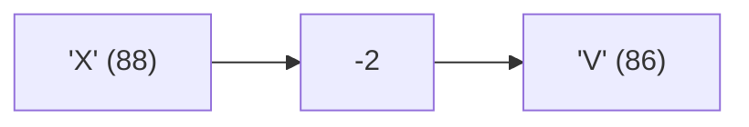

**📖 Penjelasan:**
**Langkah Tracing:**
1. ch='X' (ASCII 88).
2. 88 + (-2) = 86.
3. Hasil: 'V'.

---
### Soal 102
```cpp
int n = 32;
int m = 5;
int res = n % m;
```
**Pertanyaan:**
1. Berapakah hasil akhirnya?
2. Mengapa demikian?

**Jawaban & Diagnosis:**
1. **2**
2. Lihat Tracing.

**Mermaid Flowchart:**
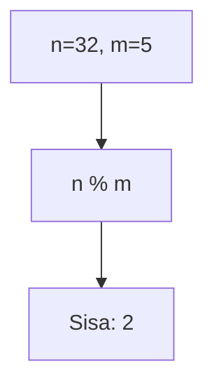

**📖 Penjelasan:**
**Langkah Tracing:**
1. n=32, m=5.
2. 32 dibagi 5 sisa 2.
3. Hasil: 2.

---
### Soal 103
```cpp
char ch = 'a';
ch = ch + (3);
```
**Pertanyaan:**
1. Berapakah hasil akhirnya?
2. Mengapa demikian?

**Jawaban & Diagnosis:**
1. **d**
2. Lihat Tracing.

**Mermaid Flowchart:**
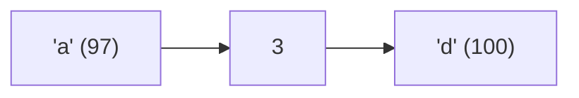

**📖 Penjelasan:**
**Langkah Tracing:**
1. ch='a' (ASCII 97).
2. 97 + (3) = 100.
3. Hasil: 'd'.

---
### Soal 104
```cpp
int n = 21, y = 9;
int res = n / y;
```
**Pertanyaan:**
1. Berapakah hasil akhirnya?
2. Mengapa demikian?

**Jawaban & Diagnosis:**
1. **2**
2. Lihat Tracing.

**Mermaid Flowchart:**
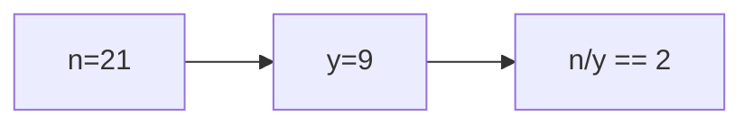

**📖 Penjelasan:**
**Langkah Tracing:**
1. n=21, y=9.
2. 21/9 = 2.33. Karena `int`, desimal dibuang.
3. Hasil: 2.

---
### Soal 105
```cpp
int a = 60, m = 6;
int res = a / m;
```
**Pertanyaan:**
1. Berapakah hasil akhirnya?
2. Mengapa demikian?

**Jawaban & Diagnosis:**
1. **10**
2. Lihat Tracing.

**Mermaid Flowchart:**
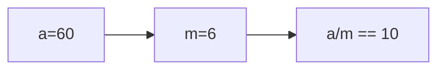

**📖 Penjelasan:**
**Langkah Tracing:**
1. a=60, m=6.
2. 60/6 = 10.00. Karena `int`, desimal dibuang.
3. Hasil: 10.

---
### Soal 106
```cpp
int a = 54, m = 2;
int res = a / m;
```
**Pertanyaan:**
1. Berapakah hasil akhirnya?
2. Mengapa demikian?

**Jawaban & Diagnosis:**
1. **27**
2. Lihat Tracing.

**Mermaid Flowchart:**
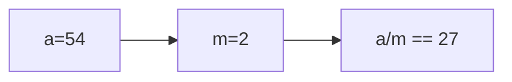

**📖 Penjelasan:**
**Langkah Tracing:**
1. a=54, m=2.
2. 54/2 = 27.00. Karena `int`, desimal dibuang.
3. Hasil: 27.

---
### Soal 107
```cpp
char ch = 'X';
ch = ch + (3);
```
**Pertanyaan:**
1. Berapakah hasil akhirnya?
2. Mengapa demikian?

**Jawaban & Diagnosis:**
1. **[**
2. Lihat Tracing.

**Mermaid Flowchart:**
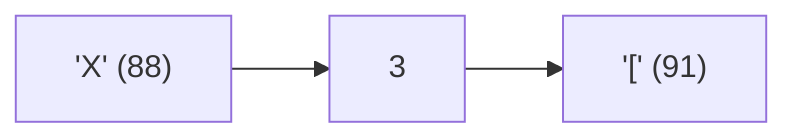

**📖 Penjelasan:**
**Langkah Tracing:**
1. ch='X' (ASCII 88).
2. 88 + (3) = 91.
3. Hasil: '['.

---
### Soal 108
```cpp
double val = 17.74;
int res = (int)val;
```
**Pertanyaan:**
1. Berapakah hasil akhirnya?
2. Mengapa demikian?

**Jawaban & Diagnosis:**
1. **17**
2. Lihat Tracing.

**Mermaid Flowchart:**
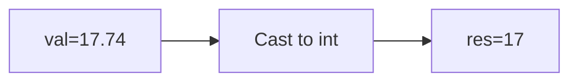

**📖 Penjelasan:**
**Langkah Tracing:**
1. val=17.74.
2. Desimal dihilangkan.
3. Hasil: 17.

---
### Soal 109
```cpp
char ch = 'B';
ch = ch + (1);
```
**Pertanyaan:**
1. Berapakah hasil akhirnya?
2. Mengapa demikian?

**Jawaban & Diagnosis:**
1. **C**
2. Lihat Tracing.

**Mermaid Flowchart:**
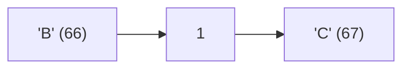

**📖 Penjelasan:**
**Langkah Tracing:**
1. ch='B' (ASCII 66).
2. 66 + (1) = 67.
3. Hasil: 'C'.

---
### Soal 110
```cpp
int n = 44;
int m = 5;
int res = n % m;
```
**Pertanyaan:**
1. Berapakah hasil akhirnya?
2. Mengapa demikian?

**Jawaban & Diagnosis:**
1. **4**
2. Lihat Tracing.

**Mermaid Flowchart:**


**📖 Penjelasan:**
**Langkah Tracing:**
1. n=44, m=5.
2. 44 dibagi 5 sisa 4.
3. Hasil: 4.

---
### Soal 111
```cpp
double val = 58.23;
int res = (int)val;
```
**Pertanyaan:**
1. Berapakah hasil akhirnya?
2. Mengapa demikian?

**Jawaban & Diagnosis:**
1. **58**
2. Lihat Tracing.

**Mermaid Flowchart:**
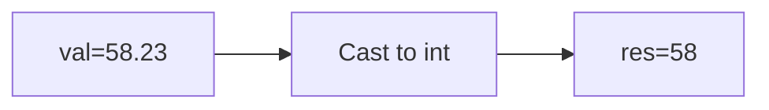

**📖 Penjelasan:**
**Langkah Tracing:**
1. val=58.23.
2. Desimal dihilangkan.
3. Hasil: 58.

---
### Soal 112
```cpp
double val = 32.93;
int res = (int)val;
```
**Pertanyaan:**
1. Berapakah hasil akhirnya?
2. Mengapa demikian?

**Jawaban & Diagnosis:**
1. **32**
2. Lihat Tracing.

**Mermaid Flowchart:**
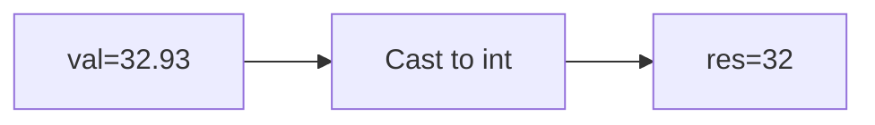

**📖 Penjelasan:**
**Langkah Tracing:**
1. val=32.93.
2. Desimal dihilangkan.
3. Hasil: 32.

---
### Soal 113
```cpp
char ch = 'P';
ch = ch + (4);
```
**Pertanyaan:**
1. Berapakah hasil akhirnya?
2. Mengapa demikian?

**Jawaban & Diagnosis:**
1. **T**
2. Lihat Tracing.

**Mermaid Flowchart:**
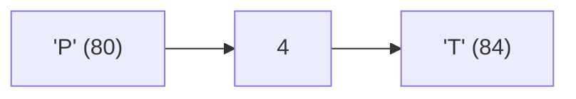

**📖 Penjelasan:**
**Langkah Tracing:**
1. ch='P' (ASCII 80).
2. 80 + (4) = 84.
3. Hasil: 'T'.

---
### Soal 114
```cpp
int n = 44;
int m = 3;
int res = n % m;
```
**Pertanyaan:**
1. Berapakah hasil akhirnya?
2. Mengapa demikian?

**Jawaban & Diagnosis:**
1. **2**
2. Lihat Tracing.

**Mermaid Flowchart:**


**📖 Penjelasan:**
**Langkah Tracing:**
1. n=44, m=3.
2. 44 dibagi 3 sisa 2.
3. Hasil: 2.

---
### Soal 115
```cpp
double val = 39.47;
int res = (int)val;
```
**Pertanyaan:**
1. Berapakah hasil akhirnya?
2. Mengapa demikian?

**Jawaban & Diagnosis:**
1. **39**
2. Lihat Tracing.

**Mermaid Flowchart:**
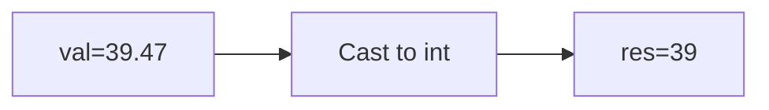

**📖 Penjelasan:**
**Langkah Tracing:**
1. val=39.47.
2. Desimal dihilangkan.
3. Hasil: 39.

---
### Soal 116
```cpp
int n = 6;
int m = 10;
int res = n % m;
```
**Pertanyaan:**
1. Berapakah hasil akhirnya?
2. Mengapa demikian?

**Jawaban & Diagnosis:**
1. **6**
2. Lihat Tracing.

**Mermaid Flowchart:**
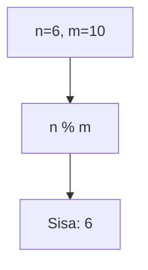

**📖 Penjelasan:**
**Langkah Tracing:**
1. n=6, m=10.
2. 6 dibagi 10 sisa 6.
3. Hasil: 6.

---
### Soal 117
```cpp
int a = 47, b = 9;
int res = a / b;
```
**Pertanyaan:**
1. Berapakah hasil akhirnya?
2. Mengapa demikian?

**Jawaban & Diagnosis:**
1. **5**
2. Lihat Tracing.

**Mermaid Flowchart:**
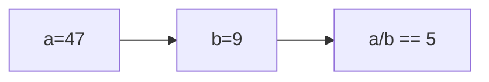

**📖 Penjelasan:**
**Langkah Tracing:**
1. a=47, b=9.
2. 47/9 = 5.22. Karena `int`, desimal dibuang.
3. Hasil: 5.

---
### Soal 118
```cpp
char ch = 'B';
ch = ch + (1);
```
**Pertanyaan:**
1. Berapakah hasil akhirnya?
2. Mengapa demikian?

**Jawaban & Diagnosis:**
1. **C**
2. Lihat Tracing.

**Mermaid Flowchart:**


**📖 Penjelasan:**
**Langkah Tracing:**
1. ch='B' (ASCII 66).
2. 66 + (1) = 67.
3. Hasil: 'C'.

---
### Soal 119
```cpp
int x = 50, y = 4;
int res = x / y;
```
**Pertanyaan:**
1. Berapakah hasil akhirnya?
2. Mengapa demikian?

**Jawaban & Diagnosis:**
1. **12**
2. Lihat Tracing.

**Mermaid Flowchart:**
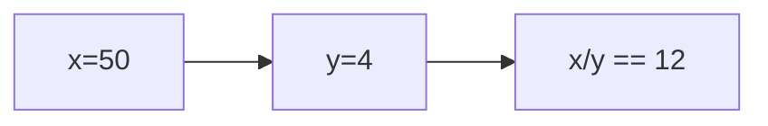

**📖 Penjelasan:**
**Langkah Tracing:**
1. x=50, y=4.
2. 50/4 = 12.50. Karena `int`, desimal dibuang.
3. Hasil: 12.

---
### Soal 120
```cpp
int a = 97, y = 3;
int res = a / y;
```
**Pertanyaan:**
1. Berapakah hasil akhirnya?
2. Mengapa demikian?

**Jawaban & Diagnosis:**
1. **32**
2. Lihat Tracing.

**Mermaid Flowchart:**
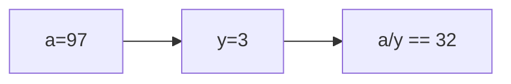

**📖 Penjelasan:**
**Langkah Tracing:**
1. a=97, y=3.
2. 97/3 = 32.33. Karena `int`, desimal dibuang.
3. Hasil: 32.

---
### Soal 121
```cpp
int x = 71, y = 9;
int res = x / y;
```
**Pertanyaan:**
1. Berapakah hasil akhirnya?
2. Mengapa demikian?

**Jawaban & Diagnosis:**
1. **7**
2. Lihat Tracing.

**Mermaid Flowchart:**
```mermaid
graph LR
A["x=71"] --> B["y=9"]
B --> C["x/y == 7"]
```

**📖 Penjelasan:**
**Langkah Tracing:**
1. x=71, y=9.
2. 71/9 = 7.89. Karena `int`, desimal dibuang.
3. Hasil: 7.

---
### Soal 122
```cpp
int n = 68, y = 9;
int res = n / y;
```
**Pertanyaan:**
1. Berapakah hasil akhirnya?
2. Mengapa demikian?

**Jawaban & Diagnosis:**
1. **7**
2. Lihat Tracing.

**Mermaid Flowchart:**
```mermaid
graph LR
A["n=68"] --> B["y=9"]
B --> C["n/y == 7"]
```

**📖 Penjelasan:**
**Langkah Tracing:**
1. n=68, y=9.
2. 68/9 = 7.56. Karena `int`, desimal dibuang.
3. Hasil: 7.

---
### Soal 123
```cpp
double val = 76.25;
int res = (int)val;
```
**Pertanyaan:**
1. Berapakah hasil akhirnya?
2. Mengapa demikian?

**Jawaban & Diagnosis:**
1. **76**
2. Lihat Tracing.

**Mermaid Flowchart:**
```mermaid
graph LR
A["val=76.25"] --> B["Cast to int"]
B --> C["res=76"]
```

**📖 Penjelasan:**
**Langkah Tracing:**
1. val=76.25.
2. Desimal dihilangkan.
3. Hasil: 76.

---
### Soal 124
```cpp
int n = 11;
int m = 10;
int res = n % m;
```
**Pertanyaan:**
1. Berapakah hasil akhirnya?
2. Mengapa demikian?

**Jawaban & Diagnosis:**
1. **1**
2. Lihat Tracing.

**Mermaid Flowchart:**
```mermaid
graph TD
A["n=11, m=10"] --> B["n % m"]
B --> C["Sisa: 1"]
```

**📖 Penjelasan:**
**Langkah Tracing:**
1. n=11, m=10.
2. 11 dibagi 10 sisa 1.
3. Hasil: 1.

---
### Soal 125
```cpp
int a = 42, y = 3;
int res = a / y;
```
**Pertanyaan:**
1. Berapakah hasil akhirnya?
2. Mengapa demikian?

**Jawaban & Diagnosis:**
1. **14**
2. Lihat Tracing.

**Mermaid Flowchart:**
```mermaid
graph LR
A["a=42"] --> B["y=3"]
B --> C["a/y == 14"]
```

**📖 Penjelasan:**
**Langkah Tracing:**
1. a=42, y=3.
2. 42/3 = 14.00. Karena `int`, desimal dibuang.
3. Hasil: 14.

---
