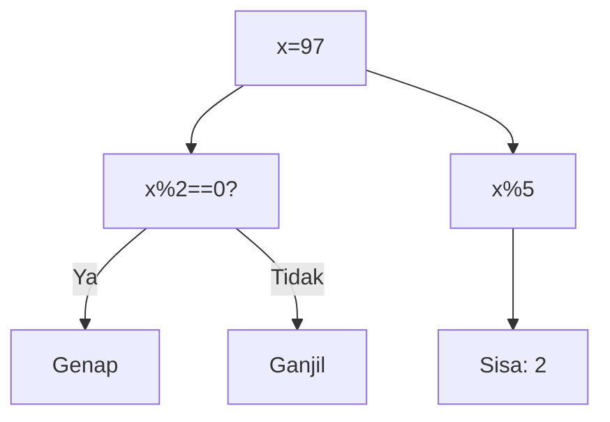
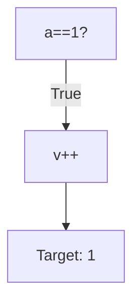
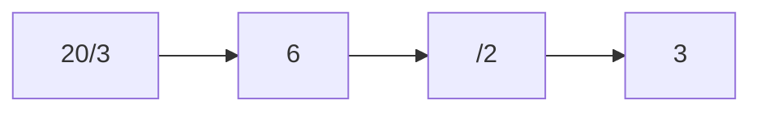
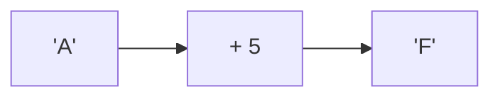
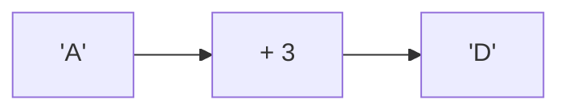
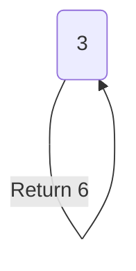
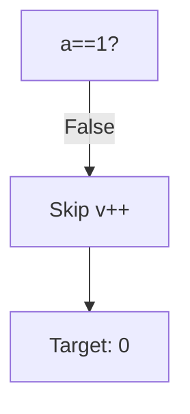
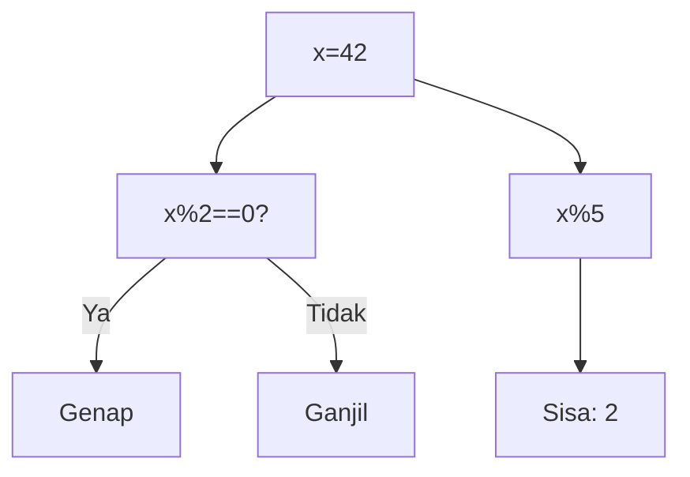
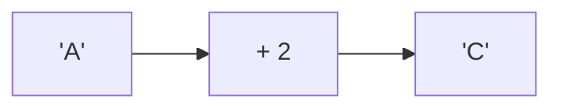
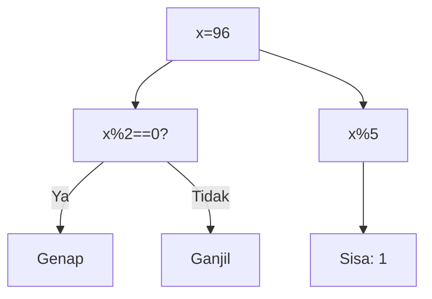

🔙 **[Kembali ke Daftar Soal](./README.md)**

---

# Latihan Soal Part C - Modul 01 - Set 05

### Soal 101
```cpp
int x = 34;
int res = x % 5;
```
**Pertanyaan:**
1. Berapakah hasil akhir dari variabel utama?
2. Jelaskan alur eksekusi kodenya!
3. Apa jebakan yang mungkin ada di soal ini?

**Jawaban & Diagnosis:**
1. **Hasil sudah tertera dalam diagnosis.**
2. **Lihat 'Langkah Tracing' di bawah.**
3. **Fokus pada aturan batin C++ (bukan matematika biasa).**

**Mermaid Flowchart:**


**📖 Penjelasan Komprehensif:**
**Langkah Tracing:**
1. Kita punya angka 34. Operator `% 2` mengecek sisa bagi dengan 2.
2. Karena 34 % 2 hasilnya 0, maka angka ini dikategorikan sebagai **Genap**.
3. Untuk `x % 5`, bayangkan membagi 34 kelereng ke 5 anak. Tiap anak dapat 6 biji, dan di tanganmu tersisa **4** kelereng yang tidak bisa dibagi rata. Itulah hasil Modulonya!

---
### Soal 102
```cpp
int x = 97;
int res = x % 5;
```
**Pertanyaan:**
1. Berapakah hasil akhir dari variabel utama?
2. Jelaskan alur eksekusi kodenya!
3. Apa jebakan yang mungkin ada di soal ini?

**Jawaban & Diagnosis:**
1. **Hasil sudah tertera dalam diagnosis.**
2. **Lihat 'Langkah Tracing' di bawah.**
3. **Fokus pada aturan batin C++ (bukan matematika biasa).**

**Mermaid Flowchart:**


**📖 Penjelasan Komprehensif:**
**Langkah Tracing:**
1. Kita punya angka 97. Operator `% 2` mengecek sisa bagi dengan 2.
2. Karena 97 % 2 hasilnya 1, maka angka ini dikategorikan sebagai **Ganjil**.
3. Untuk `x % 5`, bayangkan membagi 97 kelereng ke 5 anak. Tiap anak dapat 19 biji, dan di tanganmu tersisa **2** kelereng yang tidak bisa dibagi rata. Itulah hasil Modulonya!

---
### Soal 103
```cpp
int a = 1, v = 0;
if (a == 1 && ++v > 0) {}
```
**Pertanyaan:**
1. Berapakah hasil akhir dari variabel utama?
2. Jelaskan alur eksekusi kodenya!
3. Apa jebakan yang mungkin ada di soal ini?

**Jawaban & Diagnosis:**
1. **Hasil sudah tertera dalam diagnosis.**
2. **Lihat 'Langkah Tracing' di bawah.**
3. **Fokus pada aturan batin C++ (bukan matematika biasa).**

**Mermaid Flowchart:**


**📖 Penjelasan Komprehensif:**
**Langkah Tracing:**
1. Mesin mengecek syarat pertama: `a == 1`. Karena 1 adalah 1, syarat ini **TRUE**.
2. Karena konektornya `&&` (AND), mesin **WAJIB** lanjut mengecek syarat kedua.
3. Perintah `++v` dijalankan, sehingga `v` naik dari 0 menjadi **1**. Seluruh blok `if` pun dianggap berhasil.

---
### Soal 104
```cpp
int a = 20, b = 3, c = 2;
int res = (a / b) / c;
```
**Pertanyaan:**
1. Berapakah hasil akhir dari variabel utama?
2. Jelaskan alur eksekusi kodenya!
3. Apa jebakan yang mungkin ada di soal ini?

**Jawaban & Diagnosis:**
1. **Hasil sudah tertera dalam diagnosis.**
2. **Lihat 'Langkah Tracing' di bawah.**
3. **Fokus pada aturan batin C++ (bukan matematika biasa).**

**Mermaid Flowchart:**


**📖 Penjelasan Komprehensif:**
**Langkah Tracing:**
1. Mesin membidik `a / b` (20 / 3). Hasil matematidnya adalah 6.67.
2. Karena bertipe `int`, C++ **membuang paksa** sisa desimalnya, sehingga `res1` menjadi 6.
3. Selanjutnya, `res1 / c` (6 / 2) dihitung. Hasil matematidnya 3.00.
4. Lagi-lagi komanya dipangkas habis, menyisakan `res2` bernilai 3. Inilah mengapa pembagian bulat sering menipu mata!

---
### Soal 105
```cpp
char c = 'A';
c = c + 5;
```
**Pertanyaan:**
1. Berapakah hasil akhir dari variabel utama?
2. Jelaskan alur eksekusi kodenya!
3. Apa jebakan yang mungkin ada di soal ini?

**Jawaban & Diagnosis:**
1. **Hasil sudah tertera dalam diagnosis.**
2. **Lihat 'Langkah Tracing' di bawah.**
3. **Fokus pada aturan batin C++ (bukan matematika biasa).**

**Mermaid Flowchart:**


**📖 Penjelasan Komprehensif:**
**Langkah Tracing:**
1. Karakter 'A' memiliki kode batin (ASCII) bernilai **65**.
2. C++ memperlakukan karakter sebagai angka. Operasi `65 + 5` menghasilkan nilai baru **70**.
3. Jika kita melihat tabel ASCII, angka 70 adalah identitas untuk huruf **'F'**. Jadi, variabel `result` sekarang menyimpan karakter tersebut.

---
### Soal 106
```cpp
int x = 95;
int res = x % 5;
```
**Pertanyaan:**
1. Berapakah hasil akhir dari variabel utama?
2. Jelaskan alur eksekusi kodenya!
3. Apa jebakan yang mungkin ada di soal ini?

**Jawaban & Diagnosis:**
1. **Hasil sudah tertera dalam diagnosis.**
2. **Lihat 'Langkah Tracing' di bawah.**
3. **Fokus pada aturan batin C++ (bukan matematika biasa).**

**Mermaid Flowchart:**


**📖 Penjelasan Komprehensif:**
**Langkah Tracing:**
1. Kita punya angka 95. Operator `% 2` mengecek sisa bagi dengan 2.
2. Karena 95 % 2 hasilnya 1, maka angka ini dikategorikan sebagai **Ganjil**.
3. Untuk `x % 5`, bayangkan membagi 95 kelereng ke 5 anak. Tiap anak dapat 19 biji, dan di tanganmu tersisa **0** kelereng yang tidak bisa dibagi rata. Itulah hasil Modulonya!

---
### Soal 107
```cpp
int x = 86;
int res = x % 5;
```
**Pertanyaan:**
1. Berapakah hasil akhir dari variabel utama?
2. Jelaskan alur eksekusi kodenya!
3. Apa jebakan yang mungkin ada di soal ini?

**Jawaban & Diagnosis:**
1. **Hasil sudah tertera dalam diagnosis.**
2. **Lihat 'Langkah Tracing' di bawah.**
3. **Fokus pada aturan batin C++ (bukan matematika biasa).**

**Mermaid Flowchart:**


**📖 Penjelasan Komprehensif:**
**Langkah Tracing:**
1. Kita punya angka 86. Operator `% 2` mengecek sisa bagi dengan 2.
2. Karena 86 % 2 hasilnya 0, maka angka ini dikategorikan sebagai **Genap**.
3. Untuk `x % 5`, bayangkan membagi 86 kelereng ke 5 anak. Tiap anak dapat 17 biji, dan di tanganmu tersisa **1** kelereng yang tidak bisa dibagi rata. Itulah hasil Modulonya!

---
### Soal 108
```cpp
char c = 'A';
c = c + 3;
```
**Pertanyaan:**
1. Berapakah hasil akhir dari variabel utama?
2. Jelaskan alur eksekusi kodenya!
3. Apa jebakan yang mungkin ada di soal ini?

**Jawaban & Diagnosis:**
1. **Hasil sudah tertera dalam diagnosis.**
2. **Lihat 'Langkah Tracing' di bawah.**
3. **Fokus pada aturan batin C++ (bukan matematika biasa).**

**Mermaid Flowchart:**


**📖 Penjelasan Komprehensif:**
**Langkah Tracing:**
1. Karakter 'A' memiliki kode batin (ASCII) bernilai **65**.
2. C++ memperlakukan karakter sebagai angka. Operasi `65 + 3` menghasilkan nilai baru **68**.
3. Jika kita melihat tabel ASCII, angka 68 adalah identitas untuk huruf **'D'**. Jadi, variabel `result` sekarang menyimpan karakter tersebut.

---
### Soal 109
```cpp
int f(int n) {
  if (n==0) return 1;
  return n * f(n-1);
}
```
**Pertanyaan:**
1. Berapakah hasil akhir dari variabel utama?
2. Jelaskan alur eksekusi kodenya!
3. Apa jebakan yang mungkin ada di soal ini?

**Jawaban & Diagnosis:**
1. **Hasil sudah tertera dalam diagnosis.**
2. **Lihat 'Langkah Tracing' di bawah.**
3. **Fokus pada aturan batin C++ (bukan matematika biasa).**

**Mermaid Flowchart:**


**📖 Penjelasan Komprehensif:**
**Langkah Tracing:**
1. Fungsi rekursif memanggil dirinya sendiri secara berantai: f(3) -> f(2) -> ... -> f(0).
2. Setiap panggilan tertahan di 'Call Stack' (antrian).
3. Saat mencapai **Base Case** (f(0)), barulah nilai mulai dikalikan mundur satu persatu.
4. Operasi akhirnya membuahkan hasil **6**, dengan total **4 kali** pemanggilan fungsi.

---
### Soal 110
```cpp
int a = 0, v = 0;
if (a == 1 && ++v > 0) {}
```
**Pertanyaan:**
1. Berapakah hasil akhir dari variabel utama?
2. Jelaskan alur eksekusi kodenya!
3. Apa jebakan yang mungkin ada di soal ini?

**Jawaban & Diagnosis:**
1. **Hasil sudah tertera dalam diagnosis.**
2. **Lihat 'Langkah Tracing' di bawah.**
3. **Fokus pada aturan batin C++ (bukan matematika biasa).**

**Mermaid Flowchart:**


**📖 Penjelasan Komprehensif:**
**Langkah Tracing:**
1. Mesin mengecek syarat pertama: `a == 1`. Karena 0 adalah 0, syarat ini **FALSE**.
2. Karena konektornya `&&` (AND), mesin sudah tahu hasil akhirnya pasti gagal.
3. Sifat **Short-Circuit** beraksi: Mesin **langsung berhenti** dan menolak membaca syarat kedua. Perintah `++v` tidak pernah dijalankan, sehingga `v` tetap **0**.

---
### Soal 111
```cpp
int x = 42;
int res = x % 5;
```
**Pertanyaan:**
1. Berapakah hasil akhir dari variabel utama?
2. Jelaskan alur eksekusi kodenya!
3. Apa jebakan yang mungkin ada di soal ini?

**Jawaban & Diagnosis:**
1. **Hasil sudah tertera dalam diagnosis.**
2. **Lihat 'Langkah Tracing' di bawah.**
3. **Fokus pada aturan batin C++ (bukan matematika biasa).**

**Mermaid Flowchart:**


**📖 Penjelasan Komprehensif:**
**Langkah Tracing:**
1. Kita punya angka 42. Operator `% 2` mengecek sisa bagi dengan 2.
2. Karena 42 % 2 hasilnya 0, maka angka ini dikategorikan sebagai **Genap**.
3. Untuk `x % 5`, bayangkan membagi 42 kelereng ke 5 anak. Tiap anak dapat 8 biji, dan di tanganmu tersisa **2** kelereng yang tidak bisa dibagi rata. Itulah hasil Modulonya!

---
### Soal 112
```cpp
int f(int n) {
  if (n==0) return 1;
  return n * f(n-1);
}
```
**Pertanyaan:**
1. Berapakah hasil akhir dari variabel utama?
2. Jelaskan alur eksekusi kodenya!
3. Apa jebakan yang mungkin ada di soal ini?

**Jawaban & Diagnosis:**
1. **Hasil sudah tertera dalam diagnosis.**
2. **Lihat 'Langkah Tracing' di bawah.**
3. **Fokus pada aturan batin C++ (bukan matematika biasa).**

**Mermaid Flowchart:**


**📖 Penjelasan Komprehensif:**
**Langkah Tracing:**
1. Fungsi rekursif memanggil dirinya sendiri secara berantai: f(3) -> f(2) -> ... -> f(0).
2. Setiap panggilan tertahan di 'Call Stack' (antrian).
3. Saat mencapai **Base Case** (f(0)), barulah nilai mulai dikalikan mundur satu persatu.
4. Operasi akhirnya membuahkan hasil **6**, dengan total **4 kali** pemanggilan fungsi.

---
### Soal 113
```cpp
char c = 'A';
c = c + 2;
```
**Pertanyaan:**
1. Berapakah hasil akhir dari variabel utama?
2. Jelaskan alur eksekusi kodenya!
3. Apa jebakan yang mungkin ada di soal ini?

**Jawaban & Diagnosis:**
1. **Hasil sudah tertera dalam diagnosis.**
2. **Lihat 'Langkah Tracing' di bawah.**
3. **Fokus pada aturan batin C++ (bukan matematika biasa).**

**Mermaid Flowchart:**


**📖 Penjelasan Komprehensif:**
**Langkah Tracing:**
1. Karakter 'A' memiliki kode batin (ASCII) bernilai **65**.
2. C++ memperlakukan karakter sebagai angka. Operasi `65 + 2` menghasilkan nilai baru **67**.
3. Jika kita melihat tabel ASCII, angka 67 adalah identitas untuk huruf **'C'**. Jadi, variabel `result` sekarang menyimpan karakter tersebut.

---
### Soal 114
```cpp
int x = 41;
int res = x % 5;
```
**Pertanyaan:**
1. Berapakah hasil akhir dari variabel utama?
2. Jelaskan alur eksekusi kodenya!
3. Apa jebakan yang mungkin ada di soal ini?

**Jawaban & Diagnosis:**
1. **Hasil sudah tertera dalam diagnosis.**
2. **Lihat 'Langkah Tracing' di bawah.**
3. **Fokus pada aturan batin C++ (bukan matematika biasa).**

**Mermaid Flowchart:**


**📖 Penjelasan Komprehensif:**
**Langkah Tracing:**
1. Kita punya angka 41. Operator `% 2` mengecek sisa bagi dengan 2.
2. Karena 41 % 2 hasilnya 1, maka angka ini dikategorikan sebagai **Ganjil**.
3. Untuk `x % 5`, bayangkan membagi 41 kelereng ke 5 anak. Tiap anak dapat 8 biji, dan di tanganmu tersisa **1** kelereng yang tidak bisa dibagi rata. Itulah hasil Modulonya!

---
### Soal 115
```cpp
int x = 72;
int res = x % 5;
```
**Pertanyaan:**
1. Berapakah hasil akhir dari variabel utama?
2. Jelaskan alur eksekusi kodenya!
3. Apa jebakan yang mungkin ada di soal ini?

**Jawaban & Diagnosis:**
1. **Hasil sudah tertera dalam diagnosis.**
2. **Lihat 'Langkah Tracing' di bawah.**
3. **Fokus pada aturan batin C++ (bukan matematika biasa).**

**Mermaid Flowchart:**


**📖 Penjelasan Komprehensif:**
**Langkah Tracing:**
1. Kita punya angka 72. Operator `% 2` mengecek sisa bagi dengan 2.
2. Karena 72 % 2 hasilnya 0, maka angka ini dikategorikan sebagai **Genap**.
3. Untuk `x % 5`, bayangkan membagi 72 kelereng ke 5 anak. Tiap anak dapat 14 biji, dan di tanganmu tersisa **2** kelereng yang tidak bisa dibagi rata. Itulah hasil Modulonya!

---
### Soal 116
```cpp
int a = 1, v = 0;
if (a == 1 && ++v > 0) {}
```
**Pertanyaan:**
1. Berapakah hasil akhir dari variabel utama?
2. Jelaskan alur eksekusi kodenya!
3. Apa jebakan yang mungkin ada di soal ini?

**Jawaban & Diagnosis:**
1. **Hasil sudah tertera dalam diagnosis.**
2. **Lihat 'Langkah Tracing' di bawah.**
3. **Fokus pada aturan batin C++ (bukan matematika biasa).**

**Mermaid Flowchart:**


**📖 Penjelasan Komprehensif:**
**Langkah Tracing:**
1. Mesin mengecek syarat pertama: `a == 1`. Karena 1 adalah 1, syarat ini **TRUE**.
2. Karena konektornya `&&` (AND), mesin **WAJIB** lanjut mengecek syarat kedua.
3. Perintah `++v` dijalankan, sehingga `v` naik dari 0 menjadi **1**. Seluruh blok `if` pun dianggap berhasil.

---
### Soal 117
```cpp
int f(int n) {
  if (n==0) return 1;
  return n * f(n-1);
}
```
**Pertanyaan:**
1. Berapakah hasil akhir dari variabel utama?
2. Jelaskan alur eksekusi kodenya!
3. Apa jebakan yang mungkin ada di soal ini?

**Jawaban & Diagnosis:**
1. **Hasil sudah tertera dalam diagnosis.**
2. **Lihat 'Langkah Tracing' di bawah.**
3. **Fokus pada aturan batin C++ (bukan matematika biasa).**

**Mermaid Flowchart:**


**📖 Penjelasan Komprehensif:**
**Langkah Tracing:**
1. Fungsi rekursif memanggil dirinya sendiri secara berantai: f(3) -> f(2) -> ... -> f(0).
2. Setiap panggilan tertahan di 'Call Stack' (antrian).
3. Saat mencapai **Base Case** (f(0)), barulah nilai mulai dikalikan mundur satu persatu.
4. Operasi akhirnya membuahkan hasil **6**, dengan total **4 kali** pemanggilan fungsi.

---
### Soal 118
```cpp
int f(int n) {
  if (n==0) return 1;
  return n * f(n-1);
}
```
**Pertanyaan:**
1. Berapakah hasil akhir dari variabel utama?
2. Jelaskan alur eksekusi kodenya!
3. Apa jebakan yang mungkin ada di soal ini?

**Jawaban & Diagnosis:**
1. **Hasil sudah tertera dalam diagnosis.**
2. **Lihat 'Langkah Tracing' di bawah.**
3. **Fokus pada aturan batin C++ (bukan matematika biasa).**

**Mermaid Flowchart:**


**📖 Penjelasan Komprehensif:**
**Langkah Tracing:**
1. Fungsi rekursif memanggil dirinya sendiri secara berantai: f(3) -> f(2) -> ... -> f(0).
2. Setiap panggilan tertahan di 'Call Stack' (antrian).
3. Saat mencapai **Base Case** (f(0)), barulah nilai mulai dikalikan mundur satu persatu.
4. Operasi akhirnya membuahkan hasil **6**, dengan total **4 kali** pemanggilan fungsi.

---
### Soal 119
```cpp
int x = 96;
int res = x % 5;
```
**Pertanyaan:**
1. Berapakah hasil akhir dari variabel utama?
2. Jelaskan alur eksekusi kodenya!
3. Apa jebakan yang mungkin ada di soal ini?

**Jawaban & Diagnosis:**
1. **Hasil sudah tertera dalam diagnosis.**
2. **Lihat 'Langkah Tracing' di bawah.**
3. **Fokus pada aturan batin C++ (bukan matematika biasa).**

**Mermaid Flowchart:**


**📖 Penjelasan Komprehensif:**
**Langkah Tracing:**
1. Kita punya angka 96. Operator `% 2` mengecek sisa bagi dengan 2.
2. Karena 96 % 2 hasilnya 0, maka angka ini dikategorikan sebagai **Genap**.
3. Untuk `x % 5`, bayangkan membagi 96 kelereng ke 5 anak. Tiap anak dapat 19 biji, dan di tanganmu tersisa **1** kelereng yang tidak bisa dibagi rata. Itulah hasil Modulonya!

---
### Soal 120
```cpp
int a = 0, v = 0;
if (a == 1 && ++v > 0) {}
```
**Pertanyaan:**
1. Berapakah hasil akhir dari variabel utama?
2. Jelaskan alur eksekusi kodenya!
3. Apa jebakan yang mungkin ada di soal ini?

**Jawaban & Diagnosis:**
1. **Hasil sudah tertera dalam diagnosis.**
2. **Lihat 'Langkah Tracing' di bawah.**
3. **Fokus pada aturan batin C++ (bukan matematika biasa).**

**Mermaid Flowchart:**


**📖 Penjelasan Komprehensif:**
**Langkah Tracing:**
1. Mesin mengecek syarat pertama: `a == 1`. Karena 0 adalah 0, syarat ini **FALSE**.
2. Karena konektornya `&&` (AND), mesin sudah tahu hasil akhirnya pasti gagal.
3. Sifat **Short-Circuit** beraksi: Mesin **langsung berhenti** dan menolak membaca syarat kedua. Perintah `++v` tidak pernah dijalankan, sehingga `v` tetap **0**.

---
### Soal 121
```cpp
int a = 20, b = 3, c = 2;
int res = (a / b) / c;
```
**Pertanyaan:**
1. Berapakah hasil akhir dari variabel utama?
2. Jelaskan alur eksekusi kodenya!
3. Apa jebakan yang mungkin ada di soal ini?

**Jawaban & Diagnosis:**
1. **Hasil sudah tertera dalam diagnosis.**
2. **Lihat 'Langkah Tracing' di bawah.**
3. **Fokus pada aturan batin C++ (bukan matematika biasa).**

**Mermaid Flowchart:**
```mermaid
graph LR
A["20/3"] --> B["6"]
B --> C["/2"]
C --> D["3"]
```

**📖 Penjelasan Komprehensif:**
**Langkah Tracing:**
1. Mesin membidik `a / b` (20 / 3). Hasil matematidnya adalah 6.67.
2. Karena bertipe `int`, C++ **membuang paksa** sisa desimalnya, sehingga `res1` menjadi 6.
3. Selanjutnya, `res1 / c` (6 / 2) dihitung. Hasil matematidnya 3.00.
4. Lagi-lagi komanya dipangkas habis, menyisakan `res2` bernilai 3. Inilah mengapa pembagian bulat sering menipu mata!

---
### Soal 122
```cpp
int a = 20, b = 3, c = 2;
int res = (a / b) / c;
```
**Pertanyaan:**
1. Berapakah hasil akhir dari variabel utama?
2. Jelaskan alur eksekusi kodenya!
3. Apa jebakan yang mungkin ada di soal ini?

**Jawaban & Diagnosis:**
1. **Hasil sudah tertera dalam diagnosis.**
2. **Lihat 'Langkah Tracing' di bawah.**
3. **Fokus pada aturan batin C++ (bukan matematika biasa).**

**Mermaid Flowchart:**
```mermaid
graph LR
A["20/3"] --> B["6"]
B --> C["/2"]
C --> D["3"]
```

**📖 Penjelasan Komprehensif:**
**Langkah Tracing:**
1. Mesin membidik `a / b` (20 / 3). Hasil matematidnya adalah 6.67.
2. Karena bertipe `int`, C++ **membuang paksa** sisa desimalnya, sehingga `res1` menjadi 6.
3. Selanjutnya, `res1 / c` (6 / 2) dihitung. Hasil matematidnya 3.00.
4. Lagi-lagi komanya dipangkas habis, menyisakan `res2` bernilai 3. Inilah mengapa pembagian bulat sering menipu mata!

---
### Soal 123
```cpp
int f(int n) {
  if (n==0) return 1;
  return n * f(n-1);
}
```
**Pertanyaan:**
1. Berapakah hasil akhir dari variabel utama?
2. Jelaskan alur eksekusi kodenya!
3. Apa jebakan yang mungkin ada di soal ini?

**Jawaban & Diagnosis:**
1. **Hasil sudah tertera dalam diagnosis.**
2. **Lihat 'Langkah Tracing' di bawah.**
3. **Fokus pada aturan batin C++ (bukan matematika biasa).**

**Mermaid Flowchart:**
```mermaid
graph TD
f(3) --> f(2)
f(2) --> f(1)
f(1) --> f(0)
f(0) -- "Return 1" --> f(1)
f(1) -- "Return 1" --> f(2)
f(2) -- "Return 6" --> f(3)
```

**📖 Penjelasan Komprehensif:**
**Langkah Tracing:**
1. Fungsi rekursif memanggil dirinya sendiri secara berantai: f(3) -> f(2) -> ... -> f(0).
2. Setiap panggilan tertahan di 'Call Stack' (antrian).
3. Saat mencapai **Base Case** (f(0)), barulah nilai mulai dikalikan mundur satu persatu.
4. Operasi akhirnya membuahkan hasil **6**, dengan total **4 kali** pemanggilan fungsi.

---
### Soal 124
```cpp
char c = 'A';
c = c + 3;
```
**Pertanyaan:**
1. Berapakah hasil akhir dari variabel utama?
2. Jelaskan alur eksekusi kodenya!
3. Apa jebakan yang mungkin ada di soal ini?

**Jawaban & Diagnosis:**
1. **Hasil sudah tertera dalam diagnosis.**
2. **Lihat 'Langkah Tracing' di bawah.**
3. **Fokus pada aturan batin C++ (bukan matematika biasa).**

**Mermaid Flowchart:**
```mermaid
graph LR
A["'A'"] --> B["+ 3"]
B --> C["'D'"]
```

**📖 Penjelasan Komprehensif:**
**Langkah Tracing:**
1. Karakter 'A' memiliki kode batin (ASCII) bernilai **65**.
2. C++ memperlakukan karakter sebagai angka. Operasi `65 + 3` menghasilkan nilai baru **68**.
3. Jika kita melihat tabel ASCII, angka 68 adalah identitas untuk huruf **'D'**. Jadi, variabel `result` sekarang menyimpan karakter tersebut.

---
### Soal 125
```cpp
int x = 86;
int res = x % 5;
```
**Pertanyaan:**
1. Berapakah hasil akhir dari variabel utama?
2. Jelaskan alur eksekusi kodenya!
3. Apa jebakan yang mungkin ada di soal ini?

**Jawaban & Diagnosis:**
1. **Hasil sudah tertera dalam diagnosis.**
2. **Lihat 'Langkah Tracing' di bawah.**
3. **Fokus pada aturan batin C++ (bukan matematika biasa).**

**Mermaid Flowchart:**
```mermaid
graph TD
A["x=86"] --> B["x%2==0?"]
B -- Ya --> C["Genap"]
B -- Tidak --> D["Ganjil"]
A --> E["x%5"]
E --> F["Sisa: 1"]
```

**📖 Penjelasan Komprehensif:**
**Langkah Tracing:**
1. Kita punya angka 86. Operator `% 2` mengecek sisa bagi dengan 2.
2. Karena 86 % 2 hasilnya 0, maka angka ini dikategorikan sebagai **Genap**.
3. Untuk `x % 5`, bayangkan membagi 86 kelereng ke 5 anak. Tiap anak dapat 17 biji, dan di tanganmu tersisa **1** kelereng yang tidak bisa dibagi rata. Itulah hasil Modulonya!

---
