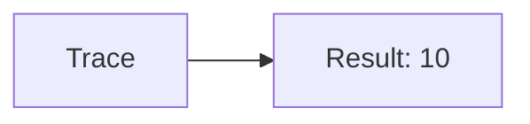
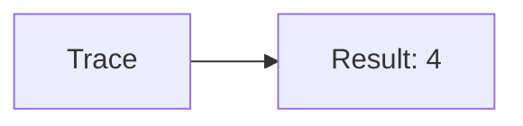
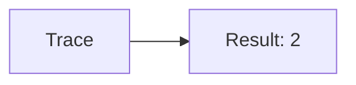
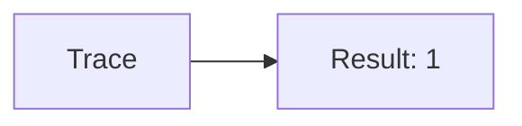
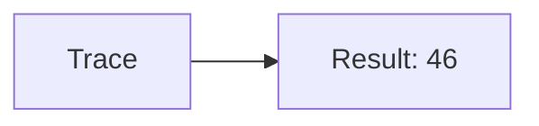
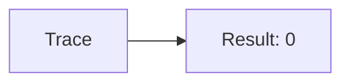
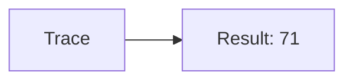
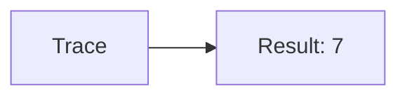
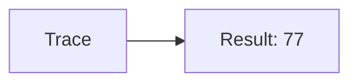

🔙 **[Kembali ke Daftar Soal](./README.md)**

---

# Latihan Soal Part C - Modul 01 - Set 05

### Soal 101
```cpp
// Permen: Pembagian
int permen = 60, bagi = 6;
int hasil = permen / bagi;
```
**Pertanyaan:**
1. Berapakah hasil akhirnya?
2. Deskripsikan alur pikir 'Compiler Manusia' untuk soal ini!

**Jawaban & Diagnosis:**
1. **10**
2. Membagi 60 Permen ke 6 bagian. Hasil bulat: 10.

**Mermaid Flowchart:**


---
### Soal 102
```cpp
// Tiket: Modulo
int tiket = 29, bagi = 5;
int sisa = tiket % bagi;
```
**Pertanyaan:**
1. Berapakah hasil akhirnya?
2. Deskripsikan alur pikir 'Compiler Manusia' untuk soal ini!

**Jawaban & Diagnosis:**
1. **4**
2. 29 Tiket dibagi 5 sisa 4.

**Mermaid Flowchart:**


---
### Soal 103
```cpp
// Buku: Casting
double val = 76.71;
int res = (int)val;
```
**Pertanyaan:**
1. Berapakah hasil akhirnya?
2. Deskripsikan alur pikir 'Compiler Manusia' untuk soal ini!

**Jawaban & Diagnosis:**
1. **76**
2. Mengubah 76.71 jadi integer (pangkas koma) jadi 76.

**Mermaid Flowchart:**


---
### Soal 104
```cpp
// Kelereng: Pembagian
int kelereng = 15, bagi = 7;
int hasil = kelereng / bagi;
```
**Pertanyaan:**
1. Berapakah hasil akhirnya?
2. Deskripsikan alur pikir 'Compiler Manusia' untuk soal ini!

**Jawaban & Diagnosis:**
1. **2**
2. Membagi 15 Kelereng ke 7 bagian. Hasil bulat: 2.

**Mermaid Flowchart:**


---
### Soal 105
```cpp
// Botol: Modulo
int botol = 36, bagi = 7;
int sisa = botol % bagi;
```
**Pertanyaan:**
1. Berapakah hasil akhirnya?
2. Deskripsikan alur pikir 'Compiler Manusia' untuk soal ini!

**Jawaban & Diagnosis:**
1. **1**
2. 36 Botol dibagi 7 sisa 1.

**Mermaid Flowchart:**


---
### Soal 106
```cpp
// Baju: Casting
double val = 46.31;
int res = (int)val;
```
**Pertanyaan:**
1. Berapakah hasil akhirnya?
2. Deskripsikan alur pikir 'Compiler Manusia' untuk soal ini!

**Jawaban & Diagnosis:**
1. **46**
2. Mengubah 46.31 jadi integer (pangkas koma) jadi 46.

**Mermaid Flowchart:**


---
### Soal 107
```cpp
// Sepatu: Pembagian
int sepatu = 48, bagi = 3;
int hasil = sepatu / bagi;
```
**Pertanyaan:**
1. Berapakah hasil akhirnya?
2. Deskripsikan alur pikir 'Compiler Manusia' untuk soal ini!

**Jawaban & Diagnosis:**
1. **16**
2. Membagi 48 Sepatu ke 3 bagian. Hasil bulat: 16.

**Mermaid Flowchart:**


---
### Soal 108
```cpp
// Tas: Modulo
int tas = 99, bagi = 7;
int sisa = tas % bagi;
```
**Pertanyaan:**
1. Berapakah hasil akhirnya?
2. Deskripsikan alur pikir 'Compiler Manusia' untuk soal ini!

**Jawaban & Diagnosis:**
1. **1**
2. 99 Tas dibagi 7 sisa 1.

**Mermaid Flowchart:**


---
### Soal 109
```cpp
// Piring: Casting
double val = 39.71;
int res = (int)val;
```
**Pertanyaan:**
1. Berapakah hasil akhirnya?
2. Deskripsikan alur pikir 'Compiler Manusia' untuk soal ini!

**Jawaban & Diagnosis:**
1. **39**
2. Mengubah 39.71 jadi integer (pangkas koma) jadi 39.

**Mermaid Flowchart:**


---
### Soal 110
```cpp
// Gelas: Pembagian
int gelas = 41, bagi = 5;
int hasil = gelas / bagi;
```
**Pertanyaan:**
1. Berapakah hasil akhirnya?
2. Deskripsikan alur pikir 'Compiler Manusia' untuk soal ini!

**Jawaban & Diagnosis:**
1. **8**
2. Membagi 41 Gelas ke 5 bagian. Hasil bulat: 8.

**Mermaid Flowchart:**


---
### Soal 111
```cpp
// Kursi: Modulo
int kursi = 23, bagi = 3;
int sisa = kursi % bagi;
```
**Pertanyaan:**
1. Berapakah hasil akhirnya?
2. Deskripsikan alur pikir 'Compiler Manusia' untuk soal ini!

**Jawaban & Diagnosis:**
1. **2**
2. 23 Kursi dibagi 3 sisa 2.

**Mermaid Flowchart:**


---
### Soal 112
```cpp
// Meja: Casting
double val = 52.41;
int res = (int)val;
```
**Pertanyaan:**
1. Berapakah hasil akhirnya?
2. Deskripsikan alur pikir 'Compiler Manusia' untuk soal ini!

**Jawaban & Diagnosis:**
1. **52**
2. Mengubah 52.41 jadi integer (pangkas koma) jadi 52.

**Mermaid Flowchart:**


---
### Soal 113
```cpp
// Lampu: Pembagian
int lampu = 18, bagi = 8;
int hasil = lampu / bagi;
```
**Pertanyaan:**
1. Berapakah hasil akhirnya?
2. Deskripsikan alur pikir 'Compiler Manusia' untuk soal ini!

**Jawaban & Diagnosis:**
1. **2**
2. Membagi 18 Lampu ke 8 bagian. Hasil bulat: 2.

**Mermaid Flowchart:**


---
### Soal 114
```cpp
// Kipas: Modulo
int kipas = 99, bagi = 3;
int sisa = kipas % bagi;
```
**Pertanyaan:**
1. Berapakah hasil akhirnya?
2. Deskripsikan alur pikir 'Compiler Manusia' untuk soal ini!

**Jawaban & Diagnosis:**
1. **0**
2. 99 Kipas dibagi 3 sisa 0.

**Mermaid Flowchart:**


---
### Soal 115
```cpp
// AC: Casting
double val = 71.21;
int res = (int)val;
```
**Pertanyaan:**
1. Berapakah hasil akhirnya?
2. Deskripsikan alur pikir 'Compiler Manusia' untuk soal ini!

**Jawaban & Diagnosis:**
1. **71**
2. Mengubah 71.21 jadi integer (pangkas koma) jadi 71.

**Mermaid Flowchart:**


---
### Soal 116
```cpp
// TV: Pembagian
int tv = 61, bagi = 8;
int hasil = tv / bagi;
```
**Pertanyaan:**
1. Berapakah hasil akhirnya?
2. Deskripsikan alur pikir 'Compiler Manusia' untuk soal ini!

**Jawaban & Diagnosis:**
1. **7**
2. Membagi 61 TV ke 8 bagian. Hasil bulat: 7.

**Mermaid Flowchart:**


---
### Soal 117
```cpp
// Kabel: Modulo
int kabel = 99, bagi = 7;
int sisa = kabel % bagi;
```
**Pertanyaan:**
1. Berapakah hasil akhirnya?
2. Deskripsikan alur pikir 'Compiler Manusia' untuk soal ini!

**Jawaban & Diagnosis:**
1. **1**
2. 99 Kabel dibagi 7 sisa 1.

**Mermaid Flowchart:**


---
### Soal 118
```cpp
// Pulpen: Casting
double val = 77.31;
int res = (int)val;
```
**Pertanyaan:**
1. Berapakah hasil akhirnya?
2. Deskripsikan alur pikir 'Compiler Manusia' untuk soal ini!

**Jawaban & Diagnosis:**
1. **77**
2. Mengubah 77.31 jadi integer (pangkas koma) jadi 77.

**Mermaid Flowchart:**


---
### Soal 119
```cpp
// Pensil: Pembagian
int pensil = 30, bagi = 4;
int hasil = pensil / bagi;
```
**Pertanyaan:**
1. Berapakah hasil akhirnya?
2. Deskripsikan alur pikir 'Compiler Manusia' untuk soal ini!

**Jawaban & Diagnosis:**
1. **7**
2. Membagi 30 Pensil ke 4 bagian. Hasil bulat: 7.

**Mermaid Flowchart:**


---
### Soal 120
```cpp
// Penghapus: Modulo
int penghapus = 12, bagi = 3;
int sisa = penghapus % bagi;
```
**Pertanyaan:**
1. Berapakah hasil akhirnya?
2. Deskripsikan alur pikir 'Compiler Manusia' untuk soal ini!

**Jawaban & Diagnosis:**
1. **0**
2. 12 Penghapus dibagi 3 sisa 0.

**Mermaid Flowchart:**


---
### Soal 121
```cpp
// Penggaris: Casting
double val = 45.21;
int res = (int)val;
```
**Pertanyaan:**
1. Berapakah hasil akhirnya?
2. Deskripsikan alur pikir 'Compiler Manusia' untuk soal ini!

**Jawaban & Diagnosis:**
1. **45**
2. Mengubah 45.21 jadi integer (pangkas koma) jadi 45.

**Mermaid Flowchart:**
```mermaid
graph LR
A[Trace] --> B[Result: 45]
```

---
### Soal 122
```cpp
// Kotak: Pembagian
int kotak = 97, bagi = 8;
int hasil = kotak / bagi;
```
**Pertanyaan:**
1. Berapakah hasil akhirnya?
2. Deskripsikan alur pikir 'Compiler Manusia' untuk soal ini!

**Jawaban & Diagnosis:**
1. **12**
2. Membagi 97 Kotak ke 8 bagian. Hasil bulat: 12.

**Mermaid Flowchart:**
```mermaid
graph LR
A[Trace] --> B[Result: 12]
```

---
### Soal 123
```cpp
// Dompet: Modulo
int dompet = 53, bagi = 4;
int sisa = dompet % bagi;
```
**Pertanyaan:**
1. Berapakah hasil akhirnya?
2. Deskripsikan alur pikir 'Compiler Manusia' untuk soal ini!

**Jawaban & Diagnosis:**
1. **1**
2. 53 Dompet dibagi 4 sisa 1.

**Mermaid Flowchart:**
```mermaid
graph LR
A[Trace] --> B[Result: 1]
```

---
### Soal 124
```cpp
// Kunci: Casting
double val = 54.71;
int res = (int)val;
```
**Pertanyaan:**
1. Berapakah hasil akhirnya?
2. Deskripsikan alur pikir 'Compiler Manusia' untuk soal ini!

**Jawaban & Diagnosis:**
1. **54**
2. Mengubah 54.71 jadi integer (pangkas koma) jadi 54.

**Mermaid Flowchart:**
```mermaid
graph LR
A[Trace] --> B[Result: 54]
```

---
### Soal 125
```cpp
// Hp: Pembagian
int hp = 96, bagi = 4;
int hasil = hp / bagi;
```
**Pertanyaan:**
1. Berapakah hasil akhirnya?
2. Deskripsikan alur pikir 'Compiler Manusia' untuk soal ini!

**Jawaban & Diagnosis:**
1. **24**
2. Membagi 96 Hp ke 4 bagian. Hasil bulat: 24.

**Mermaid Flowchart:**
```mermaid
graph LR
A[Trace] --> B[Result: 24]
```

---
