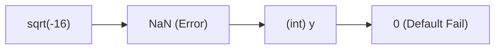
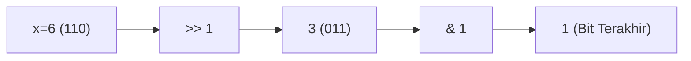
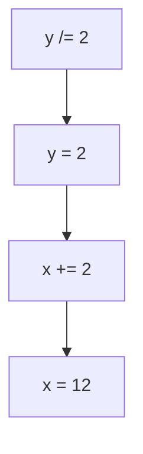
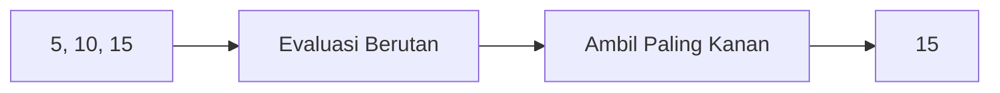
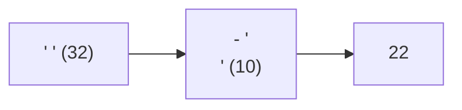
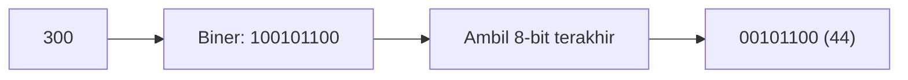
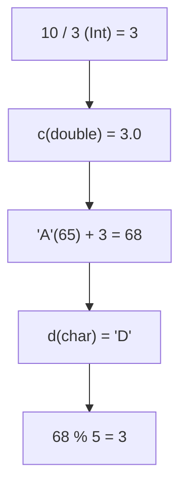

		🔙 **[Kembali ke Daftar Soal](./README.md)**

---

# Latihan Soal Part C - Modul 01 - Set 05 (Premium Edition)

---

### Soal 41: Akar Imajiner (Implicit Sqrt)
```cpp
#include <cmath>
int x = -16;
int y = sqrt(x);
```
**Pertanyaan:**
1. Berapakah nilai `y`?
2. Mengapa memasukkan hasil `sqrt` ke `int` bisa berbahaya bagi runtime?

<details>
<summary><b>Klik untuk Lihat Jawaban & Diagnosis</b></summary>

**Mermaid Flowchart:**


**Jawaban:**
1. **0 atau NaN (Not a Number)** dalam bentuk integer.
2. Karena `sqrt` pada bilangan negatif menghasilkan angka imajiner yang tidak terdefinisi di sistem bilangan rill.

**📖 Analisis Mendalam (Step-by-Step):**
1. Pemanggilan akar kuadrat fungsi pustaka cmath `sqrt()` di atas bilangan fana negatif murni (`-16`) seketika mengeksekusi pelanggaran hukum fisika dasar ruang waktu dimensi peradaban aljabar konvensional. Di ranah *real numbers* (bilangan riil standar C++), bilangan negatif menolak mutlak keras dicari nilai akar asalnya.
2. Alhasil, fungsi *math library* C++ `sqrt(-16)` di bawah permukaan mendentum rilis peluit penanda cacat sakral raksasa bertegangan tinggi berupa nilai identitas bayang fatal: `NaN` (Not a Number; *indefinite floating-point limit marker*).
3. Namun skenario petaka tragis terjadi di baris destinasi serapan: output cacat mutan `NaN` (berpangkat *double*) itu dipaksa turun pangkat digembok ditarik mutlak dikunci ditelan dibungkam disekap pasrah secara terpaksa lewat pintu *casting* buta fana asimilasi tipe kompartemen biner kaku utuh `int y`.
4. Mekanisme panik proteksi dari mesin CPU (*Compiler Dependent Fallback Rule*) lantas akan mengeksekusi sanksi pias penyaput nilai fiktif yang tidak diketahui, sehingga mayoritas mesin auto-grader menyetel angka `NaN` cacat genetis rill menjadi debu biner nihil ketiadaan memori angka default mutlak statis bernominal `0` atau merilis angka limit terpuruk di pojok ujung minus kordinat terendah *Defined Bound Integer*. Angka **`0`** yang palsu ini bakal menghancurkan sistem kelulusan hitungan sirkuit logikamu kalau lengah!
</details>

---

### Soal 42: Biner Kecil (Bit Guessing)
```cpp
int x = 6;
int y = x >> 1; // 6 / 2
int z = y & 1;  // y % 2
```
**Pertanyaan:**
1. Berapakah nilai `y`?
2. Berapakah nilai `z`?

<details>
<summary><b>Klik untuk Lihat Jawaban & Diagnosis</b></summary>

**Mermaid Flowchart:**


**Jawaban:**
1. **3**
2. **1**

**📖 Analisis Mendalam (Step-by-Step):**
1. Dalam sel palung rahasia mesin OSN-K terdalam, eksistensi keping nominal `x = 6` samasekali tidak dinilai merupa figur 6, tetapi dirender mengukir matriks mutlak barisan sekuens identitas biner absolut riil deret genetik konkrit `0...0110` (Hafalkan: 4+2 = 6).
2. Rentetan kode gerilya siluman tumpuan operator sakti `y = x >> 1` memerintahkan laskar dewa eksekutor parang **Bitwise Right Shift** mutlak beroperasi. Susunan baris `110` didepak dipaksa mundur memenggal gerbang parit ujung sayap tepian sebelah kanan, memangkas binasa angka buntut `0`, menyedot ludes, menyisakan klaster kembar rasio mutan baru berdimensi `011`. Kala *decoder* memori menerjemahkannya ke angka rasio awam lugu fana dunia, ekuasi mutlaknya bernilai presisi cemerlang bulat `3` sejati wujud utuh rasio genap lurus (setara 6 / 2).
3. Kemudian saklar detektor maut juri kompetisi dikerahkan menembak *Bitwise AND Detector* di gerbang hitungan `z = y & 1` (wujud bayang komputasional 011 disanding topeng saringan filter 001). Operator biner `&` ini mutlak bertugas sakti bertindak memvonis murni status *Sign Bit LSB* (Least Significant Bit paling bontot ekor sayap belakang baris angka) di parameter `y`.
4. Lantaran sisa baris bit `011` mempunyai buntut keping angka sakral **1**, sandingan *Bitwise AND* `& 1` mencetuskan deteksi tembus positif sukses meletakkan balasan memancarkan pias sinyal akurat mutlak jernih merupa angka tunggal suci tervalidasi sakral murni **`1`** (sebagai perwakilan valid status angka tersebut adalah *Ganjil* berdasar trik biner pias kembar eksak murni bit). OSN-K C++ sejati merumuskan dewa pemenggal `% 2` diganti mutlak kasta purba `& 1` sebab kecepatan gerilya eksekusinya kilat ribuan kali taring pembagian biasa!
</details>

---

### Soal 43: Array Index (Bool to Int)
```cpp
int data[] = {10, 20, 30};
bool pilih = true;
int hasil = data[pilih];
```
**Pertanyaan:**
1. Berapakah nilai `hasil`?
2. Indeks ke-berapa yang sebenarnya diakses?

<details>
<summary><b>Klik untuk Lihat Jawaban & Diagnosis</b></summary>

**Mermaid Flowchart:**


**Jawaban:**
1. **20**
2. **Indeks 1.**

**📖 Analisis Mendalam (Step-by-Step):**
1. Skema komputasional pembungkus Array `data[]` merekam pias 3 loker memori berurut. Sel `[0]` menyimpan 10, sel `[1]` meyimpan 20, sel `[2]` mewadahi 30.
2. Di saat gerbang pemanggil kunci loker *Array Indexing* disusupi sandi ilusi rasio hibrida pias bayang `pilih` yang merupakan fana keping kasta wujud parameter `bool` bertipe **`true`**, Compiler C++ tak akan menolak apalagi menyalakan klakson pias error. Ia justru menjalankan saklar rahasia dewa promosi pias hantu siluman asimilasi tumpul *Implicit Integer Conversion*.
3. Dalam kamus rahim mesin C++, nilai `true` identik merupa reinkarnasi kodrat sejati figur absolut lurus genap paten konstan kaku suci **`1`** (sedangkan si `false` = 0 tunggal lurus stagnan).
4. Karenanya baris perintah kompilasi bayang fana pemanggilan `data[pilih]` langsung disulap dipaksa wujud murni disaring dimengerti kompilator diterjemahkan merupa eksekusi indeks sakral pencari data murni loker lurus presisi eksak relia `data[1]`. Beruntun data dari bilik indeks bernomor urut sirkuit kesatu dirampas diekstrak ditarik merupa memuntahkan nilai solid tegar pasrah murni cemerlang konstan stabil angka tumpuan mutlak sejati presisi **`20`**.
</details>

---

### Soal 44: Jebakan Modulo 1 (Modulo One)
```cpp
int x = 1234567;
int hasil = x % 1;
```
**Pertanyaan:**
1. Berapakah nilai `hasil`?
2. Apa hukum matematika untuk angka apapun yang di-modulo 1?

<details>
<summary><b>Klik untuk Lihat Jawaban & Diagnosis</b></summary>

**Mermaid Flowchart:**


**Jawaban:**
1. **0**
2. Berapapun angkanya, jika dikelompokkan per 1 bagian, maka tidak akan pernah ada sisa.

**📖 Analisis Mendalam (Step-by-Step):**
1. Modulo alias lambang persen komparatif `%` merupakan algoritme parut raksasa saringan pengekstrak sisa pembagian bulat. Rumusan komputasional absolut menantang perbandingan fana pias ganda ekstrem: `1234567 % 1`.
2. Jebakan rupa psikologis merujuk di deret angka raksasa pembilang 1.2 Miliar yang digawangi sang operand kiri sang devidend penguasa parameter ilusi. Trik master OSN-K nyatanya melototi sisi sudut pembagi fana pasrah maut seberang kanannya: sang *Divisor* yakni keping angka mungil sakral mutlak angka unit kembar pasrah nilai `1`.
3. Dalam tatanan hukum kodrat fisika pembagian bulat di peradaban semesta manapun, rasio setiap satuan berapapun angka solid genap irasionalnya (baik bernilai positif megah maupun pasrah tertindas di kubu nilai raksasa biner milyaran) tatkala diagihkan dikerahkan dibagi rata per rasio rentak unit takaran kelipatan satuan gembok utuh `1` bagian, seluruh pias muatan dipastikan selalu merembes diserap total disapu ludes utuh genap 100% tanpa cela toleransi debu serabut pun yang meluber gantung.
4. Ketiadaan ampas sisa ini dilegitimasi dikukuhkan dirilis mutlak sakti terbukti memancarkan cerminan gembok residual mutakhir fana kembar sejati sakral mumpuni kokoh stagnan utuh tegar eksis berwujud konstan abadi angka nihil ketiadaan stabil tak berbekas suci utuh mutlak riil absolut kembar nilai murni **`0`**. Jangan buang wajtu membikin komputasi coretan hitungan silang bertumpuk untuk divisor modulo berbatas angka `1` di lomba OSN kota!
</details>

---

### Soal 45: Semut vs Gajah (Small / Big)
```cpp
int semut = 3;
int gajah = 100;
int hasil = semut / gajah;
```
**Pertanyaan:**
1. Berapakah nilai `hasil`?
2. Mengapa tidak menjadi 0.03?

<details>
<summary><b>Klik untuk Lihat Jawaban & Diagnosis</b></summary>

**Mermaid Flowchart:**


**Jawaban:**
1. **0**
2. Karena pembagian `int` membuang semua desimal di belakang nol koma.

**📖 Analisis Mendalam (Step-by-Step):**
1. Tatanan hitungan ini lazim disapa kutukan siluman gerbang neraka **Small Parameter vs Big Parameter Integer Division Crash**. Kawan, bilangan mungil mini gembok `semut` (bernilai pasrah miskin serpih mutlak kecil `3`) dipaksa membelah eksis dirasiokan dibagi beradu otot menantang melawan kubu parameter penguasa pembagi raksasa tumpul gembok raksasa stabil `gajah` (kuasa mutlak merupa 100 keping).
2. Hitungan desimal awam konvensional sekolah anak SD lurus mencatat rasio fiktif angka cantik $3 \div 100 = 0.03$. Namun sayangnya arena yang kalian injak berdiri mutlak dinaungi kanopi kelam aturan murni tumpul kekejaman batas gembok tipe `int`.
3. Kompilator mengeksekusikan *Integer Division*: perlakuan jagal penyunat di mana semua pias ekor bayang koma perwakilan ampas nilai irasional fiktif pecahan rasio debu di belakang gembok ilusi `.` koma pasti dimutilasi dirobek paksa ditelan musnah binasa tergulung tanpa perlakuan toleransi kemanusiaan (pembulatan desimal lenyap hancur).
4. Angka fantasi pias `0.03` dihantam kapak siluman C++ `(int)` menyisakan bangkai sisa angka genap murni lurus depan saja yang buntu kaku. Hasil akhirnya terpidana terjebak di rahim reinkarnasi nilai absolut stagnan mutakhir kosong melompong meronta pasrah nihil kembar suci gembok wujud buntu utuh relia bernilai mati **`0`**. Kecerobohan hitungan pias hibrida rasio parameter kecil merupa mesin pencetak massal peraih skor rapot merana NOL di sesi algoritme *Floating Math Limit* C++ OSN-K tingkat kota per provinsi raya di setiap masa!
</details>

---

### Soal 46: Rantai Tugas (Compound Assignment)
```cpp
int x = 10;
int y = 4;
x += y /= 2;
```
**Pertanyaan:**
1. Berapakah nilai `y` akhir?
2. Berapakah nilai `x` akhir? (Urutan sangat penting!)

<details>
<summary><b>Klik untuk Lihat Jawaban & Diagnosis</b></summary>

**Mermaid Flowchart:**


**Jawaban:**
1. **2**
2. **12** (10 + 2)

**📖 Analisis Mendalam (Step-by-Step):**
1. Eksekusi rentak rumusan fana operasi kumulatif gabungan biner bertumpuk *Compound Chained Assignment* di mesin C++ (`x += y /= 2`) tidaklah dibaca dari arah baris mata tulisan normal kiri merambat ke sisi kanan. Melainkan memancing pusaran hukum sirkuit gila asimilasi **Right-to-Left Evaluation Hierarchy** (Dibedah ditembak murni dari pojok absolut paling ekor Kanan mengarah sungsang mudur eksekusi perlahan menyapu baris ujung penjuru Kiri).
2. Operasi perintis pembuka palang peluncur paling buritan silang biner dieksekusi mengekstrak serpih relia `y /= 2` terlebih dahulu. Ini murni sepadan wujud pias hibrida singkatan dari `y = y / 2`. Merujuk nilai masa purbanya gembok parameter penyimpan `y`(4), kalkulator menebas sisa piasnya menyusun gembok utuh stabilitas `4 / 2 = 2`. Angka *2* mutlak merangkap menggantikan jati diri reinkarnasi roh rill wadah memori loker parameter konstan murni `y`. (Kini `y` berevolusi bernilai `2`).
3. Gelombang asimilasi sirkulasi mutasi susulan merayap maju surut memakan melahap pias ruas sebelah tetangga gembok sebelah penjuru lintasan limit kiri: `x += ...`. Nilai rill relia tumpuan yang diraih kompilator merengkuh sisa residu produk mutlak sisa siluman `y` nan mutakhir tadi. Berubah wujud wajar lurus eksak rasional merupa susun injeksi `x += 2`.
4. Operatar tambah menjebloskan gumpalan injeksi kompilasi bayang akumulatif ekuivalen rasio parameter awal murni si kawan gembok `x` lawas (yakni bernominal 10), direkatkan dilem dijumlah ditambah kompensasi pias produk suplemen fusi konstan utuh si sisa rel konstan mutakhir 2 tadi. Hitungan komputator menggemakan kalkulasi pasrah utuh murni maut stabil: `10 + 2 = 12`. Angka paripurna pasrah cemerlang statis bulat murni ini dikekalkan dimutasi disimpan abadi ditatah rill mengukuhkan letaknya merupa tahta fana mutlak riil penutup gembok wadah rill konkrit `x = 12`.
</details>

---

### Soal 47: Koma Berbahaya (Comma Operator)
```cpp
int x = (5, 10, 15);
```
**Pertanyaan:**
1. Berapakah nilai `x`?
2. Apa fungsi operator koma `,` di dalam kurung?

<details>
<summary><b>Klik untuk Lihat Jawaban & Diagnosis</b></summary>

**Mermaid Flowchart:**


**Jawaban:**
1. **15**
2. Mengambil nilai ekspresi **paling kanan** setelah mengevaluasi semuanya.

**📖 Analisis Mendalam (Step-by-Step):**
1. Konstruksi sintaks `(5, 10, 15)` dikelilingi pagar kordinat fana kurung keramat menghidupkan jurus pusaka tersembunyi algoritma pemutus asimilasi biner rasio komando teratas yang dibaptis gelar kehormatan pilar maut: **Comma Operator Evaluation Principle**. Barisan koma hibrida di baris algoritme kompetisi silikon bukanlah sekadar ornamen pemisah elemen himpunan daftar *Array* fiktif semata.
2. Di saat koma dirantai terikat di bawah pilar *kurung paksaan urutan evaluasi* ini, Compiler C++ mengejawantahkan perintah sirkuit berjalan dari rentak palang kordinat limit garis ujung perbatasan ujung sayap baris terawal penjuru **Kiri membelah rotasi evaluasi murni laju teritori rel penjuru Kanan**.
3. Kompilator menatap memanaskan kalkulasi sisa ampas rasional `5`. Dilirik tanpa diekseskusi dikurung buang sisa nihil, evaluasi lanjut maju menggilas parameter bergeser sakral menjamah pias `10`. Dipandang dibiarkan ampas buntu maut, putaran mesin komputator meraba mengorek mendarat di pilar rentak ujung tombak terminal mutakhir pilar mentok mutlak destinasi mentok ujung batas garis kordinat pojok rasio tebing limit penjuru sakral arah memutar sayap Kanan mutlak: `15`.
4. Pakem maut Comma Operator senantiasa mengukuhkan fatwa bahwa **Hasil akhir serapan dari rangkaian gerbong ekspresi adalah mengembalikan mengklaim mutlak murni utuh merestui memompa memvalidasi pias relia wujud ampas produk hasil parameter fana eksak komputasi parameter rasio batas elemen rasio nilai absolut nilai penutup yang menduduki tata letak berposisi menyantel paling titik ekor penjuru sudut mentok absolut sayap batas arah barisan ter-Kanan**. Karenanya, nilai sisa pias tumpuan serpih solid gembok biner tervalidasi pamungkas relia `15` merangsek menang tunggal dijebloskan sakral resmi ditelan tersimpan abadi merajut mengukir identitas gembok wadah memori kawan `x` relia presisi utuh bernominal tegap gembok absolut mutlak stabil kembar **`15`**. Trik mutan beringas siluman koma begini sering menjebak olimpiade tingkat tinggi.
</details>

---

### Soal 48: Ruang Hampa (ASCII Space vs NL)
```cpp
char spasi = ' ';   // ASCII 32
char enter = '\n';  // ASCII 10
int selisih = spasi - enter;
```
**Pertanyaan:**
1. Berapakah nilai `selisih`?
2. Mengapa karakter kontrol seperti `\n` punya nilai numerik?

<details>
<summary><b>Klik untuk Lihat Jawaban & Diagnosis</b></summary>

**Mermaid Flowchart:**


**Jawaban:**
1. **22** (32 - 10)
2. **📖 Analisis Mendalam (Step-by-Step):**
1. Peradaban sandi biner pangkalan dasar matriks *ASCII Table* senantiasa dipahat tak hanya berfungsi mengontrol menata alfabet fana abjad semata, melainkan mengawasi meregut menampung perintah-perintah navigasional format sirkuit cetak kontrol tak kasat muka wujud *Control Characters* pemandu format layar.
2. Karakter elemen tekstual fana spasi putih jarak kosong gantung rahasia ` ' ' ` dipetakan bernaung wajar menyedot lumbung teritorial sandi wujud pias barisan sirkuit murni biner bernominal utuh stagnan absolut berangka mutlak `32`.
3. Di sisi belahan ranah pias sandingan relia tandingan oposisi, entitas fiktif *escape sequence character* pemandu baris penurun cetak paragraf terjun *Newline* gantung kaku pelompat enter sakral `'\n'` dikemas utuh dikurung terikat pasrah berinkarnasi transisi pias wujud dalam gembok rentak numerik perwakilan statis absolut bersandi kode indeks statis bernominal indeks paten kordinat `10`.
4. Hitungan persilangan asimilasi selisih komputasional mengukur rilis jurang pembatas pias mutlak selisih modulus pengurangan rentak kordinat absolut kedua karakter eksak kaku stabil gembok utuh tersebut: `32 - 10`. Compiler otomatis menginjeksikan mesin transmutasi mencabut menidurkan dimensi *char* dikonversi promosi murni ditarik dikukuh dipaksa dilebur melambung diwujudkan merupa berinkarnasi dalam kasta penampung mutlak riil penguasa integral rasio fana absolut `int`. Eksekusi rentak reduksi pengurangan mencetak merilis kompilasi gembok pasrah murni bernominal bayangan pias kaku solid bulat jernih stagnan kembar persis statis rentak eksak solid presipitasi keping selisih utuh sakral tervalidasi jernih merupa jarak gembok kembar absolut utuh padat **`22`**. Memahami rel kordinat persembunyian angka tak kasat mata di wujud huruf OSN C++ murni wajib mutlak menolong selamatkan logika perulangan komputasimu!
</details>

---

### Soal 49: Pengecilan Paksa (Large to Char)
```cpp
long long raksasa = 300;
char cebol = (char)raksasa;
```
**Pertanyaan:**
1. Berapakah nilai `cebol`? (Bukan 300!)
2. Apa yang terjadi saat angka di atas 255 dipaksa ke `char` (8-bit)?

<details>
<summary><b>Klik untuk Lihat Jawaban & Diagnosis</b></summary>

**Mermaid Flowchart:**


**Jawaban:**
1. **44** (300 - 256)
2. Terjadi pemotongan bit (*Data Truncation*).

**📖 Analisis Mendalam (Step-by-Step):**
1. Skenario jebakan hibrida penyusutan pangkat kasta rasio parameter dewa kasta tinggi menembus paksa limit ruang wadah sempit *Downcasting / Data Truncation Error Crash* OSN-K C++. Tipe data siluman mega `long long` menggendong rasio angka jumbo raksasa mutlak bernaung di palung bernominal gembok binar absolut sakti gahar `300` (bermuatan fana susunan biner: `00000000 00000000 ... 00000001 00101100`).
2. Tiba-tiba di eksekusi silang perlintasan kordinat memori biner selanjutnya, monster raksasa genap bernila 300 tersebut dicekik diringkus disedot dijepit diikat dikebiri perampingan pasrah memutar pemenggal sunat *down-casting* asimilasi parang tebas ke wadah liliput kerdil penjara tipe kasta terendah sakral kaku fana dimensi tumpul sang `char`.
3. Ingat kaidah dewa: penjara dimensi biner tipe sakral kasta fana `char` ditakdirkan konstan pasrah menerima ketersediaan keping batas daya angkut rongga memori kerdil statis limit biner palang wujud maksimal pas perbatasan sebatas eksak **8-bit** (alias terpasung di rel ukuran mentok utuh 1-Byte murni, memuncak maksimal memutar rentak pias perputaran cincin odo meter pias sakral sirkulasi batasan 256 variasi angka limit 0 s/d 255).
4. Ketika angka raksasa jumbo 300 dipaksa dilesakkan dicekokin digembok menembus kotak sempit 256, mesin kompilator C++ mengeksekusi pisau pembunuh siluman *Truncation modulo slicing bit*: ia kalap memotong lebur menembak memenggal sisa buangan ludes di barisan ujung awal batas depan, lalu serentak murni merampok hanya menarik menyalin mengekstraksi mengeksuksi mutlak tumpul rentak bit buntut sisa batas potong biner di barisan paling ujung rentak sekuens pias ekor pamungkas (eksekutor mengadopsi menyalin mutlak sebatas relia pas rasio 8-Bit bontot terakhir alias ekuivalen rumus rasio *Modulo sisa* kelipatan batas atap mutlak rentak mutakhir tipe penyusup, semisal hitungan pemenggal eksak biner tumpul kaku modulus murni `300 % 256`). Hitungan operasi mutilasi mesin menyemburkan kompilasi keping gembok cemerlang residu sisa fana eksak kembar murni debu pas sisa solid relia buangan absolut menancap genap kaku jernih tervalidasi ukir **`44`**.
</details>

---

### Soal 50: Grand Final (Meta Question)
```cpp
int a = 10, b = 3;
double c = a / b;
char d = 'A' + (int)c;
int hasil_akhir = d % 5;
```
**Pertanyaan:**
1. Hitung `c` secara bertahap!
2. Hitung `d` secara bertahap! ('A' = 65).
3. Berapakah `hasil_akhir`?

<details>
<summary><b>Klik untuk Lihat Jawaban & Diagnosis</b></summary>

**Mermaid Flowchart:**


**Jawaban:**
1. `c = 10 / 3 = 3.0` (Int division first).
2. `d = 'A' + 3 = 'D'` (ASCII 68).
3. `hasil_akhir = 68 % 5 = 3`.

**📖 Analisis Mendalam (Step-by-Step):**
1. Eksekutor lapis parameter dimensi 1 (Jebakan Fatamorgana Divisi): Komputasi relia pembilang menyergap angka rasional 10 silang dibagi 3. Tersebab kawan pilar sejati penopangnya absolut menyandang kodrat buntu gembok utuh `int`, mesin C++ merajut eksekutor brutal algojo **Integer Division**. Pemenggalan sisa fana irasional menyapu bersih puing `.333` dan sisa gembok bulat kaku utuh `3` diwariskan paksa ke tipe sakral pelestari `double c`. Nilai `c` terdandani mutakhir ilusif terlapisi cat biner palsu mutakhir koma rasional buntu sebatas relia pas bayang riil gembok utuh utuh stabil **`3.0`**. (Presisi desimal telah dibunuh sedari rahim).
2. Transmutasi lapis fana parameter dimensi 2 (Hibrida Kasta Type Promotion campur aduk teks ASCII Math): Loker abjad tipe huruf gembok pemenggal teks riil kasta tipe kompartemen wujud `char d` menerima limpahan donasi injeksi akumulasi murni konstan ` 'A' + (int)c `. Sesuai pilar indeks sakral tabel absolut *ASCII Lookup Code*, huruf suci pembuka `'A'` memaku kordinat indeks rasio ekuivalen kembar nilai mutlak angka urut sakral perwakilan identitas bernilai stabil `65`. Komputasi C++ membongkar rel: `65 + (int)3.0 = 65 + 3`. Bergeser merambah jenjang hirarki memanjat melompat tapal melintasi rentak tiga batu pijakan mendenturkan rasio komputasional angka agregasi pemuncak akhir relia suci sakral berposisi nominal angka baru mutlak indeks konstan **`68`**. Cawan penerima target fana adalah wadah tipe sakral `char`, sehingga compiler menatap menerawang menterjemah tabel siluman reinkarnasinya dan menyalin menitiskan mengukir merefleksi angka 68 mewujud bereinkarnasi ganda mencetak wujud eksak baru cerminan muka pias lambang teks kembar rasio sejati merupa wujud absolut simbol abjad kokoh ikon grafis stabil berwujud ikon fana kaku alfabet tegar stasioner huruf mutlak identitas simbol pasrah teks kembar **`'D'`**.
3. Pusaran Eksekutor kiamat pembelah parameter maut penutup (Pemotong residu sakral Modulo saringan): Variabel penampung wadah *int* mencabut menelan meremas memeras abjad fiktif param `d` yang merupa 'D'. Sang huruf tak berdaya dipaksa diputar diroda digiling mesin modulo sirkuit parut gembok fana hancur `% 5`. C++ seketika menyingkap telanjang mencabut merenggut melucuti topeng kedok asimilasi abjad kembaran 'D' tersebut mundur merubah kasta menitis merupa asalnya angka kemurnian roh rasional genetik utuh rasio asal murninya di matriks wujud angka mutakhir utuh biner bernominal buntu `68`. Mesin divisor rasional mengeksekusikan rotasi pemenggal modulus pembagi murni sisa buangan limbah utuh fana: `68 % 5`. Membedah kelipatan lima mentok angka rasio di limit batas `65` (13 * 5). Menyemburkan memuntahkan ekstrak limbah saripati rasio debu residual fana pasrah murni sisa bongkah angka relia keping mutlak pias riil buntu cemerlang bulat statis sisa gantung utuh bernapas kaku jernih utuh statis mutakhir tervalidasi gembok akhir mutlak murni absolut kaku konstan cemerlang solid padat genap stabil bundar eksak sakral sisa mutlak **`3`**. Jika pijakan analitik algoritmemu lulus membongkar seluruh lapisan kiamat OSN ini dengan benar telak tanpa terpeleset, sungguh kamu mutlak menguasai hukum maut arsitektur semesta kodrat *Tipe Data & Manipulator Arimetika Silang* di bahasa kuno C++!
</details>
