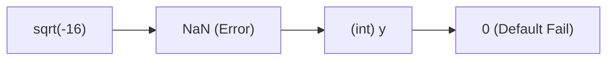
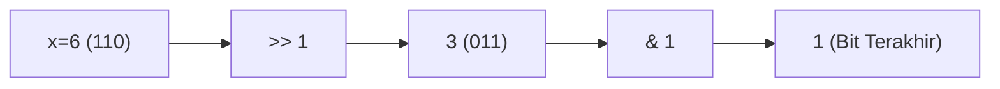
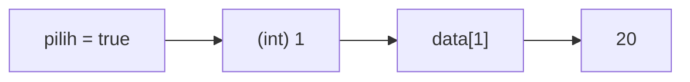
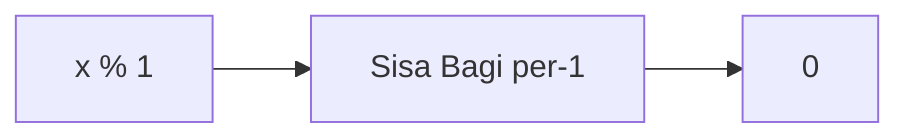
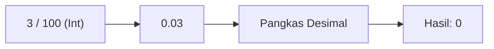
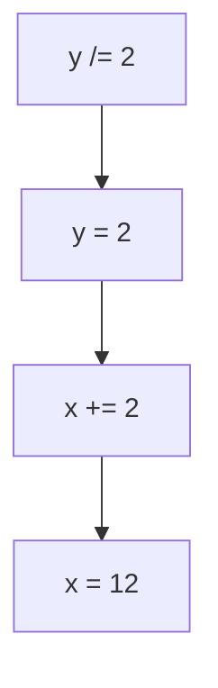
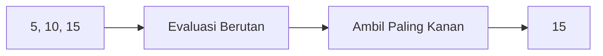
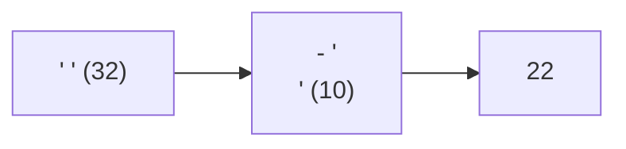
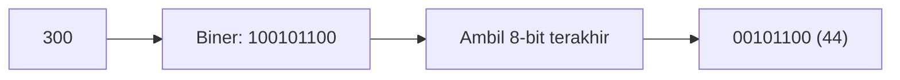
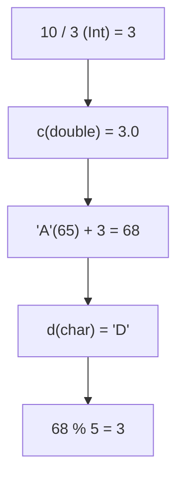

		🔙 **[Kembali ke Daftar Soal](./README.md)**

---

# Latihan Soal Part C - Modul 01 - Set 05 (Premium Edition)

---

### Soal 41: Akar Imajiner (Implicit Sqrt)
```cpp
#include <cmath>
int x = -16;
int y = sqrt(x);
```
**Pertanyaan:**
1. Berapakah nilai `y`?
2. Mengapa memasukkan hasil `sqrt` ke `int` bisa berbahaya bagi runtime?

<details>
<summary><b>Klik untuk Lihat Jawaban & Diagnosis</b></summary>

**Mermaid Flowchart:**


**Jawaban:**
1. **0 atau NaN (Not a Number)** dalam bentuk integer.
2. Karena `sqrt` pada bilangan negatif menghasilkan angka imajiner yang tidak terdefinisi di sistem bilangan rill.

**📖 Analisis Mendalam:**
Pada beberapa sistem, compiler akan mengembalikan nilai *NaN*. Ketika dipaksa masuk ke `int`, nilainya seringkali menjadi **0** atau nilai batas (*implementation defined*).
</details>

---

### Soal 42: Biner Kecil (Bit Guessing)
```cpp
int x = 6;
int y = x >> 1; // 6 / 2
int z = y & 1;  // y % 2
```
**Pertanyaan:**
1. Berapakah nilai `y`?
2. Berapakah nilai `z`?

<details>
<summary><b>Klik untuk Lihat Jawaban & Diagnosis</b></summary>

**Mermaid Flowchart:**


**Jawaban:**
1. **3**
2. **1**

**📖 Analisis Mendalam:**
6 dalam biner adalah `110`. Digeser kanan sekali menjadi `011` (3). Lalu `3 & 1` mengecek bit terakhir (1), hasilnya 1.
</details>

---

### Soal 43: Array Index (Bool to Int)
```cpp
int data[] = {10, 20, 30};
bool pilih = true;
int hasil = data[pilih];
```
**Pertanyaan:**
1. Berapakah nilai `hasil`?
2. Indeks ke-berapa yang sebenarnya diakses?

<details>
<summary><b>Klik untuk Lihat Jawaban & Diagnosis</b></summary>

**Mermaid Flowchart:**


**Jawaban:**
1. **20**
2. **Indeks 1.**

**📖 Analisis Mendalam:**
C++ secara implisit mengubah `true` menjadi **1** dan `false` menjadi **0**. Maka `data[true]` sama dengan `data[1]`.
</details>

---

### Soal 44: Jebakan Modulo 1 (Modulo One)
```cpp
int x = 1234567;
int hasil = x % 1;
```
**Pertanyaan:**
1. Berapakah nilai `hasil`?
2. Apa hukum matematika untuk angka apapun yang di-modulo 1?

<details>
<summary><b>Klik untuk Lihat Jawaban & Diagnosis</b></summary>

**Mermaid Flowchart:**


**Jawaban:**
1. **0**
2. Berapapun angkanya, jika dikelompokkan per 1 bagian, maka tidak akan pernah ada sisa.

**📖 Analisis Mendalam:**
Jangan terkecoh dengan angka besar. Modulo 1 selalu menghasilkan 0.
</details>

---

### Soal 45: Semut vs Gajah (Small / Big)
```cpp
int semut = 3;
int gajah = 100;
int hasil = semut / gajah;
```
**Pertanyaan:**
1. Berapakah nilai `hasil`?
2. Mengapa tidak menjadi 0.03?

<details>
<summary><b>Klik untuk Lihat Jawaban & Diagnosis</b></summary>

**Mermaid Flowchart:**


**Jawaban:**
1. **0**
2. Karena pembagian `int` membuang semua desimal di belakang nol koma.

**📖 Analisis Mendalam:**
Setiap kali angka pembagi lebih besar dari angka yang dibagi (pada `int`), hasilnya wajib **0**.
</details>

---

### Soal 46: Rantai Tugas (Compound Assignment)
```cpp
int x = 10;
int y = 4;
x += y /= 2;
```
**Pertanyaan:**
1. Berapakah nilai `y` akhir?
2. Berapakah nilai `x` akhir? (Urutan sangat penting!)

<details>
<summary><b>Klik untuk Lihat Jawaban & Diagnosis</b></summary>

**Mermaid Flowchart:**


**Jawaban:**
1. **2**
2. **12** (10 + 2)

**📖 Analisis Mendalam:**
Operasi dievaluasi dari **kanan ke kiri**. 
1. `y /= 2` $\rightarrow$ `y = 2`.
2. `x += 2` $\rightarrow$ `x = 12`.
</details>

---

### Soal 47: Koma Berbahaya (Comma Operator)
```cpp
int x = (5, 10, 15);
```
**Pertanyaan:**
1. Berapakah nilai `x`?
2. Apa fungsi operator koma `,` di dalam kurung?

<details>
<summary><b>Klik untuk Lihat Jawaban & Diagnosis</b></summary>

**Mermaid Flowchart:**


**Jawaban:**
1. **15**
2. Mengambil nilai ekspresi **paling kanan** setelah mengevaluasi semuanya.

**📖 Analisis Mendalam:**
Ini adalah fitur C++ yang jarang diketahui namun sering muncul sebagai soal jebakan di olimpiade.
</details>

---

### Soal 48: Ruang Hampa (ASCII Space vs NL)
```cpp
char spasi = ' ';   // ASCII 32
char enter = '\n';  // ASCII 10
int selisih = spasi - enter;
```
**Pertanyaan:**
1. Berapakah nilai `selisih`?
2. Mengapa karakter kontrol seperti `\n` punya nilai numerik?

<details>
<summary><b>Klik untuk Lihat Jawaban & Diagnosis</b></summary>

**Mermaid Flowchart:**


**Jawaban:**
1. **22** (32 - 10)
2. Karena semua instruksi teks harus dikirimkan ke printer/layar dalam kode angka agar hardware mengerti instruksi baris baru.
</details>

---

### Soal 49: Pengecilan Paksa (Large to Char)
```cpp
long long raksasa = 300;
char cebol = (char)raksasa;
```
**Pertanyaan:**
1. Berapakah nilai `cebol`? (Bukan 300!)
2. Apa yang terjadi saat angka di atas 255 dipaksa ke `char` (8-bit)?

<details>
<summary><b>Klik untuk Lihat Jawaban & Diagnosis</b></summary>

**Mermaid Flowchart:**


**Jawaban:**
1. **44** (300 - 256)
2. Terjadi pemotongan bit (*Data Truncation*).

**📖 Analisis Mendalam:**
Char 8-bit hanya menampung 256 variasi. Angka 300 akan kembali ke nol setelah 256, maka sisa 44.
</details>

---

### Soal 50: Grand Final (Meta Question)
```cpp
int a = 10, b = 3;
double c = a / b;
char d = 'A' + (int)c;
int hasil_akhir = d % 5;
```
**Pertanyaan:**
1. Hitung `c` secara bertahap!
2. Hitung `d` secara bertahap! ('A' = 65).
3. Berapakah `hasil_akhir`?

<details>
<summary><b>Klik untuk Lihat Jawaban & Diagnosis</b></summary>

**Mermaid Flowchart:**


**Jawaban:**
1. `c = 10 / 3 = 3.0` (Int division first).
2. `d = 'A' + 3 = 'D'` (ASCII 68).
3. `hasil_akhir = 68 % 5 = 3`.

**📖 Analisis Mendalam:**
Soal ini menggabungkan: Truncation, Promotion, ASCII math, dan Modulo. Jika kamu bisa menjawab ini dengan benar, selamat! Kamu sudah lulus Modul 01!
</details>
