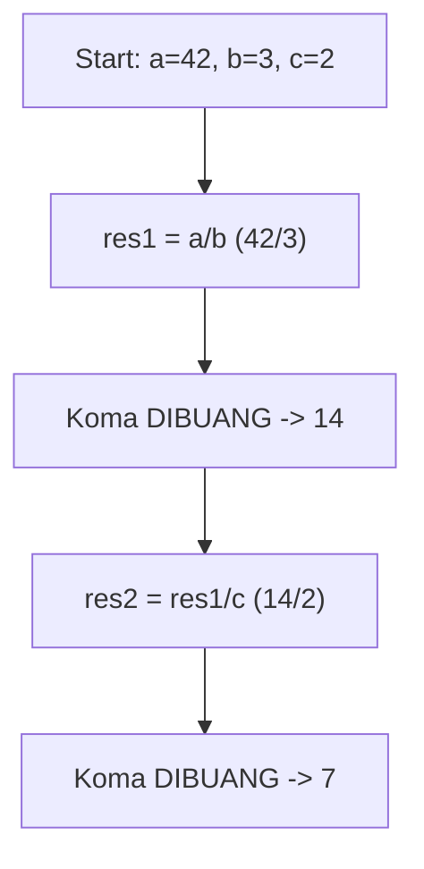
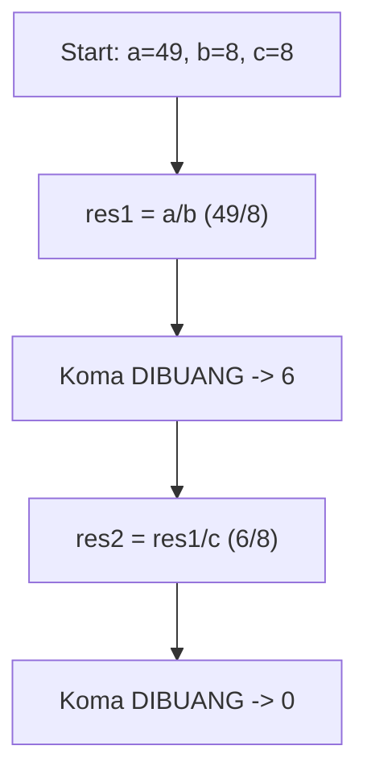
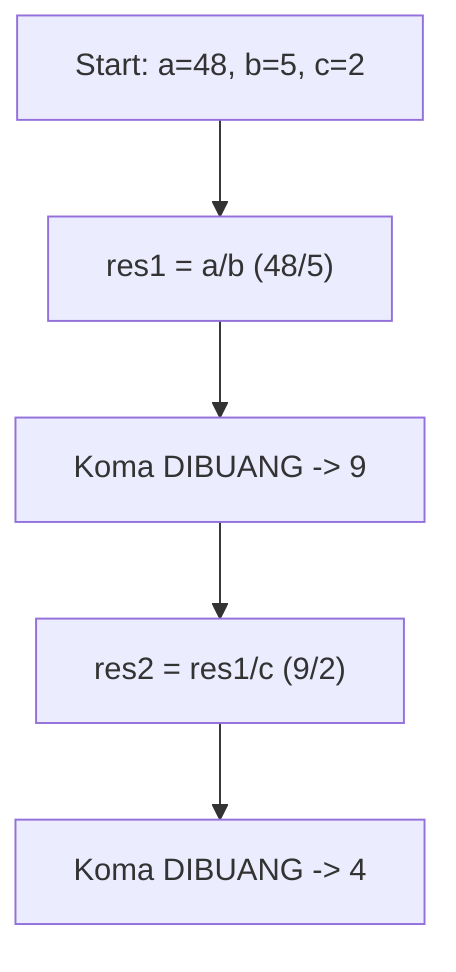
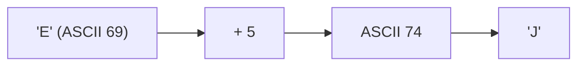
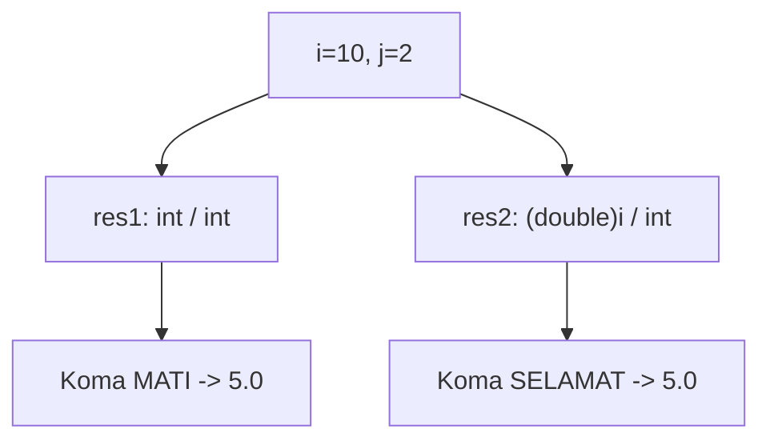
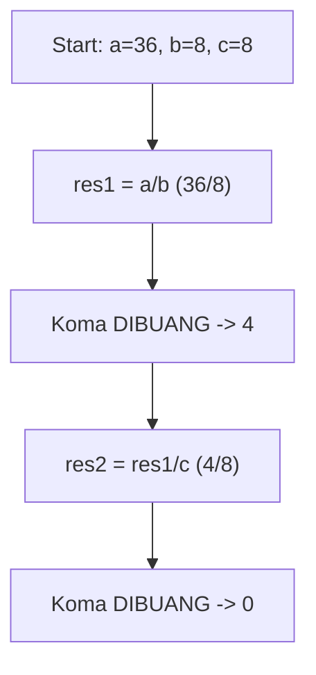

# Latihan Soal Part C - Modul 01 - Set 05

### Soal 101 (Casting War)
```cpp
int i = 9;
int j = 2;
double res1 = i / j;
double res2 = (double)i / j;
```
**Pertanyaan:**
1. Berapakah isi `res1`?
2. Berapakah isi `res2`?
3. Kenapa hasil `res1` dan `res2` berbeda padahal rumusnya mirip?

**Jawaban & Diagnosis:**
1. **4.0**
2. **4.5**
3. **Pada `res1`, pembagian terjadi antar `int` sehingga koma dibantai duluan sebelum masuk double. Pada `res2`, `i` dipaksa jadi `double` dulu, sehingga koma selamat.**

**Mermaid Flowchart:**


**📖 Cara Membaca Diagram:**
i=9, j=2. `res1`: 9/2 (int) = 4. Masuk double jadi 4.0. `res2`: (double)9 = 9.0. 9.0/2 = 4.5.

---
### Soal 102 (ASCII Math)
```cpp
char c = 'A';
int jump = 3;
char result = c + jump;
```
**Pertanyaan:**
1. Berapakah nilai ASCII batin dari 'A'?
2. Karakter apa yang tersimpan dalam variabel `result`?
3. Jika `result` dicetak sebagai `int`, angka berapa yang muncul?

**Jawaban & Diagnosis:**
1. **65**
2. **D**
3. **68**

**Mermaid Flowchart:**


**📖 Cara Membaca Diagram:**
Karakter 'A' punya kode batin ASCII 65. Ditambah 3 langkah menjadi 68. Kode 68 adalah huruf 'D'.

---
### Soal 103 (Casting War)
```cpp
int i = 8;
int j = 2;
double res1 = i / j;
double res2 = (double)i / j;
```
**Pertanyaan:**
1. Berapakah isi `res1`?
2. Berapakah isi `res2`?
3. Kenapa hasil `res1` dan `res2` berbeda padahal rumusnya mirip?

**Jawaban & Diagnosis:**
1. **4.0**
2. **4.0**
3. **Pada `res1`, pembagian terjadi antar `int` sehingga koma dibantai duluan sebelum masuk double. Pada `res2`, `i` dipaksa jadi `double` dulu, sehingga koma selamat.**

**Mermaid Flowchart:**


**📖 Cara Membaca Diagram:**
i=8, j=2. `res1`: 8/2 (int) = 4. Masuk double jadi 4.0. `res2`: (double)8 = 8.0. 8.0/2 = 4.0.

---
### Soal 104 (Integer Division)
```cpp
int a = 42;
int b = 3;
int c = 2;
int res1 = a / b;
int res2 = res1 / c;
```
**Pertanyaan:**
1. Berapakah nilai `res1`?
2. Berapakah nilai `res2`?
3. Mengapa `res1` tidak menghasilkan angka desimal?

**Jawaban & Diagnosis:**
1. **14**
2. **7**
3. **Karena tipe datanya `int`, setiap ada koma di belakangnya langsung dipangkas habis (Integer Division).**

**Mermaid Flowchart:**


**📖 Cara Membaca Diagram:**
Mulai: a=42, b=3, c=2. Di baris `res1 = a / b`, 42/3 = 14.00, tapi karena `int`, koma dibakar jadi 14. Lalu 14/2 = 7.00, dibakar lagi jadi 7.

---
### Soal 105 (Modulo Magic)
```cpp
int x = 38;
int m1 = 2;
int m2 = 5;
int res_x = x % m1;
int res_y = x % m2;
```
**Pertanyaan:**
1. Apakah `x` genap atau ganjil?
2. Berapakah sisa bagi `x % m2`?
3. Apa guna operator `%` dalam OSN-K?

**Jawaban & Diagnosis:**
1. **Genap**
2. **3**
3. **Untuk mencari sisa bagi (sisa kelereng) atau mendeteksi pola perulangan/genap-ganjil.**

**Mermaid Flowchart:**
```mermaid
graph TD
    A[x=38] --> Bx % 2 == 0?
    B -- Ya --> C[Genap]
    B -- Tidak --> D[Ganjil]
    A --> E["x % 5"]
    E --> F["Sisa: 3"]
```

**📖 Cara Membaca Diagram:**
x=38. Cek `x % 2`: 38%2 = 0. Jika 0 genap, jika 1 ganjil. Cek `x % 5`: 38/5 = 7 sisa 3.

---
### Soal 106 (Modulo Magic)
```cpp
int x = 92;
int m1 = 2;
int m2 = 5;
int res_x = x % m1;
int res_y = x % m2;
```
**Pertanyaan:**
1. Apakah `x` genap atau ganjil?
2. Berapakah sisa bagi `x % m2`?
3. Apa guna operator `%` dalam OSN-K?

**Jawaban & Diagnosis:**
1. **Genap**
2. **2**
3. **Untuk mencari sisa bagi (sisa kelereng) atau mendeteksi pola perulangan/genap-ganjil.**

**Mermaid Flowchart:**
```mermaid
graph TD
    A[x=92] --> Bx % 2 == 0?
    B -- Ya --> C[Genap]
    B -- Tidak --> D[Ganjil]
    A --> E["x % 5"]
    E --> F["Sisa: 2"]
```

**📖 Cara Membaca Diagram:**
x=92. Cek `x % 2`: 92%2 = 0. Jika 0 genap, jika 1 ganjil. Cek `x % 5`: 92/5 = 18 sisa 2.

---
### Soal 107 (Casting War)
```cpp
int i = 9;
int j = 2;
double res1 = i / j;
double res2 = (double)i / j;
```
**Pertanyaan:**
1. Berapakah isi `res1`?
2. Berapakah isi `res2`?
3. Kenapa hasil `res1` dan `res2` berbeda padahal rumusnya mirip?

**Jawaban & Diagnosis:**
1. **4.0**
2. **4.5**
3. **Pada `res1`, pembagian terjadi antar `int` sehingga koma dibantai duluan sebelum masuk double. Pada `res2`, `i` dipaksa jadi `double` dulu, sehingga koma selamat.**

**Mermaid Flowchart:**


**📖 Cara Membaca Diagram:**
i=9, j=2. `res1`: 9/2 (int) = 4. Masuk double jadi 4.0. `res2`: (double)9 = 9.0. 9.0/2 = 4.5.

---
### Soal 108 (Modulo Magic)
```cpp
int x = 76;
int m1 = 2;
int m2 = 5;
int res_x = x % m1;
int res_y = x % m2;
```
**Pertanyaan:**
1. Apakah `x` genap atau ganjil?
2. Berapakah sisa bagi `x % m2`?
3. Apa guna operator `%` dalam OSN-K?

**Jawaban & Diagnosis:**
1. **Genap**
2. **1**
3. **Untuk mencari sisa bagi (sisa kelereng) atau mendeteksi pola perulangan/genap-ganjil.**

**Mermaid Flowchart:**
```mermaid
graph TD
    A[x=76] --> Bx % 2 == 0?
    B -- Ya --> C[Genap]
    B -- Tidak --> D[Ganjil]
    A --> E["x % 5"]
    E --> F["Sisa: 1"]
```

**📖 Cara Membaca Diagram:**
x=76. Cek `x % 2`: 76%2 = 0. Jika 0 genap, jika 1 ganjil. Cek `x % 5`: 76/5 = 15 sisa 1.

---
### Soal 109 (Modulo Magic)
```cpp
int x = 59;
int m1 = 2;
int m2 = 5;
int res_x = x % m1;
int res_y = x % m2;
```
**Pertanyaan:**
1. Apakah `x` genap atau ganjil?
2. Berapakah sisa bagi `x % m2`?
3. Apa guna operator `%` dalam OSN-K?

**Jawaban & Diagnosis:**
1. **Ganjil**
2. **4**
3. **Untuk mencari sisa bagi (sisa kelereng) atau mendeteksi pola perulangan/genap-ganjil.**

**Mermaid Flowchart:**
```mermaid
graph TD
    A[x=59] --> Bx % 2 == 0?
    B -- Ya --> C[Genap]
    B -- Tidak --> D[Ganjil]
    A --> E["x % 5"]
    E --> F["Sisa: 4"]
```

**📖 Cara Membaca Diagram:**
x=59. Cek `x % 2`: 59%2 = 1. Jika 0 genap, jika 1 ganjil. Cek `x % 5`: 59/5 = 11 sisa 4.

---
### Soal 110 (Modulo Magic)
```cpp
int x = 48;
int m1 = 2;
int m2 = 5;
int res_x = x % m1;
int res_y = x % m2;
```
**Pertanyaan:**
1. Apakah `x` genap atau ganjil?
2. Berapakah sisa bagi `x % m2`?
3. Apa guna operator `%` dalam OSN-K?

**Jawaban & Diagnosis:**
1. **Genap**
2. **3**
3. **Untuk mencari sisa bagi (sisa kelereng) atau mendeteksi pola perulangan/genap-ganjil.**

**Mermaid Flowchart:**
```mermaid
graph TD
    A[x=48] --> Bx % 2 == 0?
    B -- Ya --> C[Genap]
    B -- Tidak --> D[Ganjil]
    A --> E["x % 5"]
    E --> F["Sisa: 3"]
```

**📖 Cara Membaca Diagram:**
x=48. Cek `x % 2`: 48%2 = 0. Jika 0 genap, jika 1 ganjil. Cek `x % 5`: 48/5 = 9 sisa 3.

---
### Soal 111 (Integer Division)
```cpp
int a = 49;
int b = 8;
int c = 8;
int res1 = a / b;
int res2 = res1 / c;
```
**Pertanyaan:**
1. Berapakah nilai `res1`?
2. Berapakah nilai `res2`?
3. Mengapa `res1` tidak menghasilkan angka desimal?

**Jawaban & Diagnosis:**
1. **6**
2. **0**
3. **Karena tipe datanya `int`, setiap ada koma di belakangnya langsung dipangkas habis (Integer Division).**

**Mermaid Flowchart:**


**📖 Cara Membaca Diagram:**
Mulai: a=49, b=8, c=8. Di baris `res1 = a / b`, 49/8 = 6.12, tapi karena `int`, koma dibakar jadi 6. Lalu 6/8 = 0.75, dibakar lagi jadi 0.

---
### Soal 112 (Modulo Magic)
```cpp
int x = 54;
int m1 = 2;
int m2 = 5;
int res_x = x % m1;
int res_y = x % m2;
```
**Pertanyaan:**
1. Apakah `x` genap atau ganjil?
2. Berapakah sisa bagi `x % m2`?
3. Apa guna operator `%` dalam OSN-K?

**Jawaban & Diagnosis:**
1. **Genap**
2. **4**
3. **Untuk mencari sisa bagi (sisa kelereng) atau mendeteksi pola perulangan/genap-ganjil.**

**Mermaid Flowchart:**
```mermaid
graph TD
    A[x=54] --> Bx % 2 == 0?
    B -- Ya --> C[Genap]
    B -- Tidak --> D[Ganjil]
    A --> E["x % 5"]
    E --> F["Sisa: 4"]
```

**📖 Cara Membaca Diagram:**
x=54. Cek `x % 2`: 54%2 = 0. Jika 0 genap, jika 1 ganjil. Cek `x % 5`: 54/5 = 10 sisa 4.

---
### Soal 113 (Integer Division)
```cpp
int a = 39;
int b = 9;
int c = 6;
int res1 = a / b;
int res2 = res1 / c;
```
**Pertanyaan:**
1. Berapakah nilai `res1`?
2. Berapakah nilai `res2`?
3. Mengapa `res1` tidak menghasilkan angka desimal?

**Jawaban & Diagnosis:**
1. **4**
2. **0**
3. **Karena tipe datanya `int`, setiap ada koma di belakangnya langsung dipangkas habis (Integer Division).**

**Mermaid Flowchart:**


**📖 Cara Membaca Diagram:**
Mulai: a=39, b=9, c=6. Di baris `res1 = a / b`, 39/9 = 4.33, tapi karena `int`, koma dibakar jadi 4. Lalu 4/6 = 0.67, dibakar lagi jadi 0.

---
### Soal 114 (Integer Division)
```cpp
int a = 48;
int b = 5;
int c = 2;
int res1 = a / b;
int res2 = res1 / c;
```
**Pertanyaan:**
1. Berapakah nilai `res1`?
2. Berapakah nilai `res2`?
3. Mengapa `res1` tidak menghasilkan angka desimal?

**Jawaban & Diagnosis:**
1. **9**
2. **4**
3. **Karena tipe datanya `int`, setiap ada koma di belakangnya langsung dipangkas habis (Integer Division).**

**Mermaid Flowchart:**


**📖 Cara Membaca Diagram:**
Mulai: a=48, b=5, c=2. Di baris `res1 = a / b`, 48/5 = 9.60, tapi karena `int`, koma dibakar jadi 9. Lalu 9/2 = 4.50, dibakar lagi jadi 4.

---
### Soal 115 (ASCII Math)
```cpp
char c = 'E';
int jump = 5;
char result = c + jump;
```
**Pertanyaan:**
1. Berapakah nilai ASCII batin dari 'E'?
2. Karakter apa yang tersimpan dalam variabel `result`?
3. Jika `result` dicetak sebagai `int`, angka berapa yang muncul?

**Jawaban & Diagnosis:**
1. **69**
2. **J**
3. **74**

**Mermaid Flowchart:**


**📖 Cara Membaca Diagram:**
Karakter 'E' punya kode batin ASCII 69. Ditambah 5 langkah menjadi 74. Kode 74 adalah huruf 'J'.

---
### Soal 116 (Casting War)
```cpp
int i = 10;
int j = 2;
double res1 = i / j;
double res2 = (double)i / j;
```
**Pertanyaan:**
1. Berapakah isi `res1`?
2. Berapakah isi `res2`?
3. Kenapa hasil `res1` dan `res2` berbeda padahal rumusnya mirip?

**Jawaban & Diagnosis:**
1. **5.0**
2. **5.0**
3. **Pada `res1`, pembagian terjadi antar `int` sehingga koma dibantai duluan sebelum masuk double. Pada `res2`, `i` dipaksa jadi `double` dulu, sehingga koma selamat.**

**Mermaid Flowchart:**


**📖 Cara Membaca Diagram:**
i=10, j=2. `res1`: 10/2 (int) = 5. Masuk double jadi 5.0. `res2`: (double)10 = 10.0. 10.0/2 = 5.0.

---
### Soal 117 (Casting War)
```cpp
int i = 5;
int j = 2;
double res1 = i / j;
double res2 = (double)i / j;
```
**Pertanyaan:**
1. Berapakah isi `res1`?
2. Berapakah isi `res2`?
3. Kenapa hasil `res1` dan `res2` berbeda padahal rumusnya mirip?

**Jawaban & Diagnosis:**
1. **2.0**
2. **2.5**
3. **Pada `res1`, pembagian terjadi antar `int` sehingga koma dibantai duluan sebelum masuk double. Pada `res2`, `i` dipaksa jadi `double` dulu, sehingga koma selamat.**

**Mermaid Flowchart:**


**📖 Cara Membaca Diagram:**
i=5, j=2. `res1`: 5/2 (int) = 2. Masuk double jadi 2.0. `res2`: (double)5 = 5.0. 5.0/2 = 2.5.

---
### Soal 118 (Modulo Magic)
```cpp
int x = 64;
int m1 = 2;
int m2 = 5;
int res_x = x % m1;
int res_y = x % m2;
```
**Pertanyaan:**
1. Apakah `x` genap atau ganjil?
2. Berapakah sisa bagi `x % m2`?
3. Apa guna operator `%` dalam OSN-K?

**Jawaban & Diagnosis:**
1. **Genap**
2. **4**
3. **Untuk mencari sisa bagi (sisa kelereng) atau mendeteksi pola perulangan/genap-ganjil.**

**Mermaid Flowchart:**
```mermaid
graph TD
    A[x=64] --> Bx % 2 == 0?
    B -- Ya --> C[Genap]
    B -- Tidak --> D[Ganjil]
    A --> E["x % 5"]
    E --> F["Sisa: 4"]
```

**📖 Cara Membaca Diagram:**
x=64. Cek `x % 2`: 64%2 = 0. Jika 0 genap, jika 1 ganjil. Cek `x % 5`: 64/5 = 12 sisa 4.

---
### Soal 119 (Casting War)
```cpp
int i = 9;
int j = 2;
double res1 = i / j;
double res2 = (double)i / j;
```
**Pertanyaan:**
1. Berapakah isi `res1`?
2. Berapakah isi `res2`?
3. Kenapa hasil `res1` dan `res2` berbeda padahal rumusnya mirip?

**Jawaban & Diagnosis:**
1. **4.0**
2. **4.5**
3. **Pada `res1`, pembagian terjadi antar `int` sehingga koma dibantai duluan sebelum masuk double. Pada `res2`, `i` dipaksa jadi `double` dulu, sehingga koma selamat.**

**Mermaid Flowchart:**


**📖 Cara Membaca Diagram:**
i=9, j=2. `res1`: 9/2 (int) = 4. Masuk double jadi 4.0. `res2`: (double)9 = 9.0. 9.0/2 = 4.5.

---
### Soal 120 (Integer Division)
```cpp
int a = 36;
int b = 8;
int c = 8;
int res1 = a / b;
int res2 = res1 / c;
```
**Pertanyaan:**
1. Berapakah nilai `res1`?
2. Berapakah nilai `res2`?
3. Mengapa `res1` tidak menghasilkan angka desimal?

**Jawaban & Diagnosis:**
1. **4**
2. **0**
3. **Karena tipe datanya `int`, setiap ada koma di belakangnya langsung dipangkas habis (Integer Division).**

**Mermaid Flowchart:**


**📖 Cara Membaca Diagram:**
Mulai: a=36, b=8, c=8. Di baris `res1 = a / b`, 36/8 = 4.50, tapi karena `int`, koma dibakar jadi 4. Lalu 4/8 = 0.50, dibakar lagi jadi 0.

---
### Soal 121 (ASCII Math)
```cpp
char c = 'E';
int jump = 1;
char result = c + jump;
```
**Pertanyaan:**
1. Berapakah nilai ASCII batin dari 'E'?
2. Karakter apa yang tersimpan dalam variabel `result`?
3. Jika `result` dicetak sebagai `int`, angka berapa yang muncul?

**Jawaban & Diagnosis:**
1. **69**
2. **F**
3. **70**

**Mermaid Flowchart:**
```mermaid
graph LR
    A["'E' (ASCII 69)"] --> B["+ 1"]
    B --> C["ASCII 70"]
    C --> D["'F'"]
```

**📖 Cara Membaca Diagram:**
Karakter 'E' punya kode batin ASCII 69. Ditambah 1 langkah menjadi 70. Kode 70 adalah huruf 'F'.

---
### Soal 122 (Casting War)
```cpp
int i = 6;
int j = 2;
double res1 = i / j;
double res2 = (double)i / j;
```
**Pertanyaan:**
1. Berapakah isi `res1`?
2. Berapakah isi `res2`?
3. Kenapa hasil `res1` dan `res2` berbeda padahal rumusnya mirip?

**Jawaban & Diagnosis:**
1. **3.0**
2. **3.0**
3. **Pada `res1`, pembagian terjadi antar `int` sehingga koma dibantai duluan sebelum masuk double. Pada `res2`, `i` dipaksa jadi `double` dulu, sehingga koma selamat.**

**Mermaid Flowchart:**
```mermaid
graph TD
    A["i=6, j=2"] --> B["res1: int / int"]
    B --> C["Koma MATI -> 3.0"]
    A --> D["res2: (double)i / int"]
    D --> E["Koma SELAMAT -> 3.0"]
```

**📖 Cara Membaca Diagram:**
i=6, j=2. `res1`: 6/2 (int) = 3. Masuk double jadi 3.0. `res2`: (double)6 = 6.0. 6.0/2 = 3.0.

---
### Soal 123 (Modulo Magic)
```cpp
int x = 87;
int m1 = 2;
int m2 = 5;
int res_x = x % m1;
int res_y = x % m2;
```
**Pertanyaan:**
1. Apakah `x` genap atau ganjil?
2. Berapakah sisa bagi `x % m2`?
3. Apa guna operator `%` dalam OSN-K?

**Jawaban & Diagnosis:**
1. **Ganjil**
2. **2**
3. **Untuk mencari sisa bagi (sisa kelereng) atau mendeteksi pola perulangan/genap-ganjil.**

**Mermaid Flowchart:**
```mermaid
graph TD
    A[x=87] --> Bx % 2 == 0?
    B -- Ya --> C[Genap]
    B -- Tidak --> D[Ganjil]
    A --> E["x % 5"]
    E --> F["Sisa: 2"]
```

**📖 Cara Membaca Diagram:**
x=87. Cek `x % 2`: 87%2 = 1. Jika 0 genap, jika 1 ganjil. Cek `x % 5`: 87/5 = 17 sisa 2.

---
### Soal 124 (Casting War)
```cpp
int i = 7;
int j = 2;
double res1 = i / j;
double res2 = (double)i / j;
```
**Pertanyaan:**
1. Berapakah isi `res1`?
2. Berapakah isi `res2`?
3. Kenapa hasil `res1` dan `res2` berbeda padahal rumusnya mirip?

**Jawaban & Diagnosis:**
1. **3.0**
2. **3.5**
3. **Pada `res1`, pembagian terjadi antar `int` sehingga koma dibantai duluan sebelum masuk double. Pada `res2`, `i` dipaksa jadi `double` dulu, sehingga koma selamat.**

**Mermaid Flowchart:**
```mermaid
graph TD
    A["i=7, j=2"] --> B["res1: int / int"]
    B --> C["Koma MATI -> 3.0"]
    A --> D["res2: (double)i / int"]
    D --> E["Koma SELAMAT -> 3.5"]
```

**📖 Cara Membaca Diagram:**
i=7, j=2. `res1`: 7/2 (int) = 3. Masuk double jadi 3.0. `res2`: (double)7 = 7.0. 7.0/2 = 3.5.

---
### Soal 125 (Casting War)
```cpp
int i = 10;
int j = 2;
double res1 = i / j;
double res2 = (double)i / j;
```
**Pertanyaan:**
1. Berapakah isi `res1`?
2. Berapakah isi `res2`?
3. Kenapa hasil `res1` dan `res2` berbeda padahal rumusnya mirip?

**Jawaban & Diagnosis:**
1. **5.0**
2. **5.0**
3. **Pada `res1`, pembagian terjadi antar `int` sehingga koma dibantai duluan sebelum masuk double. Pada `res2`, `i` dipaksa jadi `double` dulu, sehingga koma selamat.**

**Mermaid Flowchart:**
```mermaid
graph TD
    A["i=10, j=2"] --> B["res1: int / int"]
    B --> C["Koma MATI -> 5.0"]
    A --> D["res2: (double)i / int"]
    D --> E["Koma SELAMAT -> 5.0"]
```

**📖 Cara Membaca Diagram:**
i=10, j=2. `res1`: 10/2 (int) = 5. Masuk double jadi 5.0. `res2`: (double)10 = 10.0. 10.0/2 = 5.0.

---
