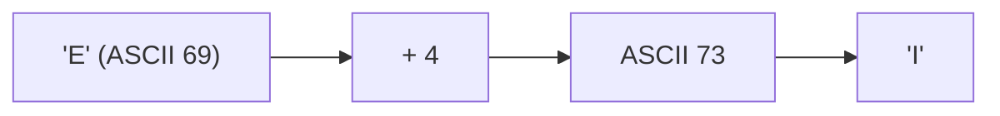
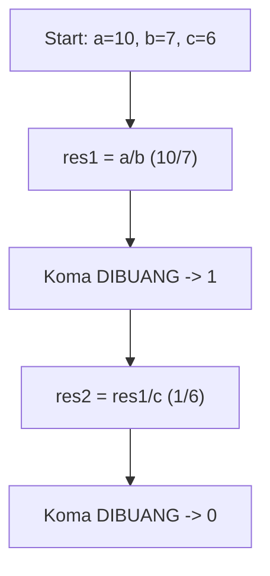
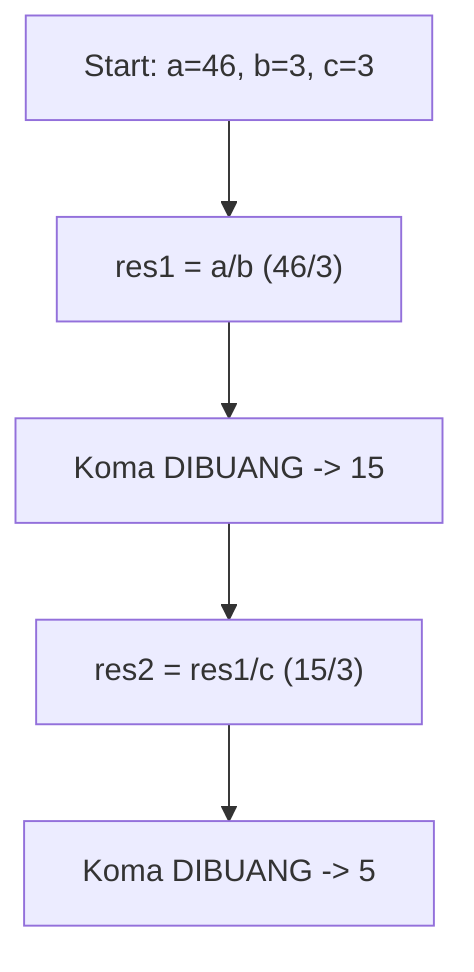
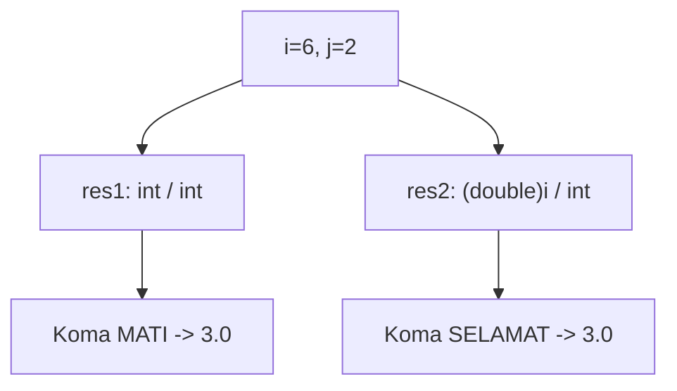
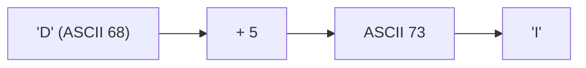
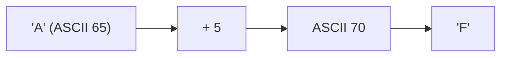
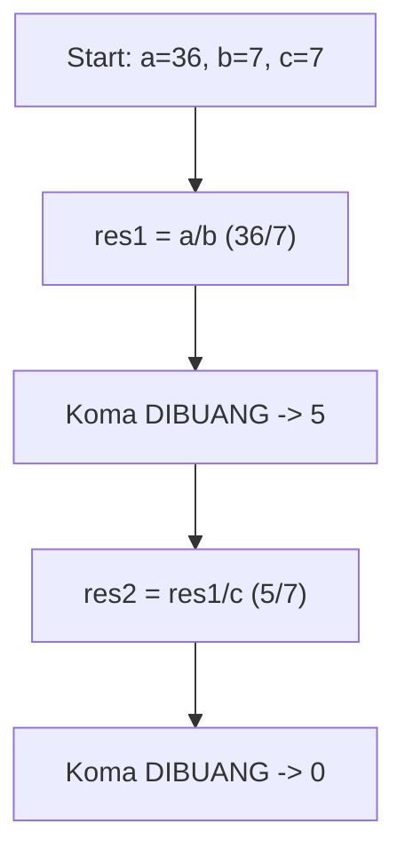
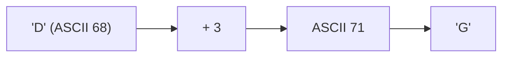
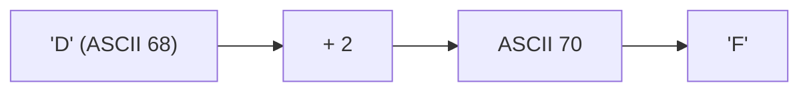

# Latihan Soal Part C - Modul 01 - Set 06

### Soal 126 (ASCII Math)
```cpp
char c = 'E';
int jump = 4;
char result = c + jump;
```
**Pertanyaan:**
1. Berapakah nilai ASCII batin dari 'E'?
2. Karakter apa yang tersimpan dalam variabel `result`?
3. Jika `result` dicetak sebagai `int`, angka berapa yang muncul?

**Jawaban & Diagnosis:**
1. **69**
2. **I**
3. **73**

**Mermaid Flowchart:**


**📖 Cara Membaca Diagram:**
Karakter 'E' punya kode batin ASCII 69. Ditambah 4 langkah menjadi 73. Kode 73 adalah huruf 'I'.

---
### Soal 127 (ASCII Math)
```cpp
char c = 'E';
int jump = 4;
char result = c + jump;
```
**Pertanyaan:**
1. Berapakah nilai ASCII batin dari 'E'?
2. Karakter apa yang tersimpan dalam variabel `result`?
3. Jika `result` dicetak sebagai `int`, angka berapa yang muncul?

**Jawaban & Diagnosis:**
1. **69**
2. **I**
3. **73**

**Mermaid Flowchart:**


**📖 Cara Membaca Diagram:**
Karakter 'E' punya kode batin ASCII 69. Ditambah 4 langkah menjadi 73. Kode 73 adalah huruf 'I'.

---
### Soal 128 (Integer Division)
```cpp
int a = 10;
int b = 7;
int c = 6;
int res1 = a / b;
int res2 = res1 / c;
```
**Pertanyaan:**
1. Berapakah nilai `res1`?
2. Berapakah nilai `res2`?
3. Mengapa `res1` tidak menghasilkan angka desimal?

**Jawaban & Diagnosis:**
1. **1**
2. **0**
3. **Karena tipe datanya `int`, setiap ada koma di belakangnya langsung dipangkas habis (Integer Division).**

**Mermaid Flowchart:**


**📖 Cara Membaca Diagram:**
Mulai: a=10, b=7, c=6. Di baris `res1 = a / b`, 10/7 = 1.43, tapi karena `int`, koma dibakar jadi 1. Lalu 1/6 = 0.17, dibakar lagi jadi 0.

---
### Soal 129 (Integer Division)
```cpp
int a = 46;
int b = 3;
int c = 3;
int res1 = a / b;
int res2 = res1 / c;
```
**Pertanyaan:**
1. Berapakah nilai `res1`?
2. Berapakah nilai `res2`?
3. Mengapa `res1` tidak menghasilkan angka desimal?

**Jawaban & Diagnosis:**
1. **15**
2. **5**
3. **Karena tipe datanya `int`, setiap ada koma di belakangnya langsung dipangkas habis (Integer Division).**

**Mermaid Flowchart:**


**📖 Cara Membaca Diagram:**
Mulai: a=46, b=3, c=3. Di baris `res1 = a / b`, 46/3 = 15.33, tapi karena `int`, koma dibakar jadi 15. Lalu 15/3 = 5.00, dibakar lagi jadi 5.

---
### Soal 130 (Casting War)
```cpp
int i = 6;
int j = 2;
double res1 = i / j;
double res2 = (double)i / j;
```
**Pertanyaan:**
1. Berapakah isi `res1`?
2. Berapakah isi `res2`?
3. Kenapa hasil `res1` dan `res2` berbeda padahal rumusnya mirip?

**Jawaban & Diagnosis:**
1. **3.0**
2. **3.0**
3. **Pada `res1`, pembagian terjadi antar `int` sehingga koma dibantai duluan sebelum masuk double. Pada `res2`, `i` dipaksa jadi `double` dulu, sehingga koma selamat.**

**Mermaid Flowchart:**


**📖 Cara Membaca Diagram:**
i=6, j=2. `res1`: 6/2 (int) = 3. Masuk double jadi 3.0. `res2`: (double)6 = 6.0. 6.0/2 = 3.0.

---
### Soal 131 (ASCII Math)
```cpp
char c = 'D';
int jump = 5;
char result = c + jump;
```
**Pertanyaan:**
1. Berapakah nilai ASCII batin dari 'D'?
2. Karakter apa yang tersimpan dalam variabel `result`?
3. Jika `result` dicetak sebagai `int`, angka berapa yang muncul?

**Jawaban & Diagnosis:**
1. **68**
2. **I**
3. **73**

**Mermaid Flowchart:**


**📖 Cara Membaca Diagram:**
Karakter 'D' punya kode batin ASCII 68. Ditambah 5 langkah menjadi 73. Kode 73 adalah huruf 'I'.

---
### Soal 132 (Casting War)
```cpp
int i = 9;
int j = 2;
double res1 = i / j;
double res2 = (double)i / j;
```
**Pertanyaan:**
1. Berapakah isi `res1`?
2. Berapakah isi `res2`?
3. Kenapa hasil `res1` dan `res2` berbeda padahal rumusnya mirip?

**Jawaban & Diagnosis:**
1. **4.0**
2. **4.5**
3. **Pada `res1`, pembagian terjadi antar `int` sehingga koma dibantai duluan sebelum masuk double. Pada `res2`, `i` dipaksa jadi `double` dulu, sehingga koma selamat.**

**Mermaid Flowchart:**


**📖 Cara Membaca Diagram:**
i=9, j=2. `res1`: 9/2 (int) = 4. Masuk double jadi 4.0. `res2`: (double)9 = 9.0. 9.0/2 = 4.5.

---
### Soal 133 (ASCII Math)
```cpp
char c = 'A';
int jump = 5;
char result = c + jump;
```
**Pertanyaan:**
1. Berapakah nilai ASCII batin dari 'A'?
2. Karakter apa yang tersimpan dalam variabel `result`?
3. Jika `result` dicetak sebagai `int`, angka berapa yang muncul?

**Jawaban & Diagnosis:**
1. **65**
2. **F**
3. **70**

**Mermaid Flowchart:**


**📖 Cara Membaca Diagram:**
Karakter 'A' punya kode batin ASCII 65. Ditambah 5 langkah menjadi 70. Kode 70 adalah huruf 'F'.

---
### Soal 134 (Casting War)
```cpp
int i = 10;
int j = 2;
double res1 = i / j;
double res2 = (double)i / j;
```
**Pertanyaan:**
1. Berapakah isi `res1`?
2. Berapakah isi `res2`?
3. Kenapa hasil `res1` dan `res2` berbeda padahal rumusnya mirip?

**Jawaban & Diagnosis:**
1. **5.0**
2. **5.0**
3. **Pada `res1`, pembagian terjadi antar `int` sehingga koma dibantai duluan sebelum masuk double. Pada `res2`, `i` dipaksa jadi `double` dulu, sehingga koma selamat.**

**Mermaid Flowchart:**


**📖 Cara Membaca Diagram:**
i=10, j=2. `res1`: 10/2 (int) = 5. Masuk double jadi 5.0. `res2`: (double)10 = 10.0. 10.0/2 = 5.0.

---
### Soal 135 (Casting War)
```cpp
int i = 8;
int j = 2;
double res1 = i / j;
double res2 = (double)i / j;
```
**Pertanyaan:**
1. Berapakah isi `res1`?
2. Berapakah isi `res2`?
3. Kenapa hasil `res1` dan `res2` berbeda padahal rumusnya mirip?

**Jawaban & Diagnosis:**
1. **4.0**
2. **4.0**
3. **Pada `res1`, pembagian terjadi antar `int` sehingga koma dibantai duluan sebelum masuk double. Pada `res2`, `i` dipaksa jadi `double` dulu, sehingga koma selamat.**

**Mermaid Flowchart:**


**📖 Cara Membaca Diagram:**
i=8, j=2. `res1`: 8/2 (int) = 4. Masuk double jadi 4.0. `res2`: (double)8 = 8.0. 8.0/2 = 4.0.

---
### Soal 136 (Integer Division)
```cpp
int a = 36;
int b = 7;
int c = 7;
int res1 = a / b;
int res2 = res1 / c;
```
**Pertanyaan:**
1. Berapakah nilai `res1`?
2. Berapakah nilai `res2`?
3. Mengapa `res1` tidak menghasilkan angka desimal?

**Jawaban & Diagnosis:**
1. **5**
2. **0**
3. **Karena tipe datanya `int`, setiap ada koma di belakangnya langsung dipangkas habis (Integer Division).**

**Mermaid Flowchart:**


**📖 Cara Membaca Diagram:**
Mulai: a=36, b=7, c=7. Di baris `res1 = a / b`, 36/7 = 5.14, tapi karena `int`, koma dibakar jadi 5. Lalu 5/7 = 0.71, dibakar lagi jadi 0.

---
### Soal 137 (ASCII Math)
```cpp
char c = 'D';
int jump = 3;
char result = c + jump;
```
**Pertanyaan:**
1. Berapakah nilai ASCII batin dari 'D'?
2. Karakter apa yang tersimpan dalam variabel `result`?
3. Jika `result` dicetak sebagai `int`, angka berapa yang muncul?

**Jawaban & Diagnosis:**
1. **68**
2. **G**
3. **71**

**Mermaid Flowchart:**


**📖 Cara Membaca Diagram:**
Karakter 'D' punya kode batin ASCII 68. Ditambah 3 langkah menjadi 71. Kode 71 adalah huruf 'G'.

---
### Soal 138 (Casting War)
```cpp
int i = 10;
int j = 2;
double res1 = i / j;
double res2 = (double)i / j;
```
**Pertanyaan:**
1. Berapakah isi `res1`?
2. Berapakah isi `res2`?
3. Kenapa hasil `res1` dan `res2` berbeda padahal rumusnya mirip?

**Jawaban & Diagnosis:**
1. **5.0**
2. **5.0**
3. **Pada `res1`, pembagian terjadi antar `int` sehingga koma dibantai duluan sebelum masuk double. Pada `res2`, `i` dipaksa jadi `double` dulu, sehingga koma selamat.**

**Mermaid Flowchart:**


**📖 Cara Membaca Diagram:**
i=10, j=2. `res1`: 10/2 (int) = 5. Masuk double jadi 5.0. `res2`: (double)10 = 10.0. 10.0/2 = 5.0.

---
### Soal 139 (Casting War)
```cpp
int i = 5;
int j = 2;
double res1 = i / j;
double res2 = (double)i / j;
```
**Pertanyaan:**
1. Berapakah isi `res1`?
2. Berapakah isi `res2`?
3. Kenapa hasil `res1` dan `res2` berbeda padahal rumusnya mirip?

**Jawaban & Diagnosis:**
1. **2.0**
2. **2.5**
3. **Pada `res1`, pembagian terjadi antar `int` sehingga koma dibantai duluan sebelum masuk double. Pada `res2`, `i` dipaksa jadi `double` dulu, sehingga koma selamat.**

**Mermaid Flowchart:**


**📖 Cara Membaca Diagram:**
i=5, j=2. `res1`: 5/2 (int) = 2. Masuk double jadi 2.0. `res2`: (double)5 = 5.0. 5.0/2 = 2.5.

---
### Soal 140 (Modulo Magic)
```cpp
int x = 25;
int m1 = 2;
int m2 = 5;
int res_x = x % m1;
int res_y = x % m2;
```
**Pertanyaan:**
1. Apakah `x` genap atau ganjil?
2. Berapakah sisa bagi `x % m2`?
3. Apa guna operator `%` dalam OSN-K?

**Jawaban & Diagnosis:**
1. **Ganjil**
2. **0**
3. **Untuk mencari sisa bagi (sisa kelereng) atau mendeteksi pola perulangan/genap-ganjil.**

**Mermaid Flowchart:**
```mermaid
graph TD
    A[x=25] --> Bx % 2 == 0?
    B -- Ya --> C[Genap]
    B -- Tidak --> D[Ganjil]
    A --> E["x % 5"]
    E --> F["Sisa: 0"]
```

**📖 Cara Membaca Diagram:**
x=25. Cek `x % 2`: 25%2 = 1. Jika 0 genap, jika 1 ganjil. Cek `x % 5`: 25/5 = 5 sisa 0.

---
### Soal 141 (Casting War)
```cpp
int i = 6;
int j = 2;
double res1 = i / j;
double res2 = (double)i / j;
```
**Pertanyaan:**
1. Berapakah isi `res1`?
2. Berapakah isi `res2`?
3. Kenapa hasil `res1` dan `res2` berbeda padahal rumusnya mirip?

**Jawaban & Diagnosis:**
1. **3.0**
2. **3.0**
3. **Pada `res1`, pembagian terjadi antar `int` sehingga koma dibantai duluan sebelum masuk double. Pada `res2`, `i` dipaksa jadi `double` dulu, sehingga koma selamat.**

**Mermaid Flowchart:**


**📖 Cara Membaca Diagram:**
i=6, j=2. `res1`: 6/2 (int) = 3. Masuk double jadi 3.0. `res2`: (double)6 = 6.0. 6.0/2 = 3.0.

---
### Soal 142 (ASCII Math)
```cpp
char c = 'E';
int jump = 1;
char result = c + jump;
```
**Pertanyaan:**
1. Berapakah nilai ASCII batin dari 'E'?
2. Karakter apa yang tersimpan dalam variabel `result`?
3. Jika `result` dicetak sebagai `int`, angka berapa yang muncul?

**Jawaban & Diagnosis:**
1. **69**
2. **F**
3. **70**

**Mermaid Flowchart:**


**📖 Cara Membaca Diagram:**
Karakter 'E' punya kode batin ASCII 69. Ditambah 1 langkah menjadi 70. Kode 70 adalah huruf 'F'.

---
### Soal 143 (Casting War)
```cpp
int i = 7;
int j = 2;
double res1 = i / j;
double res2 = (double)i / j;
```
**Pertanyaan:**
1. Berapakah isi `res1`?
2. Berapakah isi `res2`?
3. Kenapa hasil `res1` dan `res2` berbeda padahal rumusnya mirip?

**Jawaban & Diagnosis:**
1. **3.0**
2. **3.5**
3. **Pada `res1`, pembagian terjadi antar `int` sehingga koma dibantai duluan sebelum masuk double. Pada `res2`, `i` dipaksa jadi `double` dulu, sehingga koma selamat.**

**Mermaid Flowchart:**


**📖 Cara Membaca Diagram:**
i=7, j=2. `res1`: 7/2 (int) = 3. Masuk double jadi 3.0. `res2`: (double)7 = 7.0. 7.0/2 = 3.5.

---
### Soal 144 (ASCII Math)
```cpp
char c = 'D';
int jump = 2;
char result = c + jump;
```
**Pertanyaan:**
1. Berapakah nilai ASCII batin dari 'D'?
2. Karakter apa yang tersimpan dalam variabel `result`?
3. Jika `result` dicetak sebagai `int`, angka berapa yang muncul?

**Jawaban & Diagnosis:**
1. **68**
2. **F**
3. **70**

**Mermaid Flowchart:**


**📖 Cara Membaca Diagram:**
Karakter 'D' punya kode batin ASCII 68. Ditambah 2 langkah menjadi 70. Kode 70 adalah huruf 'F'.

---
### Soal 145 (Modulo Magic)
```cpp
int x = 42;
int m1 = 2;
int m2 = 5;
int res_x = x % m1;
int res_y = x % m2;
```
**Pertanyaan:**
1. Apakah `x` genap atau ganjil?
2. Berapakah sisa bagi `x % m2`?
3. Apa guna operator `%` dalam OSN-K?

**Jawaban & Diagnosis:**
1. **Genap**
2. **2**
3. **Untuk mencari sisa bagi (sisa kelereng) atau mendeteksi pola perulangan/genap-ganjil.**

**Mermaid Flowchart:**
```mermaid
graph TD
    A[x=42] --> Bx % 2 == 0?
    B -- Ya --> C[Genap]
    B -- Tidak --> D[Ganjil]
    A --> E["x % 5"]
    E --> F["Sisa: 2"]
```

**📖 Cara Membaca Diagram:**
x=42. Cek `x % 2`: 42%2 = 0. Jika 0 genap, jika 1 ganjil. Cek `x % 5`: 42/5 = 8 sisa 2.

---
### Soal 146 (ASCII Math)
```cpp
char c = 'D';
int jump = 3;
char result = c + jump;
```
**Pertanyaan:**
1. Berapakah nilai ASCII batin dari 'D'?
2. Karakter apa yang tersimpan dalam variabel `result`?
3. Jika `result` dicetak sebagai `int`, angka berapa yang muncul?

**Jawaban & Diagnosis:**
1. **68**
2. **G**
3. **71**

**Mermaid Flowchart:**
```mermaid
graph LR
    A["'D' (ASCII 68)"] --> B["+ 3"]
    B --> C["ASCII 71"]
    C --> D["'G'"]
```

**📖 Cara Membaca Diagram:**
Karakter 'D' punya kode batin ASCII 68. Ditambah 3 langkah menjadi 71. Kode 71 adalah huruf 'G'.

---
### Soal 147 (Integer Division)
```cpp
int a = 43;
int b = 6;
int c = 4;
int res1 = a / b;
int res2 = res1 / c;
```
**Pertanyaan:**
1. Berapakah nilai `res1`?
2. Berapakah nilai `res2`?
3. Mengapa `res1` tidak menghasilkan angka desimal?

**Jawaban & Diagnosis:**
1. **7**
2. **1**
3. **Karena tipe datanya `int`, setiap ada koma di belakangnya langsung dipangkas habis (Integer Division).**

**Mermaid Flowchart:**
```mermaid
graph TD
    A[Start: a=43, b=6, c=4] --> B["res1 = a/b (43/6)"]
    B --> C["Koma DIBUANG -> 7"]
    C --> D["res2 = res1/c (7/4)"]
    D --> E["Koma DIBUANG -> 1"]
```

**📖 Cara Membaca Diagram:**
Mulai: a=43, b=6, c=4. Di baris `res1 = a / b`, 43/6 = 7.17, tapi karena `int`, koma dibakar jadi 7. Lalu 7/4 = 1.75, dibakar lagi jadi 1.

---
### Soal 148 (Integer Division)
```cpp
int a = 36;
int b = 5;
int c = 5;
int res1 = a / b;
int res2 = res1 / c;
```
**Pertanyaan:**
1. Berapakah nilai `res1`?
2. Berapakah nilai `res2`?
3. Mengapa `res1` tidak menghasilkan angka desimal?

**Jawaban & Diagnosis:**
1. **7**
2. **1**
3. **Karena tipe datanya `int`, setiap ada koma di belakangnya langsung dipangkas habis (Integer Division).**

**Mermaid Flowchart:**
```mermaid
graph TD
    A[Start: a=36, b=5, c=5] --> B["res1 = a/b (36/5)"]
    B --> C["Koma DIBUANG -> 7"]
    C --> D["res2 = res1/c (7/5)"]
    D --> E["Koma DIBUANG -> 1"]
```

**📖 Cara Membaca Diagram:**
Mulai: a=36, b=5, c=5. Di baris `res1 = a / b`, 36/5 = 7.20, tapi karena `int`, koma dibakar jadi 7. Lalu 7/5 = 1.40, dibakar lagi jadi 1.

---
### Soal 149 (ASCII Math)
```cpp
char c = 'A';
int jump = 2;
char result = c + jump;
```
**Pertanyaan:**
1. Berapakah nilai ASCII batin dari 'A'?
2. Karakter apa yang tersimpan dalam variabel `result`?
3. Jika `result` dicetak sebagai `int`, angka berapa yang muncul?

**Jawaban & Diagnosis:**
1. **65**
2. **C**
3. **67**

**Mermaid Flowchart:**
```mermaid
graph LR
    A["'A' (ASCII 65)"] --> B["+ 2"]
    B --> C["ASCII 67"]
    C --> D["'C'"]
```

**📖 Cara Membaca Diagram:**
Karakter 'A' punya kode batin ASCII 65. Ditambah 2 langkah menjadi 67. Kode 67 adalah huruf 'C'.

---
### Soal 150 (ASCII Math)
```cpp
char c = 'C';
int jump = 4;
char result = c + jump;
```
**Pertanyaan:**
1. Berapakah nilai ASCII batin dari 'C'?
2. Karakter apa yang tersimpan dalam variabel `result`?
3. Jika `result` dicetak sebagai `int`, angka berapa yang muncul?

**Jawaban & Diagnosis:**
1. **67**
2. **G**
3. **71**

**Mermaid Flowchart:**
```mermaid
graph LR
    A["'C' (ASCII 67)"] --> B["+ 4"]
    B --> C["ASCII 71"]
    C --> D["'G'"]
```

**📖 Cara Membaca Diagram:**
Karakter 'C' punya kode batin ASCII 67. Ditambah 4 langkah menjadi 71. Kode 71 adalah huruf 'G'.

---
