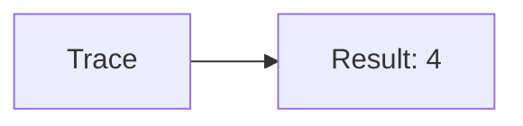
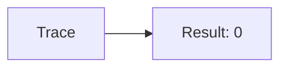
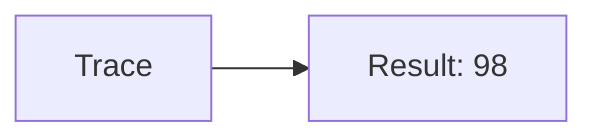
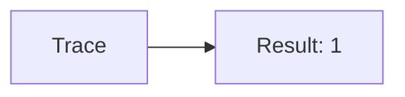
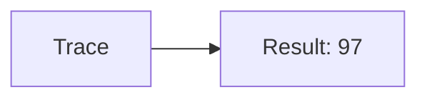
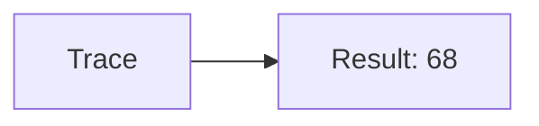
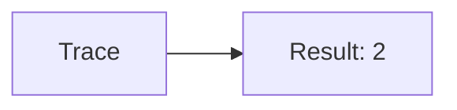
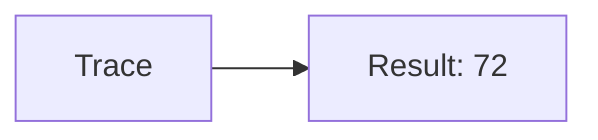

🔙 **[Kembali ke Daftar Soal](./README.md)**

---

# Latihan Soal Part C - Modul 01 - Set 06

### Soal 126
```cpp
// Laptop: Modulo
int laptop = 89, bagi = 5;
int sisa = laptop % bagi;
```
**Pertanyaan:**
1. Berapakah hasil akhirnya?
2. Deskripsikan alur pikir 'Compiler Manusia' untuk soal ini!

**Jawaban & Diagnosis:**
1. **4**
2. 89 Laptop dibagi 5 sisa 4.

**Mermaid Flowchart:**


---
### Soal 127
```cpp
// Mouse: Casting
double val = 57.21;
int res = (int)val;
```
**Pertanyaan:**
1. Berapakah hasil akhirnya?
2. Deskripsikan alur pikir 'Compiler Manusia' untuk soal ini!

**Jawaban & Diagnosis:**
1. **57**
2. Mengubah 57.21 jadi integer (pangkas koma) jadi 57.

**Mermaid Flowchart:**


---
### Soal 128
```cpp
// Keyboard: Pembagian
int keyboard = 25, bagi = 3;
int hasil = keyboard / bagi;
```
**Pertanyaan:**
1. Berapakah hasil akhirnya?
2. Deskripsikan alur pikir 'Compiler Manusia' untuk soal ini!

**Jawaban & Diagnosis:**
1. **8**
2. Membagi 25 Keyboard ke 3 bagian. Hasil bulat: 8.

**Mermaid Flowchart:**


---
### Soal 129
```cpp
// Monitor: Modulo
int monitor = 88, bagi = 2;
int sisa = monitor % bagi;
```
**Pertanyaan:**
1. Berapakah hasil akhirnya?
2. Deskripsikan alur pikir 'Compiler Manusia' untuk soal ini!

**Jawaban & Diagnosis:**
1. **0**
2. 88 Monitor dibagi 2 sisa 0.

**Mermaid Flowchart:**


---
### Soal 130
```cpp
// Kabel: Casting
double val = 98.61;
int res = (int)val;
```
**Pertanyaan:**
1. Berapakah hasil akhirnya?
2. Deskripsikan alur pikir 'Compiler Manusia' untuk soal ini!

**Jawaban & Diagnosis:**
1. **98**
2. Mengubah 98.61 jadi integer (pangkas koma) jadi 98.

**Mermaid Flowchart:**


---
### Soal 131
```cpp
// Steker: Pembagian
int steker = 52, bagi = 2;
int hasil = steker / bagi;
```
**Pertanyaan:**
1. Berapakah hasil akhirnya?
2. Deskripsikan alur pikir 'Compiler Manusia' untuk soal ini!

**Jawaban & Diagnosis:**
1. **26**
2. Membagi 52 Steker ke 2 bagian. Hasil bulat: 26.

**Mermaid Flowchart:**


---
### Soal 132
```cpp
// Saklar: Modulo
int saklar = 77, bagi = 4;
int sisa = saklar % bagi;
```
**Pertanyaan:**
1. Berapakah hasil akhirnya?
2. Deskripsikan alur pikir 'Compiler Manusia' untuk soal ini!

**Jawaban & Diagnosis:**
1. **1**
2. 77 Saklar dibagi 4 sisa 1.

**Mermaid Flowchart:**


---
### Soal 133
```cpp
// Baterai: Casting
double val = 97.51;
int res = (int)val;
```
**Pertanyaan:**
1. Berapakah hasil akhirnya?
2. Deskripsikan alur pikir 'Compiler Manusia' untuk soal ini!

**Jawaban & Diagnosis:**
1. **97**
2. Mengubah 97.51 jadi integer (pangkas koma) jadi 97.

**Mermaid Flowchart:**


---
### Soal 134
```cpp
// Jam: Pembagian
int jam = 26, bagi = 4;
int hasil = jam / bagi;
```
**Pertanyaan:**
1. Berapakah hasil akhirnya?
2. Deskripsikan alur pikir 'Compiler Manusia' untuk soal ini!

**Jawaban & Diagnosis:**
1. **6**
2. Membagi 26 Jam ke 4 bagian. Hasil bulat: 6.

**Mermaid Flowchart:**


---
### Soal 135
```cpp
// Kalender: Modulo
int kalender = 17, bagi = 6;
int sisa = kalender % bagi;
```
**Pertanyaan:**
1. Berapakah hasil akhirnya?
2. Deskripsikan alur pikir 'Compiler Manusia' untuk soal ini!

**Jawaban & Diagnosis:**
1. **5**
2. 17 Kalender dibagi 6 sisa 5.

**Mermaid Flowchart:**


---
### Soal 136
```cpp
// Kaca: Casting
double val = 68.41;
int res = (int)val;
```
**Pertanyaan:**
1. Berapakah hasil akhirnya?
2. Deskripsikan alur pikir 'Compiler Manusia' untuk soal ini!

**Jawaban & Diagnosis:**
1. **68**
2. Mengubah 68.41 jadi integer (pangkas koma) jadi 68.

**Mermaid Flowchart:**


---
### Soal 137
```cpp
// Pintu: Pembagian
int pintu = 63, bagi = 7;
int hasil = pintu / bagi;
```
**Pertanyaan:**
1. Berapakah hasil akhirnya?
2. Deskripsikan alur pikir 'Compiler Manusia' untuk soal ini!

**Jawaban & Diagnosis:**
1. **9**
2. Membagi 63 Pintu ke 7 bagian. Hasil bulat: 9.

**Mermaid Flowchart:**


---
### Soal 138
```cpp
// Jendela: Modulo
int jendela = 44, bagi = 6;
int sisa = jendela % bagi;
```
**Pertanyaan:**
1. Berapakah hasil akhirnya?
2. Deskripsikan alur pikir 'Compiler Manusia' untuk soal ini!

**Jawaban & Diagnosis:**
1. **2**
2. 44 Jendela dibagi 6 sisa 2.

**Mermaid Flowchart:**


---
### Soal 139
```cpp
// Lantai: Casting
double val = 59.51;
int res = (int)val;
```
**Pertanyaan:**
1. Berapakah hasil akhirnya?
2. Deskripsikan alur pikir 'Compiler Manusia' untuk soal ini!

**Jawaban & Diagnosis:**
1. **59**
2. Mengubah 59.51 jadi integer (pangkas koma) jadi 59.

**Mermaid Flowchart:**


---
### Soal 140
```cpp
// Atap: Pembagian
int atap = 66, bagi = 7;
int hasil = atap / bagi;
```
**Pertanyaan:**
1. Berapakah hasil akhirnya?
2. Deskripsikan alur pikir 'Compiler Manusia' untuk soal ini!

**Jawaban & Diagnosis:**
1. **9**
2. Membagi 66 Atap ke 7 bagian. Hasil bulat: 9.

**Mermaid Flowchart:**


---
### Soal 141
```cpp
// Dinding: Modulo
int dinding = 89, bagi = 2;
int sisa = dinding % bagi;
```
**Pertanyaan:**
1. Berapakah hasil akhirnya?
2. Deskripsikan alur pikir 'Compiler Manusia' untuk soal ini!

**Jawaban & Diagnosis:**
1. **1**
2. 89 Dinding dibagi 2 sisa 1.

**Mermaid Flowchart:**


---
### Soal 142
```cpp
// Pagar: Casting
double val = 78.61;
int res = (int)val;
```
**Pertanyaan:**
1. Berapakah hasil akhirnya?
2. Deskripsikan alur pikir 'Compiler Manusia' untuk soal ini!

**Jawaban & Diagnosis:**
1. **78**
2. Mengubah 78.61 jadi integer (pangkas koma) jadi 78.

**Mermaid Flowchart:**


---
### Soal 143
```cpp
// Kebun: Pembagian
int kebun = 57, bagi = 6;
int hasil = kebun / bagi;
```
**Pertanyaan:**
1. Berapakah hasil akhirnya?
2. Deskripsikan alur pikir 'Compiler Manusia' untuk soal ini!

**Jawaban & Diagnosis:**
1. **9**
2. Membagi 57 Kebun ke 6 bagian. Hasil bulat: 9.

**Mermaid Flowchart:**


---
### Soal 144
```cpp
// Pohon: Modulo
int pohon = 17, bagi = 4;
int sisa = pohon % bagi;
```
**Pertanyaan:**
1. Berapakah hasil akhirnya?
2. Deskripsikan alur pikir 'Compiler Manusia' untuk soal ini!

**Jawaban & Diagnosis:**
1. **1**
2. 17 Pohon dibagi 4 sisa 1.

**Mermaid Flowchart:**


---
### Soal 145
```cpp
// Daun: Casting
double val = 72.41;
int res = (int)val;
```
**Pertanyaan:**
1. Berapakah hasil akhirnya?
2. Deskripsikan alur pikir 'Compiler Manusia' untuk soal ini!

**Jawaban & Diagnosis:**
1. **72**
2. Mengubah 72.41 jadi integer (pangkas koma) jadi 72.

**Mermaid Flowchart:**


---
### Soal 146
```cpp
// Bunga: Pembagian
int bunga = 50, bagi = 5;
int hasil = bunga / bagi;
```
**Pertanyaan:**
1. Berapakah hasil akhirnya?
2. Deskripsikan alur pikir 'Compiler Manusia' untuk soal ini!

**Jawaban & Diagnosis:**
1. **10**
2. Membagi 50 Bunga ke 5 bagian. Hasil bulat: 10.

**Mermaid Flowchart:**
```mermaid
graph LR
A[Trace] --> B[Result: 10]
```

---
### Soal 147
```cpp
// Akar: Modulo
int akar = 93, bagi = 8;
int sisa = akar % bagi;
```
**Pertanyaan:**
1. Berapakah hasil akhirnya?
2. Deskripsikan alur pikir 'Compiler Manusia' untuk soal ini!

**Jawaban & Diagnosis:**
1. **5**
2. 93 Akar dibagi 8 sisa 5.

**Mermaid Flowchart:**
```mermaid
graph LR
A[Trace] --> B[Result: 5]
```

---
### Soal 148
```cpp
// Tanah: Casting
double val = 15.81;
int res = (int)val;
```
**Pertanyaan:**
1. Berapakah hasil akhirnya?
2. Deskripsikan alur pikir 'Compiler Manusia' untuk soal ini!

**Jawaban & Diagnosis:**
1. **15**
2. Mengubah 15.81 jadi integer (pangkas koma) jadi 15.

**Mermaid Flowchart:**
```mermaid
graph LR
A[Trace] --> B[Result: 15]
```

---
### Soal 149
```cpp
// Pasir: Pembagian
int pasir = 36, bagi = 2;
int hasil = pasir / bagi;
```
**Pertanyaan:**
1. Berapakah hasil akhirnya?
2. Deskripsikan alur pikir 'Compiler Manusia' untuk soal ini!

**Jawaban & Diagnosis:**
1. **18**
2. Membagi 36 Pasir ke 2 bagian. Hasil bulat: 18.

**Mermaid Flowchart:**
```mermaid
graph LR
A[Trace] --> B[Result: 18]
```

---
### Soal 150
```cpp
// Batu: Modulo
int batu = 65, bagi = 2;
int sisa = batu % bagi;
```
**Pertanyaan:**
1. Berapakah hasil akhirnya?
2. Deskripsikan alur pikir 'Compiler Manusia' untuk soal ini!

**Jawaban & Diagnosis:**
1. **1**
2. 65 Batu dibagi 2 sisa 1.

**Mermaid Flowchart:**
```mermaid
graph LR
A[Trace] --> B[Result: 1]
```

---
