🔙 **[Kembali ke Daftar Soal](./README.md)**

---

# Latihan Soal Part C - Modul 01 - Set 06

### Soal 126
```cpp
int n = 73, b = 8;
int res = n / b;
```
**Pertanyaan:**
1. Berapakah hasil akhirnya?
2. Mengapa demikian?

**Jawaban & Diagnosis:**
1. **9**
2. Lihat Tracing.

**Mermaid Flowchart:**
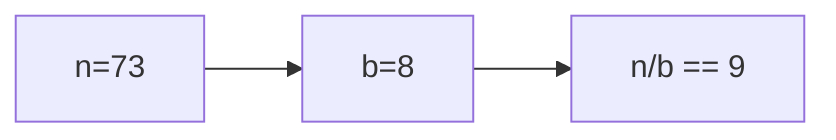

**📖 Penjelasan:**
**Langkah Tracing:**
1. n=73, b=8.
2. 73/8 = 9.12. Karena `int`, desimal dibuang.
3. Hasil: 9.

---
### Soal 127
```cpp
int a = 71, m = 8;
int res = a / m;
```
**Pertanyaan:**
1. Berapakah hasil akhirnya?
2. Mengapa demikian?

**Jawaban & Diagnosis:**
1. **8**
2. Lihat Tracing.

**Mermaid Flowchart:**
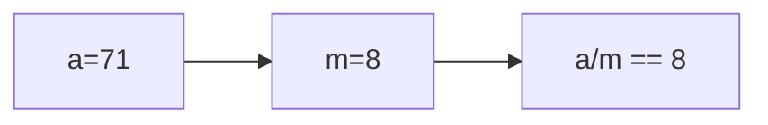

**📖 Penjelasan:**
**Langkah Tracing:**
1. a=71, m=8.
2. 71/8 = 8.88. Karena `int`, desimal dibuang.
3. Hasil: 8.

---
### Soal 128
```cpp
char ch = 'm';
ch = ch + (4);
```
**Pertanyaan:**
1. Berapakah hasil akhirnya?
2. Mengapa demikian?

**Jawaban & Diagnosis:**
1. **q**
2. Lihat Tracing.

**Mermaid Flowchart:**
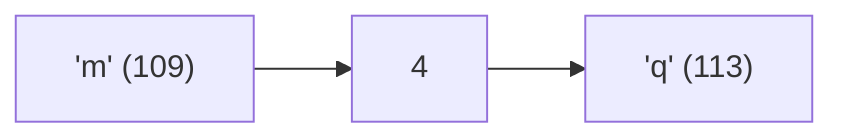

**📖 Penjelasan:**
**Langkah Tracing:**
1. ch='m' (ASCII 109).
2. 109 + (4) = 113.
3. Hasil: 'q'.

---
### Soal 129
```cpp
char ch = 'm';
ch = ch + (2);
```
**Pertanyaan:**
1. Berapakah hasil akhirnya?
2. Mengapa demikian?

**Jawaban & Diagnosis:**
1. **o**
2. Lihat Tracing.

**Mermaid Flowchart:**
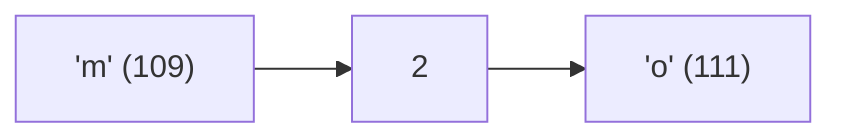

**📖 Penjelasan:**
**Langkah Tracing:**
1. ch='m' (ASCII 109).
2. 109 + (2) = 111.
3. Hasil: 'o'.

---
### Soal 130
```cpp
double val = 82.86;
int res = (int)val;
```
**Pertanyaan:**
1. Berapakah hasil akhirnya?
2. Mengapa demikian?

**Jawaban & Diagnosis:**
1. **82**
2. Lihat Tracing.

**Mermaid Flowchart:**
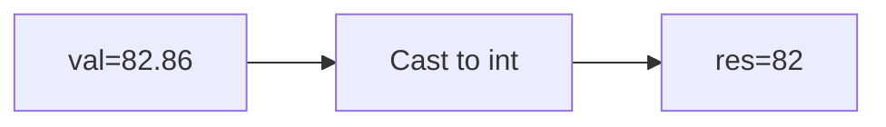

**📖 Penjelasan:**
**Langkah Tracing:**
1. val=82.86.
2. Desimal dihilangkan.
3. Hasil: 82.

---
### Soal 131
```cpp
int n = 45;
int m = 3;
int res = n % m;
```
**Pertanyaan:**
1. Berapakah hasil akhirnya?
2. Mengapa demikian?

**Jawaban & Diagnosis:**
1. **0**
2. Lihat Tracing.

**Mermaid Flowchart:**
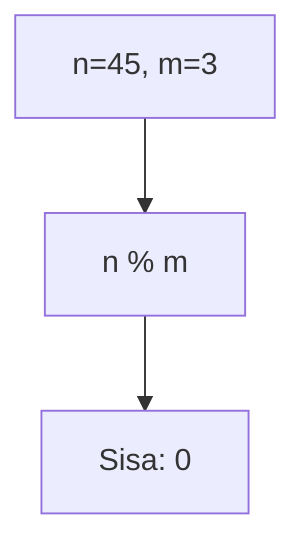

**📖 Penjelasan:**
**Langkah Tracing:**
1. n=45, m=3.
2. 45 dibagi 3 sisa 0.
3. Hasil: 0.

---
### Soal 132
```cpp
int n = 17;
int m = 10;
int res = n % m;
```
**Pertanyaan:**
1. Berapakah hasil akhirnya?
2. Mengapa demikian?

**Jawaban & Diagnosis:**
1. **7**
2. Lihat Tracing.

**Mermaid Flowchart:**
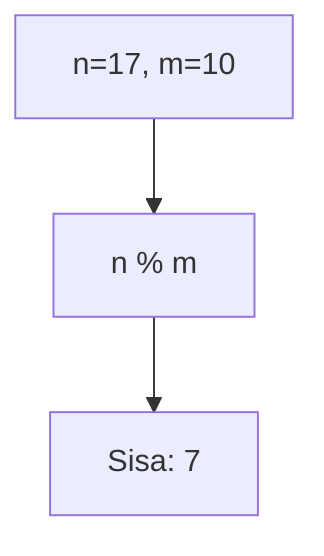

**📖 Penjelasan:**
**Langkah Tracing:**
1. n=17, m=10.
2. 17 dibagi 10 sisa 7.
3. Hasil: 7.

---
### Soal 133
```cpp
int x = 60, m = 6;
int res = x / m;
```
**Pertanyaan:**
1. Berapakah hasil akhirnya?
2. Mengapa demikian?

**Jawaban & Diagnosis:**
1. **10**
2. Lihat Tracing.

**Mermaid Flowchart:**
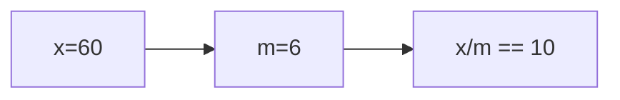

**📖 Penjelasan:**
**Langkah Tracing:**
1. x=60, m=6.
2. 60/6 = 10.00. Karena `int`, desimal dibuang.
3. Hasil: 10.

---
### Soal 134
```cpp
int n = 16;
int m = 5;
int res = n % m;
```
**Pertanyaan:**
1. Berapakah hasil akhirnya?
2. Mengapa demikian?

**Jawaban & Diagnosis:**
1. **1**
2. Lihat Tracing.

**Mermaid Flowchart:**
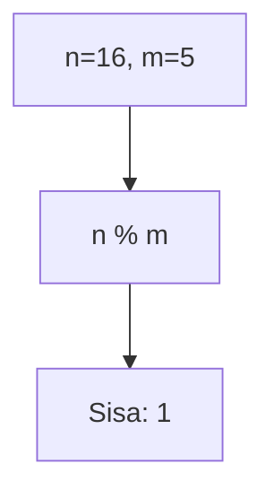

**📖 Penjelasan:**
**Langkah Tracing:**
1. n=16, m=5.
2. 16 dibagi 5 sisa 1.
3. Hasil: 1.

---
### Soal 135
```cpp
int n = 11;
int m = 5;
int res = n % m;
```
**Pertanyaan:**
1. Berapakah hasil akhirnya?
2. Mengapa demikian?

**Jawaban & Diagnosis:**
1. **1**
2. Lihat Tracing.

**Mermaid Flowchart:**
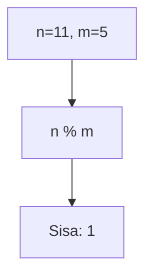

**📖 Penjelasan:**
**Langkah Tracing:**
1. n=11, m=5.
2. 11 dibagi 5 sisa 1.
3. Hasil: 1.

---
### Soal 136
```cpp
double val = 42.81;
int res = (int)val;
```
**Pertanyaan:**
1. Berapakah hasil akhirnya?
2. Mengapa demikian?

**Jawaban & Diagnosis:**
1. **42**
2. Lihat Tracing.

**Mermaid Flowchart:**
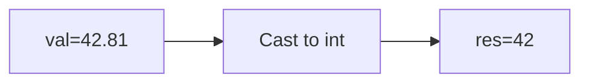

**📖 Penjelasan:**
**Langkah Tracing:**
1. val=42.81.
2. Desimal dihilangkan.
3. Hasil: 42.

---
### Soal 137
```cpp
char ch = 'a';
ch = ch + (4);
```
**Pertanyaan:**
1. Berapakah hasil akhirnya?
2. Mengapa demikian?

**Jawaban & Diagnosis:**
1. **e**
2. Lihat Tracing.

**Mermaid Flowchart:**
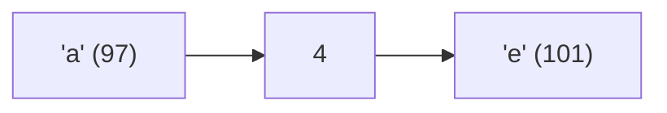

**📖 Penjelasan:**
**Langkah Tracing:**
1. ch='a' (ASCII 97).
2. 97 + (4) = 101.
3. Hasil: 'e'.

---
### Soal 138
```cpp
int n = 14;
int m = 3;
int res = n % m;
```
**Pertanyaan:**
1. Berapakah hasil akhirnya?
2. Mengapa demikian?

**Jawaban & Diagnosis:**
1. **2**
2. Lihat Tracing.

**Mermaid Flowchart:**
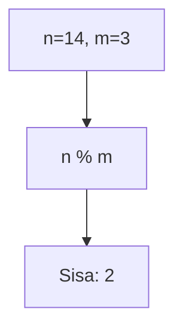

**📖 Penjelasan:**
**Langkah Tracing:**
1. n=14, m=3.
2. 14 dibagi 3 sisa 2.
3. Hasil: 2.

---
### Soal 139
```cpp
char ch = 'B';
ch = ch + (-2);
```
**Pertanyaan:**
1. Berapakah hasil akhirnya?
2. Mengapa demikian?

**Jawaban & Diagnosis:**
1. **@**
2. Lihat Tracing.

**Mermaid Flowchart:**
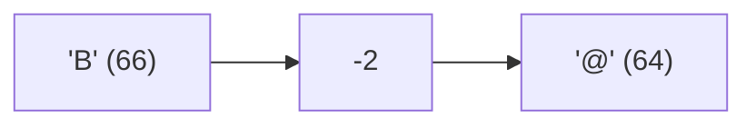

**📖 Penjelasan:**
**Langkah Tracing:**
1. ch='B' (ASCII 66).
2. 66 + (-2) = 64.
3. Hasil: '@'.

---
### Soal 140
```cpp
int x = 43, b = 9;
int res = x / b;
```
**Pertanyaan:**
1. Berapakah hasil akhirnya?
2. Mengapa demikian?

**Jawaban & Diagnosis:**
1. **4**
2. Lihat Tracing.

**Mermaid Flowchart:**
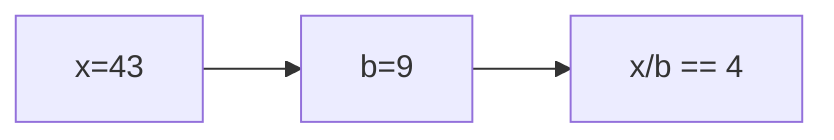

**📖 Penjelasan:**
**Langkah Tracing:**
1. x=43, b=9.
2. 43/9 = 4.78. Karena `int`, desimal dibuang.
3. Hasil: 4.

---
### Soal 141
```cpp
int n = 8;
int m = 3;
int res = n % m;
```
**Pertanyaan:**
1. Berapakah hasil akhirnya?
2. Mengapa demikian?

**Jawaban & Diagnosis:**
1. **2**
2. Lihat Tracing.

**Mermaid Flowchart:**
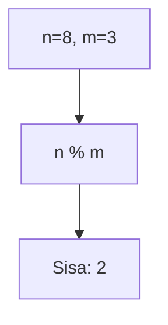

**📖 Penjelasan:**
**Langkah Tracing:**
1. n=8, m=3.
2. 8 dibagi 3 sisa 2.
3. Hasil: 2.

---
### Soal 142
```cpp
int n = 45;
int m = 2;
int res = n % m;
```
**Pertanyaan:**
1. Berapakah hasil akhirnya?
2. Mengapa demikian?

**Jawaban & Diagnosis:**
1. **1**
2. Lihat Tracing.

**Mermaid Flowchart:**


**📖 Penjelasan:**
**Langkah Tracing:**
1. n=45, m=2.
2. 45 dibagi 2 sisa 1.
3. Hasil: 1.

---
### Soal 143
```cpp
int n = 38;
int m = 10;
int res = n % m;
```
**Pertanyaan:**
1. Berapakah hasil akhirnya?
2. Mengapa demikian?

**Jawaban & Diagnosis:**
1. **8**
2. Lihat Tracing.

**Mermaid Flowchart:**
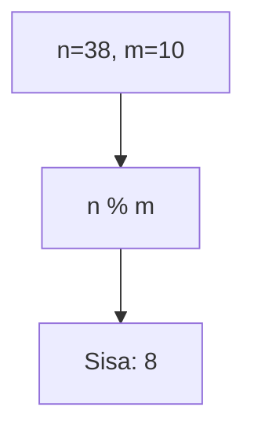

**📖 Penjelasan:**
**Langkah Tracing:**
1. n=38, m=10.
2. 38 dibagi 10 sisa 8.
3. Hasil: 8.

---
### Soal 144
```cpp
double val = 42.33;
int res = (int)val;
```
**Pertanyaan:**
1. Berapakah hasil akhirnya?
2. Mengapa demikian?

**Jawaban & Diagnosis:**
1. **42**
2. Lihat Tracing.

**Mermaid Flowchart:**
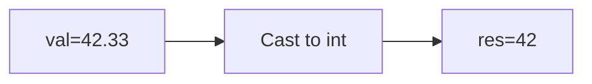

**📖 Penjelasan:**
**Langkah Tracing:**
1. val=42.33.
2. Desimal dihilangkan.
3. Hasil: 42.

---
### Soal 145
```cpp
int x = 59, b = 8;
int res = x / b;
```
**Pertanyaan:**
1. Berapakah hasil akhirnya?
2. Mengapa demikian?

**Jawaban & Diagnosis:**
1. **7**
2. Lihat Tracing.

**Mermaid Flowchart:**
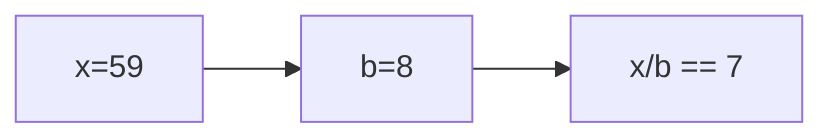

**📖 Penjelasan:**
**Langkah Tracing:**
1. x=59, b=8.
2. 59/8 = 7.38. Karena `int`, desimal dibuang.
3. Hasil: 7.

---
### Soal 146
```cpp
int n = 33;
int m = 10;
int res = n % m;
```
**Pertanyaan:**
1. Berapakah hasil akhirnya?
2. Mengapa demikian?

**Jawaban & Diagnosis:**
1. **3**
2. Lihat Tracing.

**Mermaid Flowchart:**
```mermaid
graph TD
A["n=33, m=10"] --> B["n % m"]
B --> C["Sisa: 3"]
```

**📖 Penjelasan:**
**Langkah Tracing:**
1. n=33, m=10.
2. 33 dibagi 10 sisa 3.
3. Hasil: 3.

---
### Soal 147
```cpp
double val = 64.19;
int res = (int)val;
```
**Pertanyaan:**
1. Berapakah hasil akhirnya?
2. Mengapa demikian?

**Jawaban & Diagnosis:**
1. **64**
2. Lihat Tracing.

**Mermaid Flowchart:**
```mermaid
graph LR
A["val=64.19"] --> B["Cast to int"]
B --> C["res=64"]
```

**📖 Penjelasan:**
**Langkah Tracing:**
1. val=64.19.
2. Desimal dihilangkan.
3. Hasil: 64.

---
### Soal 148
```cpp
int n = 41;
int m = 3;
int res = n % m;
```
**Pertanyaan:**
1. Berapakah hasil akhirnya?
2. Mengapa demikian?

**Jawaban & Diagnosis:**
1. **2**
2. Lihat Tracing.

**Mermaid Flowchart:**
```mermaid
graph TD
A["n=41, m=3"] --> B["n % m"]
B --> C["Sisa: 2"]
```

**📖 Penjelasan:**
**Langkah Tracing:**
1. n=41, m=3.
2. 41 dibagi 3 sisa 2.
3. Hasil: 2.

---
### Soal 149
```cpp
int n = 39;
int m = 10;
int res = n % m;
```
**Pertanyaan:**
1. Berapakah hasil akhirnya?
2. Mengapa demikian?

**Jawaban & Diagnosis:**
1. **9**
2. Lihat Tracing.

**Mermaid Flowchart:**
```mermaid
graph TD
A["n=39, m=10"] --> B["n % m"]
B --> C["Sisa: 9"]
```

**📖 Penjelasan:**
**Langkah Tracing:**
1. n=39, m=10.
2. 39 dibagi 10 sisa 9.
3. Hasil: 9.

---
### Soal 150
```cpp
int n = 32;
int m = 2;
int res = n % m;
```
**Pertanyaan:**
1. Berapakah hasil akhirnya?
2. Mengapa demikian?

**Jawaban & Diagnosis:**
1. **0**
2. Lihat Tracing.

**Mermaid Flowchart:**
```mermaid
graph TD
A["n=32, m=2"] --> B["n % m"]
B --> C["Sisa: 0"]
```

**📖 Penjelasan:**
**Langkah Tracing:**
1. n=32, m=2.
2. 32 dibagi 2 sisa 0.
3. Hasil: 0.

---
