🔙 **[Kembali ke Daftar Soal](./README.md)**

---

# Latihan Soal Part C - Modul 01 - Set 07

### Soal 151
```cpp
char ch = 'X';
ch = ch + (1);
```
**Pertanyaan:**
1. Berapakah hasil akhirnya?
2. Mengapa demikian?

**Jawaban & Diagnosis:**
1. **Y**
2. Lihat Tracing.

**Mermaid Flowchart:**
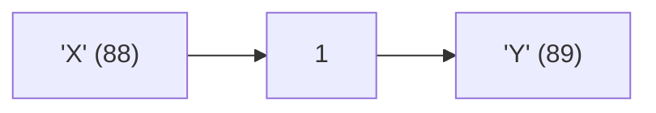

**📖 Penjelasan:**
**Langkah Tracing:**
1. ch='X' (ASCII 88).
2. 88 + (1) = 89.
3. Hasil: 'Y'.

---
### Soal 152
```cpp
double val = 35.40;
int res = (int)val;
```
**Pertanyaan:**
1. Berapakah hasil akhirnya?
2. Mengapa demikian?

**Jawaban & Diagnosis:**
1. **35**
2. Lihat Tracing.

**Mermaid Flowchart:**
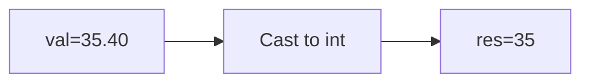

**📖 Penjelasan:**
**Langkah Tracing:**
1. val=35.40.
2. Desimal dihilangkan.
3. Hasil: 35.

---
### Soal 153
```cpp
int a = 88, m = 2;
int res = a / m;
```
**Pertanyaan:**
1. Berapakah hasil akhirnya?
2. Mengapa demikian?

**Jawaban & Diagnosis:**
1. **44**
2. Lihat Tracing.

**Mermaid Flowchart:**
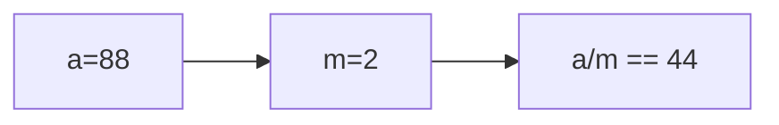

**📖 Penjelasan:**
**Langkah Tracing:**
1. a=88, m=2.
2. 88/2 = 44.00. Karena `int`, desimal dibuang.
3. Hasil: 44.

---
### Soal 154
```cpp
int n = 92, m = 9;
int res = n / m;
```
**Pertanyaan:**
1. Berapakah hasil akhirnya?
2. Mengapa demikian?

**Jawaban & Diagnosis:**
1. **10**
2. Lihat Tracing.

**Mermaid Flowchart:**
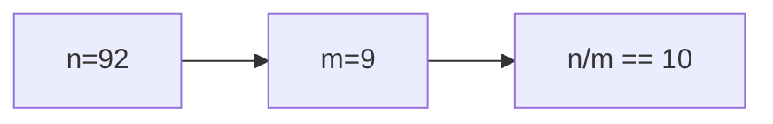

**📖 Penjelasan:**
**Langkah Tracing:**
1. n=92, m=9.
2. 92/9 = 10.22. Karena `int`, desimal dibuang.
3. Hasil: 10.

---
### Soal 155
```cpp
int n = 5;
int m = 10;
int res = n % m;
```
**Pertanyaan:**
1. Berapakah hasil akhirnya?
2. Mengapa demikian?

**Jawaban & Diagnosis:**
1. **5**
2. Lihat Tracing.

**Mermaid Flowchart:**
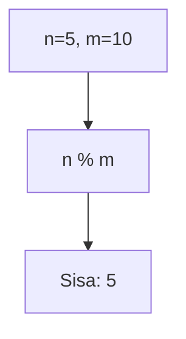

**📖 Penjelasan:**
**Langkah Tracing:**
1. n=5, m=10.
2. 5 dibagi 10 sisa 5.
3. Hasil: 5.

---
### Soal 156
```cpp
int a = 55, b = 2;
int res = a / b;
```
**Pertanyaan:**
1. Berapakah hasil akhirnya?
2. Mengapa demikian?

**Jawaban & Diagnosis:**
1. **27**
2. Lihat Tracing.

**Mermaid Flowchart:**
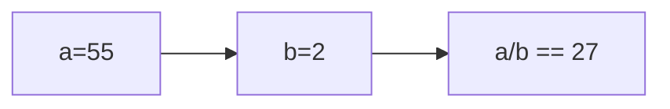

**📖 Penjelasan:**
**Langkah Tracing:**
1. a=55, b=2.
2. 55/2 = 27.50. Karena `int`, desimal dibuang.
3. Hasil: 27.

---
### Soal 157
```cpp
int a = 38, m = 9;
int res = a / m;
```
**Pertanyaan:**
1. Berapakah hasil akhirnya?
2. Mengapa demikian?

**Jawaban & Diagnosis:**
1. **4**
2. Lihat Tracing.

**Mermaid Flowchart:**
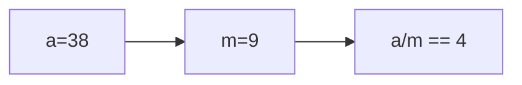

**📖 Penjelasan:**
**Langkah Tracing:**
1. a=38, m=9.
2. 38/9 = 4.22. Karena `int`, desimal dibuang.
3. Hasil: 4.

---
### Soal 158
```cpp
double val = 49.92;
int res = (int)val;
```
**Pertanyaan:**
1. Berapakah hasil akhirnya?
2. Mengapa demikian?

**Jawaban & Diagnosis:**
1. **49**
2. Lihat Tracing.

**Mermaid Flowchart:**
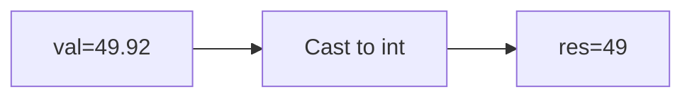

**📖 Penjelasan:**
**Langkah Tracing:**
1. val=49.92.
2. Desimal dihilangkan.
3. Hasil: 49.

---
### Soal 159
```cpp
double val = 32.14;
int res = (int)val;
```
**Pertanyaan:**
1. Berapakah hasil akhirnya?
2. Mengapa demikian?

**Jawaban & Diagnosis:**
1. **32**
2. Lihat Tracing.

**Mermaid Flowchart:**
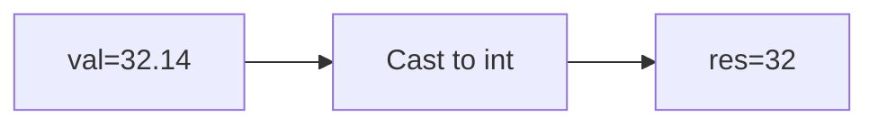

**📖 Penjelasan:**
**Langkah Tracing:**
1. val=32.14.
2. Desimal dihilangkan.
3. Hasil: 32.

---
### Soal 160
```cpp
int x = 86, y = 9;
int res = x / y;
```
**Pertanyaan:**
1. Berapakah hasil akhirnya?
2. Mengapa demikian?

**Jawaban & Diagnosis:**
1. **9**
2. Lihat Tracing.

**Mermaid Flowchart:**
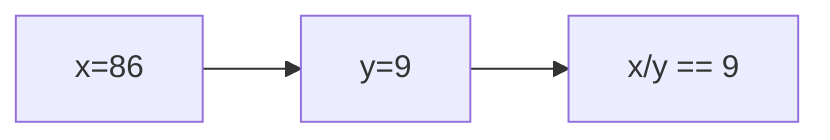

**📖 Penjelasan:**
**Langkah Tracing:**
1. x=86, y=9.
2. 86/9 = 9.56. Karena `int`, desimal dibuang.
3. Hasil: 9.

---
### Soal 161
```cpp
int n = 33;
int m = 3;
int res = n % m;
```
**Pertanyaan:**
1. Berapakah hasil akhirnya?
2. Mengapa demikian?

**Jawaban & Diagnosis:**
1. **0**
2. Lihat Tracing.

**Mermaid Flowchart:**
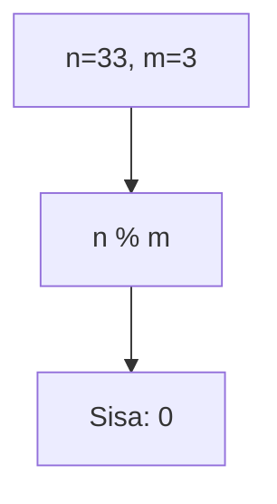

**📖 Penjelasan:**
**Langkah Tracing:**
1. n=33, m=3.
2. 33 dibagi 3 sisa 0.
3. Hasil: 0.

---
### Soal 162
```cpp
double val = 94.63;
int res = (int)val;
```
**Pertanyaan:**
1. Berapakah hasil akhirnya?
2. Mengapa demikian?

**Jawaban & Diagnosis:**
1. **94**
2. Lihat Tracing.

**Mermaid Flowchart:**
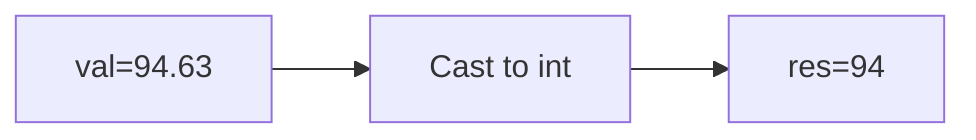

**📖 Penjelasan:**
**Langkah Tracing:**
1. val=94.63.
2. Desimal dihilangkan.
3. Hasil: 94.

---
### Soal 163
```cpp
double val = 70.34;
int res = (int)val;
```
**Pertanyaan:**
1. Berapakah hasil akhirnya?
2. Mengapa demikian?

**Jawaban & Diagnosis:**
1. **70**
2. Lihat Tracing.

**Mermaid Flowchart:**
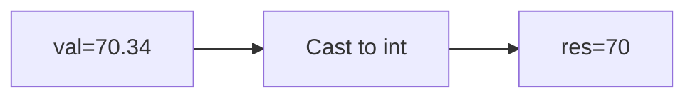

**📖 Penjelasan:**
**Langkah Tracing:**
1. val=70.34.
2. Desimal dihilangkan.
3. Hasil: 70.

---
### Soal 164
```cpp
char ch = 'a';
ch = ch + (5);
```
**Pertanyaan:**
1. Berapakah hasil akhirnya?
2. Mengapa demikian?

**Jawaban & Diagnosis:**
1. **f**
2. Lihat Tracing.

**Mermaid Flowchart:**
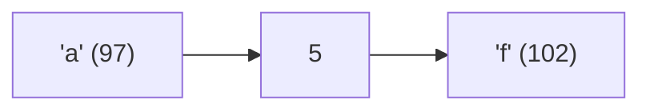

**📖 Penjelasan:**
**Langkah Tracing:**
1. ch='a' (ASCII 97).
2. 97 + (5) = 102.
3. Hasil: 'f'.

---
### Soal 165
```cpp
int n = 38, y = 3;
int res = n / y;
```
**Pertanyaan:**
1. Berapakah hasil akhirnya?
2. Mengapa demikian?

**Jawaban & Diagnosis:**
1. **12**
2. Lihat Tracing.

**Mermaid Flowchart:**
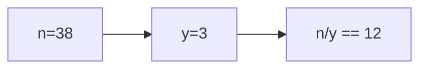

**📖 Penjelasan:**
**Langkah Tracing:**
1. n=38, y=3.
2. 38/3 = 12.67. Karena `int`, desimal dibuang.
3. Hasil: 12.

---
### Soal 166
```cpp
int n = 20;
int m = 5;
int res = n % m;
```
**Pertanyaan:**
1. Berapakah hasil akhirnya?
2. Mengapa demikian?

**Jawaban & Diagnosis:**
1. **0**
2. Lihat Tracing.

**Mermaid Flowchart:**
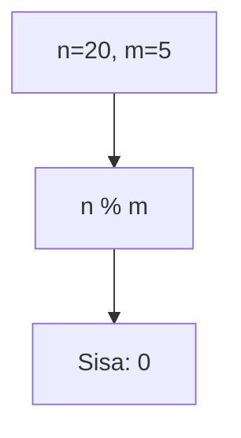

**📖 Penjelasan:**
**Langkah Tracing:**
1. n=20, m=5.
2. 20 dibagi 5 sisa 0.
3. Hasil: 0.

---
### Soal 167
```cpp
int a = 28, b = 7;
int res = a / b;
```
**Pertanyaan:**
1. Berapakah hasil akhirnya?
2. Mengapa demikian?

**Jawaban & Diagnosis:**
1. **4**
2. Lihat Tracing.

**Mermaid Flowchart:**
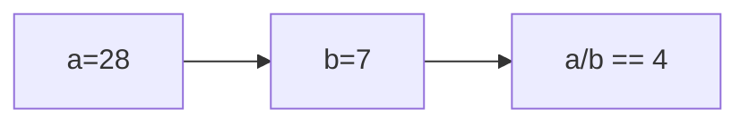

**📖 Penjelasan:**
**Langkah Tracing:**
1. a=28, b=7.
2. 28/7 = 4.00. Karena `int`, desimal dibuang.
3. Hasil: 4.

---
### Soal 168
```cpp
int n = 20;
int m = 5;
int res = n % m;
```
**Pertanyaan:**
1. Berapakah hasil akhirnya?
2. Mengapa demikian?

**Jawaban & Diagnosis:**
1. **0**
2. Lihat Tracing.

**Mermaid Flowchart:**


**📖 Penjelasan:**
**Langkah Tracing:**
1. n=20, m=5.
2. 20 dibagi 5 sisa 0.
3. Hasil: 0.

---
### Soal 169
```cpp
char ch = 'a';
ch = ch + (4);
```
**Pertanyaan:**
1. Berapakah hasil akhirnya?
2. Mengapa demikian?

**Jawaban & Diagnosis:**
1. **e**
2. Lihat Tracing.

**Mermaid Flowchart:**
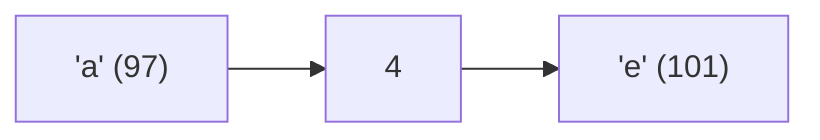

**📖 Penjelasan:**
**Langkah Tracing:**
1. ch='a' (ASCII 97).
2. 97 + (4) = 101.
3. Hasil: 'e'.

---
### Soal 170
```cpp
char ch = 'A';
ch = ch + (-2);
```
**Pertanyaan:**
1. Berapakah hasil akhirnya?
2. Mengapa demikian?

**Jawaban & Diagnosis:**
1. **?**
2. Lihat Tracing.

**Mermaid Flowchart:**
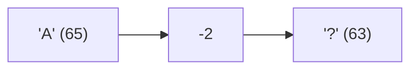

**📖 Penjelasan:**
**Langkah Tracing:**
1. ch='A' (ASCII 65).
2. 65 + (-2) = 63.
3. Hasil: '?'.

---
### Soal 171
```cpp
int n = 47;
int m = 3;
int res = n % m;
```
**Pertanyaan:**
1. Berapakah hasil akhirnya?
2. Mengapa demikian?

**Jawaban & Diagnosis:**
1. **2**
2. Lihat Tracing.

**Mermaid Flowchart:**
```mermaid
graph TD
A["n=47, m=3"] --> B["n % m"]
B --> C["Sisa: 2"]
```

**📖 Penjelasan:**
**Langkah Tracing:**
1. n=47, m=3.
2. 47 dibagi 3 sisa 2.
3. Hasil: 2.

---
### Soal 172
```cpp
int a = 52, b = 9;
int res = a / b;
```
**Pertanyaan:**
1. Berapakah hasil akhirnya?
2. Mengapa demikian?

**Jawaban & Diagnosis:**
1. **5**
2. Lihat Tracing.

**Mermaid Flowchart:**
```mermaid
graph LR
A["a=52"] --> B["b=9"]
B --> C["a/b == 5"]
```

**📖 Penjelasan:**
**Langkah Tracing:**
1. a=52, b=9.
2. 52/9 = 5.78. Karena `int`, desimal dibuang.
3. Hasil: 5.

---
### Soal 173
```cpp
double val = 93.60;
int res = (int)val;
```
**Pertanyaan:**
1. Berapakah hasil akhirnya?
2. Mengapa demikian?

**Jawaban & Diagnosis:**
1. **93**
2. Lihat Tracing.

**Mermaid Flowchart:**
```mermaid
graph LR
A["val=93.60"] --> B["Cast to int"]
B --> C["res=93"]
```

**📖 Penjelasan:**
**Langkah Tracing:**
1. val=93.60.
2. Desimal dihilangkan.
3. Hasil: 93.

---
### Soal 174
```cpp
char ch = 'P';
ch = ch + (-2);
```
**Pertanyaan:**
1. Berapakah hasil akhirnya?
2. Mengapa demikian?

**Jawaban & Diagnosis:**
1. **N**
2. Lihat Tracing.

**Mermaid Flowchart:**
```mermaid
graph LR
A["'P' (80)"] --> B["-2"]
B --> C["'N' (78)"]
```

**📖 Penjelasan:**
**Langkah Tracing:**
1. ch='P' (ASCII 80).
2. 80 + (-2) = 78.
3. Hasil: 'N'.

---
### Soal 175
```cpp
int n = 33;
int m = 2;
int res = n % m;
```
**Pertanyaan:**
1. Berapakah hasil akhirnya?
2. Mengapa demikian?

**Jawaban & Diagnosis:**
1. **1**
2. Lihat Tracing.

**Mermaid Flowchart:**
```mermaid
graph TD
A["n=33, m=2"] --> B["n % m"]
B --> C["Sisa: 1"]
```

**📖 Penjelasan:**
**Langkah Tracing:**
1. n=33, m=2.
2. 33 dibagi 2 sisa 1.
3. Hasil: 1.

---
