🔙 **[Kembali ke Daftar Soal](./README.md)**

---

# Latihan Soal Part C - Modul 01 - Set 07

### Soal 151 (ASCII Math)
```cpp
char c = 'A';
int jump = 5;
char result = c + jump;
```
**Pertanyaan:**
1. Berapakah nilai ASCII batin dari 'A'?
2. Karakter apa yang tersimpan dalam variabel `result`?
3. Jika `result` dicetak sebagai `int`, angka berapa yang muncul?

**Jawaban & Diagnosis:**
1. **65**
2. **F**
3. **70**

**Mermaid Flowchart:**
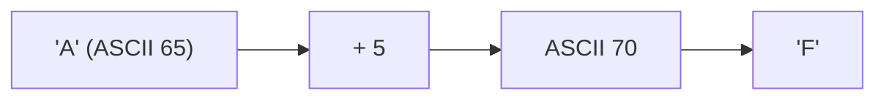

**📖 Cara Membaca Diagram:**
Karakter 'A' punya kode batin ASCII 65. Ditambah 5 langkah menjadi 70. Kode 70 adalah huruf 'F'.

---
### Soal 152 (Casting War)
```cpp
int i = 9;
int j = 2;
double res1 = i / j;
double res2 = (double)i / j;
```
**Pertanyaan:**
1. Berapakah isi `res1`?
2. Berapakah isi `res2`?
3. Kenapa hasil `res1` dan `res2` berbeda padahal rumusnya mirip?

**Jawaban & Diagnosis:**
1. **4.0**
2. **4.5**
3. **Pada `res1`, pembagian terjadi antar `int` sehingga koma dibantai duluan sebelum masuk double. Pada `res2`, `i` dipaksa jadi `double` dulu, sehingga koma selamat.**

**Mermaid Flowchart:**


**📖 Cara Membaca Diagram:**
i=9, j=2. `res1`: 9/2 (int) = 4. Masuk double jadi 4.0. `res2`: (double)9 = 9.0. 9.0/2 = 4.5.

---
### Soal 153 (Integer Division)
```cpp
int a = 14;
int b = 8;
int c = 5;
int res1 = a / b;
int res2 = res1 / c;
```
**Pertanyaan:**
1. Berapakah nilai `res1`?
2. Berapakah nilai `res2`?
3. Mengapa `res1` tidak menghasilkan angka desimal?

**Jawaban & Diagnosis:**
1. **1**
2. **0**
3. **Karena tipe datanya `int`, setiap ada koma di belakangnya langsung dipangkas habis (Integer Division).**

**Mermaid Flowchart:**
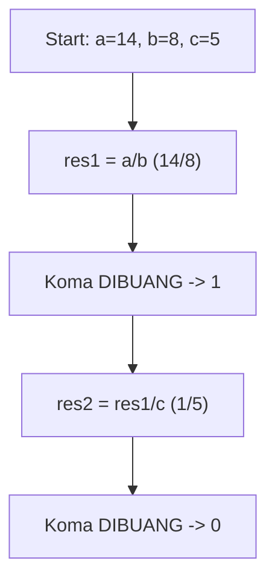

**📖 Cara Membaca Diagram:**
Mulai: a=14, b=8, c=5. Di baris `res1 = a / b`, 14/8 = 1.75, tapi karena `int`, koma dibakar jadi 1. Lalu 1/5 = 0.20, dibakar lagi jadi 0.

---
### Soal 154 (Modulo Magic)
```cpp
int x = 34;
int m1 = 2;
int m2 = 5;
int res_x = x % m1;
int res_y = x % m2;
```
**Pertanyaan:**
1. Apakah `x` genap atau ganjil?
2. Berapakah sisa bagi `x % m2`?
3. Apa guna operator `%` dalam OSN-K?

**Jawaban & Diagnosis:**
1. **Genap**
2. **4**
3. **Untuk mencari sisa bagi (sisa kelereng) atau mendeteksi pola perulangan/genap-ganjil.**

**Mermaid Flowchart:**
```mermaid
graph TD
    A[x=34] --> Bx % 2 == 0?
    B -- Ya --> C[Genap]
    B -- Tidak --> D[Ganjil]
    A --> E["x % 5"]
    E --> F["Sisa: 4"]
```

**📖 Cara Membaca Diagram:**
x=34. Cek `x % 2`: 34%2 = 0. Jika 0 genap, jika 1 ganjil. Cek `x % 5`: 34/5 = 6 sisa 4.

---
### Soal 155 (Modulo Magic)
```cpp
int x = 84;
int m1 = 2;
int m2 = 5;
int res_x = x % m1;
int res_y = x % m2;
```
**Pertanyaan:**
1. Apakah `x` genap atau ganjil?
2. Berapakah sisa bagi `x % m2`?
3. Apa guna operator `%` dalam OSN-K?

**Jawaban & Diagnosis:**
1. **Genap**
2. **4**
3. **Untuk mencari sisa bagi (sisa kelereng) atau mendeteksi pola perulangan/genap-ganjil.**

**Mermaid Flowchart:**
```mermaid
graph TD
    A[x=84] --> Bx % 2 == 0?
    B -- Ya --> C[Genap]
    B -- Tidak --> D[Ganjil]
    A --> E["x % 5"]
    E --> F["Sisa: 4"]
```

**📖 Cara Membaca Diagram:**
x=84. Cek `x % 2`: 84%2 = 0. Jika 0 genap, jika 1 ganjil. Cek `x % 5`: 84/5 = 16 sisa 4.

---
### Soal 156 (ASCII Math)
```cpp
char c = 'D';
int jump = 5;
char result = c + jump;
```
**Pertanyaan:**
1. Berapakah nilai ASCII batin dari 'D'?
2. Karakter apa yang tersimpan dalam variabel `result`?
3. Jika `result` dicetak sebagai `int`, angka berapa yang muncul?

**Jawaban & Diagnosis:**
1. **68**
2. **I**
3. **73**

**Mermaid Flowchart:**
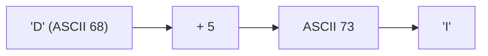

**📖 Cara Membaca Diagram:**
Karakter 'D' punya kode batin ASCII 68. Ditambah 5 langkah menjadi 73. Kode 73 adalah huruf 'I'.

---
### Soal 157 (Integer Division)
```cpp
int a = 22;
int b = 6;
int c = 6;
int res1 = a / b;
int res2 = res1 / c;
```
**Pertanyaan:**
1. Berapakah nilai `res1`?
2. Berapakah nilai `res2`?
3. Mengapa `res1` tidak menghasilkan angka desimal?

**Jawaban & Diagnosis:**
1. **3**
2. **0**
3. **Karena tipe datanya `int`, setiap ada koma di belakangnya langsung dipangkas habis (Integer Division).**

**Mermaid Flowchart:**
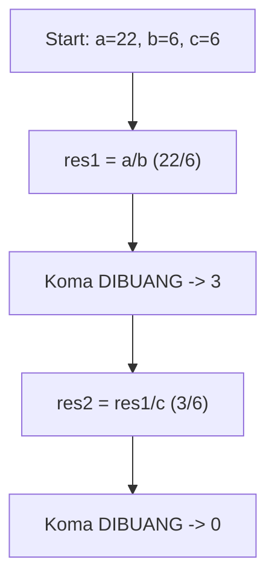

**📖 Cara Membaca Diagram:**
Mulai: a=22, b=6, c=6. Di baris `res1 = a / b`, 22/6 = 3.67, tapi karena `int`, koma dibakar jadi 3. Lalu 3/6 = 0.50, dibakar lagi jadi 0.

---
### Soal 158 (Casting War)
```cpp
int i = 9;
int j = 2;
double res1 = i / j;
double res2 = (double)i / j;
```
**Pertanyaan:**
1. Berapakah isi `res1`?
2. Berapakah isi `res2`?
3. Kenapa hasil `res1` dan `res2` berbeda padahal rumusnya mirip?

**Jawaban & Diagnosis:**
1. **4.0**
2. **4.5**
3. **Pada `res1`, pembagian terjadi antar `int` sehingga koma dibantai duluan sebelum masuk double. Pada `res2`, `i` dipaksa jadi `double` dulu, sehingga koma selamat.**

**Mermaid Flowchart:**


**📖 Cara Membaca Diagram:**
i=9, j=2. `res1`: 9/2 (int) = 4. Masuk double jadi 4.0. `res2`: (double)9 = 9.0. 9.0/2 = 4.5.

---
### Soal 159 (ASCII Math)
```cpp
char c = 'B';
int jump = 3;
char result = c + jump;
```
**Pertanyaan:**
1. Berapakah nilai ASCII batin dari 'B'?
2. Karakter apa yang tersimpan dalam variabel `result`?
3. Jika `result` dicetak sebagai `int`, angka berapa yang muncul?

**Jawaban & Diagnosis:**
1. **66**
2. **E**
3. **69**

**Mermaid Flowchart:**
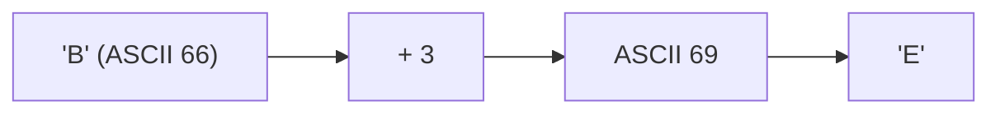

**📖 Cara Membaca Diagram:**
Karakter 'B' punya kode batin ASCII 66. Ditambah 3 langkah menjadi 69. Kode 69 adalah huruf 'E'.

---
### Soal 160 (Casting War)
```cpp
int i = 7;
int j = 2;
double res1 = i / j;
double res2 = (double)i / j;
```
**Pertanyaan:**
1. Berapakah isi `res1`?
2. Berapakah isi `res2`?
3. Kenapa hasil `res1` dan `res2` berbeda padahal rumusnya mirip?

**Jawaban & Diagnosis:**
1. **3.0**
2. **3.5**
3. **Pada `res1`, pembagian terjadi antar `int` sehingga koma dibantai duluan sebelum masuk double. Pada `res2`, `i` dipaksa jadi `double` dulu, sehingga koma selamat.**

**Mermaid Flowchart:**
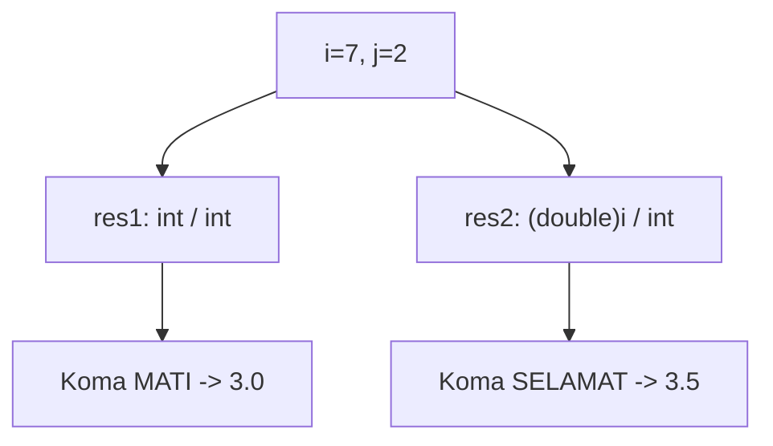

**📖 Cara Membaca Diagram:**
i=7, j=2. `res1`: 7/2 (int) = 3. Masuk double jadi 3.0. `res2`: (double)7 = 7.0. 7.0/2 = 3.5.

---
### Soal 161 (ASCII Math)
```cpp
char c = 'B';
int jump = 1;
char result = c + jump;
```
**Pertanyaan:**
1. Berapakah nilai ASCII batin dari 'B'?
2. Karakter apa yang tersimpan dalam variabel `result`?
3. Jika `result` dicetak sebagai `int`, angka berapa yang muncul?

**Jawaban & Diagnosis:**
1. **66**
2. **C**
3. **67**

**Mermaid Flowchart:**
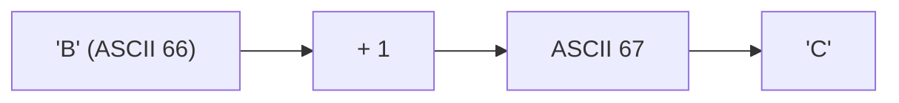

**📖 Cara Membaca Diagram:**
Karakter 'B' punya kode batin ASCII 66. Ditambah 1 langkah menjadi 67. Kode 67 adalah huruf 'C'.

---
### Soal 162 (Casting War)
```cpp
int i = 10;
int j = 2;
double res1 = i / j;
double res2 = (double)i / j;
```
**Pertanyaan:**
1. Berapakah isi `res1`?
2. Berapakah isi `res2`?
3. Kenapa hasil `res1` dan `res2` berbeda padahal rumusnya mirip?

**Jawaban & Diagnosis:**
1. **5.0**
2. **5.0**
3. **Pada `res1`, pembagian terjadi antar `int` sehingga koma dibantai duluan sebelum masuk double. Pada `res2`, `i` dipaksa jadi `double` dulu, sehingga koma selamat.**

**Mermaid Flowchart:**


**📖 Cara Membaca Diagram:**
i=10, j=2. `res1`: 10/2 (int) = 5. Masuk double jadi 5.0. `res2`: (double)10 = 10.0. 10.0/2 = 5.0.

---
### Soal 163 (Integer Division)
```cpp
int a = 23;
int b = 9;
int c = 3;
int res1 = a / b;
int res2 = res1 / c;
```
**Pertanyaan:**
1. Berapakah nilai `res1`?
2. Berapakah nilai `res2`?
3. Mengapa `res1` tidak menghasilkan angka desimal?

**Jawaban & Diagnosis:**
1. **2**
2. **0**
3. **Karena tipe datanya `int`, setiap ada koma di belakangnya langsung dipangkas habis (Integer Division).**

**Mermaid Flowchart:**


**📖 Cara Membaca Diagram:**
Mulai: a=23, b=9, c=3. Di baris `res1 = a / b`, 23/9 = 2.56, tapi karena `int`, koma dibakar jadi 2. Lalu 2/3 = 0.67, dibakar lagi jadi 0.

---
### Soal 164 (ASCII Math)
```cpp
char c = 'A';
int jump = 3;
char result = c + jump;
```
**Pertanyaan:**
1. Berapakah nilai ASCII batin dari 'A'?
2. Karakter apa yang tersimpan dalam variabel `result`?
3. Jika `result` dicetak sebagai `int`, angka berapa yang muncul?

**Jawaban & Diagnosis:**
1. **65**
2. **D**
3. **68**

**Mermaid Flowchart:**
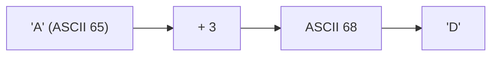

**📖 Cara Membaca Diagram:**
Karakter 'A' punya kode batin ASCII 65. Ditambah 3 langkah menjadi 68. Kode 68 adalah huruf 'D'.

---
### Soal 165 (Modulo Magic)
```cpp
int x = 23;
int m1 = 2;
int m2 = 5;
int res_x = x % m1;
int res_y = x % m2;
```
**Pertanyaan:**
1. Apakah `x` genap atau ganjil?
2. Berapakah sisa bagi `x % m2`?
3. Apa guna operator `%` dalam OSN-K?

**Jawaban & Diagnosis:**
1. **Ganjil**
2. **3**
3. **Untuk mencari sisa bagi (sisa kelereng) atau mendeteksi pola perulangan/genap-ganjil.**

**Mermaid Flowchart:**
```mermaid
graph TD
    A[x=23] --> Bx % 2 == 0?
    B -- Ya --> C[Genap]
    B -- Tidak --> D[Ganjil]
    A --> E["x % 5"]
    E --> F["Sisa: 3"]
```

**📖 Cara Membaca Diagram:**
x=23. Cek `x % 2`: 23%2 = 1. Jika 0 genap, jika 1 ganjil. Cek `x % 5`: 23/5 = 4 sisa 3.

---
### Soal 166 (Integer Division)
```cpp
int a = 46;
int b = 8;
int c = 5;
int res1 = a / b;
int res2 = res1 / c;
```
**Pertanyaan:**
1. Berapakah nilai `res1`?
2. Berapakah nilai `res2`?
3. Mengapa `res1` tidak menghasilkan angka desimal?

**Jawaban & Diagnosis:**
1. **5**
2. **1**
3. **Karena tipe datanya `int`, setiap ada koma di belakangnya langsung dipangkas habis (Integer Division).**

**Mermaid Flowchart:**
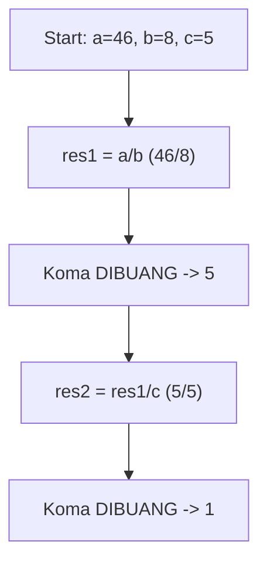

**📖 Cara Membaca Diagram:**
Mulai: a=46, b=8, c=5. Di baris `res1 = a / b`, 46/8 = 5.75, tapi karena `int`, koma dibakar jadi 5. Lalu 5/5 = 1.00, dibakar lagi jadi 1.

---
### Soal 167 (ASCII Math)
```cpp
char c = 'E';
int jump = 4;
char result = c + jump;
```
**Pertanyaan:**
1. Berapakah nilai ASCII batin dari 'E'?
2. Karakter apa yang tersimpan dalam variabel `result`?
3. Jika `result` dicetak sebagai `int`, angka berapa yang muncul?

**Jawaban & Diagnosis:**
1. **69**
2. **I**
3. **73**

**Mermaid Flowchart:**
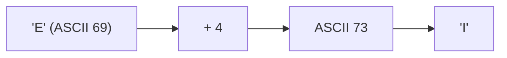

**📖 Cara Membaca Diagram:**
Karakter 'E' punya kode batin ASCII 69. Ditambah 4 langkah menjadi 73. Kode 73 adalah huruf 'I'.

---
### Soal 168 (Modulo Magic)
```cpp
int x = 84;
int m1 = 2;
int m2 = 5;
int res_x = x % m1;
int res_y = x % m2;
```
**Pertanyaan:**
1. Apakah `x` genap atau ganjil?
2. Berapakah sisa bagi `x % m2`?
3. Apa guna operator `%` dalam OSN-K?

**Jawaban & Diagnosis:**
1. **Genap**
2. **4**
3. **Untuk mencari sisa bagi (sisa kelereng) atau mendeteksi pola perulangan/genap-ganjil.**

**Mermaid Flowchart:**
```mermaid
graph TD
    A[x=84] --> Bx % 2 == 0?
    B -- Ya --> C[Genap]
    B -- Tidak --> D[Ganjil]
    A --> E["x % 5"]
    E --> F["Sisa: 4"]
```

**📖 Cara Membaca Diagram:**
x=84. Cek `x % 2`: 84%2 = 0. Jika 0 genap, jika 1 ganjil. Cek `x % 5`: 84/5 = 16 sisa 4.

---
### Soal 169 (ASCII Math)
```cpp
char c = 'B';
int jump = 3;
char result = c + jump;
```
**Pertanyaan:**
1. Berapakah nilai ASCII batin dari 'B'?
2. Karakter apa yang tersimpan dalam variabel `result`?
3. Jika `result` dicetak sebagai `int`, angka berapa yang muncul?

**Jawaban & Diagnosis:**
1. **66**
2. **E**
3. **69**

**Mermaid Flowchart:**


**📖 Cara Membaca Diagram:**
Karakter 'B' punya kode batin ASCII 66. Ditambah 3 langkah menjadi 69. Kode 69 adalah huruf 'E'.

---
### Soal 170 (Integer Division)
```cpp
int a = 22;
int b = 3;
int c = 3;
int res1 = a / b;
int res2 = res1 / c;
```
**Pertanyaan:**
1. Berapakah nilai `res1`?
2. Berapakah nilai `res2`?
3. Mengapa `res1` tidak menghasilkan angka desimal?

**Jawaban & Diagnosis:**
1. **7**
2. **2**
3. **Karena tipe datanya `int`, setiap ada koma di belakangnya langsung dipangkas habis (Integer Division).**

**Mermaid Flowchart:**
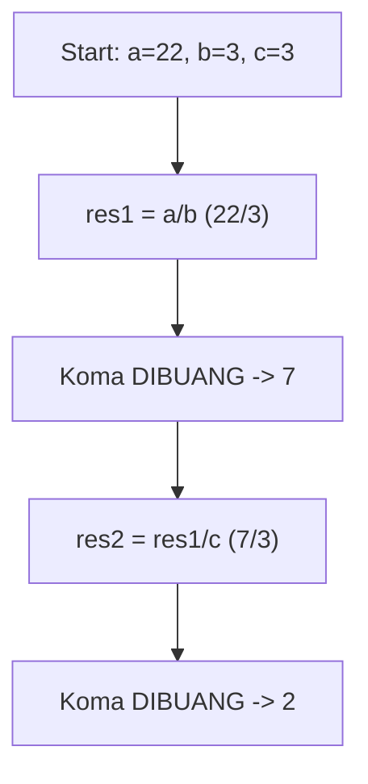

**📖 Cara Membaca Diagram:**
Mulai: a=22, b=3, c=3. Di baris `res1 = a / b`, 22/3 = 7.33, tapi karena `int`, koma dibakar jadi 7. Lalu 7/3 = 2.33, dibakar lagi jadi 2.

---
### Soal 171 (Modulo Magic)
```cpp
int x = 22;
int m1 = 2;
int m2 = 5;
int res_x = x % m1;
int res_y = x % m2;
```
**Pertanyaan:**
1. Apakah `x` genap atau ganjil?
2. Berapakah sisa bagi `x % m2`?
3. Apa guna operator `%` dalam OSN-K?

**Jawaban & Diagnosis:**
1. **Genap**
2. **2**
3. **Untuk mencari sisa bagi (sisa kelereng) atau mendeteksi pola perulangan/genap-ganjil.**

**Mermaid Flowchart:**
```mermaid
graph TD
    A[x=22] --> Bx % 2 == 0?
    B -- Ya --> C[Genap]
    B -- Tidak --> D[Ganjil]
    A --> E["x % 5"]
    E --> F["Sisa: 2"]
```

**📖 Cara Membaca Diagram:**
x=22. Cek `x % 2`: 22%2 = 0. Jika 0 genap, jika 1 ganjil. Cek `x % 5`: 22/5 = 4 sisa 2.

---
### Soal 172 (Casting War)
```cpp
int i = 10;
int j = 2;
double res1 = i / j;
double res2 = (double)i / j;
```
**Pertanyaan:**
1. Berapakah isi `res1`?
2. Berapakah isi `res2`?
3. Kenapa hasil `res1` dan `res2` berbeda padahal rumusnya mirip?

**Jawaban & Diagnosis:**
1. **5.0**
2. **5.0**
3. **Pada `res1`, pembagian terjadi antar `int` sehingga koma dibantai duluan sebelum masuk double. Pada `res2`, `i` dipaksa jadi `double` dulu, sehingga koma selamat.**

**Mermaid Flowchart:**
```mermaid
graph TD
    A["i=10, j=2"] --> B["res1: int / int"]
    B --> C["Koma MATI -> 5.0"]
    A --> D["res2: (double)i / int"]
    D --> E["Koma SELAMAT -> 5.0"]
```

**📖 Cara Membaca Diagram:**
i=10, j=2. `res1`: 10/2 (int) = 5. Masuk double jadi 5.0. `res2`: (double)10 = 10.0. 10.0/2 = 5.0.

---
### Soal 173 (ASCII Math)
```cpp
char c = 'D';
int jump = 2;
char result = c + jump;
```
**Pertanyaan:**
1. Berapakah nilai ASCII batin dari 'D'?
2. Karakter apa yang tersimpan dalam variabel `result`?
3. Jika `result` dicetak sebagai `int`, angka berapa yang muncul?

**Jawaban & Diagnosis:**
1. **68**
2. **F**
3. **70**

**Mermaid Flowchart:**
```mermaid
graph LR
    A["'D' (ASCII 68)"] --> B["+ 2"]
    B --> C["ASCII 70"]
    C --> D["'F'"]
```

**📖 Cara Membaca Diagram:**
Karakter 'D' punya kode batin ASCII 68. Ditambah 2 langkah menjadi 70. Kode 70 adalah huruf 'F'.

---
### Soal 174 (Integer Division)
```cpp
int a = 42;
int b = 8;
int c = 3;
int res1 = a / b;
int res2 = res1 / c;
```
**Pertanyaan:**
1. Berapakah nilai `res1`?
2. Berapakah nilai `res2`?
3. Mengapa `res1` tidak menghasilkan angka desimal?

**Jawaban & Diagnosis:**
1. **5**
2. **1**
3. **Karena tipe datanya `int`, setiap ada koma di belakangnya langsung dipangkas habis (Integer Division).**

**Mermaid Flowchart:**
```mermaid
graph TD
    A[Start: a=42, b=8, c=3] --> B["res1 = a/b (42/8)"]
    B --> C["Koma DIBUANG -> 5"]
    C --> D["res2 = res1/c (5/3)"]
    D --> E["Koma DIBUANG -> 1"]
```

**📖 Cara Membaca Diagram:**
Mulai: a=42, b=8, c=3. Di baris `res1 = a / b`, 42/8 = 5.25, tapi karena `int`, koma dibakar jadi 5. Lalu 5/3 = 1.67, dibakar lagi jadi 1.

---
### Soal 175 (ASCII Math)
```cpp
char c = 'C';
int jump = 1;
char result = c + jump;
```
**Pertanyaan:**
1. Berapakah nilai ASCII batin dari 'C'?
2. Karakter apa yang tersimpan dalam variabel `result`?
3. Jika `result` dicetak sebagai `int`, angka berapa yang muncul?

**Jawaban & Diagnosis:**
1. **67**
2. **D**
3. **68**

**Mermaid Flowchart:**
```mermaid
graph LR
    A["'C' (ASCII 67)"] --> B["+ 1"]
    B --> C["ASCII 68"]
    C --> D["'D'"]
```

**📖 Cara Membaca Diagram:**
Karakter 'C' punya kode batin ASCII 67. Ditambah 1 langkah menjadi 68. Kode 68 adalah huruf 'D'.

---
