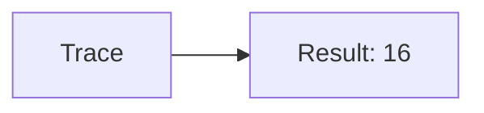
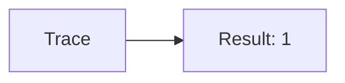
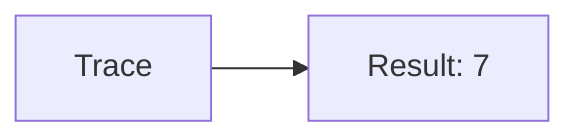
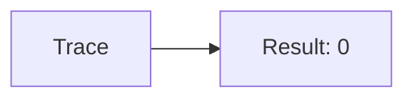
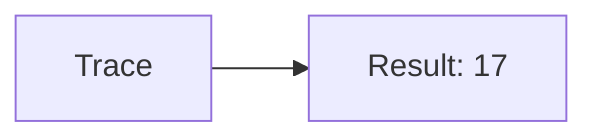
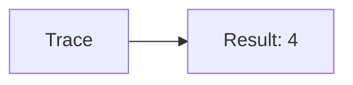
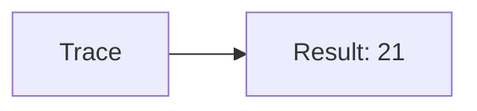
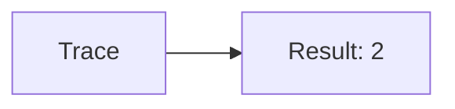
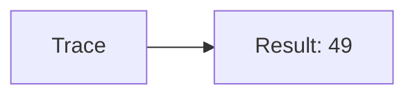

🔙 **[Kembali ke Daftar Soal](./README.md)**

---

# Latihan Soal Part C - Modul 01 - Set 07

### Soal 151
```cpp
// Semen: Casting
double val = 50.81;
int res = (int)val;
```
**Pertanyaan:**
1. Berapakah hasil akhirnya?
2. Deskripsikan alur pikir 'Compiler Manusia' untuk soal ini!

**Jawaban & Diagnosis:**
1. **50**
2. Mengubah 50.81 jadi integer (pangkas koma) jadi 50.

**Mermaid Flowchart:**


---
### Soal 152
```cpp
// Besi: Pembagian
int besi = 64, bagi = 4;
int hasil = besi / bagi;
```
**Pertanyaan:**
1. Berapakah hasil akhirnya?
2. Deskripsikan alur pikir 'Compiler Manusia' untuk soal ini!

**Jawaban & Diagnosis:**
1. **16**
2. Membagi 64 Besi ke 4 bagian. Hasil bulat: 16.

**Mermaid Flowchart:**


---
### Soal 153
```cpp
// Kayu: Modulo
int kayu = 89, bagi = 8;
int sisa = kayu % bagi;
```
**Pertanyaan:**
1. Berapakah hasil akhirnya?
2. Deskripsikan alur pikir 'Compiler Manusia' untuk soal ini!

**Jawaban & Diagnosis:**
1. **1**
2. 89 Kayu dibagi 8 sisa 1.

**Mermaid Flowchart:**


---
### Soal 154
```cpp
// Paku: Casting
double val = 60.51;
int res = (int)val;
```
**Pertanyaan:**
1. Berapakah hasil akhirnya?
2. Deskripsikan alur pikir 'Compiler Manusia' untuk soal ini!

**Jawaban & Diagnosis:**
1. **60**
2. Mengubah 60.51 jadi integer (pangkas koma) jadi 60.

**Mermaid Flowchart:**


---
### Soal 155
```cpp
// Cat: Pembagian
int cat = 18, bagi = 6;
int hasil = cat / bagi;
```
**Pertanyaan:**
1. Berapakah hasil akhirnya?
2. Deskripsikan alur pikir 'Compiler Manusia' untuk soal ini!

**Jawaban & Diagnosis:**
1. **3**
2. Membagi 18 Cat ke 6 bagian. Hasil bulat: 3.

**Mermaid Flowchart:**


---
### Soal 156
```cpp
// Kuas: Modulo
int kuas = 35, bagi = 2;
int sisa = kuas % bagi;
```
**Pertanyaan:**
1. Berapakah hasil akhirnya?
2. Deskripsikan alur pikir 'Compiler Manusia' untuk soal ini!

**Jawaban & Diagnosis:**
1. **1**
2. 35 Kuas dibagi 2 sisa 1.

**Mermaid Flowchart:**


---
### Soal 157
```cpp
// Tang: Casting
double val = 78.61;
int res = (int)val;
```
**Pertanyaan:**
1. Berapakah hasil akhirnya?
2. Deskripsikan alur pikir 'Compiler Manusia' untuk soal ini!

**Jawaban & Diagnosis:**
1. **78**
2. Mengubah 78.61 jadi integer (pangkas koma) jadi 78.

**Mermaid Flowchart:**


---
### Soal 158
```cpp
// Obeng: Pembagian
int obeng = 15, bagi = 2;
int hasil = obeng / bagi;
```
**Pertanyaan:**
1. Berapakah hasil akhirnya?
2. Deskripsikan alur pikir 'Compiler Manusia' untuk soal ini!

**Jawaban & Diagnosis:**
1. **7**
2. Membagi 15 Obeng ke 2 bagian. Hasil bulat: 7.

**Mermaid Flowchart:**


---
### Soal 159
```cpp
// Palu: Modulo
int palu = 32, bagi = 4;
int sisa = palu % bagi;
```
**Pertanyaan:**
1. Berapakah hasil akhirnya?
2. Deskripsikan alur pikir 'Compiler Manusia' untuk soal ini!

**Jawaban & Diagnosis:**
1. **0**
2. 32 Palu dibagi 4 sisa 0.

**Mermaid Flowchart:**


---
### Soal 160
```cpp
// Gergaji: Casting
double val = 71.71;
int res = (int)val;
```
**Pertanyaan:**
1. Berapakah hasil akhirnya?
2. Deskripsikan alur pikir 'Compiler Manusia' untuk soal ini!

**Jawaban & Diagnosis:**
1. **71**
2. Mengubah 71.71 jadi integer (pangkas koma) jadi 71.

**Mermaid Flowchart:**


---
### Soal 161
```cpp
// Bor: Pembagian
int bor = 71, bagi = 4;
int hasil = bor / bagi;
```
**Pertanyaan:**
1. Berapakah hasil akhirnya?
2. Deskripsikan alur pikir 'Compiler Manusia' untuk soal ini!

**Jawaban & Diagnosis:**
1. **17**
2. Membagi 71 Bor ke 4 bagian. Hasil bulat: 17.

**Mermaid Flowchart:**


---
### Soal 162
```cpp
// Baut: Modulo
int baut = 34, bagi = 7;
int sisa = baut % bagi;
```
**Pertanyaan:**
1. Berapakah hasil akhirnya?
2. Deskripsikan alur pikir 'Compiler Manusia' untuk soal ini!

**Jawaban & Diagnosis:**
1. **6**
2. 34 Baut dibagi 7 sisa 6.

**Mermaid Flowchart:**


---
### Soal 163
```cpp
// Sekrup: Casting
double val = 28.51;
int res = (int)val;
```
**Pertanyaan:**
1. Berapakah hasil akhirnya?
2. Deskripsikan alur pikir 'Compiler Manusia' untuk soal ini!

**Jawaban & Diagnosis:**
1. **28**
2. Mengubah 28.51 jadi integer (pangkas koma) jadi 28.

**Mermaid Flowchart:**


---
### Soal 164
```cpp
// KunciInggris: Pembagian
int kunciinggris = 25, bagi = 6;
int hasil = kunciinggris / bagi;
```
**Pertanyaan:**
1. Berapakah hasil akhirnya?
2. Deskripsikan alur pikir 'Compiler Manusia' untuk soal ini!

**Jawaban & Diagnosis:**
1. **4**
2. Membagi 25 KunciInggris ke 6 bagian. Hasil bulat: 4.

**Mermaid Flowchart:**


---
### Soal 165
```cpp
// Gembok: Modulo
int gembok = 57, bagi = 2;
int sisa = gembok % bagi;
```
**Pertanyaan:**
1. Berapakah hasil akhirnya?
2. Deskripsikan alur pikir 'Compiler Manusia' untuk soal ini!

**Jawaban & Diagnosis:**
1. **1**
2. 57 Gembok dibagi 2 sisa 1.

**Mermaid Flowchart:**


---
### Soal 166
```cpp
// Rantai: Casting
double val = 21.31;
int res = (int)val;
```
**Pertanyaan:**
1. Berapakah hasil akhirnya?
2. Deskripsikan alur pikir 'Compiler Manusia' untuk soal ini!

**Jawaban & Diagnosis:**
1. **21**
2. Mengubah 21.31 jadi integer (pangkas koma) jadi 21.

**Mermaid Flowchart:**


---
### Soal 167
```cpp
// Tali: Pembagian
int tali = 47, bagi = 5;
int hasil = tali / bagi;
```
**Pertanyaan:**
1. Berapakah hasil akhirnya?
2. Deskripsikan alur pikir 'Compiler Manusia' untuk soal ini!

**Jawaban & Diagnosis:**
1. **9**
2. Membagi 47 Tali ke 5 bagian. Hasil bulat: 9.

**Mermaid Flowchart:**


---
### Soal 168
```cpp
// Karet: Modulo
int karet = 62, bagi = 4;
int sisa = karet % bagi;
```
**Pertanyaan:**
1. Berapakah hasil akhirnya?
2. Deskripsikan alur pikir 'Compiler Manusia' untuk soal ini!

**Jawaban & Diagnosis:**
1. **2**
2. 62 Karet dibagi 4 sisa 2.

**Mermaid Flowchart:**


---
### Soal 169
```cpp
// Plastik: Casting
double val = 49.51;
int res = (int)val;
```
**Pertanyaan:**
1. Berapakah hasil akhirnya?
2. Deskripsikan alur pikir 'Compiler Manusia' untuk soal ini!

**Jawaban & Diagnosis:**
1. **49**
2. Mengubah 49.51 jadi integer (pangkas koma) jadi 49.

**Mermaid Flowchart:**


---
### Soal 170
```cpp
// Kertas: Pembagian
int kertas = 12, bagi = 4;
int hasil = kertas / bagi;
```
**Pertanyaan:**
1. Berapakah hasil akhirnya?
2. Deskripsikan alur pikir 'Compiler Manusia' untuk soal ini!

**Jawaban & Diagnosis:**
1. **3**
2. Membagi 12 Kertas ke 4 bagian. Hasil bulat: 3.

**Mermaid Flowchart:**


---
### Soal 171
```cpp
// Kardus: Modulo
int kardus = 95, bagi = 2;
int sisa = kardus % bagi;
```
**Pertanyaan:**
1. Berapakah hasil akhirnya?
2. Deskripsikan alur pikir 'Compiler Manusia' untuk soal ini!

**Jawaban & Diagnosis:**
1. **1**
2. 95 Kardus dibagi 2 sisa 1.

**Mermaid Flowchart:**
```mermaid
graph LR
A[Trace] --> B[Result: 1]
```

---
### Soal 172
```cpp
// Plastik: Casting
double val = 12.31;
int res = (int)val;
```
**Pertanyaan:**
1. Berapakah hasil akhirnya?
2. Deskripsikan alur pikir 'Compiler Manusia' untuk soal ini!

**Jawaban & Diagnosis:**
1. **12**
2. Mengubah 12.31 jadi integer (pangkas koma) jadi 12.

**Mermaid Flowchart:**
```mermaid
graph LR
A[Trace] --> B[Result: 12]
```

---
### Soal 173
```cpp
// Kaca: Pembagian
int kaca = 14, bagi = 8;
int hasil = kaca / bagi;
```
**Pertanyaan:**
1. Berapakah hasil akhirnya?
2. Deskripsikan alur pikir 'Compiler Manusia' untuk soal ini!

**Jawaban & Diagnosis:**
1. **1**
2. Membagi 14 Kaca ke 8 bagian. Hasil bulat: 1.

**Mermaid Flowchart:**
```mermaid
graph LR
A[Trace] --> B[Result: 1]
```

---
### Soal 174
```cpp
// Logam: Modulo
int logam = 84, bagi = 4;
int sisa = logam % bagi;
```
**Pertanyaan:**
1. Berapakah hasil akhirnya?
2. Deskripsikan alur pikir 'Compiler Manusia' untuk soal ini!

**Jawaban & Diagnosis:**
1. **0**
2. 84 Logam dibagi 4 sisa 0.

**Mermaid Flowchart:**
```mermaid
graph LR
A[Trace] --> B[Result: 0]
```

---
### Soal 175
```cpp
// Kain: Casting
double val = 72.21;
int res = (int)val;
```
**Pertanyaan:**
1. Berapakah hasil akhirnya?
2. Deskripsikan alur pikir 'Compiler Manusia' untuk soal ini!

**Jawaban & Diagnosis:**
1. **72**
2. Mengubah 72.21 jadi integer (pangkas koma) jadi 72.

**Mermaid Flowchart:**
```mermaid
graph LR
A[Trace] --> B[Result: 72]
```

---
