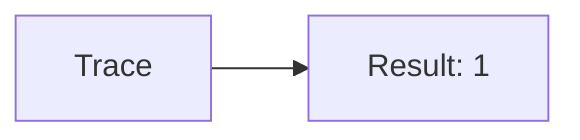
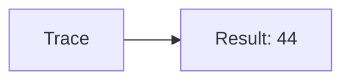
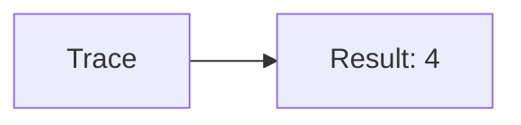
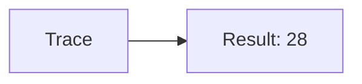
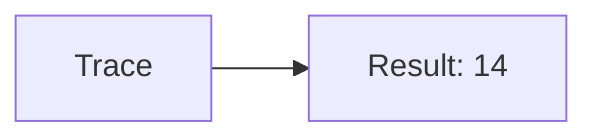
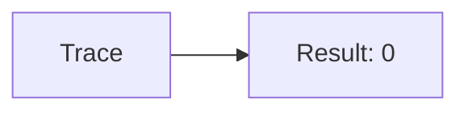
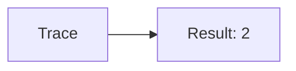
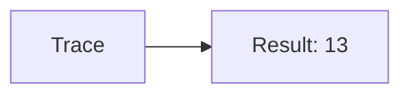
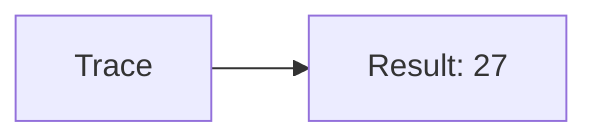

🔙 **[Kembali ke Daftar Soal](./README.md)**

---

# Latihan Soal Part C - Modul 01 - Set 08

### Soal 176
```cpp
// Benang: Pembagian
int benang = 81, bagi = 2;
int hasil = benang / bagi;
```
**Pertanyaan:**
1. Berapakah hasil akhirnya?
2. Deskripsikan alur pikir 'Compiler Manusia' untuk soal ini!

**Jawaban & Diagnosis:**
1. **40**
2. Membagi 81 Benang ke 2 bagian. Hasil bulat: 40.

**Mermaid Flowchart:**


---
### Soal 177
```cpp
// Jarum: Modulo
int jarum = 46, bagi = 5;
int sisa = jarum % bagi;
```
**Pertanyaan:**
1. Berapakah hasil akhirnya?
2. Deskripsikan alur pikir 'Compiler Manusia' untuk soal ini!

**Jawaban & Diagnosis:**
1. **1**
2. 46 Jarum dibagi 5 sisa 1.

**Mermaid Flowchart:**


---
### Soal 178
```cpp
// Gunting: Casting
double val = 44.81;
int res = (int)val;
```
**Pertanyaan:**
1. Berapakah hasil akhirnya?
2. Deskripsikan alur pikir 'Compiler Manusia' untuk soal ini!

**Jawaban & Diagnosis:**
1. **44**
2. Mengubah 44.81 jadi integer (pangkas koma) jadi 44.

**Mermaid Flowchart:**


---
### Soal 179
```cpp
// Lem: Pembagian
int lem = 79, bagi = 4;
int hasil = lem / bagi;
```
**Pertanyaan:**
1. Berapakah hasil akhirnya?
2. Deskripsikan alur pikir 'Compiler Manusia' untuk soal ini!

**Jawaban & Diagnosis:**
1. **19**
2. Membagi 79 Lem ke 4 bagian. Hasil bulat: 19.

**Mermaid Flowchart:**


---
### Soal 180
```cpp
// Isolasi: Modulo
int isolasi = 94, bagi = 5;
int sisa = isolasi % bagi;
```
**Pertanyaan:**
1. Berapakah hasil akhirnya?
2. Deskripsikan alur pikir 'Compiler Manusia' untuk soal ini!

**Jawaban & Diagnosis:**
1. **4**
2. 94 Isolasi dibagi 5 sisa 4.

**Mermaid Flowchart:**


---
### Soal 181
```cpp
// Lakban: Casting
double val = 28.81;
int res = (int)val;
```
**Pertanyaan:**
1. Berapakah hasil akhirnya?
2. Deskripsikan alur pikir 'Compiler Manusia' untuk soal ini!

**Jawaban & Diagnosis:**
1. **28**
2. Mengubah 28.81 jadi integer (pangkas koma) jadi 28.

**Mermaid Flowchart:**


---
### Soal 182
```cpp
// Tipex: Pembagian
int tipex = 71, bagi = 5;
int hasil = tipex / bagi;
```
**Pertanyaan:**
1. Berapakah hasil akhirnya?
2. Deskripsikan alur pikir 'Compiler Manusia' untuk soal ini!

**Jawaban & Diagnosis:**
1. **14**
2. Membagi 71 Tipex ke 5 bagian. Hasil bulat: 14.

**Mermaid Flowchart:**


---
### Soal 183
```cpp
// Stabilo: Modulo
int stabilo = 32, bagi = 2;
int sisa = stabilo % bagi;
```
**Pertanyaan:**
1. Berapakah hasil akhirnya?
2. Deskripsikan alur pikir 'Compiler Manusia' untuk soal ini!

**Jawaban & Diagnosis:**
1. **0**
2. 32 Stabilo dibagi 2 sisa 0.

**Mermaid Flowchart:**


---
### Soal 184
```cpp
// Spidol: Casting
double val = 46.81;
int res = (int)val;
```
**Pertanyaan:**
1. Berapakah hasil akhirnya?
2. Deskripsikan alur pikir 'Compiler Manusia' untuk soal ini!

**Jawaban & Diagnosis:**
1. **46**
2. Mengubah 46.81 jadi integer (pangkas koma) jadi 46.

**Mermaid Flowchart:**


---
### Soal 185
```cpp
// Crayon: Pembagian
int crayon = 19, bagi = 4;
int hasil = crayon / bagi;
```
**Pertanyaan:**
1. Berapakah hasil akhirnya?
2. Deskripsikan alur pikir 'Compiler Manusia' untuk soal ini!

**Jawaban & Diagnosis:**
1. **4**
2. Membagi 19 Crayon ke 4 bagian. Hasil bulat: 4.

**Mermaid Flowchart:**


---
### Soal 186
```cpp
// CatAir: Modulo
int catair = 77, bagi = 4;
int sisa = catair % bagi;
```
**Pertanyaan:**
1. Berapakah hasil akhirnya?
2. Deskripsikan alur pikir 'Compiler Manusia' untuk soal ini!

**Jawaban & Diagnosis:**
1. **1**
2. 77 CatAir dibagi 4 sisa 1.

**Mermaid Flowchart:**


---
### Soal 187
```cpp
// Kuas: Casting
double val = 36.61;
int res = (int)val;
```
**Pertanyaan:**
1. Berapakah hasil akhirnya?
2. Deskripsikan alur pikir 'Compiler Manusia' untuk soal ini!

**Jawaban & Diagnosis:**
1. **36**
2. Mengubah 36.61 jadi integer (pangkas koma) jadi 36.

**Mermaid Flowchart:**


---
### Soal 188
```cpp
// Kanvas: Pembagian
int kanvas = 56, bagi = 6;
int hasil = kanvas / bagi;
```
**Pertanyaan:**
1. Berapakah hasil akhirnya?
2. Deskripsikan alur pikir 'Compiler Manusia' untuk soal ini!

**Jawaban & Diagnosis:**
1. **9**
2. Membagi 56 Kanvas ke 6 bagian. Hasil bulat: 9.

**Mermaid Flowchart:**


---
### Soal 189
```cpp
// Palet: Modulo
int palet = 86, bagi = 4;
int sisa = palet % bagi;
```
**Pertanyaan:**
1. Berapakah hasil akhirnya?
2. Deskripsikan alur pikir 'Compiler Manusia' untuk soal ini!

**Jawaban & Diagnosis:**
1. **2**
2. 86 Palet dibagi 4 sisa 2.

**Mermaid Flowchart:**


---
### Soal 190
```cpp
// Easel: Casting
double val = 61.71;
int res = (int)val;
```
**Pertanyaan:**
1. Berapakah hasil akhirnya?
2. Deskripsikan alur pikir 'Compiler Manusia' untuk soal ini!

**Jawaban & Diagnosis:**
1. **61**
2. Mengubah 61.71 jadi integer (pangkas koma) jadi 61.

**Mermaid Flowchart:**


---
### Soal 191
```cpp
// Patung: Pembagian
int patung = 81, bagi = 6;
int hasil = patung / bagi;
```
**Pertanyaan:**
1. Berapakah hasil akhirnya?
2. Deskripsikan alur pikir 'Compiler Manusia' untuk soal ini!

**Jawaban & Diagnosis:**
1. **13**
2. Membagi 81 Patung ke 6 bagian. Hasil bulat: 13.

**Mermaid Flowchart:**


---
### Soal 192
```cpp
// Ukiran: Modulo
int ukiran = 14, bagi = 3;
int sisa = ukiran % bagi;
```
**Pertanyaan:**
1. Berapakah hasil akhirnya?
2. Deskripsikan alur pikir 'Compiler Manusia' untuk soal ini!

**Jawaban & Diagnosis:**
1. **2**
2. 14 Ukiran dibagi 3 sisa 2.

**Mermaid Flowchart:**


---
### Soal 193
```cpp
// Lukisan: Casting
double val = 27.31;
int res = (int)val;
```
**Pertanyaan:**
1. Berapakah hasil akhirnya?
2. Deskripsikan alur pikir 'Compiler Manusia' untuk soal ini!

**Jawaban & Diagnosis:**
1. **27**
2. Mengubah 27.31 jadi integer (pangkas koma) jadi 27.

**Mermaid Flowchart:**


---
### Soal 194
```cpp
// Foto: Pembagian
int foto = 33, bagi = 6;
int hasil = foto / bagi;
```
**Pertanyaan:**
1. Berapakah hasil akhirnya?
2. Deskripsikan alur pikir 'Compiler Manusia' untuk soal ini!

**Jawaban & Diagnosis:**
1. **5**
2. Membagi 33 Foto ke 6 bagian. Hasil bulat: 5.

**Mermaid Flowchart:**


---
### Soal 195
```cpp
// Bingkai: Modulo
int bingkai = 65, bagi = 6;
int sisa = bingkai % bagi;
```
**Pertanyaan:**
1. Berapakah hasil akhirnya?
2. Deskripsikan alur pikir 'Compiler Manusia' untuk soal ini!

**Jawaban & Diagnosis:**
1. **5**
2. 65 Bingkai dibagi 6 sisa 5.

**Mermaid Flowchart:**


---
### Soal 196
```cpp
// Album: Casting
double val = 91.61;
int res = (int)val;
```
**Pertanyaan:**
1. Berapakah hasil akhirnya?
2. Deskripsikan alur pikir 'Compiler Manusia' untuk soal ini!

**Jawaban & Diagnosis:**
1. **91**
2. Mengubah 91.61 jadi integer (pangkas koma) jadi 91.

**Mermaid Flowchart:**
```mermaid
graph LR
A[Trace] --> B[Result: 91]
```

---
### Soal 197
```cpp
// Kaset: Pembagian
int kaset = 33, bagi = 3;
int hasil = kaset / bagi;
```
**Pertanyaan:**
1. Berapakah hasil akhirnya?
2. Deskripsikan alur pikir 'Compiler Manusia' untuk soal ini!

**Jawaban & Diagnosis:**
1. **11**
2. Membagi 33 Kaset ke 3 bagian. Hasil bulat: 11.

**Mermaid Flowchart:**
```mermaid
graph LR
A[Trace] --> B[Result: 11]
```

---
### Soal 198
```cpp
// CD: Modulo
int cd = 18, bagi = 4;
int sisa = cd % bagi;
```
**Pertanyaan:**
1. Berapakah hasil akhirnya?
2. Deskripsikan alur pikir 'Compiler Manusia' untuk soal ini!

**Jawaban & Diagnosis:**
1. **2**
2. 18 CD dibagi 4 sisa 2.

**Mermaid Flowchart:**
```mermaid
graph LR
A[Trace] --> B[Result: 2]
```

---
### Soal 199
```cpp
// DVD: Casting
double val = 80.21;
int res = (int)val;
```
**Pertanyaan:**
1. Berapakah hasil akhirnya?
2. Deskripsikan alur pikir 'Compiler Manusia' untuk soal ini!

**Jawaban & Diagnosis:**
1. **80**
2. Mengubah 80.21 jadi integer (pangkas koma) jadi 80.

**Mermaid Flowchart:**
```mermaid
graph LR
A[Trace] --> B[Result: 80]
```

---
### Soal 200
```cpp
// VCD: Pembagian
int vcd = 43, bagi = 4;
int hasil = vcd / bagi;
```
**Pertanyaan:**
1. Berapakah hasil akhirnya?
2. Deskripsikan alur pikir 'Compiler Manusia' untuk soal ini!

**Jawaban & Diagnosis:**
1. **10**
2. Membagi 43 VCD ke 4 bagian. Hasil bulat: 10.

**Mermaid Flowchart:**
```mermaid
graph LR
A[Trace] --> B[Result: 10]
```

---
