# Latihan Soal Part C - Modul 01 - Set 08

### Soal 176 (ASCII Math)
```cpp
char c = 'B';
int jump = 1;
char result = c + jump;
```
**Pertanyaan:**
1. Berapakah nilai ASCII batin dari 'B'?
2. Karakter apa yang tersimpan dalam variabel `result`?
3. Jika `result` dicetak sebagai `int`, angka berapa yang muncul?

**Jawaban & Diagnosis:**
1. **66**
2. **C**
3. **67**

**Mermaid Flowchart:**
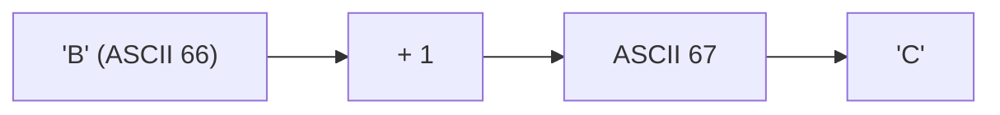

**📖 Cara Membaca Diagram:**
Karakter 'B' punya kode batin ASCII 66. Ditambah 1 langkah menjadi 67. Kode 67 adalah huruf 'C'.

---
### Soal 177 (ASCII Math)
```cpp
char c = 'B';
int jump = 5;
char result = c + jump;
```
**Pertanyaan:**
1. Berapakah nilai ASCII batin dari 'B'?
2. Karakter apa yang tersimpan dalam variabel `result`?
3. Jika `result` dicetak sebagai `int`, angka berapa yang muncul?

**Jawaban & Diagnosis:**
1. **66**
2. **G**
3. **71**

**Mermaid Flowchart:**
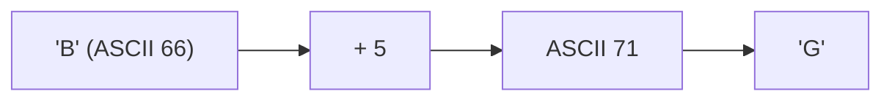

**📖 Cara Membaca Diagram:**
Karakter 'B' punya kode batin ASCII 66. Ditambah 5 langkah menjadi 71. Kode 71 adalah huruf 'G'.

---
### Soal 178 (ASCII Math)
```cpp
char c = 'A';
int jump = 1;
char result = c + jump;
```
**Pertanyaan:**
1. Berapakah nilai ASCII batin dari 'A'?
2. Karakter apa yang tersimpan dalam variabel `result`?
3. Jika `result` dicetak sebagai `int`, angka berapa yang muncul?

**Jawaban & Diagnosis:**
1. **65**
2. **B**
3. **66**

**Mermaid Flowchart:**
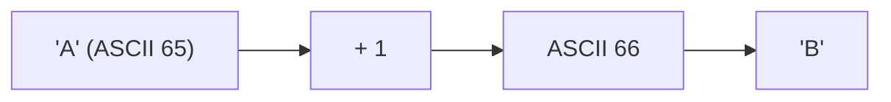

**📖 Cara Membaca Diagram:**
Karakter 'A' punya kode batin ASCII 65. Ditambah 1 langkah menjadi 66. Kode 66 adalah huruf 'B'.

---
### Soal 179 (Integer Division)
```cpp
int a = 35;
int b = 4;
int c = 2;
int res1 = a / b;
int res2 = res1 / c;
```
**Pertanyaan:**
1. Berapakah nilai `res1`?
2. Berapakah nilai `res2`?
3. Mengapa `res1` tidak menghasilkan angka desimal?

**Jawaban & Diagnosis:**
1. **8**
2. **4**
3. **Karena tipe datanya `int`, setiap ada koma di belakangnya langsung dipangkas habis (Integer Division).**

**Mermaid Flowchart:**
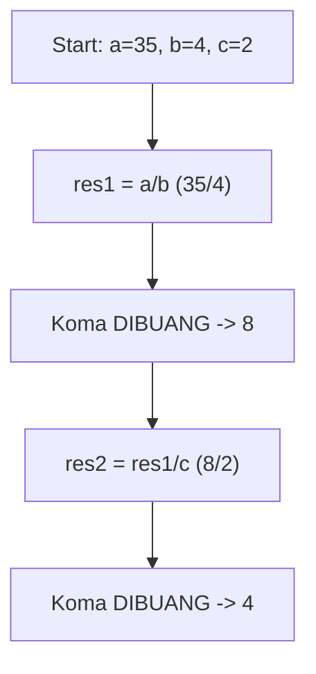

**📖 Cara Membaca Diagram:**
Mulai: a=35, b=4, c=2. Di baris `res1 = a / b`, 35/4 = 8.75, tapi karena `int`, koma dibakar jadi 8. Lalu 8/2 = 4.00, dibakar lagi jadi 4.

---
### Soal 180 (ASCII Math)
```cpp
char c = 'C';
int jump = 5;
char result = c + jump;
```
**Pertanyaan:**
1. Berapakah nilai ASCII batin dari 'C'?
2. Karakter apa yang tersimpan dalam variabel `result`?
3. Jika `result` dicetak sebagai `int`, angka berapa yang muncul?

**Jawaban & Diagnosis:**
1. **67**
2. **H**
3. **72**

**Mermaid Flowchart:**
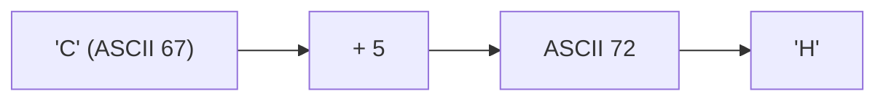

**📖 Cara Membaca Diagram:**
Karakter 'C' punya kode batin ASCII 67. Ditambah 5 langkah menjadi 72. Kode 72 adalah huruf 'H'.

---
### Soal 181 (Integer Division)
```cpp
int a = 29;
int b = 4;
int c = 3;
int res1 = a / b;
int res2 = res1 / c;
```
**Pertanyaan:**
1. Berapakah nilai `res1`?
2. Berapakah nilai `res2`?
3. Mengapa `res1` tidak menghasilkan angka desimal?

**Jawaban & Diagnosis:**
1. **7**
2. **2**
3. **Karena tipe datanya `int`, setiap ada koma di belakangnya langsung dipangkas habis (Integer Division).**

**Mermaid Flowchart:**
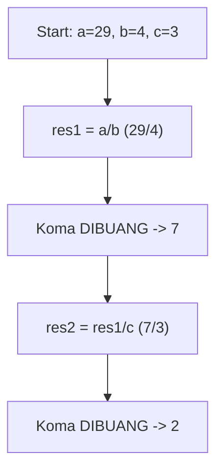

**📖 Cara Membaca Diagram:**
Mulai: a=29, b=4, c=3. Di baris `res1 = a / b`, 29/4 = 7.25, tapi karena `int`, koma dibakar jadi 7. Lalu 7/3 = 2.33, dibakar lagi jadi 2.

---
### Soal 182 (ASCII Math)
```cpp
char c = 'E';
int jump = 4;
char result = c + jump;
```
**Pertanyaan:**
1. Berapakah nilai ASCII batin dari 'E'?
2. Karakter apa yang tersimpan dalam variabel `result`?
3. Jika `result` dicetak sebagai `int`, angka berapa yang muncul?

**Jawaban & Diagnosis:**
1. **69**
2. **I**
3. **73**

**Mermaid Flowchart:**
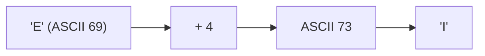

**📖 Cara Membaca Diagram:**
Karakter 'E' punya kode batin ASCII 69. Ditambah 4 langkah menjadi 73. Kode 73 adalah huruf 'I'.

---
### Soal 183 (Integer Division)
```cpp
int a = 39;
int b = 4;
int c = 2;
int res1 = a / b;
int res2 = res1 / c;
```
**Pertanyaan:**
1. Berapakah nilai `res1`?
2. Berapakah nilai `res2`?
3. Mengapa `res1` tidak menghasilkan angka desimal?

**Jawaban & Diagnosis:**
1. **9**
2. **4**
3. **Karena tipe datanya `int`, setiap ada koma di belakangnya langsung dipangkas habis (Integer Division).**

**Mermaid Flowchart:**
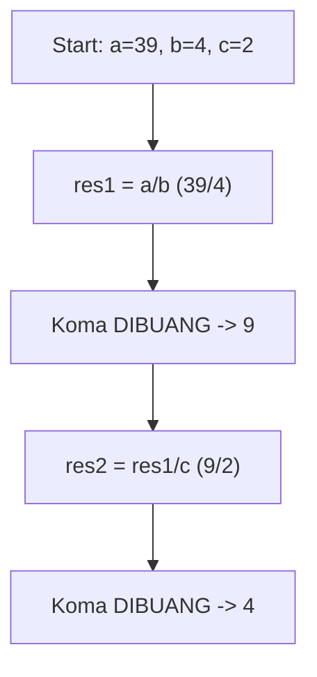

**📖 Cara Membaca Diagram:**
Mulai: a=39, b=4, c=2. Di baris `res1 = a / b`, 39/4 = 9.75, tapi karena `int`, koma dibakar jadi 9. Lalu 9/2 = 4.50, dibakar lagi jadi 4.

---
### Soal 184 (Integer Division)
```cpp
int a = 37;
int b = 9;
int c = 3;
int res1 = a / b;
int res2 = res1 / c;
```
**Pertanyaan:**
1. Berapakah nilai `res1`?
2. Berapakah nilai `res2`?
3. Mengapa `res1` tidak menghasilkan angka desimal?

**Jawaban & Diagnosis:**
1. **4**
2. **1**
3. **Karena tipe datanya `int`, setiap ada koma di belakangnya langsung dipangkas habis (Integer Division).**

**Mermaid Flowchart:**
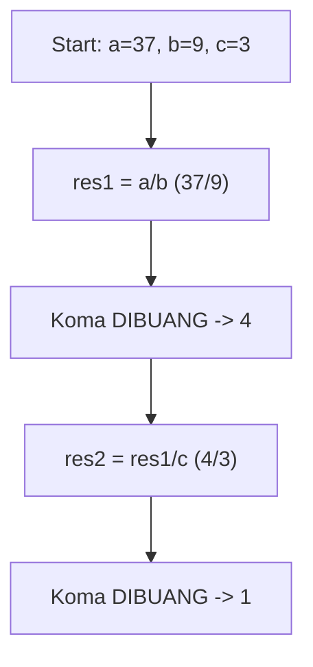

**📖 Cara Membaca Diagram:**
Mulai: a=37, b=9, c=3. Di baris `res1 = a / b`, 37/9 = 4.11, tapi karena `int`, koma dibakar jadi 4. Lalu 4/3 = 1.33, dibakar lagi jadi 1.

---
### Soal 185 (Modulo Magic)
```cpp
int x = 96;
int m1 = 2;
int m2 = 5;
int res_x = x % m1;
int res_y = x % m2;
```
**Pertanyaan:**
1. Apakah `x` genap atau ganjil?
2. Berapakah sisa bagi `x % m2`?
3. Apa guna operator `%` dalam OSN-K?

**Jawaban & Diagnosis:**
1. **Genap**
2. **1**
3. **Untuk mencari sisa bagi (sisa kelereng) atau mendeteksi pola perulangan/genap-ganjil.**

**Mermaid Flowchart:**
```mermaid
graph TD
    A[x=96] --> Bx % 2 == 0?
    B -- Ya --> C[Genap]
    B -- Tidak --> D[Ganjil]
    A --> E["x % 5"]
    E --> F["Sisa: 1"]
```

**📖 Cara Membaca Diagram:**
x=96. Cek `x % 2`: 96%2 = 0. Jika 0 genap, jika 1 ganjil. Cek `x % 5`: 96/5 = 19 sisa 1.

---
### Soal 186 (ASCII Math)
```cpp
char c = 'D';
int jump = 3;
char result = c + jump;
```
**Pertanyaan:**
1. Berapakah nilai ASCII batin dari 'D'?
2. Karakter apa yang tersimpan dalam variabel `result`?
3. Jika `result` dicetak sebagai `int`, angka berapa yang muncul?

**Jawaban & Diagnosis:**
1. **68**
2. **G**
3. **71**

**Mermaid Flowchart:**
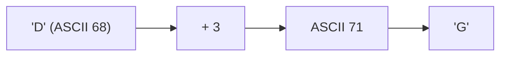

**📖 Cara Membaca Diagram:**
Karakter 'D' punya kode batin ASCII 68. Ditambah 3 langkah menjadi 71. Kode 71 adalah huruf 'G'.

---
### Soal 187 (Integer Division)
```cpp
int a = 47;
int b = 9;
int c = 6;
int res1 = a / b;
int res2 = res1 / c;
```
**Pertanyaan:**
1. Berapakah nilai `res1`?
2. Berapakah nilai `res2`?
3. Mengapa `res1` tidak menghasilkan angka desimal?

**Jawaban & Diagnosis:**
1. **5**
2. **0**
3. **Karena tipe datanya `int`, setiap ada koma di belakangnya langsung dipangkas habis (Integer Division).**

**Mermaid Flowchart:**
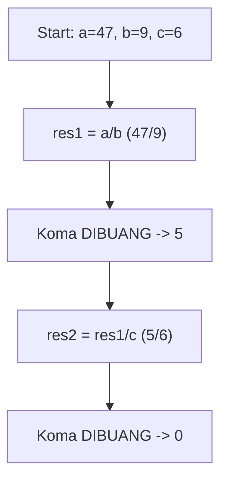

**📖 Cara Membaca Diagram:**
Mulai: a=47, b=9, c=6. Di baris `res1 = a / b`, 47/9 = 5.22, tapi karena `int`, koma dibakar jadi 5. Lalu 5/6 = 0.83, dibakar lagi jadi 0.

---
### Soal 188 (Modulo Magic)
```cpp
int x = 92;
int m1 = 2;
int m2 = 5;
int res_x = x % m1;
int res_y = x % m2;
```
**Pertanyaan:**
1. Apakah `x` genap atau ganjil?
2. Berapakah sisa bagi `x % m2`?
3. Apa guna operator `%` dalam OSN-K?

**Jawaban & Diagnosis:**
1. **Genap**
2. **2**
3. **Untuk mencari sisa bagi (sisa kelereng) atau mendeteksi pola perulangan/genap-ganjil.**

**Mermaid Flowchart:**
```mermaid
graph TD
    A[x=92] --> Bx % 2 == 0?
    B -- Ya --> C[Genap]
    B -- Tidak --> D[Ganjil]
    A --> E["x % 5"]
    E --> F["Sisa: 2"]
```

**📖 Cara Membaca Diagram:**
x=92. Cek `x % 2`: 92%2 = 0. Jika 0 genap, jika 1 ganjil. Cek `x % 5`: 92/5 = 18 sisa 2.

---
### Soal 189 (Casting War)
```cpp
int i = 7;
int j = 2;
double res1 = i / j;
double res2 = (double)i / j;
```
**Pertanyaan:**
1. Berapakah isi `res1`?
2. Berapakah isi `res2`?
3. Kenapa hasil `res1` dan `res2` berbeda padahal rumusnya mirip?

**Jawaban & Diagnosis:**
1. **3.0**
2. **3.5**
3. **Pada `res1`, pembagian terjadi antar `int` sehingga koma dibantai duluan sebelum masuk double. Pada `res2`, `i` dipaksa jadi `double` dulu, sehingga koma selamat.**

**Mermaid Flowchart:**
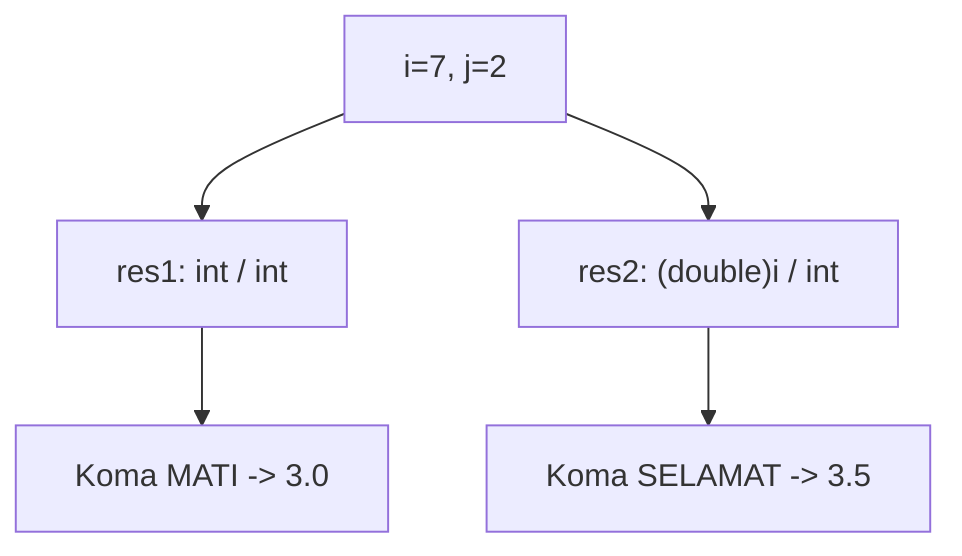

**📖 Cara Membaca Diagram:**
i=7, j=2. `res1`: 7/2 (int) = 3. Masuk double jadi 3.0. `res2`: (double)7 = 7.0. 7.0/2 = 3.5.

---
### Soal 190 (Casting War)
```cpp
int i = 9;
int j = 2;
double res1 = i / j;
double res2 = (double)i / j;
```
**Pertanyaan:**
1. Berapakah isi `res1`?
2. Berapakah isi `res2`?
3. Kenapa hasil `res1` dan `res2` berbeda padahal rumusnya mirip?

**Jawaban & Diagnosis:**
1. **4.0**
2. **4.5**
3. **Pada `res1`, pembagian terjadi antar `int` sehingga koma dibantai duluan sebelum masuk double. Pada `res2`, `i` dipaksa jadi `double` dulu, sehingga koma selamat.**

**Mermaid Flowchart:**


**📖 Cara Membaca Diagram:**
i=9, j=2. `res1`: 9/2 (int) = 4. Masuk double jadi 4.0. `res2`: (double)9 = 9.0. 9.0/2 = 4.5.

---
### Soal 191 (Casting War)
```cpp
int i = 10;
int j = 2;
double res1 = i / j;
double res2 = (double)i / j;
```
**Pertanyaan:**
1. Berapakah isi `res1`?
2. Berapakah isi `res2`?
3. Kenapa hasil `res1` dan `res2` berbeda padahal rumusnya mirip?

**Jawaban & Diagnosis:**
1. **5.0**
2. **5.0**
3. **Pada `res1`, pembagian terjadi antar `int` sehingga koma dibantai duluan sebelum masuk double. Pada `res2`, `i` dipaksa jadi `double` dulu, sehingga koma selamat.**

**Mermaid Flowchart:**


**📖 Cara Membaca Diagram:**
i=10, j=2. `res1`: 10/2 (int) = 5. Masuk double jadi 5.0. `res2`: (double)10 = 10.0. 10.0/2 = 5.0.

---
### Soal 192 (Casting War)
```cpp
int i = 8;
int j = 2;
double res1 = i / j;
double res2 = (double)i / j;
```
**Pertanyaan:**
1. Berapakah isi `res1`?
2. Berapakah isi `res2`?
3. Kenapa hasil `res1` dan `res2` berbeda padahal rumusnya mirip?

**Jawaban & Diagnosis:**
1. **4.0**
2. **4.0**
3. **Pada `res1`, pembagian terjadi antar `int` sehingga koma dibantai duluan sebelum masuk double. Pada `res2`, `i` dipaksa jadi `double` dulu, sehingga koma selamat.**

**Mermaid Flowchart:**


**📖 Cara Membaca Diagram:**
i=8, j=2. `res1`: 8/2 (int) = 4. Masuk double jadi 4.0. `res2`: (double)8 = 8.0. 8.0/2 = 4.0.

---
### Soal 193 (Casting War)
```cpp
int i = 10;
int j = 2;
double res1 = i / j;
double res2 = (double)i / j;
```
**Pertanyaan:**
1. Berapakah isi `res1`?
2. Berapakah isi `res2`?
3. Kenapa hasil `res1` dan `res2` berbeda padahal rumusnya mirip?

**Jawaban & Diagnosis:**
1. **5.0**
2. **5.0**
3. **Pada `res1`, pembagian terjadi antar `int` sehingga koma dibantai duluan sebelum masuk double. Pada `res2`, `i` dipaksa jadi `double` dulu, sehingga koma selamat.**

**Mermaid Flowchart:**


**📖 Cara Membaca Diagram:**
i=10, j=2. `res1`: 10/2 (int) = 5. Masuk double jadi 5.0. `res2`: (double)10 = 10.0. 10.0/2 = 5.0.

---
### Soal 194 (Modulo Magic)
```cpp
int x = 21;
int m1 = 2;
int m2 = 5;
int res_x = x % m1;
int res_y = x % m2;
```
**Pertanyaan:**
1. Apakah `x` genap atau ganjil?
2. Berapakah sisa bagi `x % m2`?
3. Apa guna operator `%` dalam OSN-K?

**Jawaban & Diagnosis:**
1. **Ganjil**
2. **1**
3. **Untuk mencari sisa bagi (sisa kelereng) atau mendeteksi pola perulangan/genap-ganjil.**

**Mermaid Flowchart:**
```mermaid
graph TD
    A[x=21] --> Bx % 2 == 0?
    B -- Ya --> C[Genap]
    B -- Tidak --> D[Ganjil]
    A --> E["x % 5"]
    E --> F["Sisa: 1"]
```

**📖 Cara Membaca Diagram:**
x=21. Cek `x % 2`: 21%2 = 1. Jika 0 genap, jika 1 ganjil. Cek `x % 5`: 21/5 = 4 sisa 1.

---
### Soal 195 (Casting War)
```cpp
int i = 7;
int j = 2;
double res1 = i / j;
double res2 = (double)i / j;
```
**Pertanyaan:**
1. Berapakah isi `res1`?
2. Berapakah isi `res2`?
3. Kenapa hasil `res1` dan `res2` berbeda padahal rumusnya mirip?

**Jawaban & Diagnosis:**
1. **3.0**
2. **3.5**
3. **Pada `res1`, pembagian terjadi antar `int` sehingga koma dibantai duluan sebelum masuk double. Pada `res2`, `i` dipaksa jadi `double` dulu, sehingga koma selamat.**

**Mermaid Flowchart:**


**📖 Cara Membaca Diagram:**
i=7, j=2. `res1`: 7/2 (int) = 3. Masuk double jadi 3.0. `res2`: (double)7 = 7.0. 7.0/2 = 3.5.

---
### Soal 196 (Modulo Magic)
```cpp
int x = 67;
int m1 = 2;
int m2 = 5;
int res_x = x % m1;
int res_y = x % m2;
```
**Pertanyaan:**
1. Apakah `x` genap atau ganjil?
2. Berapakah sisa bagi `x % m2`?
3. Apa guna operator `%` dalam OSN-K?

**Jawaban & Diagnosis:**
1. **Ganjil**
2. **2**
3. **Untuk mencari sisa bagi (sisa kelereng) atau mendeteksi pola perulangan/genap-ganjil.**

**Mermaid Flowchart:**
```mermaid
graph TD
    A[x=67] --> Bx % 2 == 0?
    B -- Ya --> C[Genap]
    B -- Tidak --> D[Ganjil]
    A --> E["x % 5"]
    E --> F["Sisa: 2"]
```

**📖 Cara Membaca Diagram:**
x=67. Cek `x % 2`: 67%2 = 1. Jika 0 genap, jika 1 ganjil. Cek `x % 5`: 67/5 = 13 sisa 2.

---
### Soal 197 (Integer Division)
```cpp
int a = 35;
int b = 5;
int c = 3;
int res1 = a / b;
int res2 = res1 / c;
```
**Pertanyaan:**
1. Berapakah nilai `res1`?
2. Berapakah nilai `res2`?
3. Mengapa `res1` tidak menghasilkan angka desimal?

**Jawaban & Diagnosis:**
1. **7**
2. **2**
3. **Karena tipe datanya `int`, setiap ada koma di belakangnya langsung dipangkas habis (Integer Division).**

**Mermaid Flowchart:**
```mermaid
graph TD
    A[Start: a=35, b=5, c=3] --> B["res1 = a/b (35/5)"]
    B --> C["Koma DIBUANG -> 7"]
    C --> D["res2 = res1/c (7/3)"]
    D --> E["Koma DIBUANG -> 2"]
```

**📖 Cara Membaca Diagram:**
Mulai: a=35, b=5, c=3. Di baris `res1 = a / b`, 35/5 = 7.00, tapi karena `int`, koma dibakar jadi 7. Lalu 7/3 = 2.33, dibakar lagi jadi 2.

---
### Soal 198 (Casting War)
```cpp
int i = 6;
int j = 2;
double res1 = i / j;
double res2 = (double)i / j;
```
**Pertanyaan:**
1. Berapakah isi `res1`?
2. Berapakah isi `res2`?
3. Kenapa hasil `res1` dan `res2` berbeda padahal rumusnya mirip?

**Jawaban & Diagnosis:**
1. **3.0**
2. **3.0**
3. **Pada `res1`, pembagian terjadi antar `int` sehingga koma dibantai duluan sebelum masuk double. Pada `res2`, `i` dipaksa jadi `double` dulu, sehingga koma selamat.**

**Mermaid Flowchart:**
```mermaid
graph TD
    A["i=6, j=2"] --> B["res1: int / int"]
    B --> C["Koma MATI -> 3.0"]
    A --> D["res2: (double)i / int"]
    D --> E["Koma SELAMAT -> 3.0"]
```

**📖 Cara Membaca Diagram:**
i=6, j=2. `res1`: 6/2 (int) = 3. Masuk double jadi 3.0. `res2`: (double)6 = 6.0. 6.0/2 = 3.0.

---
### Soal 199 (ASCII Math)
```cpp
char c = 'A';
int jump = 1;
char result = c + jump;
```
**Pertanyaan:**
1. Berapakah nilai ASCII batin dari 'A'?
2. Karakter apa yang tersimpan dalam variabel `result`?
3. Jika `result` dicetak sebagai `int`, angka berapa yang muncul?

**Jawaban & Diagnosis:**
1. **65**
2. **B**
3. **66**

**Mermaid Flowchart:**
```mermaid
graph LR
    A["'A' (ASCII 65)"] --> B["+ 1"]
    B --> C["ASCII 66"]
    C --> D["'B'"]
```

**📖 Cara Membaca Diagram:**
Karakter 'A' punya kode batin ASCII 65. Ditambah 1 langkah menjadi 66. Kode 66 adalah huruf 'B'.

---
### Soal 200 (Modulo Magic)
```cpp
int x = 78;
int m1 = 2;
int m2 = 5;
int res_x = x % m1;
int res_y = x % m2;
```
**Pertanyaan:**
1. Apakah `x` genap atau ganjil?
2. Berapakah sisa bagi `x % m2`?
3. Apa guna operator `%` dalam OSN-K?

**Jawaban & Diagnosis:**
1. **Genap**
2. **3**
3. **Untuk mencari sisa bagi (sisa kelereng) atau mendeteksi pola perulangan/genap-ganjil.**

**Mermaid Flowchart:**
```mermaid
graph TD
    A[x=78] --> Bx % 2 == 0?
    B -- Ya --> C[Genap]
    B -- Tidak --> D[Ganjil]
    A --> E["x % 5"]
    E --> F["Sisa: 3"]
```

**📖 Cara Membaca Diagram:**
x=78. Cek `x % 2`: 78%2 = 0. Jika 0 genap, jika 1 ganjil. Cek `x % 5`: 78/5 = 15 sisa 3.

---
