🔙 **[Kembali ke Daftar Soal](./README.md)**

---

# Latihan Soal Part C - Modul 01 - Set 08

### Soal 176
```cpp
int a = 89, m = 5;
int res = a / m;
```
**Pertanyaan:**
1. Berapakah hasil akhirnya?
2. Mengapa demikian?

**Jawaban & Diagnosis:**
1. **17**
2. Lihat Tracing.

**Mermaid Flowchart:**


**📖 Penjelasan:**
**Langkah Tracing:**
1. a=89, m=5.
2. 89/5 = 17.80. Karena `int`, desimal dibuang.
3. Hasil: 17.

---
### Soal 177
```cpp
double val = 48.71;
int res = (int)val;
```
**Pertanyaan:**
1. Berapakah hasil akhirnya?
2. Mengapa demikian?

**Jawaban & Diagnosis:**
1. **48**
2. Lihat Tracing.

**Mermaid Flowchart:**
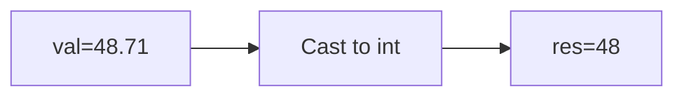

**📖 Penjelasan:**
**Langkah Tracing:**
1. val=48.71.
2. Desimal dihilangkan.
3. Hasil: 48.

---
### Soal 178
```cpp
double val = 16.85;
int res = (int)val;
```
**Pertanyaan:**
1. Berapakah hasil akhirnya?
2. Mengapa demikian?

**Jawaban & Diagnosis:**
1. **16**
2. Lihat Tracing.

**Mermaid Flowchart:**
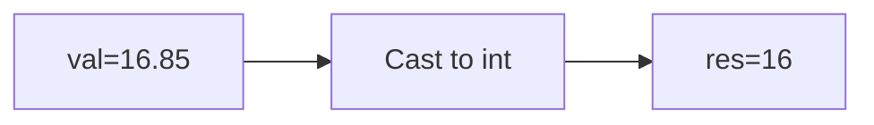

**📖 Penjelasan:**
**Langkah Tracing:**
1. val=16.85.
2. Desimal dihilangkan.
3. Hasil: 16.

---
### Soal 179
```cpp
double val = 27.92;
int res = (int)val;
```
**Pertanyaan:**
1. Berapakah hasil akhirnya?
2. Mengapa demikian?

**Jawaban & Diagnosis:**
1. **27**
2. Lihat Tracing.

**Mermaid Flowchart:**
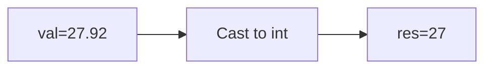

**📖 Penjelasan:**
**Langkah Tracing:**
1. val=27.92.
2. Desimal dihilangkan.
3. Hasil: 27.

---
### Soal 180
```cpp
int n = 26;
int m = 3;
int res = n % m;
```
**Pertanyaan:**
1. Berapakah hasil akhirnya?
2. Mengapa demikian?

**Jawaban & Diagnosis:**
1. **2**
2. Lihat Tracing.

**Mermaid Flowchart:**
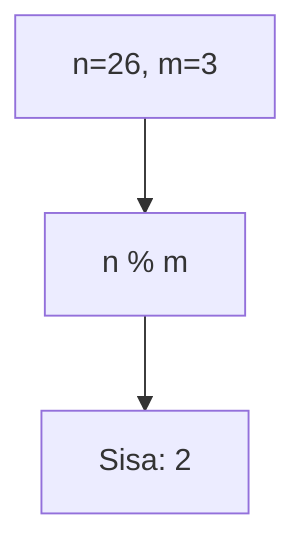

**📖 Penjelasan:**
**Langkah Tracing:**
1. n=26, m=3.
2. 26 dibagi 3 sisa 2.
3. Hasil: 2.

---
### Soal 181
```cpp
int n = 34;
int m = 2;
int res = n % m;
```
**Pertanyaan:**
1. Berapakah hasil akhirnya?
2. Mengapa demikian?

**Jawaban & Diagnosis:**
1. **0**
2. Lihat Tracing.

**Mermaid Flowchart:**


**📖 Penjelasan:**
**Langkah Tracing:**
1. n=34, m=2.
2. 34 dibagi 2 sisa 0.
3. Hasil: 0.

---
### Soal 182
```cpp
double val = 12.39;
int res = (int)val;
```
**Pertanyaan:**
1. Berapakah hasil akhirnya?
2. Mengapa demikian?

**Jawaban & Diagnosis:**
1. **12**
2. Lihat Tracing.

**Mermaid Flowchart:**
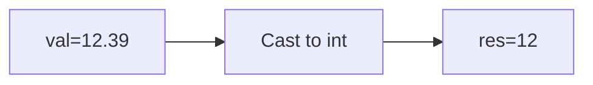

**📖 Penjelasan:**
**Langkah Tracing:**
1. val=12.39.
2. Desimal dihilangkan.
3. Hasil: 12.

---
### Soal 183
```cpp
char ch = 'P';
ch = ch + (5);
```
**Pertanyaan:**
1. Berapakah hasil akhirnya?
2. Mengapa demikian?

**Jawaban & Diagnosis:**
1. **U**
2. Lihat Tracing.

**Mermaid Flowchart:**
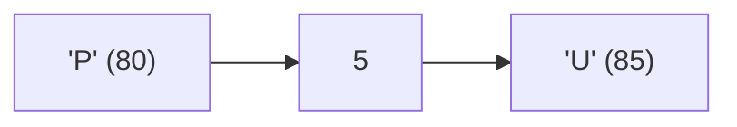

**📖 Penjelasan:**
**Langkah Tracing:**
1. ch='P' (ASCII 80).
2. 80 + (5) = 85.
3. Hasil: 'U'.

---
### Soal 184
```cpp
int n = 72, m = 7;
int res = n / m;
```
**Pertanyaan:**
1. Berapakah hasil akhirnya?
2. Mengapa demikian?

**Jawaban & Diagnosis:**
1. **10**
2. Lihat Tracing.

**Mermaid Flowchart:**
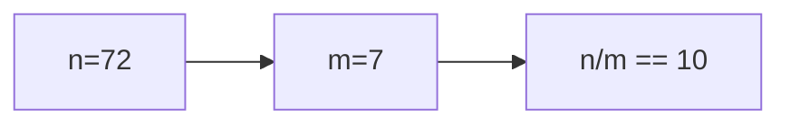

**📖 Penjelasan:**
**Langkah Tracing:**
1. n=72, m=7.
2. 72/7 = 10.29. Karena `int`, desimal dibuang.
3. Hasil: 10.

---
### Soal 185
```cpp
int n = 22;
int m = 10;
int res = n % m;
```
**Pertanyaan:**
1. Berapakah hasil akhirnya?
2. Mengapa demikian?

**Jawaban & Diagnosis:**
1. **2**
2. Lihat Tracing.

**Mermaid Flowchart:**
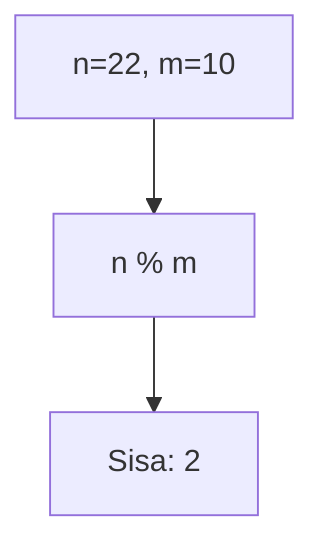

**📖 Penjelasan:**
**Langkah Tracing:**
1. n=22, m=10.
2. 22 dibagi 10 sisa 2.
3. Hasil: 2.

---
### Soal 186
```cpp
int a = 26, y = 2;
int res = a / y;
```
**Pertanyaan:**
1. Berapakah hasil akhirnya?
2. Mengapa demikian?

**Jawaban & Diagnosis:**
1. **13**
2. Lihat Tracing.

**Mermaid Flowchart:**
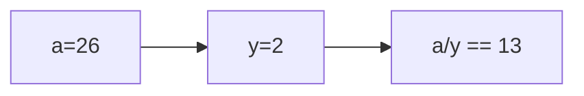

**📖 Penjelasan:**
**Langkah Tracing:**
1. a=26, y=2.
2. 26/2 = 13.00. Karena `int`, desimal dibuang.
3. Hasil: 13.

---
### Soal 187
```cpp
int n = 28;
int m = 3;
int res = n % m;
```
**Pertanyaan:**
1. Berapakah hasil akhirnya?
2. Mengapa demikian?

**Jawaban & Diagnosis:**
1. **1**
2. Lihat Tracing.

**Mermaid Flowchart:**


**📖 Penjelasan:**
**Langkah Tracing:**
1. n=28, m=3.
2. 28 dibagi 3 sisa 1.
3. Hasil: 1.

---
### Soal 188
```cpp
char ch = 'P';
ch = ch + (1);
```
**Pertanyaan:**
1. Berapakah hasil akhirnya?
2. Mengapa demikian?

**Jawaban & Diagnosis:**
1. **Q**
2. Lihat Tracing.

**Mermaid Flowchart:**
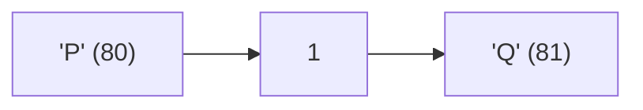

**📖 Penjelasan:**
**Langkah Tracing:**
1. ch='P' (ASCII 80).
2. 80 + (1) = 81.
3. Hasil: 'Q'.

---
### Soal 189
```cpp
int n = 7;
int m = 5;
int res = n % m;
```
**Pertanyaan:**
1. Berapakah hasil akhirnya?
2. Mengapa demikian?

**Jawaban & Diagnosis:**
1. **2**
2. Lihat Tracing.

**Mermaid Flowchart:**
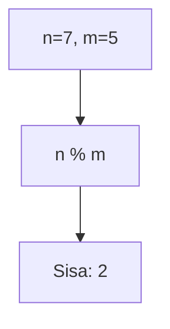

**📖 Penjelasan:**
**Langkah Tracing:**
1. n=7, m=5.
2. 7 dibagi 5 sisa 2.
3. Hasil: 2.

---
### Soal 190
```cpp
char ch = 'B';
ch = ch + (2);
```
**Pertanyaan:**
1. Berapakah hasil akhirnya?
2. Mengapa demikian?

**Jawaban & Diagnosis:**
1. **D**
2. Lihat Tracing.

**Mermaid Flowchart:**
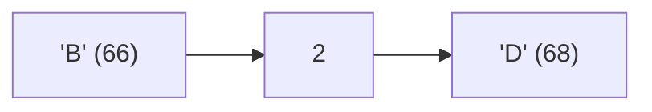

**📖 Penjelasan:**
**Langkah Tracing:**
1. ch='B' (ASCII 66).
2. 66 + (2) = 68.
3. Hasil: 'D'.

---
### Soal 191
```cpp
double val = 84.92;
int res = (int)val;
```
**Pertanyaan:**
1. Berapakah hasil akhirnya?
2. Mengapa demikian?

**Jawaban & Diagnosis:**
1. **84**
2. Lihat Tracing.

**Mermaid Flowchart:**
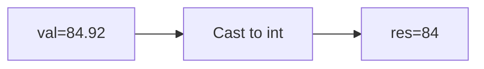

**📖 Penjelasan:**
**Langkah Tracing:**
1. val=84.92.
2. Desimal dihilangkan.
3. Hasil: 84.

---
### Soal 192
```cpp
int n = 30;
int m = 3;
int res = n % m;
```
**Pertanyaan:**
1. Berapakah hasil akhirnya?
2. Mengapa demikian?

**Jawaban & Diagnosis:**
1. **0**
2. Lihat Tracing.

**Mermaid Flowchart:**


**📖 Penjelasan:**
**Langkah Tracing:**
1. n=30, m=3.
2. 30 dibagi 3 sisa 0.
3. Hasil: 0.

---
### Soal 193
```cpp
int n = 24;
int m = 2;
int res = n % m;
```
**Pertanyaan:**
1. Berapakah hasil akhirnya?
2. Mengapa demikian?

**Jawaban & Diagnosis:**
1. **0**
2. Lihat Tracing.

**Mermaid Flowchart:**
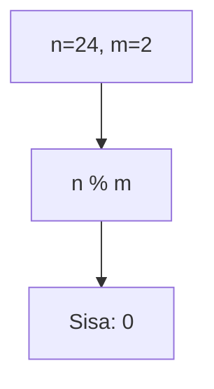

**📖 Penjelasan:**
**Langkah Tracing:**
1. n=24, m=2.
2. 24 dibagi 2 sisa 0.
3. Hasil: 0.

---
### Soal 194
```cpp
int x = 40, m = 7;
int res = x / m;
```
**Pertanyaan:**
1. Berapakah hasil akhirnya?
2. Mengapa demikian?

**Jawaban & Diagnosis:**
1. **5**
2. Lihat Tracing.

**Mermaid Flowchart:**
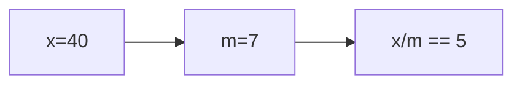

**📖 Penjelasan:**
**Langkah Tracing:**
1. x=40, m=7.
2. 40/7 = 5.71. Karena `int`, desimal dibuang.
3. Hasil: 5.

---
### Soal 195
```cpp
int a = 88, m = 5;
int res = a / m;
```
**Pertanyaan:**
1. Berapakah hasil akhirnya?
2. Mengapa demikian?

**Jawaban & Diagnosis:**
1. **17**
2. Lihat Tracing.

**Mermaid Flowchart:**
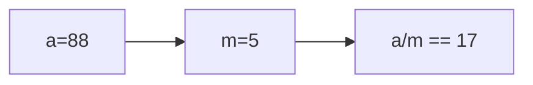

**📖 Penjelasan:**
**Langkah Tracing:**
1. a=88, m=5.
2. 88/5 = 17.60. Karena `int`, desimal dibuang.
3. Hasil: 17.

---
### Soal 196
```cpp
double val = 67.56;
int res = (int)val;
```
**Pertanyaan:**
1. Berapakah hasil akhirnya?
2. Mengapa demikian?

**Jawaban & Diagnosis:**
1. **67**
2. Lihat Tracing.

**Mermaid Flowchart:**
```mermaid
graph LR
A["val=67.56"] --> B["Cast to int"]
B --> C["res=67"]
```

**📖 Penjelasan:**
**Langkah Tracing:**
1. val=67.56.
2. Desimal dihilangkan.
3. Hasil: 67.

---
### Soal 197
```cpp
char ch = 'X';
ch = ch + (4);
```
**Pertanyaan:**
1. Berapakah hasil akhirnya?
2. Mengapa demikian?

**Jawaban & Diagnosis:**
1. **\**
2. Lihat Tracing.

**Mermaid Flowchart:**
```mermaid
graph LR
A["'X' (88)"] --> B["4"]
B --> C["'\' (92)"]
```

**📖 Penjelasan:**
**Langkah Tracing:**
1. ch='X' (ASCII 88).
2. 88 + (4) = 92.
3. Hasil: '\'.

---
### Soal 198
```cpp
int n = 25;
int m = 2;
int res = n % m;
```
**Pertanyaan:**
1. Berapakah hasil akhirnya?
2. Mengapa demikian?

**Jawaban & Diagnosis:**
1. **1**
2. Lihat Tracing.

**Mermaid Flowchart:**
```mermaid
graph TD
A["n=25, m=2"] --> B["n % m"]
B --> C["Sisa: 1"]
```

**📖 Penjelasan:**
**Langkah Tracing:**
1. n=25, m=2.
2. 25 dibagi 2 sisa 1.
3. Hasil: 1.

---
### Soal 199
```cpp
char ch = 'm';
ch = ch + (3);
```
**Pertanyaan:**
1. Berapakah hasil akhirnya?
2. Mengapa demikian?

**Jawaban & Diagnosis:**
1. **p**
2. Lihat Tracing.

**Mermaid Flowchart:**
```mermaid
graph LR
A["'m' (109)"] --> B["3"]
B --> C["'p' (112)"]
```

**📖 Penjelasan:**
**Langkah Tracing:**
1. ch='m' (ASCII 109).
2. 109 + (3) = 112.
3. Hasil: 'p'.

---
### Soal 200
```cpp
char ch = 'B';
ch = ch + (3);
```
**Pertanyaan:**
1. Berapakah hasil akhirnya?
2. Mengapa demikian?

**Jawaban & Diagnosis:**
1. **E**
2. Lihat Tracing.

**Mermaid Flowchart:**
```mermaid
graph LR
A["'B' (66)"] --> B["3"]
B --> C["'E' (69)"]
```

**📖 Penjelasan:**
**Langkah Tracing:**
1. ch='B' (ASCII 66).
2. 66 + (3) = 69.
3. Hasil: 'E'.

---
