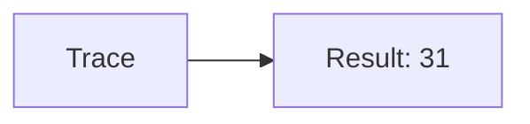
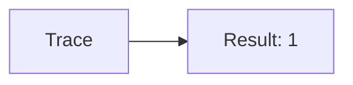
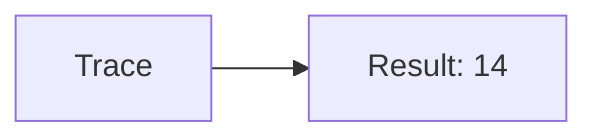
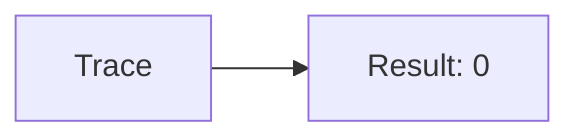
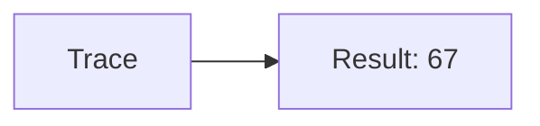
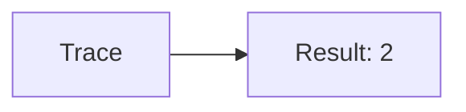
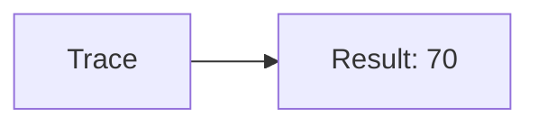

🔙 **[Kembali ke Daftar Soal](./README.md)**

---

# Latihan Soal Part C - Modul 01 - Set 09

### Soal 201
```cpp
// Permen: Pembagian
int permen = 93, bagi = 3;
int hasil = permen / bagi;
```
**Pertanyaan:**
1. Berapakah hasil akhirnya?
2. Deskripsikan alur pikir 'Compiler Manusia' untuk soal ini!

**Jawaban & Diagnosis:**
1. **31**
2. Membagi 93 Permen ke 3 bagian. Hasil bulat: 31.

**Mermaid Flowchart:**


---
### Soal 202
```cpp
// Tiket: Modulo
int tiket = 82, bagi = 3;
int sisa = tiket % bagi;
```
**Pertanyaan:**
1. Berapakah hasil akhirnya?
2. Deskripsikan alur pikir 'Compiler Manusia' untuk soal ini!

**Jawaban & Diagnosis:**
1. **1**
2. 82 Tiket dibagi 3 sisa 1.

**Mermaid Flowchart:**


---
### Soal 203
```cpp
// Buku: Casting
double val = 35.51;
int res = (int)val;
```
**Pertanyaan:**
1. Berapakah hasil akhirnya?
2. Deskripsikan alur pikir 'Compiler Manusia' untuk soal ini!

**Jawaban & Diagnosis:**
1. **35**
2. Mengubah 35.51 jadi integer (pangkas koma) jadi 35.

**Mermaid Flowchart:**


---
### Soal 204
```cpp
// Kelereng: Pembagian
int kelereng = 62, bagi = 7;
int hasil = kelereng / bagi;
```
**Pertanyaan:**
1. Berapakah hasil akhirnya?
2. Deskripsikan alur pikir 'Compiler Manusia' untuk soal ini!

**Jawaban & Diagnosis:**
1. **8**
2. Membagi 62 Kelereng ke 7 bagian. Hasil bulat: 8.

**Mermaid Flowchart:**


---
### Soal 205
```cpp
// Botol: Modulo
int botol = 13, bagi = 8;
int sisa = botol % bagi;
```
**Pertanyaan:**
1. Berapakah hasil akhirnya?
2. Deskripsikan alur pikir 'Compiler Manusia' untuk soal ini!

**Jawaban & Diagnosis:**
1. **5**
2. 13 Botol dibagi 8 sisa 5.

**Mermaid Flowchart:**


---
### Soal 206
```cpp
// Baju: Casting
double val = 69.21;
int res = (int)val;
```
**Pertanyaan:**
1. Berapakah hasil akhirnya?
2. Deskripsikan alur pikir 'Compiler Manusia' untuk soal ini!

**Jawaban & Diagnosis:**
1. **69**
2. Mengubah 69.21 jadi integer (pangkas koma) jadi 69.

**Mermaid Flowchart:**


---
### Soal 207
```cpp
// Sepatu: Pembagian
int sepatu = 99, bagi = 7;
int hasil = sepatu / bagi;
```
**Pertanyaan:**
1. Berapakah hasil akhirnya?
2. Deskripsikan alur pikir 'Compiler Manusia' untuk soal ini!

**Jawaban & Diagnosis:**
1. **14**
2. Membagi 99 Sepatu ke 7 bagian. Hasil bulat: 14.

**Mermaid Flowchart:**


---
### Soal 208
```cpp
// Tas: Modulo
int tas = 32, bagi = 2;
int sisa = tas % bagi;
```
**Pertanyaan:**
1. Berapakah hasil akhirnya?
2. Deskripsikan alur pikir 'Compiler Manusia' untuk soal ini!

**Jawaban & Diagnosis:**
1. **0**
2. 32 Tas dibagi 2 sisa 0.

**Mermaid Flowchart:**


---
### Soal 209
```cpp
// Piring: Casting
double val = 67.61;
int res = (int)val;
```
**Pertanyaan:**
1. Berapakah hasil akhirnya?
2. Deskripsikan alur pikir 'Compiler Manusia' untuk soal ini!

**Jawaban & Diagnosis:**
1. **67**
2. Mengubah 67.61 jadi integer (pangkas koma) jadi 67.

**Mermaid Flowchart:**


---
### Soal 210
```cpp
// Gelas: Pembagian
int gelas = 45, bagi = 5;
int hasil = gelas / bagi;
```
**Pertanyaan:**
1. Berapakah hasil akhirnya?
2. Deskripsikan alur pikir 'Compiler Manusia' untuk soal ini!

**Jawaban & Diagnosis:**
1. **9**
2. Membagi 45 Gelas ke 5 bagian. Hasil bulat: 9.

**Mermaid Flowchart:**


---
### Soal 211
```cpp
// Kursi: Modulo
int kursi = 63, bagi = 3;
int sisa = kursi % bagi;
```
**Pertanyaan:**
1. Berapakah hasil akhirnya?
2. Deskripsikan alur pikir 'Compiler Manusia' untuk soal ini!

**Jawaban & Diagnosis:**
1. **0**
2. 63 Kursi dibagi 3 sisa 0.

**Mermaid Flowchart:**


---
### Soal 212
```cpp
// Meja: Casting
double val = 24.31;
int res = (int)val;
```
**Pertanyaan:**
1. Berapakah hasil akhirnya?
2. Deskripsikan alur pikir 'Compiler Manusia' untuk soal ini!

**Jawaban & Diagnosis:**
1. **24**
2. Mengubah 24.31 jadi integer (pangkas koma) jadi 24.

**Mermaid Flowchart:**


---
### Soal 213
```cpp
// Lampu: Pembagian
int lampu = 85, bagi = 3;
int hasil = lampu / bagi;
```
**Pertanyaan:**
1. Berapakah hasil akhirnya?
2. Deskripsikan alur pikir 'Compiler Manusia' untuk soal ini!

**Jawaban & Diagnosis:**
1. **28**
2. Membagi 85 Lampu ke 3 bagian. Hasil bulat: 28.

**Mermaid Flowchart:**


---
### Soal 214
```cpp
// Kipas: Modulo
int kipas = 80, bagi = 8;
int sisa = kipas % bagi;
```
**Pertanyaan:**
1. Berapakah hasil akhirnya?
2. Deskripsikan alur pikir 'Compiler Manusia' untuk soal ini!

**Jawaban & Diagnosis:**
1. **0**
2. 80 Kipas dibagi 8 sisa 0.

**Mermaid Flowchart:**


---
### Soal 215
```cpp
// AC: Casting
double val = 23.51;
int res = (int)val;
```
**Pertanyaan:**
1. Berapakah hasil akhirnya?
2. Deskripsikan alur pikir 'Compiler Manusia' untuk soal ini!

**Jawaban & Diagnosis:**
1. **23**
2. Mengubah 23.51 jadi integer (pangkas koma) jadi 23.

**Mermaid Flowchart:**


---
### Soal 216
```cpp
// TV: Pembagian
int tv = 17, bagi = 8;
int hasil = tv / bagi;
```
**Pertanyaan:**
1. Berapakah hasil akhirnya?
2. Deskripsikan alur pikir 'Compiler Manusia' untuk soal ini!

**Jawaban & Diagnosis:**
1. **2**
2. Membagi 17 TV ke 8 bagian. Hasil bulat: 2.

**Mermaid Flowchart:**


---
### Soal 217
```cpp
// Kabel: Modulo
int kabel = 92, bagi = 6;
int sisa = kabel % bagi;
```
**Pertanyaan:**
1. Berapakah hasil akhirnya?
2. Deskripsikan alur pikir 'Compiler Manusia' untuk soal ini!

**Jawaban & Diagnosis:**
1. **2**
2. 92 Kabel dibagi 6 sisa 2.

**Mermaid Flowchart:**


---
### Soal 218
```cpp
// Pulpen: Casting
double val = 70.41;
int res = (int)val;
```
**Pertanyaan:**
1. Berapakah hasil akhirnya?
2. Deskripsikan alur pikir 'Compiler Manusia' untuk soal ini!

**Jawaban & Diagnosis:**
1. **70**
2. Mengubah 70.41 jadi integer (pangkas koma) jadi 70.

**Mermaid Flowchart:**


---
### Soal 219
```cpp
// Pensil: Pembagian
int pensil = 89, bagi = 2;
int hasil = pensil / bagi;
```
**Pertanyaan:**
1. Berapakah hasil akhirnya?
2. Deskripsikan alur pikir 'Compiler Manusia' untuk soal ini!

**Jawaban & Diagnosis:**
1. **44**
2. Membagi 89 Pensil ke 2 bagian. Hasil bulat: 44.

**Mermaid Flowchart:**


---
### Soal 220
```cpp
// Penghapus: Modulo
int penghapus = 51, bagi = 8;
int sisa = penghapus % bagi;
```
**Pertanyaan:**
1. Berapakah hasil akhirnya?
2. Deskripsikan alur pikir 'Compiler Manusia' untuk soal ini!

**Jawaban & Diagnosis:**
1. **3**
2. 51 Penghapus dibagi 8 sisa 3.

**Mermaid Flowchart:**


---
### Soal 221
```cpp
// Penggaris: Casting
double val = 41.61;
int res = (int)val;
```
**Pertanyaan:**
1. Berapakah hasil akhirnya?
2. Deskripsikan alur pikir 'Compiler Manusia' untuk soal ini!

**Jawaban & Diagnosis:**
1. **41**
2. Mengubah 41.61 jadi integer (pangkas koma) jadi 41.

**Mermaid Flowchart:**
```mermaid
graph LR
A[Trace] --> B[Result: 41]
```

---
### Soal 222
```cpp
// Kotak: Pembagian
int kotak = 81, bagi = 4;
int hasil = kotak / bagi;
```
**Pertanyaan:**
1. Berapakah hasil akhirnya?
2. Deskripsikan alur pikir 'Compiler Manusia' untuk soal ini!

**Jawaban & Diagnosis:**
1. **20**
2. Membagi 81 Kotak ke 4 bagian. Hasil bulat: 20.

**Mermaid Flowchart:**
```mermaid
graph LR
A[Trace] --> B[Result: 20]
```

---
### Soal 223
```cpp
// Dompet: Modulo
int dompet = 41, bagi = 6;
int sisa = dompet % bagi;
```
**Pertanyaan:**
1. Berapakah hasil akhirnya?
2. Deskripsikan alur pikir 'Compiler Manusia' untuk soal ini!

**Jawaban & Diagnosis:**
1. **5**
2. 41 Dompet dibagi 6 sisa 5.

**Mermaid Flowchart:**
```mermaid
graph LR
A[Trace] --> B[Result: 5]
```

---
### Soal 224
```cpp
// Kunci: Casting
double val = 28.21;
int res = (int)val;
```
**Pertanyaan:**
1. Berapakah hasil akhirnya?
2. Deskripsikan alur pikir 'Compiler Manusia' untuk soal ini!

**Jawaban & Diagnosis:**
1. **28**
2. Mengubah 28.21 jadi integer (pangkas koma) jadi 28.

**Mermaid Flowchart:**
```mermaid
graph LR
A[Trace] --> B[Result: 28]
```

---
### Soal 225
```cpp
// Hp: Pembagian
int hp = 10, bagi = 8;
int hasil = hp / bagi;
```
**Pertanyaan:**
1. Berapakah hasil akhirnya?
2. Deskripsikan alur pikir 'Compiler Manusia' untuk soal ini!

**Jawaban & Diagnosis:**
1. **1**
2. Membagi 10 Hp ke 8 bagian. Hasil bulat: 1.

**Mermaid Flowchart:**
```mermaid
graph LR
A[Trace] --> B[Result: 1]
```

---
