🔙 **[Kembali ke Daftar Soal](./README.md)**

---

# Latihan Soal Part C - Modul 01 - Set 09

### Soal 201
```cpp
double val = 94.82;
int res = (int)val;
```
**Pertanyaan:**
1. Berapakah hasil akhirnya?
2. Mengapa demikian?

**Jawaban & Diagnosis:**
1. **94**
2. Lihat Tracing.

**Mermaid Flowchart:**
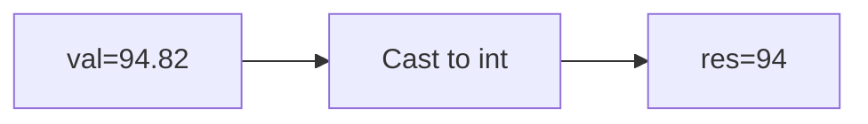

**📖 Penjelasan:**
**Langkah Tracing:**
1. val=94.82.
2. Desimal dihilangkan.
3. Hasil: 94.

---
### Soal 202
```cpp
char ch = 'A';
ch = ch + (-3);
```
**Pertanyaan:**
1. Berapakah hasil akhirnya?
2. Mengapa demikian?

**Jawaban & Diagnosis:**
1. **>**
2. Lihat Tracing.

**Mermaid Flowchart:**
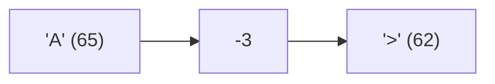

**📖 Penjelasan:**
**Langkah Tracing:**
1. ch='A' (ASCII 65).
2. 65 + (-3) = 62.
3. Hasil: '>'.

---
### Soal 203
```cpp
int x = 42, m = 3;
int res = x / m;
```
**Pertanyaan:**
1. Berapakah hasil akhirnya?
2. Mengapa demikian?

**Jawaban & Diagnosis:**
1. **14**
2. Lihat Tracing.

**Mermaid Flowchart:**
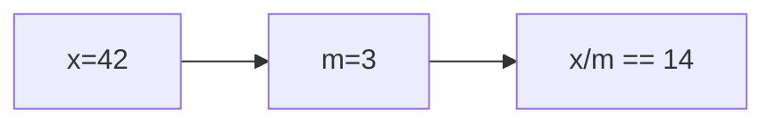

**📖 Penjelasan:**
**Langkah Tracing:**
1. x=42, m=3.
2. 42/3 = 14.00. Karena `int`, desimal dibuang.
3. Hasil: 14.

---
### Soal 204
```cpp
int n = 39;
int m = 3;
int res = n % m;
```
**Pertanyaan:**
1. Berapakah hasil akhirnya?
2. Mengapa demikian?

**Jawaban & Diagnosis:**
1. **0**
2. Lihat Tracing.

**Mermaid Flowchart:**
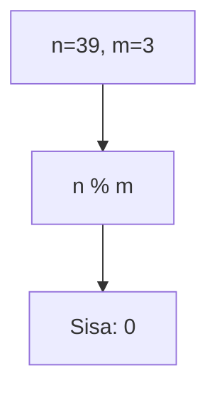

**📖 Penjelasan:**
**Langkah Tracing:**
1. n=39, m=3.
2. 39 dibagi 3 sisa 0.
3. Hasil: 0.

---
### Soal 205
```cpp
int n = 44;
int m = 2;
int res = n % m;
```
**Pertanyaan:**
1. Berapakah hasil akhirnya?
2. Mengapa demikian?

**Jawaban & Diagnosis:**
1. **0**
2. Lihat Tracing.

**Mermaid Flowchart:**
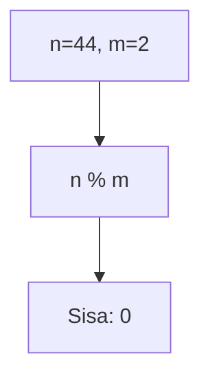

**📖 Penjelasan:**
**Langkah Tracing:**
1. n=44, m=2.
2. 44 dibagi 2 sisa 0.
3. Hasil: 0.

---
### Soal 206
```cpp
int n = 28;
int m = 5;
int res = n % m;
```
**Pertanyaan:**
1. Berapakah hasil akhirnya?
2. Mengapa demikian?

**Jawaban & Diagnosis:**
1. **3**
2. Lihat Tracing.

**Mermaid Flowchart:**
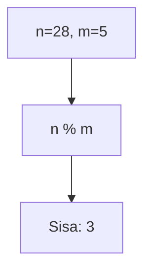

**📖 Penjelasan:**
**Langkah Tracing:**
1. n=28, m=5.
2. 28 dibagi 5 sisa 3.
3. Hasil: 3.

---
### Soal 207
```cpp
int n = 51, m = 2;
int res = n / m;
```
**Pertanyaan:**
1. Berapakah hasil akhirnya?
2. Mengapa demikian?

**Jawaban & Diagnosis:**
1. **25**
2. Lihat Tracing.

**Mermaid Flowchart:**
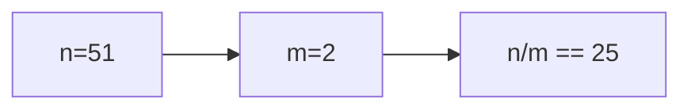

**📖 Penjelasan:**
**Langkah Tracing:**
1. n=51, m=2.
2. 51/2 = 25.50. Karena `int`, desimal dibuang.
3. Hasil: 25.

---
### Soal 208
```cpp
double val = 24.00;
int res = (int)val;
```
**Pertanyaan:**
1. Berapakah hasil akhirnya?
2. Mengapa demikian?

**Jawaban & Diagnosis:**
1. **24**
2. Lihat Tracing.

**Mermaid Flowchart:**


**📖 Penjelasan:**
**Langkah Tracing:**
1. val=24.00.
2. Desimal dihilangkan.
3. Hasil: 24.

---
### Soal 209
```cpp
int a = 64, y = 3;
int res = a / y;
```
**Pertanyaan:**
1. Berapakah hasil akhirnya?
2. Mengapa demikian?

**Jawaban & Diagnosis:**
1. **21**
2. Lihat Tracing.

**Mermaid Flowchart:**
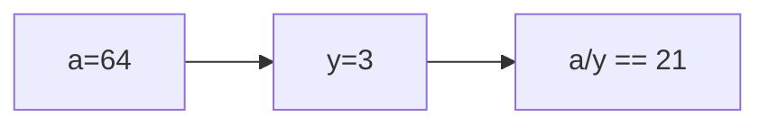

**📖 Penjelasan:**
**Langkah Tracing:**
1. a=64, y=3.
2. 64/3 = 21.33. Karena `int`, desimal dibuang.
3. Hasil: 21.

---
### Soal 210
```cpp
int n = 28;
int m = 3;
int res = n % m;
```
**Pertanyaan:**
1. Berapakah hasil akhirnya?
2. Mengapa demikian?

**Jawaban & Diagnosis:**
1. **1**
2. Lihat Tracing.

**Mermaid Flowchart:**


**📖 Penjelasan:**
**Langkah Tracing:**
1. n=28, m=3.
2. 28 dibagi 3 sisa 1.
3. Hasil: 1.

---
### Soal 211
```cpp
int x = 24, m = 7;
int res = x / m;
```
**Pertanyaan:**
1. Berapakah hasil akhirnya?
2. Mengapa demikian?

**Jawaban & Diagnosis:**
1. **3**
2. Lihat Tracing.

**Mermaid Flowchart:**
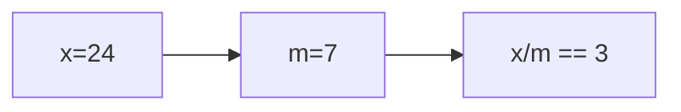

**📖 Penjelasan:**
**Langkah Tracing:**
1. x=24, m=7.
2. 24/7 = 3.43. Karena `int`, desimal dibuang.
3. Hasil: 3.

---
### Soal 212
```cpp
int a = 64, b = 4;
int res = a / b;
```
**Pertanyaan:**
1. Berapakah hasil akhirnya?
2. Mengapa demikian?

**Jawaban & Diagnosis:**
1. **16**
2. Lihat Tracing.

**Mermaid Flowchart:**
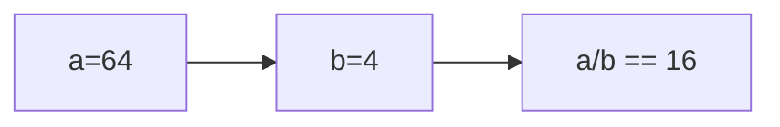

**📖 Penjelasan:**
**Langkah Tracing:**
1. a=64, b=4.
2. 64/4 = 16.00. Karena `int`, desimal dibuang.
3. Hasil: 16.

---
### Soal 213
```cpp
char ch = 'B';
ch = ch + (1);
```
**Pertanyaan:**
1. Berapakah hasil akhirnya?
2. Mengapa demikian?

**Jawaban & Diagnosis:**
1. **C**
2. Lihat Tracing.

**Mermaid Flowchart:**
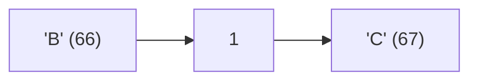

**📖 Penjelasan:**
**Langkah Tracing:**
1. ch='B' (ASCII 66).
2. 66 + (1) = 67.
3. Hasil: 'C'.

---
### Soal 214
```cpp
char ch = 'A';
ch = ch + (1);
```
**Pertanyaan:**
1. Berapakah hasil akhirnya?
2. Mengapa demikian?

**Jawaban & Diagnosis:**
1. **B**
2. Lihat Tracing.

**Mermaid Flowchart:**
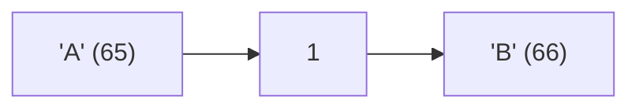

**📖 Penjelasan:**
**Langkah Tracing:**
1. ch='A' (ASCII 65).
2. 65 + (1) = 66.
3. Hasil: 'B'.

---
### Soal 215
```cpp
int n = 12;
int m = 2;
int res = n % m;
```
**Pertanyaan:**
1. Berapakah hasil akhirnya?
2. Mengapa demikian?

**Jawaban & Diagnosis:**
1. **0**
2. Lihat Tracing.

**Mermaid Flowchart:**
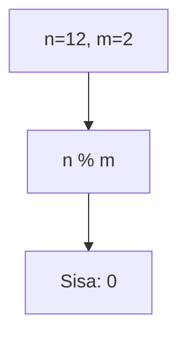

**📖 Penjelasan:**
**Langkah Tracing:**
1. n=12, m=2.
2. 12 dibagi 2 sisa 0.
3. Hasil: 0.

---
### Soal 216
```cpp
char ch = 'B';
ch = ch + (2);
```
**Pertanyaan:**
1. Berapakah hasil akhirnya?
2. Mengapa demikian?

**Jawaban & Diagnosis:**
1. **D**
2. Lihat Tracing.

**Mermaid Flowchart:**
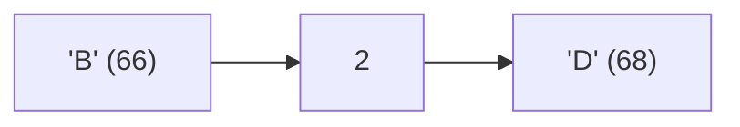

**📖 Penjelasan:**
**Langkah Tracing:**
1. ch='B' (ASCII 66).
2. 66 + (2) = 68.
3. Hasil: 'D'.

---
### Soal 217
```cpp
int n = 42;
int m = 10;
int res = n % m;
```
**Pertanyaan:**
1. Berapakah hasil akhirnya?
2. Mengapa demikian?

**Jawaban & Diagnosis:**
1. **2**
2. Lihat Tracing.

**Mermaid Flowchart:**
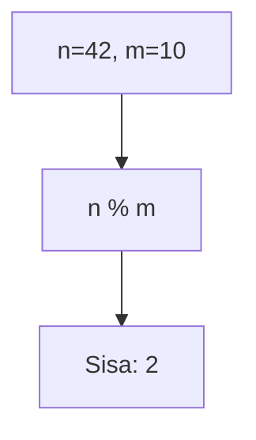

**📖 Penjelasan:**
**Langkah Tracing:**
1. n=42, m=10.
2. 42 dibagi 10 sisa 2.
3. Hasil: 2.

---
### Soal 218
```cpp
char ch = 'B';
ch = ch + (4);
```
**Pertanyaan:**
1. Berapakah hasil akhirnya?
2. Mengapa demikian?

**Jawaban & Diagnosis:**
1. **F**
2. Lihat Tracing.

**Mermaid Flowchart:**
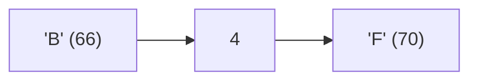

**📖 Penjelasan:**
**Langkah Tracing:**
1. ch='B' (ASCII 66).
2. 66 + (4) = 70.
3. Hasil: 'F'.

---
### Soal 219
```cpp
double val = 99.18;
int res = (int)val;
```
**Pertanyaan:**
1. Berapakah hasil akhirnya?
2. Mengapa demikian?

**Jawaban & Diagnosis:**
1. **99**
2. Lihat Tracing.

**Mermaid Flowchart:**
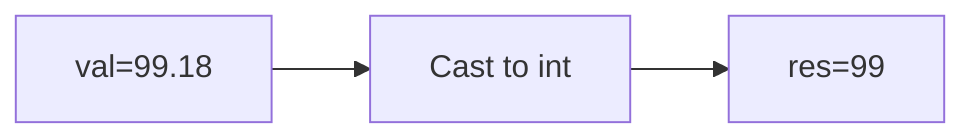

**📖 Penjelasan:**
**Langkah Tracing:**
1. val=99.18.
2. Desimal dihilangkan.
3. Hasil: 99.

---
### Soal 220
```cpp
int a = 53, y = 6;
int res = a / y;
```
**Pertanyaan:**
1. Berapakah hasil akhirnya?
2. Mengapa demikian?

**Jawaban & Diagnosis:**
1. **8**
2. Lihat Tracing.

**Mermaid Flowchart:**
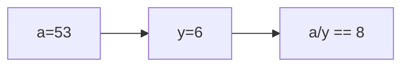

**📖 Penjelasan:**
**Langkah Tracing:**
1. a=53, y=6.
2. 53/6 = 8.83. Karena `int`, desimal dibuang.
3. Hasil: 8.

---
### Soal 221
```cpp
int n = 44;
int m = 2;
int res = n % m;
```
**Pertanyaan:**
1. Berapakah hasil akhirnya?
2. Mengapa demikian?

**Jawaban & Diagnosis:**
1. **0**
2. Lihat Tracing.

**Mermaid Flowchart:**
```mermaid
graph TD
A["n=44, m=2"] --> B["n % m"]
B --> C["Sisa: 0"]
```

**📖 Penjelasan:**
**Langkah Tracing:**
1. n=44, m=2.
2. 44 dibagi 2 sisa 0.
3. Hasil: 0.

---
### Soal 222
```cpp
double val = 63.13;
int res = (int)val;
```
**Pertanyaan:**
1. Berapakah hasil akhirnya?
2. Mengapa demikian?

**Jawaban & Diagnosis:**
1. **63**
2. Lihat Tracing.

**Mermaid Flowchart:**
```mermaid
graph LR
A["val=63.13"] --> B["Cast to int"]
B --> C["res=63"]
```

**📖 Penjelasan:**
**Langkah Tracing:**
1. val=63.13.
2. Desimal dihilangkan.
3. Hasil: 63.

---
### Soal 223
```cpp
int a = 66, m = 8;
int res = a / m;
```
**Pertanyaan:**
1. Berapakah hasil akhirnya?
2. Mengapa demikian?

**Jawaban & Diagnosis:**
1. **8**
2. Lihat Tracing.

**Mermaid Flowchart:**
```mermaid
graph LR
A["a=66"] --> B["m=8"]
B --> C["a/m == 8"]
```

**📖 Penjelasan:**
**Langkah Tracing:**
1. a=66, m=8.
2. 66/8 = 8.25. Karena `int`, desimal dibuang.
3. Hasil: 8.

---
### Soal 224
```cpp
int n = 13;
int m = 10;
int res = n % m;
```
**Pertanyaan:**
1. Berapakah hasil akhirnya?
2. Mengapa demikian?

**Jawaban & Diagnosis:**
1. **3**
2. Lihat Tracing.

**Mermaid Flowchart:**
```mermaid
graph TD
A["n=13, m=10"] --> B["n % m"]
B --> C["Sisa: 3"]
```

**📖 Penjelasan:**
**Langkah Tracing:**
1. n=13, m=10.
2. 13 dibagi 10 sisa 3.
3. Hasil: 3.

---
### Soal 225
```cpp
int a = 77, b = 2;
int res = a / b;
```
**Pertanyaan:**
1. Berapakah hasil akhirnya?
2. Mengapa demikian?

**Jawaban & Diagnosis:**
1. **38**
2. Lihat Tracing.

**Mermaid Flowchart:**
```mermaid
graph LR
A["a=77"] --> B["b=2"]
B --> C["a/b == 38"]
```

**📖 Penjelasan:**
**Langkah Tracing:**
1. a=77, b=2.
2. 77/2 = 38.50. Karena `int`, desimal dibuang.
3. Hasil: 38.

---
