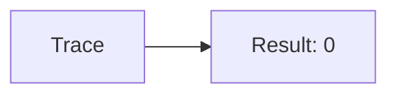
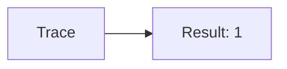
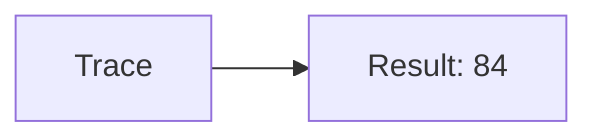
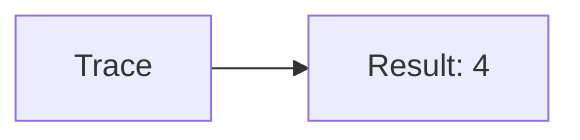
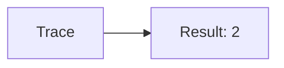
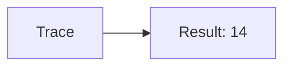
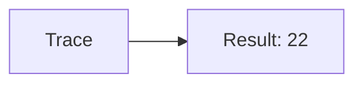
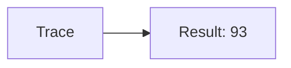

🔙 **[Kembali ke Daftar Soal](./README.md)**

---

# Latihan Soal Part C - Modul 01 - Set 10

### Soal 226
```cpp
// Laptop: Modulo
int laptop = 35, bagi = 5;
int sisa = laptop % bagi;
```
**Pertanyaan:**
1. Berapakah hasil akhirnya?
2. Deskripsikan alur pikir 'Compiler Manusia' untuk soal ini!

**Jawaban & Diagnosis:**
1. **0**
2. 35 Laptop dibagi 5 sisa 0.

**Mermaid Flowchart:**


---
### Soal 227
```cpp
// Mouse: Casting
double val = 24.51;
int res = (int)val;
```
**Pertanyaan:**
1. Berapakah hasil akhirnya?
2. Deskripsikan alur pikir 'Compiler Manusia' untuk soal ini!

**Jawaban & Diagnosis:**
1. **24**
2. Mengubah 24.51 jadi integer (pangkas koma) jadi 24.

**Mermaid Flowchart:**


---
### Soal 228
```cpp
// Keyboard: Pembagian
int keyboard = 28, bagi = 8;
int hasil = keyboard / bagi;
```
**Pertanyaan:**
1. Berapakah hasil akhirnya?
2. Deskripsikan alur pikir 'Compiler Manusia' untuk soal ini!

**Jawaban & Diagnosis:**
1. **3**
2. Membagi 28 Keyboard ke 8 bagian. Hasil bulat: 3.

**Mermaid Flowchart:**


---
### Soal 229
```cpp
// Monitor: Modulo
int monitor = 61, bagi = 6;
int sisa = monitor % bagi;
```
**Pertanyaan:**
1. Berapakah hasil akhirnya?
2. Deskripsikan alur pikir 'Compiler Manusia' untuk soal ini!

**Jawaban & Diagnosis:**
1. **1**
2. 61 Monitor dibagi 6 sisa 1.

**Mermaid Flowchart:**


---
### Soal 230
```cpp
// Kabel: Casting
double val = 84.41;
int res = (int)val;
```
**Pertanyaan:**
1. Berapakah hasil akhirnya?
2. Deskripsikan alur pikir 'Compiler Manusia' untuk soal ini!

**Jawaban & Diagnosis:**
1. **84**
2. Mengubah 84.41 jadi integer (pangkas koma) jadi 84.

**Mermaid Flowchart:**


---
### Soal 231
```cpp
// Steker: Pembagian
int steker = 25, bagi = 3;
int hasil = steker / bagi;
```
**Pertanyaan:**
1. Berapakah hasil akhirnya?
2. Deskripsikan alur pikir 'Compiler Manusia' untuk soal ini!

**Jawaban & Diagnosis:**
1. **8**
2. Membagi 25 Steker ke 3 bagian. Hasil bulat: 8.

**Mermaid Flowchart:**


---
### Soal 232
```cpp
// Saklar: Modulo
int saklar = 34, bagi = 5;
int sisa = saklar % bagi;
```
**Pertanyaan:**
1. Berapakah hasil akhirnya?
2. Deskripsikan alur pikir 'Compiler Manusia' untuk soal ini!

**Jawaban & Diagnosis:**
1. **4**
2. 34 Saklar dibagi 5 sisa 4.

**Mermaid Flowchart:**


---
### Soal 233
```cpp
// Baterai: Casting
double val = 58.51;
int res = (int)val;
```
**Pertanyaan:**
1. Berapakah hasil akhirnya?
2. Deskripsikan alur pikir 'Compiler Manusia' untuk soal ini!

**Jawaban & Diagnosis:**
1. **58**
2. Mengubah 58.51 jadi integer (pangkas koma) jadi 58.

**Mermaid Flowchart:**


---
### Soal 234
```cpp
// Jam: Pembagian
int jam = 46, bagi = 2;
int hasil = jam / bagi;
```
**Pertanyaan:**
1. Berapakah hasil akhirnya?
2. Deskripsikan alur pikir 'Compiler Manusia' untuk soal ini!

**Jawaban & Diagnosis:**
1. **23**
2. Membagi 46 Jam ke 2 bagian. Hasil bulat: 23.

**Mermaid Flowchart:**


---
### Soal 235
```cpp
// Kalender: Modulo
int kalender = 81, bagi = 3;
int sisa = kalender % bagi;
```
**Pertanyaan:**
1. Berapakah hasil akhirnya?
2. Deskripsikan alur pikir 'Compiler Manusia' untuk soal ini!

**Jawaban & Diagnosis:**
1. **0**
2. 81 Kalender dibagi 3 sisa 0.

**Mermaid Flowchart:**


---
### Soal 236
```cpp
// Kaca: Casting
double val = 54.61;
int res = (int)val;
```
**Pertanyaan:**
1. Berapakah hasil akhirnya?
2. Deskripsikan alur pikir 'Compiler Manusia' untuk soal ini!

**Jawaban & Diagnosis:**
1. **54**
2. Mengubah 54.61 jadi integer (pangkas koma) jadi 54.

**Mermaid Flowchart:**


---
### Soal 237
```cpp
// Pintu: Pembagian
int pintu = 50, bagi = 8;
int hasil = pintu / bagi;
```
**Pertanyaan:**
1. Berapakah hasil akhirnya?
2. Deskripsikan alur pikir 'Compiler Manusia' untuk soal ini!

**Jawaban & Diagnosis:**
1. **6**
2. Membagi 50 Pintu ke 8 bagian. Hasil bulat: 6.

**Mermaid Flowchart:**


---
### Soal 238
```cpp
// Jendela: Modulo
int jendela = 62, bagi = 6;
int sisa = jendela % bagi;
```
**Pertanyaan:**
1. Berapakah hasil akhirnya?
2. Deskripsikan alur pikir 'Compiler Manusia' untuk soal ini!

**Jawaban & Diagnosis:**
1. **2**
2. 62 Jendela dibagi 6 sisa 2.

**Mermaid Flowchart:**


---
### Soal 239
```cpp
// Lantai: Casting
double val = 56.81;
int res = (int)val;
```
**Pertanyaan:**
1. Berapakah hasil akhirnya?
2. Deskripsikan alur pikir 'Compiler Manusia' untuk soal ini!

**Jawaban & Diagnosis:**
1. **56**
2. Mengubah 56.81 jadi integer (pangkas koma) jadi 56.

**Mermaid Flowchart:**


---
### Soal 240
```cpp
// Atap: Pembagian
int atap = 88, bagi = 6;
int hasil = atap / bagi;
```
**Pertanyaan:**
1. Berapakah hasil akhirnya?
2. Deskripsikan alur pikir 'Compiler Manusia' untuk soal ini!

**Jawaban & Diagnosis:**
1. **14**
2. Membagi 88 Atap ke 6 bagian. Hasil bulat: 14.

**Mermaid Flowchart:**


---
### Soal 241
```cpp
// Dinding: Modulo
int dinding = 46, bagi = 3;
int sisa = dinding % bagi;
```
**Pertanyaan:**
1. Berapakah hasil akhirnya?
2. Deskripsikan alur pikir 'Compiler Manusia' untuk soal ini!

**Jawaban & Diagnosis:**
1. **1**
2. 46 Dinding dibagi 3 sisa 1.

**Mermaid Flowchart:**


---
### Soal 242
```cpp
// Pagar: Casting
double val = 22.21;
int res = (int)val;
```
**Pertanyaan:**
1. Berapakah hasil akhirnya?
2. Deskripsikan alur pikir 'Compiler Manusia' untuk soal ini!

**Jawaban & Diagnosis:**
1. **22**
2. Mengubah 22.21 jadi integer (pangkas koma) jadi 22.

**Mermaid Flowchart:**


---
### Soal 243
```cpp
// Kebun: Pembagian
int kebun = 37, bagi = 3;
int hasil = kebun / bagi;
```
**Pertanyaan:**
1. Berapakah hasil akhirnya?
2. Deskripsikan alur pikir 'Compiler Manusia' untuk soal ini!

**Jawaban & Diagnosis:**
1. **12**
2. Membagi 37 Kebun ke 3 bagian. Hasil bulat: 12.

**Mermaid Flowchart:**


---
### Soal 244
```cpp
// Pohon: Modulo
int pohon = 30, bagi = 2;
int sisa = pohon % bagi;
```
**Pertanyaan:**
1. Berapakah hasil akhirnya?
2. Deskripsikan alur pikir 'Compiler Manusia' untuk soal ini!

**Jawaban & Diagnosis:**
1. **0**
2. 30 Pohon dibagi 2 sisa 0.

**Mermaid Flowchart:**


---
### Soal 245
```cpp
// Daun: Casting
double val = 93.21;
int res = (int)val;
```
**Pertanyaan:**
1. Berapakah hasil akhirnya?
2. Deskripsikan alur pikir 'Compiler Manusia' untuk soal ini!

**Jawaban & Diagnosis:**
1. **93**
2. Mengubah 93.21 jadi integer (pangkas koma) jadi 93.

**Mermaid Flowchart:**


---
### Soal 246
```cpp
// Bunga: Pembagian
int bunga = 33, bagi = 4;
int hasil = bunga / bagi;
```
**Pertanyaan:**
1. Berapakah hasil akhirnya?
2. Deskripsikan alur pikir 'Compiler Manusia' untuk soal ini!

**Jawaban & Diagnosis:**
1. **8**
2. Membagi 33 Bunga ke 4 bagian. Hasil bulat: 8.

**Mermaid Flowchart:**
```mermaid
graph LR
A[Trace] --> B[Result: 8]
```

---
### Soal 247
```cpp
// Akar: Modulo
int akar = 40, bagi = 3;
int sisa = akar % bagi;
```
**Pertanyaan:**
1. Berapakah hasil akhirnya?
2. Deskripsikan alur pikir 'Compiler Manusia' untuk soal ini!

**Jawaban & Diagnosis:**
1. **1**
2. 40 Akar dibagi 3 sisa 1.

**Mermaid Flowchart:**
```mermaid
graph LR
A[Trace] --> B[Result: 1]
```

---
### Soal 248
```cpp
// Tanah: Casting
double val = 21.61;
int res = (int)val;
```
**Pertanyaan:**
1. Berapakah hasil akhirnya?
2. Deskripsikan alur pikir 'Compiler Manusia' untuk soal ini!

**Jawaban & Diagnosis:**
1. **21**
2. Mengubah 21.61 jadi integer (pangkas koma) jadi 21.

**Mermaid Flowchart:**
```mermaid
graph LR
A[Trace] --> B[Result: 21]
```

---
### Soal 249
```cpp
// Pasir: Pembagian
int pasir = 39, bagi = 4;
int hasil = pasir / bagi;
```
**Pertanyaan:**
1. Berapakah hasil akhirnya?
2. Deskripsikan alur pikir 'Compiler Manusia' untuk soal ini!

**Jawaban & Diagnosis:**
1. **9**
2. Membagi 39 Pasir ke 4 bagian. Hasil bulat: 9.

**Mermaid Flowchart:**
```mermaid
graph LR
A[Trace] --> B[Result: 9]
```

---
### Soal 250
```cpp
// Batu: Modulo
int batu = 88, bagi = 3;
int sisa = batu % bagi;
```
**Pertanyaan:**
1. Berapakah hasil akhirnya?
2. Deskripsikan alur pikir 'Compiler Manusia' untuk soal ini!

**Jawaban & Diagnosis:**
1. **1**
2. 88 Batu dibagi 3 sisa 1.

**Mermaid Flowchart:**
```mermaid
graph LR
A[Trace] --> B[Result: 1]
```

---
