🔙 **[Kembali ke Daftar Soal](./README.md)**

---

# Latihan Soal Part C - Modul 01 - Set 10

### Soal 226
```cpp
int x = 79, y = 3;
int res = x / y;
```
**Pertanyaan:**
1. Berapakah hasil akhirnya?
2. Mengapa demikian?

**Jawaban & Diagnosis:**
1. **26**
2. Lihat Tracing.

**Mermaid Flowchart:**
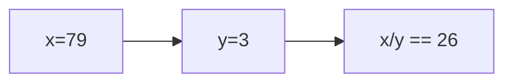

**📖 Penjelasan:**
**Langkah Tracing:**
1. x=79, y=3.
2. 79/3 = 26.33. Karena `int`, desimal dibuang.
3. Hasil: 26.

---
### Soal 227
```cpp
char ch = 'B';
ch = ch + (2);
```
**Pertanyaan:**
1. Berapakah hasil akhirnya?
2. Mengapa demikian?

**Jawaban & Diagnosis:**
1. **D**
2. Lihat Tracing.

**Mermaid Flowchart:**
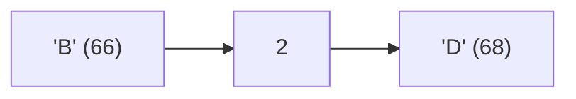

**📖 Penjelasan:**
**Langkah Tracing:**
1. ch='B' (ASCII 66).
2. 66 + (2) = 68.
3. Hasil: 'D'.

---
### Soal 228
```cpp
int n = 30;
int m = 2;
int res = n % m;
```
**Pertanyaan:**
1. Berapakah hasil akhirnya?
2. Mengapa demikian?

**Jawaban & Diagnosis:**
1. **0**
2. Lihat Tracing.

**Mermaid Flowchart:**


**📖 Penjelasan:**
**Langkah Tracing:**
1. n=30, m=2.
2. 30 dibagi 2 sisa 0.
3. Hasil: 0.

---
### Soal 229
```cpp
int n = 5;
int m = 2;
int res = n % m;
```
**Pertanyaan:**
1. Berapakah hasil akhirnya?
2. Mengapa demikian?

**Jawaban & Diagnosis:**
1. **1**
2. Lihat Tracing.

**Mermaid Flowchart:**
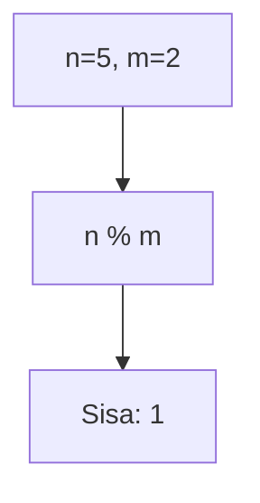

**📖 Penjelasan:**
**Langkah Tracing:**
1. n=5, m=2.
2. 5 dibagi 2 sisa 1.
3. Hasil: 1.

---
### Soal 230
```cpp
double val = 65.53;
int res = (int)val;
```
**Pertanyaan:**
1. Berapakah hasil akhirnya?
2. Mengapa demikian?

**Jawaban & Diagnosis:**
1. **65**
2. Lihat Tracing.

**Mermaid Flowchart:**
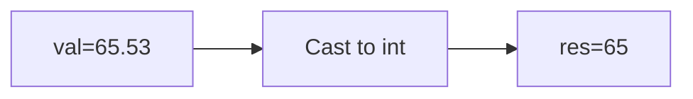

**📖 Penjelasan:**
**Langkah Tracing:**
1. val=65.53.
2. Desimal dihilangkan.
3. Hasil: 65.

---
### Soal 231
```cpp
int n = 35;
int m = 2;
int res = n % m;
```
**Pertanyaan:**
1. Berapakah hasil akhirnya?
2. Mengapa demikian?

**Jawaban & Diagnosis:**
1. **1**
2. Lihat Tracing.

**Mermaid Flowchart:**
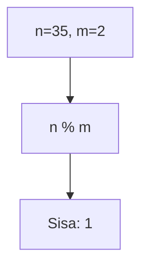

**📖 Penjelasan:**
**Langkah Tracing:**
1. n=35, m=2.
2. 35 dibagi 2 sisa 1.
3. Hasil: 1.

---
### Soal 232
```cpp
int n = 42;
int m = 10;
int res = n % m;
```
**Pertanyaan:**
1. Berapakah hasil akhirnya?
2. Mengapa demikian?

**Jawaban & Diagnosis:**
1. **2**
2. Lihat Tracing.

**Mermaid Flowchart:**
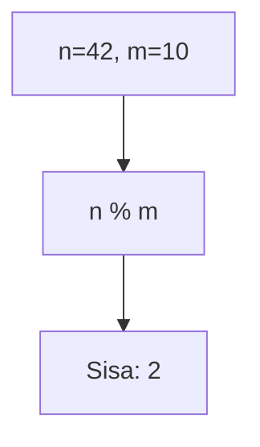

**📖 Penjelasan:**
**Langkah Tracing:**
1. n=42, m=10.
2. 42 dibagi 10 sisa 2.
3. Hasil: 2.

---
### Soal 233
```cpp
char ch = 'A';
ch = ch + (1);
```
**Pertanyaan:**
1. Berapakah hasil akhirnya?
2. Mengapa demikian?

**Jawaban & Diagnosis:**
1. **B**
2. Lihat Tracing.

**Mermaid Flowchart:**
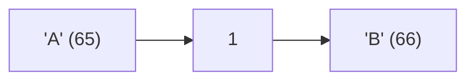

**📖 Penjelasan:**
**Langkah Tracing:**
1. ch='A' (ASCII 65).
2. 65 + (1) = 66.
3. Hasil: 'B'.

---
### Soal 234
```cpp
int n = 7;
int m = 2;
int res = n % m;
```
**Pertanyaan:**
1. Berapakah hasil akhirnya?
2. Mengapa demikian?

**Jawaban & Diagnosis:**
1. **1**
2. Lihat Tracing.

**Mermaid Flowchart:**
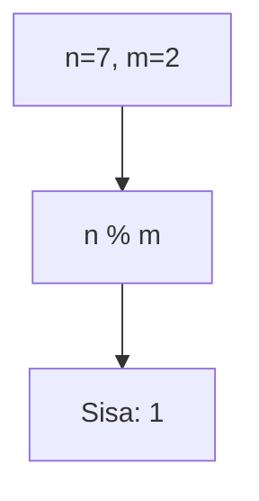

**📖 Penjelasan:**
**Langkah Tracing:**
1. n=7, m=2.
2. 7 dibagi 2 sisa 1.
3. Hasil: 1.

---
### Soal 235
```cpp
double val = 52.32;
int res = (int)val;
```
**Pertanyaan:**
1. Berapakah hasil akhirnya?
2. Mengapa demikian?

**Jawaban & Diagnosis:**
1. **52**
2. Lihat Tracing.

**Mermaid Flowchart:**
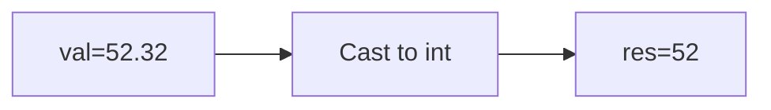

**📖 Penjelasan:**
**Langkah Tracing:**
1. val=52.32.
2. Desimal dihilangkan.
3. Hasil: 52.

---
### Soal 236
```cpp
int n = 45, b = 5;
int res = n / b;
```
**Pertanyaan:**
1. Berapakah hasil akhirnya?
2. Mengapa demikian?

**Jawaban & Diagnosis:**
1. **9**
2. Lihat Tracing.

**Mermaid Flowchart:**
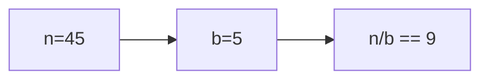

**📖 Penjelasan:**
**Langkah Tracing:**
1. n=45, b=5.
2. 45/5 = 9.00. Karena `int`, desimal dibuang.
3. Hasil: 9.

---
### Soal 237
```cpp
double val = 74.49;
int res = (int)val;
```
**Pertanyaan:**
1. Berapakah hasil akhirnya?
2. Mengapa demikian?

**Jawaban & Diagnosis:**
1. **74**
2. Lihat Tracing.

**Mermaid Flowchart:**
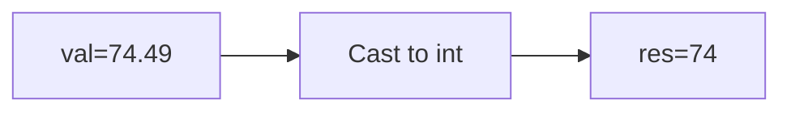

**📖 Penjelasan:**
**Langkah Tracing:**
1. val=74.49.
2. Desimal dihilangkan.
3. Hasil: 74.

---
### Soal 238
```cpp
char ch = 'm';
ch = ch + (2);
```
**Pertanyaan:**
1. Berapakah hasil akhirnya?
2. Mengapa demikian?

**Jawaban & Diagnosis:**
1. **o**
2. Lihat Tracing.

**Mermaid Flowchart:**
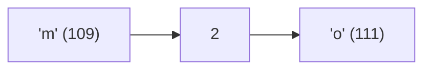

**📖 Penjelasan:**
**Langkah Tracing:**
1. ch='m' (ASCII 109).
2. 109 + (2) = 111.
3. Hasil: 'o'.

---
### Soal 239
```cpp
int a = 83, m = 7;
int res = a / m;
```
**Pertanyaan:**
1. Berapakah hasil akhirnya?
2. Mengapa demikian?

**Jawaban & Diagnosis:**
1. **11**
2. Lihat Tracing.

**Mermaid Flowchart:**
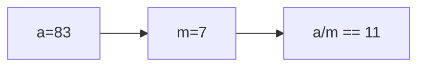

**📖 Penjelasan:**
**Langkah Tracing:**
1. a=83, m=7.
2. 83/7 = 11.86. Karena `int`, desimal dibuang.
3. Hasil: 11.

---
### Soal 240
```cpp
int n = 19;
int m = 5;
int res = n % m;
```
**Pertanyaan:**
1. Berapakah hasil akhirnya?
2. Mengapa demikian?

**Jawaban & Diagnosis:**
1. **4**
2. Lihat Tracing.

**Mermaid Flowchart:**
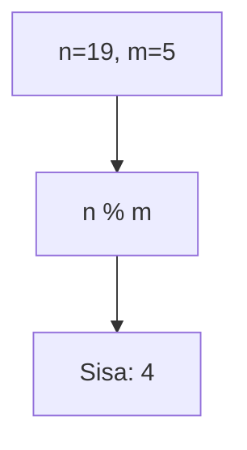

**📖 Penjelasan:**
**Langkah Tracing:**
1. n=19, m=5.
2. 19 dibagi 5 sisa 4.
3. Hasil: 4.

---
### Soal 241
```cpp
double val = 74.17;
int res = (int)val;
```
**Pertanyaan:**
1. Berapakah hasil akhirnya?
2. Mengapa demikian?

**Jawaban & Diagnosis:**
1. **74**
2. Lihat Tracing.

**Mermaid Flowchart:**
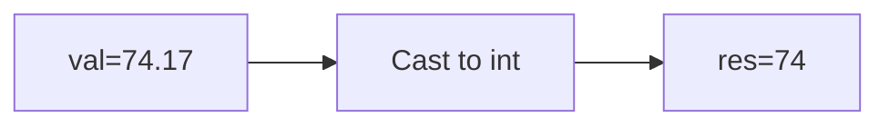

**📖 Penjelasan:**
**Langkah Tracing:**
1. val=74.17.
2. Desimal dihilangkan.
3. Hasil: 74.

---
### Soal 242
```cpp
int n = 19;
int m = 10;
int res = n % m;
```
**Pertanyaan:**
1. Berapakah hasil akhirnya?
2. Mengapa demikian?

**Jawaban & Diagnosis:**
1. **9**
2. Lihat Tracing.

**Mermaid Flowchart:**
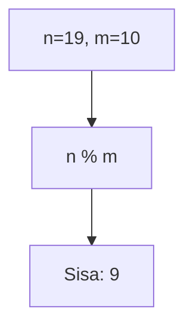

**📖 Penjelasan:**
**Langkah Tracing:**
1. n=19, m=10.
2. 19 dibagi 10 sisa 9.
3. Hasil: 9.

---
### Soal 243
```cpp
double val = 35.23;
int res = (int)val;
```
**Pertanyaan:**
1. Berapakah hasil akhirnya?
2. Mengapa demikian?

**Jawaban & Diagnosis:**
1. **35**
2. Lihat Tracing.

**Mermaid Flowchart:**


**📖 Penjelasan:**
**Langkah Tracing:**
1. val=35.23.
2. Desimal dihilangkan.
3. Hasil: 35.

---
### Soal 244
```cpp
int n = 49;
int m = 10;
int res = n % m;
```
**Pertanyaan:**
1. Berapakah hasil akhirnya?
2. Mengapa demikian?

**Jawaban & Diagnosis:**
1. **9**
2. Lihat Tracing.

**Mermaid Flowchart:**


**📖 Penjelasan:**
**Langkah Tracing:**
1. n=49, m=10.
2. 49 dibagi 10 sisa 9.
3. Hasil: 9.

---
### Soal 245
```cpp
int n = 42;
int m = 3;
int res = n % m;
```
**Pertanyaan:**
1. Berapakah hasil akhirnya?
2. Mengapa demikian?

**Jawaban & Diagnosis:**
1. **0**
2. Lihat Tracing.

**Mermaid Flowchart:**
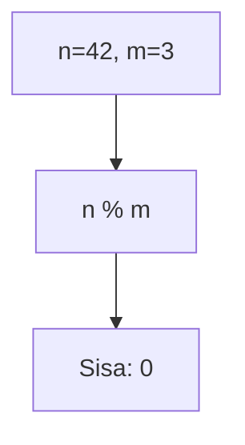

**📖 Penjelasan:**
**Langkah Tracing:**
1. n=42, m=3.
2. 42 dibagi 3 sisa 0.
3. Hasil: 0.

---
### Soal 246
```cpp
int a = 87, y = 5;
int res = a / y;
```
**Pertanyaan:**
1. Berapakah hasil akhirnya?
2. Mengapa demikian?

**Jawaban & Diagnosis:**
1. **17**
2. Lihat Tracing.

**Mermaid Flowchart:**
```mermaid
graph LR
A["a=87"] --> B["y=5"]
B --> C["a/y == 17"]
```

**📖 Penjelasan:**
**Langkah Tracing:**
1. a=87, y=5.
2. 87/5 = 17.40. Karena `int`, desimal dibuang.
3. Hasil: 17.

---
### Soal 247
```cpp
char ch = 'B';
ch = ch + (-2);
```
**Pertanyaan:**
1. Berapakah hasil akhirnya?
2. Mengapa demikian?

**Jawaban & Diagnosis:**
1. **@**
2. Lihat Tracing.

**Mermaid Flowchart:**
```mermaid
graph LR
A["'B' (66)"] --> B["-2"]
B --> C["'@' (64)"]
```

**📖 Penjelasan:**
**Langkah Tracing:**
1. ch='B' (ASCII 66).
2. 66 + (-2) = 64.
3. Hasil: '@'.

---
### Soal 248
```cpp
double val = 69.39;
int res = (int)val;
```
**Pertanyaan:**
1. Berapakah hasil akhirnya?
2. Mengapa demikian?

**Jawaban & Diagnosis:**
1. **69**
2. Lihat Tracing.

**Mermaid Flowchart:**
```mermaid
graph LR
A["val=69.39"] --> B["Cast to int"]
B --> C["res=69"]
```

**📖 Penjelasan:**
**Langkah Tracing:**
1. val=69.39.
2. Desimal dihilangkan.
3. Hasil: 69.

---
### Soal 249
```cpp
double val = 33.30;
int res = (int)val;
```
**Pertanyaan:**
1. Berapakah hasil akhirnya?
2. Mengapa demikian?

**Jawaban & Diagnosis:**
1. **33**
2. Lihat Tracing.

**Mermaid Flowchart:**
```mermaid
graph LR
A["val=33.30"] --> B["Cast to int"]
B --> C["res=33"]
```

**📖 Penjelasan:**
**Langkah Tracing:**
1. val=33.30.
2. Desimal dihilangkan.
3. Hasil: 33.

---
### Soal 250
```cpp
int x = 65, m = 9;
int res = x / m;
```
**Pertanyaan:**
1. Berapakah hasil akhirnya?
2. Mengapa demikian?

**Jawaban & Diagnosis:**
1. **7**
2. Lihat Tracing.

**Mermaid Flowchart:**
```mermaid
graph LR
A["x=65"] --> B["m=9"]
B --> C["x/m == 7"]
```

**📖 Penjelasan:**
**Langkah Tracing:**
1. x=65, m=9.
2. 65/9 = 7.22. Karena `int`, desimal dibuang.
3. Hasil: 7.

---
