# Latihan Soal Part C - Modul 01 - Set 10

### Soal 226 (Modulo Magic)
```cpp
int x = 81;
int m1 = 2;
int m2 = 5;
int res_x = x % m1;
int res_y = x % m2;
```
**Pertanyaan:**
1. Apakah `x` genap atau ganjil?
2. Berapakah sisa bagi `x % m2`?
3. Apa guna operator `%` dalam OSN-K?

**Jawaban & Diagnosis:**
1. **Ganjil**
2. **1**
3. **Untuk mencari sisa bagi (sisa kelereng) atau mendeteksi pola perulangan/genap-ganjil.**

**Mermaid Flowchart:**
```mermaid
graph TD
    A[x=81] --> Bx % 2 == 0?
    B -- Ya --> C[Genap]
    B -- Tidak --> D[Ganjil]
    A --> E["x % 5"]
    E --> F["Sisa: 1"]
```

**📖 Cara Membaca Diagram:**
x=81. Cek `x % 2`: 81%2 = 1. Jika 0 genap, jika 1 ganjil. Cek `x % 5`: 81/5 = 16 sisa 1.

---
### Soal 227 (Modulo Magic)
```cpp
int x = 97;
int m1 = 2;
int m2 = 5;
int res_x = x % m1;
int res_y = x % m2;
```
**Pertanyaan:**
1. Apakah `x` genap atau ganjil?
2. Berapakah sisa bagi `x % m2`?
3. Apa guna operator `%` dalam OSN-K?

**Jawaban & Diagnosis:**
1. **Ganjil**
2. **2**
3. **Untuk mencari sisa bagi (sisa kelereng) atau mendeteksi pola perulangan/genap-ganjil.**

**Mermaid Flowchart:**
```mermaid
graph TD
    A[x=97] --> Bx % 2 == 0?
    B -- Ya --> C[Genap]
    B -- Tidak --> D[Ganjil]
    A --> E["x % 5"]
    E --> F["Sisa: 2"]
```

**📖 Cara Membaca Diagram:**
x=97. Cek `x % 2`: 97%2 = 1. Jika 0 genap, jika 1 ganjil. Cek `x % 5`: 97/5 = 19 sisa 2.

---
### Soal 228 (ASCII Math)
```cpp
char c = 'E';
int jump = 1;
char result = c + jump;
```
**Pertanyaan:**
1. Berapakah nilai ASCII batin dari 'E'?
2. Karakter apa yang tersimpan dalam variabel `result`?
3. Jika `result` dicetak sebagai `int`, angka berapa yang muncul?

**Jawaban & Diagnosis:**
1. **69**
2. **F**
3. **70**

**Mermaid Flowchart:**
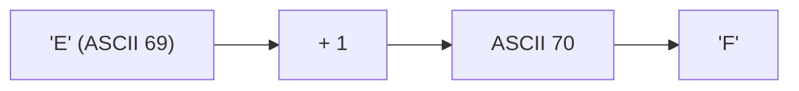

**📖 Cara Membaca Diagram:**
Karakter 'E' punya kode batin ASCII 69. Ditambah 1 langkah menjadi 70. Kode 70 adalah huruf 'F'.

---
### Soal 229 (Casting War)
```cpp
int i = 7;
int j = 2;
double res1 = i / j;
double res2 = (double)i / j;
```
**Pertanyaan:**
1. Berapakah isi `res1`?
2. Berapakah isi `res2`?
3. Kenapa hasil `res1` dan `res2` berbeda padahal rumusnya mirip?

**Jawaban & Diagnosis:**
1. **3.0**
2. **3.5**
3. **Pada `res1`, pembagian terjadi antar `int` sehingga koma dibantai duluan sebelum masuk double. Pada `res2`, `i` dipaksa jadi `double` dulu, sehingga koma selamat.**

**Mermaid Flowchart:**
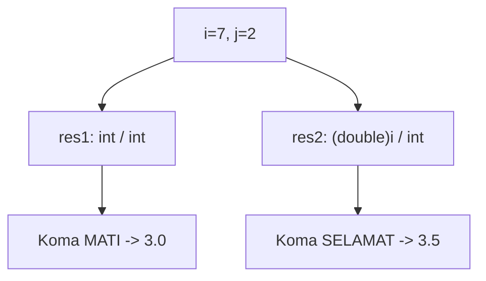

**📖 Cara Membaca Diagram:**
i=7, j=2. `res1`: 7/2 (int) = 3. Masuk double jadi 3.0. `res2`: (double)7 = 7.0. 7.0/2 = 3.5.

---
### Soal 230 (Integer Division)
```cpp
int a = 26;
int b = 5;
int c = 3;
int res1 = a / b;
int res2 = res1 / c;
```
**Pertanyaan:**
1. Berapakah nilai `res1`?
2. Berapakah nilai `res2`?
3. Mengapa `res1` tidak menghasilkan angka desimal?

**Jawaban & Diagnosis:**
1. **5**
2. **1**
3. **Karena tipe datanya `int`, setiap ada koma di belakangnya langsung dipangkas habis (Integer Division).**

**Mermaid Flowchart:**
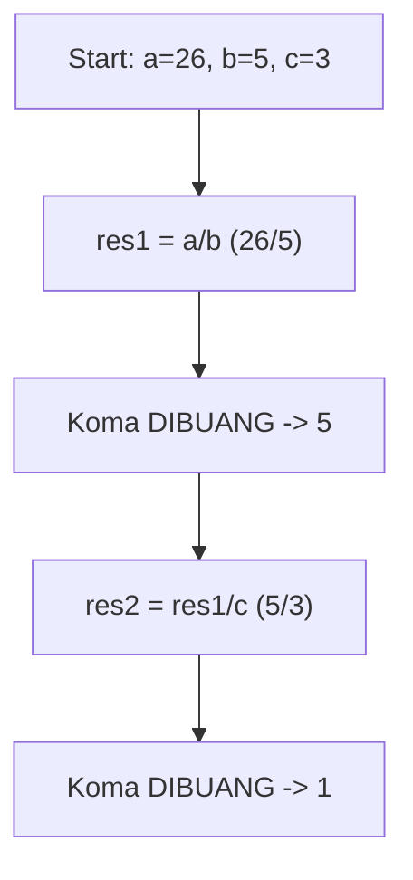

**📖 Cara Membaca Diagram:**
Mulai: a=26, b=5, c=3. Di baris `res1 = a / b`, 26/5 = 5.20, tapi karena `int`, koma dibakar jadi 5. Lalu 5/3 = 1.67, dibakar lagi jadi 1.

---
### Soal 231 (Modulo Magic)
```cpp
int x = 43;
int m1 = 2;
int m2 = 5;
int res_x = x % m1;
int res_y = x % m2;
```
**Pertanyaan:**
1. Apakah `x` genap atau ganjil?
2. Berapakah sisa bagi `x % m2`?
3. Apa guna operator `%` dalam OSN-K?

**Jawaban & Diagnosis:**
1. **Ganjil**
2. **3**
3. **Untuk mencari sisa bagi (sisa kelereng) atau mendeteksi pola perulangan/genap-ganjil.**

**Mermaid Flowchart:**
```mermaid
graph TD
    A[x=43] --> Bx % 2 == 0?
    B -- Ya --> C[Genap]
    B -- Tidak --> D[Ganjil]
    A --> E["x % 5"]
    E --> F["Sisa: 3"]
```

**📖 Cara Membaca Diagram:**
x=43. Cek `x % 2`: 43%2 = 1. Jika 0 genap, jika 1 ganjil. Cek `x % 5`: 43/5 = 8 sisa 3.

---
### Soal 232 (Casting War)
```cpp
int i = 8;
int j = 2;
double res1 = i / j;
double res2 = (double)i / j;
```
**Pertanyaan:**
1. Berapakah isi `res1`?
2. Berapakah isi `res2`?
3. Kenapa hasil `res1` dan `res2` berbeda padahal rumusnya mirip?

**Jawaban & Diagnosis:**
1. **4.0**
2. **4.0**
3. **Pada `res1`, pembagian terjadi antar `int` sehingga koma dibantai duluan sebelum masuk double. Pada `res2`, `i` dipaksa jadi `double` dulu, sehingga koma selamat.**

**Mermaid Flowchart:**


**📖 Cara Membaca Diagram:**
i=8, j=2. `res1`: 8/2 (int) = 4. Masuk double jadi 4.0. `res2`: (double)8 = 8.0. 8.0/2 = 4.0.

---
### Soal 233 (Integer Division)
```cpp
int a = 27;
int b = 7;
int c = 5;
int res1 = a / b;
int res2 = res1 / c;
```
**Pertanyaan:**
1. Berapakah nilai `res1`?
2. Berapakah nilai `res2`?
3. Mengapa `res1` tidak menghasilkan angka desimal?

**Jawaban & Diagnosis:**
1. **3**
2. **0**
3. **Karena tipe datanya `int`, setiap ada koma di belakangnya langsung dipangkas habis (Integer Division).**

**Mermaid Flowchart:**
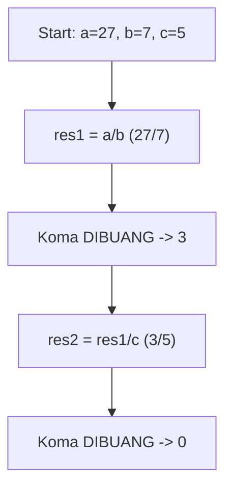

**📖 Cara Membaca Diagram:**
Mulai: a=27, b=7, c=5. Di baris `res1 = a / b`, 27/7 = 3.86, tapi karena `int`, koma dibakar jadi 3. Lalu 3/5 = 0.60, dibakar lagi jadi 0.

---
### Soal 234 (Modulo Magic)
```cpp
int x = 36;
int m1 = 2;
int m2 = 5;
int res_x = x % m1;
int res_y = x % m2;
```
**Pertanyaan:**
1. Apakah `x` genap atau ganjil?
2. Berapakah sisa bagi `x % m2`?
3. Apa guna operator `%` dalam OSN-K?

**Jawaban & Diagnosis:**
1. **Genap**
2. **1**
3. **Untuk mencari sisa bagi (sisa kelereng) atau mendeteksi pola perulangan/genap-ganjil.**

**Mermaid Flowchart:**
```mermaid
graph TD
    A[x=36] --> Bx % 2 == 0?
    B -- Ya --> C[Genap]
    B -- Tidak --> D[Ganjil]
    A --> E["x % 5"]
    E --> F["Sisa: 1"]
```

**📖 Cara Membaca Diagram:**
x=36. Cek `x % 2`: 36%2 = 0. Jika 0 genap, jika 1 ganjil. Cek `x % 5`: 36/5 = 7 sisa 1.

---
### Soal 235 (Integer Division)
```cpp
int a = 12;
int b = 3;
int c = 2;
int res1 = a / b;
int res2 = res1 / c;
```
**Pertanyaan:**
1. Berapakah nilai `res1`?
2. Berapakah nilai `res2`?
3. Mengapa `res1` tidak menghasilkan angka desimal?

**Jawaban & Diagnosis:**
1. **4**
2. **2**
3. **Karena tipe datanya `int`, setiap ada koma di belakangnya langsung dipangkas habis (Integer Division).**

**Mermaid Flowchart:**


**📖 Cara Membaca Diagram:**
Mulai: a=12, b=3, c=2. Di baris `res1 = a / b`, 12/3 = 4.00, tapi karena `int`, koma dibakar jadi 4. Lalu 4/2 = 2.00, dibakar lagi jadi 2.

---
### Soal 236 (Integer Division)
```cpp
int a = 29;
int b = 3;
int c = 3;
int res1 = a / b;
int res2 = res1 / c;
```
**Pertanyaan:**
1. Berapakah nilai `res1`?
2. Berapakah nilai `res2`?
3. Mengapa `res1` tidak menghasilkan angka desimal?

**Jawaban & Diagnosis:**
1. **9**
2. **3**
3. **Karena tipe datanya `int`, setiap ada koma di belakangnya langsung dipangkas habis (Integer Division).**

**Mermaid Flowchart:**
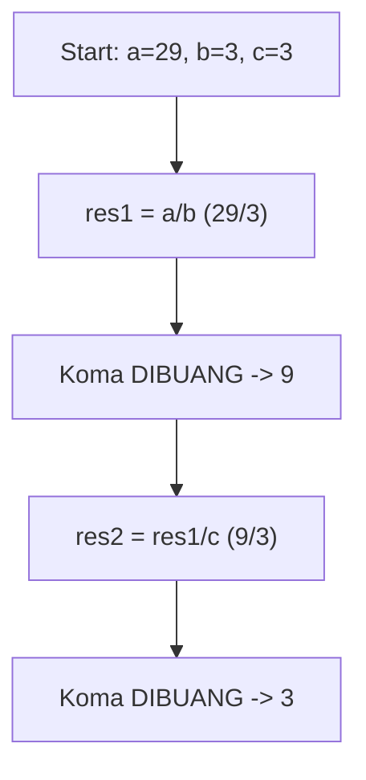

**📖 Cara Membaca Diagram:**
Mulai: a=29, b=3, c=3. Di baris `res1 = a / b`, 29/3 = 9.67, tapi karena `int`, koma dibakar jadi 9. Lalu 9/3 = 3.00, dibakar lagi jadi 3.

---
### Soal 237 (Integer Division)
```cpp
int a = 22;
int b = 4;
int c = 2;
int res1 = a / b;
int res2 = res1 / c;
```
**Pertanyaan:**
1. Berapakah nilai `res1`?
2. Berapakah nilai `res2`?
3. Mengapa `res1` tidak menghasilkan angka desimal?

**Jawaban & Diagnosis:**
1. **5**
2. **2**
3. **Karena tipe datanya `int`, setiap ada koma di belakangnya langsung dipangkas habis (Integer Division).**

**Mermaid Flowchart:**
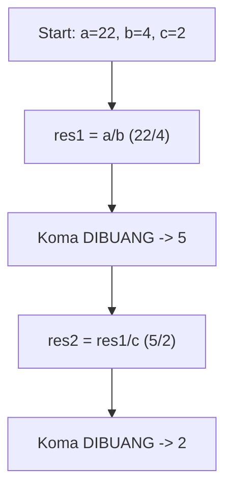

**📖 Cara Membaca Diagram:**
Mulai: a=22, b=4, c=2. Di baris `res1 = a / b`, 22/4 = 5.50, tapi karena `int`, koma dibakar jadi 5. Lalu 5/2 = 2.50, dibakar lagi jadi 2.

---
### Soal 238 (ASCII Math)
```cpp
char c = 'C';
int jump = 1;
char result = c + jump;
```
**Pertanyaan:**
1. Berapakah nilai ASCII batin dari 'C'?
2. Karakter apa yang tersimpan dalam variabel `result`?
3. Jika `result` dicetak sebagai `int`, angka berapa yang muncul?

**Jawaban & Diagnosis:**
1. **67**
2. **D**
3. **68**

**Mermaid Flowchart:**
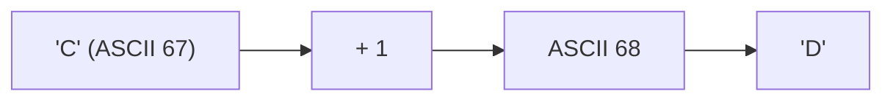

**📖 Cara Membaca Diagram:**
Karakter 'C' punya kode batin ASCII 67. Ditambah 1 langkah menjadi 68. Kode 68 adalah huruf 'D'.

---
### Soal 239 (ASCII Math)
```cpp
char c = 'A';
int jump = 2;
char result = c + jump;
```
**Pertanyaan:**
1. Berapakah nilai ASCII batin dari 'A'?
2. Karakter apa yang tersimpan dalam variabel `result`?
3. Jika `result` dicetak sebagai `int`, angka berapa yang muncul?

**Jawaban & Diagnosis:**
1. **65**
2. **C**
3. **67**

**Mermaid Flowchart:**
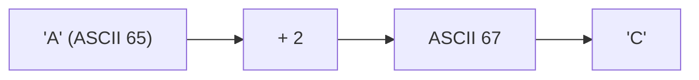

**📖 Cara Membaca Diagram:**
Karakter 'A' punya kode batin ASCII 65. Ditambah 2 langkah menjadi 67. Kode 67 adalah huruf 'C'.

---
### Soal 240 (Integer Division)
```cpp
int a = 27;
int b = 4;
int c = 4;
int res1 = a / b;
int res2 = res1 / c;
```
**Pertanyaan:**
1. Berapakah nilai `res1`?
2. Berapakah nilai `res2`?
3. Mengapa `res1` tidak menghasilkan angka desimal?

**Jawaban & Diagnosis:**
1. **6**
2. **1**
3. **Karena tipe datanya `int`, setiap ada koma di belakangnya langsung dipangkas habis (Integer Division).**

**Mermaid Flowchart:**
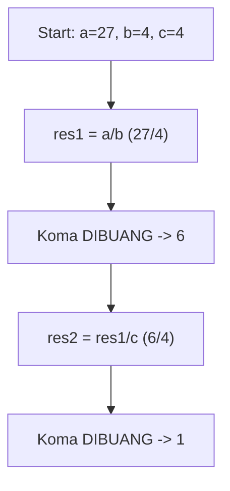

**📖 Cara Membaca Diagram:**
Mulai: a=27, b=4, c=4. Di baris `res1 = a / b`, 27/4 = 6.75, tapi karena `int`, koma dibakar jadi 6. Lalu 6/4 = 1.50, dibakar lagi jadi 1.

---
### Soal 241 (Casting War)
```cpp
int i = 10;
int j = 2;
double res1 = i / j;
double res2 = (double)i / j;
```
**Pertanyaan:**
1. Berapakah isi `res1`?
2. Berapakah isi `res2`?
3. Kenapa hasil `res1` dan `res2` berbeda padahal rumusnya mirip?

**Jawaban & Diagnosis:**
1. **5.0**
2. **5.0**
3. **Pada `res1`, pembagian terjadi antar `int` sehingga koma dibantai duluan sebelum masuk double. Pada `res2`, `i` dipaksa jadi `double` dulu, sehingga koma selamat.**

**Mermaid Flowchart:**


**📖 Cara Membaca Diagram:**
i=10, j=2. `res1`: 10/2 (int) = 5. Masuk double jadi 5.0. `res2`: (double)10 = 10.0. 10.0/2 = 5.0.

---
### Soal 242 (Casting War)
```cpp
int i = 8;
int j = 2;
double res1 = i / j;
double res2 = (double)i / j;
```
**Pertanyaan:**
1. Berapakah isi `res1`?
2. Berapakah isi `res2`?
3. Kenapa hasil `res1` dan `res2` berbeda padahal rumusnya mirip?

**Jawaban & Diagnosis:**
1. **4.0**
2. **4.0**
3. **Pada `res1`, pembagian terjadi antar `int` sehingga koma dibantai duluan sebelum masuk double. Pada `res2`, `i` dipaksa jadi `double` dulu, sehingga koma selamat.**

**Mermaid Flowchart:**


**📖 Cara Membaca Diagram:**
i=8, j=2. `res1`: 8/2 (int) = 4. Masuk double jadi 4.0. `res2`: (double)8 = 8.0. 8.0/2 = 4.0.

---
### Soal 243 (Modulo Magic)
```cpp
int x = 51;
int m1 = 2;
int m2 = 5;
int res_x = x % m1;
int res_y = x % m2;
```
**Pertanyaan:**
1. Apakah `x` genap atau ganjil?
2. Berapakah sisa bagi `x % m2`?
3. Apa guna operator `%` dalam OSN-K?

**Jawaban & Diagnosis:**
1. **Ganjil**
2. **1**
3. **Untuk mencari sisa bagi (sisa kelereng) atau mendeteksi pola perulangan/genap-ganjil.**

**Mermaid Flowchart:**
```mermaid
graph TD
    A[x=51] --> Bx % 2 == 0?
    B -- Ya --> C[Genap]
    B -- Tidak --> D[Ganjil]
    A --> E["x % 5"]
    E --> F["Sisa: 1"]
```

**📖 Cara Membaca Diagram:**
x=51. Cek `x % 2`: 51%2 = 1. Jika 0 genap, jika 1 ganjil. Cek `x % 5`: 51/5 = 10 sisa 1.

---
### Soal 244 (Integer Division)
```cpp
int a = 13;
int b = 4;
int c = 3;
int res1 = a / b;
int res2 = res1 / c;
```
**Pertanyaan:**
1. Berapakah nilai `res1`?
2. Berapakah nilai `res2`?
3. Mengapa `res1` tidak menghasilkan angka desimal?

**Jawaban & Diagnosis:**
1. **3**
2. **1**
3. **Karena tipe datanya `int`, setiap ada koma di belakangnya langsung dipangkas habis (Integer Division).**

**Mermaid Flowchart:**
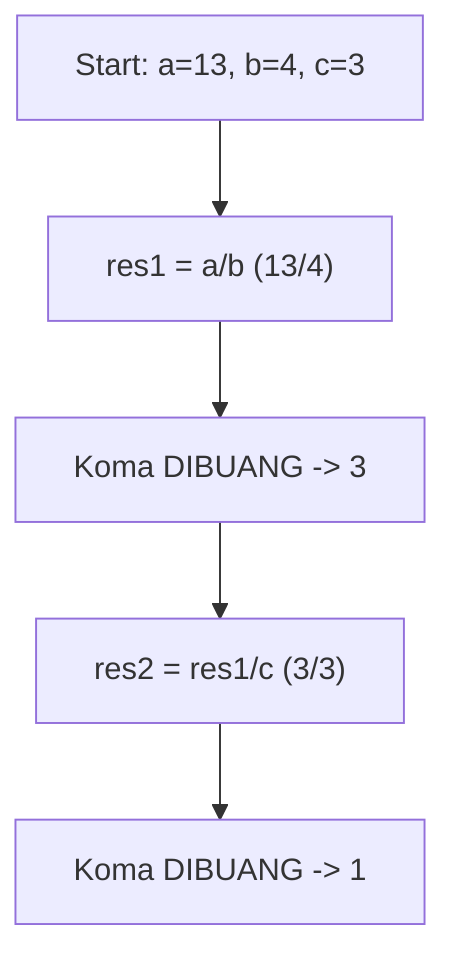

**📖 Cara Membaca Diagram:**
Mulai: a=13, b=4, c=3. Di baris `res1 = a / b`, 13/4 = 3.25, tapi karena `int`, koma dibakar jadi 3. Lalu 3/3 = 1.00, dibakar lagi jadi 1.

---
### Soal 245 (Integer Division)
```cpp
int a = 30;
int b = 4;
int c = 2;
int res1 = a / b;
int res2 = res1 / c;
```
**Pertanyaan:**
1. Berapakah nilai `res1`?
2. Berapakah nilai `res2`?
3. Mengapa `res1` tidak menghasilkan angka desimal?

**Jawaban & Diagnosis:**
1. **7**
2. **3**
3. **Karena tipe datanya `int`, setiap ada koma di belakangnya langsung dipangkas habis (Integer Division).**

**Mermaid Flowchart:**
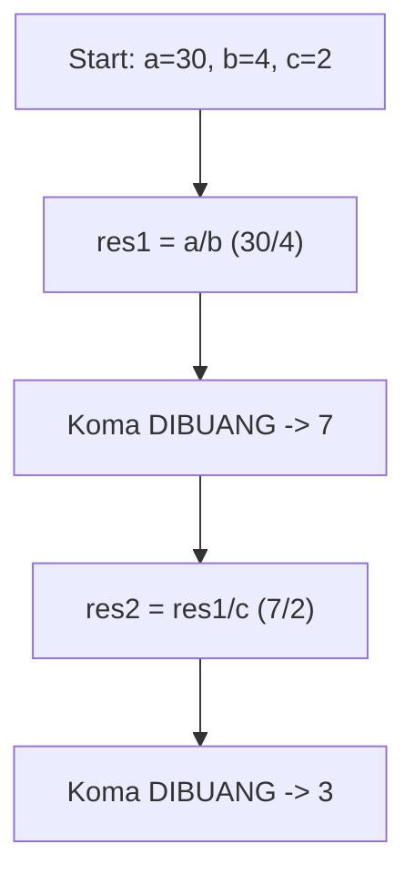

**📖 Cara Membaca Diagram:**
Mulai: a=30, b=4, c=2. Di baris `res1 = a / b`, 30/4 = 7.50, tapi karena `int`, koma dibakar jadi 7. Lalu 7/2 = 3.50, dibakar lagi jadi 3.

---
### Soal 246 (Integer Division)
```cpp
int a = 33;
int b = 6;
int c = 5;
int res1 = a / b;
int res2 = res1 / c;
```
**Pertanyaan:**
1. Berapakah nilai `res1`?
2. Berapakah nilai `res2`?
3. Mengapa `res1` tidak menghasilkan angka desimal?

**Jawaban & Diagnosis:**
1. **5**
2. **1**
3. **Karena tipe datanya `int`, setiap ada koma di belakangnya langsung dipangkas habis (Integer Division).**

**Mermaid Flowchart:**
```mermaid
graph TD
    A[Start: a=33, b=6, c=5] --> B["res1 = a/b (33/6)"]
    B --> C["Koma DIBUANG -> 5"]
    C --> D["res2 = res1/c (5/5)"]
    D --> E["Koma DIBUANG -> 1"]
```

**📖 Cara Membaca Diagram:**
Mulai: a=33, b=6, c=5. Di baris `res1 = a / b`, 33/6 = 5.50, tapi karena `int`, koma dibakar jadi 5. Lalu 5/5 = 1.00, dibakar lagi jadi 1.

---
### Soal 247 (Integer Division)
```cpp
int a = 37;
int b = 8;
int c = 6;
int res1 = a / b;
int res2 = res1 / c;
```
**Pertanyaan:**
1. Berapakah nilai `res1`?
2. Berapakah nilai `res2`?
3. Mengapa `res1` tidak menghasilkan angka desimal?

**Jawaban & Diagnosis:**
1. **4**
2. **0**
3. **Karena tipe datanya `int`, setiap ada koma di belakangnya langsung dipangkas habis (Integer Division).**

**Mermaid Flowchart:**
```mermaid
graph TD
    A[Start: a=37, b=8, c=6] --> B["res1 = a/b (37/8)"]
    B --> C["Koma DIBUANG -> 4"]
    C --> D["res2 = res1/c (4/6)"]
    D --> E["Koma DIBUANG -> 0"]
```

**📖 Cara Membaca Diagram:**
Mulai: a=37, b=8, c=6. Di baris `res1 = a / b`, 37/8 = 4.62, tapi karena `int`, koma dibakar jadi 4. Lalu 4/6 = 0.67, dibakar lagi jadi 0.

---
### Soal 248 (Integer Division)
```cpp
int a = 49;
int b = 9;
int c = 6;
int res1 = a / b;
int res2 = res1 / c;
```
**Pertanyaan:**
1. Berapakah nilai `res1`?
2. Berapakah nilai `res2`?
3. Mengapa `res1` tidak menghasilkan angka desimal?

**Jawaban & Diagnosis:**
1. **5**
2. **0**
3. **Karena tipe datanya `int`, setiap ada koma di belakangnya langsung dipangkas habis (Integer Division).**

**Mermaid Flowchart:**
```mermaid
graph TD
    A[Start: a=49, b=9, c=6] --> B["res1 = a/b (49/9)"]
    B --> C["Koma DIBUANG -> 5"]
    C --> D["res2 = res1/c (5/6)"]
    D --> E["Koma DIBUANG -> 0"]
```

**📖 Cara Membaca Diagram:**
Mulai: a=49, b=9, c=6. Di baris `res1 = a / b`, 49/9 = 5.44, tapi karena `int`, koma dibakar jadi 5. Lalu 5/6 = 0.83, dibakar lagi jadi 0.

---
### Soal 249 (Modulo Magic)
```cpp
int x = 89;
int m1 = 2;
int m2 = 5;
int res_x = x % m1;
int res_y = x % m2;
```
**Pertanyaan:**
1. Apakah `x` genap atau ganjil?
2. Berapakah sisa bagi `x % m2`?
3. Apa guna operator `%` dalam OSN-K?

**Jawaban & Diagnosis:**
1. **Ganjil**
2. **4**
3. **Untuk mencari sisa bagi (sisa kelereng) atau mendeteksi pola perulangan/genap-ganjil.**

**Mermaid Flowchart:**
```mermaid
graph TD
    A[x=89] --> Bx % 2 == 0?
    B -- Ya --> C[Genap]
    B -- Tidak --> D[Ganjil]
    A --> E["x % 5"]
    E --> F["Sisa: 4"]
```

**📖 Cara Membaca Diagram:**
x=89. Cek `x % 2`: 89%2 = 1. Jika 0 genap, jika 1 ganjil. Cek `x % 5`: 89/5 = 17 sisa 4.

---
### Soal 250 (ASCII Math)
```cpp
char c = 'E';
int jump = 3;
char result = c + jump;
```
**Pertanyaan:**
1. Berapakah nilai ASCII batin dari 'E'?
2. Karakter apa yang tersimpan dalam variabel `result`?
3. Jika `result` dicetak sebagai `int`, angka berapa yang muncul?

**Jawaban & Diagnosis:**
1. **69**
2. **H**
3. **72**

**Mermaid Flowchart:**
```mermaid
graph LR
    A["'E' (ASCII 69)"] --> B["+ 3"]
    B --> C["ASCII 72"]
    C --> D["'H'"]
```

**📖 Cara Membaca Diagram:**
Karakter 'E' punya kode batin ASCII 69. Ditambah 3 langkah menjadi 72. Kode 72 adalah huruf 'H'.

---
