🔙 **[Kembali ke Daftar Soal](./README.md)**

---

# Latihan Soal Part C - Modul 01 - Set 11

### Soal 251
```cpp
int n = 43;
int m = 3;
int res = n % m;
```
**Pertanyaan:**
1. Berapakah hasil akhirnya?
2. Mengapa demikian?

**Jawaban & Diagnosis:**
1. **1**
2. Lihat Tracing.

**Mermaid Flowchart:**


**📖 Penjelasan:**
**Langkah Tracing:**
1. n=43, m=3.
2. 43 dibagi 3 sisa 1.
3. Hasil: 1.

---
### Soal 252
```cpp
char ch = 'A';
ch = ch + (2);
```
**Pertanyaan:**
1. Berapakah hasil akhirnya?
2. Mengapa demikian?

**Jawaban & Diagnosis:**
1. **C**
2. Lihat Tracing.

**Mermaid Flowchart:**
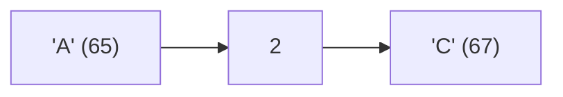

**📖 Penjelasan:**
**Langkah Tracing:**
1. ch='A' (ASCII 65).
2. 65 + (2) = 67.
3. Hasil: 'C'.

---
### Soal 253
```cpp
char ch = 'm';
ch = ch + (5);
```
**Pertanyaan:**
1. Berapakah hasil akhirnya?
2. Mengapa demikian?

**Jawaban & Diagnosis:**
1. **r**
2. Lihat Tracing.

**Mermaid Flowchart:**
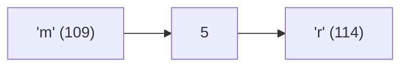

**📖 Penjelasan:**
**Langkah Tracing:**
1. ch='m' (ASCII 109).
2. 109 + (5) = 114.
3. Hasil: 'r'.

---
### Soal 254
```cpp
int n = 14;
int m = 5;
int res = n % m;
```
**Pertanyaan:**
1. Berapakah hasil akhirnya?
2. Mengapa demikian?

**Jawaban & Diagnosis:**
1. **4**
2. Lihat Tracing.

**Mermaid Flowchart:**
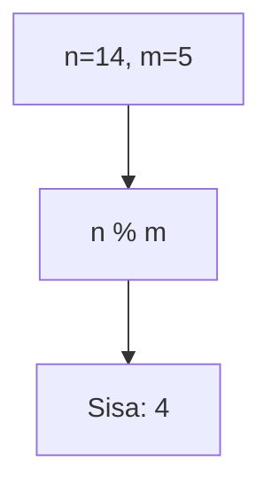

**📖 Penjelasan:**
**Langkah Tracing:**
1. n=14, m=5.
2. 14 dibagi 5 sisa 4.
3. Hasil: 4.

---
### Soal 255
```cpp
double val = 84.89;
int res = (int)val;
```
**Pertanyaan:**
1. Berapakah hasil akhirnya?
2. Mengapa demikian?

**Jawaban & Diagnosis:**
1. **84**
2. Lihat Tracing.

**Mermaid Flowchart:**
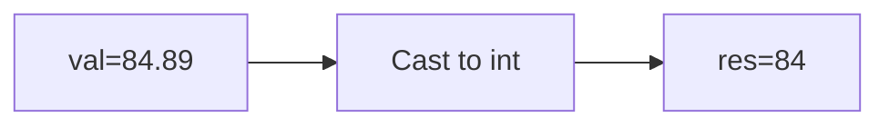

**📖 Penjelasan:**
**Langkah Tracing:**
1. val=84.89.
2. Desimal dihilangkan.
3. Hasil: 84.

---
### Soal 256
```cpp
int x = 42, y = 8;
int res = x / y;
```
**Pertanyaan:**
1. Berapakah hasil akhirnya?
2. Mengapa demikian?

**Jawaban & Diagnosis:**
1. **5**
2. Lihat Tracing.

**Mermaid Flowchart:**
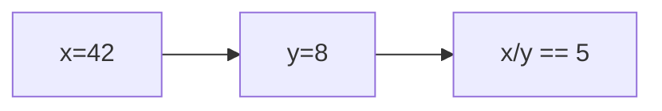

**📖 Penjelasan:**
**Langkah Tracing:**
1. x=42, y=8.
2. 42/8 = 5.25. Karena `int`, desimal dibuang.
3. Hasil: 5.

---
### Soal 257
```cpp
int n = 11;
int m = 3;
int res = n % m;
```
**Pertanyaan:**
1. Berapakah hasil akhirnya?
2. Mengapa demikian?

**Jawaban & Diagnosis:**
1. **2**
2. Lihat Tracing.

**Mermaid Flowchart:**
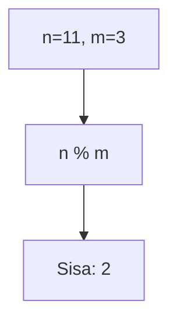

**📖 Penjelasan:**
**Langkah Tracing:**
1. n=11, m=3.
2. 11 dibagi 3 sisa 2.
3. Hasil: 2.

---
### Soal 258
```cpp
int x = 96, y = 7;
int res = x / y;
```
**Pertanyaan:**
1. Berapakah hasil akhirnya?
2. Mengapa demikian?

**Jawaban & Diagnosis:**
1. **13**
2. Lihat Tracing.

**Mermaid Flowchart:**
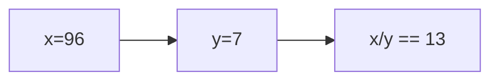

**📖 Penjelasan:**
**Langkah Tracing:**
1. x=96, y=7.
2. 96/7 = 13.71. Karena `int`, desimal dibuang.
3. Hasil: 13.

---
### Soal 259
```cpp
int n = 19;
int m = 3;
int res = n % m;
```
**Pertanyaan:**
1. Berapakah hasil akhirnya?
2. Mengapa demikian?

**Jawaban & Diagnosis:**
1. **1**
2. Lihat Tracing.

**Mermaid Flowchart:**
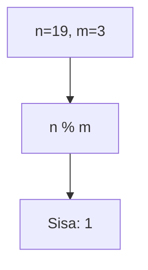

**📖 Penjelasan:**
**Langkah Tracing:**
1. n=19, m=3.
2. 19 dibagi 3 sisa 1.
3. Hasil: 1.

---
### Soal 260
```cpp
int x = 32, m = 3;
int res = x / m;
```
**Pertanyaan:**
1. Berapakah hasil akhirnya?
2. Mengapa demikian?

**Jawaban & Diagnosis:**
1. **10**
2. Lihat Tracing.

**Mermaid Flowchart:**
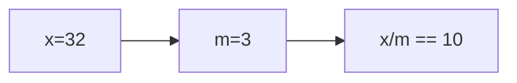

**📖 Penjelasan:**
**Langkah Tracing:**
1. x=32, m=3.
2. 32/3 = 10.67. Karena `int`, desimal dibuang.
3. Hasil: 10.

---
### Soal 261
```cpp
int x = 100, y = 3;
int res = x / y;
```
**Pertanyaan:**
1. Berapakah hasil akhirnya?
2. Mengapa demikian?

**Jawaban & Diagnosis:**
1. **33**
2. Lihat Tracing.

**Mermaid Flowchart:**
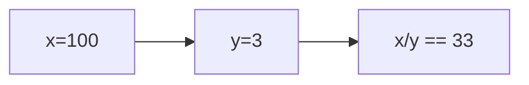

**📖 Penjelasan:**
**Langkah Tracing:**
1. x=100, y=3.
2. 100/3 = 33.33. Karena `int`, desimal dibuang.
3. Hasil: 33.

---
### Soal 262
```cpp
char ch = 'B';
ch = ch + (2);
```
**Pertanyaan:**
1. Berapakah hasil akhirnya?
2. Mengapa demikian?

**Jawaban & Diagnosis:**
1. **D**
2. Lihat Tracing.

**Mermaid Flowchart:**
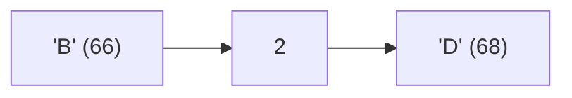

**📖 Penjelasan:**
**Langkah Tracing:**
1. ch='B' (ASCII 66).
2. 66 + (2) = 68.
3. Hasil: 'D'.

---
### Soal 263
```cpp
int n = 36;
int m = 5;
int res = n % m;
```
**Pertanyaan:**
1. Berapakah hasil akhirnya?
2. Mengapa demikian?

**Jawaban & Diagnosis:**
1. **1**
2. Lihat Tracing.

**Mermaid Flowchart:**
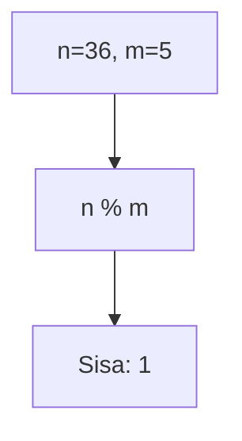

**📖 Penjelasan:**
**Langkah Tracing:**
1. n=36, m=5.
2. 36 dibagi 5 sisa 1.
3. Hasil: 1.

---
### Soal 264
```cpp
int n = 90, m = 4;
int res = n / m;
```
**Pertanyaan:**
1. Berapakah hasil akhirnya?
2. Mengapa demikian?

**Jawaban & Diagnosis:**
1. **22**
2. Lihat Tracing.

**Mermaid Flowchart:**
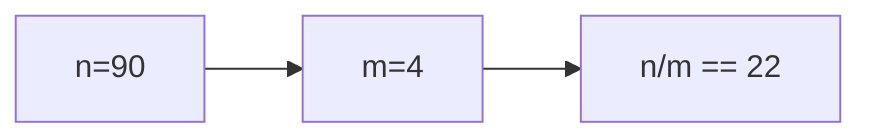

**📖 Penjelasan:**
**Langkah Tracing:**
1. n=90, m=4.
2. 90/4 = 22.50. Karena `int`, desimal dibuang.
3. Hasil: 22.

---
### Soal 265
```cpp
int n = 26, m = 5;
int res = n / m;
```
**Pertanyaan:**
1. Berapakah hasil akhirnya?
2. Mengapa demikian?

**Jawaban & Diagnosis:**
1. **5**
2. Lihat Tracing.

**Mermaid Flowchart:**
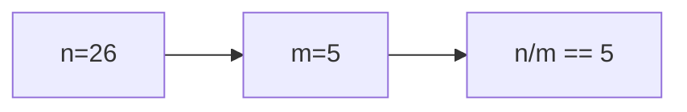

**📖 Penjelasan:**
**Langkah Tracing:**
1. n=26, m=5.
2. 26/5 = 5.20. Karena `int`, desimal dibuang.
3. Hasil: 5.

---
### Soal 266
```cpp
int n = 37;
int m = 2;
int res = n % m;
```
**Pertanyaan:**
1. Berapakah hasil akhirnya?
2. Mengapa demikian?

**Jawaban & Diagnosis:**
1. **1**
2. Lihat Tracing.

**Mermaid Flowchart:**
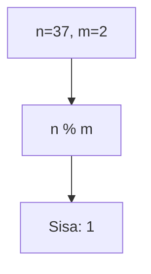

**📖 Penjelasan:**
**Langkah Tracing:**
1. n=37, m=2.
2. 37 dibagi 2 sisa 1.
3. Hasil: 1.

---
### Soal 267
```cpp
double val = 99.41;
int res = (int)val;
```
**Pertanyaan:**
1. Berapakah hasil akhirnya?
2. Mengapa demikian?

**Jawaban & Diagnosis:**
1. **99**
2. Lihat Tracing.

**Mermaid Flowchart:**
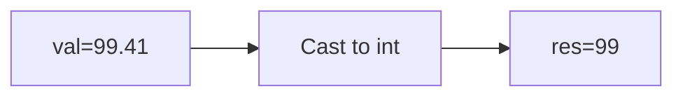

**📖 Penjelasan:**
**Langkah Tracing:**
1. val=99.41.
2. Desimal dihilangkan.
3. Hasil: 99.

---
### Soal 268
```cpp
double val = 69.22;
int res = (int)val;
```
**Pertanyaan:**
1. Berapakah hasil akhirnya?
2. Mengapa demikian?

**Jawaban & Diagnosis:**
1. **69**
2. Lihat Tracing.

**Mermaid Flowchart:**
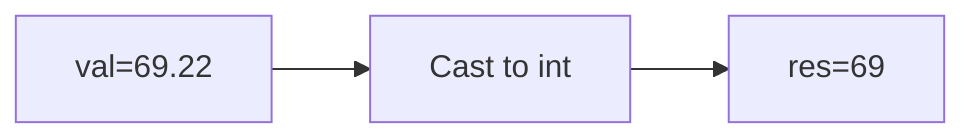

**📖 Penjelasan:**
**Langkah Tracing:**
1. val=69.22.
2. Desimal dihilangkan.
3. Hasil: 69.

---
### Soal 269
```cpp
double val = 13.68;
int res = (int)val;
```
**Pertanyaan:**
1. Berapakah hasil akhirnya?
2. Mengapa demikian?

**Jawaban & Diagnosis:**
1. **13**
2. Lihat Tracing.

**Mermaid Flowchart:**
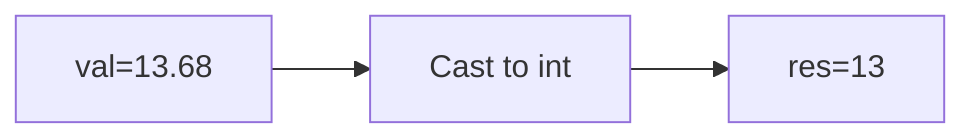

**📖 Penjelasan:**
**Langkah Tracing:**
1. val=13.68.
2. Desimal dihilangkan.
3. Hasil: 13.

---
### Soal 270
```cpp
int n = 21;
int m = 3;
int res = n % m;
```
**Pertanyaan:**
1. Berapakah hasil akhirnya?
2. Mengapa demikian?

**Jawaban & Diagnosis:**
1. **0**
2. Lihat Tracing.

**Mermaid Flowchart:**
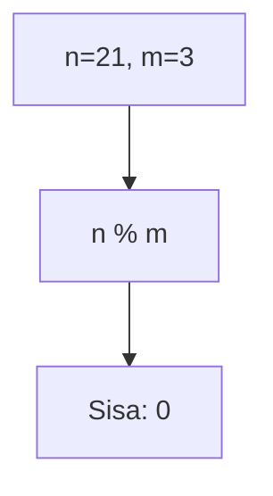

**📖 Penjelasan:**
**Langkah Tracing:**
1. n=21, m=3.
2. 21 dibagi 3 sisa 0.
3. Hasil: 0.

---
### Soal 271
```cpp
double val = 61.75;
int res = (int)val;
```
**Pertanyaan:**
1. Berapakah hasil akhirnya?
2. Mengapa demikian?

**Jawaban & Diagnosis:**
1. **61**
2. Lihat Tracing.

**Mermaid Flowchart:**
```mermaid
graph LR
A["val=61.75"] --> B["Cast to int"]
B --> C["res=61"]
```

**📖 Penjelasan:**
**Langkah Tracing:**
1. val=61.75.
2. Desimal dihilangkan.
3. Hasil: 61.

---
### Soal 272
```cpp
char ch = 'A';
ch = ch + (5);
```
**Pertanyaan:**
1. Berapakah hasil akhirnya?
2. Mengapa demikian?

**Jawaban & Diagnosis:**
1. **F**
2. Lihat Tracing.

**Mermaid Flowchart:**
```mermaid
graph LR
A["'A' (65)"] --> B["5"]
B --> C["'F' (70)"]
```

**📖 Penjelasan:**
**Langkah Tracing:**
1. ch='A' (ASCII 65).
2. 65 + (5) = 70.
3. Hasil: 'F'.

---
### Soal 273
```cpp
double val = 75.73;
int res = (int)val;
```
**Pertanyaan:**
1. Berapakah hasil akhirnya?
2. Mengapa demikian?

**Jawaban & Diagnosis:**
1. **75**
2. Lihat Tracing.

**Mermaid Flowchart:**
```mermaid
graph LR
A["val=75.73"] --> B["Cast to int"]
B --> C["res=75"]
```

**📖 Penjelasan:**
**Langkah Tracing:**
1. val=75.73.
2. Desimal dihilangkan.
3. Hasil: 75.

---
### Soal 274
```cpp
int n = 41;
int m = 3;
int res = n % m;
```
**Pertanyaan:**
1. Berapakah hasil akhirnya?
2. Mengapa demikian?

**Jawaban & Diagnosis:**
1. **2**
2. Lihat Tracing.

**Mermaid Flowchart:**
```mermaid
graph TD
A["n=41, m=3"] --> B["n % m"]
B --> C["Sisa: 2"]
```

**📖 Penjelasan:**
**Langkah Tracing:**
1. n=41, m=3.
2. 41 dibagi 3 sisa 2.
3. Hasil: 2.

---
### Soal 275
```cpp
char ch = 'A';
ch = ch + (1);
```
**Pertanyaan:**
1. Berapakah hasil akhirnya?
2. Mengapa demikian?

**Jawaban & Diagnosis:**
1. **B**
2. Lihat Tracing.

**Mermaid Flowchart:**
```mermaid
graph LR
A["'A' (65)"] --> B["1"]
B --> C["'B' (66)"]
```

**📖 Penjelasan:**
**Langkah Tracing:**
1. ch='A' (ASCII 65).
2. 65 + (1) = 66.
3. Hasil: 'B'.

---
